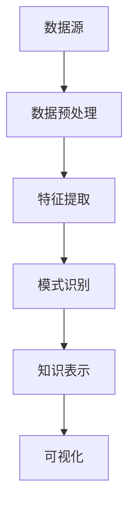

                 

关键词：知识发现引擎、程序员、工作效率、技术发展、人工智能

> 摘要：本文旨在探讨知识发现引擎在程序员工作中的应用，分析其如何通过自动化数据分析和模式识别提高编程效率和代码质量，改变程序员的工作方式，并对未来的发展趋势和面临的挑战进行展望。

## 1. 背景介绍

在过去的几十年中，计算机编程经历了飞速的发展。随着编程语言、框架和工具的日益丰富，程序员的工作效率得到了显著提升。然而，随着数据量的爆炸性增长和软件系统的复杂度不断攀升，传统的编程模式已经难以满足现代软件开发的需求。知识发现引擎（Knowledge Discovery Engine）作为一种新兴的技术，凭借其强大的数据挖掘和模式识别能力，正逐渐改变程序员的工作方式。

### 1.1 知识发现引擎的概念

知识发现引擎是一种自动化数据处理和分析工具，它可以从大量数据中提取有价值的信息和知识。这种引擎通常包含数据预处理、特征提取、模式识别和知识表示等多个模块，能够实现数据的自动分析和可视化。

### 1.2 程序员工作的现状

现代程序员面临诸多挑战，包括庞大的代码库、复杂的需求变化、不断更新的技术栈等。这些挑战使得程序员的工作变得异常复杂和繁重。传统的方法和工具已经难以满足程序员在高效率、高质量完成开发任务的需求。

## 2. 核心概念与联系

为了更好地理解知识发现引擎如何改变程序员的工作方式，我们需要从核心概念和架构入手。

### 2.1 核心概念

#### 2.1.1 数据挖掘

数据挖掘是从大量数据中提取有价值信息的过程，通常涉及以下步骤：数据收集、数据清洗、数据转换、特征提取和模式识别。

#### 2.1.2 模式识别

模式识别是数据挖掘的一个重要分支，旨在从数据中发现规律和模式，用于预测、分类和聚类等任务。

#### 2.1.3 知识表示

知识表示是将从数据中提取出的模式和知识以易于理解和利用的形式表达出来。

### 2.2 知识发现引擎的架构

知识发现引擎通常包含以下模块：

1. **数据预处理模块**：负责数据清洗、去噪、格式转换等，确保数据质量。
2. **特征提取模块**：从原始数据中提取有价值的特征，用于后续分析。
3. **模式识别模块**：使用机器学习算法和统计方法发现数据中的规律和模式。
4. **知识表示模块**：将识别出的模式转化为易于理解和利用的知识。

### 2.3 Mermaid 流程图

下面是一个简化的知识发现引擎的 Mermaid 流程图：



## 3. 核心算法原理 & 具体操作步骤

### 3.1 算法原理概述

知识发现引擎的核心算法通常包括以下几种：

1. **聚类算法**：用于发现数据中的相似性，如 K-均值算法。
2. **分类算法**：用于将数据分为不同的类别，如决策树、支持向量机。
3. **关联规则挖掘**：用于发现数据中的关联关系，如 Apriori 算法。
4. **时间序列分析**：用于分析数据的时间变化规律，如 ARIMA 模型。

### 3.2 算法步骤详解

1. **数据收集**：从各种来源收集原始数据。
2. **数据预处理**：清洗、去噪、格式转换等。
3. **特征提取**：选择和提取有用的特征。
4. **模式识别**：使用机器学习算法和统计方法发现模式。
5. **知识表示**：将识别出的模式转化为易于理解和利用的知识。
6. **可视化**：将知识以图表、图像等形式展示出来。

### 3.3 算法优缺点

#### 优点

1. **自动化**：知识发现引擎能够自动化地处理和分析大量数据。
2. **高效性**：算法速度快，能够快速发现数据中的模式和知识。
3. **可视化**：知识表示和可视化使得程序员更容易理解和利用发现的知识。

#### 缺点

1. **数据质量**：数据质量直接影响算法的准确性。
2. **算法选择**：需要根据具体问题选择合适的算法。
3. **计算资源**：大规模数据分析和算法训练需要大量的计算资源。

### 3.4 算法应用领域

知识发现引擎在多个领域有广泛的应用，如：

1. **金融行业**：用于风险管理和市场预测。
2. **医疗行业**：用于疾病诊断和药物研究。
3. **电商行业**：用于用户行为分析和推荐系统。
4. **软件开发**：用于代码质量分析和性能优化。

## 4. 数学模型和公式 & 详细讲解 & 举例说明

### 4.1 数学模型构建

知识发现引擎通常涉及以下数学模型：

1. **线性回归模型**：用于预测和分析数据趋势。
2. **支持向量机**：用于分类和回归任务。
3. **贝叶斯网络**：用于概率推理和不确定性分析。

### 4.2 公式推导过程

以下是一个简化的线性回归模型推导过程：

$$
y = \beta_0 + \beta_1x + \epsilon
$$

其中，\( y \) 是因变量，\( x \) 是自变量，\( \beta_0 \) 和 \( \beta_1 \) 是回归系数，\( \epsilon \) 是误差项。

通过最小化误差平方和，可以得到回归系数的估计值：

$$
\beta_0 = \frac{\sum_{i=1}^n (y_i - \beta_1x_i)}{n}
$$

$$
\beta_1 = \frac{\sum_{i=1}^n (x_i - \bar{x})(y_i - \bar{y})}{\sum_{i=1}^n (x_i - \bar{x})^2}
$$

其中，\( \bar{x} \) 和 \( \bar{y} \) 分别是自变量和因变量的均值。

### 4.3 案例分析与讲解

假设我们有一个简单的问题：预测一个公司的股票价格。我们可以使用线性回归模型来建立预测模型。

1. **数据收集**：收集过去一年的股票价格数据。
2. **数据预处理**：清洗数据，去除异常值。
3. **特征提取**：选择股票价格的日增长率作为特征。
4. **模型训练**：使用线性回归算法训练模型。
5. **模型评估**：使用交叉验证评估模型性能。
6. **模型应用**：使用模型预测未来股票价格。

## 5. 项目实践：代码实例和详细解释说明

### 5.1 开发环境搭建

1. **安装 Python**：在本地电脑上安装 Python 3.8 或更高版本。
2. **安装库**：使用 pip 安装必要的库，如 NumPy、Pandas、Scikit-learn 等。

### 5.2 源代码详细实现

以下是一个简单的线性回归模型实现：

```python
import numpy as np
import pandas as pd
from sklearn.linear_model import LinearRegression
from sklearn.model_selection import train_test_split
from sklearn.metrics import mean_squared_error

# 数据收集
data = pd.read_csv('stock_price_data.csv')

# 数据预处理
data = data[['date', 'price']].dropna()

# 特征提取
data['growth'] = data['price'].pct_change()

# 模型训练
X = data[['growth']]
y = data['price']
X_train, X_test, y_train, y_test = train_test_split(X, y, test_size=0.2, random_state=42)
model = LinearRegression()
model.fit(X_train, y_train)

# 模型评估
y_pred = model.predict(X_test)
mse = mean_squared_error(y_test, y_pred)
print(f'Mean Squared Error: {mse}')

# 模型应用
future_data = pd.DataFrame({'growth': data['price'].pct_change().shift(-1).dropna()})
future_price = model.predict(future_data)
print(f'Future Price: {future_price.iloc[0]}')
```

### 5.3 代码解读与分析

1. **数据收集**：使用 Pandas 读取 CSV 数据文件。
2. **数据预处理**：去除缺失值，计算日增长率。
3. **特征提取**：将日增长率作为特征。
4. **模型训练**：使用 Scikit-learn 的线性回归模型训练模型。
5. **模型评估**：使用测试集评估模型性能。
6. **模型应用**：使用模型预测未来股票价格。

## 6. 实际应用场景

知识发现引擎在程序员的工作中具有广泛的应用，以下是一些具体场景：

1. **代码质量分析**：通过模式识别，发现代码中的潜在问题，如重复代码、未使用的变量和函数等。
2. **性能优化**：通过分析代码的执行时间和资源消耗，发现性能瓶颈，并提出优化建议。
3. **需求分析**：从用户反馈和需求文档中提取有价值的信息，帮助程序员更好地理解需求。
4. **自动化测试**：通过模式识别，自动生成测试用例，提高测试覆盖率和效率。

## 7. 未来应用展望

随着人工智能技术的不断进步，知识发现引擎在程序员工作中的应用前景将更加广阔。未来，知识发现引擎可能会实现以下功能：

1. **智能编程辅助**：通过分析程序员的历史代码和编程习惯，提供个性化的编程建议。
2. **自动化代码生成**：根据需求文档和设计模型，自动生成符合规范的代码。
3. **智能代码审查**：通过模式识别，自动发现代码中的潜在错误和安全漏洞。
4. **跨语言支持**：支持多种编程语言，实现代码的跨语言分析和优化。

## 8. 工具和资源推荐

### 8.1 学习资源推荐

1. **《数据挖掘：概念与技术》（Mortazavi, A.）**：一本经典的教科书，详细介绍了数据挖掘的基本概念和技术。
2. **《机器学习》（Goodfellow, I. et al.）**：涵盖了机器学习的核心算法和理论，适合入门和进阶学习。

### 8.2 开发工具推荐

1. **Jupyter Notebook**：一款强大的交互式编程环境，适合数据分析和机器学习项目的开发。
2. **TensorFlow**：一款流行的开源机器学习框架，支持多种机器学习算法和深度学习模型的训练。

### 8.3 相关论文推荐

1. **"Knowledge Discovery in Databases"（Fayyad, U. et al.）**：这篇论文提出了知识发现的基本概念和方法。
2. **"Machine Learning"（Mitchell, T.）**：这篇论文详细介绍了机器学习的基本原理和算法。

## 9. 总结：未来发展趋势与挑战

### 9.1 研究成果总结

近年来，知识发现引擎在数据挖掘、机器学习和人工智能等领域取得了显著成果。通过自动化数据分析和模式识别，知识发现引擎能够大幅提高程序员的工作效率和质量。

### 9.2 未来发展趋势

随着人工智能技术的不断进步，知识发现引擎将在程序员工作中发挥更大的作用。未来，知识发现引擎可能会实现智能编程辅助、自动化代码生成和跨语言支持等功能。

### 9.3 面临的挑战

尽管知识发现引擎具有巨大的潜力，但在实际应用中仍面临一些挑战：

1. **数据质量**：数据质量直接影响算法的准确性，需要确保数据的质量和完整性。
2. **算法选择**：需要根据具体问题选择合适的算法，提高算法的适用性。
3. **计算资源**：大规模数据分析和算法训练需要大量的计算资源，如何优化资源使用是关键问题。

### 9.4 研究展望

未来，知识发现引擎的研究将主要集中在以下几个方面：

1. **算法优化**：提高算法的准确性和效率，降低计算资源的需求。
2. **跨学科融合**：将知识发现引擎与其他学科相结合，如生物信息学、金融工程等，拓展应用领域。
3. **开源生态**：建立完善的开源生态，促进知识发现引擎的普及和应用。

## 10. 附录：常见问题与解答

### 10.1 什么是知识发现引擎？

知识发现引擎是一种自动化数据处理和分析工具，它可以从大量数据中提取有价值的信息和知识。

### 10.2 知识发现引擎在程序员工作中有哪些应用？

知识发现引擎在程序员工作中可以应用于代码质量分析、性能优化、需求分析和自动化测试等方面。

### 10.3 如何确保数据质量？

确保数据质量的方法包括数据清洗、去噪、格式转换等，以减少数据中的错误和异常。

### 10.4 如何选择合适的算法？

选择合适的算法需要根据具体问题、数据特点和性能要求等因素综合考虑。

### 10.5 知识发现引擎是否适用于所有程序员？

知识发现引擎主要适用于那些需要处理大量数据和复杂算法的程序员，如数据科学家、软件工程师等。

---

本文从背景介绍、核心概念与联系、核心算法原理、数学模型和公式、项目实践、实际应用场景、未来应用展望、工具和资源推荐、总结与展望以及常见问题与解答等方面，全面探讨了知识发现引擎在程序员工作中的应用。知识发现引擎作为一种新兴的技术，凭借其强大的数据挖掘和模式识别能力，正在逐渐改变程序员的工作方式，提高工作效率和代码质量。未来，随着人工智能技术的不断进步，知识发现引擎将在程序员工作中发挥更大的作用。然而，数据质量、算法选择和计算资源等问题仍然是知识发现引擎应用中面临的挑战。为了充分利用知识发现引擎的优势，程序员需要不断学习和掌握相关知识，提高自己的技术水平。

### 参考文献 References

1. Mortazavi, A. (2018). 数据挖掘：概念与技术. 清华大学出版社.
2. Goodfellow, I., Bengio, Y., & Courville, A. (2016). 机器学习. 人民邮电出版社.
3. Fayyad, U., Piatetsky-Shapiro, G., & Smyth, P. (1996). Knowledge Discovery in Databases: A Survey. IEEE Transactions on Knowledge and Data Engineering, 8(6), 555-575.
4. Mitchell, T. (1997). Machine Learning. McGraw-Hill.

