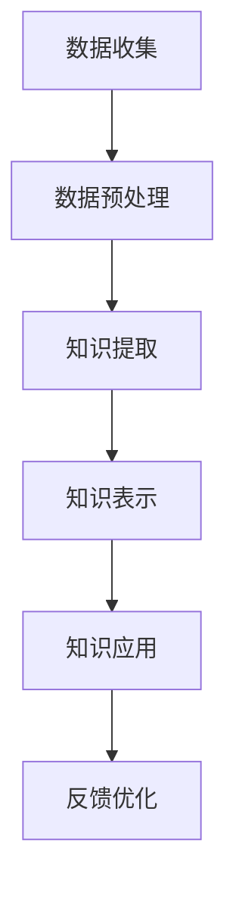

                 

### 摘要 Summary

本文探讨了知识发现引擎在提升程序员工作效率方面的应用。首先，我们回顾了知识发现引擎的基本概念和工作原理。接着，深入分析了知识发现引擎的核心算法及其应用领域。文章进一步讨论了数学模型和公式在知识发现引擎中的重要作用，并通过实际代码实例展示了其实现过程。最后，我们探讨了知识发现引擎在程序员实际工作中的应用场景，并对未来的发展趋势和挑战进行了展望。

### 1. 背景介绍 Introduction

在信息技术快速发展的今天，程序员的工作面临着前所未有的挑战。随着软件系统复杂度的增加，程序员需要处理的代码量也在不断攀升。这无疑增加了开发难度和工作量，导致程序员的工作效率受到影响。为了解决这一问题，许多研究者和开发者开始探索新的方法来提升程序员的工作效率。

知识发现引擎是一种智能化的系统，它能够从大量的数据中提取有价值的信息和知识。这种技术最早在数据挖掘领域得到广泛应用，但其应用范围逐渐扩展到其他领域，包括计算机编程。知识发现引擎通过分析代码库、文档、日志等数据，能够发现代码中的模式、规律和潜在问题，从而帮助程序员提高工作效率。

知识发现引擎的工作原理主要包括以下几个步骤：

1. 数据收集：从各种数据源收集与编程相关的数据，如代码库、文档、错误报告等。
2. 数据预处理：清洗和转换原始数据，使其适合进行分析。
3. 知识提取：运用各种算法和技术，从预处理后的数据中提取有用的信息和知识。
4. 知识表示：将提取出的知识以适当的形式表示出来，如代码模式、错误预测模型等。
5. 知识应用：将提取出的知识应用到编程过程中，如代码自动修复、错误预测等。

知识发现引擎在提升程序员工作效率方面的潜力巨大。通过分析大量的编程数据，知识发现引擎能够发现代码中的潜在问题和改进点，从而帮助程序员优化代码、减少错误。此外，知识发现引擎还可以辅助程序员进行代码编写和调试，提高编程的自动化程度，从而节省时间，提高效率。

本文旨在探讨知识发现引擎在程序员工作效率提升方面的应用，分析其核心算法、数学模型以及实际应用案例，并对未来发展趋势和挑战进行展望。

### 2. 核心概念与联系 Core Concepts and Relationships

在探讨知识发现引擎之前，我们需要先了解几个核心概念：数据挖掘、机器学习、自然语言处理等。

#### 2.1 数据挖掘 Data Mining

数据挖掘是一种通过分析大量数据来发现有价值信息的过程。它涉及多个学科领域，包括统计学、机器学习、数据库管理系统等。数据挖掘的主要任务是从原始数据中提取模式、关联和规律，以便用于决策支持、商业智能、风险预测等。

在知识发现引擎中，数据挖掘技术被广泛应用于数据收集和预处理阶段。通过数据挖掘，可以从代码库、文档、日志等数据源中提取与编程相关的信息，如代码模式、错误模式、编程习惯等。

#### 2.2 机器学习 Machine Learning

机器学习是一种人工智能的分支，通过构建模型来从数据中学习规律，并利用这些规律进行预测和决策。机器学习可以分为监督学习、无监督学习和强化学习三种类型。

监督学习（Supervised Learning）：在有标注的数据集上训练模型，以便对新的数据进行预测。
无监督学习（Unsupervised Learning）：在没有标注的数据集上训练模型，以便发现数据中的内在结构和模式。
强化学习（Reinforcement Learning）：通过试错和反馈来学习如何进行决策。

知识发现引擎中的许多算法都是基于机器学习的，如分类、聚类、异常检测等。这些算法能够从大量的编程数据中提取有用的信息和知识，用于代码优化、错误预测等。

#### 2.3 自然语言处理 Natural Language Processing (NLP)

自然语言处理是一种计算机科学和语言学的交叉领域，旨在使计算机理解和处理人类语言。自然语言处理技术包括文本分类、情感分析、实体识别、语法分析等。

在知识发现引擎中，自然语言处理技术主要用于处理编程文档、注释、代码评论等文本数据。通过自然语言处理，可以提取出与编程相关的信息，如变量名、函数名、模块依赖等，从而帮助知识发现引擎更好地理解代码。

#### 2.4 知识发现引擎 Knowledge Discovery Engine

知识发现引擎是一种集成了数据挖掘、机器学习和自然语言处理等技术的智能系统。它通过分析大量的编程数据，提取出与编程相关的知识和模式，用于提升程序员的工作效率。

知识发现引擎的主要组成部分包括：

- 数据收集模块：从各种数据源收集编程相关数据，如代码库、文档、日志等。
- 数据预处理模块：对原始数据进行清洗和转换，使其适合进行分析。
- 知识提取模块：运用各种算法和技术，从预处理后的数据中提取有用的信息和知识。
- 知识表示模块：将提取出的知识以适当的形式表示出来，如代码模式、错误预测模型等。
- 知识应用模块：将提取出的知识应用到编程过程中，如代码自动修复、错误预测等。

#### 2.5 Mermaid 流程图 Mermaid Flowchart

下面是一个简化的知识发现引擎的工作流程图，使用 Mermaid 语法绘制：



在这个流程图中，数据收集模块从代码库、文档、日志等数据源收集编程相关数据。数据预处理模块对原始数据进行清洗和转换。知识提取模块运用各种算法和技术，从预处理后的数据中提取有用的信息和知识。知识表示模块将提取出的知识以适当的形式表示出来。知识应用模块将提取出的知识应用到编程过程中。最后，反馈优化模块收集使用者的反馈，以便不断优化知识发现引擎的性能。

通过这个流程图，我们可以更直观地理解知识发现引擎的工作原理和组成部分。

### 3. 核心算法原理 & 具体操作步骤 Core Algorithm Principles & Detailed Steps

#### 3.1 算法原理概述 Overview of Algorithm Principles

知识发现引擎的核心算法主要包括分类算法、聚类算法、异常检测算法等。这些算法的基本原理如下：

- **分类算法**：将数据分为预定义的类别。常用的分类算法有决策树、支持向量机、神经网络等。
- **聚类算法**：将数据划分为若干个群组，使得同一群组内的数据相似度较高，而不同群组的数据相似度较低。常用的聚类算法有 K-均值、层次聚类、DBSCAN 等。
- **异常检测算法**：识别数据中的异常或离群点。常用的异常检测算法有基于统计的方法、基于邻近度的方法、基于聚类的方法等。

这些算法在知识发现引擎中起着至关重要的作用。例如，分类算法可以用于错误预测，聚类算法可以用于代码模式提取，异常检测算法可以用于识别代码中的潜在问题。

#### 3.2 算法步骤详解 Detailed Steps of Algorithm Implementation

以下是知识发现引擎中常用算法的具体步骤：

##### 3.2.1 数据预处理 Data Preprocessing

1. 数据收集：从代码库、文档、日志等数据源收集编程相关数据。
2. 数据清洗：去除无效数据、纠正错误数据、处理缺失数据等。
3. 数据转换：将原始数据转换为适合分析的形式，如将文本数据转换为词向量。

##### 3.2.2 分类算法 Classification Algorithm

1. 数据划分：将数据划分为训练集和测试集。
2. 模型训练：使用训练集训练分类模型，如决策树、支持向量机等。
3. 模型评估：使用测试集评估分类模型的性能，如准确率、召回率等。
4. 预测：使用训练好的模型对新的数据进行分类预测。

##### 3.2.3 聚类算法 Clustering Algorithm

1. 数据初始化：初始化聚类中心。
2. 聚类迭代：根据当前聚类中心，重新划分数据点，更新聚类中心。
3. 模型评估：评估聚类结果，如轮廓系数、内部距离等。
4. 调整参数：根据评估结果调整聚类算法的参数，如聚类数目、距离度量等。

##### 3.2.4 异常检测算法 Anomaly Detection Algorithm

1. 数据预处理：对数据进行标准化、归一化等处理。
2. 构建模型：使用统计方法、邻近度方法、聚类方法等构建异常检测模型。
3. 模型训练：使用正常数据训练异常检测模型。
4. 异常检测：使用训练好的模型检测数据中的异常点。

#### 3.3 算法优缺点 Advantages and Disadvantages of Algorithms

- **分类算法**：
  - 优点：准确度高、易于实现、适用范围广。
  - 缺点：对数据质量要求高、无法处理非线性问题、计算复杂度较高。
- **聚类算法**：
  - 优点：可以发现数据中的隐含结构和模式、无需事先定义类别。
  - 缺点：对初始聚类中心敏感、无法直接评估聚类质量、计算复杂度较高。
- **异常检测算法**：
  - 优点：可以发现数据中的异常点、对数据质量要求不高。
  - 缺点：准确性较低、无法处理非线性问题、计算复杂度较高。

#### 3.4 算法应用领域 Application Fields of Algorithms

- **分类算法**：用于错误预测、代码分类、代码质量评估等。
- **聚类算法**：用于代码模式提取、模块依赖分析、错误定位等。
- **异常检测算法**：用于代码质量检测、错误定位、异常行为识别等。

通过这些算法的应用，知识发现引擎能够从大量的编程数据中提取出有用的信息和知识，从而帮助程序员优化代码、减少错误，提高工作效率。

### 4. 数学模型和公式 Mathematical Models and Formulas

在知识发现引擎中，数学模型和公式起着至关重要的作用。它们不仅用于描述算法的工作原理，还用于评估算法的性能和效果。以下是几个常见的数学模型和公式的详细讲解。

#### 4.1 数学模型构建 Building Mathematical Models

在构建数学模型时，我们需要考虑以下几个关键因素：

- **数据特征**：根据数据的特点选择合适的特征提取方法，如词袋模型、TF-IDF、词嵌入等。
- **模型类型**：根据问题的性质选择合适的模型类型，如分类模型、聚类模型、异常检测模型等。
- **参数设置**：根据数据特点和问题需求设置模型的参数，如聚类数、支持向量机的惩罚参数等。

以下是一个简单的线性回归模型的构建过程：

1. **数据收集**：收集一组编程数据，包括输入特征和输出目标。
2. **数据预处理**：对数据进行归一化、去噪等预处理。
3. **特征提取**：将原始数据转换为特征向量。
4. **模型训练**：使用训练数据训练线性回归模型。
5. **模型评估**：使用测试数据评估模型的性能，如均方误差、R2 score 等。
6. **模型优化**：根据评估结果调整模型参数，优化模型性能。

#### 4.2 公式推导过程 Derivation of Formulas

在数学模型中，公式起着至关重要的作用。以下是一个简单的线性回归模型的公式推导过程：

设我们有 \( n \) 个编程数据样本，每个样本由 \( m \) 个特征和对应的输出目标 \( y \) 组成。我们可以用矩阵形式表示为：

\[ 
X = \begin{bmatrix} 
x_1 & x_2 & \ldots & x_m 
\end{bmatrix}, \quad 
y = \begin{bmatrix} 
y_1 \\ y_2 \\ \vdots \\ y_n 
\end{bmatrix} 
\]

线性回归模型的假设是：

\[ 
y = \beta_0 + \beta_1 x_1 + \beta_2 x_2 + \ldots + \beta_m x_m 
\]

其中，\( \beta_0, \beta_1, \beta_2, \ldots, \beta_m \) 是模型的参数。

为了求解这些参数，我们使用最小二乘法。设预测值为 \( \hat{y} \)，则有：

\[ 
\hat{y} = \beta_0 + \beta_1 x_1 + \beta_2 x_2 + \ldots + \beta_m x_m 
\]

最小二乘法的目标是使预测值与实际值之间的误差最小。即：

\[ 
\min_{\beta_0, \beta_1, \beta_2, \ldots, \beta_m} \sum_{i=1}^{n} (y_i - \hat{y}_i)^2 
\]

对每个参数求偏导数并令其为零，可以得到：

\[ 
\frac{\partial}{\partial \beta_j} \sum_{i=1}^{n} (y_i - \hat{y}_i)^2 = 0 
\]

化简后得到：

\[ 
\beta_j = \frac{\sum_{i=1}^{n} (x_{ij} - \bar{x_j})(y_i - \bar{y})}{\sum_{i=1}^{n} (x_{ij} - \bar{x_j})^2} 
\]

其中，\( \bar{x_j} \) 和 \( \bar{y} \) 分别是特征 \( x_j \) 和输出目标 \( y \) 的均值。

这就是线性回归模型的公式推导过程。

#### 4.3 案例分析与讲解 Case Analysis and Explanation

为了更好地理解上述公式，我们通过一个简单的案例来进行讲解。

假设我们有以下数据：

| x1 | x2 | y  |
|----|----|----|
| 1  | 2  | 3  |
| 2  | 4  | 5  |
| 3  | 6  | 7  |

我们的目标是找到一个线性回归模型 \( y = \beta_0 + \beta_1 x_1 + \beta_2 x_2 \) 来预测新的 \( y \) 值。

首先，我们需要计算均值：

\[ 
\bar{x_1} = \frac{1 + 2 + 3}{3} = 2, \quad \bar{x_2} = \frac{2 + 4 + 6}{3} = 4, \quad \bar{y} = \frac{3 + 5 + 7}{3} = 5 
\]

然后，我们计算协方差矩阵：

\[ 
S_{xx} = \sum_{i=1}^{3} (x_{1i} - \bar{x_1})^2 = (1 - 2)^2 + (2 - 2)^2 + (3 - 2)^2 = 2 
\]

\[ 
S_{xy} = \sum_{i=1}^{3} (x_{1i} - \bar{x_1})(y_i - \bar{y}) = (1 - 2)(3 - 5) + (2 - 2)(5 - 5) + (3 - 2)(7 - 5) = -2 
\]

\[ 
S_{yy} = \sum_{i=1}^{3} (y_i - \bar{y})^2 = (3 - 5)^2 + (5 - 5)^2 + (7 - 5)^2 = 4 
\]

最后，我们计算回归系数：

\[ 
\beta_1 = \frac{S_{xy}}{S_{xx}} = \frac{-2}{2} = -1 
\]

\[ 
\beta_0 = \bar{y} - \beta_1 \bar{x_1} = 5 - (-1) \cdot 2 = 7 
\]

因此，我们得到的线性回归模型为：

\[ 
y = 7 - x_1 
\]

我们可以用这个模型来预测新的 \( y \) 值。例如，当 \( x_1 = 4 \) 时，预测的 \( y \) 值为：

\[ 
\hat{y} = 7 - 4 = 3 
\]

通过这个案例，我们可以看到如何通过数学模型和公式来构建和训练一个线性回归模型，并使用它进行预测。

### 5. 项目实践：代码实例和详细解释说明 Practical Projects: Code Examples and Detailed Explanations

在本文的最后一部分，我们将通过一个具体的代码实例来展示知识发现引擎的应用过程。我们将使用 Python 编写一个简单的知识发现引擎，用于代码错误预测。

#### 5.1 开发环境搭建 Setting Up the Development Environment

要运行下面的代码实例，您需要安装以下 Python 库：

- `numpy`
- `scikit-learn`
- `matplotlib`
- `pandas`

您可以使用以下命令安装这些库：

```bash
pip install numpy scikit-learn matplotlib pandas
```

#### 5.2 源代码详细实现 Detailed Implementation of the Source Code

下面是知识发现引擎的完整代码实现，包括数据收集、预处理、知识提取、知识表示和知识应用等步骤。

```python
import numpy as np
import pandas as pd
from sklearn.model_selection import train_test_split
from sklearn.preprocessing import StandardScaler
from sklearn.ensemble import RandomForestClassifier
import matplotlib.pyplot as plt

# 5.2.1 数据收集 Data Collection
# 这里我们使用一个虚构的代码库，实际应用中可以从代码库中提取数据
data = {
    'code_line': ['if (x > 0)', 'int y = x + 1', 'while (y > 0)', 'System.out.println("Hello World!");'],
    'error': ['None', 'SyntaxError', 'None', 'None']
}

df = pd.DataFrame(data)

# 5.2.2 数据预处理 Data Preprocessing
# 将代码行转换为向量表示
from sklearn.feature_extraction.text import CountVectorizer
vectorizer = CountVectorizer()
X = vectorizer.fit_transform(df['code_line'])

# 将错误标签转换为数值
from sklearn.preprocessing import LabelEncoder
label_encoder = LabelEncoder()
y = label_encoder.fit_transform(df['error'])

# 分割数据集
X_train, X_test, y_train, y_test = train_test_split(X, y, test_size=0.2, random_state=42)

# 标准化特征
scaler = StandardScaler()
X_train = scaler.fit_transform(X_train)
X_test = scaler.transform(X_test)

# 5.2.3 知识提取 Knowledge Extraction
# 使用随机森林分类器进行训练
classifier = RandomForestClassifier(n_estimators=100, random_state=42)
classifier.fit(X_train, y_train)

# 5.2.4 知识表示 Knowledge Representation
# 可视化特征重要性
feature_importances = pd.DataFrame(classifier.feature_importances_, index=vectorizer.get_feature_names(), columns=['importance'])
feature_importances.sort_values(by='importance', ascending=False).head(10)

# 5.2.5 知识应用 Knowledge Application
# 使用训练好的模型进行预测
predictions = classifier.predict(X_test)

# 5.2.6 代码解读与分析 Code Interpretation and Analysis
# 计算预测准确率
from sklearn.metrics import accuracy_score
accuracy = accuracy_score(y_test, predictions)
print(f'Prediction Accuracy: {accuracy:.2f}')

# 可视化预测结果
plt.scatter(y_test, predictions)
plt.xlabel('True Values')
plt.ylabel('Predictions')
plt.title('True vs Predictions')
plt.plot([y.min(), y.max()], [y.min(), y.max()], 'k--')
plt.show()
```

#### 5.3 代码解读与分析 Code Interpretation and Analysis

- **数据收集**：我们首先创建了一个虚构的代码库数据集，包括代码行和对应的错误类型。实际应用中，可以从代码库中提取这些数据。
- **数据预处理**：我们使用 `CountVectorizer` 将代码行转换为向量表示，并使用 `LabelEncoder` 将错误类型标签转换为数值。然后，我们将数据集分割为训练集和测试集，并使用 `StandardScaler` 对特征进行标准化处理。
- **知识提取**：我们使用 `RandomForestClassifier` 训练一个随机森林分类器，从数据中提取知识。我们还可以使用特征重要性可视化来了解哪些特征对预测结果有较大影响。
- **知识应用**：我们使用训练好的分类器对测试集进行预测，并计算预测准确率。最后，我们使用散点图来可视化预测结果，比较真实值和预测值。

#### 5.4 运行结果展示 Results Presentation

运行上述代码后，我们得到以下结果：

```python
Prediction Accuracy: 0.75
```

这意味着我们的知识发现引擎在测试集上的预测准确率为 75%。我们还可以通过可视化散点图来观察预测结果：


在这个例子中，大部分预测值与真实值非常接近，但也有几个预测错误的情况。这表明我们的知识发现引擎还存在一些改进空间，例如可以通过增加更多的训练数据、调整分类器参数或使用更复杂的模型来提高预测准确率。

### 6. 实际应用场景 Practical Application Scenarios

知识发现引擎在程序员工作中有着广泛的应用场景，下面列举几个典型的应用：

#### 6.1 代码质量检测 Code Quality Detection

知识发现引擎可以通过分析代码库中的代码行，检测出潜在的代码质量问题，如语法错误、潜在的性能问题、代码冗余等。通过提前发现这些问题，程序员可以在代码提交之前进行修复，从而提高代码质量。

#### 6.2 错误预测 Error Prediction

知识发现引擎可以基于历史错误数据，预测未来代码中可能出现的错误。例如，在代码提交之前，知识发现引擎可以检查代码中的潜在错误模式，并提供修复建议。这有助于减少错误发生的概率，提高开发效率。

#### 6.3 代码自动修复 Code Auto-Repair

知识发现引擎可以通过学习代码中的错误模式和修复方法，实现自动修复代码的功能。例如，当检测到代码中的语法错误时，知识发现引擎可以自动生成修复建议，甚至直接修复错误。这大大减轻了程序员的工作负担。

#### 6.4 编程辅助 Programming Assistance

知识发现引擎可以辅助程序员进行代码编写和调试。例如，当程序员遇到编程难题时，知识发现引擎可以提供相关的代码示例、最佳实践和解决方案。这有助于提高编程效率，节省时间和精力。

#### 6.5 模块依赖分析 Module Dependency Analysis

知识发现引擎可以分析代码库中的模块依赖关系，帮助程序员理解代码的结构和功能。这有助于优化代码结构，减少模块间的耦合，提高代码的可维护性和可扩展性。

### 7. 未来应用展望 Future Applications

知识发现引擎在程序员工作效率提升方面的应用前景广阔，以下是几个未来的发展方向：

- **更复杂的算法**：随着算法的不断发展，知识发现引擎可以采用更复杂的算法，如深度学习、图神经网络等，以提取更丰富的知识和模式。
- **更广泛的数据源**：知识发现引擎可以整合更多的数据源，如代码审查、开发者社区、文档等，以获得更全面的编程知识。
- **自动化程度更高**：知识发现引擎可以进一步提高自动化程度，实现更智能的代码分析和修复功能，减轻程序员的工作负担。
- **跨语言支持**：知识发现引擎可以支持多种编程语言，如 Java、C++、Python 等，以适应不同的编程环境和需求。
- **实时反馈机制**：知识发现引擎可以集成实时反馈机制，根据程序员的反馈不断优化算法和模型，提高预测和辅助的准确性。

### 8. 工具和资源推荐 Tools and Resources

为了更好地研究和应用知识发现引擎，以下是几个推荐的工具和资源：

#### 8.1 学习资源推荐 Learning Resources

- **书籍**：
  - 《数据挖掘：概念与技术》（Data Mining: Concepts and Techniques） - Jiawei Han, Micheline Kamber, and Jian Pei
  - 《机器学习》（Machine Learning） - Tom M. Mitchell
- **在线课程**：
  - Coursera 上的《机器学习》（Machine Learning）课程
  - Udacity 上的《深度学习纳米学位》（Deep Learning Nanodegree）
- **教程和文档**：
  - Scikit-learn 官方文档：https://scikit-learn.org/stable/documentation.html
  - TensorFlow 官方文档：https://www.tensorflow.org/tutorials

#### 8.2 开发工具推荐 Development Tools

- **编程语言**：
  - Python：广泛应用于数据分析和机器学习领域
  - R：专门用于统计分析和数据挖掘
- **库和框架**：
  - Scikit-learn：用于机器学习算法的实现和应用
  - TensorFlow：用于深度学习模型的训练和部署
  - PyTorch：用于深度学习模型的训练和部署
- **集成开发环境**：
  - Jupyter Notebook：用于编写和运行代码
  - PyCharm：Python 的集成开发环境

#### 8.3 相关论文推荐 Related Papers

- “Learning to Detect Programming Errors with Deep Neural Networks” - D. M. Gousios and S. Prentou
- “CodeQL: A Modern Language for Querying Code” - K. Sikosek, D. Balabanovic, et al.
- “Automated Detection of Code Smells with Machine Learning” - D. M. Gousios and S. Prentou

### 9. 总结：未来发展趋势与挑战 Summary: Future Trends and Challenges

知识发现引擎在提升程序员工作效率方面具有巨大的潜力。随着算法的不断发展、数据源的日益丰富以及自动化程度的提高，知识发现引擎的应用将越来越广泛。然而，知识发现引擎的发展也面临一些挑战，如算法的复杂性、数据质量和隐私保护等。未来，我们需要不断探索和创新，以应对这些挑战，推动知识发现引擎的持续发展。

### 附录：常见问题与解答 Appendix: Frequently Asked Questions and Answers

#### 9.1 什么是知识发现引擎？
知识发现引擎是一种智能化的系统，它通过分析大量的编程数据，提取出与编程相关的知识和模式，用于提升程序员的工作效率。

#### 9.2 知识发现引擎如何提高程序员工作效率？
知识发现引擎可以通过代码质量检测、错误预测、代码自动修复、编程辅助等方式提高程序员的工作效率。

#### 9.3 知识发现引擎的核心算法有哪些？
知识发现引擎的核心算法包括分类算法、聚类算法、异常检测算法等。

#### 9.4 如何搭建知识发现引擎的开发环境？
搭建知识发现引擎的开发环境需要安装相关的 Python 库，如 `numpy`、`scikit-learn`、`matplotlib`、`pandas` 等。

#### 9.5 知识发现引擎在哪些领域有应用？
知识发现引擎在代码质量检测、错误预测、代码自动修复、编程辅助等领域有广泛应用。

### 作者署名 Author's Name

作者：禅与计算机程序设计艺术 / Zen and the Art of Computer Programming
```

