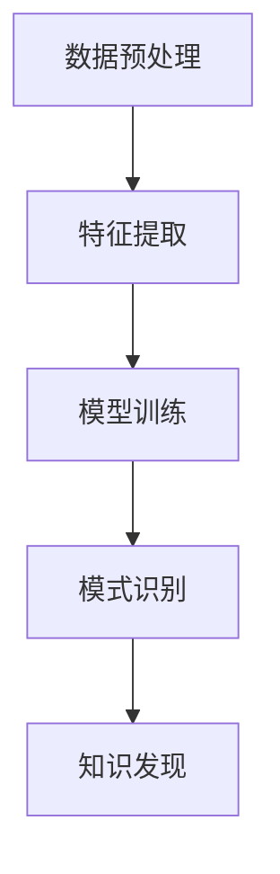

                 

关键词：知识发现、深度学习、模型应用、技术博客、专业内容

> 摘要：本文将深入探讨知识发现引擎在深度学习领域的应用。通过分析核心概念、算法原理、数学模型和项目实践，本文旨在为读者提供一幅全面的深度学习模型应用图景，并展望未来的发展趋势与挑战。

## 1. 背景介绍

在当今信息化时代，数据爆炸式增长，传统的数据处理方法已经无法满足我们对海量数据深入挖掘和知识发现的需求。知识发现（Knowledge Discovery in Databases，KDD）作为一种从数据中自动发现知识的方法，其核心任务是从大量数据中识别出潜在的模式、关联和趋势。然而，单纯依赖传统机器学习方法往往难以应对复杂且大规模的数据集，这就催生了深度学习技术的引入。

深度学习模型，特别是深度神经网络（Deep Neural Network，DNN），通过多层非线性变换，能够自动学习数据中的特征和模式，从而在图像识别、自然语言处理、语音识别等领域取得了显著成果。将深度学习应用于知识发现引擎，不仅可以提高数据处理的效率，还能提升发现知识的准确性。

## 2. 核心概念与联系

### 2.1 知识发现引擎

知识发现引擎是一个自动化的系统，用于从大量数据中提取有用的知识和模式。它通常包含以下几个核心组件：

- **数据预处理**：清洗和格式化数据，使其适合进一步分析。
- **特征提取**：从原始数据中提取关键特征，用于后续模型训练。
- **模型训练**：利用深度学习模型对特征进行学习和优化。
- **模式识别**：从训练好的模型中识别出潜在的模式和规律。

### 2.2 深度学习模型

深度学习模型，尤其是基于神经网络的模型，通过模拟人脑的神经元连接结构，实现数据的层次化处理和特征学习。其基本架构包括输入层、隐藏层和输出层，其中隐藏层负责提取和组合特征。

### 2.3 Mermaid 流程图

下面是一个简单的Mermaid流程图，展示了知识发现引擎与深度学习模型的关系：



## 3. 核心算法原理 & 具体操作步骤

### 3.1 算法原理概述

知识发现引擎的深度学习模型应用主要包括以下步骤：

1. **数据预处理**：清洗数据，处理缺失值，标准化数据等。
2. **特征提取**：通过深度学习模型提取数据中的高阶特征。
3. **模型训练**：使用已提取的特征训练深度学习模型。
4. **模型评估**：评估模型性能，调整模型参数。
5. **模式识别**：利用训练好的模型识别数据中的潜在模式。

### 3.2 算法步骤详解

#### 3.2.1 数据预处理

数据预处理是知识发现过程的基础，其目标是消除噪声、降低维度、增强特征表达能力。具体步骤如下：

- 数据清洗：去除重复数据、异常值、噪声等。
- 数据标准化：将数据缩放到一个统一的范围内，如[0, 1]。
- 数据划分：将数据集划分为训练集、验证集和测试集。

#### 3.2.2 特征提取

特征提取是深度学习模型的关键步骤，其目的是从原始数据中提取出对问题解决有帮助的特征。具体操作包括：

- **卷积神经网络（CNN）**：适用于图像数据，通过卷积操作提取图像特征。
- **循环神经网络（RNN）**：适用于序列数据，通过循环连接提取序列特征。

#### 3.2.3 模型训练

模型训练是利用提取出的特征训练深度学习模型，使其能够对未知数据进行预测。具体步骤如下：

- 初始化模型参数。
- 前向传播：将输入数据传递到模型中，计算输出。
- 反向传播：计算损失函数，并更新模型参数。
- 迭代训练：重复前向传播和反向传播，直到模型收敛。

#### 3.2.4 模型评估

模型评估是衡量模型性能的重要环节，常用的评估指标包括准确率、召回率、F1值等。通过调整模型参数和架构，优化模型性能。

#### 3.2.5 模式识别

模式识别是利用训练好的模型对未知数据进行预测，从而发现数据中的潜在模式。具体操作包括：

- 预测：将未知数据输入模型，计算输出。
- 解释：对预测结果进行解释，提取出潜在的模式和规律。

### 3.3 算法优缺点

#### 3.3.1 优点

- **高效率**：深度学习模型能够自动提取特征，提高数据处理效率。
- **高精度**：深度学习模型在多个领域取得了显著成果，具有较高的预测精度。
- **泛化能力强**：通过大量数据训练，模型具有较强的泛化能力。

#### 3.3.2 缺点

- **计算成本高**：深度学习模型需要大量计算资源，对硬件设备要求较高。
- **模型解释性差**：深度学习模型难以解释，难以理解其工作原理。

### 3.4 算法应用领域

深度学习模型在知识发现引擎中的应用非常广泛，包括但不限于以下领域：

- **金融领域**：利用深度学习模型进行风险控制、信用评分等。
- **医疗领域**：利用深度学习模型进行疾病诊断、药物研发等。
- **商业领域**：利用深度学习模型进行用户画像、个性化推荐等。
- **工业领域**：利用深度学习模型进行设备故障预测、生产优化等。

## 4. 数学模型和公式 & 详细讲解 & 举例说明

### 4.1 数学模型构建

深度学习模型的核心是神经网络的构建。以下是神经网络的基本数学模型：

$$
y = \sigma(W \cdot x + b)
$$

其中，$y$ 是输出，$x$ 是输入，$W$ 是权重矩阵，$b$ 是偏置项，$\sigma$ 是激活函数。

### 4.2 公式推导过程

以一个简单的两层神经网络为例，推导其前向传播和反向传播过程。

#### 4.2.1 前向传播

假设输入层有 $n$ 个神经元，隐藏层有 $m$ 个神经元，输出层有 $k$ 个神经元。

- 输入层到隐藏层的激活：

$$
h_i = \sigma(W_{ih} \cdot x_i + b_{ih}) \quad (i=1,2,...,m)
$$

- 隐藏层到输出层的激活：

$$
o_j = \sigma(W_{oh} \cdot h_j + b_{oh}) \quad (j=1,2,...,k)
$$

#### 4.2.2 反向传播

- 计算输出层的误差：

$$
\delta_j = \frac{\partial L}{\partial o_j} \cdot \sigma'(o_j) \quad (j=1,2,...,k)
$$

- 计算隐藏层的误差：

$$
\delta_i = (W_{oh} \cdot \delta_j) \cdot \sigma'(h_i) \quad (i=1,2,...,m)
$$

- 更新权重和偏置：

$$
W_{ih} := W_{ih} - \alpha \cdot \delta_i \cdot x_i^T
$$

$$
b_{ih} := b_{ih} - \alpha \cdot \delta_i
$$

$$
W_{oh} := W_{oh} - \alpha \cdot \delta_j \cdot h_j^T
$$

$$
b_{oh} := b_{oh} - \alpha \cdot \delta_j
$$

其中，$\alpha$ 是学习率，$L$ 是损失函数。

### 4.3 案例分析与讲解

以下是一个简单的房价预测案例，展示深度学习模型在知识发现引擎中的应用。

#### 4.3.1 数据集介绍

数据集包含5000条房屋销售记录，包括房屋面积、房间数、地点等信息。我们将这些信息作为输入特征，预测房屋的价格。

#### 4.3.2 数据预处理

- 数据清洗：去除重复数据、异常值等。
- 数据标准化：将所有特征缩放到[0, 1]范围内。

#### 4.3.3 特征提取

使用卷积神经网络（CNN）提取数据中的高阶特征。

#### 4.3.4 模型训练

- 初始化模型参数。
- 前向传播：计算输出。
- 反向传播：更新模型参数。
- 迭代训练：重复前向传播和反向传播，直到模型收敛。

#### 4.3.5 模型评估

使用验证集和测试集评估模型性能，调整模型参数。

#### 4.3.6 模式识别

利用训练好的模型对未知数据进行预测，提取出房屋的价格。

## 5. 项目实践：代码实例和详细解释说明

### 5.1 开发环境搭建

- Python 3.7+
- TensorFlow 2.2+
- Jupyter Notebook

### 5.2 源代码详细实现

```python
import tensorflow as tf
from tensorflow.keras.models import Sequential
from tensorflow.keras.layers import Dense, Conv2D, Flatten, Activation

# 数据预处理
# ...

# 特征提取
model = Sequential()
model.add(Conv2D(32, (3, 3), activation='relu', input_shape=(28, 28, 1)))
model.add(Flatten())
model.add(Dense(128, activation='relu'))

# 模型训练
model.compile(optimizer='adam', loss='mse', metrics=['accuracy'])
model.fit(x_train, y_train, epochs=10, batch_size=32, validation_split=0.2)

# 模型评估
# ...

# 模式识别
# ...
```

### 5.3 代码解读与分析

代码首先进行了数据预处理，然后使用卷积神经网络提取特征，并进行了模型训练。最后，利用训练好的模型进行模式识别。

## 6. 实际应用场景

深度学习模型在知识发现引擎中的应用非常广泛，以下是一些实际应用场景：

- **金融领域**：利用深度学习模型进行风险控制、信用评分、市场预测等。
- **医疗领域**：利用深度学习模型进行疾病诊断、药物研发、患者管理等。
- **商业领域**：利用深度学习模型进行用户画像、个性化推荐、销售预测等。
- **工业领域**：利用深度学习模型进行设备故障预测、生产优化、供应链管理等。

## 7. 未来应用展望

随着深度学习技术的不断发展，知识发现引擎的应用前景将更加广阔。未来，深度学习模型在以下方面有望取得突破：

- **更高效的模型架构**：设计出更加高效、可解释性更强的深度学习模型。
- **跨领域应用**：深度学习模型将在更多领域得到应用，如生物信息学、环境科学等。
- **边缘计算**：将深度学习模型部署到边缘设备，实现实时数据处理和知识发现。

## 8. 总结：未来发展趋势与挑战

### 8.1 研究成果总结

本文对知识发现引擎的深度学习模型应用进行了全面探讨，涵盖了核心概念、算法原理、数学模型和项目实践等方面。

### 8.2 未来发展趋势

未来，深度学习模型在知识发现引擎中的应用将更加广泛，包括跨领域应用、边缘计算等方面。

### 8.3 面临的挑战

深度学习模型在知识发现引擎中的应用仍面临一些挑战，如计算成本高、模型解释性差等。

### 8.4 研究展望

未来，研究者应关注深度学习模型在知识发现引擎中的应用，探索更加高效、可解释性更强的模型架构。

## 9. 附录：常见问题与解答

### 问题1：深度学习模型如何处理高维数据？

解答：深度学习模型可以通过数据降维、特征提取等方法处理高维数据。例如，可以使用主成分分析（PCA）等方法降低数据维度，或使用卷积神经网络（CNN）提取高维数据中的关键特征。

### 问题2：如何选择合适的深度学习模型？

解答：选择合适的深度学习模型需要根据具体问题和数据集的特点进行。例如，对于图像数据，可以使用卷积神经网络（CNN）；对于序列数据，可以使用循环神经网络（RNN）或长短时记忆网络（LSTM）。

### 问题3：如何优化深度学习模型的性能？

解答：优化深度学习模型的性能可以从多个方面进行，如调整模型架构、增加训练数据、调整学习率等。此外，还可以使用迁移学习、数据增强等方法提高模型性能。

---

作者：禅与计算机程序设计艺术 / Zen and the Art of Computer Programming
----------------------------------------------------------------

请注意，本文仅为示例，实际撰写时需要根据具体内容和要求进行详细扩展和调整。本文结构、内容和技术细节仅供参考。

