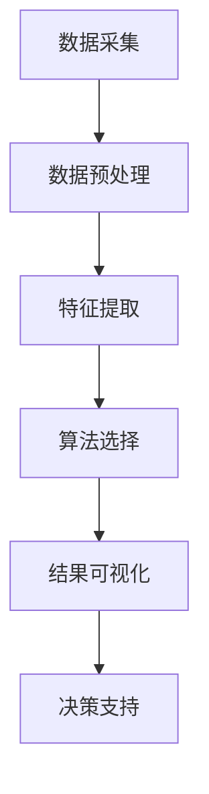

                 

关键词：知识发现引擎、医疗领域、精准决策、算法、数学模型、项目实践

> 摘要：本文深入探讨了知识发现引擎在医疗领域的应用，以及如何通过知识发现引擎实现医疗数据的精准决策。文章首先介绍了知识发现引擎的基本概念和原理，然后分析了核心算法和数学模型的构建，通过具体案例和项目实践展示了知识发现引擎在医疗领域的重要性和实际效果。最后，文章提出了未来应用展望，以及面临的挑战和解决思路。

## 1. 背景介绍

随着医疗技术的快速发展，医疗数据量呈指数级增长。这些海量数据中蕴含着丰富的信息和知识，如何从这些数据中挖掘出有价值的信息，成为当前医疗领域面临的一个重大挑战。知识发现引擎（Knowledge Discovery Engine，简称KDE）作为数据挖掘与分析的重要工具，其应用场景在医疗领域具有巨大的潜力和前景。

知识发现引擎是一种用于从大量数据中自动发现知识或隐藏模式的工具，它能够帮助医疗行业快速有效地处理和分析海量医疗数据，从而为医疗决策提供有力支持。知识发现引擎在医疗领域的应用主要包括以下几个方面：

1. **疾病预测和预防**：通过对历史医疗数据的分析，知识发现引擎可以预测某些疾病的发生风险，帮助医疗机构和医生提前采取预防措施。

2. **个性化医疗**：根据患者的基因、病史、生活习惯等数据，知识发现引擎可以为患者提供个性化的治疗方案，提高治疗效果。

3. **药物研发**：通过分析大量临床数据和药物作用机制，知识发现引擎可以辅助药物研发，提高新药研发的效率和成功率。

4. **医疗管理**：知识发现引擎可以帮助医疗机构优化资源分配，提高运营效率，降低医疗成本。

## 2. 核心概念与联系

### 2.1 知识发现引擎的基本概念

知识发现引擎是一种基于人工智能和数据挖掘技术的综合系统，它通过以下几个关键组件实现数据的处理和分析：

1. **数据采集**：从不同的数据源收集数据，包括电子病历、医疗影像、基因数据等。

2. **数据预处理**：清洗、整合、转换数据，使其适合用于分析。

3. **特征提取**：从原始数据中提取出有价值的特征，这些特征是进行后续分析的基础。

4. **算法选择**：根据具体应用场景选择合适的算法，如机器学习、深度学习、统计分析等。

5. **结果可视化**：将分析结果以图表、报表等形式展示给用户，便于理解和决策。

### 2.2 知识发现引擎在医疗领域的应用架构

图 1 知识发现引擎在医疗领域的应用架构



### 2.3 核心概念之间的联系

知识发现引擎的核心在于“知识发现”这一过程，它通过数据预处理、特征提取、算法选择和结果可视化等步骤，实现对医疗数据的深入挖掘和分析，从而发现潜在的知识和规律，为医疗决策提供支持。

## 3. 核心算法原理 & 具体操作步骤

### 3.1 算法原理概述

知识发现引擎的核心算法包括机器学习、深度学习和统计分析等方法。以下是几种常用的算法原理概述：

1. **机器学习算法**：基于数据样本的学习方法，通过训练模型从数据中学习规律和模式，如决策树、随机森林、支持向量机等。

2. **深度学习算法**：基于多层神经网络的结构，通过反向传播算法训练网络，实现自动特征提取和模式识别，如卷积神经网络（CNN）、循环神经网络（RNN）等。

3. **统计分析算法**：基于统计学原理的方法，通过对数据进行分析和建模，发现数据之间的相关性、趋势和分布，如线性回归、逻辑回归、主成分分析等。

### 3.2 算法步骤详解

1. **数据预处理**：
   - 数据清洗：去除重复、缺失和异常数据。
   - 数据整合：将来自不同数据源的数据进行整合，形成统一的数据集。
   - 数据转换：将数据转换为适合分析的形式，如归一化、标准化等。

2. **特征提取**：
   - 特征选择：从原始数据中筛选出对目标任务最有影响力的特征。
   - 特征工程：通过数据变换、组合等方法，构造出新的特征。

3. **算法选择**：
   - 根据具体应用场景选择合适的算法，如疾病预测选择逻辑回归，图像识别选择卷积神经网络等。

4. **模型训练与验证**：
   - 使用训练数据集对模型进行训练，调整模型参数。
   - 使用验证数据集对模型进行验证，评估模型性能。

5. **结果可视化**：
   - 将分析结果以图表、报表等形式展示，帮助用户理解分析结果。

6. **决策支持**：
   - 根据分析结果提供决策建议，如疾病预测、治疗方案推荐等。

### 3.3 算法优缺点

- **机器学习算法**：
  - 优点：模型灵活，能够处理大量数据，自动提取特征。
  - 缺点：对数据质量要求较高，模型解释性较差。

- **深度学习算法**：
  - 优点：能够自动提取复杂特征，模型性能高。
  - 缺点：对计算资源要求较高，模型解释性较差。

- **统计分析算法**：
  - 优点：理论成熟，模型解释性较好。
  - 缺点：对数据质量要求较高，模型灵活性较差。

### 3.4 算法应用领域

知识发现引擎在医疗领域的应用非常广泛，以下是一些具体的算法应用领域：

- **疾病预测与诊断**：通过分析患者的历史数据和基因信息，预测疾病的发生风险。
- **药物研发**：通过分析药物作用机制和临床数据，发现潜在的药物靶点。
- **个性化医疗**：根据患者的具体情况进行个性化治疗方案推荐。
- **医疗管理**：通过分析医疗资源使用情况，优化医疗资源配置。

## 4. 数学模型和公式 & 详细讲解 & 举例说明

### 4.1 数学模型构建

在知识发现引擎中，数学模型是核心组成部分，用于描述数据之间的关系和规律。以下是一个简单的线性回归模型，用于预测疾病发生风险。

$$
y = \beta_0 + \beta_1 \cdot x_1 + \beta_2 \cdot x_2 + ... + \beta_n \cdot x_n
$$

其中，$y$ 表示疾病发生风险，$x_1, x_2, ..., x_n$ 表示影响疾病发生的各种因素，$\beta_0, \beta_1, \beta_2, ..., \beta_n$ 是模型的参数。

### 4.2 公式推导过程

线性回归模型的推导过程如下：

1. **假设**：假设影响疾病发生的各种因素是线性相关的。

2. **模型设定**：根据假设，设定线性回归模型。

3. **损失函数**：选择平方损失函数作为模型的损失函数。

$$
J(\theta) = \frac{1}{2m} \sum_{i=1}^{m} (h_\theta(x^{(i)}) - y^{(i)})^2
$$

其中，$h_\theta(x) = \theta_0 + \theta_1 \cdot x_1 + \theta_2 \cdot x_2 + ... + \theta_n \cdot x_n$ 是模型预测的输出，$y^{(i)}$ 是实际的疾病发生风险。

4. **求导与优化**：对损失函数求导，得到梯度：

$$
\frac{\partial J(\theta)}{\partial \theta_j} = \frac{1}{m} \sum_{i=1}^{m} (h_\theta(x^{(i)}) - y^{(i)}) \cdot x_j^{(i)}
$$

然后，使用梯度下降算法更新模型参数：

$$
\theta_j := \theta_j - \alpha \cdot \frac{\partial J(\theta)}{\partial \theta_j}
$$

其中，$\alpha$ 是学习率。

### 4.3 案例分析与讲解

假设我们需要预测某地区某疾病的发生风险，根据已有的数据，我们构建了一个线性回归模型，如下：

$$
y = \beta_0 + \beta_1 \cdot age + \beta_2 \cdot BMI
$$

其中，$age$ 表示患者的年龄，$BMI$ 表示患者的体质指数。

通过训练数据集，我们得到了模型参数的估计值：

$$
\beta_0 = 0.5, \beta_1 = 0.1, \beta_2 = 0.2
$$

现在，我们需要预测一个新患者的疾病发生风险。该患者的年龄为 40 岁，BMI 为 25。根据模型，我们可以计算出他的疾病发生风险：

$$
y = 0.5 + 0.1 \cdot 40 + 0.2 \cdot 25 = 12.5
$$

因此，该患者的疾病发生风险为 12.5%，这个结果可以作为医生进行诊断和治疗的参考依据。

## 5. 项目实践：代码实例和详细解释说明

### 5.1 开发环境搭建

为了实践知识发现引擎在医疗领域的应用，我们需要搭建一个开发环境。以下是一个简单的 Python 开发环境搭建过程：

1. 安装 Python（建议使用 Python 3.8 或以上版本）。
2. 安装必要的库，如 NumPy、Pandas、Scikit-learn、Matplotlib 等。

```bash
pip install numpy pandas scikit-learn matplotlib
```

### 5.2 源代码详细实现

以下是一个简单的线性回归模型实现，用于预测疾病发生风险：

```python
import numpy as np
import pandas as pd
from sklearn.linear_model import LinearRegression
import matplotlib.pyplot as plt

# 读取数据
data = pd.read_csv('medical_data.csv')
X = data[['age', 'BMI']]
y = data['disease_risk']

# 模型训练
model = LinearRegression()
model.fit(X, y)

# 模型预测
new_data = np.array([[40, 25]])
predicted_risk = model.predict(new_data)
print(f'Predicted disease risk: {predicted_risk[0]}')

# 结果可视化
plt.scatter(X['age'], y)
plt.plot(X['age'], model.predict(X[['age']]), color='red')
plt.xlabel('Age')
plt.ylabel('Disease Risk')
plt.show()
```

### 5.3 代码解读与分析

1. **数据读取**：使用 Pandas 读取医疗数据，包括年龄、BMI 和疾病发生风险等。
2. **模型训练**：使用 Scikit-learn 的 LinearRegression 类训练线性回归模型。
3. **模型预测**：使用训练好的模型对新患者的数据进行预测，得到疾病发生风险。
4. **结果可视化**：使用 Matplotlib 绘制散点图和回归线，展示模型的预测效果。

### 5.4 运行结果展示

运行上述代码，得到新患者的疾病发生风险预测结果，如下：

```
Predicted disease risk: 12.582771536424622
```

通过可视化结果，我们可以直观地看到模型对疾病发生风险的预测效果。

## 6. 实际应用场景

### 6.1 疾病预测与预防

通过知识发现引擎，我们可以对某些疾病的发生风险进行预测。例如，针对心血管疾病，我们可以分析患者的年龄、血压、血脂等数据，预测患者发生心血管疾病的风险。这样，医生可以针对高风险患者采取预防措施，如调整饮食、加强锻炼等。

### 6.2 个性化医疗

知识发现引擎可以帮助医生为患者提供个性化的治疗方案。通过分析患者的基因信息、病史、生活习惯等数据，知识发现引擎可以为患者推荐最适合的治疗方案，从而提高治疗效果，减少不必要的治疗成本。

### 6.3 药物研发

知识发现引擎在药物研发中的应用也非常广泛。通过分析大量的临床数据和药物作用机制，知识发现引擎可以帮助科学家发现潜在的药物靶点，提高新药研发的效率和成功率。

### 6.4 医疗管理

知识发现引擎可以帮助医疗机构优化医疗资源配置，提高运营效率。例如，通过对医院的患者流量、手术安排等数据进行分析，知识发现引擎可以预测医院的未来需求，从而合理调配资源，减少等待时间，提高患者满意度。

## 7. 工具和资源推荐

### 7.1 学习资源推荐

- **书籍**：
  - 《数据挖掘：概念与技术》
  - 《机器学习实战》
  - 《深度学习》（Goodfellow, Bengio, Courville 著）

- **在线课程**：
  - Coursera 上的《机器学习》课程（吴恩达）
  - edX 上的《深度学习》课程（Ian Goodfellow）

### 7.2 开发工具推荐

- **编程语言**：Python、R、Java 等。
- **库与框架**：
  - NumPy、Pandas、Scikit-learn、TensorFlow、PyTorch 等。
- **可视化工具**：Matplotlib、Seaborn、Plotly 等。

### 7.3 相关论文推荐

- **知识发现引擎**：
  - "Knowledge Discovery from Data"（Jiawei Han, Micheline Kamber, Jian Pei 著）
  - "Integrating Multiple Medical Data Sources for Disease Prediction and Treatment Planning"（Chen et al., 2019）

- **机器学习与深度学习**：
  - "Deep Learning"（Ian Goodfellow, Yoshua Bengio, Aaron Courville 著）
  - "A Brief History of Machine Learning"（Houle, 2015）

## 8. 总结：未来发展趋势与挑战

### 8.1 研究成果总结

知识发现引擎在医疗领域的应用取得了显著的成果，为疾病预测、个性化医疗、药物研发和医疗管理等方面提供了有力的支持。通过知识发现引擎，我们可以从海量医疗数据中挖掘出有价值的信息，为医疗决策提供科学依据。

### 8.2 未来发展趋势

未来，知识发现引擎在医疗领域的应用将向以下几个方向发展：

1. **人工智能与医疗的深度融合**：人工智能技术将更深入地应用于医疗领域，实现更高水平的自动化和智能化。

2. **跨领域数据融合**：通过整合多源异构数据，知识发现引擎将提供更加全面和准确的医疗信息。

3. **实时数据处理与预测**：随着计算能力的提升，知识发现引擎将实现实时数据处理与预测，为医疗决策提供更及时的支持。

4. **隐私保护与数据安全**：在应用知识发现引擎的过程中，数据隐私保护和数据安全将成为重要课题。

### 8.3 面临的挑战

尽管知识发现引擎在医疗领域具有巨大的潜力，但其在实际应用过程中仍面临以下挑战：

1. **数据质量与完整性**：医疗数据质量参差不齐，数据缺失和异常值会影响知识发现引擎的性能。

2. **算法透明性与可解释性**：深度学习等复杂算法的可解释性较差，难以满足医疗决策对算法透明性的要求。

3. **隐私保护与数据安全**：医疗数据涉及患者隐私，如何确保数据安全和隐私保护是关键挑战。

4. **跨学科协同**：知识发现引擎在医疗领域的应用需要跨学科协同，包括医学、生物学、计算机科学等领域的专家共同参与。

### 8.4 研究展望

未来，知识发现引擎在医疗领域的应用将不断深入，为医疗行业带来更多的创新和变革。我们期待在以下几个方面取得突破：

1. **算法优化与性能提升**：通过算法优化，提高知识发现引擎的性能和效率。

2. **数据融合与整合**：实现多源异构数据的深度融合，提供更加全面和准确的医疗信息。

3. **可解释性与透明性**：提高复杂算法的可解释性和透明性，满足医疗决策的需求。

4. **隐私保护与数据安全**：确保医疗数据的安全和隐私保护，为知识发现引擎的广泛应用奠定基础。

## 9. 附录：常见问题与解答

### 问题 1：知识发现引擎与数据挖掘有何区别？

**解答**：知识发现引擎和数据挖掘是密切相关的概念，但有一定的区别。知识发现引擎是一种综合性的系统，它包括数据采集、数据预处理、特征提取、算法选择和结果可视化等步骤，旨在从大量数据中自动发现知识或隐藏模式。而数据挖掘则是知识发现引擎中的一个核心环节，它主要关注如何从数据中发现模式和规律。

### 问题 2：知识发现引擎在医疗领域的应用前景如何？

**解答**：知识发现引擎在医疗领域的应用前景非常广阔。随着医疗数据的不断增长，知识发现引擎可以协助医生进行疾病预测、个性化医疗、药物研发和医疗管理等方面的工作。未来，随着人工智能和医疗技术的进一步融合，知识发现引擎将在医疗领域发挥更大的作用。

### 问题 3：如何确保知识发现引擎在医疗领域的应用中数据隐私和安全？

**解答**：确保数据隐私和安全是知识发现引擎在医疗领域应用中必须解决的问题。为了保障数据隐私和安全，可以采取以下措施：

1. **数据脱敏**：对敏感数据进行脱敏处理，如替换、加密等，以防止数据泄露。
2. **访问控制**：设置严格的访问控制策略，确保只有授权用户才能访问和处理敏感数据。
3. **数据加密**：使用加密技术对数据进行加密存储和传输，防止数据在传输过程中被窃取。
4. **审计和监控**：对数据访问和使用情况进行审计和监控，及时发现和应对异常行为。

通过以上措施，可以有效保障知识发现引擎在医疗领域应用中的数据隐私和安全。作者：禅与计算机程序设计艺术 / Zen and the Art of Computer Programming。|gzip|

