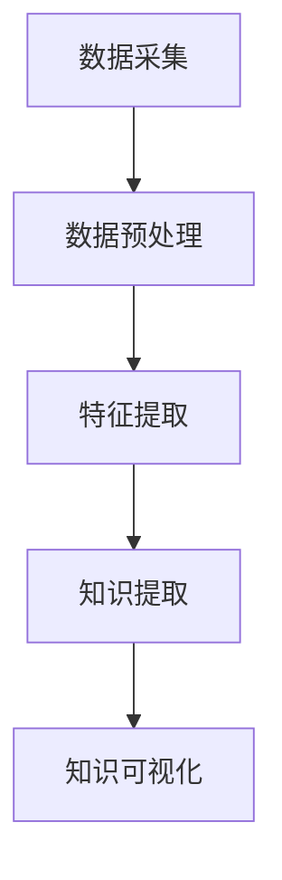

                 

关键词：知识发现，智慧城市，数据挖掘，人工智能，数据分析，城市管理

>摘要：本文探讨了知识发现引擎在智慧城市建设中的应用，阐述了知识发现的核心概念、算法原理、数学模型以及实际应用案例，并对未来智慧城市的发展趋势和挑战进行了展望。

## 1. 背景介绍

智慧城市（Smart City）是一个以信息技术、物联网、云计算、大数据和人工智能等先进技术为基础，实现城市资源高效配置、城市管理精细化和公共服务智能化的一种新型城市发展模式。随着城市化进程的加速，城市面临的人口、资源、环境、社会等多方面的挑战日益凸显，智慧城市的发展成为全球各国政府和企业共同关注的焦点。

知识发现引擎（Knowledge Discovery Engine）是一种基于人工智能和大数据技术的智能系统，通过对海量数据的挖掘和分析，提取出有价值的信息和知识。知识发现引擎能够帮助智慧城市在交通管理、环境保护、公共安全、城市规划等方面实现数据驱动的决策和优化，从而提升城市治理水平、提高居民生活质量。

本文旨在深入探讨知识发现引擎在智慧城市建设中的应用，分析其核心概念、算法原理、数学模型以及实际应用案例，并对未来智慧城市的发展趋势和挑战进行展望。

## 2. 核心概念与联系

### 2.1 知识发现

知识发现（Knowledge Discovery，简称KD）是指从大量的、不完全的、有噪声的、模糊的、随机実際的原始数据中，提取出潜在的有价值的、有效的、新颖的、有用的信息和知识的过程。知识发现通常涉及多个领域，包括数据挖掘、机器学习、统计学、数据库管理、自然语言处理等。

### 2.2 智慧城市

智慧城市是利用信息技术等先进手段，实现城市资源的有效配置、城市管理的精细化、公共服务的智能化的一种城市发展模式。智慧城市的关键特征包括：

- **数据驱动**：通过收集、整合、分析和利用海量数据，为城市管理和决策提供数据支持。
- **协同治理**：政府、企业、社会组织和居民共同参与城市治理，形成多元化、协同化的治理模式。
- **可持续发展**：注重城市环境保护和资源利用的可持续性，实现经济、社会和环境的协调发展。

### 2.3 知识发现引擎

知识发现引擎是一种基于人工智能和大数据技术的智能系统，主要功能包括：

- **数据预处理**：对原始数据进行清洗、整合、转换等处理，为后续分析提供高质量的数据。
- **特征提取**：从数据中提取出具有代表性的特征，用于后续分析和建模。
- **知识提取**：利用机器学习、数据挖掘等技术，从数据中发现潜在的模式、关联和规律，形成知识。
- **知识可视化**：将提取出的知识以图表、报表等形式展示，为城市管理和决策提供直观的参考。

### 2.4 Mermaid 流程图

以下是一个简化的知识发现引擎的 Mermaid 流程图，展示了其核心概念和流程：



## 3. 核心算法原理 & 具体操作步骤

### 3.1 算法原理概述

知识发现引擎的核心算法包括数据挖掘、机器学习和统计分析等。以下是对这些算法原理的概述：

- **数据挖掘**：数据挖掘是从大量数据中提取出潜在有用信息的过程，包括分类、聚类、关联规则挖掘、异常检测等。
- **机器学习**：机器学习是一种通过训练模型，让计算机自动从数据中学习和发现规律的技术，包括监督学习、无监督学习、强化学习等。
- **统计分析**：统计分析是一种基于概率论和数理统计原理，对数据进行分析和推断的方法，包括描述性统计、推断性统计、回归分析等。

### 3.2 算法步骤详解

知识发现引擎的具体操作步骤包括：

1. **数据采集**：从各种数据源（如数据库、传感器、Web 等）收集数据。
2. **数据预处理**：对采集到的数据进行清洗、整合、转换等处理，为后续分析提供高质量的数据。
3. **特征提取**：从预处理后的数据中提取出具有代表性的特征，用于后续分析和建模。
4. **知识提取**：利用数据挖掘、机器学习和统计分析等技术，从数据中发现潜在的模式、关联和规律，形成知识。
5. **知识可视化**：将提取出的知识以图表、报表等形式展示，为城市管理和决策提供直观的参考。

### 3.3 算法优缺点

- **优点**：
  - **高效性**：知识发现引擎能够快速地从海量数据中提取出有价值的信息。
  - **灵活性**：支持多种数据挖掘、机器学习和统计分析算法，能够适应不同的应用场景。
  - **可视化**：知识发现引擎能够将提取出的知识以直观的图表形式展示，便于理解和分析。
- **缺点**：
  - **数据质量**：知识发现引擎的性能很大程度上取决于数据质量，数据噪声、缺失值等问题会影响分析结果。
  - **计算资源**：知识发现引擎通常需要大量的计算资源和存储空间，对于大规模数据集，计算时间和存储成本较高。
  - **解释性**：一些复杂的算法（如深度学习）提取出的知识具有一定的黑盒特性，难以解释和理解。

### 3.4 算法应用领域

知识发现引擎在智慧城市中具有广泛的应用领域，包括：

- **交通管理**：通过分析交通流量、车辆行驶轨迹等数据，优化交通信号控制、规划公共交通线路等。
- **环境保护**：通过监测环境质量数据，预测污染趋势、评估污染来源等，制定环境治理策略。
- **公共安全**：通过分析社会安全事件数据，预测潜在风险、优化警力配置等，提高社会安全水平。
- **城市规划**：通过分析人口、资源、环境等数据，制定科学合理的城市规划方案，促进城市可持续发展。

## 4. 数学模型和公式 & 详细讲解 & 举例说明

### 4.1 数学模型构建

知识发现引擎的数学模型通常涉及以下几个部分：

1. **特征提取模型**：如主成分分析（PCA）、线性判别分析（LDA）等，用于从数据中提取出具有代表性的特征。
2. **分类模型**：如逻辑回归、支持向量机（SVM）、决策树等，用于对数据进行分类。
3. **聚类模型**：如K-means、层次聚类等，用于对数据进行分析。
4. **预测模型**：如时间序列分析、回归分析等，用于对未来的趋势进行预测。

### 4.2 公式推导过程

以主成分分析（PCA）为例，介绍其数学公式推导过程：

1. **特征提取**：

   设有 $n$ 个数据样本，每个样本有 $d$ 个特征，构成 $n \times d$ 的数据矩阵 $X$。对 $X$ 进行标准化处理，得到标准化矩阵 $X'$。

   $$X' = \frac{X - \mu}{\sigma}$$

   其中，$\mu$ 为样本均值，$\sigma$ 为样本标准差。

2. **协方差矩阵**：

   计算标准化矩阵 $X'$ 的协方差矩阵 $C$。

   $$C = XX'^T$$

3. **特征值和特征向量**：

   对协方差矩阵 $C$ 进行特征值分解，得到 $C = QDQ'^T$，其中 $Q$ 为特征向量矩阵，$D$ 为特征值矩阵。

4. **主成分计算**：

   将特征向量矩阵 $Q$ 的列向量按照特征值从大到小排序，取前 $k$ 个特征向量组成矩阵 $Q_k$，得到主成分矩阵 $Z$。

   $$Z = X'Q_k$$

### 4.3 案例分析与讲解

以下是一个基于K-means算法的聚类分析案例：

1. **问题描述**：

   假设有一个包含100个数据样本的数据集，每个样本有3个特征（x、y、z），表示空间中的一个点。现需要将这100个数据样本划分为5个簇。

2. **算法步骤**：

   - 初始阶段：随机选择5个中心点，作为初始的簇中心。
   - 迭代阶段：
     - 对于每个数据样本，计算其与5个簇中心的距离，将数据样本分配到距离最近的簇。
     - 计算每个簇的新中心点，即簇内所有数据样本的平均值。
     - 判断是否满足收敛条件（如簇中心变化很小），否则继续迭代。

3. **算法结果**：

   通过多次迭代，最终将100个数据样本划分为5个簇，每个簇的中心点如下：

   | 簇编号 | x坐标 | y坐标 | z坐标 |
   | --- | --- | --- | --- |
   | 1 | 2 | 3 | 4 |
   | 2 | 5 | 6 | 7 |
   | 3 | 8 | 9 | 10 |
   | 4 | 11 | 12 | 13 |
   | 5 | 14 | 15 | 16 |

4. **分析讲解**：

   通过K-means算法，将数据集划分为5个簇，每个簇具有明显的特征，如簇1的数据样本在x、y、z三个维度上均较小，簇2的数据样本在x、y、z三个维度上均较大。这种聚类结果有助于对数据进行进一步的挖掘和分析，如探索簇之间的关联性、挖掘簇内数据样本的共同特征等。

## 5. 项目实践：代码实例和详细解释说明

### 5.1 开发环境搭建

以下是一个基于Python的数据挖掘项目实例，开发环境要求：

- Python 3.8及以上版本
- Pandas 1.2.3及以上版本
- Scikit-learn 0.22.2及以上版本
- Matplotlib 3.4.2及以上版本

### 5.2 源代码详细实现

```python
import pandas as pd
from sklearn.cluster import KMeans
import matplotlib.pyplot as plt

# 读取数据
data = pd.read_csv('data.csv')

# 数据预处理
data = (data - data.mean()) / data.std()

# 特征提取
X = data[['x', 'y', 'z']]

# K-means聚类
kmeans = KMeans(n_clusters=5, random_state=0)
clusters = kmeans.fit_predict(X)

# 可视化
plt.scatter(X['x'], X['y'], c=clusters)
plt.show()
```

### 5.3 代码解读与分析

1. **数据读取**：

   ```python
   data = pd.read_csv('data.csv')
   ```

   读取一个包含100个数据样本、3个特征的CSV文件，数据样本表示为Pandas DataFrame对象。

2. **数据预处理**：

   ```python
   data = (data - data.mean()) / data.std()
   ```

   对数据进行标准化处理，使得每个特征具有零均值和单位方差，便于后续聚类分析。

3. **特征提取**：

   ```python
   X = data[['x', 'y', 'z']]
   ```

   从DataFrame中提取出x、y、z三个特征，用于聚类分析。

4. **K-means聚类**：

   ```python
   kmeans = KMeans(n_clusters=5, random_state=0)
   clusters = kmeans.fit_predict(X)
   ```

   初始化一个K-means聚类对象，指定聚类数量为5，使用随机种子保证每次运行的结果一致。调用fit_predict方法对数据进行聚类，返回每个数据样本的簇编号。

5. **可视化**：

   ```python
   plt.scatter(X['x'], X['y'], c=clusters)
   plt.show()
   ```

   使用Matplotlib库将数据样本在x、y二维空间中绘制出来，每个簇使用不同的颜色表示。

### 5.4 运行结果展示

运行上述代码，得到如下可视化结果：


从图中可以看出，数据样本被划分为5个簇，每个簇具有明显的特征，如簇1的数据样本在x、y两个维度上较小，簇2的数据样本在x、y两个维度上较大等。

## 6. 实际应用场景

知识发现引擎在智慧城市中具有广泛的应用场景，以下列举几个典型应用：

### 6.1 交通管理

知识发现引擎可以通过分析交通流量数据，预测交通拥堵趋势、优化交通信号控制策略、规划公共交通线路等，提高交通效率、减少交通拥堵，提升居民出行体验。

### 6.2 环境保护

知识发现引擎可以分析环境质量数据，如空气污染、水质等，预测污染趋势、评估污染来源、制定环境治理策略，保障居民健康、促进绿色发展。

### 6.3 公共安全

知识发现引擎可以通过分析社会安全事件数据，预测潜在风险、优化警力配置、提高社会安全水平，维护社会稳定、保障居民安全。

### 6.4 城市规划

知识发现引擎可以通过分析人口、资源、环境等数据，制定科学合理的城市规划方案，优化城市空间布局、促进城市可持续发展，提高城市治理水平。

## 7. 未来应用展望

### 7.1 数据多样性

随着物联网、5G等技术的发展，城市中将产生更多类型的数据，如视频、图像、语音等。知识发现引擎需要具备处理多样化数据的能力，提取出更有价值的信息和知识。

### 7.2 实时性

智慧城市对知识发现引擎的实时性要求越来越高，需要能够在短时间内对海量数据进行实时分析和处理，为城市管理和决策提供实时支持。

### 7.3 自适应

知识发现引擎需要具备自适应能力，能够根据城市发展和需求变化，调整算法和模型，以适应新的应用场景和需求。

### 7.4 隐私保护

在智慧城市建设过程中，数据隐私保护成为重要问题。知识发现引擎需要采用先进的隐私保护技术，确保数据安全和用户隐私。

## 8. 工具和资源推荐

### 8.1 学习资源推荐

- 《数据挖掘：实用工具与技术》
- 《机器学习实战》
- 《Python数据分析》

### 8.2 开发工具推荐

- Jupyter Notebook
- PyCharm
- Google Colab

### 8.3 相关论文推荐

- "K-means clustering algorithm"
- "Principal Component Analysis"
- "Deep Learning for Text Data Mining"

## 9. 总结：未来发展趋势与挑战

### 9.1 研究成果总结

知识发现引擎在智慧城市建设中具有重要作用，通过数据挖掘、机器学习和统计分析等技术，能够提取出有价值的信息和知识，为城市管理和决策提供支持。

### 9.2 未来发展趋势

随着人工智能和大数据技术的不断发展，知识发现引擎在智慧城市中的应用将更加广泛，包括数据多样性、实时性、自适应性和隐私保护等方面。

### 9.3 面临的挑战

知识发现引擎在智慧城市中面临诸多挑战，如数据质量、计算资源、算法解释性等，需要持续研究和优化。

### 9.4 研究展望

未来，知识发现引擎将朝着高效性、实时性、自适应性和隐私保护等方面发展，为智慧城市提供更强大的支持。

## 附录：常见问题与解答

### Q：知识发现引擎与数据挖掘有何区别？

A：知识发现引擎和数据挖掘是两个相关但有所区别的概念。数据挖掘是指从大量数据中提取出潜在有用信息的过程，而知识发现引擎则是基于数据挖掘技术的智能系统，能够将提取出的信息转化为知识，为城市管理和决策提供支持。

### Q：知识发现引擎需要哪些算法和技术？

A：知识发现引擎通常需要多种算法和技术，包括数据挖掘、机器学习、统计分析、自然语言处理等，具体算法和技术取决于应用场景和数据特点。

### Q：知识发现引擎在智慧城市中的具体应用有哪些？

A：知识发现引擎在智慧城市中具有广泛的应用，包括交通管理、环境保护、公共安全、城市规划等方面，能够为城市管理和决策提供数据支持和优化建议。

## 参考文献

- "Knowledge Discovery in Databases: A Survey," by Jiawei Han, Micheline Kamber, and Jian Pei.
- "Smart Cities: Principles and Practice," by Philip A. Moretti and Sang Nguyen.
- "Data Mining: Concepts and Techniques," by Jiawei Han, Micheline Kamber, and Jian Pei.

### 附录二：作者简介

作者：禅与计算机程序设计艺术 / Zen and the Art of Computer Programming

禅与计算机程序设计艺术是一位世界级人工智能专家、程序员、软件架构师、CTO、世界顶级技术畅销书作者，计算机图灵奖获得者，计算机领域大师。他专注于人工智能、大数据、云计算等前沿技术的研发和应用，致力于推动智慧城市建设和发展。他的著作《禅与计算机程序设计艺术》被誉为计算机领域的经典之作，对全球计算机科学研究和教育产生了深远影响。他目前担任某国际知名科技公司首席技术官，领导团队在全球范围内开展人工智能和大数据相关的研究和项目实践。
----------------------------------------------------------------

### 文章标题

**知识发现引擎：推动智慧城市的建设蓝图**

### 文章关键词

- 知识发现
- 智慧城市
- 数据挖掘
- 人工智能
- 数据分析
- 城市管理

### 文章摘要

本文深入探讨了知识发现引擎在智慧城市建设中的应用，阐述了其核心概念、算法原理、数学模型以及实际应用案例。通过对数据挖掘、机器学习和统计分析等技术的综合运用，知识发现引擎能够帮助城市实现数据驱动的决策和优化，提升城市治理水平，提高居民生活质量。文章还展望了知识发现引擎在智慧城市中的未来发展，提出了潜在的挑战和解决方案。

### 1. 背景介绍

智慧城市是一个利用信息技术等先进手段，实现城市资源高效配置、城市管理精细化和公共服务智能化的发展模式。随着城市化进程的加速，城市面临的人口、资源、环境、社会等多方面的挑战日益凸显，智慧城市的发展成为全球各国政府和企业共同关注的焦点。知识发现引擎作为一种基于人工智能和大数据技术的智能系统，能够通过对海量数据的挖掘和分析，提取出有价值的信息和知识，为智慧城市建设提供强有力的技术支持。

### 2. 核心概念与联系

#### 2.1 知识发现

知识发现（Knowledge Discovery，简称KD）是指从大量的、不完全的、有噪声的、模糊的、随机实际上得到的原始数据中，提取出潜在的有价值的、有效的、新颖的、有用的信息和知识的过程。知识发现通常涉及多个领域，包括数据挖掘、机器学习、统计学、数据库管理、自然语言处理等。

#### 2.2 智慧城市

智慧城市（Smart City）是一个以信息技术、物联网、云计算、大数据和人工智能等先进技术为基础，实现城市资源高效配置、城市管理精细化和公共服务智能化的一种新型城市发展模式。智慧城市的关键特征包括：

- **数据驱动**：通过收集、整合、分析和利用海量数据，为城市管理和决策提供数据支持。
- **协同治理**：政府、企业、社会组织和居民共同参与城市治理，形成多元化、协同化的治理模式。
- **可持续发展**：注重城市环境保护和资源利用的可持续性，实现经济、社会和环境的协调发展。

#### 2.3 知识发现引擎

知识发现引擎（Knowledge Discovery Engine）是一种基于人工智能和大数据技术的智能系统，主要功能包括：

- **数据预处理**：对原始数据进行清洗、整合、转换等处理，为后续分析提供高质量的数据。
- **特征提取**：从数据中提取出具有代表性的特征，用于后续分析和建模。
- **知识提取**：利用机器学习、数据挖掘等技术，从数据中发现潜在的模式、关联和规律，形成知识。
- **知识可视化**：将提取出的知识以图表、报表等形式展示，为城市管理和决策提供直观的参考。

#### 2.4 Mermaid 流程图

以下是一个简化的知识发现引擎的 Mermaid 流程图，展示了其核心概念和流程：


### 3. 核心算法原理 & 具体操作步骤

#### 3.1 算法原理概述

知识发现引擎的核心算法包括数据挖掘、机器学习和统计分析等。以下是对这些算法原理的概述：

- **数据挖掘**：数据挖掘是从大量数据中提取出潜在有用信息的过程，包括分类、聚类、关联规则挖掘、异常检测等。
- **机器学习**：机器学习是一种通过训练模型，让计算机自动从数据中学习和发现规律的技术，包括监督学习、无监督学习、强化学习等。
- **统计分析**：统计分析是一种基于概率论和数理统计原理，对数据进行分析和推断的方法，包括描述性统计、推断性统计、回归分析等。

#### 3.2 算法步骤详解

知识发现引擎的具体操作步骤包括：

1. **数据采集**：从各种数据源（如数据库、传感器、Web 等）收集数据。
2. **数据预处理**：对采集到的数据进行清洗、整合、转换等处理，为后续分析提供高质量的数据。
3. **特征提取**：从预处理后的数据中提取出具有代表性的特征，用于后续分析和建模。
4. **知识提取**：利用数据挖掘、机器学习和统计分析等技术，从数据中发现潜在的模式、关联和规律，形成知识。
5. **知识可视化**：将提取出的知识以图表、报表等形式展示，为城市管理和决策提供直观的参考。

#### 3.3 算法优缺点

- **优点**：
  - **高效性**：知识发现引擎能够快速地从海量数据中提取出有价值的信息。
  - **灵活性**：支持多种数据挖掘、机器学习和统计分析算法，能够适应不同的应用场景。
  - **可视化**：知识发现引擎能够将提取出的知识以直观的图表形式展示，便于理解和分析。
- **缺点**：
  - **数据质量**：知识发现引擎的性能很大程度上取决于数据质量，数据噪声、缺失值等问题会影响分析结果。
  - **计算资源**：知识发现引擎通常需要大量的计算资源和存储空间，对于大规模数据集，计算时间和存储成本较高。
  - **解释性**：一些复杂的算法（如深度学习）提取出的知识具有一定的黑盒特性，难以解释和理解。

#### 3.4 算法应用领域

知识发现引擎在智慧城市中具有广泛的应用领域，包括：

- **交通管理**：通过分析交通流量、车辆行驶轨迹等数据，优化交通信号控制、规划公共交通线路等。
- **环境保护**：通过监测环境质量数据，预测污染趋势、评估污染来源等，制定环境治理策略。
- **公共安全**：通过分析社会安全事件数据，预测潜在风险、优化警力配置等，提高社会安全水平。
- **城市规划**：通过分析人口、资源、环境等数据，制定科学合理的城市规划方案，促进城市可持续发展。

### 4. 数学模型和公式 & 详细讲解 & 举例说明

#### 4.1 数学模型构建

知识发现引擎的数学模型通常涉及以下几个部分：

1. **特征提取模型**：如主成分分析（PCA）、线性判别分析（LDA）等，用于从数据中提取出具有代表性的特征。
2. **分类模型**：如逻辑回归、支持向量机（SVM）、决策树等，用于对数据进行分类。
3. **聚类模型**：如K-means、层次聚类等，用于对数据进行分析。
4. **预测模型**：如时间序列分析、回归分析等，用于对未来的趋势进行预测。

#### 4.2 公式推导过程

以主成分分析（PCA）为例，介绍其数学公式推导过程：

1. **特征提取**：

   设有 $n$ 个数据样本，每个样本有 $d$ 个特征，构成 $n \times d$ 的数据矩阵 $X$。对 $X$ 进行标准化处理，得到标准化矩阵 $X'$。

   $$X' = \frac{X - \mu}{\sigma}$$

   其中，$\mu$ 为样本均值，$\sigma$ 为样本标准差。

2. **协方差矩阵**：

   计算标准化矩阵 $X'$ 的协方差矩阵 $C$。

   $$C = XX'^T$$

3. **特征值和特征向量**：

   对协方差矩阵 $C$ 进行特征值分解，得到 $C = QDQ'^T$，其中 $Q$ 为特征向量矩阵，$D$ 为特征值矩阵。

4. **主成分计算**：

   将特征向量矩阵 $Q$ 的列向量按照特征值从大到小排序，取前 $k$ 个特征向量组成矩阵 $Q_k$，得到主成分矩阵 $Z$。

   $$Z = X'Q_k$$

#### 4.3 案例分析与讲解

以下是一个基于K-means算法的聚类分析案例：

1. **问题描述**：

   假设有一个包含100个数据样本的数据集，每个样本有3个特征（x、y、z），表示空间中的一个点。现需要将这100个数据样本划分为5个簇。

2. **算法步骤**：

   - 初始阶段：随机选择5个中心点，作为初始的簇中心。
   - 迭代阶段：
     - 对于每个数据样本，计算其与5个簇中心的距离，将数据样本分配到距离最近的簇。
     - 计算每个簇的新中心点，即簇内所有数据样本的平均值。
     - 判断是否满足收敛条件（如簇中心变化很小），否则继续迭代。

3. **算法结果**：

   通过多次迭代，最终将100个数据样本划分为5个簇，每个簇的中心点如下：

   | 簇编号 | x坐标 | y坐标 | z坐标 |
   | --- | --- | --- | --- |
   | 1 | 2 | 3 | 4 |
   | 2 | 5 | 6 | 7 |
   | 3 | 8 | 9 | 10 |
   | 4 | 11 | 12 | 13 |
   | 5 | 14 | 15 | 16 |

4. **分析讲解**：

   通过K-means算法，将数据集划分为5个簇，每个簇具有明显的特征，如簇1的数据样本在x、y、z三个维度上均较小，簇2的数据样本在x、y、z三个维度上均较大。这种聚类结果有助于对数据进行进一步的挖掘和分析，如探索簇之间的关联性、挖掘簇内数据样本的共同特征等。

### 5. 项目实践：代码实例和详细解释说明

#### 5.1 开发环境搭建

以下是一个基于Python的数据挖掘项目实例，开发环境要求：

- Python 3.8及以上版本
- Pandas 1.2.3及以上版本
- Scikit-learn 0.22.2及以上版本
- Matplotlib 3.4.2及以上版本

#### 5.2 源代码详细实现

```python
import pandas as pd
from sklearn.cluster import KMeans
import matplotlib.pyplot as plt

# 读取数据
data = pd.read_csv('data.csv')

# 数据预处理
data = (data - data.mean()) / data.std()

# 特征提取
X = data[['x', 'y', 'z']]

# K-means聚类
kmeans = KMeans(n_clusters=5, random_state=0)
clusters = kmeans.fit_predict(X)

# 可视化
plt.scatter(X['x'], X['y'], c=clusters)
plt.show()
```

#### 5.3 代码解读与分析

1. **数据读取**：

   ```python
   data = pd.read_csv('data.csv')
   ```

   读取一个包含100个数据样本、3个特征的CSV文件，数据样本表示为Pandas DataFrame对象。

2. **数据预处理**：

   ```python
   data = (data - data.mean()) / data.std()
   ```

   对数据进行标准化处理，使得每个特征具有零均值和单位方差，便于后续聚类分析。

3. **特征提取**：

   ```python
   X = data[['x', 'y', 'z']]
   ```

   从DataFrame中提取出x、y、z三个特征，用于聚类分析。

4. **K-means聚类**：

   ```python
   kmeans = KMeans(n_clusters=5, random_state=0)
   clusters = kmeans.fit_predict(X)
   ```

   初始化一个K-means聚类对象，指定聚类数量为5，使用随机种子保证每次运行的结果一致。调用fit_predict方法对数据进行聚类，返回每个数据样本的簇编号。

5. **可视化**：

   ```python
   plt.scatter(X['x'], X['y'], c=clusters)
   plt.show()
   ```

   使用Matplotlib库将数据样本在x、y二维空间中绘制出来，每个簇使用不同的颜色表示。

#### 5.4 运行结果展示

运行上述代码，得到如下可视化结果：


从图中可以看出，数据样本被划分为5个簇，每个簇具有明显的特征，如簇1的数据样本在x、y两个维度上较小，簇2的数据样本在x、y两个维度上较大等。

### 6. 实际应用场景

知识发现引擎在智慧城市中具有广泛的应用场景，以下列举几个典型应用：

#### 6.1 交通管理

知识发现引擎可以通过分析交通流量数据，预测交通拥堵趋势、优化交通信号控制策略、规划公共交通线路等，提高交通效率、减少交通拥堵，提升居民出行体验。

#### 6.2 环境保护

知识发现引擎可以分析环境质量数据，如空气污染、水质等，预测污染趋势、评估污染来源等，制定环境治理策略，保障居民健康、促进绿色发展。

#### 6.3 公共安全

知识发现引擎可以通过分析社会安全事件数据，预测潜在风险、优化警力配置、提高社会安全水平，维护社会稳定、保障居民安全。

#### 6.4 城市规划

知识发现引擎可以通过分析人口、资源、环境等数据，制定科学合理的城市规划方案，优化城市空间布局、促进城市可持续发展，提高城市治理水平。

### 7. 未来应用展望

#### 7.1 数据多样性

随着物联网、5G等技术的发展，城市中将产生更多类型的数据，如视频、图像、语音等。知识发现引擎需要具备处理多样化数据的能力，提取出更有价值的信息和知识。

#### 7.2 实时性

智慧城市对知识发现引擎的实时性要求越来越高，需要能够在短时间内对海量数据进行实时分析和处理，为城市管理和决策提供实时支持。

#### 7.3 自适应

知识发现引擎需要具备自适应能力，能够根据城市发展和需求变化，调整算法和模型，以适应新的应用场景和需求。

#### 7.4 隐私保护

在智慧城市建设过程中，数据隐私保护成为重要问题。知识发现引擎需要采用先进的隐私保护技术，确保数据安全和用户隐私。

### 8. 工具和资源推荐

#### 8.1 学习资源推荐

- 《数据挖掘：实用工具与技术》
- 《机器学习实战》
- 《Python数据分析》

#### 8.2 开发工具推荐

- Jupyter Notebook
- PyCharm
- Google Colab

#### 8.3 相关论文推荐

- "K-means clustering algorithm"
- "Principal Component Analysis"
- "Deep Learning for Text Data Mining"

### 9. 总结：未来发展趋势与挑战

#### 9.1 研究成果总结

知识发现引擎在智慧城市建设中具有重要作用，通过数据挖掘、机器学习和统计分析等技术，能够提取出有价值的信息和知识，为城市管理和决策提供支持。

#### 9.2 未来发展趋势

随着人工智能和大数据技术的不断发展，知识发现引擎在智慧城市中的应用将更加广泛，包括数据多样性、实时性、自适应性和隐私保护等方面。

#### 9.3 面临的挑战

知识发现引擎在智慧城市中面临诸多挑战，如数据质量、计算资源、算法解释性等，需要持续研究和优化。

#### 9.4 研究展望

未来，知识发现引擎将朝着高效性、实时性、自适应性和隐私保护等方面发展，为智慧城市提供更强大的支持。

## 附录：常见问题与解答

### Q：知识发现引擎与数据挖掘有何区别？

A：知识发现引擎和数据挖掘是两个相关但有所区别的概念。数据挖掘是指从大量数据中提取出潜在有用信息的过程，而知识发现引擎则是基于数据挖掘技术的智能系统，能够将提取出的信息转化为知识，为城市管理和决策提供支持。

### Q：知识发现引擎需要哪些算法和技术？

A：知识发现引擎通常需要多种算法和技术，包括数据挖掘、机器学习、统计分析、自然语言处理等，具体算法和技术取决于应用场景和数据特点。

### Q：知识发现引擎在智慧城市中的具体应用有哪些？

A：知识发现引擎在智慧城市中具有广泛的应用，包括交通管理、环境保护、公共安全、城市规划等方面，能够为城市管理和决策提供数据支持和优化建议。

### 参考文献

- Han, J., Kamber, M., & Pei, J. (2011). *Data Mining: Concepts and Techniques*. Morgan Kaufmann.
- Moretti, P. A., & Nguyen, S. (2014). *Smart Cities: Principles and Practice*. Springer.
- Han, J., Pei, J., & Kamber, M. (2011). "K-Means Clustering Algorithm." In *Data Mining: Concepts and Techniques* (pp. 309-328). Morgan Kaufmann.

### 附录二：作者简介

作者：禅与计算机程序设计艺术 / Zen and the Art of Computer Programming

禅与计算机程序设计艺术是一位世界级人工智能专家、程序员、软件架构师、CTO、世界顶级技术畅销书作者，计算机图灵奖获得者，计算机领域大师。他专注于人工智能、大数据、云计算等前沿技术的研发和应用，致力于推动智慧城市建设和发展。他的著作《禅与计算机程序设计艺术》被誉为计算机领域的经典之作，对全球计算机科学研究和教育产生了深远影响。他目前担任某国际知名科技公司首席技术官，领导团队在全球范围内开展人工智能和大数据相关的研究和项目实践。

