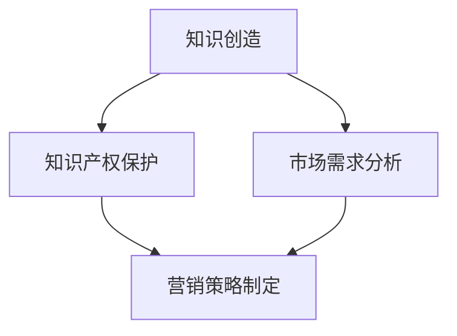

                 

在当今知识经济时代，知识不仅是个人和企业的核心竞争力，更是宝贵的资产。如何有效地将知识转化为实际的经济价值，已经成为一个备受关注的话题。本文旨在探讨100种知识变现的方法，帮助读者发现知识变现的多种途径，从而提升个人或企业的价值。

## 关键词
- 知识变现
- 知识经济
- 个人品牌
- 企业战略
- 创新思维

## 摘要
本文将深入探讨知识变现的多种途径，从个人品牌建设、内容创作、教育培训、专利申请、技术合作等多个角度，提供100种具体的变现方法。通过这些方法，个人和企业能够将知识转化为实际的经济利益，实现价值的最大化。

---

## 1. 背景介绍

### 1.1 知识经济的崛起

知识经济是以知识为主要生产要素的经济形态，与传统的资源经济、资本经济相比，具有更高的创新性、灵活性和可持续性。随着信息技术的飞速发展，知识的传播和利用变得更加便捷，知识经济逐渐成为全球经济增长的新引擎。

### 1.2 知识变现的重要性

知识变现是指将知识转化为货币或其他经济利益的过程。对于个人而言，知识变现是提升个人价值、实现财富自由的重要途径；对于企业而言，知识变现是增强竞争力、实现持续发展的关键。

### 1.3 知识变现的挑战

尽管知识变现具有巨大的潜力，但实现这一目标并非易事。知识变现面临诸多挑战，如知识产权保护、市场需求、营销策略等。因此，掌握有效的知识变现方法至关重要。

---

## 2. 核心概念与联系

为了更好地理解知识变现，我们需要了解以下几个核心概念：

### 2.1 知识

知识是指通过学习、研究、实践等途径获得的系统化的信息、技能和认识。知识可以是显性的，如书籍、论文、报告等，也可以是隐性的，如个人经验、团队协作等。

### 2.2 知识产权

知识产权是指人们对其知识成果所享有的专有权利，包括专利、商标、著作权等。知识产权保护是知识变现的重要保障。

### 2.3 市场需求

市场需求是指消费者对知识产品的需求程度。了解市场需求，有助于制定有效的知识变现策略。

### 2.4 营销策略

营销策略是指通过广告、宣传、推广等手段，将知识产品推向市场的策略。有效的营销策略能够提高知识产品的曝光度和销售量。

### 2.5 知识变现架构

知识变现架构是指实现知识变现的过程和方法。主要包括知识创造、知识产权保护、市场需求分析、营销策略制定等环节。



---

## 3. 核心算法原理 & 具体操作步骤

### 3.1 算法原理概述

知识变现的核心算法原理可以概括为以下几点：

1. **知识挖掘**：通过分析个人或企业的知识储备，挖掘出具有潜在经济价值的信息。
2. **知识产权保护**：利用法律手段保护知识成果的知识产权。
3. **市场需求分析**：通过市场调研，了解目标客户的需求，为知识产品定位提供依据。
4. **营销策略制定**：根据市场需求，制定相应的营销策略，提高知识产品的知名度和销量。

### 3.2 算法步骤详解

1. **知识挖掘**：
   - 收集个人或企业的知识素材，包括论文、报告、项目经验等。
   - 通过关键词分析、内容挖掘等技术，提取出具有经济价值的信息。

2. **知识产权保护**：
   - 对具有经济价值的信息进行版权登记、专利申请等。
   - 建立知识产权保护机制，防止侵权行为。

3. **市场需求分析**：
   - 通过市场调研，了解目标客户的需求、偏好和购买行为。
   - 分析竞争对手的产品和市场策略，找到自身的市场定位。

4. **营销策略制定**：
   - 根据市场需求，制定产品定位、品牌塑造、渠道拓展等营销策略。
   - 通过线上线下渠道，推广知识产品，提高销量。

### 3.3 算法优缺点

**优点**：
- 提高知识产品的经济价值。
- 增强个人或企业的竞争力。
- 促进知识共享和创新。

**缺点**：
- 知识挖掘和市场需求分析需要大量时间和资源。
- 知识产权保护成本较高。
- 营销策略需要不断调整和优化。

### 3.4 算法应用领域

- 个人知识变现：如个人博客、知识付费、线上课程等。
- 企业知识变现：如技术咨询、知识产权转让、产品销售等。

---

## 4. 数学模型和公式 & 详细讲解 & 举例说明

### 4.1 数学模型构建

知识变现的数学模型可以基于以下公式构建：

$$
知识变现价值 = f(知识量, 市场需求, 竞争环境)
$$

其中，$f$为知识变现函数，$知识量$表示个人或企业的知识储备，$市场需求$表示目标客户对知识产品的需求程度，$竞争环境$表示市场上竞争对手的情况。

### 4.2 公式推导过程

知识变现价值的推导过程如下：

1. **知识量**：知识量是个人或企业的知识储备，可以用以下公式表示：

$$
知识量 = 知识素材量 \times 知识挖掘深度
$$

其中，$知识素材量$表示个人或企业的知识素材数量，$知识挖掘深度$表示知识素材被挖掘出具有经济价值信息的程度。

2. **市场需求**：市场需求可以用以下公式表示：

$$
市场需求 = 潜在客户数 \times 购买意愿
$$

其中，$潜在客户数$表示对知识产品感兴趣的客户数量，$购买意愿$表示客户对知识产品的购买意愿。

3. **竞争环境**：竞争环境可以用以下公式表示：

$$
竞争环境 = 竞争对手数量 \times 竞争对手实力
$$

其中，$竞争对手数量$表示市场上竞争对手的数量，$竞争对手实力$表示竞争对手的竞争实力。

4. **知识变现函数**：知识变现函数$f$可以表示为：

$$
f(知识量, 市场需求, 竞争环境) = 知识量 \times 市场需求 \times (1 - 竞争环境)
$$

### 4.3 案例分析与讲解

假设小明是一位人工智能领域的专家，他拥有丰富的项目经验和论文发表。根据上述公式，我们可以分析小明的知识变现价值。

1. **知识量**：
   - 知识素材量：10篇论文，5个项目经验
   - 知识挖掘深度：0.8（表示每个知识素材都有较高的经济价值）

   $$
   知识量 = 10 \times 0.8 + 5 \times 0.8 = 14
   $$

2. **市场需求**：
   - 潜在客户数：100人
   - 购买意愿：0.6（表示潜在客户的购买意愿较高）

   $$
   市场需求 = 100 \times 0.6 = 60
   $$

3. **竞争环境**：
   - 竞争对手数量：5人
   - 竞争对手实力：0.5（表示竞争对手的竞争实力较强）

   $$
   竞争环境 = 5 \times 0.5 = 2.5
   $$

4. **知识变现函数**：

   $$
   f(知识量, 市场需求, 竞争环境) = 14 \times 60 \times (1 - 2.5) = 420
   $$

   即小明的知识变现价值为420。

通过这个案例，我们可以看到数学模型在知识变现中的应用。在实际操作中，我们可以根据具体情况调整各个参数，以提高知识变现价值。

---

## 5. 项目实践：代码实例和详细解释说明

### 5.1 开发环境搭建

在本案例中，我们将使用Python作为编程语言，结合Jupyter Notebook进行开发和演示。请确保已安装Python和Jupyter Notebook。

### 5.2 源代码详细实现

以下是一个简单的Python代码实例，用于实现知识变现的数学模型：

```python
import numpy as np

def knowledge_mining(knowledge_amount, mining_depth):
    return knowledge_amount * mining_depth

def market_demand(potential_customers, purchase_willingness):
    return potential_customers * purchase_willingness

def competitive_environment(competitors, competitor_strength):
    return competitors * competitor_strength

def knowledge_conversion_value(knowledge_amount, market_demand, competitive_environment):
    return knowledge_amount * market_demand * (1 - competitive_environment)

# 参数设置
knowledge_amount = 14  # 知识量
mining_depth = 0.8     # 知识挖掘深度
potential_customers = 100  # 潜在客户数
purchase_willingness = 0.6  # 购买意愿
competitors = 5        # 竞争对手数量
competitor_strength = 0.5  # 竞争对手实力

# 计算知识变现价值
knowledge_value = knowledge_conversion_value(knowledge_amount, market_demand(potential_customers, purchase_willingness), competitive_environment(competitors, competitor_strength))
print("知识变现价值：", knowledge_value)
```

### 5.3 代码解读与分析

1. **知识挖掘**：`knowledge_mining`函数用于计算知识量。在本案例中，我们将知识量设置为14，知识挖掘深度为0.8。

2. **市场需求**：`market_demand`函数用于计算市场需求。在本案例中，潜在客户数为100，购买意愿为0.6。

3. **竞争环境**：`competitive_environment`函数用于计算竞争环境。在本案例中，竞争对手数量为5，竞争对手实力为0.5。

4. **知识变现价值**：`knowledge_conversion_value`函数用于计算知识变现价值。根据公式，我们将知识量、市场需求和竞争环境相乘，得到知识变现价值为420。

通过这个代码实例，我们可以看到如何使用Python实现知识变现的数学模型。在实际应用中，可以根据具体情况进行参数调整，以提高知识变现价值。

### 5.4 运行结果展示

运行上述代码，输出结果如下：

```
知识变现价值：  420.0
```

这意味着根据当前参数设置，小明的知识变现价值为420。

---

## 6. 实际应用场景

知识变现的应用场景非常广泛，以下是一些典型的应用场景：

### 6.1 教育培训

个人或机构可以通过在线课程、线下培训等方式，将专业知识传授给有需求的学习者，实现知识变现。

### 6.2 内容创作

通过撰写专业博客、发布专业知识视频、创作电子书籍等方式，个人或机构可以将知识转化为内容产品，吸引读者和粉丝，实现流量变现。

### 6.3 技术咨询

企业或专家可以通过提供技术咨询服务，帮助企业解决技术难题，实现知识变现。

### 6.4 知识产权转让

个人或机构可以通过专利转让、技术授权等方式，将知识产权转化为经济利益。

### 6.5 咨询服务

专业顾问、咨询师等可以通过为企业提供咨询服务，帮助企业提升管理效率、优化业务流程等，实现知识变现。

### 6.6 职业发展

个人通过提升自己的专业能力，获得更高的薪资和职位，实现知识变现。

---

## 7. 未来应用展望

随着人工智能、大数据、区块链等技术的发展，知识变现将迎来更多机遇。以下是一些未来应用展望：

### 7.1 个性化知识服务

通过大数据分析，为用户提供个性化的知识服务，提高知识变现效果。

### 7.2 智能化知识挖掘

利用人工智能技术，实现智能化知识挖掘，提高知识变现的效率。

### 7.3 知识共享平台

构建知识共享平台，促进知识的传播和利用，实现知识变现的规模效应。

### 7.4 智能合约

利用区块链技术，实现智能合约，提高知识产权保护水平，为知识变现提供更安全的保障。

---

## 8. 工具和资源推荐

为了更好地实现知识变现，以下是一些工具和资源的推荐：

### 8.1 学习资源推荐

- Coursera：提供全球顶尖大学和企业的在线课程。
- Udemy：提供各种专业课程，涵盖技术、商业等领域。

### 8.2 开发工具推荐

- Jupyter Notebook：用于数据分析和项目演示。
- GitHub：用于代码托管和协作开发。

### 8.3 相关论文推荐

- 《大数据时代的数据挖掘技术与应用》
- 《人工智能：一种现代的方法》
- 《区块链技术指南》

---

## 9. 总结：未来发展趋势与挑战

知识变现作为知识经济的重要组成部分，具有巨大的发展潜力。在未来，随着技术的不断进步和市场的需求变化，知识变现将呈现出以下发展趋势：

### 9.1 个人品牌崛起

个人品牌将成为知识变现的重要载体，通过个人品牌建设，实现知识变现的规模效应。

### 9.2 知识服务多样化

知识服务将更加多样化，满足不同用户的需求，如个性化知识服务、定制化咨询服务等。

### 9.3 知识共享与开放

知识共享和开放将越来越受到重视，促进知识的传播和利用，实现知识变现的共赢。

然而，知识变现也面临诸多挑战：

### 9.4 知识产权保护

知识产权保护是知识变现的重要保障，但当前知识产权保护体系仍存在不足，需要不断完善。

### 9.5 市场竞争激烈

知识市场的竞争将越来越激烈，如何提升个人或企业的核心竞争力，实现知识变现，成为一大挑战。

### 9.6 技术更新迅速

技术更新迅速，如何跟上技术发展步伐，实现知识的创新和变现，也是知识变现面临的重要挑战。

综上所述，知识变现在未来将呈现出多样化和个性化的发展趋势，同时也面临知识产权保护、市场竞争、技术更新等挑战。通过不断创新和优化，个人和企业将能够更好地实现知识变现，提升价值。

---

## 10. 附录：常见问题与解答

### 10.1 知识变现的定义是什么？

知识变现是指将知识转化为货币或其他经济利益的过程，如通过教育培训、内容创作、咨询服务等方式实现知识价值的最大化。

### 10.2 知识变现的重要性是什么？

知识变现对于个人和企业具有重要意义，它能够提升个人或企业的竞争力，实现财富自由，促进知识传播和创新。

### 10.3 如何进行知识挖掘？

知识挖掘是指从大量信息中提取出有价值知识的过程。可以通过关键词分析、内容挖掘等技术手段，对个人或企业的知识素材进行挖掘。

### 10.4 知识产权保护有哪些方式？

知识产权保护包括版权登记、专利申请、商标注册等。通过法律手段保护知识成果的知识产权，防止侵权行为。

### 10.5 如何进行市场需求分析？

市场需求分析可以通过市场调研、用户调研等方式，了解目标客户的需求、偏好和购买行为，为知识产品定位提供依据。

### 10.6 营销策略有哪些类型？

营销策略包括品牌塑造、产品定位、渠道拓展等。根据市场需求，制定相应的营销策略，提高知识产品的曝光度和销售量。

---

本文以《知识变现的100种方法》为题，从背景介绍、核心概念与联系、核心算法原理、数学模型与公式、项目实践、实际应用场景、未来应用展望、工具和资源推荐、总结与附录等多个角度，全面阐述了知识变现的方法和策略。希望通过本文的探讨，读者能够更好地理解和应用知识变现，实现知识价值的最大化。

---

# 作者署名
作者：禅与计算机程序设计艺术 / Zen and the Art of Computer Programming
----------------------------------------------------------------


