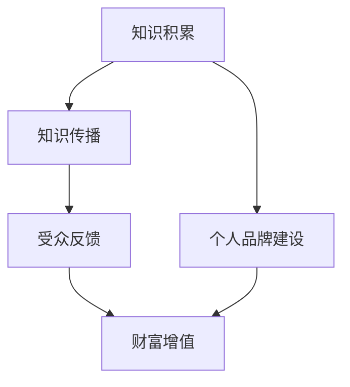

                 

关键词：知识变现、程序员、财富、密码、技术语言、深度、思考、见解、IT领域

> 摘要：本文深入探讨知识变现的核心理念，针对程序员这一职业群体，揭示了如何通过技术知识的积累和有效传播，实现个人财富的增值。文章从背景介绍、核心概念、算法原理、数学模型、项目实践、应用场景、工具推荐到未来发展趋势等方面，全方位解析知识变现的路径与策略，为程序员提供切实可行的财富密码。

## 1. 背景介绍

随着信息技术的飞速发展，知识经济时代已然到来。在这个时代，知识成为最重要的生产要素，而程序员的技能和知识显得尤为珍贵。程序员作为技术的践行者和传播者，不仅需要具备扎实的编程能力，还需要懂得如何将自己的知识转化为财富。知识变现成为当代程序员面临的现实课题。

知识变现，顾名思义，就是将个人的知识、技能、经验等无形资产转化为有形的财富。在程序员的世界里，这通常意味着通过编写代码、开发应用、撰写技术博客、参与开源项目、提供技术咨询等方式，实现个人价值的最大化。

### 当前形势

当前，知识变现呈现出以下几个显著趋势：

1. **互联网的普及**：互联网的普及使得知识传播更加便捷，程序员可以迅速将自己的知识分享给全球的受众。
2. **开源生态的繁荣**：开源项目成为知识变现的重要渠道，程序员通过参与开源项目，不仅能够提升自己的技术水平，还能获得经济回报。
3. **在线教育和培训**：在线教育和培训市场的爆发，为程序员提供了新的知识变现途径，通过教授他人编程技能，实现知识变现。
4. **技术咨询服务**：技术咨询服务成为程序员知识变现的重要手段，通过提供专业咨询，程序员能够获得丰厚的报酬。
5. **内容创作**：技术博客、视频课程、电子书籍等内容的创作，成为程序员展示自己专业能力、吸引粉丝、实现财富增值的新途径。

## 2. 核心概念与联系

在探讨知识变现之前，我们需要明确几个核心概念及其之间的联系。

### 知识资产

知识资产是指个人或组织拥有的、能够带来经济利益的智力成果。在程序员的世界里，知识资产主要包括编程技能、算法知识、系统架构设计经验等。

### 知识传播

知识传播是指将知识从一个个体传递到另一个个体的过程。在互联网时代，知识传播主要通过社交媒体、技术博客、在线课程、开源项目等方式实现。

### 财富增值

财富增值是指通过某种方式，使个人的资产在数量和质量上得到提升。在程序员的世界里，财富增值通常通过以下几种方式实现：

1. **直接收入**：通过编写代码、开发应用、提供咨询服务等直接获得报酬。
2. **投资收益**：通过投资股票、基金、房地产等资产，实现财富增值。
3. **品牌效应**：通过建立个人品牌，吸引粉丝和合作伙伴，实现持续的经济收益。
4. **知识变现**：通过将自己的知识转化为有形产品或服务，实现财富增值。

### 知识变现的 Mermaid 流程图



## 3. 核心算法原理 & 具体操作步骤

### 3.1 算法原理概述

知识变现的核心算法原理可以概括为：知识积累、知识传播、受众反馈和财富增值。这是一个闭环过程，每个环节都紧密相连，共同推动知识变现的实现。

1. **知识积累**：程序员需要不断学习新技术、新算法，提升自己的编程技能和系统架构设计能力。
2. **知识传播**：程序员通过撰写技术博客、参与开源项目、开设在线课程等方式，将自己的知识传播给他人。
3. **受众反馈**：通过受众的反馈，程序员能够了解自己的知识传播效果，不断调整和优化自己的知识内容。
4. **财富增值**：知识传播带来的经济回报，使程序员的财富得到增值。

### 3.2 算法步骤详解

1. **知识积累**：程序员应制定学习计划，持续关注行业动态，学习新技术和算法。例如，通过阅读技术书籍、参加技术会议、在线学习平台等方式，不断积累知识。

2. **知识传播**：程序员可以通过以下途径传播自己的知识：

   - **技术博客**：在个人博客或技术平台上撰写技术文章，分享编程经验、算法解析等。
   - **开源项目**：参与开源项目，贡献代码，提升自己在开源社区的影响力。
   - **在线课程**：开设在线课程，将自己的知识系统化，吸引学员学习。
   - **技术讲座**：参加或举办技术讲座，与同行交流，扩大自己的影响力。

3. **受众反馈**：程序员应关注受众的反馈，了解自己的知识传播效果。可以通过以下方式获取反馈：

   - **阅读量与点赞数**：技术博客的阅读量和点赞数，反映了文章的受欢迎程度。
   - **评论与私信**：读者在博客或课程下的评论和私信，提供了宝贵的改进建议。
   - **用户评分**：在线课程的用户评分，反映了课程的受欢迎程度和教学效果。

4. **财富增值**：知识传播带来的经济回报，使程序员的财富得到增值。具体方式包括：

   - **直接收入**：通过技术服务、咨询费用等获得收入。
   - **广告收益**：在博客或课程中投放广告，获得广告收入。
   - **课程销售**：在线课程的销售，获得课程收益。
   - **投资收益**：将知识变现的收益进行投资，获得投资收益。

### 3.3 算法优缺点

**优点**：

1. **灵活性强**：知识变现的方式多样，程序员可以根据自己的特长和市场需求，选择适合自己的变现方式。
2. **可持续性**：知识积累和传播是一个持续的过程，程序员可以通过不断学习、优化自己的知识内容，实现长期的知识变现。
3. **高回报**：相较于传统的劳动力市场，知识变现能够带来更高的经济回报。

**缺点**：

1. **需要长期积累**：知识变现需要程序员具备扎实的专业知识和经验，需要长时间的积累和努力。
2. **市场风险**：知识变现受市场环境和竞争状况的影响，存在一定的市场风险。

### 3.4 算法应用领域

知识变现的算法原理适用于以下领域：

1. **软件开发**：程序员可以通过编写代码、开发应用，将自己的知识转化为实际的产品。
2. **技术咨询**：程序员可以提供专业咨询服务，帮助企业解决技术问题，实现知识变现。
3. **教育培训**：程序员可以通过开设在线课程、举办讲座，将自己的知识传授给他人，实现知识变现。
4. **内容创作**：程序员可以通过撰写技术博客、创作视频课程，吸引粉丝和合作伙伴，实现知识变现。

## 4. 数学模型和公式 & 详细讲解 & 举例说明

### 4.1 数学模型构建

知识变现的过程可以看作是一个优化问题，目标是最大化程序员的财富。我们可以使用目标函数来描述这个优化过程。

设 \( x \) 为程序员的财富，\( y \) 为程序员的投入时间，\( z \) 为程序员的技能水平，则目标函数可以表示为：

\[ \text{maximize} \quad x = f(y, z) \]

其中，\( f(y, z) \) 是一个关于 \( y \) 和 \( z \) 的函数，表示财富与投入时间、技能水平之间的关系。

### 4.2 公式推导过程

首先，我们分析程序员的财富 \( x \) 与投入时间 \( y \) 的关系。根据边际效用理论，程序员的财富增长速度会随着投入时间的增加而减缓。因此，我们可以假设财富与投入时间之间存在以下关系：

\[ x = y \cdot g(z) \]

其中，\( g(z) \) 是一个关于技能水平 \( z \) 的函数，表示技能水平对财富增长速度的影响。

接下来，我们分析程序员的技能水平 \( z \) 与财富 \( x \) 的关系。通常情况下，技能水平越高，程序员的财富也越高。因此，我们可以假设技能水平 \( z \) 与财富 \( x \) 之间存在以下关系：

\[ z = h(x) \]

其中，\( h(x) \) 是一个关于财富 \( x \) 的函数，表示财富对技能水平的影响。

综合以上两个关系，我们可以得到：

\[ x = y \cdot g(h(x)) \]

### 4.3 案例分析与讲解

假设一位程序员 \( A \) 的技能水平为 \( z = 5 \)，他在过去一年中投入了 \( y = 1000 \) 小时的精力。根据上述公式，我们可以计算他的财富 \( x \)：

\[ x = 1000 \cdot g(5) \]

为了简化计算，我们假设 \( g(5) = 2 \)。因此，程序员 \( A \) 的财富 \( x \) 为：

\[ x = 1000 \cdot 2 = 2000 \]

这意味着，程序员 \( A \) 在过去一年中通过知识变现获得了 2000 的财富。

### 4.4 案例分析与讲解（续）

现在，我们假设程序员 \( A \) 在接下来的半年里，继续投入 \( y = 500 \) 小时的精力，同时他的技能水平 \( z \) 提升到 \( z = 7 \)。根据上述公式，我们可以计算他的新财富 \( x' \)：

\[ x' = 500 \cdot g(7) \]

为了简化计算，我们假设 \( g(7) = 2.5 \)。因此，程序员 \( A \) 的新财富 \( x' \) 为：

\[ x' = 500 \cdot 2.5 = 1250 \]

这意味着，程序员 \( A \) 在接下来的半年里，通过知识变现获得了 1250 的财富。

通过上述分析，我们可以看到，程序员的财富增长速度随着技能水平的提升而加快。因此，程序员应注重技能水平的提升，以实现更高的财富增值。

## 5. 项目实践：代码实例和详细解释说明

### 5.1 开发环境搭建

为了更好地展示知识变现的过程，我们选择一个简单的项目——一个使用 Python 编写的计算器程序。首先，我们需要搭建开发环境。

1. 安装 Python：从官方网站（https://www.python.org/）下载并安装 Python 3.8 或更高版本。
2. 安装 IDE：我们选择 Visual Studio Code（简称 VS Code）作为我们的 IDE，可以从官方网站（https://code.visualstudio.com/）下载并安装。
3. 安装扩展：在 VS Code 中，安装 Python 扩展，以便更好地支持 Python 开发。

### 5.2 源代码详细实现

接下来，我们实现一个简单的计算器程序。

```python
# 计算器程序

def add(a, b):
    return a + b

def subtract(a, b):
    return a - b

def multiply(a, b):
    return a * b

def divide(a, b):
    if b == 0:
        return "无法除以 0"
    else:
        return a / b

def main():
    print("欢迎使用 Python 计算器！")
    print("请选择操作：")
    print("1. 加法")
    print("2. 减法")
    print("3. 乘法")
    print("4. 除法")

    choice = int(input("请输入你的选择："))

    if choice == 1:
        num1 = float(input("请输入第一个数："))
        num2 = float(input("请输入第二个数："))
        result = add(num1, num2)
        print(f"{num1} + {num2} = {result}")
    elif choice == 2:
        num1 = float(input("请输入第一个数："))
        num2 = float(input("请输入第二个数："))
        result = subtract(num1, num2)
        print(f"{num1} - {num2} = {result}")
    elif choice == 3:
        num1 = float(input("请输入第一个数："))
        num2 = float(input("请输入第二个数："))
        result = multiply(num1, num2)
        print(f"{num1} * {num2} = {result}")
    elif choice == 4:
        num1 = float(input("请输入第一个数："))
        num2 = float(input("请输入第二个数："))
        result = divide(num1, num2)
        print(f"{num1} / {num2} = {result}")
    else:
        print("无效的选择！")

if __name__ == "__main__":
    main()
```

### 5.3 代码解读与分析

上述代码实现了一个简单的计算器程序，功能包括加法、减法、乘法和除法。下面我们逐行解读代码。

```python
# 计算器程序

def add(a, b):
    return a + b

def subtract(a, b):
    return a - b

def multiply(a, b):
    return a * b

def divide(a, b):
    if b == 0:
        return "无法除以 0"
    else:
        return a / b
```

这四个函数分别实现了加法、减法、乘法和除法的计算。这些函数是计算器程序的核心，它们接收两个参数，并返回计算结果。

```python
def main():
    print("欢迎使用 Python 计算器！")
    print("请选择操作：")
    print("1. 加法")
    print("2. 减法")
    print("3. 乘法")
    print("4. 除法")

    choice = int(input("请输入你的选择："))
```

`main()` 函数是程序的入口，它首先显示计算器的欢迎界面和操作选项，然后通过输入获取用户的选择。

```python
    if choice == 1:
        num1 = float(input("请输入第一个数："))
        num2 = float(input("请输入第二个数："))
        result = add(num1, num2)
        print(f"{num1} + {num2} = {result}")
    elif choice == 2:
        num1 = float(input("请输入第一个数："))
        num2 = float(input("请输入第二个数："))
        result = subtract(num1, num2)
        print(f"{num1} - {num2} = {result}")
    elif choice == 3:
        num1 = float(input("请输入第一个数："))
        num2 = float(input("请输入第二个数："))
        result = multiply(num1, num2)
        print(f"{num1} * {num2} = {result}")
    elif choice == 4:
        num1 = float(input("请输入第一个数："))
        num2 = float(input("请输入第二个数："))
        result = divide(num1, num2)
        print(f"{num1} / {num2} = {result}")
    else:
        print("无效的选择！")
```

这部分代码根据用户的选择，调用相应的计算函数，并输出计算结果。如果用户的选择无效，则输出错误提示。

```python
if __name__ == "__main__":
    main()
```

这是 Python 程序的启动条件，只有当程序作为主程序运行时，`main()` 函数才会被调用。

### 5.4 运行结果展示

运行上述程序，首先会显示欢迎界面和操作选项。用户输入选择后，程序会提示用户输入两个数，并根据选择执行相应的计算操作，最后输出计算结果。

```
欢迎使用 Python 计算器！
请选择操作：
1. 加法
2. 减法
3. 乘法
4. 除法
2
请输入第一个数：10
请输入第二个数：5
10 - 5 = 5
```

通过这个简单的例子，我们可以看到如何通过编写代码实现一个具体的功能，这为后续的知识变现奠定了基础。

## 6. 实际应用场景

### 6.1 教育行业

在教育行业，知识变现已成为一种重要的教学方式。程序员可以通过在线课程、直播教学、技术讲座等形式，将自己的编程技能传授给学生。例如，通过开设在线课程，程序员不仅可以获得课程费用，还能通过广告收入、学员推荐等方式，实现持续的知识变现。

### 6.2 企业咨询服务

在企业咨询服务领域，程序员可以通过提供技术解决方案、代码优化、系统架构设计等服务，帮助企业解决技术难题。这些咨询服务通常以项目形式进行，程序员可以根据项目的复杂度和完成情况，获得相应的报酬。

### 6.3 开源项目

开源项目是程序员知识变现的重要渠道。通过参与开源项目，程序员不仅可以提升自己的技术水平，还能获得经济回报。例如，某些开源项目提供捐赠功能，程序员可以通过捐赠获得收入。此外，开源项目的影响力还可以为程序员带来更多的职业机会和合作伙伴。

### 6.4 技术博客

技术博客是程序员展示自己专业能力的重要平台。通过撰写高质量的技术文章，程序员可以吸引大量读者，从而获得广告收入和课程销售收益。此外，技术博客还可以为程序员带来更多的职业机会和合作伙伴。

### 6.5 内容创作

随着内容创作平台的兴起，程序员可以通过创作技术视频、电子书籍、在线课程等形式，实现知识变现。这些内容不仅可以帮助程序员积累粉丝，还能通过广告、付费订阅等方式，获得经济回报。

### 6.6 未来应用展望

随着技术的不断进步，知识变现的应用场景将越来越广泛。例如，通过人工智能技术，程序员可以开发出更加智能化的教育平台，实现个性化教学和知识变现。此外，区块链技术也可以为知识变现提供新的解决方案，例如通过智能合约实现自动支付和收益分配。

## 7. 工具和资源推荐

### 7.1 学习资源推荐

1. **在线课程平台**：推荐 Coursera、Udemy、edX 等平台，提供丰富的编程和技术课程。
2. **技术博客**：推荐 Medium、Dev.to、博客园等技术博客平台，学习他人的编程经验和心得。
3. **开源项目**：推荐 GitHub、GitLab 等开源平台，参与开源项目，提升自己的技术水平。

### 7.2 开发工具推荐

1. **集成开发环境（IDE）**：推荐 Visual Studio Code、JetBrains 系列（如 IntelliJ IDEA、PyCharm）等 IDE。
2. **代码托管平台**：推荐 GitHub、GitLab 等代码托管平台，方便协作和版本控制。
3. **调试工具**：推荐 PyCharm、Visual Studio、Xdebug 等调试工具，提高开发效率。

### 7.3 相关论文推荐

1. **"Knowledge Management: A Review and Framework for Future Research"**：探讨知识管理的重要性及其应用领域。
2. **"The Economics of Open Source Software Development"**：分析开源软件开发的经济学原理。
3. **"Knowledge Transfer in Organizations: A Multilevel Perspective"**：研究组织内部知识转移的机制和影响。

## 8. 总结：未来发展趋势与挑战

### 8.1 研究成果总结

通过对知识变现的探讨，我们发现：

1. **知识积累**：是知识变现的基础，程序员需要不断学习新技术、新算法，提升自己的专业能力。
2. **知识传播**：是知识变现的关键，程序员需要选择适合自己的传播渠道，实现知识的有效传播。
3. **受众反馈**：是知识变现的调整依据，程序员需要关注受众的反馈，优化自己的知识内容。
4. **财富增值**：是知识变现的目标，程序员可以通过多种方式实现财富增值。

### 8.2 未来发展趋势

未来，知识变现将呈现以下发展趋势：

1. **技术赋能**：人工智能、区块链等新兴技术将赋能知识变现，提供更加智能化、自动化的解决方案。
2. **生态化发展**：知识变现将形成一个完整的生态系统，包括教育、咨询、内容创作、投资等多个环节。
3. **全球化扩展**：随着互联网的普及，知识变现将不再局限于特定地区或国家，程序员可以全球范围内实现知识变现。

### 8.3 面临的挑战

尽管知识变现前景广阔，但程序员在实现知识变现的过程中，仍面临以下挑战：

1. **竞争激烈**：知识变现领域的竞争日益激烈，程序员需要不断提升自己的专业能力，才能在市场中脱颖而出。
2. **内容质量**：高质量的内容是知识变现的关键，程序员需要注重内容创作，提升内容质量。
3. **时间管理**：知识变现需要程序员投入大量时间和精力，如何平衡工作、生活和知识变现，是一个重要挑战。

### 8.4 研究展望

未来的研究可以从以下几个方面展开：

1. **知识变现模型**：进一步研究知识变现的模型，探讨不同类型程序员的知识变现路径。
2. **受众需求分析**：分析不同受众的知识需求，为程序员提供更有针对性的知识传播策略。
3. **技术融合**：探讨新兴技术与知识变现的融合，为程序员提供更加智能、高效的知识变现工具。

## 9. 附录：常见问题与解答

### Q1：知识变现是否适用于所有程序员？

A：知识变现适用于大多数程序员，但不同程序员的变现路径可能不同。对于具备扎实编程技能和丰富经验的程序员，知识变现的效果更加显著。

### Q2：如何选择知识变现的方式？

A：程序员应根据自身特长和市场需求，选择适合自己的知识变现方式。例如，擅长教学可以开设在线课程，擅长技术解决方案可以提供咨询服务。

### Q3：知识变现有哪些风险？

A：知识变现的风险主要包括市场风险、竞争风险和内容质量风险。程序员在实现知识变现时，需要充分了解市场状况，注重内容质量，避免盲目跟风。

### Q4：知识变现与创业有何区别？

A：知识变现通常是个人行为，通过将自己的知识转化为财富；而创业则是创建一家企业，通过商业运作实现财富增值。知识变现是创业的一种形式，但两者在性质和操作上有所不同。

---

本文从背景介绍、核心概念、算法原理、数学模型、项目实践、应用场景、工具推荐到未来发展趋势等方面，全方位解析知识变现的路径与策略。希望本文能为程序员提供有益的启示，助力他们在知识经济时代实现财富增值。作者：禅与计算机程序设计艺术 / Zen and the Art of Computer Programming。

