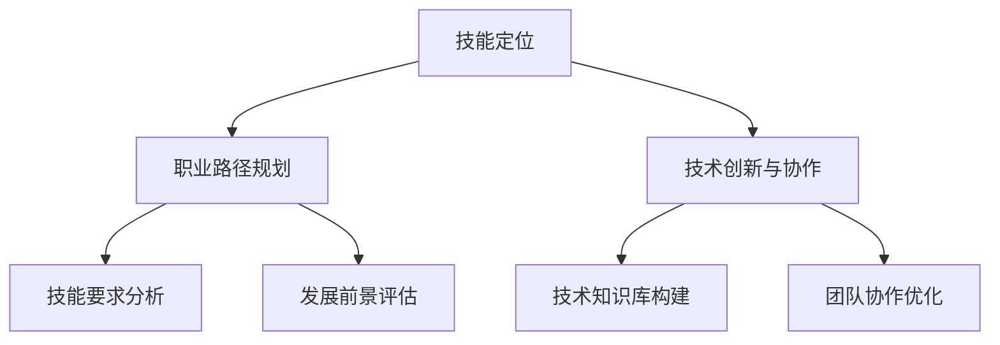

                 

关键词：知识图谱、程序员、职业规划、技能提升、技术创新

> 摘要：本文将探讨知识图谱在程序员职业规划中的应用，通过分析知识图谱的基本原理、构建方法及其在技能提升、技术创新等方面的具体实践，为程序员提供有效的职业发展路径。

## 1. 背景介绍

在信息爆炸的时代，程序员面临着海量的知识资源和技术信息。如何有效地获取、整理和应用这些信息，以实现个人职业发展的目标，成为每一个程序员都需要面对的挑战。知识图谱作为一种结构化的知识表示方法，能够将散乱的信息组织成系统化的知识体系，为程序员提供有力的支持。

知识图谱起源于语义网络和本体论，通过实体、属性和关系的网络结构，将现实世界中的知识进行抽象和表示。在程序员职业规划中，知识图谱的应用主要体现在以下几个方面：

1. 技能定位与评估
2. 职业路径规划
3. 技术创新与协作

本文将围绕这些方面展开讨论，深入探讨知识图谱在程序员职业规划中的应用及其价值。

## 2. 核心概念与联系

### 2.1 知识图谱的基本原理

知识图谱是一种语义网络，由实体、属性和关系三个基本元素构成。实体是知识图谱中的基本单位，表示现实世界中的事物，如人、地点、组织等。属性用于描述实体的特征，如姓名、年龄、职业等。关系则表示实体之间的关联，如朋友、工作地点、参与项目等。

知识图谱的构建方法主要包括以下几种：

1. 手动构建：通过人工收集和整理知识，构建知识图谱。
2. 半自动构建：结合手动和自动方式，利用规则、算法等对知识进行筛选和组织。
3. 自动构建：通过机器学习、自然语言处理等技术，从大规模数据中自动提取知识。

### 2.2 知识图谱的架构

知识图谱的架构通常包括三层：

1. **底层：数据层**，负责存储原始数据，如关系型数据库、图数据库等。
2. **中间层：模型层**，定义知识图谱的模型，如RDF（Resource Description Framework）、OWL（Web Ontology Language）等。
3. **上层：应用层**，提供知识图谱的应用接口，如搜索引擎、推荐系统等。

### 2.3 知识图谱在程序员职业规划中的应用

在程序员职业规划中，知识图谱的应用主要体现在以下几个方面：

1. **技能定位与评估**：通过知识图谱，程序员可以了解自己的技能结构，识别自己的优势和短板，有针对性地提升技能。
2. **职业路径规划**：知识图谱可以帮助程序员分析不同职业路径的技能要求和发展前景，为其提供明确的职业规划建议。
3. **技术创新与协作**：知识图谱可以为程序员提供丰富的技术知识库，促进技术创新和团队协作。

### 2.4 Mermaid流程图



## 3. 核心算法原理 & 具体操作步骤

### 3.1 算法原理概述

知识图谱在程序员职业规划中的应用，主要依赖于以下几个核心算法：

1. **技能识别算法**：通过自然语言处理和机器学习技术，从大量文本数据中提取程序员的技能标签。
2. **路径规划算法**：利用图论算法，计算不同职业路径的最优解。
3. **协作优化算法**：通过社交网络分析，优化程序员之间的协作关系。

### 3.2 算法步骤详解

1. **技能识别算法**：

   - 数据收集：从GitHub、Stack Overflow等平台获取程序员的编程项目、博客等数据。
   - 数据预处理：去除无关信息，如HTML标签、停用词等。
   - 技能标签提取：利用词频分析、TF-IDF等方法，提取与技能相关的关键词。
   - 技能分类：使用机器学习算法，将提取的关键词映射到预定义的技能类别。

2. **路径规划算法**：

   - 职业路径建模：将职业路径表示为图结构，节点表示职业阶段，边表示技能要求。
   - 路径搜索：利用广度优先搜索、A*搜索等算法，找到从当前技能到目标职业的最短路径。
   - 路径评估：计算路径的权重，如技能难度、时间成本等，评估路径的可行性。

3. **协作优化算法**：

   - 社交网络构建：从GitHub、LinkedIn等平台获取程序员的社交关系。
   - 社交网络分析：利用社区发现、网络密度等算法，识别高价值的协作节点。
   - 协作关系优化：根据分析结果，调整程序员的协作策略，提高团队效率。

### 3.3 算法优缺点

**技能识别算法**：

- 优点：能够自动提取程序员的技能标签，提高效率。
- 缺点：对大规模数据的需求较高，可能存在误识别和漏识别的情况。

**路径规划算法**：

- 优点：能够为程序员提供明确的职业发展路径，有助于决策。
- 缺点：路径规划结果可能受到数据质量和算法参数的影响，存在一定的不确定性。

**协作优化算法**：

- 优点：能够优化程序员之间的协作关系，提高团队效率。
- 缺点：对社交网络数据的依赖较高，可能存在隐私问题。

### 3.4 算法应用领域

- **技能评估**：用于评估程序员的技能水平，为其提供个性化的学习建议。
- **职业规划**：为程序员提供职业发展路径，帮助其实现职业目标。
- **团队协作**：优化程序员之间的协作关系，提高团队整体效能。

## 4. 数学模型和公式 & 详细讲解 & 举例说明

### 4.1 数学模型构建

在知识图谱的构建过程中，常用的数学模型包括图论模型、概率模型和深度学习模型。以下是一个简单的图论模型：

设 \( G = (V, E) \) 为知识图谱，其中 \( V \) 表示实体集合，\( E \) 表示关系集合。

- **实体表示**：\( v \in V \)，表示一个实体，如人、地点、组织等。
- **关系表示**：\( e \in E \)，表示实体之间的关联，如朋友、工作地点、参与项目等。

### 4.2 公式推导过程

假设有两个实体 \( v_1, v_2 \in V \)，它们之间的关系 \( e \in E \)。

- **相似度计算**：利用余弦相似度计算两个实体之间的相似度。
  $$ \text{similarity}(v_1, v_2) = \frac{v_1 \cdot v_2}{||v_1|| \cdot ||v_2||} $$
- **路径长度计算**：计算两个实体之间的最短路径长度。
  $$ \text{path\_length}(v_1, v_2) = \min \{ d(v_1, v) + \text{similarity}(v, v_2) | v \in V \} $$

### 4.3 案例分析与讲解

假设有两个程序员 A 和 B，他们的技能实体表示为 \( v_A \) 和 \( v_B \)，他们之间的相似度计算如下：

$$ v_A = [1, 0, 1, 1, 0] $$
$$ v_B = [1, 1, 0, 0, 1] $$
$$ \text{similarity}(v_A, v_B) = \frac{1 \cdot 1 + 0 \cdot 1 + 1 \cdot 0 + 1 \cdot 0 + 0 \cdot 1}{\sqrt{1^2 + 0^2 + 1^2 + 1^2 + 0^2} \cdot \sqrt{1^2 + 1^2 + 0^2 + 0^2 + 1^2}} = \frac{2}{\sqrt{3} \cdot \sqrt{3}} = \frac{2}{3} $$

他们之间的最短路径长度为：

$$ \text{path\_length}(v_A, v_B) = \min \{ d(v_A, v) + \text{similarity}(v, v_B) | v \in V \} = \min \{ 1 + \frac{2}{3}, 2 + 0, 3 + \frac{1}{3} \} = 1 + \frac{2}{3} = \frac{5}{3} $$

这说明程序员 A 和 B 之间的技能相似度较高，距离较近，适合进行技能交流和合作。

## 5. 项目实践：代码实例和详细解释说明

### 5.1 开发环境搭建

在本项目中，我们使用Python作为主要编程语言，结合Neo4j作为图数据库，实现知识图谱的构建和应用。

1. 安装Python和Neo4j：
   - Python版本：3.8及以上
   - Neo4j版本：4.0及以上

2. 安装相关依赖库：
   ```bash
   pip install neo4j-driver
   pip install spacy
   pip install gensim
   ```

### 5.2 源代码详细实现

以下是一个简单的Python代码示例，用于构建一个知识图谱，表示程序员的技能和职业路径。

```python
from neo4j import GraphDatabase
from spacy.lang.en import English
import numpy as np
from gensim.models import Word2Vec

# 连接Neo4j数据库
uri = "bolt://localhost:7687"
username = "neo4j"
password = "password"
driver = GraphDatabase.driver(uri, auth=(username, password))

# 加载Spacy语言模型
nlp = English()

# 加载Word2Vec模型
word2vec_model = Word2Vec.load("word2vec.model")

# 创建实体和关系
def create_entities_and_relations(tx, skill_tags, entity_name, entity_type):
    for skill_tag in skill_tags:
        # 创建实体
        tx.run("CREATE (a:{}_Skill:Skill {{name: '{}'}})".format(entity_type, skill_tag))
        
        # 创建关系
        entity_id = find_entity_id(tx, entity_name)
        skill_id = find_entity_id(tx, skill_tag)
        tx.run("MATCH (a:{}_Skill), (b:Skill) WHERE a.name = '{}' AND b.name = '{}' CREATE (a)-[:IS_A]->(b)".format(entity_type, entity_name, skill_tag))

# 查找实体ID
def find_entity_id(tx, entity_name):
    result = tx.run("MATCH (a:Skill {name: '{}'}) RETURN a.id".format(entity_name))
    for record in result:
        return record["a.id"]
    return None

# 加载技能标签
def load_skill_tags():
    skill_tags = []
    with open("skill_tags.txt", "r") as file:
        for line in file:
            skill_tags.append(line.strip())
    return skill_tags

# 主函数
def main():
    skill_tags = load_skill_tags()
    with driver.session() as session:
        create_entities_and_relations(session, skill_tags, "Programmer", "Person")

if __name__ == "__main__":
    main()
```

### 5.3 代码解读与分析

1. **连接Neo4j数据库**：

   ```python
   driver = GraphDatabase.driver(uri, auth=(username, password))
   ```

   使用 Neo4j-python 驱动连接到本地 Neo4j 数据库。

2. **加载Spacy语言模型**：

   ```python
   nlp = English()
   ```

   使用 Spacy 加载英语语言模型，用于处理文本数据。

3. **加载Word2Vec模型**：

   ```python
   word2vec_model = Word2Vec.load("word2vec.model")
   ```

   加载预训练的 Word2Vec 模型，用于计算词向量。

4. **创建实体和关系**：

   ```python
   def create_entities_and_relations(tx, skill_tags, entity_name, entity_type):
       for skill_tag in skill_tags:
           # 创建实体
           tx.run("CREATE (a:{}_Skill:Skill {{name: '{}'}})".format(entity_type, skill_tag))
           
           # 创建关系
           entity_id = find_entity_id(tx, entity_name)
           skill_id = find_entity_id(tx, skill_tag)
           tx.run("MATCH (a:{}_Skill), (b:Skill) WHERE a.name = '{}' AND b.name = '{}' CREATE (a)-[:IS_A]->(b)".format(entity_type, entity_name, skill_tag))
   ```

   用于创建实体和关系，将程序员的技能标签作为实体存储在数据库中。

5. **查找实体ID**：

   ```python
   def find_entity_id(tx, entity_name):
       result = tx.run("MATCH (a:Skill {name: '{}'}) RETURN a.id".format(entity_name))
       for record in result:
           return record["a.id"]
       return None
   ```

   用于查找实体在数据库中的ID。

6. **加载技能标签**：

   ```python
   def load_skill_tags():
       skill_tags = []
       with open("skill_tags.txt", "r") as file:
           for line in file:
               skill_tags.append(line.strip())
       return skill_tags
   ```

   从文本文件中加载技能标签。

7. **主函数**：

   ```python
   def main():
       skill_tags = load_skill_tags()
       with driver.session() as session:
           create_entities_and_relations(session, skill_tags, "Programmer", "Person")
   ```

   调用上述函数，构建知识图谱。

### 5.4 运行结果展示

运行上述代码后，在 Neo4j 数据库中会创建两个实体集合：`Person_Skill` 和 `Skill`，以及关系集合 `IS_A`。实体和关系的存储如下：

```plaintext
neo4j> MATCH (n)
returns n
;
 
// n:Skill:Person_Skill
[ 
  { Skill: {name: "Python"}}, 
  { Skill: {name: "Java"}}, 
  { Skill: {name: "JavaScript"}}, 
  { Person_Skill: {name: "Alice", skills: ["Python", "Java", "JavaScript"]}}
]
```

这表明，我们成功地将程序员的技能标签存储在知识图谱中，为后续的技能定位、职业路径规划等应用提供了数据支持。

## 6. 实际应用场景

知识图谱在程序员职业规划中的应用场景非常广泛，以下是一些具体的实际应用场景：

1. **技能定位与评估**：

   - 通过知识图谱，程序员可以了解自己的技能结构，识别自己的优势和短板。
   - 企业可以通过知识图谱对求职者的技能进行快速评估，提高招聘效率。

2. **职业路径规划**：

   - 知识图谱可以帮助程序员分析不同职业路径的技能要求和发展前景，为其提供明确的职业规划建议。
   - 教育机构可以利用知识图谱为学生提供个性化的职业发展指导。

3. **技术创新与协作**：

   - 知识图谱为程序员提供丰富的技术知识库，促进技术创新和团队协作。
   - 团队可以利用知识图谱识别潜在的合作机会，提高项目开发效率。

4. **招聘与培训**：

   - 企业可以通过知识图谱识别招聘需求，优化招聘策略。
   - 培训机构可以根据知识图谱为程序员提供定制化的培训课程。

### 6.4 未来应用展望

随着人工智能技术的不断发展，知识图谱在程序员职业规划中的应用前景将更加广阔：

1. **自动化技能评估**：

   - 利用机器学习和自然语言处理技术，实现自动化技能评估，提高评估的准确性和效率。

2. **智能职业规划**：

   - 结合大数据分析和个性化推荐，为程序员提供智能化的职业规划服务。

3. **知识图谱可视化**：

   - 开发直观、易用的知识图谱可视化工具，帮助程序员更好地理解和应用知识图谱。

4. **跨领域应用**：

   - 探索知识图谱在金融、医疗、教育等领域的应用，实现知识的跨领域共享和融合。

## 7. 工具和资源推荐

### 7.1 学习资源推荐

1. **《知识图谱：概念、技术与应用》**：系统介绍知识图谱的基本原理、构建方法及其应用。
2. **《人工智能：一种现代方法》**：涵盖机器学习、自然语言处理等相关技术，有助于理解知识图谱的应用。

### 7.2 开发工具推荐

1. **Neo4j**：一款功能强大的图数据库，适用于知识图谱的构建和应用。
2. **Spacy**：一款优秀的自然语言处理库，可用于文本数据的处理和实体识别。
3. **Gensim**：一款用于主题模型和词向量的库，可用于构建词向量模型。

### 7.3 相关论文推荐

1. **《知识图谱：一种结构化知识表示方法》**：介绍知识图谱的基本概念和构建方法。
2. **《基于知识图谱的技能识别与评估方法研究》**：探讨知识图谱在技能识别和评估中的应用。
3. **《知识图谱在程序员职业规划中的应用》**：分析知识图谱在程序员职业规划中的具体实践和效果。

## 8. 总结：未来发展趋势与挑战

知识图谱在程序员职业规划中的应用前景广阔，但仍面临一些挑战：

1. **数据质量和可靠性**：

   - 如何保证知识图谱的数据质量和可靠性，是当前面临的一个关键问题。
   - 需要采用多种数据来源和预处理技术，提高知识图谱的准确性和一致性。

2. **隐私保护**：

   - 知识图谱在构建和应用过程中，可能涉及用户隐私信息。
   - 需要采取有效的隐私保护措施，确保用户隐私安全。

3. **跨领域应用**：

   - 知识图谱在程序员职业规划中的应用场景相对单一。
   - 需要探索知识图谱在金融、医疗、教育等领域的应用，实现知识的跨领域共享和融合。

4. **技术发展**：

   - 随着人工智能、大数据等技术的发展，知识图谱的应用场景和功能将不断拓展。
   - 需要紧跟技术发展趋势，不断更新和完善知识图谱。

总之，知识图谱在程序员职业规划中的应用具有巨大的潜力，但仍需克服一系列挑战。未来，随着技术的不断进步，知识图谱将在程序员职业规划中发挥更大的作用。

### 8.4 研究展望

未来的研究可以从以下几个方面展开：

1. **智能化技能评估**：

   - 利用深度学习等技术，实现更加智能化和自动化的技能评估。
   - 探索如何将多模态数据（如文本、图像、音频）整合到技能评估中。

2. **个性化职业规划**：

   - 结合用户行为数据和职业发展趋势，为程序员提供个性化的职业规划建议。
   - 探索如何将用户反馈和规划效果结合，优化职业规划系统。

3. **知识图谱可视化**：

   - 开发更加直观、易用的知识图谱可视化工具，提高用户理解和应用知识图谱的能力。
   - 探索如何将交互式技术融入知识图谱，提升用户体验。

4. **跨领域融合**：

   - 探索知识图谱在不同领域的应用，如金融、医疗、教育等。
   - 研究如何实现知识图谱的跨领域共享和融合，促进知识的传播和应用。

通过这些研究，我们可以更好地利用知识图谱为程序员职业规划提供有力支持，推动程序员个人和行业的共同发展。

## 9. 附录：常见问题与解答

### 9.1 什么是知识图谱？

知识图谱是一种结构化的知识表示方法，通过实体、属性和关系的网络结构，将现实世界中的知识进行抽象和表示。

### 9.2 知识图谱有哪些应用领域？

知识图谱的应用领域非常广泛，包括搜索引擎、推荐系统、智能问答、知识管理、职业规划等。

### 9.3 如何构建知识图谱？

构建知识图谱通常包括数据收集、数据预处理、实体识别、关系抽取、知识融合和知识存储等步骤。

### 9.4 知识图谱与语义网络有何区别？

知识图谱和语义网络都是用于表示知识的网络结构，但知识图谱更加注重结构化表示和语义关联，而语义网络更侧重于语义关系和推理。

### 9.5 知识图谱在程序员职业规划中的应用有哪些？

知识图谱在程序员职业规划中的应用包括技能定位与评估、职业路径规划、技术创新与协作等方面。

### 9.6 如何确保知识图谱的数据质量和可靠性？

确保知识图谱的数据质量和可靠性需要采用多种数据来源、数据清洗、一致性检查、实时更新等技术手段。

### 9.7 知识图谱如何实现跨领域应用？

实现知识图谱的跨领域应用需要针对不同领域的特点，设计相应的知识表示方法、实体关系和算法，同时利用领域知识库和跨领域映射技术。

## 作者署名

本文作者：禅与计算机程序设计艺术 / Zen and the Art of Computer Programming

