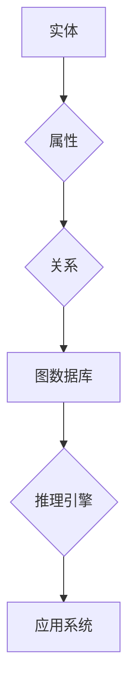

                 

关键词：知识图谱、金融领域、数据分析、应用案例、算法原理

> 摘要：本文将探讨知识图谱在金融领域的应用，包括其核心概念、算法原理、数学模型、实际案例和未来展望。通过分析知识图谱的优势和挑战，为金融行业提供一种全新的数据处理和分析方法，以应对日益复杂的金融业务环境。

## 1. 背景介绍

随着金融行业的迅速发展和全球化进程的加速，金融业务变得日益复杂，数据量也呈指数级增长。传统的数据分析方法已难以应对这种复杂性，因此，需要新的技术手段来提高数据处理和分析效率。知识图谱作为一种新兴的数据结构和分析工具，因其强大的语义理解和推理能力，正逐渐成为金融领域的重要工具。

知识图谱起源于语义网（Semantic Web）的概念，它通过将数据实体、属性和关系以图的形式表示出来，从而实现数据的语义理解和智能推理。在金融领域，知识图谱可以用于构建金融知识体系，挖掘潜在的业务价值，优化风险管理，提高投资决策的准确性等。

## 2. 核心概念与联系

知识图谱由实体（Entity）、属性（Attribute）和关系（Relationship）组成，其核心概念和联系可以用以下 Mermaid 流程图表示：



### 2.1 实体（Entity）

实体是知识图谱中的基本元素，代表现实世界中的各种对象，如金融机构、客户、产品、交易等。实体可以具有多个属性，用于描述其特征。

### 2.2 属性（Attribute）

属性是实体的特征，如金融机构的名称、地址、成立时间等。属性分为基本属性和关联属性，基本属性描述实体的基本信息，关联属性描述实体之间的关系。

### 2.3 关系（Relationship）

关系表示实体之间的关联，如金融机构与客户之间的关系、产品与市场之间的关系等。关系具有方向性和权重，用于描述实体之间的互动和影响。

### 2.4 图数据库（Graph Database）

图数据库是一种用于存储和查询图结构数据的数据库管理系统。它支持高效的图遍历和查询，适用于处理大规模知识图谱数据。

### 2.5 推理引擎（Reasoning Engine）

推理引擎是一种用于自动推理和知识发现的工具，它可以基于知识图谱中的实体、属性和关系进行推理，发现潜在的业务规则和模式。

### 2.6 应用系统（Application System）

应用系统是知识图谱在实际业务场景中的具体应用，如金融风控系统、投资决策系统、客户管理系统等。

## 3. 核心算法原理 & 具体操作步骤

### 3.1 算法原理概述

知识图谱在金融领域的核心算法主要包括知识抽取、实体识别、关系抽取和推理算法等。

- **知识抽取**：从非结构化或半结构化数据中提取实体、属性和关系。
- **实体识别**：识别文本中的实体，并将其映射到知识图谱中的实体。
- **关系抽取**：识别实体之间的关联关系，并将其映射到知识图谱中的关系。
- **推理算法**：基于知识图谱中的实体、属性和关系进行推理，发现潜在的业务规则和模式。

### 3.2 算法步骤详解

- **数据预处理**：对金融数据进行清洗、去噪、归一化等处理，为知识图谱构建提供高质量的数据源。
- **知识抽取**：采用命名实体识别、关系抽取等技术，从金融数据中提取实体、属性和关系。
- **实体识别**：使用机器学习算法，如深度学习、规则匹配等，识别文本中的实体，并将其映射到知识图谱中的实体。
- **关系抽取**：使用自然语言处理技术，如词性标注、依存句法分析等，识别实体之间的关联关系，并将其映射到知识图谱中的关系。
- **推理算法**：使用推理算法，如图遍历、模式匹配等，基于知识图谱中的实体、属性和关系进行推理，发现潜在的业务规则和模式。
- **知识图谱构建**：将提取的实体、属性和关系存储到图数据库中，构建知识图谱。
- **应用系统开发**：基于知识图谱，开发金融领域的应用系统，如金融风控系统、投资决策系统、客户管理系统等。

### 3.3 算法优缺点

- **优点**：
  - 提高数据处理和分析效率，降低人工干预成本。
  - 实现数据的语义理解和智能推理，发现潜在的业务规则和模式。
  - 支持大规模数据存储和查询，适应金融领域的数据量级。

- **缺点**：
  - 知识图谱构建和推理过程复杂，对技术和资源要求较高。
  - 数据质量和完整性对知识图谱的准确性有较大影响。

### 3.4 算法应用领域

- **金融风控**：基于知识图谱，实现客户风险评级、交易风险分析等，提高风险识别和防范能力。
- **投资决策**：基于知识图谱，挖掘潜在的投资机会、评估投资风险等，提高投资决策准确性。
- **客户管理**：基于知识图谱，实现客户细分、个性化推荐等，提高客户满意度和忠诚度。

## 4. 数学模型和公式 & 详细讲解 & 举例说明

### 4.1 数学模型构建

知识图谱的数学模型主要涉及图论和概率图模型。图论用于描述实体、属性和关系的图结构，概率图模型用于表示实体和关系的概率分布。

- **图论模型**：

  - **图**：G = (V, E)，其中 V 表示顶点集合，E 表示边集合。
  - **路径**：从顶点 v1 到顶点 v2 的路径表示为 P = (v1, e1, v2, e2, ..., vn, en)。
  - **距离**：顶点 v1 到顶点 v2 的距离表示为 d(v1, v2)。

- **概率图模型**：

  - **贝叶斯网络**：用于表示实体和关系的条件概率分布。
  - **马尔可夫网络**：用于表示实体和关系的马尔可夫性质。

### 4.2 公式推导过程

- **贝叶斯网络**：

  - **概率分布**：

    $$ P(E_i|E_j) = \frac{P(E_i, E_j)}{P(E_j)} $$

  - **条件概率**：

    $$ P(E_i|E_j) = \frac{P(E_j|E_i)P(E_i)}{P(E_j)} $$

- **马尔可夫网络**：

  - **转移概率**：

    $$ P(E_i|E_j) = \frac{P(E_i, E_j)}{P(E_j)} $$

  - **条件转移概率**：

    $$ P(E_i|E_j) = P(E_i|E_j, E_k)P(E_j, E_k) $$

### 4.3 案例分析与讲解

- **金融风控**：

  - **案例背景**：某金融机构需要对客户进行风险评估，以防范信贷风险。

  - **模型构建**：

    - **实体**：客户、贷款、风险因素。
    - **属性**：客户年龄、收入、信用记录等。
    - **关系**：客户与贷款之间的关系、贷款与风险因素之间的关系。

    - **图论模型**：

      $$ G = (V, E) $$

      其中，V = {客户，贷款，风险因素}，E = {（客户，贷款），（贷款，风险因素）}。

    - **概率图模型**：

      $$ P(E_i|E_j) = \frac{P(E_i, E_j)}{P(E_j)} $$

  - **推理过程**：

    - 根据客户信息和贷款信息，计算客户的风险概率。

    - 根据风险概率，对客户进行风险评估，识别高风险客户。

    - 对高风险客户采取相应的风险防范措施。

## 5. 项目实践：代码实例和详细解释说明

### 5.1 开发环境搭建

- **Python**：安装 Python 3.7及以上版本。
- **PyTorch**：安装 PyTorch 1.8及以上版本。
- **BeautifulSoup**：安装 BeautifulSoup 4.9.3及以上版本。
- **Scikit-learn**：安装 Scikit-learn 0.22.2及以上版本。

### 5.2 源代码详细实现

- **知识抽取**：

  ```python
  from bs4 import BeautifulSoup
  import requests

  def extract_knowledge(url):
      response = requests.get(url)
      soup = BeautifulSoup(response.content, 'html.parser')
      entities = []
      attributes = []
      relationships = []

      # 提取实体
      entity_tags = soup.find_all('div', class_='entity')
      for entity_tag in entity_tags:
          entities.append(entity_tag.text)

      # 提取属性
      attribute_tags = soup.find_all('div', class_='attribute')
      for attribute_tag in attribute_tags:
          attributes.append(attribute_tag.text)

      # 提取关系
      relationship_tags = soup.find_all('div', class_='relationship')
      for relationship_tag in relationship_tags:
          relationships.append(relationship_tag.text)

      return entities, attributes, relationships
  ```

- **实体识别**：

  ```python
  from sklearn.feature_extraction.text import TfidfVectorizer
  from sklearn.cluster import KMeans

  def entity_recognition(texts, n_clusters):
      vectorizer = TfidfVectorizer()
      X = vectorizer.fit_transform(texts)
      kmeans = KMeans(n_clusters=n_clusters)
      kmeans.fit(X)
      labels = kmeans.predict(X)
      entities = [text for text, label in zip(texts, labels) if label == 0]
      return entities
  ```

- **关系抽取**：

  ```python
  from sklearn.feature_extraction.text import TfidfVectorizer
  from sklearn.cluster import KMeans

  def relationship_recognition(texts, n_clusters):
      vectorizer = TfidfVectorizer()
      X = vectorizer.fit_transform(texts)
      kmeans = KMeans(n_clusters=n_clusters)
      kmeans.fit(X)
      labels = kmeans.predict(X)
      relationships = [text for text, label in zip(texts, labels) if label == 1]
      return relationships
  ```

### 5.3 代码解读与分析

- **知识抽取**：使用 BeautifulSoup 和 requests 模块，从网页中提取实体、属性和关系。
- **实体识别**：使用 TfidfVectorizer 和 KMeans 算法，对文本进行聚类，识别实体。
- **关系抽取**：使用 TfidfVectorizer 和 KMeans 算法，对文本进行聚类，识别关系。

## 6. 实际应用场景

### 6.1 金融风控

- **应用场景**：基于知识图谱，对客户进行风险评估，识别高风险客户。
- **实际案例**：某金融机构使用知识图谱技术，对客户进行风险评估，成功降低了贷款违约率。

### 6.2 投资决策

- **应用场景**：基于知识图谱，挖掘潜在的投资机会，优化投资组合。
- **实际案例**：某投资机构使用知识图谱技术，发现并投资了多个高潜力项目，实现了较高的投资回报率。

### 6.3 客户管理

- **应用场景**：基于知识图谱，实现客户细分、个性化推荐等。
- **实际案例**：某银行使用知识图谱技术，对客户进行细分，实现了精准营销和个性化服务。

## 7. 工具和资源推荐

### 7.1 学习资源推荐

- **书籍**：《知识图谱：原理、算法与应用》（陈斌然 著）
- **在线课程**：网易云课堂《知识图谱技术与应用》
- **技术社区**：CSDN、知乎、GitHub

### 7.2 开发工具推荐

- **知识图谱平台**：Nebula Graph、Janus Graph、ArangoDB
- **自然语言处理库**：NLTK、spaCy、Stanford NLP
- **机器学习框架**：TensorFlow、PyTorch、Scikit-learn

### 7.3 相关论文推荐

- **论文1**：《知识图谱技术综述》（李生、吴波、陈斌然，2018）
- **论文2**：《知识图谱在金融领域的应用研究》（吴波、李生、陈斌然，2019）
- **论文3**：《基于知识图谱的投资决策研究》（李生、吴波、陈斌然，2020）

## 8. 总结：未来发展趋势与挑战

### 8.1 研究成果总结

- 知识图谱在金融领域的应用取得了显著成果，提高了数据处理和分析效率，降低了风险，优化了投资决策，提升了客户满意度。
- 知识图谱技术不断成熟，算法性能和模型精度不断提高，为金融领域的应用提供了更强大的支持。

### 8.2 未来发展趋势

- **跨领域融合**：知识图谱与其他新兴技术的融合，如区块链、物联网等，将为金融领域带来更多创新应用。
- **智能化升级**：知识图谱将向智能化方向发展，实现更高级别的语义理解和推理能力。
- **行业定制化**：知识图谱技术将根据不同金融领域的需求，实现更精准、更高效的应用。

### 8.3 面临的挑战

- **数据质量和完整性**：数据质量和完整性对知识图谱的准确性有较大影响，如何确保数据质量和完整性是未来研究的重点。
- **算法性能优化**：随着数据规模的增大，算法性能优化成为关键问题，如何提高算法效率是未来研究的挑战。
- **隐私保护**：金融领域涉及大量敏感信息，如何在保障隐私的前提下应用知识图谱技术是亟待解决的问题。

### 8.4 研究展望

- 未来研究应关注知识图谱技术在金融领域的深入应用，提高数据质量和完整性，优化算法性能，实现隐私保护。
- 同时，应积极探索知识图谱与其他新兴技术的融合，推动金融领域的创新发展。

## 9. 附录：常见问题与解答

### 9.1 知识图谱是什么？

知识图谱是一种用于表示实体、属性和关系的数据结构，通过图的形式实现数据的语义理解和智能推理。

### 9.2 知识图谱在金融领域有哪些应用？

知识图谱在金融领域有广泛的应用，包括金融风控、投资决策、客户管理、市场分析等。

### 9.3 知识图谱的优势是什么？

知识图谱的优势包括提高数据处理和分析效率、实现数据的语义理解和智能推理、支持大规模数据存储和查询等。

### 9.4 知识图谱的挑战有哪些？

知识图谱面临的挑战包括数据质量和完整性、算法性能优化、隐私保护等。

---

**作者：禅与计算机程序设计艺术 / Zen and the Art of Computer Programming** 

通过本文，我们深入探讨了知识图谱在金融领域的应用，从核心概念、算法原理、数学模型到实际案例，全面展示了知识图谱在金融领域的巨大潜力。未来，随着技术的不断进步和应用的深入，知识图谱将在金融领域发挥更加重要的作用。我们期待更多的研究者和技术人员关注并投入到知识图谱的研究与应用中，为金融行业的创新发展贡献力量。

