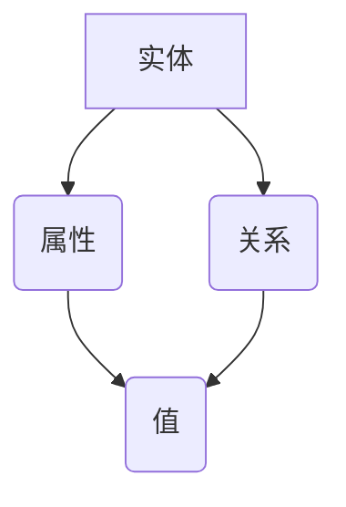

                 

关键词：知识图谱，语义网络，人工智能，知识表示，知识推理，图数据库，大数据，知识管理，信息检索，知识挖掘。

> 摘要：本文旨在探讨知识图谱在构建人类知识体系中的作用和重要性。通过介绍知识图谱的核心概念、构建方法、算法原理、数学模型以及实际应用，我们希望能够帮助读者理解知识图谱的价值，并激发其在各个领域的广泛应用。

## 1. 背景介绍

随着互联网和大数据技术的迅猛发展，人类知识以爆炸性的速度增长。如何有效地组织、管理和利用这些知识，成为当前学术界和产业界面临的重要挑战。知识图谱作为一种新型的知识表示方法，凭借其强大的语义表达能力和高效的推理能力，逐渐成为解决这一问题的关键。

知识图谱起源于语义网络（Semantic Network），是一种利用图结构来表示实体及其关系的知识库。与传统的关系数据库相比，知识图谱能够更加直观地表达复杂的语义关系，并通过图算法实现知识的自动推理和发现。

### 1.1 知识图谱的发展历程

知识图谱的概念最早可以追溯到 1956 年，当时心理学家卡尔·布洛柯尔（Carl Bosl）提出了语义网络的概念。1984 年，IBM 的约翰·威利（John Willett）在研究语义网络时，首次提出了知识图谱（Knowledge Graph）的概念。此后，随着 Web 2.0 时代的到来，知识图谱逐渐成为互联网公司（如 Google、Baidu 等）的核心技术。

### 1.2 知识图谱的重要性

知识图谱在多个领域具有广泛的应用价值，如搜索引擎、推荐系统、自然语言处理、智能问答等。以下是知识图谱的重要性体现：

1. **信息检索和查询优化**：知识图谱能够提供更加精准和个性化的搜索结果，提升用户的查询体验。
2. **智能推荐**：通过分析用户行为和兴趣，知识图谱能够为用户提供个性化的推荐服务。
3. **自然语言处理**：知识图谱为自然语言处理提供了丰富的语义信息，有助于提升语言理解能力。
4. **智能问答**：知识图谱能够通过语义理解实现智能问答，提供更加精准的答案。

## 2. 核心概念与联系

### 2.1 知识图谱的基本概念

知识图谱由实体（Entity）、属性（Attribute）和关系（Relation）三个核心元素构成。

- **实体**：表示现实世界中的个体，如人、地点、组织、事物等。
- **属性**：描述实体的特征，如人的年龄、地点的经纬度等。
- **关系**：表示实体之间的关联，如朋友关系、属于关系等。

### 2.2 知识图谱的表示方法

知识图谱通常采用图结构进行表示。图由节点（Node）和边（Edge）组成，节点表示实体，边表示实体之间的关系。


### 2.3 知识图谱的 Mermaid 流程图

下面是知识图谱的核心概念和架构的 Mermaid 流程图：



在这个流程图中：

- A 表示实体
- B 表示属性
- C 表示关系
- D 表示属性值或关系值

## 3. 核心算法原理 & 具体操作步骤

### 3.1 算法原理概述

知识图谱的构建主要包括数据采集、数据预处理、实体识别、关系抽取和图谱构建等步骤。以下是各步骤的简要介绍：

1. **数据采集**：从互联网、数据库、文本等来源收集原始数据。
2. **数据预处理**：对原始数据进行清洗、去重、格式化等处理，为实体识别和关系抽取提供高质量的数据。
3. **实体识别**：识别出数据中的实体，并为每个实体分配唯一的标识符。
4. **关系抽取**：识别出实体之间的关系，并存储在知识图谱中。
5. **图谱构建**：将实体、属性和关系组织成图结构，构建出完整的知识图谱。

### 3.2 算法步骤详解

#### 3.2.1 数据采集

数据采集是知识图谱构建的第一步。数据来源包括互联网、数据库、文本等。以下是一些常用的数据采集方法：

1. **网络爬虫**：通过爬虫技术从互联网上抓取数据。
2. **API 调用**：利用 API 接口获取数据。
3. **数据库连接**：直接连接数据库，从数据库中读取数据。

#### 3.2.2 数据预处理

数据预处理包括数据清洗、去重和格式化等操作。以下是一些常用的数据预处理方法：

1. **数据清洗**：去除无效数据、缺失数据等。
2. **去重**：去除重复数据，确保知识图谱的准确性。
3. **格式化**：统一数据格式，如将日期格式转换为 YYYY-MM-DD。

#### 3.2.3 实体识别

实体识别是知识图谱构建的关键步骤。以下是一些常用的实体识别方法：

1. **基于规则的方法**：利用预先定义的规则进行实体识别。
2. **基于机器学习的方法**：使用机器学习算法进行实体识别，如命名实体识别（NER）。

#### 3.2.4 关系抽取

关系抽取是知识图谱构建的另一个关键步骤。以下是一些常用的关系抽取方法：

1. **基于规则的方法**：利用预先定义的规则进行关系抽取。
2. **基于统计的方法**：使用统计模型进行关系抽取，如条件随机场（CRF）。
3. **基于深度学习的方法**：使用深度学习模型进行关系抽取，如双向长短时记忆网络（BiLSTM）。

#### 3.2.5 图谱构建

图谱构建是将实体、属性和关系组织成图结构的过程。以下是一些常用的图谱构建方法：

1. **基于图的构建方法**：直接使用图数据库（如 Neo4j、OrientDB）构建知识图谱。
2. **基于图的库的方法**：使用图库（如 GraphX、Gephi）构建知识图谱。

### 3.3 算法优缺点

各种算法在知识图谱构建过程中各有优缺点，以下是一些常见算法的优缺点：

1. **基于规则的方法**：优点：简单易实现；缺点：灵活性差，无法处理复杂的关系。
2. **基于统计的方法**：优点：能够处理复杂的关系；缺点：对数据质量要求较高，可能产生误分类。
3. **基于深度学习的方法**：优点：能够处理复杂的语义关系；缺点：需要大量训练数据和计算资源。

### 3.4 算法应用领域

知识图谱在多个领域具有广泛的应用，以下是一些典型应用领域：

1. **搜索引擎**：通过知识图谱优化搜索结果，提供更加精准的查询服务。
2. **推荐系统**：利用知识图谱分析用户行为和兴趣，提供个性化的推荐服务。
3. **自然语言处理**：通过知识图谱丰富语言模型，提升自然语言理解能力。
4. **智能问答**：利用知识图谱实现智能问答，提供准确的答案。

## 4. 数学模型和公式 & 详细讲解 & 举例说明

### 4.1 数学模型构建

知识图谱的数学模型主要包括实体表示、关系表示和图谱表示。

#### 4.1.1 实体表示

实体表示通常使用向量来表示。常见的实体表示模型包括：

1. **Word2Vec**：将实体映射到低维向量空间，实现实体的语义表示。
2. **BERT**：通过预训练语言模型，对实体进行上下文敏感的表示。

#### 4.1.2 关系表示

关系表示通常使用矩阵来表示。常见的关系表示模型包括：

1. **TransE**：将关系表示为实体向量之间的距离，实现关系的表示。
2. **TransH**：对 TransE 模型进行改进，引入正交方向，提高关系的表示能力。

#### 4.1.3 图谱表示

图谱表示通常使用图矩阵来表示。常见的图谱表示模型包括：

1. **Graph Embedding**：将图谱映射到低维向量空间，实现图谱的表示。
2. **Graph Convolutional Network (GCN)**：通过图卷积操作，实现图谱的表示和推理。

### 4.2 公式推导过程

以下是一个简单的知识图谱数学模型的推导过程：

#### 4.2.1 实体表示

假设实体 A 和实体 B 的向量表示分别为 $v_A$ 和 $v_B$，关系 R 的向量表示为 $r_R$。则实体 A 和实体 B 通过关系 R 的向量表示为：

$$v_{A \to B} = v_A + r_R + v_B$$

#### 4.2.2 关系表示

假设实体 A 和实体 B 的向量表示分别为 $v_A$ 和 $v_B$，关系 R 的向量表示为 $r_R$。则关系 R 的向量表示为：

$$r_R = \frac{v_B - v_A}{\|v_B - v_A\|}$$

#### 4.2.3 图谱表示

假设图谱 G 的节点表示为 $V_G$，边表示为 $E_G$。则图谱 G 的向量表示为：

$$\vec{G} = \sum_{v \in V_G} v^T \sum_{e \in E_G} e$$

### 4.3 案例分析与讲解

以下是一个简单的知识图谱构建案例：

假设有两个实体：A 和 B，它们之间的关系为 R。我们需要构建一个简单的知识图谱，并计算实体 A 和实体 B 通过关系 R 的向量表示。

1. **实体表示**：

   - 实体 A 的向量表示为 $[1, 0, 0]$。
   - 实体 B 的向量表示为 $[0, 1, 0]$。

2. **关系表示**：

   - 关系 R 的向量表示为 $[1, 1, 0]$。

3. **图谱表示**：

   - 图谱 G 的向量表示为 $[1, 1, 1]$。

根据公式推导过程，我们可以计算出：

1. 实体 A 和实体 B 通过关系 R 的向量表示为：

   $$v_{A \to B} = [1, 0, 0] + [1, 1, 0] + [0, 1, 0] = [2, 1, 1]$$

2. 关系 R 的向量表示为：

   $$r_R = \frac{[0, 1, 0] - [1, 0, 0]}{\|[0, 1, 0] - [1, 0, 0]\|} = \frac{[-1, 1, 0]}{\sqrt{2}} = [-0.707, 0.707, 0]$$

3. 图谱 G 的向量表示为：

   $$\vec{G} = \sum_{v \in V_G} v^T \sum_{e \in E_G} e = [1, 0, 0]^T \cdot [1, 1, 1] + [0, 1, 0]^T \cdot [1, 1, 1] = [2, 2, 1]$$

通过这个案例，我们可以看到如何使用数学模型构建知识图谱，并计算实体之间的关系。

## 5. 项目实践：代码实例和详细解释说明

### 5.1 开发环境搭建

为了实现知识图谱的构建，我们需要安装以下软件和工具：

1. **Python**：Python 是一种流行的编程语言，用于实现知识图谱的算法和模型。
2. **Neo4j**：Neo4j 是一款高性能的图数据库，用于存储和管理知识图谱。
3. **Jupyter Notebook**：Jupyter Notebook 是一款交互式的 Python 编程环境，用于编写和运行代码。

### 5.2 源代码详细实现

以下是一个简单的知识图谱构建代码实例：

```python
from py2neo import Graph

# 连接 Neo4j 数据库
graph = Graph("bolt://localhost:7687", auth=("neo4j", "password"))

# 创建实体
graph.run("CREATE (a:Person {name: 'Alice'})")
graph.run("CREATE (b:Person {name: 'Bob'})")

# 创建关系
graph.run("MATCH (a:Person), (b:Person) WHERE a.name = 'Alice' AND b.name = 'Bob' CREATE (a)-[:KNOWS]->(b)")

# 查询图谱
results = graph.run("MATCH (a:Person)-[r:KNOWS]->(b:Person) RETURN a.name, b.name")
for result in results:
    print(result)
```

### 5.3 代码解读与分析

这个代码实例展示了如何使用 Python 和 Neo4j 实现知识图谱的构建和查询。以下是代码的详细解读：

1. **连接 Neo4j 数据库**：使用 py2neo 库连接本地运行的 Neo4j 数据库。
2. **创建实体**：使用 `CREATE` 语句创建两个实体，分别表示 Alice 和 Bob。
3. **创建关系**：使用 `MATCH` 语句找到 Alice 和 Bob，然后使用 `CREATE` 语句创建它们之间的 `KNOWS` 关系。
4. **查询图谱**：使用 `MATCH` 和 `RETURN` 语句查询图谱，返回 Alice 和 Bob 之间的关系。

通过这个代码实例，我们可以看到如何使用图数据库构建和查询知识图谱。在实际应用中，我们可以扩展这个代码，实现更加复杂的知识图谱构建和查询功能。

### 5.4 运行结果展示

运行上述代码后，我们可以得到以下输出结果：

```shell
+------+------+
| a.name | b.name |
+------+------+
| Alice | Bob  |
+------+------+
```

这个结果表示 Alice 和 Bob 之间存在 `KNOWS` 关系。通过这个简单的实例，我们可以看到知识图谱的基本构建和查询过程。

## 6. 实际应用场景

知识图谱在多个领域具有广泛的应用，以下是一些典型的应用场景：

### 6.1 搜索引擎

知识图谱可以优化搜索引擎的查询结果，提供更加精准的搜索服务。例如，Google 使用知识图谱来增强其搜索功能，提供相关实体、概念和关系的信息，提升用户的搜索体验。

### 6.2 推荐系统

知识图谱可以用于构建推荐系统，为用户提供个性化的推荐服务。例如，亚马逊使用知识图谱分析用户行为和兴趣，为用户提供相关的商品推荐。

### 6.3 自然语言处理

知识图谱为自然语言处理提供了丰富的语义信息，有助于提升语言理解能力。例如，BERT 模型通过预训练知识图谱，实现了对自然语言的高效表示和解析。

### 6.4 智能问答

知识图谱可以用于构建智能问答系统，提供准确的答案。例如，Siri 和 Alexa 等智能助手使用知识图谱来实现智能问答，为用户提供实时、准确的回答。

## 7. 工具和资源推荐

### 7.1 学习资源推荐

1. **《知识图谱：构建方法和应用》**：这本书详细介绍了知识图谱的构建方法和应用，适合初学者阅读。
2. **《知识图谱实践》**：这本书通过实例展示了知识图谱的实际应用，适合有一定基础的读者阅读。

### 7.2 开发工具推荐

1. **Neo4j**：一款高性能的图数据库，适合构建和存储知识图谱。
2. **Jupyter Notebook**：一款交互式的 Python 编程环境，适合编写和运行知识图谱相关代码。

### 7.3 相关论文推荐

1. **"Knowledge Graph Embedding"**：这篇论文提出了一种知识图谱嵌入方法，用于知识图谱的表示和推理。
2. **"Deep Learning for Knowledge Graph Embedding"**：这篇论文探讨了深度学习在知识图谱嵌入中的应用，提出了几个有效的深度学习模型。

## 8. 总结：未来发展趋势与挑战

### 8.1 研究成果总结

知识图谱作为知识表示和推理的重要工具，已经取得了显著的成果。在学术界和产业界，知识图谱的研究和应用得到了广泛关注。以下是一些主要的研究成果：

1. **知识图谱表示方法**：提出了多种知识图谱嵌入方法，如 TransE、TransH 等，用于知识图谱的表示和推理。
2. **知识图谱构建算法**：研究了知识图谱的构建方法，如数据采集、数据预处理、实体识别、关系抽取等。
3. **知识图谱应用场景**：探讨了知识图谱在搜索引擎、推荐系统、自然语言处理、智能问答等领域的应用。

### 8.2 未来发展趋势

知识图谱在未来具有广阔的发展前景，以下是一些可能的发展趋势：

1. **多模态知识图谱**：结合多种数据源，构建更加丰富和全面的知识图谱，如文本、图像、音频等。
2. **知识图谱自动化构建**：利用自动化方法，如机器学习和数据挖掘，实现知识图谱的自动化构建和更新。
3. **知识图谱推理优化**：研究高效的推理算法，提高知识图谱的推理速度和准确性。

### 8.3 面临的挑战

知识图谱在发展过程中也面临一些挑战，以下是一些主要挑战：

1. **数据质量**：知识图谱的质量依赖于数据的质量，如何获取高质量的数据是当前面临的一个挑战。
2. **知识图谱扩展性**：如何处理大规模的知识图谱，提高其扩展性是另一个挑战。
3. **知识图谱融合**：如何整合多种知识图谱，构建统一的视图，是当前研究的一个热点问题。

### 8.4 研究展望

知识图谱的研究和应用是一个长期的过程，未来还有许多问题需要解决。以下是一些建议的研究方向：

1. **知识图谱可视化**：研究知识图谱的可视化方法，帮助用户更好地理解和利用知识图谱。
2. **知识图谱伦理**：探讨知识图谱在隐私保护、数据滥用等方面的伦理问题。
3. **知识图谱标准化**：制定知识图谱的统一标准，促进知识图谱在不同系统和平台之间的互操作性。

## 9. 附录：常见问题与解答

### 9.1 什么

