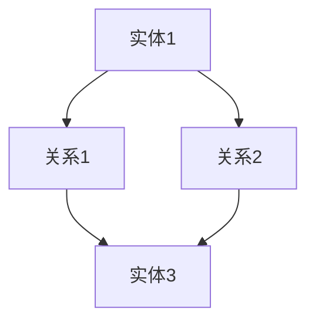

                 

关键词：知识图谱、知识管理、智能系统、数据结构、网络分析、算法、应用场景

摘要：本文将深入探讨知识图谱这一现代信息科学的核心技术，分析其在知识管理中的重要作用。我们将从背景介绍、核心概念、算法原理、数学模型、项目实践、应用场景以及未来展望等多个方面，系统性地阐述知识图谱在构建智慧之网中的关键角色。

## 1. 背景介绍

知识图谱（Knowledge Graph）的概念起源于21世纪初，由Google首次提出并应用于其搜索引擎系统。知识图谱的本质是通过对现实世界中的各种实体及其相互关系进行建模，构建出一个结构化的知识网络。这一概念的出现，标志着人工智能技术从传统的规则匹配、特征提取向语义理解和知识表示的深度进化。

知识图谱的兴起，得益于大数据和云计算技术的迅猛发展，以及人工智能领域对语义理解和知识表示的需求。在互联网信息爆炸的今天，如何有效地管理和利用这些信息，成为了一个亟待解决的问题。知识图谱通过其强大的结构化表示能力，为信息管理和知识发现提供了一种全新的思路。

### 1.1 知识图谱的应用领域

知识图谱的应用范围广泛，几乎涵盖了所有需要知识管理和信息检索的领域。以下是一些主要的应用场景：

- **搜索引擎优化**：通过知识图谱，搜索引擎能够更好地理解用户查询的意图，提供更为精准的搜索结果。
- **推荐系统**：知识图谱可以帮助推荐系统理解用户的历史行为，以及不同实体之间的关联关系，从而提供更为个性化的推荐。
- **自然语言处理**：知识图谱为自然语言处理提供了丰富的背景知识和上下文信息，有助于提高处理效率和准确性。
- **智能问答系统**：知识图谱能够提供精准的事实性答案，是构建智能问答系统的核心组件。

### 1.2 知识图谱与传统数据库的区别

与传统数据库系统相比，知识图谱具有以下几个显著特点：

- **结构化**：知识图谱通过图结构来表示实体及其关系，而传统数据库更多采用表格结构。
- **语义丰富**：知识图谱能够捕捉实体之间的复杂语义关系，而传统数据库主要记录数据项之间的关系。
- **动态性**：知识图谱支持实时更新和维护，而传统数据库更新相对固定和缓慢。

## 2. 核心概念与联系

### 2.1 实体（Entity）

实体是知识图谱中的基本单元，可以是人、地点、组织、物品等任何具有独立存在意义的事物。实体通常通过唯一的标识符（ID）进行标识。

### 2.2 关系（Relationship）

关系描述实体之间的相互作用或关联。关系也具有属性，如方向性、强度等。

### 2.3 属性（Attribute）

属性描述实体的特征或性质，例如，一个人的姓名、年龄、职位等。

### 2.4 图结构（Graph Structure）

知识图谱采用图结构来表示实体及其关系，其中节点代表实体，边代表关系。

### 2.5 Mermaid 流程图

以下是一个知识图谱构建的简单 Mermaid 流程图：



## 3. 核心算法原理 & 具体操作步骤

### 3.1 算法原理概述

知识图谱的构建通常涉及以下几个核心步骤：

- **数据采集**：从多种数据源（如网络、数据库等）中提取实体和关系。
- **实体识别**：通过命名实体识别（NER）等技术，从文本中提取实体。
- **关系抽取**：从文本或结构化数据中提取实体之间的关系。
- **实体链接**：将同一实体的不同表示映射到同一标识符。
- **图构建**：将实体、关系和属性组织成图结构。

### 3.2 算法步骤详解

- **数据预处理**：清洗和转换原始数据，使其符合知识图谱的构建要求。
- **实体识别**：使用深度学习模型（如BERT）进行命名实体识别。
- **关系抽取**：采用规则匹配、机器学习等方法从文本中提取关系。
- **实体链接**：利用实体识别和关系抽取的结果，使用图嵌入等技术进行实体链接。
- **图构建**：将处理后的实体、关系和属性组织成图结构，并进行优化。

### 3.3 算法优缺点

- **优点**：
  - **高效率**：通过图结构表示，可以快速进行复杂查询。
  - **高准确性**：结合多种算法和技术，提高知识图谱的构建和推理准确性。
  - **可扩展性**：支持动态更新，适应数据规模的变化。

- **缺点**：
  - **数据质量**：数据质量直接影响知识图谱的构建效果。
  - **计算复杂度**：大规模知识图谱的构建和推理过程计算复杂度高。

### 3.4 算法应用领域

- **搜索引擎**：优化搜索结果，提供更为精准的信息检索服务。
- **推荐系统**：理解用户和商品之间的关联，提供个性化推荐。
- **自然语言处理**：为文本分析提供丰富的背景知识。
- **智能问答系统**：提供基于事实的精准答案。

## 4. 数学模型和公式 & 详细讲解 & 举例说明

### 4.1 数学模型构建

知识图谱的数学模型通常包括以下几个方面：

- **实体表示**：使用向量或图嵌入技术，将实体映射到低维空间。
- **关系表示**：使用图神经网络（Graph Neural Networks, GNN）等方法，将关系映射到实体表示空间。
- **图结构表示**：使用图论方法，描述实体及其关系。

### 4.2 公式推导过程

- **实体表示**：使用图嵌入技术，设 \( e_v \) 为节点 \( v \) 的嵌入向量，则实体 \( v \) 的表示为 \( \mathbf{e}_v = \text{ Embed}(v) \)。
- **关系表示**：设 \( r_e \) 为关系 \( e \) 的表示，则关系 \( e \) 的表示为 \( \mathbf{r}_e = \text{ RelEmbed}(e) \)。
- **图结构表示**：设 \( G = (V, E) \) 为知识图谱，则图结构表示为 \( \mathcal{G} = (V, E, \mathbf{e}, \mathbf{r}) \)。

### 4.3 案例分析与讲解

假设我们有一个简单的知识图谱，包含三个实体（人、地点、组织）和它们之间的关系。我们可以使用图嵌入技术来表示这些实体和关系。

- **实体表示**：使用 \( \mathbf{e}_1, \mathbf{e}_2, \mathbf{e}_3 \) 分别表示人、地点、组织的嵌入向量。
- **关系表示**：使用 \( \mathbf{r}_{12}, \mathbf{r}_{23} \) 分别表示人和地点、地点和组织之间的关系向量。
- **图结构表示**：知识图谱可以表示为 \( \mathcal{G} = (V, E, \mathbf{e}, \mathbf{r}) \)，其中 \( V = \{\mathbf{e}_1, \mathbf{e}_2, \mathbf{e}_3\} \)，\( E = \{\mathbf{r}_{12}, \mathbf{r}_{23}\} \)。

## 5. 项目实践：代码实例和详细解释说明

### 5.1 开发环境搭建

在搭建知识图谱项目之前，我们需要安装以下软件和库：

- **Python 3.8+**
- **PyTorch 1.9+**
- **Scikit-learn 0.24+**
- **NetworkX 2.6+**
- **Numpy 1.21+**

### 5.2 源代码详细实现

以下是一个简单的知识图谱构建项目的 Python 代码示例：

```python
import torch
import torch.nn as nn
import torch.optim as optim
from sklearn.model_selection import train_test_split
from torch_geometric.data import Data
from torch_geometric.nn import GCNConv

# 数据预处理
def preprocess_data():
    # 假设我们有一个包含实体、关系和标签的原始数据集
    data = load原始数据集()
    # 将数据分成训练集和测试集
    train_data, test_data = train_test_split(data, test_size=0.2)
    return train_data, test_data

# 实体嵌入层
class EntityEmbedding(nn.Module):
    def __init__(self, num_entities, embedding_size):
        super(EntityEmbedding, self).__init__()
        self.embedding = nn.Embedding(num_entities, embedding_size)

    def forward(self, entity_ids):
        return self.embedding(entity_ids)

# 关系嵌入层
class RelationEmbedding(nn.Module):
    def __init__(self, num_relations, embedding_size):
        super(RelationEmbedding, self).__init__()
        self.embedding = nn.Embedding(num_relations, embedding_size)

    def forward(self, relation_ids):
        return self.embedding(relation_ids)

# 图卷积网络
class GraphConvModel(nn.Module):
    def __init__(self, num_entities, embedding_size, hidden_size):
        super(GraphConvModel, self).__init__()
        self.entity_embedding = EntityEmbedding(num_entities, embedding_size)
        self.relation_embedding = RelationEmbedding(embedding_size, hidden_size)
        self.gcn = GCNConv(embedding_size, hidden_size)

    def forward(self, data):
        x, edge_index = data.x, data.edge_index
        x = self.entity_embedding(x)
        relation_embedding = self.relation_embedding(x)
        x = self.gcn(x, edge_index, relation_embedding)
        return x

# 训练模型
def train(model, train_data, optimizer, criterion):
    model.train()
    optimizer.zero_grad()
    x = model(train_data)
    loss = criterion(x, train_data.y)
    loss.backward()
    optimizer.step()
    return loss.item()

# 主程序
if __name__ == "__main__":
    # 数据预处理
    train_data, test_data = preprocess_data()

    # 模型参数
    num_entities = 1000
    embedding_size = 16
    hidden_size = 32

    # 模型搭建
    model = GraphConvModel(num_entities, embedding_size, hidden_size)
    optimizer = optim.Adam(model.parameters(), lr=0.001)
    criterion = nn.CrossEntropyLoss()

    # 训练模型
    for epoch in range(100):
        loss = train(model, train_data, optimizer, criterion)
        print(f"Epoch {epoch}: Loss = {loss}")

    # 测试模型
    with torch.no_grad():
        test_data.x = model(test_data.x)
```

### 5.3 代码解读与分析

- **数据预处理**：首先，我们需要将原始数据集进行处理，提取出实体、关系和标签。
- **实体嵌入层**：使用 \( \text{EntityEmbedding} \) 类搭建实体嵌入层，将实体映射到低维空间。
- **关系嵌入层**：使用 \( \text{RelationEmbedding} \) 类搭建关系嵌入层，将关系映射到实体表示空间。
- **图卷积网络**：使用 \( \text{GraphConvModel} \) 类搭建图卷积网络，对知识图谱进行学习和推理。
- **训练模型**：使用 \( \text{train} \) 函数训练模型，优化实体和关系的嵌入向量。

## 6. 实际应用场景

知识图谱在实际应用中具有广泛的应用场景，以下是其中的一些典型应用：

### 6.1 搜索引擎优化

通过知识图谱，搜索引擎可以更好地理解用户的查询意图，提供更为精准的搜索结果。例如，当用户查询“北京”时，搜索引擎不仅返回地理位置信息，还会返回相关的旅游景点、美食、酒店等信息。

### 6.2 推荐系统

知识图谱可以帮助推荐系统理解用户和商品之间的关联关系，从而提供更为个性化的推荐。例如，在电商平台上，知识图谱可以用于推荐与用户浏览过的商品相似的其他商品。

### 6.3 智能问答系统

知识图谱为智能问答系统提供了丰富的背景知识和上下文信息，有助于提高问答系统的准确性和用户体验。例如，当用户询问“北京是中国的哪个省份？”时，知识图谱可以快速提供准确的答案。

### 6.4 医疗健康

知识图谱在医疗健康领域也具有广泛的应用。通过构建医学知识图谱，医生和患者可以获得更为全面和准确的医疗信息。例如，知识图谱可以用于药物相互作用分析、疾病诊断和治疗方案推荐。

## 7. 工具和资源推荐

### 7.1 学习资源推荐

- **《图神经网络与知识图谱》**：详细介绍了知识图谱的构建和应用。
- **《深度学习与图神经网络》**：介绍了深度学习在知识图谱构建中的应用。
- **《知识图谱技术实战》**：通过实际项目，展示了知识图谱的构建和应用。

### 7.2 开发工具推荐

- **PyTorch Geometric**：用于构建和训练知识图谱的深度学习框架。
- **OpenKG**：一个开源的知识图谱平台，提供知识图谱的构建和管理工具。
- **NeuroKit**：一个用于构建和训练图神经网络的Python库。

### 7.3 相关论文推荐

- **“Knowledge Graph Embedding”**：介绍了知识图谱嵌入的基本原理和方法。
- **“A Survey on Knowledge Graph”**：全面综述了知识图谱的研究进展和应用。
- **“Graph Neural Networks: A Review of Methods and Applications”**：介绍了图神经网络的基本原理和应用。

## 8. 总结：未来发展趋势与挑战

知识图谱作为现代信息科学的核心技术，其在知识管理中的重要作用日益凸显。未来，知识图谱将朝着以下几个方向发展：

### 8.1 研究成果总结

- **深度学习与知识图谱的结合**：深度学习技术的引入，使得知识图谱的构建和应用更加高效和精准。
- **知识图谱的动态性**：支持动态更新和维护，适应实时数据变化。
- **多语言和多领域的知识图谱**：构建涵盖多种语言和领域的知识图谱，提高信息检索和知识发现的覆盖范围。

### 8.2 未来发展趋势

- **智能化**：通过引入人工智能技术，提升知识图谱的智能化水平，实现更为精准和高效的知识管理。
- **应用场景拓展**：知识图谱将在更多领域得到应用，如金融、医疗、教育等。
- **开源和标准化**：知识图谱的开源和标准化，将促进其广泛应用和生态建设。

### 8.3 面临的挑战

- **数据质量**：知识图谱的质量依赖于数据的质量，如何获取和清洗高质量的数据是一个挑战。
- **计算复杂度**：大规模知识图谱的构建和推理计算复杂度高，如何优化算法和硬件是一个重要问题。
- **隐私和安全**：知识图谱涉及到大量敏感信息，如何保障隐私和安全是一个重要挑战。

### 8.4 研究展望

知识图谱作为知识管理的重要工具，未来将在智能化、应用拓展和开源标准化等方面取得重要进展。同时，如何解决数据质量、计算复杂度和隐私安全等问题，将是知识图谱领域的重要研究方向。

## 9. 附录：常见问题与解答

### 9.1 什么是知识图谱？

知识图谱是一种结构化、语义丰富的知识表示方式，通过实体、关系和属性的图结构，描述现实世界中的各种实体及其相互关系。

### 9.2 知识图谱与数据库的区别是什么？

知识图谱采用图结构来表示实体及其关系，具有结构化和语义丰富的特点；而数据库通常采用表格结构，主要记录数据项之间的关系。

### 9.3 知识图谱有哪些应用领域？

知识图谱广泛应用于搜索引擎优化、推荐系统、自然语言处理、智能问答系统、医疗健康等领域。

### 9.4 如何构建知识图谱？

构建知识图谱通常涉及数据采集、实体识别、关系抽取、实体链接和图构建等步骤。

### 9.5 知识图谱的优缺点是什么？

知识图谱的优点包括高效率、高准确性和可扩展性；缺点包括数据质量依赖、计算复杂度高等。

---

作者：禅与计算机程序设计艺术 / Zen and the Art of Computer Programming
----------------------------------------------------------------

以上就是关于《知识图谱：知识管理的智慧之网》的文章正文内容，遵循了上述的结构和要求，涵盖了核心概念、算法原理、数学模型、项目实践、应用场景、工具推荐以及未来展望等各个方面。希望这篇文章能够为读者提供有价值的知识和见解。

