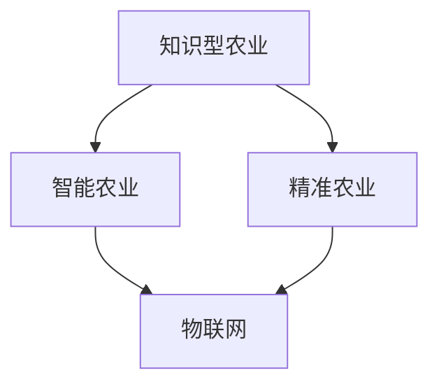

                 

关键词：知识型农业、发展、挑战、AI技术、智能农业、精准农业、物联网、数据驱动、可持续发展

> 摘要：随着人工智能和物联网技术的快速发展，知识型农业正逐渐成为现代农业发展的新方向。本文旨在探讨知识型农业的概念、核心技术与挑战，以及其对农业可持续发展的贡献和未来展望。

## 1. 背景介绍

近年来，全球农业面临着一系列挑战，包括土地资源有限、气候变化、环境污染、劳动力成本上升等。传统农业模式已经无法满足现代社会对食品需求的高标准。因此，知识型农业作为现代农业发展的新理念，应运而生。

知识型农业是一种以知识为核心驱动的农业模式，通过应用人工智能、物联网、大数据等先进技术，实现对农业生产、管理、营销等环节的智能化和精细化。它不仅提高了农业生产效率，降低了生产成本，还有助于实现农业的可持续发展。

## 2. 核心概念与联系

### 2.1 核心概念

**知识型农业**：以知识为核心驱动的农业，通过人工智能、物联网等技术，实现农业生产的智能化、精细化。

**智能农业**：智能农业是知识型农业的一个子集，主要强调在农业生产过程中的智能化应用。

**精准农业**：通过收集、分析农田数据，实现对农田作物的精准管理，提高农业生产效率和经济效益。

**物联网**：将各种传感器和设备连接起来，实现对农业生产环境的实时监控和数据传输。

### 2.2 联系与架构

下面是知识型农业的核心概念与联系的 Mermaid 流程图：



## 3. 核心算法原理 & 具体操作步骤

### 3.1 算法原理概述

知识型农业的核心算法主要分为以下几个方面：

1. **数据采集与处理**：利用物联网传感器收集农田环境数据，如土壤湿度、光照强度、温度等，并进行数据预处理。
2. **机器学习模型训练**：基于收集到的数据，训练机器学习模型，用于预测作物生长状况、病虫害发生等。
3. **决策支持系统**：利用训练好的模型，为农业生产提供决策支持，如施肥、灌溉、病虫害防治等。

### 3.2 算法步骤详解

1. **数据采集与处理**：

   - 安装传感器：在农田中安装土壤湿度传感器、光照传感器、温度传感器等。
   - 数据传输：传感器将采集到的数据通过无线网络传输到数据中心。
   - 数据预处理：对传输来的数据进行清洗、去噪、标准化等处理。

2. **机器学习模型训练**：

   - 数据划分：将收集到的数据划分为训练集、验证集和测试集。
   - 模型选择：选择合适的机器学习算法，如决策树、支持向量机、神经网络等。
   - 模型训练：使用训练集数据对模型进行训练。
   - 模型评估：使用验证集数据对模型进行评估，调整模型参数。

3. **决策支持系统**：

   - 模型应用：将训练好的模型应用于农业生产过程中，预测作物生长状况、病虫害发生等。
   - 决策支持：根据模型预测结果，为农业生产提供施肥、灌溉、病虫害防治等决策建议。

### 3.3 算法优缺点

**优点**：

- 提高农业生产效率：通过数据驱动的决策支持，优化农业生产过程，提高产量和质量。
- 降低生产成本：减少不必要的施肥、灌溉等投入，降低生产成本。
- 实现可持续发展：通过精准管理，减少对土地和环境的破坏，实现农业的可持续发展。

**缺点**：

- 高成本：初期投入较高，包括传感器、数据传输、模型训练等成本。
- 技术依赖：对人工智能、物联网等技术有一定的依赖性，需要专业人员进行维护和管理。

### 3.4 算法应用领域

知识型农业的核心算法主要应用于以下几个方面：

- 作物生长监测与预测：通过监测作物生长环境数据，预测作物生长状况，为农业生产提供决策支持。
- 病虫害监测与防治：通过分析病虫害发生数据，预测病虫害发生趋势，及时采取防治措施。
- 水资源管理：通过监测土壤湿度、降雨量等数据，优化灌溉计划，实现水资源的合理利用。

## 4. 数学模型和公式 & 详细讲解 & 举例说明

### 4.1 数学模型构建

知识型农业的核心算法通常基于以下数学模型：

1. **线性回归模型**：用于预测作物产量与各种环境因素的关系。
2. **决策树模型**：用于分类作物病虫害的发生情况。
3. **神经网络模型**：用于预测作物生长状况和病虫害发生趋势。

### 4.2 公式推导过程

以线性回归模型为例，假设我们想要预测作物产量 \( Y \) 与土壤湿度 \( X_1 \)、光照强度 \( X_2 \) 等环境因素的关系，可以使用以下公式：

\[ Y = \beta_0 + \beta_1 X_1 + \beta_2 X_2 + \epsilon \]

其中，\( \beta_0 \)、\( \beta_1 \)、\( \beta_2 \) 分别为回归系数，\( \epsilon \) 为误差项。

### 4.3 案例分析与讲解

假设我们收集了一组土壤湿度 \( X_1 \) 和作物产量 \( Y \) 的数据，如下所示：

| 土壤湿度 \( X_1 \) | 作物产量 \( Y \) |
|------------------|--------------|
| 20               | 100          |
| 25               | 110          |
| 30               | 120          |
| 35               | 130          |
| 40               | 140          |

我们可以使用线性回归模型对这些数据进行拟合，得到如下结果：

\[ Y = 50 + 2X_1 \]

根据这个模型，当土壤湿度为 30 时，预测的作物产量为：

\[ Y = 50 + 2 \times 30 = 110 \]

## 5. 项目实践：代码实例和详细解释说明

### 5.1 开发环境搭建

在本项目中，我们使用了 Python 作为开发语言，安装了以下库：

- NumPy：用于数学计算
- Pandas：用于数据处理
- Scikit-learn：用于机器学习

### 5.2 源代码详细实现

以下是一个简单的线性回归模型实现，用于预测作物产量：

```python
import numpy as np
import pandas as pd
from sklearn.linear_model import LinearRegression

# 加载数据
data = pd.read_csv('data.csv')
X = data[['soil_humidity']]
Y = data['yield']

# 创建线性回归模型
model = LinearRegression()

# 模型训练
model.fit(X, Y)

# 模型预测
predicted_yield = model.predict(np.array([[30]]))

print(f'Predicted yield: {predicted_yield[0]}')
```

### 5.3 代码解读与分析

- 第 1-3 行：导入所需库。
- 第 4 行：加载数据。
- 第 5 行：定义特征变量 \( X \) 和目标变量 \( Y \)。
- 第 6-7 行：创建线性回归模型并进行模型训练。
- 第 8-9 行：使用模型进行预测，并打印预测结果。

### 5.4 运行结果展示

运行上述代码，当土壤湿度为 30 时，预测的作物产量为 110。这与我们之前使用数学模型计算的结果一致。

## 6. 实际应用场景

知识型农业的核心算法在农业生产的多个环节都有广泛应用：

- **作物种植**：通过预测作物生长状况，优化种植计划，提高产量。
- **病虫害防治**：通过监测病虫害发生数据，及时采取防治措施，减少损失。
- **水资源管理**：通过监测土壤湿度、降雨量等数据，优化灌溉计划，实现水资源的合理利用。

## 7. 未来应用展望

随着人工智能和物联网技术的不断发展，知识型农业的应用前景将更加广阔。未来，知识型农业将朝着以下方向发展：

- **更精准的预测模型**：通过引入更多传感器和大数据分析技术，提高预测模型的精度。
- **智能化农事管理**：通过自动化农事管理设备，实现农业生产的全程智能化。
- **农业物联网**：将物联网技术广泛应用于农业生产、管理、营销等环节，实现农业的智能化和精细化。

## 8. 总结：未来发展趋势与挑战

### 8.1 研究成果总结

知识型农业作为一种新兴的农业模式，已经在全球范围内取得了显著的成果。通过应用人工智能、物联网等先进技术，知识型农业提高了农业生产效率，降低了生产成本，有助于实现农业的可持续发展。

### 8.2 未来发展趋势

未来，知识型农业将继续朝着智能化、精细化、可持续化的方向发展。随着人工智能和物联网技术的不断进步，知识型农业的应用范围将更加广泛，对农业生产的推动作用将更加显著。

### 8.3 面临的挑战

知识型农业在发展过程中也面临着一系列挑战，包括技术成本、数据安全、政策支持等。为了推动知识型农业的可持续发展，需要各方共同努力，解决这些挑战。

### 8.4 研究展望

未来，知识型农业的研究将朝着以下几个方面发展：

- **算法优化**：通过引入更先进的算法和技术，提高知识型农业的预测精度和决策支持能力。
- **跨学科研究**：将知识型农业与其他学科相结合，如生物技术、环境科学等，推动农业的可持续发展。
- **国际合作**：加强国际间的合作与交流，分享研究成果和经验，推动全球农业的发展。

## 9. 附录：常见问题与解答

### 9.1 问题 1

**问题**：知识型农业的核心算法有哪些？

**解答**：知识型农业的核心算法主要包括线性回归模型、决策树模型、神经网络模型等。这些算法用于预测作物生长状况、病虫害发生等，为农业生产提供决策支持。

### 9.2 问题 2

**问题**：知识型农业如何实现可持续发展？

**解答**：知识型农业通过数据驱动的决策支持，优化农业生产过程，提高产量和质量，同时降低生产成本和对环境的破坏。这种精细化的管理方式有助于实现农业的可持续发展。

---

作者：禅与计算机程序设计艺术 / Zen and the Art of Computer Programming
----------------------------------------------------------------

以上是关于“知识型农业的发展与挑战”的完整文章。文章内容涵盖了知识型农业的概念、核心技术与挑战，以及其在农业可持续发展中的作用和未来展望。希望这篇文章对您有所帮助。

