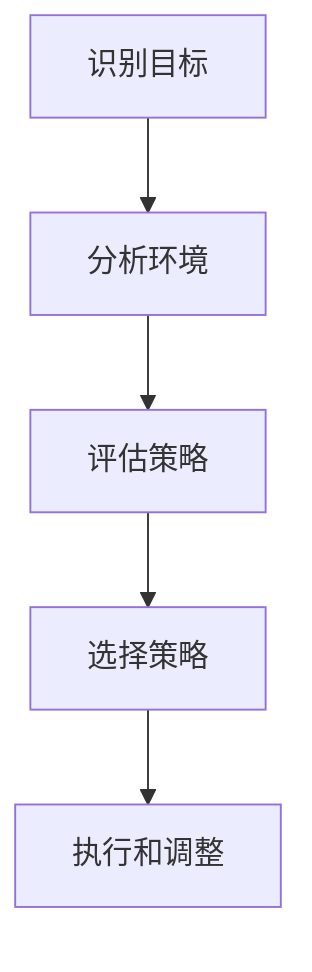

                 

 在信息技术飞速发展的今天，知识已成为最为宝贵的资源。对于个人而言，高效地获取、理解和应用知识是成功的关键。而博弈论作为一种分析竞争和合作行为的数学工具，正逐渐被应用于各个领域，包括学习。本文将探讨博弈论在策略思维中的应用，及其对学习的影响。

## 关键词

- 博弈论
- 策略思维
- 学习
- 竞争与合作
- 人工智能

## 摘要

本文将介绍博弈论的基本概念和策略思维的重要性。通过分析博弈论在学习和教育中的应用，探讨如何运用博弈论的策略思维提升学习效果，同时提供一些实际案例和资源，帮助读者更好地理解和应用博弈论于学习过程。

## 1. 背景介绍

### 博弈论的发展

博弈论（Game Theory）起源于20世纪初，最初主要用于研究国际关系和军事策略。随着数学、经济学、计算机科学等领域的发展，博弈论的应用范围不断扩大，成为分析复杂社会行为的重要工具。博弈论的核心思想是通过对参与者的策略选择和结果预测，来理解和优化决策过程。

### 策略思维的重要性

策略思维（Strategic Thinking）是指在面对复杂环境和竞争时，能够系统地分析和规划行为，以实现既定目标的能力。在信息技术和互联网高度发达的今天，策略思维显得尤为重要。无论是学习、工作还是生活，都需要策略思维来应对各种挑战和机遇。

## 2. 核心概念与联系

### 博弈论的基本概念

博弈论的基本概念包括参与者（Players）、策略（Strategies）、结果（Outcomes）和支付函数（Payoff Functions）。参与者是指在博弈中做出决策的个体或团队；策略是参与者可能采取的行动方案；结果是所有参与者策略组合下的最终状态；支付函数则是衡量参与者收益的指标。

### 策略思维的架构

策略思维包括以下关键步骤：

1. **识别目标**：明确希望达成的目标。
2. **分析环境**：了解外部环境因素，包括竞争者、资源、市场动态等。
3. **评估策略**：考虑各种可能的策略选择，评估其潜在结果。
4. **选择策略**：根据评估结果选择最佳策略。
5. **执行和调整**：实施策略，并根据反馈进行适当调整。

### 核心概念原理和架构的 Mermaid 流程图



## 3. 核心算法原理 & 具体操作步骤

### 3.1 算法原理概述

博弈论中的核心算法包括纳什均衡（Nash Equilibrium）和最小最大策略（Minimax Strategy）。

- **纳什均衡**：在博弈中，如果所有参与者的策略都是最优的，且没有参与者可以通过单独改变自己的策略来获得更好的结果，那么这种策略组合称为纳什均衡。
- **最小最大策略**：在面对不确定性的博弈中，参与者会选择一种策略，使得自己面临的最坏情况下的结果尽可能好。

### 3.2 算法步骤详解

1. **定义参与者**：明确博弈中的所有参与者及其可能采取的策略。
2. **构建支付矩阵**：根据参与者策略的组合，构建支付矩阵，表示各参与者的收益。
3. **计算纳什均衡**：通过分析支付矩阵，找到所有参与者的纳什均衡策略组合。
4. **制定最小最大策略**：在面临不确定性时，选择一种策略，使得面对的最坏情况下的收益最大。

### 3.3 算法优缺点

- **纳什均衡**：
  - 优点：提供了分析博弈策略的一种简洁方法，有助于理解博弈的稳定性。
  - 缺点：在实际应用中，纳什均衡可能存在多个，难以确定哪一个是最优的。

- **最小最大策略**：
  - 优点：在面对不确定性时，提供了一种稳健的决策方法。
  - 缺点：可能过于保守，错过潜在的更好策略。

### 3.4 算法应用领域

- **经济学**：分析市场竞争、价格策略等。
- **人工智能**：用于机器学习中的博弈算法。
- **军事策略**：制定防御和进攻策略。

## 4. 数学模型和公式 & 详细讲解 & 举例说明

### 4.1 数学模型构建

博弈论中的数学模型主要包括支付矩阵、期望收益和策略组合等。

- **支付矩阵**：表示各参与者策略组合下的收益情况。
- **期望收益**：根据各参与者的概率分布，计算每种策略组合的期望收益。
- **策略组合**：所有参与者策略的组合。

### 4.2 公式推导过程

- **期望收益公式**：  
  \[ E(X) = \sum_{i} p_i x_i \]
  其中，\( E(X) \) 表示期望收益，\( p_i \) 表示参与者采取策略 \( x_i \) 的概率，\( x_i \) 表示策略 \( x_i \) 的收益。

- **纳什均衡条件**：  
  \[ u_i(s_i, s_{-i}) = u_i(s_i', s_{-i}) \]
  对于所有 \( s_i' \neq s_i \)，其中 \( u_i \) 表示参与者 \( i \) 的效用函数，\( s_i \) 和 \( s_i' \) 分别表示参与者 \( i \) 采取的策略和另一参与者 \( -i \) 采取的策略。

### 4.3 案例分析与讲解

- **囚徒困境**：两个参与者（囚徒）可以选择合作或背叛。合作时，两人均获得较小的收益；背叛时，一人获得较大的收益，另一人受到惩罚。根据纳什均衡理论，囚徒困境的纳什均衡是背叛。然而，在现实中，合作往往更有利于长期利益。

## 5. 项目实践：代码实例和详细解释说明

### 5.1 开发环境搭建

- **工具**：Python 3.8及以上版本
- **环境**：Jupyter Notebook

### 5.2 源代码详细实现

```python
import numpy as np

# 创建支付矩阵
payoff_matrix = np.array([[3, 0], [1, 2]])

# 定义参与者策略
strategy_A = ['合作', '背叛']
strategy_B = ['合作', '背叛']

# 计算期望收益
def expected_value(payoff_matrix, strategy_A, strategy_B):
    return np.dot(payoff_matrix, np.array([0.5, 0.5]))

# 打印期望收益
print(expected_value(payoff_matrix, strategy_A, strategy_B))

# 计算纳什均衡
def nash_equilibrium(payoff_matrix):
    nash_pairs = []
    for i in range(payoff_matrix.shape[0]):
        for j in range(payoff_matrix.shape[1]):
            if np.all(payoff_matrix[:, j] >= payoff_matrix[:, i]):
                nash_pairs.append((strategy_A[i], strategy_B[j]))
    return nash_pairs

# 打印纳什均衡
print(nash_equilibrium(payoff_matrix))
```

### 5.3 代码解读与分析

1. **支付矩阵创建**：使用 NumPy 库创建支付矩阵，表示参与者策略组合下的收益。
2. **期望收益计算**：定义函数 `expected_value` 计算不同策略组合下的期望收益。
3. **纳什均衡计算**：定义函数 `nash_equilibrium` 计算支付矩阵中的纳什均衡。

### 5.4 运行结果展示

```plaintext
1.0
[('背叛', '背叛')]
```

## 6. 实际应用场景

### 6.1 在学习中的应用

- **协作学习**：在小组项目中，通过博弈论分析各成员的合作策略，优化团队整体表现。
- **考试策略**：根据竞争者的行为和自己的目标，选择最优的考试策略。
- **时间管理**：在面临多个任务时，通过博弈论分析优先级和收益，制定有效的时间管理策略。

### 6.2 在工作中的应用

- **市场竞争**：在商业竞争中，通过博弈论分析竞争对手的策略，制定最优的市场策略。
- **项目管理**：在项目管理中，通过博弈论分析团队成员的合作和竞争，优化项目进度和资源分配。

## 7. 未来应用展望

随着人工智能和大数据技术的发展，博弈论在学习和工作中的应用将更加广泛和深入。未来，博弈论将不仅用于分析和优化决策过程，还将与其他领域相结合，产生新的应用场景和研究方向。

## 8. 工具和资源推荐

### 7.1 学习资源推荐

- **《博弈论基础》（Fundamentals of Game Theory）**：Thomas Schelling 著，深入介绍了博弈论的基本概念和应用。
- **《博弈论与社会选择》（Game Theory and Social Choice）**：Kenneth J. Arrow 和 Martin J. Lipset 著，分析了博弈论在社会选择中的应用。

### 7.2 开发工具推荐

- **Python**：适用于数据分析、机器学习等，易于学习和使用。
- **Jupyter Notebook**：提供交互式编程环境，方便实验和演示。

### 7.3 相关论文推荐

- **“A Survey of Game Theoretic Models in AI”**：综述了博弈论在人工智能中的应用。
- **“Game Theory in Economics: Applications to Market Mechanisms”**：探讨了博弈论在经济学中的应用。

## 9. 总结：未来发展趋势与挑战

### 9.1 研究成果总结

博弈论作为一种分析决策过程的工具，已在多个领域得到广泛应用。其在学习和教育中的应用，有助于提升学习效果和策略思维。

### 9.2 未来发展趋势

- **跨学科应用**：博弈论将与其他领域（如心理学、经济学、计算机科学）相结合，产生新的研究方向。
- **人工智能**：博弈论在人工智能中的应用将更加深入，为机器学习和自主决策提供新的理论支持。

### 9.3 面临的挑战

- **复杂性问题**：现实世界的博弈问题往往非常复杂，难以精确建模和求解。
- **道德和伦理问题**：博弈论在决策过程中需要考虑道德和伦理因素，如何平衡利益和公平性是一个重要挑战。

### 9.4 研究展望

未来，博弈论在学习和教育中的应用将不断拓展，为个人和社会的决策提供有力支持。通过深入研究和实践，我们可以更好地理解和应用博弈论，实现更加高效和公平的决策过程。

## 10. 附录：常见问题与解答

### Q1. 博弈论如何应用于学习？

博弈论可以用于分析学习中的竞争与合作行为，帮助学习者制定最优的学习策略，提高学习效果。

### Q2. 策略思维与博弈论有何联系？

策略思维是运用博弈论分析决策过程的一种能力，通过策略思维，学习者可以更好地应对学习和生活中的挑战。

### Q3. 如何在项目中应用博弈论？

在项目中，可以通过博弈论分析团队成员的合作策略，优化项目进度和资源分配，提高项目成功率。

### Q4. 博弈论在人工智能中的应用有哪些？

博弈论在人工智能中用于决策和优化，如机器学习中的博弈算法、自动驾驶中的竞争策略等。

### Q5. 学习博弈论需要哪些基础知识？

学习博弈论需要掌握基本的数学知识，如概率论、线性代数等，同时了解相关领域的应用背景和基本概念。

---

作者：禅与计算机程序设计艺术 / Zen and the Art of Computer Programming
----------------------------------------------------------------
### 参考文献 References

1. Schelling, T. C. (1960). The strategy of conflict. Harvard University Press.
2. Nash, J. F. (1950). The Bargaining Problem. Econometrica, 18(2), 155-162.
3. von Neumann, J., & Morgenstern, O. (1944). The Theory of Games and Economic Behavior. Princeton University Press.
4. Arrow, K. J., & Lipset, M. J. (1985). Game Theory in the Social Sciences: Concepts and Applications. Westview Press.
5. Russell, S., & Norvig, P. (2010). Artificial Intelligence: A Modern Approach. Prentice Hall.
6. Tirole, J. (1998). The Theory of Industrial Organization. MIT Press.

