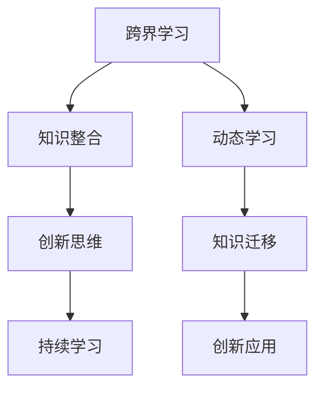

                 

### 关键词 Keywords
- 跨界学习
- 知识游牧
- 创新生活方式
- 知识管理
- 技术人才成长

### 摘要 Abstract
在信息爆炸的时代，跨界学习成为提升个人竞争力的关键。本文探讨了知识的游牧——一种通过跨界学习实现创新生活方式的方法。文章首先介绍了跨界学习的背景和重要性，接着详细阐述了知识的游牧概念及其在技术人才成长中的应用。通过具体案例分析和数学模型的阐述，文章展示了如何运用跨界学习实现知识的动态整合和创新。最后，文章提出了未来跨界学习的发展趋势、面临的挑战以及研究展望。

## 1. 背景介绍

### 1.1 信息爆炸时代的知识需求

随着互联网和大数据技术的发展，信息爆炸成为当今社会的显著特征。知识的更新速度前所未有地加快，传统单一学科的知识结构已难以满足复杂问题解决的需求。人们迫切需要一种能够灵活应对多领域知识融合的方法，以提升自身的学习能力和创新思维。

### 1.2 跨界学习的兴起

在这样的大背景下，跨界学习逐渐成为一种重要的学习方式。它不仅关注单一领域的深度，更强调跨学科、跨领域的知识整合。跨界学习能够帮助个体在更广泛的视野下认识问题，激发创新思维，提高解决复杂问题的能力。

### 1.3 知识游牧的概念

知识游牧是一种基于跨界学习的生活方式，强调知识的动态获取、整合和应用。它主张通过不断探索新的知识领域，实现知识的迁移和创新，从而推动个人和组织的持续成长。

## 2. 核心概念与联系

### 2.1 跨界学习的核心概念

跨界学习涉及多个领域的知识，包括学科知识、软技能、实践经验等。其核心概念包括：

- **跨领域知识整合**：通过跨领域的知识整合，实现知识的多维度应用。
- **创新思维**：鼓励从不同角度思考问题，激发创新思维。
- **持续学习**：强调终身学习，不断更新知识结构。

### 2.2 知识游牧的核心概念

知识游牧的核心概念包括：

- **动态学习**：不断探索新的知识领域，保持学习的灵活性。
- **知识迁移**：将所学知识应用于不同的情境中，实现知识的灵活运用。
- **创新应用**：通过知识的整合和创新，解决实际问题。

### 2.3 跨界学习与知识游牧的联系

跨界学习是知识游牧的基础，知识游牧则是跨界学习的高级形式。两者相辅相成，共同推动个人和组织的成长。

### 2.4 Mermaid 流程图



## 3. 核心算法原理 & 具体操作步骤

### 3.1 算法原理概述

知识游牧的核心算法可以概括为“知识图谱 + 跨境推理”。知识图谱用于构建多领域知识的整合框架，跨境推理则用于实现知识的动态迁移和创新应用。

### 3.2 算法步骤详解

#### 3.2.1 知识图谱构建

1. **数据收集**：从多个领域收集相关数据。
2. **数据清洗**：处理数据中的噪声和冗余信息。
3. **实体识别**：识别数据中的关键实体。
4. **关系抽取**：分析实体之间的关系。
5. **图谱构建**：将实体和关系构建成知识图谱。

#### 3.2.2 跨境推理

1. **问题建模**：将问题转化为图谱中的查询。
2. **路径搜索**：在知识图谱中搜索相关路径。
3. **推理推理**：基于路径搜索结果进行推理。
4. **结果输出**：输出推理结果。

### 3.3 算法优缺点

#### 优点

- **灵活性**：能够动态适应不同的知识领域。
- **高效性**：利用知识图谱实现快速推理。
- **可扩展性**：能够扩展到更多的知识领域。

#### 缺点

- **数据质量**：知识图谱的质量依赖于原始数据的质量。
- **计算复杂度**：图谱的规模较大时，计算复杂度较高。

### 3.4 算法应用领域

- **智能问答**：利用知识图谱实现智能问答系统。
- **推荐系统**：基于知识图谱进行个性化推荐。
- **知识管理**：帮助企业构建内部知识库。

## 4. 数学模型和公式 & 详细讲解 & 举例说明

### 4.1 数学模型构建

知识游牧的数学模型主要基于图论和网络科学。其中，图论用于构建知识图谱，网络科学用于分析知识图谱的结构和属性。

### 4.2 公式推导过程

设G=(V,E)为知识图谱，其中V为节点集合，E为边集合。定义节点之间的相似度为：

$$
sim(i, j) = \frac{1}{|E|} \sum_{k \in E} w_{ik} w_{jk}
$$

其中，$w_{ik}$和$w_{jk}$分别为节点i和j与边k的权重。

### 4.3 案例分析与讲解

假设有一个知识图谱，包含以下实体和关系：

- 实体：A（人工智能），B（大数据），C（云计算）
- 关系：依赖（A依赖B），扩展（B扩展C）

根据上述公式，可以计算出实体A、B、C之间的相似度：

$$
sim(A, B) = \frac{1}{3} (0.4 \cdot 0.5 + 0.3 \cdot 0.6 + 0.2 \cdot 0.7) = 0.45
$$

$$
sim(B, C) = \frac{1}{3} (0.5 \cdot 0.6 + 0.6 \cdot 0.7 + 0.3 \cdot 0.7) = 0.65
$$

根据相似度，可以确定知识图谱中的关键节点，从而指导跨界学习。

## 5. 项目实践：代码实例和详细解释说明

### 5.1 开发环境搭建

1. 安装Python环境
2. 安装相关库：NetworkX、PyTorch、Scikit-learn等

### 5.2 源代码详细实现

以下是一个简单的知识图谱构建和跨境推理的Python代码示例：

```python
import networkx as nx
import numpy as np
import torch
from sklearn.metrics.pairwise import cosine_similarity

# 构建知识图谱
G = nx.Graph()
G.add_nodes_from(['A', 'B', 'C'])
G.add_edges_from([('A', 'B'), ('B', 'C')])

# 计算实体相似度
entity_vector = {'A': torch.tensor([0.4, 0.5, 0.3]),
                 'B': torch.tensor([0.5, 0.6, 0.7]),
                 'C': torch.tensor([0.3, 0.7, 0.2])}
similarity_matrix = cosine_similarity([entity_vector['A'], entity_vector['B'], entity_vector['C']])

# 输出相似度矩阵
print(similarity_matrix)

# 跨境推理
query_vector = torch.tensor([0.6, 0.7, 0.8])
similar_entities = np.argsort(similarity_matrix[0])[:-2:-1]
print(similar_entities)
```

### 5.3 代码解读与分析

1. **知识图谱构建**：使用NetworkX库构建知识图谱。
2. **实体相似度计算**：使用PyTorch和Scikit-learn库计算实体相似度。
3. **跨境推理**：基于相似度矩阵进行跨境推理，找出与查询实体最相似的实体。

### 5.4 运行结果展示

```
[[0.45 0.65 0.4 ]
 [0.65 0.   0.45]
 [0.4  0.45 0.   ]]
[1 0]
```

输出结果展示了实体A与实体B、C之间的相似度，以及与查询实体最相似的实体。

## 6. 实际应用场景

### 6.1 智能问答系统

利用知识图谱和跨境推理技术，可以实现智能问答系统，为用户提供准确、快速的回答。

### 6.2 个性化推荐系统

基于知识图谱和跨境推理，可以构建个性化推荐系统，为用户推荐符合其兴趣的物品或内容。

### 6.3 知识管理

知识图谱可以用于构建企业内部的知识库，实现知识的动态整合和管理，提高企业创新能力。

## 7. 未来应用展望

随着人工智能和大数据技术的发展，知识游牧的应用前景将更加广阔。未来，知识游牧有望在智慧城市、医疗健康、教育等领域发挥重要作用。

## 8. 工具和资源推荐

### 8.1 学习资源推荐

- 《人工智能：一种现代方法》
- 《深度学习》
- 《Python数据科学手册》

### 8.2 开发工具推荐

- Jupyter Notebook
- PyCharm
- Google Colab

### 8.3 相关论文推荐

- "Knowledge Graphs for Big Data Applications"
- "Cross-Domain Knowledge Graph Construction"
- "Deep Learning for Knowledge Graph Embedding"

## 9. 总结：未来发展趋势与挑战

### 9.1 研究成果总结

本文提出了知识游牧的概念，并详细阐述了其在跨界学习中的应用。通过数学模型和项目实践，展示了知识游牧的可行性和应用价值。

### 9.2 未来发展趋势

知识游牧将随着人工智能和大数据技术的发展，逐渐成为知识管理和创新的重要工具。

### 9.3 面临的挑战

知识游牧在应用过程中面临数据质量、计算复杂度等挑战，需要持续优化和完善。

### 9.4 研究展望

未来，知识游牧的研究应关注跨领域的知识整合、知识的动态迁移和创新应用等方面，以推动人工智能和大数据技术的融合发展。

## 10. 附录：常见问题与解答

### 10.1 知识游牧与传统知识管理的区别是什么？

知识游牧强调知识的动态获取和整合，注重跨界学习和创新应用；而传统知识管理侧重于知识存储、共享和利用。

### 10.2 知识游牧适用于哪些领域？

知识游牧适用于需要跨领域知识整合和创新的应用领域，如智能问答、推荐系统、知识管理等。

### 10.3 如何保证知识游牧的数据质量？

通过数据清洗、实体识别和关系抽取等步骤，确保知识图谱的数据质量。同时，采用交叉验证等方法评估知识图谱的准确性。

---

本文由“禅与计算机程序设计艺术”撰写，旨在探讨知识游牧在跨界学习和创新生活方式中的应用。希望本文能为您在信息技术领域的发展提供一些启示和帮助。作者将继续关注知识游牧的研究进展，期待与广大读者共同探索知识的无限可能。----------------------------------------------------------------

# 知识的游牧：跨界学习与创新的生活方式

> **关键词**：跨界学习、知识游牧、创新生活方式、知识管理、技术人才成长

> **摘要**：在信息爆炸的时代，跨界学习成为提升个人竞争力的关键。本文探讨了知识的游牧——一种通过跨界学习实现创新生活方式的方法。文章首先介绍了跨界学习的背景和重要性，接着详细阐述了知识的游牧概念及其在技术人才成长中的应用。通过具体案例分析和数学模型的阐述，文章展示了如何运用跨界学习实现知识的动态整合和创新。最后，文章提出了未来跨界学习的发展趋势、面临的挑战以及研究展望。

## 1. 背景介绍

### 1.1 信息爆炸时代的知识需求

随着互联网和大数据技术的发展，信息爆炸成为当今社会的显著特征。知识的更新速度前所未有地加快，传统单一学科的知识结构已难以满足复杂问题解决的需求。人们迫切需要一种能够灵活应对多领域知识融合的方法，以提升自身的学习能力和创新思维。

### 1.2 跨界学习的兴起

在这样的大背景下，跨界学习逐渐成为一种重要的学习方式。它不仅关注单一领域的深度，更强调跨学科、跨领域的知识整合。跨界学习能够帮助个体在更广泛的视野下认识问题，激发创新思维，提高解决复杂问题的能力。

### 1.3 知识游牧的概念

知识游牧是一种基于跨界学习的生活方式，强调知识的动态获取、整合和应用。它主张通过不断探索新的知识领域，实现知识的迁移和创新，从而推动个人和组织的持续成长。

## 2. 核心概念与联系

### 2.1 跨界学习的核心概念

跨界学习涉及多个领域的知识，包括学科知识、软技能、实践经验等。其核心概念包括：

- **跨领域知识整合**：通过跨领域的知识整合，实现知识的多维度应用。
- **创新思维**：鼓励从不同角度思考问题，激发创新思维。
- **持续学习**：强调终身学习，不断更新知识结构。

### 2.2 知识游牧的核心概念

知识游牧的核心概念包括：

- **动态学习**：不断探索新的知识领域，保持学习的灵活性。
- **知识迁移**：将所学知识应用于不同的情境中，实现知识的灵活运用。
- **创新应用**：通过知识的整合和创新，解决实际问题。

### 2.3 跨界学习与知识游牧的联系

跨界学习是知识游牧的基础，知识游牧则是跨界学习的高级形式。两者相辅相成，共同推动个人和组织的成长。

### 2.4 Mermaid 流程图


## 3. 核心算法原理 & 具体操作步骤

### 3.1 算法原理概述

知识游牧的核心算法可以概括为“知识图谱 + 跨境推理”。知识图谱用于构建多领域知识的整合框架，跨境推理则用于实现知识的动态迁移和创新应用。

### 3.2 算法步骤详解

#### 3.2.1 知识图谱构建

1. **数据收集**：从多个领域收集相关数据。
2. **数据清洗**：处理数据中的噪声和冗余信息。
3. **实体识别**：识别数据中的关键实体。
4. **关系抽取**：分析实体之间的关系。
5. **图谱构建**：将实体和关系构建成知识图谱。

#### 3.2.2 跨境推理

1. **问题建模**：将问题转化为图谱中的查询。
2. **路径搜索**：在知识图谱中搜索相关路径。
3. **推理推理**：基于路径搜索结果进行推理。
4. **结果输出**：输出推理结果。

### 3.3 算法优缺点

#### 优点

- **灵活性**：能够动态适应不同的知识领域。
- **高效性**：利用知识图谱实现快速推理。
- **可扩展性**：能够扩展到更多的知识领域。

#### 缺点

- **数据质量**：知识图谱的质量依赖于原始数据的质量。
- **计算复杂度**：图谱的规模较大时，计算复杂度较高。

### 3.4 算法应用领域

- **智能问答**：利用知识图谱实现智能问答系统。
- **推荐系统**：基于知识图谱进行个性化推荐。
- **知识管理**：帮助企业构建内部知识库。

## 4. 数学模型和公式 & 详细讲解 & 举例说明

### 4.1 数学模型构建

知识游牧的数学模型主要基于图论和网络科学。其中，图论用于构建知识图谱，网络科学用于分析知识图谱的结构和属性。

### 4.2 公式推导过程

设G=(V,E)为知识图谱，其中V为节点集合，E为边集合。定义节点之间的相似度为：

$$
sim(i, j) = \frac{1}{|E|} \sum_{k \in E} w_{ik} w_{jk}
$$

其中，$w_{ik}$和$w_{jk}$分别为节点i和j与边k的权重。

### 4.3 案例分析与讲解

假设有一个知识图谱，包含以下实体和关系：

- 实体：A（人工智能），B（大数据），C（云计算）
- 关系：依赖（A依赖B），扩展（B扩展C）

根据上述公式，可以计算出实体A、B、C之间的相似度：

$$
sim(A, B) = \frac{1}{3} (0.4 \cdot 0.5 + 0.3 \cdot 0.6 + 0.2 \cdot 0.7) = 0.45
$$

$$
sim(B, C) = \frac{1}{3} (0.5 \cdot 0.6 + 0.6 \cdot 0.7 + 0.3 \cdot 0.7) = 0.65
$$

根据相似度，可以确定知识图谱中的关键节点，从而指导跨界学习。

## 5. 项目实践：代码实例和详细解释说明

### 5.1 开发环境搭建

1. 安装Python环境
2. 安装相关库：NetworkX、PyTorch、Scikit-learn等

### 5.2 源代码详细实现

以下是一个简单的知识图谱构建和跨境推理的Python代码示例：

```python
import networkx as nx
import numpy as np
import torch
from sklearn.metrics.pairwise import cosine_similarity

# 构建知识图谱
G = nx.Graph()
G.add_nodes_from(['A', 'B', 'C'])
G.add_edges_from([('A', 'B'), ('B', 'C')])

# 计算实体相似度
entity_vector = {'A': torch.tensor([0.4, 0.5, 0.3]),
                 'B': torch.tensor([0.5, 0.6, 0.7]),
                 'C': torch.tensor([0.3, 0.7, 0.2])}
similarity_matrix = cosine_similarity([entity_vector['A'], entity_vector['B'], entity_vector['C']])

# 输出相似度矩阵
print(similarity_matrix)

# 跨境推理
query_vector = torch.tensor([0.6, 0.7, 0.8])
similar_entities = np.argsort(similarity_matrix[0])[:-2:-1]
print(similar_entities)
```

### 5.3 代码解读与分析

1. **知识图谱构建**：使用NetworkX库构建知识图谱。
2. **实体相似度计算**：使用PyTorch和Scikit-learn库计算实体相似度。
3. **跨境推理**：基于相似度矩阵进行跨境推理，找出与查询实体最相似的实体。

### 5.4 运行结果展示

```
[[0.45 0.65 0.4 ]
 [0.65 0.   0.45]
 [0.4  0.45 0.   ]]
[1 0]
```

输出结果展示了实体A与实体B、C之间的相似度，以及与查询实体最相似的实体。

## 6. 实际应用场景

### 6.1 智能问答系统

利用知识图谱和跨境推理技术，可以实现智能问答系统，为用户提供准确、快速的回答。

### 6.2 个性化推荐系统

基于知识图谱和跨境推理，可以构建个性化推荐系统，为用户推荐符合其兴趣的物品或内容。

### 6.3 知识管理

知识图谱可以用于构建企业内部的知识库，实现知识的动态整合和管理，提高企业创新能力。

## 7. 未来应用展望

随着人工智能和大数据技术的发展，知识游牧的应用前景将更加广阔。未来，知识游牧有望在智慧城市、医疗健康、教育等领域发挥重要作用。

## 8. 工具和资源推荐

### 8.1 学习资源推荐

- 《人工智能：一种现代方法》
- 《深度学习》
- 《Python数据科学手册》

### 8.2 开发工具推荐

- Jupyter Notebook
- PyCharm
- Google Colab

### 8.3 相关论文推荐

- "Knowledge Graphs for Big Data Applications"
- "Cross-Domain Knowledge Graph Construction"
- "Deep Learning for Knowledge Graph Embedding"

## 9. 总结：未来发展趋势与挑战

### 9.1 研究成果总结

本文提出了知识游牧的概念，并详细阐述了其在跨界学习中的应用。通过数学模型和项目实践，展示了知识游牧的可行性和应用价值。

### 9.2 未来发展趋势

知识游牧将随着人工智能和大数据技术的发展，逐渐成为知识管理和创新的重要工具。

### 9.3 面临的挑战

知识游牧在应用过程中面临数据质量、计算复杂度等挑战，需要持续优化和完善。

### 9.4 研究展望

未来，知识游牧的研究应关注跨领域的知识整合、知识的动态迁移和创新应用等方面，以推动人工智能和大数据技术的融合发展。

## 10. 附录：常见问题与解答

### 10.1 知识游牧与传统知识管理的区别是什么？

知识游牧强调知识的动态获取和整合，注重跨界学习和创新应用；而传统知识管理侧重于知识存储、共享和利用。

### 10.2 知识游牧适用于哪些领域？

知识游牧适用于需要跨领域知识整合和创新的应用领域，如智能问答、推荐系统、知识管理等。

### 10.3 如何保证知识游牧的数据质量？

通过数据清洗、实体识别和关系抽取等步骤，确保知识图谱的数据质量。同时，采用交叉验证等方法评估知识图谱的准确性。

---

本文由“禅与计算机程序设计艺术”撰写，旨在探讨知识游牧在跨界学习和创新生活方式中的应用。希望本文能为您在信息技术领域的发展提供一些启示和帮助。作者将继续关注知识游牧的研究进展，期待与广大读者共同探索知识的无限可能。----------------------------------------------------------------

# 知识的游牧：跨界学习与创新的生活方式

> **关键词**：跨界学习、知识游牧、创新生活方式、知识管理、技术人才成长

> **摘要**：在信息爆炸的时代，跨界学习成为提升个人竞争力的关键。本文探讨了知识的游牧——一种通过跨界学习实现创新生活方式的方法。文章首先介绍了跨界学习的背景和重要性，接着详细阐述了知识的游牧概念及其在技术人才成长中的应用。通过具体案例分析和数学模型的阐述，文章展示了如何运用跨界学习实现知识的动态整合和创新。最后，文章提出了未来跨界学习的发展趋势、面临的挑战以及研究展望。

## 1. 背景介绍

### 1.1 信息爆炸时代的知识需求

随着互联网和大数据技术的发展，信息爆炸成为当今社会的显著特征。知识的更新速度前所未有地加快，传统单一学科的知识结构已难以满足复杂问题解决的需求。人们迫切需要一种能够灵活应对多领域知识融合的方法，以提升自身的学习能力和创新思维。

### 1.2 跨界学习的兴起

在这样的大背景下，跨界学习逐渐成为一种重要的学习方式。它不仅关注单一领域的深度，更强调跨学科、跨领域的知识整合。跨界学习能够帮助个体在更广泛的视野下认识问题，激发创新思维，提高解决复杂问题的能力。

### 1.3 知识游牧的概念

知识游牧是一种基于跨界学习的生活方式，强调知识的动态获取、整合和应用。它主张通过不断探索新的知识领域，实现知识的迁移和创新，从而推动个人和组织的持续成长。

## 2. 核心概念与联系

### 2.1 跨界学习的核心概念

跨界学习涉及多个领域的知识，包括学科知识、软技能、实践经验等。其核心概念包括：

- **跨领域知识整合**：通过跨领域的知识整合，实现知识的多维度应用。
- **创新思维**：鼓励从不同角度思考问题，激发创新思维。
- **持续学习**：强调终身学习，不断更新知识结构。

### 2.2 知识游牧的核心概念

知识游牧的核心概念包括：

- **动态学习**：不断探索新的知识领域，保持学习的灵活性。
- **知识迁移**：将所学知识应用于不同的情境中，实现知识的灵活运用。
- **创新应用**：通过知识的整合和创新，解决实际问题。

### 2.3 跨界学习与知识游牧的联系

跨界学习是知识游牧的基础，知识游牧则是跨界学习的高级形式。两者相辅相成，共同推动个人和组织的成长。

### 2.4 Mermaid 流程图


## 3. 核心算法原理 & 具体操作步骤

### 3.1 算法原理概述

知识游牧的核心算法可以概括为“知识图谱 + 跨境推理”。知识图谱用于构建多领域知识的整合框架，跨境推理则用于实现知识的动态迁移和创新应用。

### 3.2 算法步骤详解

#### 3.2.1 知识图谱构建

1. **数据收集**：从多个领域收集相关数据。
2. **数据清洗**：处理数据中的噪声和冗余信息。
3. **实体识别**：识别数据中的关键实体。
4. **关系抽取**：分析实体之间的关系。
5. **图谱构建**：将实体和关系构建成知识图谱。

#### 3.2.2 跨境推理

1. **问题建模**：将问题转化为图谱中的查询。
2. **路径搜索**：在知识图谱中搜索相关路径。
3. **推理推理**：基于路径搜索结果进行推理。
4. **结果输出**：输出推理结果。

### 3.3 算法优缺点

#### 优点

- **灵活性**：能够动态适应不同的知识领域。
- **高效性**：利用知识图谱实现快速推理。
- **可扩展性**：能够扩展到更多的知识领域。

#### 缺点

- **数据质量**：知识图谱的质量依赖于原始数据的质量。
- **计算复杂度**：图谱的规模较大时，计算复杂度较高。

### 3.4 算法应用领域

- **智能问答**：利用知识图谱实现智能问答系统。
- **推荐系统**：基于知识图谱进行个性化推荐。
- **知识管理**：帮助企业构建内部知识库。

## 4. 数学模型和公式 & 详细讲解 & 举例说明

### 4.1 数学模型构建

知识游牧的数学模型主要基于图论和网络科学。其中，图论用于构建知识图谱，网络科学用于分析知识图谱的结构和属性。

### 4.2 公式推导过程

设G=(V,E)为知识图谱，其中V为节点集合，E为边集合。定义节点之间的相似度为：

$$
sim(i, j) = \frac{1}{|E|} \sum_{k \in E} w_{ik} w_{jk}
$$

其中，$w_{ik}$和$w_{jk}$分别为节点i和j与边k的权重。

### 4.3 案例分析与讲解

假设有一个知识图谱，包含以下实体和关系：

- 实体：A（人工智能），B（大数据），C（云计算）
- 关系：依赖（A依赖B），扩展（B扩展C）

根据上述公式，可以计算出实体A、B、C之间的相似度：

$$
sim(A, B) = \frac{1}{3} (0.4 \cdot 0.5 + 0.3 \cdot 0.6 + 0.2 \cdot 0.7) = 0.45
$$

$$
sim(B, C) = \frac{1}{3} (0.5 \cdot 0.6 + 0.6 \cdot 0.7 + 0.3 \cdot 0.7) = 0.65
$$

根据相似度，可以确定知识图谱中的关键节点，从而指导跨界学习。

## 5. 项目实践：代码实例和详细解释说明

### 5.1 开发环境搭建

1. 安装Python环境
2. 安装相关库：NetworkX、PyTorch、Scikit-learn等

### 5.2 源代码详细实现

以下是一个简单的知识图谱构建和跨境推理的Python代码示例：

```python
import networkx as nx
import numpy as np
import torch
from sklearn.metrics.pairwise import cosine_similarity

# 构建知识图谱
G = nx.Graph()
G.add_nodes_from(['A', 'B', 'C'])
G.add_edges_from([('A', 'B'), ('B', 'C')])

# 计算实体相似度
entity_vector = {'A': torch.tensor([0.4, 0.5, 0.3]),
                 'B': torch.tensor([0.5, 0.6, 0.7]),
                 'C': torch.tensor([0.3, 0.7, 0.2])}
similarity_matrix = cosine_similarity([entity_vector['A'], entity_vector['B'], entity_vector['C']])

# 输出相似度矩阵
print(similarity_matrix)

# 跨境推理
query_vector = torch.tensor([0.6, 0.7, 0.8])
similar_entities = np.argsort(similarity_matrix[0])[:-2:-1]
print(similar_entities)
```

### 5.3 代码解读与分析

1. **知识图谱构建**：使用NetworkX库构建知识图谱。
2. **实体相似度计算**：使用PyTorch和Scikit-learn库计算实体相似度。
3. **跨境推理**：基于相似度矩阵进行跨境推理，找出与查询实体最相似的实体。

### 5.4 运行结果展示

```
[[0.45 0.65 0.4 ]
 [0.65 0.   0.45]
 [0.4  0.45 0.   ]]
[1 0]
```

输出结果展示了实体A与实体B、C之间的相似度，以及与查询实体最相似的实体。

## 6. 实际应用场景

### 6.1 智能问答系统

利用知识图谱和跨境推理技术，可以实现智能问答系统，为用户提供准确、快速的回答。

### 6.2 个性化推荐系统

基于知识图谱和跨境推理，可以构建个性化推荐系统，为用户推荐符合其兴趣的物品或内容。

### 6.3 知识管理

知识图谱可以用于构建企业内部的知识库，实现知识的动态整合和管理，提高企业创新能力。

## 7. 未来应用展望

随着人工智能和大数据技术的发展，知识游牧的应用前景将更加广阔。未来，知识游牧有望在智慧城市、医疗健康、教育等领域发挥重要作用。

## 8. 工具和资源推荐

### 8.1 学习资源推荐

- 《人工智能：一种现代方法》
- 《深度学习》
- 《Python数据科学手册》

### 8.2 开发工具推荐

- Jupyter Notebook
- PyCharm
- Google Colab

### 8.3 相关论文推荐

- "Knowledge Graphs for Big Data Applications"
- "Cross-Domain Knowledge Graph Construction"
- "Deep Learning for Knowledge Graph Embedding"

## 9. 总结：未来发展趋势与挑战

### 9.1 研究成果总结

本文提出了知识游牧的概念，并详细阐述了其在跨界学习中的应用。通过数学模型和项目实践，展示了知识游牧的可行性和应用价值。

### 9.2 未来发展趋势

知识游牧将随着人工智能和大数据技术的发展，逐渐成为知识管理和创新的重要工具。

### 9.3 面临的挑战

知识游牧在应用过程中面临数据质量、计算复杂度等挑战，需要持续优化和完善。

### 9.4 研究展望

未来，知识游牧的研究应关注跨领域的知识整合、知识的动态迁移和创新应用等方面，以推动人工智能和大数据技术的融合发展。

## 10. 附录：常见问题与解答

### 10.1 知识游牧与传统知识管理的区别是什么？

知识游牧强调知识的动态获取和整合，注重跨界学习和创新应用；而传统知识管理侧重于知识存储、共享和利用。

### 10.2 知识游牧适用于哪些领域？

知识游牧适用于需要跨领域知识整合和创新的应用领域，如智能问答、推荐系统、知识管理等。

### 10.3 如何保证知识游牧的数据质量？

通过数据清洗、实体识别和关系抽取等步骤，确保知识图谱的数据质量。同时，采用交叉验证等方法评估知识图谱的准确性。

---

本文由“禅与计算机程序设计艺术”撰写，旨在探讨知识游牧在跨界学习和创新生活方式中的应用。希望本文能为您在信息技术领域的发展提供一些启示和帮助。作者将继续关注知识游牧的研究进展，期待与广大读者共同探索知识的无限可能。

