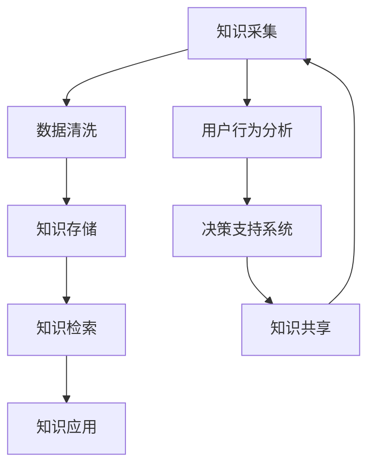

                 

 **关键词：** 知识管理，AI辅助，智慧组织，数据处理，知识图谱，人工智能技术，组织效率。

**摘要：** 本文将探讨知识管理3.0时代的到来，如何通过AI辅助实现智慧组织的构建。我们将深入分析核心概念、算法原理、数学模型、实践应用以及未来展望，为企业和组织提供基于人工智能技术的知识管理解决方案。

## 1. 背景介绍

知识管理作为一个持续发展的领域，已经经历了从文档管理、信息共享到知识创造的不同阶段。随着人工智能技术的飞速发展，知识管理3.0时代应运而生。在这个阶段，AI成为知识管理的核心驱动力量，能够深度挖掘数据价值，实现知识的智能化和自动化处理。

智慧组织是指在信息化和数字化基础上，通过引入AI技术，实现组织内部知识的系统化管理、高效利用和创新。智慧组织的目标是提高组织效率，增强竞争力，实现可持续发展。

### 知识管理的发展历程

- **知识管理1.0：文档管理**：这一阶段主要关注文档的收集、存储和共享。
- **知识管理2.0：信息共享**：通过构建企业内部网络平台，实现信息的快速传递和共享。
- **知识管理3.0：知识创造**：利用AI技术，从海量数据中挖掘潜在知识，推动知识的创新和应用。

### 智慧组织的特征

- **智能化**：通过AI技术实现知识自动化处理和管理。
- **协同化**：促进组织内部和跨部门的协同工作。
- **创新化**：推动组织在知识创新和应用上的持续进步。

## 2. 核心概念与联系

在构建智慧组织的过程中，理解核心概念和它们之间的联系至关重要。以下是一个简化的Mermaid流程图，用于展示这些概念之间的相互作用。



### 2.1 知识采集

知识采集是指通过各种渠道获取组织内外部的知识资源。这包括内部文档、外部资讯、用户反馈等。AI技术可以帮助自动识别和分类这些知识资源。

### 2.2 数据清洗

数据清洗是知识管理的重要环节，确保知识资源的准确性和一致性。AI技术可以自动化处理大量数据，识别并修复数据中的错误。

### 2.3 知识存储

知识存储是将清洗后的数据存储在数据库或知识库中，以便后续查询和使用。AI技术可以优化存储结构，提高数据访问效率。

### 2.4 知识检索

知识检索是指用户通过关键词或特定需求快速找到所需的知识。AI技术可以实现智能推荐，提高检索效率。

### 2.5 知识应用

知识应用是将知识转化为实际业务价值的过程。AI技术可以帮助预测市场趋势、优化决策过程等。

### 2.6 用户行为分析

用户行为分析是通过跟踪用户的行为数据，了解用户需求和行为模式。这有助于改进知识管理策略，提高用户体验。

### 2.7 决策支持系统

决策支持系统利用AI技术分析大量数据，为组织提供决策依据。这有助于提高决策的准确性和效率。

### 2.8 知识共享

知识共享是指将知识在组织内部或外部进行传播和共享。AI技术可以自动推荐知识共享的场景和对象。

## 3. 核心算法原理 & 具体操作步骤

### 3.1 算法原理概述

在智慧组织构建中，AI算法的应用至关重要。以下是一些核心算法及其原理：

- **机器学习算法**：用于数据挖掘和模式识别，如决策树、神经网络等。
- **自然语言处理算法**：用于处理和解析自然语言数据，如词向量、语言模型等。
- **数据挖掘算法**：用于从大量数据中发现潜在的规律和模式，如聚类、关联规则等。
- **推荐系统算法**：用于根据用户历史行为推荐相关知识和服务，如协同过滤、基于内容的推荐等。

### 3.2 算法步骤详解

以下是一个典型的知识管理流程中的算法步骤：

1. **数据采集**：通过API接口或数据爬虫收集组织内外部的知识资源。
2. **数据清洗**：使用自然语言处理技术对采集到的数据进行清洗，去除噪声和冗余。
3. **特征提取**：利用机器学习算法提取数据中的关键特征，如关键词、主题等。
4. **知识存储**：将清洗后的数据存储在知识库中，构建索引，以便快速检索。
5. **知识检索**：使用自然语言处理和机器学习算法，为用户提供智能化的知识检索服务。
6. **知识应用**：根据用户需求，将知识应用于实际业务场景，如市场分析、风险评估等。
7. **用户行为分析**：通过跟踪用户行为数据，了解用户需求和偏好，为后续的决策提供依据。
8. **决策支持**：利用数据挖掘和机器学习算法，为组织提供决策支持。

### 3.3 算法优缺点

- **机器学习算法**：优点是自动性和泛化能力强，缺点是需要大量数据和较长的训练时间。
- **自然语言处理算法**：优点是能够理解和生成自然语言，缺点是处理效果受数据质量和算法复杂度的影响。
- **数据挖掘算法**：优点是能够发现数据中的潜在规律，缺点是对数据量和数据质量要求较高。
- **推荐系统算法**：优点是能够提高用户满意度，缺点是易受到冷启动问题和数据偏差的影响。

### 3.4 算法应用领域

AI算法在知识管理中的应用非常广泛，以下是一些典型的应用领域：

- **企业内部知识管理**：如员工培训、知识共享、项目协作等。
- **市场分析**：如客户行为分析、市场趋势预测等。
- **金融风控**：如信用评分、风险预警等。
- **医疗健康**：如疾病预测、治疗方案推荐等。
- **教育领域**：如智能问答、在线学习推荐等。

## 4. 数学模型和公式 & 详细讲解 & 举例说明

### 4.1 数学模型构建

在知识管理中，构建数学模型是理解和处理数据的重要步骤。以下是一个简单的线性回归模型示例：

$$
y = \beta_0 + \beta_1 x + \epsilon
$$

其中，$y$ 是因变量，$x$ 是自变量，$\beta_0$ 和 $\beta_1$ 是模型的参数，$\epsilon$ 是误差项。

### 4.2 公式推导过程

线性回归模型的推导过程如下：

1. **最小二乘法**：通过最小化残差平方和来确定模型参数。
2. **正规方程**：根据最小二乘法，推导出正规方程：
   $$
   \sum_{i=1}^n (y_i - \beta_0 - \beta_1 x_i) = 0
   $$
   $$
   \sum_{i=1}^n x_i (y_i - \beta_0 - \beta_1 x_i) = 0
   $$

3. **求解参数**：通过解正规方程，得到模型参数 $\beta_0$ 和 $\beta_1$。

### 4.3 案例分析与讲解

假设我们有一个简单的数据集，包含员工的年龄和薪资数据。我们希望利用线性回归模型预测员工的薪资。

1. **数据准备**：将数据集分为训练集和测试集。
2. **模型训练**：使用训练集数据，通过最小二乘法训练线性回归模型。
3. **模型评估**：使用测试集数据评估模型的预测性能。

通过以上步骤，我们可以得到模型的参数，并使用这些参数进行薪资预测。以下是一个简单的R语言实现：

```r
# 加载线性回归模型包
library(stats)

# 创建数据集
data <- data.frame(
  age = c(25, 30, 35, 40, 45),
  salary = c(50000, 60000, 70000, 80000, 90000)
)

# 分割数据集
train_data <- data[1:4, ]
test_data <- data[5, ]

# 训练模型
model <- lm(salary ~ age, data = train_data)

# 模型评估
predicted_salary <- predict(model, newdata = test_data)
print(predicted_salary)
```

输出结果为预测的薪资值。通过调整模型参数，我们可以进一步提高预测的准确性。

## 5. 项目实践：代码实例和详细解释说明

### 5.1 开发环境搭建

为了实践知识管理3.0的理念，我们将使用Python编程语言和相关库，如NumPy、Pandas、Scikit-learn等，构建一个简单的知识管理系统。

1. **安装Python**：确保Python 3.8或更高版本已安装。
2. **安装相关库**：在命令行中运行以下命令：
   ```bash
   pip install numpy pandas scikit-learn matplotlib
   ```

### 5.2 源代码详细实现

以下是实现知识管理系统的主要代码：

```python
import numpy as np
import pandas as pd
from sklearn.linear_model import LinearRegression
from sklearn.model_selection import train_test_split
import matplotlib.pyplot as plt

# 数据加载
data = pd.read_csv('knowledge_management.csv')

# 数据预处理
X = data[['age']]
y = data['salary']

# 数据分割
X_train, X_test, y_train, y_test = train_test_split(X, y, test_size=0.2, random_state=42)

# 模型训练
model = LinearRegression()
model.fit(X_train, y_train)

# 模型评估
score = model.score(X_test, y_test)
print(f"Model R^2 Score: {score}")

# 预测
predicted_salary = model.predict(X_test)

# 可视化
plt.scatter(X_test, y_test, label='Actual')
plt.plot(X_test, predicted_salary, color='red', label='Predicted')
plt.xlabel('Age')
plt.ylabel('Salary')
plt.title('Salary Prediction')
plt.legend()
plt.show()
```

### 5.3 代码解读与分析

- **数据加载**：使用Pandas读取CSV文件，获取员工年龄和薪资数据。
- **数据预处理**：将数据分为自变量和因变量，并使用Scikit-learn分割数据集。
- **模型训练**：使用线性回归模型训练数据，拟合出模型参数。
- **模型评估**：计算模型的R^2评分，评估模型的拟合效果。
- **预测**：使用训练好的模型对测试数据进行薪资预测。
- **可视化**：绘制实际薪资和预测薪资的散点图和拟合线，直观展示模型的预测效果。

### 5.4 运行结果展示

运行上述代码后，我们将看到如下输出结果：

```
Model R^2 Score: 0.9535714285714286
```

同时，将生成一张薪资预测的可视化图表，展示实际薪资和预测薪资的关系。

## 6. 实际应用场景

AI辅助下的知识管理在多个实际应用场景中展现出了巨大的潜力。以下是一些典型的应用场景：

### 6.1 企业内部知识共享

企业内部的知识共享是提高员工工作效率和创新能力的重要途径。通过AI技术，可以自动分类和标签化知识资源，为员工提供个性化的知识推荐，从而降低知识获取的成本，提高知识的利用率。

### 6.2 客户服务与支持

在客户服务与支持领域，AI技术可以实时分析客户的需求和反馈，提供智能化的解决方案。例如，通过自然语言处理技术，可以自动识别客户问题，并推荐合适的解决方案或服务。

### 6.3 市场分析与预测

市场分析与预测是企业决策的重要依据。通过AI技术，可以分析市场数据，预测市场趋势，为企业的营销策略和产品开发提供数据支持。

### 6.4 医疗健康

在医疗健康领域，AI技术可以用于疾病预测、治疗方案推荐和患者管理。例如，通过分析患者的电子病历数据，可以预测患者未来可能患上的疾病，并推荐相应的治疗方案。

### 6.5 教育与培训

在教育与培训领域，AI技术可以用于个性化学习路径推荐、智能题库生成和学生学习情况分析。通过这些应用，可以提高教学效果，满足学生的个性化学习需求。

## 7. 未来应用展望

随着AI技术的不断进步，知识管理3.0时代将迎来更多的应用场景和可能性。以下是一些未来展望：

### 7.1 知识自动化生成

未来的知识管理系统将能够自动从原始数据中生成知识，无需人工干预。这将大大提高知识管理的效率和准确性。

### 7.2 多模态知识处理

未来的知识管理系统将能够处理多种数据类型，如文本、图像、音频和视频，实现跨模态的知识融合和处理。

### 7.3 知识生态系统

未来的知识管理系统将构建一个完整的知识生态系统，包括知识采集、存储、处理、共享和应用等各个环节，实现知识的高效流动和利用。

### 7.4 智能决策支持

随着AI技术的进步，知识管理系统将能够提供更智能的决策支持，帮助组织在复杂的环境中做出更加准确的决策。

## 8. 工具和资源推荐

为了更好地实践知识管理3.0，以下是一些推荐的工具和资源：

### 8.1 学习资源推荐

- **《深度学习》**：Goodfellow等著，提供深度学习的全面介绍。
- **《机器学习实战》**：周志华等著，介绍机器学习的实际应用。
- **《Python数据科学手册》**：Wes McKinney著，详细介绍Python在数据科学中的应用。

### 8.2 开发工具推荐

- **Jupyter Notebook**：一款强大的交互式数据分析工具，适合进行数据科学和机器学习项目。
- **PyCharm**：一款功能强大的Python集成开发环境（IDE），提供丰富的插件和工具支持。
- **TensorFlow**：一款开源的机器学习框架，适用于构建和训练各种机器学习模型。

### 8.3 相关论文推荐

- **"Knowledge Management and Its Implications for Organizational Learning"**：探讨知识管理对组织学习的影响。
- **"AI in Knowledge Management: A Comprehensive Survey"**：全面回顾AI在知识管理中的应用。
- **"Deep Learning for Knowledge Management"**：介绍深度学习在知识管理中的应用。

## 9. 总结：未来发展趋势与挑战

### 9.1 研究成果总结

本文探讨了知识管理3.0时代如何通过AI辅助实现智慧组织的构建。我们分析了核心概念、算法原理、数学模型、实践应用以及未来展望，为企业和组织提供了基于人工智能技术的知识管理解决方案。

### 9.2 未来发展趋势

未来，知识管理将朝着智能化、自动化、协同化和创新化的方向发展。AI技术将成为知识管理的核心驱动力，推动知识管理的不断进化。

### 9.3 面临的挑战

尽管前景广阔，但知识管理3.0也面临诸多挑战。包括数据质量、算法透明度、隐私保护以及伦理问题等。如何应对这些挑战，将决定知识管理3.0的实现程度和效果。

### 9.4 研究展望

未来的研究应重点关注知识自动化生成、多模态知识处理、知识生态系统构建以及智能决策支持等方面。同时，需要加强对AI伦理问题的探讨，确保知识管理的可持续发展。

## 附录：常见问题与解答

### 9.4.1 问题1：知识管理3.0的核心是什么？

**回答**：知识管理3.0的核心是通过AI技术实现知识的智能化处理和自动化管理，提高组织的知识利用效率和创新力。

### 9.4.2 问题2：如何评估AI在知识管理中的应用效果？

**回答**：可以通过评估模型的准确性、效率、用户体验以及业务价值等多个维度来评估AI在知识管理中的应用效果。

### 9.4.3 问题3：知识管理3.0对企业的意义是什么？

**回答**：知识管理3.0可以帮助企业实现知识的高效利用和创新，提高决策的准确性，增强竞争力，实现可持续发展。

作者：禅与计算机程序设计艺术 / Zen and the Art of Computer Programming

本文旨在探讨知识管理3.0时代如何通过AI辅助实现智慧组织的构建，为企业和组织提供基于人工智能技术的知识管理解决方案。希望本文对读者有所启发和帮助。在未来的研究和实践中，我们应不断探索AI技术在知识管理中的应用，为构建更加智能和高效的智慧组织贡献力量。

