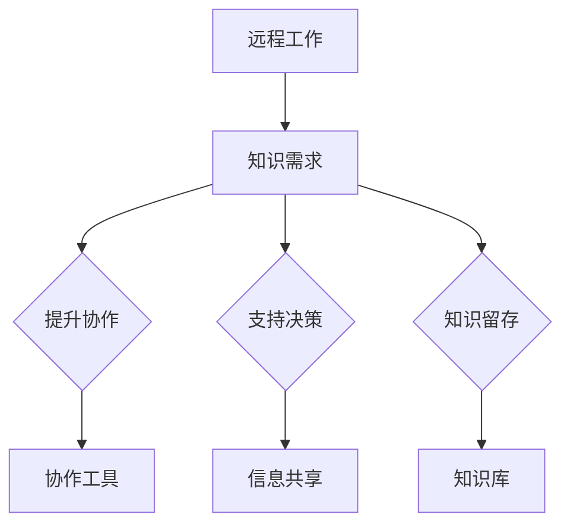

                 

在当今数字化时代，远程工作已成为许多企业和组织的主流模式。这不仅带来了便捷和灵活性，也为员工提供了更多自我管理的机会。然而，远程工作也带来了知识管理的挑战，因为传统的面对面交流和文化传递方式不再适用。本文将探讨知识管理在远程工作中的重要性，并提供一些策略和实践，以帮助团队在远程环境中有效管理知识。

## 关键词

- 远程工作
- 知识管理
- 协作工具
- 数字化转型
- 知识共享
- 员工培训

## 摘要

本文旨在分析远程工作对知识管理的影响，并探讨如何通过有效的知识管理策略提高远程团队的协作效率和工作质量。文章首先介绍了远程工作的背景和现状，然后详细阐述了知识管理的核心概念，包括其定义、重要性以及远程工作环境下的特定挑战。接着，文章提供了一系列实践策略，如使用协作工具、制定知识共享协议和提供持续培训等，以帮助远程团队克服这些挑战。最后，文章讨论了知识管理在远程工作中的未来发展趋势，并提出了相关建议。

## 1. 背景介绍

### 远程工作的兴起

远程工作并不是一个新鲜的概念，但它的普及和发展却是在过去十年里迅速发生的。这一变化得益于技术的进步，特别是互联网和移动设备的广泛应用。根据一项调查，全球约有30%的员工在过去一年中至少有一部分时间是在远程工作的。这种趋势不仅影响了传统的办公模式，也对企业文化和员工管理提出了新的要求。

### 远程工作的挑战

远程工作虽然带来了许多好处，如提高员工的工作满意度和灵活性，但也带来了一系列挑战，尤其是在知识管理方面。首先，缺乏面对面的交流可能导致信息传递不畅和误解。其次，远程团队的文化传递和团队建设变得更加困难。此外，知识分散在不同的个人设备和工作区域中，增加了知识丢失的风险。

### 远程工作的优势

尽管存在挑战，远程工作也有许多明显的优势。首先，它可以减少企业的运营成本，如办公空间和通勤成本。其次，远程工作可以吸引和保留顶尖人才，因为许多员工更愿意在灵活的工作环境中工作。此外，远程工作还提高了员工的满意度和工作效率，因为员工可以更好地平衡工作和生活。

## 2. 核心概念与联系

### 知识管理的定义

知识管理是一种系统的方法，用于识别、创造、组织和利用知识，以支持组织的决策制定和问题解决。知识管理不仅包括结构化数据，如文档和数据库，还包括非结构化数据，如电子邮件和社交媒体帖子。

### 远程工作与知识管理的联系

远程工作与知识管理紧密相关。知识管理在远程工作中的重要性体现在以下几个方面：

1. **提高协作效率**：远程团队需要高效的知识共享和协作工具，以保持沟通和协同。
2. **支持决策制定**：远程工作环境中，快速访问正确的知识和信息对于做出明智的决策至关重要。
3. **知识留存**：在远程工作环境中，确保知识不会因为员工的离职或设备故障而丢失。

### Mermaid 流程图



## 3. 核心算法原理 & 具体操作步骤

### 3.1 算法原理概述

知识管理在远程工作中的核心算法原理包括信息收集、知识组织、知识共享和知识应用。以下是这些步骤的简要概述：

1. **信息收集**：通过各种渠道收集与工作相关的信息，包括文档、邮件、社交媒体等。
2. **知识组织**：对收集到的信息进行分类、整理和存储，以便于快速检索和共享。
3. **知识共享**：通过协作工具和平台，促进团队成员之间的知识交流。
4. **知识应用**：将共享的知识应用到实际工作中，以提高工作效率和质量。

### 3.2 算法步骤详解

1. **信息收集**：
   - 使用自动化工具收集电子邮件和社交媒体上的信息。
   - 定期进行文献搜索和行业报告的阅读，以获取最新的行业动态。

2. **知识组织**：
   - 使用文档管理软件，如Google文档或Confluence，对文档进行分类和版本控制。
   - 建立一个内部知识库，用于存储和共享重要的信息和文档。

3. **知识共享**：
   - 定期组织线上会议，讨论和分享工作中的知识和经验。
   - 使用聊天工具和协作平台，如Slack或Microsoft Teams，实时交流和共享信息。

4. **知识应用**：
   - 在项目或任务中，充分利用共享的知识，以提高工作效率。
   - 鼓励团队成员在遇到问题时，首先查找知识库中的答案，而不是重新创造知识。

### 3.3 算法优缺点

**优点**：
- 提高信息传递的效率，减少沟通成本。
- 促进知识的积累和传承，减少知识丢失的风险。
- 增强团队协作，提高整体工作效率。

**缺点**：
- 需要投入时间和资源进行知识管理和共享工具的搭建和维护。
- 部分团队成员可能对知识共享工具的使用不熟悉，影响效果。

### 3.4 算法应用领域

知识管理在远程工作中的算法原理和应用步骤可以广泛应用于各个领域，包括软件开发、市场营销、客户服务、项目管理等。特别是在需要高度协作和知识共享的远程团队中，这些算法原理和步骤尤为重要。

## 4. 数学模型和公式 & 详细讲解 & 举例说明

### 4.1 数学模型构建

在知识管理中，一个关键的数学模型是贝叶斯网络（Bayesian Network），它用于表示不确定性和推理。贝叶斯网络由一组随机变量及其条件概率分布组成，能够有效地处理复杂的关系和依赖。

### 4.2 公式推导过程

贝叶斯网络的公式推导基于条件概率分布。给定一个随机变量集 \(X = \{X_1, X_2, ..., X_n\}\)，每个变量 \(X_i\) 都可以表示为其父节点集的条件概率分布：

\[ P(X_i | X_{\text{parents}(i)}) = \prod_{j \in \text{parents}(i)} P(X_j | X_{\text{parents}(i) \setminus j}) \]

其中，\(\text{parents}(i)\) 是变量 \(X_i\) 的父节点集。

### 4.3 案例分析与讲解

假设我们有一个简单的贝叶斯网络，其中有两个变量 \(A\) 和 \(B\)，其中 \(A\) 是父节点，\(B\) 是子节点：

1. **条件概率分布**：
   - \( P(A) = 0.5 \)
   - \( P(B|A) = 0.8 \)
   - \( P(B|\neg A) = 0.2 \)

2. **推理**：
   - 我们需要计算 \( P(B) \)，可以使用全概率公式：
   \[ P(B) = P(B|A)P(A) + P(B|\neg A)P(\neg A) \]
   - 代入数值：
   \[ P(B) = (0.8 \times 0.5) + (0.2 \times 0.5) = 0.5 \]

这意味着 \( B \) 发生的概率是 0.5，与 \( A \) 无关。

### 4.4 数学模型应用

在远程知识管理中，贝叶斯网络可以用于预测团队成员的知识需求和提供个性化的培训建议。例如，如果系统知道某个团队成员在项目 A 中有很高的知识需求，它可以利用贝叶斯网络预测这个团队成员在类似项目 B 中的知识需求，并提供相应的培训材料。

## 5. 项目实践：代码实例和详细解释说明

### 5.1 开发环境搭建

为了演示知识管理在远程工作中的应用，我们将使用一个简单的 Python 脚本，该脚本将用于收集、整理和共享项目相关的知识。以下是开发环境搭建的步骤：

1. 安装 Python 3.8 或更高版本。
2. 安装必要的库，如 Flask（用于构建 Web 应用）和 Pandas（用于数据处理）。
3. 创建一个名为 `knowledge_management` 的虚拟环境，并激活它。

### 5.2 源代码详细实现

下面是一个简单的知识管理系统的代码示例：

```python
from flask import Flask, request, jsonify
import pandas as pd

app = Flask(__name__)

# 知识库，存储项目相关的知识条目
knowledge_base = pd.DataFrame({
    'topic': [],
    'description': [],
    'source': [],
    'created_by': [],
    'date': []
})

@app.route('/add_knowledge', methods=['POST'])
def add_knowledge():
    data = request.json
    knowledge_base = knowledge_base.append(data, ignore_index=True)
    return jsonify({'status': 'success', 'message': 'Knowledge added successfully.'})

@app.route('/get_knowledge', methods=['GET'])
def get_knowledge():
    topic = request.args.get('topic')
    filtered_knowledge = knowledge_base[knowledge_base['topic'] == topic]
    return jsonify(filtered_knowledge.to_dict('records'))

if __name__ == '__main__':
    app.run(debug=True)
```

### 5.3 代码解读与分析

这个简单的知识管理系统具有两个主要功能：

1. **添加知识**：通过 `/add_knowledge` 接口接收 POST 请求，将新的知识条目添加到知识库中。
2. **获取知识**：通过 `/get_knowledge` 接口接收 GET 请求，根据指定的主题查询知识库中的条目。

知识库使用 Pandas DataFrame 进行管理，这提供了强大的数据操作和分析功能。在真实的应用场景中，知识库可能会存储在数据库中，并且可能包含更多的字段和复杂的关系。

### 5.4 运行结果展示

以下是运行结果的示例：

- **添加知识**：
  ```bash
  curl -X POST -H "Content-Type: application/json" -d '{"topic": "项目管理", "description": "项目进度跟踪的方法", "source": "敏捷实践指南", "created_by": "张三", "date": "2023-10-01"}' http://localhost:5000/add_knowledge
  ```
  返回结果：
  ```json
  {"status": "success", "message": "Knowledge added successfully."}
  ```

- **获取知识**：
  ```bash
  curl "http://localhost:5000/get_knowledge?topic=项目管理"
  ```
  返回结果：
  ```json
  [{"topic": "项目管理", "description": "项目进度跟踪的方法", "source": "敏捷实践指南", "created_by": "张三", "date": "2023-10-01"}]
  ```

通过这个简单的示例，我们可以看到如何使用代码实现一个基本的知识管理系统，它为远程团队提供了一个方便的方式来共享和检索项目相关的知识。

## 6. 实际应用场景

### 远程团队协作

在远程团队中，知识管理的关键在于确保所有成员都能够轻松访问所需的信息。使用协作工具如 Slack、Microsoft Teams 或 Google Workspace，团队成员可以实时共享文件、讨论和协作。例如，在软件开发项目中，团队成员可以使用 Git 存储库来管理代码，并使用 JIRA 或 Trello 等工具来跟踪任务和问题。

### 项目管理

知识管理在项目管理中尤为重要。通过建立一个集中的知识库，项目经理可以记录项目的关键里程碑、风险和决策过程。这有助于确保新加入的项目成员能够快速了解项目的背景和当前状态。此外，使用自动化工具来收集和分析项目数据，可以提高项目的透明度和决策质量。

### 客户服务

在远程客户服务团队中，知识管理可以帮助提高响应速度和质量。通过建立一个知识库，客服代表可以快速查找常见问题的解决方案和最佳实践。此外，使用聊天机器人和自动化工具可以进一步优化客户服务流程，提高效率和客户满意度。

### 培训与发展

知识管理在员工培训和职业发展中起着关键作用。通过建立一个学习管理系统（LMS），企业可以为员工提供在线课程、培训材料和认证机会。这有助于确保员工不断更新知识和技能，以适应不断变化的工作需求。

## 7. 工具和资源推荐

### 7.1 学习资源推荐

- 《知识管理：理论与实践》
- 《远程工作的艺术：如何在远程团队中保持高效和协作》
- 《敏捷项目管理：实践指南》

### 7.2 开发工具推荐

- Git：版本控制系统，用于管理代码和协作。
- Confluence：团队协作和知识管理平台。
- Slack：实时通讯和协作工具。
- JIRA：项目管理工具，用于任务跟踪和敏捷开发。

### 7.3 相关论文推荐

- "Knowledge Management in Global Virtual Teams: A Literature Review"
- "The Impact of Knowledge Management on Organizational Performance in Remote Work Environments"
- "Practical Strategies for Implementing Knowledge Management in Remote Teams"

## 8. 总结：未来发展趋势与挑战

### 8.1 研究成果总结

知识管理在远程工作中的重要性已经得到了广泛认可。通过有效的知识管理策略，远程团队可以更有效地共享和利用知识，提高协作效率和项目质量。研究成果表明，知识管理工具和平台的使用对于远程团队的成功至关重要。

### 8.2 未来发展趋势

未来，知识管理在远程工作中的发展趋势将包括：

1. **人工智能和机器学习的应用**：利用人工智能技术，自动化知识收集、整理和共享过程，提高知识管理的效率。
2. **虚拟现实（VR）和增强现实（AR）**：通过 VR 和 AR 技术提供更直观的知识共享和协作体验。
3. **区块链技术**：利用区块链技术确保知识管理系统的透明度和安全性。

### 8.3 面临的挑战

尽管知识管理在远程工作中具有巨大潜力，但也面临一些挑战：

1. **技术适应性**：确保所有团队成员都能熟练使用知识管理工具。
2. **文化适应**：建立适合远程工作的知识管理文化和规范。
3. **知识质量**：确保知识库中的知识是准确和可靠的。

### 8.4 研究展望

未来的研究应关注如何更好地整合人工智能技术、区块链技术和虚拟现实技术，以提高知识管理的效率和效果。此外，应探索不同行业和领域的知识管理最佳实践，以提供更具体的指导和建议。

## 9. 附录：常见问题与解答

### 问题 1：如何确保知识库中的知识质量？

解答：确保知识库中的知识质量需要以下几个步骤：

1. **建立审查机制**：对添加到知识库中的内容进行审查，确保其准确性和可靠性。
2. **定期更新**：定期检查和更新知识库中的内容，确保其与当前的项目需求和工作环境保持一致。
3. **用户反馈**：鼓励团队成员提供反馈，指出知识库中的错误或不准确之处，以便及时修正。

### 问题 2：如何激励团队成员参与知识共享？

解答：以下是一些激励团队成员参与知识共享的策略：

1. **奖励制度**：设立知识共享奖项，表彰那些积极贡献知识的团队成员。
2. **团队建设**：通过团队活动和协作项目，增强团队成员之间的互动和信任。
3. **透明度**：确保知识共享的过程是公开和透明的，让团队成员看到他们的贡献是如何被利用的。

### 问题 3：如何处理团队成员的知识流失？

解答：以下是一些处理团队成员知识流失的策略：

1. **知识文档化**：确保团队成员的知识和经验被记录下来，形成文档化的知识库。
2. **导师制度**：为新员工安排经验丰富的导师，帮助他们快速融入团队和工作环境。
3. **员工离职交接**：在员工离职前，确保其知识和工作任务得到顺利交接。

---

# 结束语

作者：禅与计算机程序设计艺术 / Zen and the Art of Computer Programming

本文探讨了知识管理在远程工作中的重要性，并提出了有效的知识管理策略和实践方法。在远程工作环境中，知识管理不仅有助于提高团队协作效率，还能确保知识的留存和传承。通过使用协作工具、建立知识库和提供持续培训，远程团队可以更好地应对知识管理的挑战，实现高效的工作模式。随着技术的不断进步，知识管理在远程工作中的重要性将越来越凸显，未来的研究应重点关注如何进一步优化知识管理策略，以适应不断变化的工作环境。

