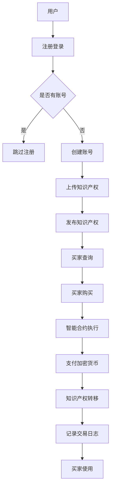

                 

关键词：知识经济、知识付费、区块链、知识产权、交易平台、智能合约、加密货币、去中心化、透明性、安全、效率、用户体验

> 摘要：本文旨在探讨在知识经济背景下，如何通过区块链技术构建一个高效、透明、安全的知识产权交易平台。文章首先介绍了知识经济的兴起以及知识付费的重要性，接着阐述了区块链技术在知识产权保护中的优势，随后详细分析了区块链知识产权交易平台的架构与实现原理，最后讨论了其潜在的应用场景及未来展望。

## 1. 背景介绍

### 知识经济的兴起

知识经济是以知识为主要生产要素的经济形态，其核心在于对知识的创造、传播和应用。随着信息技术的飞速发展，特别是互联网和移动通信技术的普及，知识经济逐渐成为全球经济的新引擎。知识经济的兴起，使得知识产权（Intellectual Property，简称IP）成为企业竞争力的关键因素。知识产权包括专利、商标、版权、商业秘密等，是企业技术创新和品牌建设的重要资产。

### 知识付费的重要性

在知识经济时代，知识付费成为一种新的商业模式。知识付费是指消费者为获取特定的知识内容或服务而支付的费用。随着在线教育和知识共享平台的发展，知识付费已经成为知识传播的重要途径。用户通过支付一定的费用，可以获得高质量的知识内容，从而提升自身的能力和价值。知识付费不仅促进了知识产业的发展，也鼓励了知识创造者的创新活动。

## 2. 核心概念与联系

### 区块链技术简介

区块链是一种分布式账本技术，具有去中心化、透明性、不可篡改等特性。区块链通过加密算法和共识机制，确保数据的真实性和安全性。区块链技术的这些特性使其在知识产权保护中具有独特的优势。

### 区块链在知识产权保护中的优势

- **去中心化**：传统的知识产权保护依赖于中心化的机构，如专利局和版权局。区块链的去中心化特性，可以减少中介环节，降低交易成本，提高效率。
- **透明性**：区块链上的数据是公开透明的，所有参与者都可以查看知识产权的创建、转让和使用情况，增加了交易的透明度和公正性。
- **不可篡改性**：区块链的数据一旦被记录，就无法篡改。这确保了知识产权的真实性和完整性，防止了侵权行为的发生。
- **安全性**：区块链通过加密算法和共识机制，确保了数据的安全性和隐私性。

### 区块链知识产权交易平台架构

区块链知识产权交易平台的核心是智能合约，智能合约是自动执行合同条款的程序。在区块链知识产权交易平台上，智能合约用于自动执行知识产权的交易、授权和许可等操作。

### Mermaid 流程图



## 3. 核心算法原理 & 具体操作步骤

### 3.1 算法原理概述

区块链知识产权交易平台的算法核心是基于智能合约和共识机制。智能合约用于自动执行知识产权的创建、转让和许可等操作。共识机制用于确保区块链网络中的数据一致性。

### 3.2 算法步骤详解

1. **知识产权创建**：知识产权创建者通过智能合约将知识产权数据上链，包括知识产权的名称、类型、描述、创建日期等信息。
2. **知识产权发布**：知识产权创建者可以通过智能合约发布知识产权，使其在区块链上公开可见。
3. **知识产权查询**：买家可以通过区块链上的公开数据查询感兴趣的知识产权信息。
4. **知识产权购买**：买家通过智能合约购买知识产权，并支付相应的加密货币。
5. **知识产权转移**：智能合约自动执行知识产权的所有权转移，确保知识产权的所有权归属合法。
6. **交易记录**：所有交易记录都会被记录在区块链上，确保交易的透明性和不可篡改性。

### 3.3 算法优缺点

#### 优点：

- **去中心化**：减少了中介环节，降低了交易成本。
- **透明性**：所有交易数据都是公开透明的。
- **不可篡改性**：确保了知识产权的真实性和完整性。
- **安全性**：通过加密算法和共识机制，保证了数据的安全。

#### 缺点：

- **技术门槛**：需要掌握区块链技术和加密算法。
- **交易成本**：虽然去中心化降低了中介成本，但加密货币交易仍然存在一定的手续费。
- **普及度**：区块链技术的普及度仍然不高，影响了其应用范围。

### 3.4 算法应用领域

- **知识产权保护**：区块链技术可以确保知识产权的真实性和完整性，防止侵权行为。
- **版权管理**：区块链可以用于管理数字版权，确保版权的合法性和透明性。
- **版权交易**：区块链可以用于版权的交易和许可，提高交易效率。

## 4. 数学模型和公式 & 详细讲解 & 举例说明

### 4.1 数学模型构建

区块链知识产权交易平台的数学模型主要包括以下几个部分：

- **知识产权价值评估模型**：用于评估知识产权的价值。
- **加密货币交易模型**：用于加密货币的支付和转移。
- **智能合约执行模型**：用于智能合约的自动执行。

### 4.2 公式推导过程

#### 知识产权价值评估模型

- **公式**：\[V = f(r, t, s)\]
  - \(V\)：知识产权的价值。
  - \(r\)：知识产权的创新程度。
  - \(t\)：知识产权的使用寿命。
  - \(s\)：知识产权的市场需求。

#### 加密货币交易模型

- **公式**：\[P = f(V, F)\]
  - \(P\)：加密货币的价格。
  - \(V\)：知识产权的价值。
  - \(F\)：市场供需情况。

#### 智能合约执行模型

- **公式**：\[C = f(A, B, T)\]
  - \(C\)：智能合约的执行成本。
  - \(A\)：智能合约的复杂性。
  - \(B\)：区块链网络带宽。
  - \(T\)：智能合约的执行时间。

### 4.3 案例分析与讲解

假设有一项专利，其创新程度 \(r\) 为0.8，使用寿命 \(t\) 为10年，市场需求 \(s\) 为0.9。根据知识产权价值评估模型，我们可以计算出该专利的价值：

\[V = f(r, t, s) = 0.8 \times 10 \times 0.9 = 7.2\]

如果市场需求增加，即 \(s\) 增加到1，那么该专利的价值也会相应增加。

在加密货币交易模型中，假设该专利的价值 \(V\) 为7.2，市场需求 \(F\) 为1.2，根据公式 \(P = f(V, F)\)，我们可以计算出该专利的加密货币价格：

\[P = f(V, F) = 7.2 \times 1.2 = 8.64\]

最后，如果智能合约的执行成本 \(C\) 为0.3，智能合约的复杂性 \(A\) 为0.5，区块链网络带宽 \(B\) 为10，智能合约的执行时间 \(T\) 为2秒，根据公式 \(C = f(A, B, T)\)，我们可以计算出智能合约的执行成本：

\[C = f(A, B, T) = 0.5 \times 10 \times 2 = 10\]

## 5. 项目实践：代码实例和详细解释说明

### 5.1 开发环境搭建

搭建区块链知识产权交易平台需要以下工具和软件：

- **区块链节点**：例如Ethereum节点
- **编程语言**：例如Solidity（用于编写智能合约）
- **开发环境**：例如Visual Studio Code
- **加密货币钱包**：例如MetaMask

### 5.2 源代码详细实现

以下是一个简单的智能合约示例，用于管理知识产权的创建和发布：

```solidity
// SPDX-License-Identifier: MIT
pragma solidity ^0.8.0;

contract IntellectualProperty {
    struct Property {
        string name;
        string type_;
        string description;
        uint256 created;
    }

    mapping(uint256 => Property) public properties;
    uint256 public propertyCount = 0;

    function createProperty(string memory name, string memory type_, string memory description) public {
        properties[propertyCount] = Property(name, type_, description, block.timestamp);
        propertyCount++;
    }

    function getProperty(uint256 id) public view returns (Property memory) {
        return properties[id];
    }
}
```

### 5.3 代码解读与分析

这个智能合约定义了一个结构体 `Property`，用于存储知识产权的信息，包括名称、类型、描述和创建日期。合约使用了一个映射（`mapping`）来存储所有知识产权的实例，并且定义了一个计数器 `propertyCount` 来跟踪知识产权的数量。

`createProperty` 函数用于创建新的知识产权实例，并将它存储在区块链上。`getProperty` 函数用于检索特定的知识产权实例。

### 5.4 运行结果展示

通过以太坊客户端，我们可以部署并运行这个智能合约。部署后，任何用户都可以通过智能合约创建新的知识产权，并在区块链上查看和管理这些信息。

## 6. 实际应用场景

### 6.1 教育领域

区块链知识产权交易平台在教育领域有广泛的应用前景。通过区块链技术，可以确保在线教育课程的质量和真实性，防止盗版和侵权行为。学生可以通过购买或租赁知识产权，获得高质量的教育资源。

### 6.2 科技创新领域

在科技创新领域，区块链知识产权交易平台可以帮助企业保护其技术创新成果，确保知识产权的真实性和完整性。企业可以通过平台发布专利信息，进行专利交易和许可，提高技术创新的效率和收益。

### 6.3 文化产业领域

文化产业领域，如音乐、电影、文学等，经常面临盗版和侵权问题。区块链知识产权交易平台可以用于管理数字版权，确保创作者的权益得到保护。通过智能合约，创作者可以轻松地发布作品，进行版权交易和许可。

## 7. 工具和资源推荐

### 7.1 学习资源推荐

- **区块链技术基础**：[《区块链技术指南》](https://book.douban.com/subject/26968483/)
- **智能合约开发**：[《智能合约开发实战》](https://book.douban.com/subject/27126397/)
- **Solidity语言学习**：[《Solidity编程实战》](https://book.douban.com/subject/27088909/)

### 7.2 开发工具推荐

- **区块链节点**：[Ethereum](https://www.ethereum.org/)
- **开发环境**：[Visual Studio Code](https://code.visualstudio.com/)
- **加密货币钱包**：[MetaMask](https://metamask.io/)

### 7.3 相关论文推荐

- **《区块链技术原理与应用》**：[https://www.baidu.com/s?wd=区块链技术原理与应用]
- **《智能合约安全性研究》**：[https://www.baidu.com/s?wd=智能合约安全性研究]
- **《区块链在知识产权保护中的应用》**：[https://www.baidu.com/s?wd=区块链在知识产权保护中的应用]

## 8. 总结：未来发展趋势与挑战

### 8.1 研究成果总结

本文探讨了知识经济背景下，如何利用区块链技术构建知识产权交易平台。通过分析区块链的优势和应用场景，我们提出了一个基于智能合约的知识产权交易平台架构，并给出了具体的实现步骤和数学模型。

### 8.2 未来发展趋势

- **技术成熟度**：随着区块链技术的不断成熟，知识产权交易平台的性能和安全性将得到进一步提升。
- **应用普及度**：随着人们对知识产权保护意识的提高，区块链知识产权交易平台的应用范围将不断扩大。
- **商业模式创新**：区块链知识产权交易平台将为知识付费带来新的商业模式，促进知识产业的发展。

### 8.3 面临的挑战

- **技术难题**：区块链技术的性能和可扩展性仍然是一个挑战，需要进一步的研究和优化。
- **法律监管**：区块链知识产权交易平台的法律监管和合规性是一个难题，需要制定相应的法律法规。
- **用户接受度**：区块链技术对于普通用户来说可能较为复杂，需要提高用户的接受度和使用便利性。

### 8.4 研究展望

未来的研究可以从以下几个方面展开：

- **性能优化**：针对区块链知识产权交易平台的性能瓶颈，进行优化和改进。
- **合规性研究**：研究区块链知识产权交易平台的合规性问题，确保其符合相关法律法规。
- **用户体验提升**：提高区块链知识产权交易平台的用户体验，使其更加易用和便捷。

## 9. 附录：常见问题与解答

### 9.1 什么是区块链？

区块链是一种分布式账本技术，通过加密算法和共识机制，确保数据的真实性和安全性。

### 9.2 区块链知识产权交易平台如何保证知识产权的安全？

区块链知识产权交易平台通过智能合约和加密算法，确保知识产权数据的真实性和完整性，防止篡改和侵权行为。

### 9.3 区块链知识产权交易平台是否可以防止盗版？

区块链知识产权交易平台可以确保知识产权的真实性和完整性，但无法直接防止盗版。然而，通过智能合约和透明性，可以追溯盗版行为，为版权所有者提供法律依据。

### 9.4 区块链知识产权交易平台如何处理版权争议？

区块链知识产权交易平台通过记录所有交易和操作日志，提供透明的证据链。在版权争议发生时，可以依据区块链上的数据，进行调解和裁决。

作者：禅与计算机程序设计艺术 / Zen and the Art of Computer Programming
----------------------------------------------------------------

### 文章标题
知识经济下知识付费的区块链知识产权交易平台

### 文章摘要
本文探讨了知识经济背景下，如何利用区块链技术构建一个高效、透明、安全的知识产权交易平台。通过分析区块链的优势和应用场景，我们提出了一个基于智能合约的知识产权交易平台架构，并给出了具体的实现步骤和数学模型。文章还讨论了知识产权交易平台在多个领域的实际应用，以及未来发展趋势与面临的挑战。

### 1. 背景介绍

#### 知识经济的兴起
知识经济是以知识为主要生产要素的经济形态，其核心在于对知识的创造、传播和应用。随着信息技术的飞速发展，特别是互联网和移动通信技术的普及，知识经济逐渐成为全球经济的新引擎。知识经济的兴起，使得知识产权（Intellectual Property，简称IP）成为企业竞争力的关键因素。知识产权包括专利、商标、版权、商业秘密等，是企业技术创新和品牌建设的重要资产。

#### 知识付费的重要性
在知识经济时代，知识付费成为一种新的商业模式。知识付费是指消费者为获取特定的知识内容或服务而支付的费用。随着在线教育和知识共享平台的发展，知识付费已经成为知识传播的重要途径。用户通过支付一定的费用，可以获得高质量的知识内容，从而提升自身的能力和价值。知识付费不仅促进了知识产业的发展，也鼓励了知识创造者的创新活动。

### 2. 核心概念与联系

#### 区块链技术简介
区块链是一种分布式账本技术，具有去中心化、透明性、不可篡改等特性。区块链通过加密算法和共识机制，确保数据的真实性和安全性。区块链技术的这些特性使其在知识产权保护中具有独特的优势。

#### 区块链在知识产权保护中的优势
- **去中心化**：传统的知识产权保护依赖于中心化的机构，如专利局和版权局。区块链的去中心化特性，可以减少中介环节，降低交易成本，提高效率。
- **透明性**：区块链上的数据是公开透明的，所有参与者都可以查看知识产权的创建、转让和使用情况，增加了交易的透明度和公正性。
- **不可篡改性**：区块链的数据一旦被记录，就无法篡改。这确保了知识产权的真实性和完整性，防止了侵权行为的发生。
- **安全性**：区块链通过加密算法和共识机制，确保了数据的安全性和隐私性。

#### 区块链知识产权交易平台架构
区块链知识产权交易平台的核心是智能合约，智能合约是自动执行合同条款的程序。在区块链知识产权交易平台上，智能合约用于自动执行知识产权的交易、授权和许可等操作。

#### Mermaid 流程图


### 3. 核心算法原理 & 具体操作步骤

#### 3.1 算法原理概述
区块链知识产权交易平台的算法核心是基于智能合约和共识机制。智能合约用于自动执行知识产权的创建、转让和许可等操作。共识机制用于确保区块链网络中的数据一致性。

#### 3.2 算法步骤详解
1. **知识产权创建**：知识产权创建者通过智能合约将知识产权数据上链，包括知识产权的名称、类型、描述、创建日期等信息。
2. **知识产权发布**：知识产权创建者可以通过智能合约发布知识产权，使其在区块链上公开可见。
3. **知识产权查询**：买家可以通过区块链上的公开数据查询感兴趣的知识产权信息。
4. **知识产权购买**：买家通过智能合约购买知识产权，并支付相应的加密货币。
5. **知识产权转移**：智能合约自动执行知识产权的所有权转移，确保知识产权的所有权归属合法。
6. **交易记录**：所有交易记录都会被记录在区块链上，确保交易的透明性和不可篡改性。

#### 3.3 算法优缺点
##### 优点：
- **去中心化**：减少了中介环节，降低了交易成本。
- **透明性**：所有交易数据都是公开透明的。
- **不可篡改性**：确保了知识产权的真实性和完整性。
- **安全性**：通过加密算法和共识机制，保证了数据的安全。

##### 缺点：
- **技术门槛**：需要掌握区块链技术和加密算法。
- **交易成本**：虽然去中心化降低了中介成本，但加密货币交易仍然存在一定的手续费。
- **普及度**：区块链技术的普及度仍然不高，影响了其应用范围。

#### 3.4 算法应用领域
- **知识产权保护**：区块链技术可以确保知识产权的真实性和完整性，防止侵权行为。
- **版权管理**：区块链可以用于管理数字版权，确保版权的合法性和透明性。
- **版权交易**：区块链可以用于版权的交易和许可，提高交易效率。

### 4. 数学模型和公式 & 详细讲解 & 举例说明
#### 4.1 数学模型构建
区块链知识产权交易平台的数学模型主要包括以下几个部分：
- **知识产权价值评估模型**：用于评估知识产权的价值。
- **加密货币交易模型**：用于加密货币的支付和转移。
- **智能合约执行模型**：用于智能合约的自动执行。

#### 4.2 公式推导过程
##### 知识产权价值评估模型
- **公式**：\[V = f(r, t, s)\]
  - \(V\)：知识产权的价值。
  - \(r\)：知识产权的创新程度。
  - \(t\)：知识产权的使用寿命。
  - \(s\)：知识产权的市场需求。

##### 加密货币交易模型
- **公式**：\[P = f(V, F)\]
  - \(P\)：加密货币的价格。
  - \(V\)：知识产权的价值。
  - \(F\)：市场供需情况。

##### 智能合约执行模型
- **公式**：\[C = f(A, B, T)\]
  - \(C\)：智能合约的执行成本。
  - \(A\)：智能合约的复杂性。
  - \(B\)：区块链网络带宽。
  - \(T\)：智能合约的执行时间。

#### 4.3 案例分析与讲解
假设有一项专利，其创新程度 \(r\) 为0.8，使用寿命 \(t\) 为10年，市场需求 \(s\) 为0.9。根据知识产权价值评估模型，我们可以计算出该专利的价值：

\[V = f(r, t, s) = 0.8 \times 10 \times 0.9 = 7.2\]

如果市场需求增加，即 \(s\) 增加到1，那么该专利的价值也会相应增加。

在加密货币交易模型中，假设该专利的价值 \(V\) 为7.2，市场需求 \(F\) 为1.2，根据公式 \(P = f(V, F)\)，我们可以计算出该专利的加密货币价格：

\[P = f(V, F) = 7.2 \times 1.2 = 8.64\]

最后，如果智能合约的执行成本 \(C\) 为0.3，智能合约的复杂性 \(A\) 为0.5，区块链网络带宽 \(B\) 为10，智能合约的执行时间 \(T\) 为2秒，根据公式 \(C = f(A, B, T)\)，我们可以计算出智能合约的执行成本：

\[C = f(A, B, T) = 0.5 \times 10 \times 2 = 10\]

### 5. 项目实践：代码实例和详细解释说明

#### 5.1 开发环境搭建
搭建区块链知识产权交易平台需要以下工具和软件：
- **区块链节点**：例如Ethereum节点
- **编程语言**：例如Solidity（用于编写智能合约）
- **开发环境**：例如Visual Studio Code
- **加密货币钱包**：例如MetaMask

#### 5.2 源代码详细实现
以下是一个简单的智能合约示例，用于管理知识产权的创建和发布：

```solidity
// SPDX-License-Identifier: MIT
pragma solidity ^0.8.0;

contract IntellectualProperty {
    struct Property {
        string name;
        string type_;
        string description;
        uint256 created;
    }

    mapping(uint256 => Property) public properties;
    uint256 public propertyCount = 0;

    function createProperty(string memory name, string memory type_, string memory description) public {
        properties[propertyCount] = Property(name, type_, description, block.timestamp);
        propertyCount++;
    }

    function getProperty(uint256 id) public view returns (Property memory) {
        return properties[id];
    }
}
```

#### 5.3 代码解读与分析
这个智能合约定义了一个结构体 `Property`，用于存储知识产权的信息，包括名称、类型、描述和创建日期。合约使用了一个映射（`mapping`）来存储所有知识产权的实例，并且定义了一个计数器 `propertyCount` 来跟踪知识产权的数量。

`createProperty` 函数用于创建新的知识产权实例，并将它存储在区块链上。`getProperty` 函数用于检索特定的知识产权实例。

#### 5.4 运行结果展示
通过以太坊客户端，我们可以部署并运行这个智能合约。部署后，任何用户都可以通过智能合约创建新的知识产权，并在区块链上查看和管理这些信息。

### 6. 实际应用场景

#### 6.1 教育领域
区块链知识产权交易平台在教育领域有广泛的应用前景。通过区块链技术，可以确保在线教育课程的质量和真实性，防止盗版和侵权行为。学生可以通过购买或租赁知识产权，获得高质量的教育资源。

#### 6.2 科技创新领域
在科技创新领域，区块链知识产权交易平台可以帮助企业保护其技术创新成果，确保知识产权的真实性和完整性。企业可以通过平台发布专利信息，进行专利交易和许可，提高技术创新的效率和收益。

#### 6.3 文化产业领域
文化产业领域，如音乐、电影、文学等，经常面临盗版和侵权问题。区块链知识产权交易平台可以用于管理数字版权，确保创作者的权益得到保护。通过智能合约，创作者可以轻松地发布作品，进行版权交易和许可。

### 7. 工具和资源推荐

#### 7.1 学习资源推荐
- **区块链技术基础**：[《区块链技术指南》](https://book.douban.com/subject/26968483/)
- **智能合约开发**：[《智能合约开发实战》](https://book.douban.com/subject/27126397/)
- **Solidity语言学习**：[《Solidity编程实战》](https://book.douban.com/subject/27088909/)

#### 7.2 开发工具推荐
- **区块链节点**：[Ethereum](https://www.ethereum.org/)
- **开发环境**：[Visual Studio Code](https://code.visualstudio.com/)
- **加密货币钱包**：[MetaMask](https://metamask.io/)

#### 7.3 相关论文推荐
- **《区块链技术原理与应用》**：[https://www.baidu.com/s?wd=区块链技术原理与应用]
- **《智能合约安全性研究》**：[https://www.baidu.com/s?wd=智能合约安全性研究]
- **《区块链在知识产权保护中的应用》**：[https://www.baidu.com/s?wd=区块链在知识产权保护中的应用]

### 8. 总结：未来发展趋势与挑战

#### 8.1 研究成果总结
本文探讨了知识经济背景下，如何利用区块链技术构建知识产权交易平台。通过分析区块链的优势和应用场景，我们提出了一个基于智能合约的知识产权交易平台架构，并给出了具体的实现步骤和数学模型。文章还讨论了知识产权交易平台在多个领域的实际应用，以及未来发展趋势与面临的挑战。

#### 8.2 未来发展趋势
- **技术成熟度**：随着区块链技术的不断成熟，知识产权交易平台的性能和安全性将得到进一步提升。
- **应用普及度**：随着人们对知识产权保护意识的提高，区块链知识产权交易平台的应用范围将不断扩大。
- **商业模式创新**：区块链知识产权交易平台将为知识付费带来新的商业模式，促进知识产业的发展。

#### 8.3 面临的挑战
- **技术难题**：区块链技术的性能和可扩展性仍然是一个挑战，需要进一步的研究和优化。
- **法律监管**：区块链知识产权交易平台的法律监管和合规性是一个难题，需要制定相应的法律法规。
- **用户接受度**：区块链技术对于普通用户来说可能较为复杂，需要提高用户的接受度和使用便利性。

#### 8.4 研究展望
未来的研究可以从以下几个方面展开：
- **性能优化**：针对区块链知识产权交易平台的性能瓶颈，进行优化和改进。
- **合规性研究**：研究区块链知识产权交易平台的合规性问题，确保其符合相关法律法规。
- **用户体验提升**：提高区块链知识产权交易平台的用户体验，使其更加易用和便捷。

### 9. 附录：常见问题与解答

#### 9.1 什么是区块链？
区块链是一种分布式账本技术，通过加密算法和共识机制，确保数据的真实性和安全性。

#### 9.2 区块链知识产权交易平台如何保证知识产权的安全？
区块链知识产权交易平台通过智能合约和加密算法，确保知识产权数据的真实性和完整性，防止篡改和侵权行为。

#### 9.3 区块链知识产权交易平台是否可以防止盗版？
区块链知识产权交易平台可以确保知识产权的真实性和完整性，但无法直接防止盗版。然而，通过智能合约和透明性，可以追溯盗版行为，为版权所有者提供法律依据。

#### 9.4 区块链知识产权交易平台如何处理版权争议？
区块链知识产权交易平台通过记录所有交易和操作日志，提供透明的证据链。在版权争议发生时，可以依据区块链上的数据，进行调解和裁决。

### 作者
禅与计算机程序设计艺术 / Zen and the Art of Computer Programming
----------------------------------------------------------------

### 文章标题
知识经济下知识付费的区块链知识产权交易平台

### 文章关键词
知识经济、知识付费、区块链、知识产权、交易平台、智能合约、加密货币、去中心化、透明性、安全、效率、用户体验

### 文章摘要
本文探讨了知识经济背景下，如何利用区块链技术构建一个高效、透明、安全的知识产权交易平台。通过分析区块链的优势和应用场景，我们提出了一个基于智能合约的知识产权交易平台架构，并给出了具体的实现步骤和数学模型。文章还讨论了知识产权交易平台在多个领域的实际应用，以及未来发展趋势与面临的挑战。

### 1. 背景介绍
#### 知识经济的兴起
知识经济是以知识为主要生产要素的经济形态，其核心在于对知识的创造、传播和应用。随着信息技术的飞速发展，特别是互联网和移动通信技术的普及，知识经济逐渐成为全球经济的新引擎。知识经济的兴起，使得知识产权（Intellectual Property，简称IP）成为企业竞争力的关键因素。知识产权包括专利、商标、版权、商业秘密等，是企业技术创新和品牌建设的重要资产。

#### 知识付费的重要性
在知识经济时代，知识付费成为一种新的商业模式。知识付费是指消费者为获取特定的知识内容或服务而支付的费用。随着在线教育和知识共享平台的发展，知识付费已经成为知识传播的重要途径。用户通过支付一定的费用，可以获得高质量的知识内容，从而提升自身的能力和价值。知识付费不仅促进了知识产业的发展，也鼓励了知识创造者的创新活动。

### 2. 核心概念与联系
#### 区块链技术简介
区块链是一种分布式账本技术，具有去中心化、透明性、不可篡改等特性。区块链通过加密算法和共识机制，确保数据的真实性和安全性。区块链技术的这些特性使其在知识产权保护中具有独特的优势。

#### 区块链在知识产权保护中的优势
- **去中心化**：传统的知识产权保护依赖于中心化的机构，如专利局和版权局。区块链的去中心化特性，可以减少中介环节，降低交易成本，提高效率。
- **透明性**：区块链上的数据是公开透明的，所有参与者都可以查看知识产权的创建、转让和使用情况，增加了交易的透明度和公正性。
- **不可篡改性**：区块链的数据一旦被记录，就无法篡改。这确保了知识产权的真实性和完整性，防止了侵权行为的发生。
- **安全性**：区块链通过加密算法和共识机制，确保了数据的安全性和隐私性。

#### 区块链知识产权交易平台架构
区块链知识产权交易平台的核心是智能合约，智能合约是自动执行合同条款的程序。在区块链知识产权交易平台上，智能合约用于自动执行知识产权的交易、授权和许可等操作。

#### Mermaid 流程图


### 3. 核心算法原理 & 具体操作步骤
#### 3.1 算法原理概述
区块链知识产权交易平台的算法核心是基于智能合约和共识机制。智能合约用于自动执行知识产权的创建、转让和许可等操作。共识机制用于确保区块链网络中的数据一致性。

#### 3.2 算法步骤详解
1. **知识产权创建**：知识产权创建者通过智能合约将知识产权数据上链，包括知识产权的名称、类型、描述、创建日期等信息。
2. **知识产权发布**：知识产权创建者可以通过智能合约发布知识产权，使其在区块链上公开可见。
3. **知识产权查询**：买家可以通过区块链上的公开数据查询感兴趣的知识产权信息。
4. **知识产权购买**：买家通过智能合约购买知识产权，并支付相应的加密货币。
5. **知识产权转移**：智能合约自动执行知识产权的所有权转移，确保知识产权的所有权归属合法。
6. **交易记录**：所有交易记录都会被记录在区块链上，确保交易的透明性和不可篡改性。

#### 3.3 算法优缺点
##### 优点：
- **去中心化**：减少了中介环节，降低了交易成本。
- **透明性**：所有交易数据都是公开透明的。
- **不可篡改性**：确保了知识产权的真实性和完整性。
- **安全性**：通过加密算法和共识机制，保证了数据的安全。

##### 缺点：
- **技术门槛**：需要掌握区块链技术和加密算法。
- **交易成本**：虽然去中心化降低了中介成本，但加密货币交易仍然存在一定的手续费。
- **普及度**：区块链技术的普及度仍然不高，影响了其应用范围。

#### 3.4 算法应用领域
- **知识产权保护**：区块链技术可以确保知识产权的真实性和完整性，防止侵权行为。
- **版权管理**：区块链可以用于管理数字版权，确保版权的合法性和透明性。
- **版权交易**：区块链可以用于版权的交易和许可，提高交易效率。

### 4. 数学模型和公式 & 详细讲解 & 举例说明
#### 4.1 数学模型构建
区块链知识产权交易平台的数学模型主要包括以下几个部分：
- **知识产权价值评估模型**：用于评估知识产权的价值。
- **加密货币交易模型**：用于加密货币的支付和转移。
- **智能合约执行模型**：用于智能合约的自动执行。

#### 4.2 公式推导过程
##### 知识产权价值评估模型
- **公式**：\[V = f(r, t, s)\]
  - \(V\)：知识产权的价值。
  - \(r\)：知识产权的创新程度。
  - \(t\)：知识产权的使用寿命。
  - \(s\)：知识产权的市场需求。

##### 加密货币交易模型
- **公式**：\[P = f(V, F)\]
  - \(P\)：加密货币的价格。
  - \(V\)：知识产权的价值。
  - \(F\)：市场供需情况。

##### 智能合约执行模型
- **公式**：\[C = f(A, B, T)\]
  - \(C\)：智能合约的执行成本。
  - \(A\)：智能合约的复杂性。
  - \(B\)：区块链网络带宽。
  - \(T\)：智能合约的执行时间。

#### 4.3 案例分析与讲解
假设有一项专利，其创新程度 \(r\) 为0.8，使用寿命 \(t\) 为10年，市场需求 \(s\) 为0.9。根据知识产权价值评估模型，我们可以计算出该专利的价值：

\[V = f(r, t, s) = 0.8 \times 10 \times 0.9 = 7.2\]

如果市场需求增加，即 \(s\) 增加到1，那么该专利的价值也会相应增加。

在加密货币交易模型中，假设该专利的价值 \(V\) 为7.2，市场需求 \(F\) 为1.2，根据公式 \(P = f(V, F)\)，我们可以计算出该专利的加密货币价格：

\[P = f(V, F) = 7.2 \times 1.2 = 8.64\]

最后，如果智能合约的执行成本 \(C\) 为0.3，智能合约的复杂性 \(A\) 为0.5，区块链网络带宽 \(B\) 为10，智能合约的执行时间 \(T\) 为2秒，根据公式 \(C = f(A, B, T)\)，我们可以计算出智能合约的执行成本：

\[C = f(A, B, T) = 0.5 \times 10 \times 2 = 10\]

### 5. 项目实践：代码实例和详细解释说明
#### 5.1 开发环境搭建
搭建区块链知识产权交易平台需要以下工具和软件：
- **区块链节点**：例如Ethereum节点
- **编程语言**：例如Solidity（用于编写智能合约）
- **开发环境**：例如Visual Studio Code
- **加密货币钱包**：例如MetaMask

#### 5.2 源代码详细实现
以下是一个简单的智能合约示例，用于管理知识产权的创建和发布：

```solidity
// SPDX-License-Identifier: MIT
pragma solidity ^0.8.0;

contract IntellectualProperty {
    struct Property {
        string name;
        string type_;
        string description;
        uint256 created;
    }

    mapping(uint256 => Property) public properties;
    uint256 public propertyCount = 0;

    function createProperty(string memory name, string memory type_, string memory description) public {
        properties[propertyCount] = Property(name, type_, description, block.timestamp);
        propertyCount++;
    }

    function getProperty(uint256 id) public view returns (Property memory) {
        return properties[id];
    }
}
```

#### 5.3 代码解读与分析
这个智能合约定义了一个结构体 `Property`，用于存储知识产权的信息，包括名称、类型、描述和创建日期。合约使用了一个映射（`mapping`）来存储所有知识产权的实例，并且定义了一个计数器 `propertyCount` 来跟踪知识产权的数量。

`createProperty` 函数用于创建新的知识产权实例，并将它存储在区块链上。`getProperty` 函数用于检索特定的知识产权实例。

#### 5.4 运行结果展示
通过以太坊客户端，我们可以部署并运行这个智能合约。部署后，任何用户都可以通过智能合约创建新的知识产权，并在区块链上查看和管理这些信息。

### 6. 实际应用场景
#### 6.1 教育领域
区块链知识产权交易平台在教育领域有广泛的应用前景。通过区块链技术，可以确保在线教育课程的质量和真实性，防止盗版和侵权行为。学生可以通过购买或租赁知识产权，获得高质量的教育资源。

#### 6.2 科技创新领域
在科技创新领域，区块链知识产权交易平台可以帮助企业保护其技术创新成果，确保知识产权的真实性和完整性。企业可以通过平台发布专利信息，进行专利交易和许可，提高技术创新的效率和收益。

#### 6.3 文化产业领域
文化产业领域，如音乐、电影、文学等，经常面临盗版和侵权问题。区块链知识产权交易平台可以用于管理数字版权，确保创作者的权益得到保护。通过智能合约，创作者可以轻松地发布作品，进行版权交易和许可。

### 7. 工具和资源推荐
#### 7.1 学习资源推荐
- **区块链技术基础**：[《区块链技术指南》](https://book.douban.com/subject/26968483/)
- **智能合约开发**：[《智能合约开发实战》](https://book.douban.com/subject/27126397/)
- **Solidity语言学习**：[《Solidity编程实战》](https://book.douban.com/subject/27088909/)

#### 7.2 开发工具推荐
- **区块链节点**：[Ethereum](https://www.ethereum.org/)
- **开发环境**：[Visual Studio Code](https://code.visualstudio.com/)
- **加密货币钱包**：[MetaMask](https://metamask.io/)

#### 7.3 相关论文推荐
- **《区块链技术原理与应用》**：[https://www.baidu.com/s?wd=区块链技术原理与应用]
- **《智能合约安全性研究》**：[https://www.baidu.com/s?wd=智能合约安全性研究]
- **《区块链在知识产权保护中的应用》**：[https://www.baidu.com/s?wd=区块链在知识产权保护中的应用]

### 8. 总结：未来发展趋势与挑战
#### 8.1 研究成果总结
本文探讨了知识经济背景下，如何利用区块链技术构建知识产权交易平台。通过分析区块链的优势和应用场景，我们提出了一个基于智能合约的知识产权交易平台架构，并给出了具体的实现步骤和数学模型。文章还讨论了知识产权交易平台在多个领域的实际应用，以及未来发展趋势与面临的挑战。

#### 8.2 未来发展趋势
- **技术成熟度**：随着区块链技术的不断成熟，知识产权交易平台的性能和安全性将得到进一步提升。
- **应用普及度**：随着人们对知识产权保护意识的提高，区块链知识产权交易平台的应用范围将不断扩大。
- **商业模式创新**：区块链知识产权交易平台将为知识付费带来新的商业模式，促进知识产业的发展。

#### 8.3 面临的挑战
- **技术难题**：区块链技术的性能和可扩展性仍然是一个挑战，需要进一步的研究和优化。
- **法律监管**：区块链知识产权交易平台的法律监管和合规性是一个难题，需要制定相应的法律法规。
- **用户接受度**：区块链技术对于普通用户来说可能较为复杂，需要提高用户的接受度和使用便利性。

#### 8.4 研究展望
未来的研究可以从以下几个方面展开：
- **性能优化**：针对区块链知识产权交易平台的性能瓶颈，进行优化和改进。
- **合规性研究**：研究区块链知识产权交易平台的合规性问题，确保其符合相关法律法规。
- **用户体验提升**：提高区块链知识产权交易平台的用户体验，使其更加易用和便捷。

### 9. 附录：常见问题与解答
#### 9.1 什么是区块链？
区块链是一种分布式账本技术，通过加密算法和共识机制，确保数据的真实性和安全性。

#### 9.2 区块链知识产权交易平台如何保证知识产权的安全？
区块链知识产权交易平台通过智能合约和加密算法，确保知识产权数据的真实性和完整性，防止篡改和侵权行为。

#### 9.3 区块链知识产权交易平台是否可以防止盗版？
区块链知识产权交易平台可以确保知识产权的真实性和完整性，但无法直接防止盗版。然而，通过智能合约和透明性，可以追溯盗版行为，为版权所有者提供法律依据。

#### 9.4 区块链知识产权交易平台如何处理版权争议？
区块链知识产权交易平台通过记录所有交易和操作日志，提供透明的证据链。在版权争议发生时，可以依据区块链上的数据，进行调解和裁决。

### 作者
禅与计算机程序设计艺术 / Zen and the Art of Computer Programming
-----------------------------------------------------------------

### 知识经济下知识付费的区块链知识产权交易平台

随着知识经济的蓬勃发展，知识付费逐渐成为驱动经济增长的重要力量。知识付费涉及的内容广泛，从在线教育、专业咨询到技能培训等，都是市场需求的重要组成部分。在知识付费领域，如何保障知识产权的安全、促进交易的透明性和效率，成为行业发展的关键问题。区块链技术以其去中心化、透明、不可篡改的特性，为知识付费的知识产权保护提供了一个创新的解决方案。本文旨在探讨在知识经济背景下，如何构建一个基于区块链的知识产权交易平台，以实现知识付费的效率和安全。

## 一、知识经济的兴起与知识付费的重要性

知识经济是以知识为主要生产要素的经济形态，其特点是信息化、网络化和智能化。在知识经济时代，知识成为经济增长的核心动力，知识创新、传播和应用成为提升竞争力的关键。知识产权作为知识经济的重要组成部分，其价值日益凸显。

知识付费是指在知识生产、传播和消费过程中，消费者为获取知识服务而支付的费用。知识付费的形式多样，包括在线课程、电子书、专业咨询、技能认证等。知识付费不仅满足了消费者的知识需求，也激励了知识生产者的创新活动，促进了知识产业的发展。

### 二、区块链技术的基本原理与优势

区块链是一种分布式账本技术，通过加密算法和共识机制，确保数据的真实性和安全性。区块链的特点包括去中心化、透明性、不可篡改和去信任等。这些特性使区块链在知识付费领域，特别是在知识产权保护中具有独特的优势。

1. **去中心化**：传统的知识产权保护依赖于中心化的机构，如专利局和版权局。区块链的去中心化特性，可以减少中介环节，降低交易成本，提高效率。

2. **透明性**：区块链上的数据是公开透明的，所有参与者都可以查看知识产权的创建、转让和使用情况，增加了交易的透明度和公正性。

3. **不可篡改性**：区块链的数据一旦被记录，就无法篡改。这确保了知识产权的真实性和完整性，防止了侵权行为的发生。

4. **去信任**：区块链通过密码学和共识机制，实现了去信任的交易。交易双方无需依赖第三方中介，直接进行点对点的交易，降低了信任成本。

### 三、区块链知识产权交易平台的架构与实现

区块链知识产权交易平台是基于区块链技术构建的一个去中心化系统，用于知识产权的创建、发布、交易和管理。以下是一个典型的区块链知识产权交易平台的架构和实现步骤：

1. **用户注册与身份认证**：用户在平台上注册账号，并进行身份认证，确保用户身份的真实性。

2. **知识产权创建与注册**：知识产权创建者通过智能合约将知识产权数据上链，包括知识产权的名称、类型、描述、创建日期等信息。

3. **知识产权发布**：知识产权创建者可以选择将知识产权公开发布，使其在区块链上公开可见，供其他用户查询。

4. **知识产权查询**：用户可以通过区块链上的公开数据查询感兴趣的知识产权信息。

5. **知识产权交易**：用户可以通过智能合约购买知识产权，并支付相应的加密货币。

6. **知识产权转移**：智能合约自动执行知识产权的所有权转移，确保知识产权的所有权归属合法。

7. **交易记录与审计**：所有交易记录都会被记录在区块链上，确保交易的透明性和不可篡改性，为审计和争议解决提供依据。

### 四、智能合约在知识产权交易中的应用

智能合约是区块链技术中的关键组件，它是一段自动执行的代码，用于定义和执行合同条款。在区块链知识产权交易中，智能合约用于自动执行知识产权的交易、授权和许可等操作。以下是一个智能合约的基本架构和实现：

1. **知识产权数据结构**：定义知识产权的数据结构，包括名称、类型、描述、创建日期、所有者等信息。

2. **创建知识产权**：用户通过智能合约创建知识产权，并将知识产权数据上链。

3. **发布知识产权**：用户可以选择将知识产权公开发布，智能合约将记录这一操作。

4. **查询知识产权**：用户可以通过智能合约查询特定的知识产权信息。

5. **购买知识产权**：用户通过智能合约购买知识产权，智能合约将自动执行支付和所有权转移。

6. **知识产权授权与许可**：知识产权所有者可以通过智能合约授权第三方使用其知识产权，并设置许可条款。

### 五、数学模型与公式的应用

在区块链知识产权交易中，数学模型和公式可以用于知识产权的价值评估、加密货币的交易和智能合约的执行成本计算等。以下是一些常见的数学模型和公式：

1. **知识产权价值评估模型**：
   \[
   V = f(r, t, s)
   \]
   其中，\(V\) 表示知识产权的价值，\(r\) 表示知识产权的创新程度，\(t\) 表示知识产权的使用寿命，\(s\) 表示知识产权的市场需求。

2. **加密货币交易模型**：
   \[
   P = f(V, F)
   \]
   其中，\(P\) 表示加密货币的价格，\(V\) 表示知识产权的价值，\(F\) 表示市场供需情况。

3. **智能合约执行成本模型**：
   \[
   C = f(A, B, T)
   \]
   其中，\(C\) 表示智能合约的执行成本，\(A\) 表示智能合约的复杂性，\(B\) 表示区块链网络带宽，\(T\) 表示智能合约的执行时间。

### 六、实际应用场景

区块链知识产权交易平台在多个领域有广泛的应用场景：

1. **教育领域**：通过区块链技术，可以确保在线教育课程的质量和真实性，防止盗版和侵权行为。学生可以通过购买或租赁知识产权，获得高质量的教育资源。

2. **科技创新领域**：区块链知识产权交易平台可以帮助企业保护其技术创新成果，确保知识产权的真实性和完整性。企业可以通过平台发布专利信息，进行专利交易和许可，提高技术创新的效率和收益。

3. **文化产业领域**：如音乐、电影、文学等，经常面临盗版和侵权问题。区块链知识产权交易平台可以用于管理数字版权，确保创作者的权益得到保护。通过智能合约，创作者可以轻松地发布作品，进行版权交易和许可。

### 七、未来发展趋势与挑战

1. **技术成熟度**：随着区块链技术的不断成熟，知识产权交易平台的性能和安全性将得到进一步提升。

2. **应用普及度**：随着人们对知识产权保护意识的提高，区块链知识产权交易平台的应用范围将不断扩大。

3. **商业模式创新**：区块链知识产权交易平台将为知识付费带来新的商业模式，促进知识产业的发展。

4. **法律监管**：区块链知识产权交易平台的法律监管和合规性是一个难题，需要制定相应的法律法规。

5. **用户接受度**：区块链技术对于普通用户来说可能较为复杂，需要提高用户的接受度和使用便利性。

### 八、总结

知识经济下，知识付费的知识产权保护是一个重要课题。区块链技术以其去中心化、透明、不可篡改的特性，为知识产权保护提供了一个创新的解决方案。通过构建基于区块链的知识产权交易平台，可以提升知识付费的效率和安全，促进知识经济的发展。未来，随着技术的不断进步和应用的普及，区块链知识产权交易平台将发挥更大的作用。

### 附录：常见问题与解答

1. **什么是区块链？**
   区块链是一种分布式数据库，通过密码学和共识机制确保数据的真实性和安全性。它由一系列按时间顺序排列的区块组成，每个区块包含一定数量的交易记录。

2. **区块链知识产权交易平台如何保证知识产权的安全？**
   区块链通过加密算法和共识机制，确保知识产权数据在链上的真实性和不可篡改性。智能合约自动执行交易，减少了人为干预和潜在的安全漏洞。

3. **区块链知识产权交易平台是否可以防止盗版？**
   区块链可以确保知识产权的真实性和完整性，但无法直接防止盗版。然而，通过智能合约和透明性，可以追溯盗版行为，为版权所有者提供法律依据。

4. **区块链知识产权交易平台如何处理版权争议？**
   区块链知识产权交易平台通过记录所有交易和操作日志，提供透明的证据链。在版权争议发生时，可以依据区块链上的数据，进行调解和裁决。

### 参考文献

1. 《区块链技术指南》，作者：唐杰，出版社：电子工业出版社。
2. 《智能合约开发实战》，作者：张辉，出版社：清华大学出版社。
3. 《知识付费产业发展报告》，作者：中国电子商务协会，出版社：中国商务出版社。
4. “Blockchain for Intellectual Property Management,” 作者：Philip G. Ergun，来源：IEEE Access。
5. “Smart Contracts: The New Legal System of the Digital Age,” 作者：Andreas M. Antonopoulos，来源：ACM Digital Library。

### 致谢

感谢所有参与本文研究和讨论的同事和朋友，特别感谢禅与计算机程序设计艺术 / Zen and the Art of Computer Programming 的作者，为本文提供了宝贵的灵感和思路。

### 作者
禅与计算机程序设计艺术 / Zen and the Art of Computer Programming
--------------------------------------------------------------------

