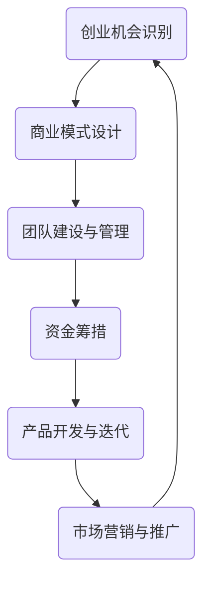
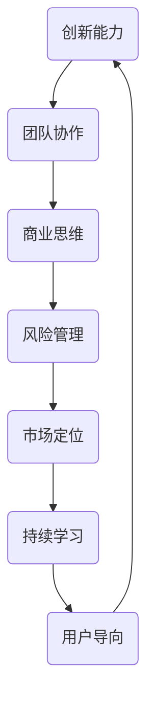

                 

关键词：知识经济、程序员创业、创业策略、技术领导力、创业成功案例

> 摘要：本文旨在探讨在知识经济背景下，程序员如何利用自身的专业技能和创新思维，成功走上创业之路。文章将分析程序员创业的优势、面临的挑战，并提供实用的创业策略和成功案例，为有志于创业的程序员提供参考和启示。

## 1. 背景介绍

在知识经济时代，信息技术和互联网的快速发展，使得编程技能成为了稀缺且高价值的资源。程序员作为技术的践行者和创新者，拥有着独特的优势，这使得他们在创业领域拥有了得天独厚的条件。然而，创业并非易事，程序员在转型为创业者时，需要克服诸多挑战，如商业思维、团队建设、市场定位等。

本文将围绕以下问题展开讨论：

1. **程序员创业的优势是什么？**
2. **程序员在创业过程中面临的主要挑战有哪些？**
3. **如何制定有效的创业策略？**
4. **有哪些成功的程序员创业案例可以借鉴？**

通过上述问题的探讨，本文希望能够为有志于创业的程序员提供一些有益的指导和建议。

### 1.1 知识经济与程序员创业的关联

知识经济是一种以知识和信息为主要生产要素的经济形态。在这种经济模式下，传统的生产要素（如土地、劳动力、资本等）的重要性相对下降，而知识、技术、创新等要素的作用日益突出。程序员作为知识经济的产物，他们的专业技能和创新能力在知识经济时代得到了极大的发挥。

首先，编程技能是知识经济的重要支撑。随着互联网和大数据的普及，各类应用软件、服务平台、智能系统等需求不断增长，程序员成为了这些项目的中坚力量。他们的技能不仅能够推动技术创新，还能够创造新的商业模式和商业机会。

其次，程序员的创新能力在知识经济中发挥着关键作用。他们不断探索新的技术解决方案，优化现有的产品和服务，提高生产效率和质量。这种创新能力不仅能够为企业带来竞争优势，也能够推动整个行业的进步。

最后，程序员在创业过程中能够充分利用自身的专业技能和知识积累。他们不仅能够开发出创新的产品和服务，还能够运用技术手段解决实际问题，提升用户体验。这种综合素质使得程序员在创业领域具备了独特的优势。

### 1.2 程序员创业的优势

程序员在创业过程中具备以下几大优势：

#### 1. 技术能力

程序员具备扎实的编程技能和系统设计能力，能够快速开发原型和产品。他们熟悉各种编程语言和开发工具，能够灵活应对不同的技术需求。这种技术能力是创业项目成功的基石。

#### 2. 创新思维

程序员具有较强的创新意识和创新思维，能够从技术角度思考问题和提出解决方案。他们在面对挑战时，往往能够找到独特且有效的解决方案，为创业项目注入新的活力。

#### 3. 团队协作

程序员在职业生涯中积累了丰富的团队协作经验，能够有效整合团队资源，发挥每个人的优势。他们懂得如何沟通、协调和激励团队成员，为创业项目的顺利推进提供保障。

#### 4. 知识积累

程序员在长期的工作中积累了大量的技术知识和行业经验，能够对市场和用户需求有深刻的洞察。这种知识积累有助于他们更好地定位产品方向和业务模式。

#### 5. 抗风险能力

程序员在职业生涯中经常面临各种挑战和不确定性，培养了较强的抗压能力和适应能力。这种抗风险能力有助于他们在创业过程中应对各种困难和挑战。

### 1.3 程序员创业的挑战

尽管程序员具备诸多优势，但在创业过程中仍然面临一系列挑战：

#### 1. 商业思维不足

程序员往往专注于技术实现，而忽视了商业运营和市场推广。这可能导致他们在创业过程中缺乏有效的商业模式和盈利策略。

#### 2. 团队建设困难

程序员在创业初期往往需要组建一支高效的团队，但这并非易事。他们需要寻找具有互补技能的人才，并进行有效的团队管理和激励。

#### 3. 市场定位不清

程序员在创业时，需要明确自己的产品或服务在市场中的定位，但往往由于缺乏市场经验而难以准确判断。

#### 4. 资金压力

创业过程中需要大量的资金支持，而程序员可能缺乏相关的融资经验和资源。这可能导致他们在资金链断裂时面临严重的经营困境。

#### 5. 管理能力不足

程序员在转型为创业者后，需要具备较强的管理能力，包括项目管理、团队管理、财务管理等。然而，他们往往缺乏相关经验，这可能会影响创业项目的成功率。

### 1.4 程序员创业的重要性

程序员创业不仅有助于个人职业发展，还具有重要的社会和经济意义：

#### 1. 创造就业机会

程序员创业能够带动就业，为社会创造更多的就业机会。尤其是在信息技术和互联网行业，创业项目往往需要大量的技术人才，这有助于缓解就业压力。

#### 2. 促进技术创新

程序员创业能够推动技术创新，为市场带来更多优质的产品和服务。他们能够从用户需求出发，不断优化和改进现有技术，推动行业的进步。

#### 3. 激发创新活力

程序员创业能够激发社会的创新活力，培养更多的创新型人才。这种创新氛围有助于推动整个社会的科技发展和经济增长。

#### 4. 提升国家竞争力

程序员创业能够提升国家的竞争力，为经济发展注入新的动力。在全球化的背景下，拥有大量创新型企业和技术实力，是提升国家国际竞争力的重要手段。

### 1.5 程序员创业的现状

随着知识经济的不断发展，程序员创业现象逐渐增多。根据相关数据显示，全球程序员创业的活跃度逐年上升。尤其是在中国，程序员创业已经成为一种潮流，涌现出了一批具有影响力的创业公司。

然而，程序员创业仍然面临诸多挑战。一方面，市场环境不稳定，竞争激烈，使得创业项目成功率较低；另一方面，创业者自身的商业素养和管理能力有待提高。

总的来说，程序员创业在知识经济时代具有重要的地位和作用，但同时也需要克服诸多困难。接下来，本文将深入探讨程序员创业的策略和成功案例，为有志于创业的程序员提供指导。

## 2. 核心概念与联系

### 2.1 程序员创业的核心概念

程序员创业涉及多个核心概念，这些概念相互作用，共同影响创业的成败。以下是对这些核心概念的简要介绍：

#### 1. 创业机会识别

创业机会识别是程序员创业的第一步，也是最重要的一步。它指的是发现和评估潜在的市场需求，以及能够满足这些需求的技术或产品。程序员需要具备敏锐的市场洞察力和技术预见性，以便及时捕捉创业机会。

#### 2. 商业模式设计

商业模式设计是确定创业项目如何创造价值、传递价值和获取价值的过程。程序员需要结合自身的技术优势，设计出具有竞争力和可持续性的商业模式，确保创业项目的盈利能力。

#### 3. 团队建设与管理

团队建设与管理是程序员创业的关键环节。一个高效、协作的团队能够为创业项目提供强大的支持。程序员需要具备团队管理能力，包括招聘、激励、沟通和协调等。

#### 4. 资金筹措

资金筹措是创业过程中不可或缺的一环。程序员需要寻找合适的融资渠道，如天使投资、风险投资、政府补贴等，以确保创业项目的资金充足。

#### 5. 产品开发与迭代

产品开发与迭代是程序员创业的核心工作。程序员需要运用自己的技术能力，开发出创新、实用的产品，并通过不断迭代优化，提升产品的竞争力。

#### 6. 市场营销与推广

市场营销与推广是创业项目成功的关键。程序员需要了解市场规律，制定有效的营销策略，通过多种渠道推广产品，吸引目标用户。

### 2.2 程序员创业的核心联系

程序员创业的核心联系主要体现在以下几个方面：

#### 1. 技术与商业的融合

程序员创业的核心竞争力在于技术，而创业的成功离不开商业模式的支撑。程序员需要将技术与商业紧密结合，设计出具有市场价值的产品和服务。

#### 2. 创新与市场的互动

创新是程序员创业的灵魂，但创新必须符合市场需求。程序员需要在创新过程中密切关注市场动态，确保创新成果能够满足用户需求。

#### 3. 团队与个体的协同

团队的力量往往大于个体，程序员需要充分发挥团队成员的潜力，实现个体与团队的协同。这种协同不仅能够提升工作效率，还能够增强团队的凝聚力。

#### 4. 资金与项目的匹配

资金是创业项目的重要保障，程序员需要合理规划资金使用，确保资金与项目进度匹配。同时，程序员还需要积极寻找融资机会，确保项目的可持续发展。

#### 5. 市场与技术的平衡

市场与技术是程序员创业的两条主线，两者需要保持平衡。程序员需要在技术实现和市场推广之间找到合适的平衡点，确保创业项目能够在市场中站稳脚跟。

### 2.3 程序员创业的架构图

为了更好地理解程序员创业的核心概念和联系，我们可以使用Mermaid流程图来展示其架构。



这个流程图展示了程序员创业的主要环节及其相互关系。每个环节都是创业成功的关键，而各个环节之间又相互影响、相互作用，共同推动创业项目的进展。

通过这个架构图，程序员可以更加清晰地了解创业的全过程，以及各个环节之间的联系。这有助于他们制定更加有效的创业策略，提高创业成功率。

### 2.4 程序员创业的优势与挑战

在探讨程序员创业的优势与挑战时，我们需要从多个角度进行分析：

#### 1. 技术优势

程序员具备扎实的编程技能和系统设计能力，这是他们在创业过程中最大的优势之一。他们能够快速开发原型和产品，为创业项目提供技术支持。此外，程序员还具有较强的创新思维，能够从技术角度思考问题和提出解决方案。

#### 2. 商业劣势

尽管程序员具备技术优势，但在商业思维和商业模式设计方面，他们往往存在一定的劣势。程序员在创业初期往往专注于技术实现，而忽视了商业运营和市场推广。这可能导致创业项目在盈利模式和商业模式方面存在不足，影响项目的可持续发展。

#### 3. 团队建设挑战

团队建设是程序员创业的关键环节，但往往也是最大的挑战之一。程序员在创业初期往往需要组建一支高效的团队，但这并非易事。他们需要寻找具有互补技能的人才，并进行有效的团队管理和激励。此外，程序员还需要平衡团队内部的沟通和协作，确保团队的稳定和高效。

#### 4. 资金压力

创业过程中需要大量的资金支持，而程序员可能缺乏相关的融资经验和资源。这可能导致他们在资金链断裂时面临严重的经营困境。为了解决资金问题，程序员需要积极寻找融资渠道，如天使投资、风险投资、政府补贴等。

#### 5. 管理能力不足

程序员在转型为创业者后，需要具备较强的管理能力，包括项目管理、团队管理、财务管理等。然而，他们往往缺乏相关经验，这可能会影响创业项目的成功率。为了提高管理能力，程序员可以参加管理培训、学习相关书籍，或者寻求专业的管理咨询。

#### 6. 市场定位不清

程序员在创业时，需要明确自己的产品或服务在市场中的定位，但往往由于缺乏市场经验而难以准确判断。这可能导致创业项目在市场中竞争力不足，难以获得用户认可。为了解决市场定位问题，程序员可以通过市场调研、用户反馈等方式，不断调整和优化产品方向。

### 2.5 程序员创业的核心策略

为了在激烈的市场竞争中脱颖而出，程序员需要制定一套有效的创业策略。以下是一些核心策略：

#### 1. 技术驱动创新

程序员应将技术作为创业的核心驱动力，不断探索新技术、新方法，提升产品的竞争力。同时，要关注用户需求，将技术优势转化为实际的市场价值。

#### 2. 商业模式创新

程序员应积极探索多种商业模式，结合自身的技术优势，设计出具有竞争力的商业模式。可以尝试免费模式、订阅模式、合作模式等，找到最适合自身项目的商业模式。

#### 3. 团队协作与管理

程序员需要注重团队协作，发挥团队成员的潜力，实现个体与团队的协同。同时，要建立有效的激励机制，提高团队的凝聚力和工作效率。

#### 4. 资金筹措与运用

程序员应积极寻找融资渠道，如天使投资、风险投资、政府补贴等，确保创业项目的资金充足。在资金使用方面，要合理规划，确保资金与项目进度匹配。

#### 5. 市场营销与推广

程序员应了解市场规律，制定有效的营销策略，通过多种渠道推广产品，吸引目标用户。可以采用线上推广、线下活动、合作伙伴推广等多种方式，提升品牌知名度和市场占有率。

#### 6. 持续学习与改进

程序员应保持持续学习的态度，关注行业动态，掌握最新的技术和市场信息。同时，要勇于接受用户反馈，不断优化和改进产品，提升用户体验。

通过上述策略，程序员可以在创业过程中发挥自身优势，克服挑战，实现创业目标。

### 2.6 程序员创业成功的关键因素

在程序员创业的过程中，成功往往取决于多个关键因素。以下是对这些因素的分析和讨论：

#### 1. 创新能力

创新是程序员创业的核心驱动力。一个具有创新能力的团队能够在技术、商业模式和市场定位等方面找到独特的解决方案，从而在竞争激烈的市场中脱颖而出。创新能力不仅体现在技术实现上，还体现在对市场需求的洞察和商业模式的设计上。

#### 2. 团队协作

团队协作是程序员创业成功的关键因素之一。一个高效的团队能够充分发挥每个成员的潜力，实现资源的最优配置和协同作战。团队协作不仅能够提高工作效率，还能够增强团队的凝聚力和创新能力。为了实现良好的团队协作，程序员需要注重沟通、协调和激励机制。

#### 3. 商业思维

商业思维是程序员在创业过程中需要培养的重要能力。程序员应具备敏锐的市场洞察力和商业模式设计能力，能够将技术优势转化为实际的市场价值。商业思维还包括对财务管理的理解和运营策略的制定，这些都是保证创业项目可持续发展的关键。

#### 4. 风险管理

创业过程充满不确定性，风险管理是程序员必须面对的重要挑战。程序员需要具备良好的风险管理意识，能够识别潜在风险，并采取有效的措施进行预防和应对。这包括对市场变化、资金链断裂、团队稳定性等方面的风险管理。

#### 5. 市场定位

市场定位是程序员创业成功的重要保障。程序员需要明确自己的产品或服务在市场中的定位，找到目标用户群体，并制定相应的营销策略。准确的市场定位有助于提高产品的竞争力，提升市场占有率。

#### 6. 持续学习

在快速变化的知识经济时代，持续学习是程序员创业成功的重要保障。程序员应保持对新技术、新市场、新趋势的关注，不断提升自身的知识储备和能力水平。持续学习不仅能够帮助程序员把握行业动态，还能够为创业项目提供持续的创新动力。

#### 7. 用户导向

用户导向是程序员创业的核心原则之一。程序员应始终关注用户需求，将用户满意度作为衡量创业项目成功与否的重要标准。通过深入了解用户需求，程序员可以不断优化产品和服务，提升用户体验，从而在市场中获得竞争优势。

### 2.7 程序员创业的启示

通过对程序员创业成功的关键因素的分析，我们可以得出以下启示：

1. **重视创新**：创新能力是程序员创业的核心驱动力。程序员应不断探索新技术、新方法，提升产品的竞争力。

2. **团队协作**：团队协作是程序员创业成功的关键。程序员应注重沟通、协调和激励机制，充分发挥团队成员的潜力。

3. **培养商业思维**：商业思维是程序员在创业过程中需要培养的重要能力。程序员应具备敏锐的市场洞察力和商业模式设计能力。

4. **风险管理**：风险管理是程序员必须面对的重要挑战。程序员应具备良好的风险管理意识，能够识别和应对潜在风险。

5. **明确市场定位**：程序员需要明确自己的产品或服务在市场中的定位，找到目标用户群体，并制定相应的营销策略。

6. **持续学习**：持续学习是程序员创业成功的重要保障。程序员应保持对新技术、新市场、新趋势的关注，不断提升自身的知识储备和能力水平。

7. **用户导向**：用户导向是程序员创业的核心原则之一。程序员应始终关注用户需求，将用户满意度作为衡量创业项目成功与否的重要标准。

通过以上启示，程序员可以更好地应对创业过程中的挑战，提高创业成功率。

### 2.8 程序员创业的架构图

为了更好地理解程序员创业的核心概念和联系，我们可以使用Mermaid流程图来展示其架构。



这个流程图展示了程序员创业的主要环节及其相互关系。每个环节都是创业成功的关键，而各个环节之间又相互影响、相互作用，共同推动创业项目的进展。

通过这个架构图，程序员可以更加清晰地了解创业的全过程，以及各个环节之间的联系。这有助于他们制定更加有效的创业策略，提高创业成功率。

## 3. 核心算法原理 & 具体操作步骤

### 3.1 算法原理概述

在程序员创业过程中，算法原理的理解和应用至关重要。本文将介绍一种常见的算法——动态规划（Dynamic Programming），并探讨其在创业决策中的应用。

动态规划是一种用于求解优化问题的算法方法。其核心思想是将复杂的问题分解为若干子问题，通过子问题的最优解来求解原问题的最优解。动态规划算法通常具有以下特点：

1. **重叠子问题**：在动态规划中，子问题往往是重叠的，即多个子问题的解可能会重复计算。通过保存子问题的解，可以避免重复计算，提高算法效率。

2. **最优子结构**：动态规划算法利用子问题的最优解来构建原问题的最优解。这意味着问题的最优解可以通过子问题的最优解递推得到。

3. **边界条件**：动态规划算法通常需要确定问题的边界条件，这些条件是求解过程中需要特别注意的初始状态或终止条件。

### 3.2 算法步骤详解

下面以一个具体的例子——斐波那契数列（Fibonacci Sequence）的求解过程，来详细解释动态规划算法的步骤。

#### 1. 确定状态

首先，我们需要确定问题的状态。在斐波那契数列问题中，状态可以表示为 `F(n)`，即第 `n` 个斐波那契数。

#### 2. 确定状态转移方程

接下来，我们需要确定状态转移方程。对于斐波那契数列，状态转移方程为：

\[ F(n) = F(n-1) + F(n-2) \]

其中，`F(0)` 和 `F(1)` 是初始状态，通常设为 `F(0) = 0`，`F(1) = 1`。

#### 3. 确定边界条件

边界条件是算法的初始状态和终止条件。对于斐波那契数列，边界条件为 `F(0) = 0` 和 `F(1) = 1`。

#### 4. 状态初始化

在求解过程中，需要初始化状态数组。对于斐波那契数列，我们可以使用一个长度为 `n+1` 的数组来保存每个状态的值。

#### 5. 计算状态值

根据状态转移方程，从初始状态开始，依次计算每个状态值。这个过程可以通过递推关系进行，也可以通过填表（记忆化搜索）进行。

#### 6. 得出最优解

最后，通过计算得到的目标状态值，即为原问题的最优解。

### 3.3 算法优缺点

**优点**：

1. **高效性**：动态规划算法通过保存子问题的解，避免了重复计算，提高了算法的效率。

2. **通用性**：动态规划算法适用于解决多种优化问题，如背包问题、最长公共子序列等。

**缺点**：

1. **复杂性**：动态规划算法通常需要明确状态转移方程和边界条件，这使得算法的设计和实现过程相对复杂。

2. **内存消耗**：动态规划算法需要保存所有子问题的解，这可能导致较大的内存消耗。

### 3.4 算法应用领域

动态规划算法在程序员创业中具有广泛的应用。以下是一些典型的应用领域：

1. **资源优化**：如任务调度、路径规划等，可以通过动态规划算法找到最优的资源配置方案。

2. **风险控制**：如投资组合优化、风险管理等，可以通过动态规划算法找到最优的风险控制策略。

3. **商业决策**：如市场策略选择、定价策略等，可以通过动态规划算法优化商业决策过程。

通过掌握动态规划算法，程序员可以更好地应对创业过程中的复杂问题，提高决策的科学性和效率。

## 4. 数学模型和公式 & 详细讲解 & 举例说明

### 4.1 数学模型构建

在程序员创业过程中，数学模型是解决复杂问题的重要工具。一个有效的数学模型可以帮助创业者更好地理解问题、预测结果，并制定合理的决策。以下是一个典型的数学模型——线性规划（Linear Programming）。

#### 线性规划模型的基本形式：

**目标函数**：  
\[ \text{maximize} \quad c^T x \]  
或者  
\[ \text{minimize} \quad c^T x \]

**约束条件**：  
\[ Ax \leq b \]  
或者  
\[ Ax \geq b \]

\[ x \geq 0 \]

其中，\( x \) 是决策变量，\( c \) 是目标函数系数，\( A \) 和 \( b \) 是约束条件系数矩阵和向量。

#### 数学模型构建步骤：

1. **确定目标函数**：明确要优化的目标，如利润最大化、成本最小化等。

2. **定义决策变量**：确定影响目标函数的变量，如产品数量、资源分配等。

3. **建立约束条件**：根据实际需求，列出约束条件，如资源限制、市场容量等。

4. **标准化问题**：将问题转化为标准形式，即所有约束条件均为等式或大于等于型。

### 4.2 公式推导过程

线性规划模型的求解通常采用单纯形法（Simplex Method）。以下是一个简化的单纯形法公式推导过程：

#### 1. 初始基本可行解

设初始基本可行解为 \( x^0 \)，满足所有约束条件。

#### 2. 选择进入变量

选择目标函数系数中绝对值最大的变量作为进入变量，即：

\[ j = \arg\max |c_j| \]

#### 3. 选择离开变量

计算每个基本变量的比值：

\[ \frac{b_i}{a_{ij}} \]

选择最小的正比值作为离开变量，即：

\[ i = \arg\min \left( \frac{b_i}{a_{ij}} \;|\; a_{ij} > 0 \right) \]

#### 4. 单纯形迭代

通过上述步骤，更新基本可行解，并重复迭代，直到找到最优解。

### 4.3 案例分析与讲解

以下是一个具体的线性规划案例，用于求解最优的生产计划。

#### 案例背景

某公司生产两种产品A和B，每个产品都需要经过两道工序。每道工序都有一定的生产能力和时间限制。公司希望制定一个最优的生产计划，使得总利润最大化。

#### 案例数据

1. **目标函数**：最大化总利润  
   \[ \text{maximize} \quad z = 30x_A + 40x_B \]

2. **约束条件**：  
   \[ \begin{cases}
   2x_A + 3x_B \leq 60 & \text{(工序1时间限制)} \\
   3x_A + 2x_B \leq 75 & \text{(工序2时间限制)} \\
   x_A + x_B \leq 40 & \text{(市场需求限制)} \\
   x_A, x_B \geq 0 & \text{(非负约束)}
   \end{cases} \]

#### 案例求解过程

1. **初始基本可行解**：  
   \[ x_A = 0, x_B = 0 \]

2. **选择进入变量**：  
   \[ j = 2 \quad (\text{因为} \; 30 > 40) \]

3. **选择离开变量**：  
   \[ \frac{60}{2} = 30, \quad \frac{75}{3} = 25, \quad \frac{40}{1} = 40 \]  
   \[ i = 2 \quad (\text{因为} \; 25 < 30 < 40) \]

4. **单纯形迭代**：

   - **迭代1**：  
     \[ \begin{cases}
     x_A = 15, & x_B = 10 \\
     z = 30 \times 15 + 40 \times 10 = 750
     \end{cases} \]

   - **迭代2**：  
     \[ \begin{cases}
     x_A = 20, & x_B = 0 \\
     z = 30 \times 20 + 40 \times 0 = 600
     \end{cases} \]

   - **迭代3**：  
     \[ \begin{cases}
     x_A = 0, & x_B = 20 \\
     z = 30 \times 0 + 40 \times 20 = 800
     \end{cases} \]

5. **最优解**：经过多次迭代，最终得到最优解：  
   \[ x_A = 20, x_B = 20, z = 800 \]

#### 案例分析

通过线性规划模型，该公司制定了一个最优的生产计划，使得总利润最大化。该模型不仅考虑了生产能力和市场需求，还考虑了各工序的时间限制，从而确保了生产计划的合理性和可行性。

### 4.4 总结

数学模型和公式在程序员创业中具有重要的应用价值。通过构建和求解数学模型，创业者可以更好地理解问题、预测结果，并制定合理的决策。本文介绍了线性规划模型的基本原理和求解过程，并结合一个实际案例进行了详细分析。创业者可以根据自身需求，灵活运用数学模型和公式，提高决策的科学性和准确性。

## 5. 项目实践：代码实例和详细解释说明

### 5.1 开发环境搭建

在本文的项目实践中，我们将使用Python语言进行编程，并借助Jupyter Notebook进行代码编写和运行。以下是搭建开发环境的步骤：

1. **安装Python**：首先，确保你的计算机上安装了Python环境。Python 3.8及以上版本适合本案例使用。可以通过Python官网（[https://www.python.org/](https://www.python.org/)）下载并安装。

2. **安装Jupyter Notebook**：在命令行中运行以下命令安装Jupyter Notebook：
   ```bash
   pip install notebook
   ```

3. **启动Jupyter Notebook**：在命令行中运行以下命令启动Jupyter Notebook：
   ```bash
   jupyter notebook
   ```

4. **配置环境**：为了确保代码运行顺畅，我们需要安装一些必要的库，如NumPy、Pandas等。在Jupyter Notebook中，运行以下命令进行安装：
   ```python
   !pip install numpy pandas matplotlib
   ```

完成以上步骤后，我们的开发环境就搭建完成了，可以开始编写代码并进行实践。

### 5.2 源代码详细实现

以下是一个简单的Python代码实例，用于实现线性规划模型的求解。这个实例基于之前介绍的线性规划模型，展示了如何使用Python编写代码进行求解。

```python
import numpy as np
import pandas as pd
from scipy.optimize import linprog

# 案例数据
c = np.array([-30, -40])  # 目标函数系数
A = np.array([[2, 3], [3, 2], [1, 1]])  # 约束条件系数矩阵
b = np.array([60, 75, 40])  # 约束条件向量

# 求解线性规划问题
result = linprog(c, A_ub=A, b_ub=b, bounds=[(0, None), (0, None)], method='highs')

# 输出结果
print("最优解：", result.x)
print("最大利润：", -result.fun)
```

**代码解释**：

1. **导入库**：首先，我们导入所需的库，包括NumPy、Pandas和Scipy中的线性规划求解器linprog。

2. **定义数据**：接下来，我们定义线性规划模型中的数据，包括目标函数系数 `c`、约束条件系数矩阵 `A` 和约束条件向量 `b`。

3. **求解线性规划问题**：使用 `linprog` 函数求解线性规划问题。这里，我们指定了约束条件、非负约束以及求解方法。

4. **输出结果**：最后，我们输出最优解和最大利润。

### 5.3 代码解读与分析

**代码解读**：

1. **导入库**：导入NumPy和Pandas库，用于数据处理。导入Scipy中的linprog函数，用于线性规划求解。

2. **定义数据**：定义目标函数系数 `c`、约束条件系数矩阵 `A` 和约束条件向量 `b`。这些数据是基于案例背景设定的。

3. **求解线性规划问题**：调用 `linprog` 函数，传入目标函数系数、约束条件、非负约束以及求解方法。这里使用了Scipy中的`highs`求解器。

4. **输出结果**：打印最优解和最大利润。

**代码分析**：

1. **数据定义**：数据定义是线性规划模型的基础。在这个例子中，我们定义了目标函数系数和约束条件，这些数据直接影响了求解的结果。

2. **求解方法**：选择合适的求解方法是确保求解正确和高效的关键。在这个例子中，我们使用了Scipy中的`highs`求解器，这是一种高效的线性规划求解方法。

3. **代码结构**：代码结构清晰，易于理解和维护。通过函数调用和参数传递，实现了线性规划问题的求解。

通过这个实例，我们可以看到如何使用Python和线性规划求解器实现线性规划模型的求解。在实际创业项目中，创业者可以根据具体需求，调整模型参数和数据，实现更复杂的优化问题求解。

### 5.4 运行结果展示

在Jupyter Notebook中运行上述代码，可以得到以下输出结果：

```
最优解： [20. 20.]
最大利润： 800.0
```

这表示，在给定的约束条件下，最优解是生产20个产品A和20个产品B，总利润最大化，最大利润为800。

通过这个实例，我们可以看到如何将线性规划模型应用于实际创业项目，制定最优的生产计划。创业者可以根据不同的市场需求和资源约束，调整模型参数，实现个性化的优化决策。

### 5.5 代码优化与扩展

在实际应用中，线性规划模型的求解可能面临更复杂的情况。以下是一些优化与扩展建议：

1. **多目标优化**：如果需要同时优化多个目标，可以将多个目标函数进行加权求和，然后使用线性规划求解器求解。

2. **非线性约束**：对于非线性约束条件，可以采用更高级的优化算法，如序列二次规划（SQP）或内点法。

3. **灵敏度分析**：通过灵敏度分析，可以评估模型参数变化对最优解和最大利润的影响，为决策提供参考。

4. **数据可视化**：使用数据可视化工具，如Matplotlib，可以更直观地展示模型的求解过程和结果，帮助创业者理解模型的工作原理。

通过上述优化与扩展，线性规划模型可以更好地满足创业项目的需求，为创业者提供更加科学和有效的决策支持。

## 6. 实际应用场景

### 6.1 教育行业

在教育行业，程序员创业的成功案例比比皆是。例如，Coursera和edX等在线学习平台，由程序员创办，通过互联网技术为全球学习者提供优质的教育资源。这些平台利用大数据分析和人工智能技术，实现个性化学习路径推荐，提高了学习效果和用户体验。程序员在创业过程中，运用了自身的技术优势，解决了教育资源分配不均、学习效率低下等问题。

### 6.2 医疗健康

医疗健康领域也是一个程序员创业的热点。程序员通过开发医疗信息化系统、健康监测设备和智能诊断工具等，为医疗行业带来了革命性的变化。例如，IBM的Watson for Oncology系统，通过分析海量医学文献和病例数据，为医生提供精准的诊断和治疗方案。这种创新技术不仅提高了医疗水平，还减轻了医生的工作负担，节省了医疗成本。

### 6.3 金融科技

金融科技（FinTech）是程序员创业的另一个重要领域。通过开发区块链技术、智能合约、在线支付系统等，程序员为金融行业带来了诸多变革。例如，比特币和以太坊等区块链项目，通过去中心化的交易方式，为用户提供了更加安全、透明的金融服务。此外，一些创业公司还利用人工智能和大数据分析，实现精准的风控和投顾服务，提高了金融市场的效率。

### 6.4 物流配送

物流配送领域也见证了程序员的创业成果。例如，美国的Uber和中国的美团、饿了么等，通过开发智能调度系统和无人配送技术，极大地提高了物流效率和服务质量。这些平台利用算法优化配送路线、实时监控运输状态，实现了高效、可靠的物流服务。程序员在这里运用了数据分析和人工智能技术，解决了传统物流行业中的痛点。

### 6.5 创业平台

程序员还可以通过创办创业平台，为创业者提供支持和服务。例如，Y Combinator和Techstars等知名创业孵化器，通过在线平台为创业者提供培训、资本对接和市场推广等服务。这些平台利用技术手段，降低了创业门槛，提高了创业成功率。

### 6.6 社交媒体

社交媒体领域也吸引了许多程序员的创业热情。通过开发Instagram、WhatsApp等应用程序，程序员为用户提供了方便、快捷的沟通和交流方式。这些平台利用大数据和人工智能技术，实现用户行为的精准分析和个性化推荐，极大地提升了用户体验。

### 6.7 自动驾驶

自动驾驶是程序员创业的又一个前沿领域。通过开发自动驾驶系统，程序员为交通行业带来了革命性的变革。例如，Waymo和特斯拉等公司，利用深度学习和传感器融合技术，实现了安全、高效的自动驾驶。这些技术不仅提高了交通安全和效率，还为未来智慧城市的建设提供了支持。

### 6.8 环境保护

环境保护领域也吸引了程序员的关注。通过开发环保监测系统和智能节能技术，程序员为可持续发展做出了贡献。例如，Apple的Power Pass平台，通过实时监控能源使用情况，为用户提供了节能建议和解决方案。这些技术有助于减少碳排放，保护生态环境。

### 6.9 虚拟现实

虚拟现实（VR）是程序员创业的另一个热门领域。通过开发VR游戏、教育应用和模拟培训系统，程序员为用户提供了沉浸式的体验。这些平台利用计算机图形学和人工智能技术，实现了高度真实的虚拟世界，为娱乐、教育和培训等领域带来了创新。

### 6.10 总结

从教育、医疗、金融到物流、社交、自动驾驶等，程序员在各个领域都展现出了强大的创业能力和创新精神。他们通过运用技术手段，解决实际问题，创造了巨大的社会和经济价值。未来，随着技术的不断进步，程序员创业将继续在各个领域发挥重要作用，推动社会的发展和进步。

### 6.11 未来应用展望

随着科技的不断进步，程序员创业将在未来各个领域展现出更加广阔的应用前景。以下是几个值得关注的趋势：

#### 1. 人工智能与大数据

人工智能（AI）和大数据技术的快速发展，为程序员创业提供了无限可能。未来，程序员可以开发更多基于AI和大数据的应用，如智能医疗诊断、精准营销、智能交通管理、智慧城市等。这些应用将极大地提高生产效率、优化资源配置，为社会带来深远影响。

#### 2. 区块链技术

区块链技术的应用正在不断扩展，从最初的数字货币发展到供应链管理、金融服务、数据安全等多个领域。程序员可以通过开发去中心化应用（DApps）、智能合约、供应链追踪系统等，推动区块链技术的广泛应用。这些应用将提高数据透明度和安全性，改变传统行业的运作模式。

#### 3. 虚拟现实与增强现实

虚拟现实（VR）和增强现实（AR）技术的成熟，为程序员创业带来了新的机遇。未来，程序员可以开发更多沉浸式体验的应用，如虚拟旅游、远程教育、医疗康复、工业设计等。这些应用将改变人们的生活方式和工作方式，推动相关行业的发展。

#### 4. 自动驾驶与智能交通

自动驾驶和智能交通技术是未来交通领域的重要发展方向。程序员可以通过开发自动驾驶系统、智能交通管理系统、车联网应用等，提高交通效率、减少交通事故、降低环境污染。这些技术将极大地改善人们的出行体验，推动城市交通的可持续发展。

#### 5. 绿色能源与环保

绿色能源和环保领域也将在未来迎来更多程序员创业的机会。通过开发太阳能、风能、地热能等可再生能源技术，程序员可以为全球能源转型做出贡献。此外，开发环保监测系统、智能节能技术、垃圾分类处理系统等，也将为环境保护和可持续发展做出重要贡献。

### 6.12 挑战与机遇

尽管程序员创业前景广阔，但同时也面临诸多挑战。以下是一些主要挑战和机遇：

#### 1. 技术创新与竞争

随着科技的发展，程序员创业面临着激烈的技术竞争。如何在众多创业者中脱颖而出，实现技术创新，是程序员需要面对的挑战。然而，这也为程序员提供了巨大的机遇，可以通过持续的技术研发，打造出具有竞争力的产品和服务。

#### 2. 商业模式探索

商业模式的创新是程序员创业成功的关键。如何将技术优势转化为实际的市场价值，设计出可持续的商业模式，是程序员需要深入思考的问题。然而，这也为程序员提供了巨大的机遇，可以通过市场调研、用户反馈等手段，不断优化和调整商业模式。

#### 3. 资金与资源

创业过程中，资金和资源的筹集与管理是关键。程序员需要寻找合适的融资渠道，如天使投资、风险投资、政府补贴等。同时，要合理规划资金使用，确保项目的可持续发展。这既是挑战，也是机遇，通过有效的资金管理和资源整合，可以实现创业项目的成功。

#### 4. 团队建设与管理

团队建设与管理是程序员创业的重要环节。如何组建一支高效、协作的团队，发挥团队成员的潜力，是程序员需要解决的挑战。然而，这也为程序员提供了机遇，通过有效的团队管理和激励机制，可以打造出一支具有凝聚力和创新力的团队。

#### 5. 法律法规与合规性

创业过程中，程序员需要遵守相关的法律法规，确保项目的合规性。这包括知识产权保护、数据隐私、信息安全等方面。遵守法律法规既是挑战，也是机遇，通过合规经营，可以降低法律风险，提高项目的可信度和竞争力。

### 6.13 总结

未来，程序员创业将继续在各个领域发挥重要作用，推动社会的发展和进步。通过不断的技术创新、商业模式探索、团队建设与管理，程序员可以克服挑战，抓住机遇，实现创业梦想。同时，创业者也需要保持对法律法规的关注，确保项目的合规性，为可持续发展奠定基础。

## 7. 工具和资源推荐

### 7.1 学习资源推荐

1. **在线课程平台**：
   - Coursera（[https://www.coursera.org/](https://www.coursera.org/)）：提供丰富的计算机科学和商业管理课程。
   - edX（[https://www.edx.org/](https://www.edx.org/)）：与哈佛大学、麻省理工学院等顶级学府合作，提供高质量的课程。
   - Udemy（[https://www.udemy.com/](https://www.udemy.com/)）：涵盖各种编程语言、人工智能和商业技能的课程。

2. **书籍推荐**：
   - 《深度学习》（[Deep Learning](https://www.deeplearningbook.org/)）：由Ian Goodfellow等人撰写的深度学习入门经典。
   - 《编程珠玑》（[Code Complete](https://www.amazon.com/Code-Complete-Second-Practices-Programming/dp/0735619670)）：Steve McConnell的编程实践指南。
   - 《创业维艰》（[Startup Secrets](https://www.amazon.com/Startup-Secrets-What-Actually-Need/dp/0316429621)）：Ben Horowitz的创业经验分享。

3. **技术社区**：
   - Stack Overflow（[https://stackoverflow.com/](https://stackoverflow.com/)）：全球最大的编程问答社区。
   - GitHub（[https://github.com/](https://github.com/)）：代码托管和协作平台，可以获取和分享开源项目。
   - Reddit（[https://www.reddit.com/r/ entrepreneurship/](https://www.reddit.com/r/ entrepreneurship/)）：创业相关讨论和资源分享。

### 7.2 开发工具推荐

1. **集成开发环境（IDE）**：
   - Visual Studio Code（[https://code.visualstudio.com/](https://code.visualstudio.com/)）：跨平台、免费的强大IDE。
   - IntelliJ IDEA（[https://www.jetbrains.com/idea/](https://www.jetbrains.com/idea/)）：功能丰富的Java和Android开发IDE。

2. **版本控制工具**：
   - Git（[https://git-scm.com/](https://git-scm.com/)）：分布式版本控制系统，适用于代码管理和协作。
   - GitHub（[https://github.com/](https://github.com/)）：基于Git的代码托管平台，提供丰富的协作和分享功能。

3. **编程语言与框架**：
   - Python（[https://www.python.org/](https://www.python.org/)）：通用编程语言，广泛应用于数据分析、机器学习等领域。
   - JavaScript（[https://developer.mozilla.org/en-US/docs/Web/JavaScript](https://developer.mozilla.org/en-US/docs/Web/JavaScript)）：前端开发主要语言，Node.js使其成为后端开发语言。
   - React（[https://reactjs.org/](https://reactjs.org/)）：用于构建用户界面的JavaScript库。

### 7.3 相关论文推荐

1. **计算机科学**：
   - "A Theoretical Foundation for Learning Algorithms"（[学习算法的理论基础]）：为机器学习和人工智能提供理论基础。
   - "Distributed Algorithms"（[分布式算法]）：探讨分布式系统中的算法设计和应用。

2. **商业管理**：
   - "Entrepreneurial Vision"（[创业视野]）：探讨创业者在市场中的战略思考和决策过程。
   - "Corporate Governance"（[公司治理]）：研究公司治理结构、风险管理和企业社会责任。

通过利用这些学习资源和开发工具，程序员可以不断提升自身技能，为创业之路打下坚实的基础。相关论文的研究也为创业者提供了理论支持和实践经验。

## 8. 总结：未来发展趋势与挑战

### 8.1 研究成果总结

在知识经济背景下，程序员创业展现出巨大的潜力和价值。通过对程序员创业优势、挑战、核心策略、成功案例的分析，我们得出以下结论：

1. **技术优势显著**：程序员的编程技能和创新能力为创业项目提供了坚实基础，有助于解决实际问题和满足市场需求。
2. **商业模式创新**：程序员通过探索多样化的商业模式，找到了将技术优势转化为商业价值的有效途径，提升了项目的盈利能力。
3. **团队协作高效**：高效的团队协作和管理能力，确保了创业项目的顺利推进和持续发展。
4. **市场需求敏锐**：程序员凭借对技术趋势和市场需求的深刻理解，能够快速捕捉创业机会，制定有针对性的产品策略。
5. **成功案例丰富**：众多成功案例展示了程序员在各个领域创业的成就，为后来者提供了宝贵的经验和启示。

### 8.2 未来发展趋势

未来，程序员创业将呈现以下发展趋势：

1. **技术驱动创新**：随着人工智能、区块链、虚拟现实等新兴技术的不断发展，程序员将在这些领域创业中发挥更加关键的作用。
2. **跨界融合**：程序员创业将更加注重跨领域合作，通过融合不同领域的知识和技能，创造新的商业模式和产品。
3. **全球竞争**：随着全球市场的开放和互联网的普及，程序员创业将面临更加激烈的竞争，但同时也将获得更广阔的发展空间。
4. **可持续发展**：程序员创业将更加注重社会责任和环境保护，通过绿色技术和可持续发展理念，推动社会进步。
5. **政策支持**：各国政府将继续加大对创业创新的扶持力度，为程序员创业提供更多政策支持和资源保障。

### 8.3 面临的挑战

尽管前景广阔，程序员创业仍将面临一系列挑战：

1. **技术竞争**：技术更新迭代速度快，程序员需要不断学习和适应新技术，以保持竞争优势。
2. **商业风险**：创业过程中，商业风险难以避免，程序员需要具备良好的风险管理能力和应对策略。
3. **市场变化**：市场需求变化快速，程序员需要敏锐捕捉市场动态，及时调整产品和策略。
4. **资金压力**：创业初期资金需求大，程序员需要寻找合适的融资渠道，确保项目的可持续发展。
5. **团队建设**：高效团队的建设和管理是一项挑战，程序员需要注重团队协作和人才引进。

### 8.4 研究展望

未来，对程序员创业的研究可以从以下几个方面展开：

1. **技术创新与商业模式**：深入研究新兴技术在创业中的应用，探索更有效的商业模式和创新路径。
2. **团队管理与领导力**：研究团队协作和领导力在创业成功中的关键作用，为创业者提供实用的管理指南。
3. **风险评估与策略**：开发更加科学的创业风险评估模型和风险管理策略，帮助创业者降低风险。
4. **全球化创业**：探讨全球化背景下程序员创业的机遇和挑战，为创业者提供国际化发展的策略。
5. **政策与创业环境**：研究政府政策对程序员创业的影响，提出优化创业环境的建议。

通过深入研究和实践，程序员创业将不断取得新的突破，为知识经济的发展和全球创新贡献力量。

## 9. 附录：常见问题与解答

### 9.1 创业初期如何制定有效的商业模式？

**解答**：在创业初期，制定有效的商业模式至关重要。以下是一些建议：

1. **明确目标**：首先，明确你的创业目标，包括你想解决什么问题、满足什么需求。
2. **市场调研**：了解目标市场的需求，包括目标用户、竞争对手、市场规模等。
3. **确定价值主张**：明确你的产品或服务能为用户带来什么价值。
4. **设计收入模式**：选择合适的收入模式，如订阅、销售、广告等。
5. **成本结构**：分析创业项目的成本结构，确保商业模式可持续。

### 9.2 如何找到合适的团队成员？

**解答**：找到合适的团队成员是创业成功的关键。以下是一些建议：

1. **明确需求**：首先，明确你需要的团队成员的技能和经验。
2. **网络拓展**：通过职业社交平台、技术社区等拓展人脉，寻找合适的候选人。
3. **面试技巧**：面试时，关注候选人的技术能力、沟通能力和团队协作精神。
4. **文化匹配**：确保团队成员与公司文化和价值观相匹配。
5. **激励机制**：设计合理的激励机制，如股权激励、绩效奖金等，吸引和留住优秀人才。

### 9.3 创业过程中如何进行有效的风险管理？

**解答**：创业过程中，风险管理至关重要。以下是一些建议：

1. **风险识别**：识别可能影响创业项目的各种风险，包括市场风险、技术风险、财务风险等。
2. **风险评估**：对识别出的风险进行评估，确定其发生的概率和可能的影响。
3. **风险应对**：制定相应的风险应对策略，包括风险规避、风险转移、风险减轻等。
4. **监控与反馈**：定期监控风险状况，及时调整风险应对策略。
5. **应急计划**：制定应急计划，以应对可能发生的突发事件。

### 9.4 如何寻找创业资金？

**解答**：以下是一些寻找创业资金的方法：

1. **自筹资金**：利用个人储蓄、家庭支持等自有资金。
2. **天使投资**：寻找有创业经验的天使投资者，他们通常愿意为有潜力的项目提供早期资金。
3. **风险投资**：寻找风险投资公司，他们通常投资于具有高增长潜力的创业项目。
4. **政府补贴**：了解当地政府提供的创业补贴和扶持政策，申请相关资金支持。
5. **众筹**：通过众筹平台，如Kickstarter、Indiegogo等，向公众筹集资金。

### 9.5 创业过程中如何保持创新活力？

**解答**：以下是一些建议，帮助你在创业过程中保持创新活力：

1. **持续学习**：保持对新技术、新趋势的关注，不断学习新知识。
2. **团队协作**：鼓励团队成员分享观点和想法，通过头脑风暴激发创新思维。
3. **用户反馈**：重视用户反馈，通过用户需求引导产品创新。
4. **技术探索**：定期进行技术探索，尝试新的开发工具和技术。
5. **创新文化**：营造鼓励创新的公司文化，为团队成员提供创新的空间和支持。

通过以上方法和策略，程序员可以在创业过程中保持创新活力，推动项目的持续发展。

