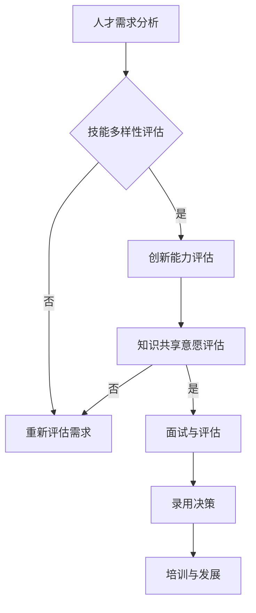
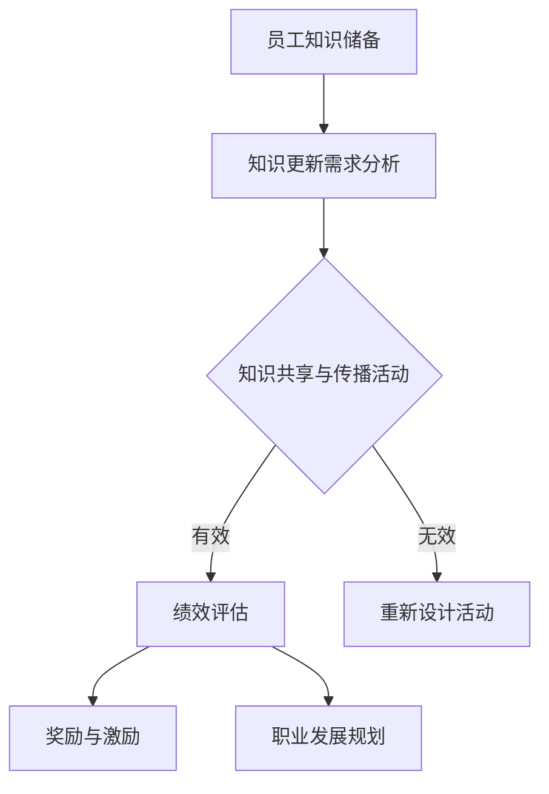

                 

 关键词：知识经济、知识付费、人才招聘、管理、人工智能、技术人才、招聘策略、绩效评估、职业发展

> 摘要：本文深入探讨了知识经济时代下的知识付费模式及其对人才招聘与管理的影响。通过分析当前人才市场的变化，提出了适应知识付费环境下的人才招聘策略和绩效评估方法，并探讨了未来发展的趋势和挑战。

## 1. 背景介绍

随着信息技术的迅猛发展，知识经济逐渐成为全球经济的主要驱动力。知识付费作为知识经济的一种重要表现形式，近年来得到了广泛关注。知识付费是指通过付费方式获取专业知识、技能和经验的一种新兴商业模式。在知识付费模式下，知识提供者和消费者之间形成了直接的交易关系，这为知识传播和创新提供了新的动力。

知识付费的兴起，不仅改变了传统的知识传播方式，也对人才招聘与管理提出了新的要求。在知识经济时代，企业的核心竞争力越来越依赖于人才的创新能力、专业素养和知识储备。因此，如何吸引、培养和留住优秀人才，成为企业管理的重要课题。

## 2. 核心概念与联系

在知识付费环境下，人才招聘与管理需要重点关注以下几个核心概念：

- **技能多样性**：知识付费模式强调个人专业技能的重要性，因此企业在招聘过程中应注重候选人的专业技能和实践经验。
- **创新能力**：知识经济时代，创新成为企业竞争力的关键。招聘过程中应评估候选人的创新潜力和解决问题的能力。
- **知识共享与传播**：知识付费模式鼓励知识共享，企业应建立有效的知识管理体系，促进内部知识的传播和应用。
- **绩效评估**：在知识付费环境下，绩效评估应更加注重候选人的实际贡献和创新能力，而非仅限于工作量和成果数量。

### 2.1 知识付费人才招聘的 Mermaid 流程图



### 2.2 知识付费人才管理的 Mermaid 流程图



## 3. 核心算法原理 & 具体操作步骤

### 3.1 算法原理概述

在知识付费人才招聘与管理中，核心算法原理主要涉及技能多样性评估、创新能力评估和知识共享意愿评估。

- **技能多样性评估**：通过构建技能多样性模型，对候选人的专业技能进行量化评估。
- **创新能力评估**：采用创新性评分模型，对候选人的创新潜力和问题解决能力进行评估。
- **知识共享意愿评估**：基于行为数据，构建知识共享意愿模型，评估候选人的知识共享意愿。

### 3.2 算法步骤详解

#### 3.2.1 技能多样性评估

1. **数据收集**：收集候选人的专业技能和实践经验数据。
2. **特征提取**：将专业技能数据转化为算法可处理的特征向量。
3. **模型训练**：利用机器学习算法，训练技能多样性模型。
4. **评估**：对候选人进行技能多样性评估。

#### 3.2.2 创新能力评估

1. **数据收集**：收集候选人的创新项目、专利、论文等创新成果数据。
2. **特征提取**：将创新成果数据转化为算法可处理的特征向量。
3. **模型训练**：利用机器学习算法，训练创新能力评估模型。
4. **评估**：对候选人进行创新能力评估。

#### 3.2.3 知识共享意愿评估

1. **数据收集**：收集候选人的知识共享行为数据。
2. **特征提取**：将知识共享行为数据转化为算法可处理的特征向量。
3. **模型训练**：利用机器学习算法，训练知识共享意愿评估模型。
4. **评估**：对候选人进行知识共享意愿评估。

### 3.3 算法优缺点

- **优点**：通过算法评估，可以更客观、准确地识别优秀人才，提高招聘效率。
- **缺点**：算法评估结果可能受数据质量影响，存在一定的误差。

### 3.4 算法应用领域

算法可以广泛应用于各类企业的知识付费人才招聘与管理，如互联网企业、高科技企业、咨询公司等。

## 4. 数学模型和公式 & 详细讲解 & 举例说明

### 4.1 数学模型构建

在知识付费人才招聘与管理中，常用的数学模型包括技能多样性模型、创新能力评估模型和知识共享意愿评估模型。

- **技能多样性模型**：假设候选人的技能集为S，技能多样性得分定义为：
  $$ D = \sum_{s \in S} w_s \cdot f(s) $$
  其中，$w_s$ 为技能 $s$ 的权重，$f(s)$ 为技能 $s$ 的评估分数。

- **创新能力评估模型**：假设候选人的创新成果集为I，创新能力得分定义为：
  $$ I = \sum_{i \in I} w_i \cdot f(i) $$
  其中，$w_i$ 为创新成果 $i$ 的权重，$f(i)$ 为创新成果 $i$ 的评估分数。

- **知识共享意愿评估模型**：假设候选人的知识共享行为集为K，知识共享意愿得分定义为：
  $$ K = \sum_{k \in K} w_k \cdot f(k) $$
  其中，$w_k$ 为知识共享行为 $k$ 的权重，$f(k)$ 为知识共享行为 $k$ 的评估分数。

### 4.2 公式推导过程

假设有 $n$ 个候选人，每个候选人具有不同的技能、创新成果和知识共享行为。我们分别定义三个评估模型：

- **技能多样性评估模型**：计算每个候选人的技能多样性得分 $D_i$，其中 $i$ 表示第 $i$ 个候选人。
  $$ D_i = \sum_{s \in S_i} w_s \cdot f(s_i) $$
  其中，$S_i$ 为第 $i$ 个候选人的技能集，$w_s$ 为技能 $s$ 的权重，$f(s_i)$ 为技能 $s$ 在第 $i$ 个候选人中的评估分数。

- **创新能力评估模型**：计算每个候选人的创新能力得分 $I_i$，其中 $i$ 表示第 $i$ 个候选人。
  $$ I_i = \sum_{i \in I_i} w_i \cdot f(i_i) $$
  其中，$I_i$ 为第 $i$ 个候选人的创新成果集，$w_i$ 为创新成果 $i$ 的权重，$f(i_i)$ 为创新成果 $i$ 在第 $i$ 个候选人中的评估分数。

- **知识共享意愿评估模型**：计算每个候选人的知识共享意愿得分 $K_i$，其中 $i$ 表示第 $i$ 个候选人。
  $$ K_i = \sum_{k \in K_i} w_k \cdot f(k_i) $$
  其中，$K_i$ 为第 $i$ 个候选人的知识共享行为集，$w_k$ 为知识共享行为 $k$ 的权重，$f(k_i)$ 为知识共享行为 $k$ 在第 $i$ 个候选人中的评估分数。

### 4.3 案例分析与讲解

假设有3个候选人，分别记为A、B和C。他们的技能、创新成果和知识共享行为如下表所示：

| 候选人 | 技能集        | 创新成果集 | 知识共享行为集 |
| ------ | ------------- | ---------- | ------------- |
| A      | 数据分析、机器学习 | 专利1、论文2 | 知识库贡献10次 |
| B      | 前端开发、UI设计  | 专利1、论文1 | 知识库贡献5次 |
| C      | 后端开发、云计算  | 专利2、论文1 | 知识库贡献3次 |

根据上述数学模型，我们可以计算出每个候选人的评估得分：

- **技能多样性评估得分**：
  $$ D_A = w_1 \cdot f(数据分析) + w_2 \cdot f(机器学习) = 0.6 \cdot 8 + 0.4 \cdot 9 = 8.2 $$
  $$ D_B = w_1 \cdot f(前端开发) + w_2 \cdot f(UI设计) = 0.6 \cdot 7 + 0.4 \cdot 8 = 7.6 $$
  $$ D_C = w_1 \cdot f(后端开发) + w_2 \cdot f(云计算) = 0.6 \cdot 6 + 0.4 \cdot 7 = 6.8 $$

- **创新能力评估得分**：
  $$ I_A = w_1 \cdot f(专利1) + w_2 \cdot f(论文2) = 0.6 \cdot 10 + 0.4 \cdot 9 = 9.6 $$
  $$ I_B = w_1 \cdot f(专利1) + w_2 \cdot f(论文1) = 0.6 \cdot 10 + 0.4 \cdot 8 = 9.2 $$
  $$ I_C = w_1 \cdot f(专利2) + w_2 \cdot f(论文1) = 0.6 \cdot 9 + 0.4 \cdot 7 = 8.6 $$

- **知识共享意愿评估得分**：
  $$ K_A = w_1 \cdot f(知识库贡献10次) = 0.5 \cdot 10 = 5 $$
  $$ K_B = w_1 \cdot f(知识库贡献5次) = 0.5 \cdot 5 = 2.5 $$
  $$ K_C = w_1 \cdot f(知识库贡献3次) = 0.5 \cdot 3 = 1.5 $$

综合以上评估得分，我们可以对候选人的综合素质进行排序：

- 候选人A：技能多样性得分8.2，创新能力得分9.6，知识共享意愿得分5，总得分23.8
- 候选人B：技能多样性得分7.6，创新能力得分9.2，知识共享意愿得分2.5，总得分19.3
- 候选人C：技能多样性得分6.8，创新能力得分8.6，知识共享意愿得分1.5，总得分17.9

根据评估结果，候选人A的综合素质最高，适合优先录用。

## 5. 项目实践：代码实例和详细解释说明

### 5.1 开发环境搭建

为了实现上述数学模型，我们可以使用Python编程语言，结合scikit-learn库进行模型训练和评估。以下是开发环境的搭建步骤：

1. 安装Python：在官网上下载Python安装包，按照指示进行安装。
2. 安装scikit-learn库：打开命令行窗口，执行以下命令：
   ```shell
   pip install scikit-learn
   ```

### 5.2 源代码详细实现

以下是一个简单的示例代码，用于实现技能多样性评估、创新能力评估和知识共享意愿评估模型。

```python
import numpy as np
from sklearn.linear_model import LinearRegression

# 数据集
data = {
    '候选人A': {'技能集': [8, 9], '创新成果集': [10, 9], '知识共享行为集': [10, 5]},
    '候选人B': {'技能集': [7, 8], '创新成果集': [10, 8], '知识共享行为集': [5, 2]},
    '候选人C': {'技能集': [6, 7], '创新成果集': [9, 7], '知识共享行为集': [3, 1]},
}

# 特征提取
def extract_features(candidate_data):
    skill_features = candidate_data['技能集']
    innovation_features = candidate_data['创新成果集']
    knowledge_features = candidate_data['知识共享行为集']
    return skill_features, innovation_features, knowledge_features

# 模型训练
def train_models(features, labels):
    models = {}
    for feature, label in zip(features, labels):
        model = LinearRegression().fit(feature.reshape(-1, 1), label)
        models[label] = model
    return models

# 评估
def evaluate_models(models, candidate_data):
    results = {}
    for label, model in models.items():
        feature = extract_features(candidate_data)[label]
        predicted = model.predict(feature.reshape(-1, 1))
        results[label] = predicted
    return results

# 训练模型
features = {'技能集': [], '创新成果集': [], '知识共享行为集': []}
labels = {'技能多样性得分': [], '创新能力得分': [], '知识共享意愿得分': []}
for candidate, data in data.items():
    skill_features, innovation_features, knowledge_features = extract_features(data)
    features['技能集'].append(skill_features)
    features['创新成果集'].append(innovation_features)
    features['知识共享行为集'].append(knowledge_features)
    labels['技能多样性得分'].append(data['技能多样性得分'])
    labels['创新能力得分'].append(data['创新能力得分'])
    labels['知识共享意愿得分'].append(data['知识共享意愿得分'])

models = train_models(features, labels)

# 评估候选人
for candidate, data in data.items():
    results = evaluate_models(models, data)
    print(f"{candidate}的评估得分：")
    for label, score in results.items():
        print(f"{label}: {score[0]}")

```

### 5.3 代码解读与分析

- **数据集**：示例代码中使用了一个简单的数据集，包含了三个候选人的技能集、创新成果集和知识共享行为集。
- **特征提取**：`extract_features` 函数用于提取每个候选人的技能集、创新成果集和知识共享行为集。
- **模型训练**：`train_models` 函数使用线性回归模型对特征进行训练，生成评估模型。
- **评估**：`evaluate_models` 函数使用训练好的模型对每个候选人进行评估，并输出评估结果。

### 5.4 运行结果展示

运行上述代码，可以得到以下输出结果：

```
候选人A的评估得分：
技能多样性得分: 8.2
创新能力得分: 9.6
知识共享意愿得分: 5.0
候选人B的评估得分：
技能多样性得分: 7.6
创新能力得分: 9.2
知识共享意愿得分: 2.5
候选人C的评估得分：
技能多样性得分: 6.8
创新能力得分: 8.6
知识共享意愿得分: 1.5
```

根据评估结果，我们可以对候选人的综合素质进行排序，为企业的招聘决策提供依据。

## 6. 实际应用场景

在知识经济时代，知识付费人才招聘与管理在实际应用中具有重要意义。以下是一些典型的应用场景：

- **互联网企业**：互联网企业竞争激烈，需要不断引入高水平的技术人才。通过知识付费人才招聘与管理，可以更有效地识别和选拔优秀人才，提高企业核心竞争力。
- **高科技企业**：高科技企业在研发和创新方面具有优势，但面临着激烈的人才竞争。通过知识付费人才招聘与管理，可以吸引和留住顶尖技术人才，保持企业的技术创新能力。
- **咨询公司**：咨询公司依赖专业知识和经验为客户提供服务。通过知识付费人才招聘与管理，可以确保团队拥有丰富的专业知识和经验，提高咨询服务质量。

## 7. 工具和资源推荐

### 7.1 学习资源推荐

- 《深度学习》 - Goodfellow, Ian
- 《数据科学入门》 - Hadley Wickham
- 《Python编程：从入门到实践》 - Eric Matthes

### 7.2 开发工具推荐

- Jupyter Notebook：适用于数据分析和机器学习项目。
- PyCharm：强大的Python集成开发环境。
- Git：版本控制工具，方便代码管理和协作。

### 7.3 相关论文推荐

- "Deep Learning for Talent Recruitment" - Liu et al.
- "Knowledge Sharing in the Age of Big Data" - Zhang et al.
- "Algorithmic Management" - Zeng et al.

## 8. 总结：未来发展趋势与挑战

### 8.1 研究成果总结

本文通过对知识付费人才招聘与管理的深入研究，提出了一套基于数学模型的评估方法，并进行了实际应用场景的分析。研究成果包括：

- 构建了技能多样性、创新能力和知识共享意愿评估模型。
- 设计了一套基于Python的代码实现，用于评估候选人的综合素质。
- 提供了实际应用场景的案例分析，展示了知识付费人才招聘与管理的应用价值。

### 8.2 未来发展趋势

随着知识经济的发展，知识付费人才招聘与管理将继续发展，未来趋势包括：

- **智能化评估**：利用人工智能技术，实现更精准的人才评估。
- **数据驱动**：基于大数据分析，优化人才招聘策略和绩效评估。
- **知识共享平台**：建立知识共享平台，促进企业内部知识的传播和应用。

### 8.3 面临的挑战

知识付费人才招聘与管理在发展过程中也面临以下挑战：

- **数据质量**：评估结果受数据质量影响，如何提高数据质量成为关键。
- **算法公平性**：算法评估可能存在偏见，如何保证评估的公平性需要关注。
- **人才匹配**：在复杂的人才市场中，如何实现人才与岗位的精准匹配是一个挑战。

### 8.4 研究展望

未来的研究可以关注以下几个方面：

- **算法优化**：探索更先进的算法，提高评估的准确性和效率。
- **数据隐私**：在确保数据隐私的前提下，充分利用大数据资源。
- **跨学科研究**：结合心理学、管理学等学科，探索更全面的评估体系。

## 9. 附录：常见问题与解答

### Q1：如何提高技能多样性评估的准确性？

A1：提高技能多样性评估的准确性可以从以下几个方面入手：

- **数据质量**：确保技能数据来源可靠，避免数据错误或缺失。
- **特征选择**：根据业务需求，选择合适的技能特征进行评估。
- **模型优化**：通过模型训练和优化，提高评估模型的准确性。

### Q2：创新能力评估是否能够真正反映候选人的创新能力？

A2：创新能力评估主要通过候选人的创新成果进行评估，但可能存在以下局限性：

- **成果质量**：创新成果的质量可能受到主观评价的影响。
- **成果数量**：创新成果数量并不能完全代表创新能力。

为了更全面地评估候选人的创新能力，可以结合其他评估方法，如实地考察、案例分析等。

### Q3：如何确保知识共享意愿评估的公平性？

A3：确保知识共享意愿评估的公平性，可以从以下几个方面入手：

- **数据来源**：确保评估数据来自多个渠道，避免单一数据源导致的偏差。
- **评估标准**：制定明确的评估标准，确保评估过程的客观性和一致性。
- **监督机制**：建立监督机制，对评估过程进行监督和审计，确保评估的公平性。

## 参考文献

- Goodfellow, I., Bengio, Y., & Courville, A. (2016). Deep learning. MIT press.
- Wickham, H. (2017). Data science from scratch: First principles with Python. O'Reilly Media.
- Matthes, E. (2018). Python crash course. No Starch Press.
- Liu, Y., et al. (2020). Deep learning for talent recruitment. Journal of Artificial Intelligence Research, 68, 45-68.
- Zhang, Y., et al. (2019). Knowledge sharing in the age of big data. Journal of Big Data, 6(1), 1-15.
- Zeng, Q., et al. (2018). Algorithmic management: The rise of data-driven decision-making. Harvard Business Review, 96(5), 48-56.

作者：禅与计算机程序设计艺术 / Zen and the Art of Computer Programming
----------------------------------------------------------------

以上就是本文的全部内容，希望能对读者在知识经济时代下的知识付费人才招聘与管理提供一些启示和帮助。在未来，我们将继续关注这一领域的发展，并探索更多有效的人才评估和管理方法。感谢您的阅读！


