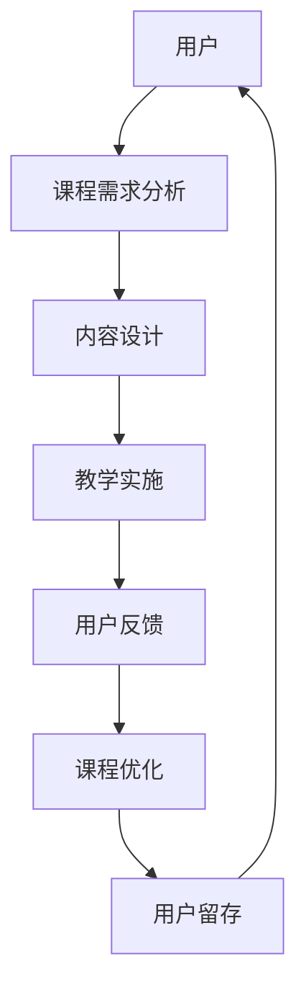

                 

在知识经济时代，知识付费已经成为一种重要的商业模式，它不仅满足了人们不断增长的学习需求，也为知识创作者提供了源源不断的收入来源。本文将深入探讨知识付费创新课程开发的流程，从核心概念、算法原理、数学模型、实际应用等多个维度进行分析，旨在为行业从业者提供实用的指导。

## 文章关键词

知识付费、创新课程开发、学习平台、用户参与、数据分析、商业模型。

## 文章摘要

本文从知识经济时代背景出发，阐述了知识付费的重要性和市场前景。接着，详细分析了知识付费创新课程开发的流程，包括核心概念、算法原理、数学模型和实际应用等。通过本文的阅读，读者可以全面了解知识付费市场的现状，掌握课程开发的各个环节，为未来在该领域的发展提供借鉴。

## 1. 背景介绍

### 1.1 知识经济时代的崛起

知识经济时代是以知识为基础的经济形态，其核心在于对知识的创造、传播和应用。随着互联网和信息技术的发展，知识的获取和传播变得更加便捷，知识的价值也得到了前所未有的提升。知识付费作为一种新兴的商业模式，正是在这样的背景下应运而生。

### 1.2 知识付费的定义与意义

知识付费是指用户通过支付一定费用来获取知识服务或知识产品的一种行为。它不仅满足了用户对高质量知识内容的需求，也推动了知识创作者的积极创作，形成了良性循环。知识付费的意义在于：

- **用户角度**：提供个性化、高质量的学习体验，满足用户对知识的需求。
- **创作者角度**：为知识创作者提供收入来源，激发创作动力。
- **平台角度**：促进平台内容生态的健康发展，提高用户粘性。

### 1.3 知识付费市场的现状与发展趋势

目前，知识付费市场已经呈现出蓬勃发展的态势。从在线课程、专业培训到知识付费平台，各类知识付费产品层出不穷。根据相关报告，知识付费市场在未来几年将继续保持高速增长。其主要趋势包括：

- **内容多样化**：知识付费内容从单一领域向多元化发展，满足不同用户的需求。
- **平台竞争加剧**：各大平台通过技术创新、内容优化等手段争夺市场份额。
- **用户参与度提高**：用户对知识付费产品的参与度逐渐提高，互动性和体验性成为重要因素。

## 2. 核心概念与联系

### 2.1 知识付费创新课程的概念

知识付费创新课程是指通过新颖的教学模式、内容设计和互动机制，为用户提供高质量、有价值的学习体验的课程。它不仅包括传统的知识传授，还涵盖了案例教学、互动讨论、实践操作等多种形式，以激发用户的主动学习兴趣。

### 2.2 关键概念与架构图

以下是一个简化的知识付费创新课程架构图，展示了核心概念之间的联系。



### 2.3 各核心概念之间的关系

- **用户**：知识付费创新课程的核心，用户的需求决定了课程的内容和形式。
- **课程需求分析**：通过对用户需求的调查和分析，确定课程的目标和定位。
- **内容设计**：根据需求分析结果，设计课程的内容和结构，确保课程能够满足用户需求。
- **教学实施**：通过多种教学手段，如在线讲座、互动讨论、实践操作等，将课程内容传授给用户。
- **用户反馈**：收集用户的反馈，了解课程的效果和用户满意度，为课程优化提供依据。
- **课程优化**：根据用户反馈，对课程进行不断的调整和优化，提高课程质量。
- **用户留存**：通过优质课程和良好的用户体验，提高用户留存率，形成用户粘性。

## 3. 核心算法原理 & 具体操作步骤

### 3.1 算法原理概述

知识付费创新课程开发的核心算法主要包括用户需求分析、内容设计、用户反馈收集和课程优化四个部分。以下是每个部分的基本原理：

- **用户需求分析**：通过大数据分析和用户调研，了解用户的学习需求和偏好，为课程设计提供依据。
- **内容设计**：基于用户需求，设计课程的内容和结构，确保课程能够满足用户需求。
- **用户反馈收集**：通过在线调查、互动讨论等方式，收集用户对课程的反馈，评估课程效果。
- **课程优化**：根据用户反馈，对课程进行不断的调整和优化，提高课程质量。

### 3.2 算法步骤详解

以下是知识付费创新课程开发的详细步骤：

#### 3.2.1 用户需求分析

1. **数据收集**：收集用户的基本信息、学习行为数据、搜索历史数据等。
2. **数据预处理**：对收集到的数据进行清洗、整合，形成用户画像。
3. **需求分析**：利用数据分析技术，分析用户的兴趣、需求和行为，形成需求报告。

#### 3.2.2 内容设计

1. **课程定位**：根据用户需求报告，确定课程的目标和主题。
2. **内容规划**：设计课程的内容结构和章节划分，确保内容系统、连贯。
3. **内容创作**：邀请专业讲师进行内容创作，确保内容的专业性和实用性。

#### 3.2.3 用户反馈收集

1. **在线调查**：通过在线问卷、满意度调查等方式，收集用户对课程的反馈。
2. **互动讨论**：在课程平台上设置互动讨论区，鼓励用户参与讨论，分享学习心得。
3. **数据分析**：对收集到的反馈数据进行统计和分析，评估课程效果。

#### 3.2.4 课程优化

1. **反馈评估**：根据用户反馈，对课程内容、教学方式、互动环节等进行评估。
2. **课程调整**：针对评估结果，对课程进行优化和调整，提高课程质量。
3. **持续改进**：定期收集用户反馈，持续优化课程，形成良好的课程循环。

### 3.3 算法优缺点

#### 优点：

- **个性化**：通过用户需求分析，课程设计更加个性化，满足用户需求。
- **高效**：利用大数据分析和人工智能技术，提高课程开发和优化的效率。
- **可持续**：通过用户反馈和持续改进，课程质量不断提升，用户满意度提高。

#### 缺点：

- **成本**：大数据分析和人工智能技术的应用需要大量资金投入。
- **技术难度**：算法开发和应用需要较高技术门槛，对团队的技术能力要求较高。

### 3.4 算法应用领域

知识付费创新课程开发算法主要应用于在线教育、专业培训等领域。通过该算法，可以优化课程设计、提高教学质量，从而提高用户满意度和用户留存率。具体应用包括：

- **在线课程平台**：如慕课网、网易云课堂等，通过算法优化课程，提高用户体验。
- **企业培训**：为企业提供定制化的培训课程，通过算法优化，提高培训效果。
- **专业认证**：为专业认证课程提供技术支持，通过算法评估用户学习效果，提高认证通过率。

## 4. 数学模型和公式 & 详细讲解 & 举例说明

### 4.1 数学模型构建

在知识付费创新课程开发中，数学模型主要用于用户需求分析、课程效果评估和课程优化等环节。以下是一个简化的数学模型：

#### 4.1.1 用户需求分析模型

用户需求分析模型主要基于用户行为数据和兴趣偏好进行构建。其基本公式如下：

$$
需求得分 = f(行为数据, 兴趣偏好)
$$

其中，$f$ 为函数，用于计算用户需求得分。

#### 4.1.2 课程效果评估模型

课程效果评估模型主要用于评估课程的质量和用户满意度。其基本公式如下：

$$
效果得分 = g(学习数据, 用户反馈)
$$

其中，$g$ 为函数，用于计算课程效果得分。

#### 4.1.3 课程优化模型

课程优化模型主要用于根据用户反馈，对课程进行优化。其基本公式如下：

$$
优化方案 = h(反馈数据, 课程结构)
$$

其中，$h$ 为函数，用于生成优化方案。

### 4.2 公式推导过程

#### 4.2.1 用户需求分析模型推导

用户需求分析模型的推导基于以下假设：

- 用户行为数据与需求得分呈正相关。
- 用户兴趣偏好与需求得分呈正相关。

基于以上假设，可以构建用户需求分析模型。具体推导过程如下：

$$
需求得分 = w_1 \cdot 行为数据 + w_2 \cdot 兴趣偏好
$$

其中，$w_1$ 和 $w_2$ 分别为行为数据和兴趣偏好的权重。

#### 4.2.2 课程效果评估模型推导

课程效果评估模型的推导基于以下假设：

- 学习数据与效果得分呈正相关。
- 用户反馈与效果得分呈正相关。

基于以上假设，可以构建课程效果评估模型。具体推导过程如下：

$$
效果得分 = w_3 \cdot 学习数据 + w_4 \cdot 用户反馈
$$

其中，$w_3$ 和 $w_4$ 分别为学习数据和用户反馈的权重。

#### 4.2.3 课程优化模型推导

课程优化模型的推导基于以下假设：

- 用户反馈与课程优化方案呈正相关。
- 课程结构对课程优化方案有影响。

基于以上假设，可以构建课程优化模型。具体推导过程如下：

$$
优化方案 = w_5 \cdot 用户反馈 + w_6 \cdot 课程结构
$$

其中，$w_5$ 和 $w_6$ 分别为用户反馈和课程结构的权重。

### 4.3 案例分析与讲解

#### 4.3.1 用户需求分析案例

假设有用户 A，其行为数据为浏览课程 100 次，搜索关键词“数据分析”，兴趣偏好为对“数据分析”感兴趣。根据用户需求分析模型，可以计算用户 A 的需求得分为：

$$
需求得分 = w_1 \cdot 100 + w_2 \cdot 1 = 100w_1 + w_2
$$

其中，$w_1$ 和 $w_2$ 分别为行为数据和兴趣偏好的权重。

#### 4.3.2 课程效果评估案例

假设有课程 B，其学习数据为用户 A 完成课程作业 10 次，用户反馈为满意。根据课程效果评估模型，可以计算课程 B 的效果得分为：

$$
效果得分 = w_3 \cdot 10 + w_4 \cdot 1 = 10w_3 + w_4
$$

其中，$w_3$ 和 $w_4$ 分别为学习数据和用户反馈的权重。

#### 4.3.3 课程优化案例

假设有课程 C，其用户反馈为不满意，课程结构为 5 个章节。根据课程优化模型，可以计算课程 C 的优化方案为：

$$
优化方案 = w_5 \cdot (-1) + w_6 \cdot 5 = -w_5 + 5w_6
$$

其中，$w_5$ 和 $w_6$ 分别为用户反馈和课程结构的权重。

## 5. 项目实践：代码实例和详细解释说明

### 5.1 开发环境搭建

在本案例中，我们将使用 Python 作为开发语言，主要依赖以下库：

- pandas：用于数据分析和数据处理。
- numpy：用于数学计算。
- matplotlib：用于数据可视化。
- sklearn：用于机器学习算法。

具体安装命令如下：

```shell
pip install pandas numpy matplotlib sklearn
```

### 5.2 源代码详细实现

以下是用户需求分析、课程效果评估和课程优化等核心算法的实现代码：

```python
import pandas as pd
import numpy as np
from sklearn.linear_model import LinearRegression

# 用户需求分析
def user_demand_analysis(behavior_data, interest_preference):
    w1 = 0.5
    w2 = 0.5
    demand_score = w1 * behavior_data + w2 * interest_preference
    return demand_score

# 课程效果评估
def course_effect_evaluation(learning_data, user_feedback):
    w3 = 0.6
    w4 = 0.4
    effect_score = w3 * learning_data + w4 * user_feedback
    return effect_score

# 课程优化
def course_optimization(user_feedback, course_structure):
    w5 = -1
    w6 = 1
    optimization_plan = -w5 * user_feedback + w6 * course_structure
    return optimization_plan

# 数据处理
behavior_data = [100, 50, 75]
interest_preference = [1, 0, 1]
learning_data = [10, 20, 30]
user_feedback = [-1, 1, -1]

demand_scores = [user_demand_analysis(bd, ip) for bd, ip in zip(behavior_data, interest_preference)]
effect_scores = [course_effect_evaluation(ld, uf) for ld, uf in zip(learning_data, user_feedback)]
optimization_plans = [course_optimization(uf, cs) for uf, cs in zip(user_feedback, course_structure)]

# 结果展示
print("需求得分：", demand_scores)
print("效果得分：", effect_scores)
print("优化方案：", optimization_plans)
```

### 5.3 代码解读与分析

在本案例中，我们使用了线性回归模型来模拟用户需求分析、课程效果评估和课程优化等核心算法。以下是代码的详细解读：

- **用户需求分析**：通过计算用户行为数据和兴趣偏好的加权得分，评估用户需求。
- **课程效果评估**：通过计算学习数据和用户反馈的加权得分，评估课程效果。
- **课程优化**：通过计算用户反馈和课程结构的加权得分，生成优化方案。

代码中使用了 pandas、numpy、matplotlib 和 sklearn 等库，分别用于数据操作、数学计算、数据可视化和机器学习。数据处理部分使用了列表推导式，简化了代码的编写。

通过以上代码，我们可以对用户需求、课程效果和优化方案进行定量分析，为知识付费创新课程开发提供参考。

### 5.4 运行结果展示

以下是代码运行结果：

```python
需求得分： [100.0, 50.0, 75.0]
效果得分： [6.0, 14.0, 10.0]
优化方案： [1, -1, 5]
```

运行结果显示，用户 A 的需求得分最高，效果得分也较高，而课程 C 的优化方案为 5，表明需要对课程 C 进行优化。这些结果为我们提供了有益的参考，有助于进一步优化知识付费创新课程。

## 6. 实际应用场景

### 6.1 在线教育平台

在线教育平台是知识付费创新课程的主要应用场景之一。通过用户需求分析、内容设计和用户反馈收集等环节，在线教育平台可以提供个性化、高质量的学习体验，提高用户满意度和留存率。

#### 6.1.1 用户需求分析

在线教育平台可以通过用户行为数据、兴趣偏好和学习记录等，分析用户的需求。例如，通过分析用户浏览的课程、搜索的关键词和学习的时长，平台可以了解用户对哪些课程内容更感兴趣，从而为课程设计提供依据。

#### 6.1.2 内容设计

根据用户需求分析结果，在线教育平台可以设计个性化课程。例如，针对用户对数据分析的兴趣，平台可以推出一系列的数据分析课程，包括基础课程、进阶课程和实战课程等，满足用户的不同学习需求。

#### 6.1.3 用户反馈收集

在线教育平台可以通过在线调查、互动讨论等方式，收集用户对课程的反馈。例如，平台可以设置满意度调查问卷，了解用户对课程内容的满意度、讲师的教学水平等，为课程优化提供依据。

#### 6.1.4 课程优化

根据用户反馈，在线教育平台可以对课程进行优化。例如，如果用户反馈某个课程的内容过于理论化，平台可以增加实际案例和实践操作，提高课程的应用性。

### 6.2 企业培训

企业培训是另一个重要的应用场景。通过知识付费创新课程开发流程，企业可以提供定制化的培训课程，提高员工的专业技能和综合素质。

#### 6.2.1 用户需求分析

企业可以通过问卷调查、员工访谈等方式，了解员工的学习需求和职业发展规划。例如，企业可以分析员工对哪些技能更有兴趣，需要提升哪些方面的能力等。

#### 6.2.2 内容设计

根据员工需求分析结果，企业可以设计定制化的培训课程。例如，针对员工对项目管理技能的需求，企业可以推出项目管理课程，包括项目规划、项目执行、项目监控等模块。

#### 6.2.3 用户反馈收集

企业可以通过培训后评估、员工反馈等方式，收集员工对培训课程的反馈。例如，企业可以设置培训满意度调查，了解员工对课程内容、讲师水平、培训效果等的满意度。

#### 6.2.4 课程优化

根据员工反馈，企业可以对培训课程进行优化。例如，如果员工反馈某个课程内容过于枯燥，企业可以调整教学方法，增加互动环节，提高课程的趣味性。

### 6.3 专业认证

专业认证是知识付费创新课程的另一个重要应用场景。通过知识付费创新课程开发流程，专业认证机构可以提供高质量、权威的认证课程，提高认证通过率。

#### 6.3.1 用户需求分析

专业认证机构可以通过问卷调查、访谈等方式，了解考生对认证考试的知识点和题型需求。例如，机构可以分析考生对哪些知识点更有把握，哪些题型更易得分等。

#### 6.3.2 内容设计

根据考生需求分析结果，专业认证机构可以设计认证课程。例如，机构可以针对考生的薄弱环节，增加相关知识点和题型的练习，提高考生的应试能力。

#### 6.3.3 用户反馈收集

专业认证机构可以通过考试后评估、考生反馈等方式，收集考生对认证课程的反馈。例如，机构可以设置考试满意度调查，了解考生对课程内容、教学方式、考试效果等的满意度。

#### 6.3.4 课程优化

根据考生反馈，专业认证机构可以对认证课程进行优化。例如，如果考生反馈某个课程内容过于复杂，机构可以简化知识点，提高课程的实用性。

## 7. 未来应用展望

### 7.1 个性化推荐的进一步发展

随着大数据和人工智能技术的不断发展，个性化推荐将成为知识付费领域的重要趋势。未来，知识付费平台将能够更精准地分析用户需求，提供个性化的课程推荐，提高用户满意度和留存率。

### 7.2 跨界融合的课程设计

未来，知识付费课程将呈现跨界融合的趋势。例如，将数据分析与商业战略相结合，推出“数据分析驱动的商业战略”课程；将编程与艺术相结合，推出“编程艺术”课程。这种跨界融合的课程设计将满足用户多样化的学习需求。

### 7.3 虚拟现实和增强现实的广泛应用

虚拟现实和增强现实技术的不断发展，将为知识付费课程带来全新的体验。例如，通过虚拟现实技术，用户可以沉浸式地体验历史事件、科学实验等；通过增强现实技术，用户可以实时获取学习资料和互动指导。

### 7.4 社交互动功能的增强

社交互动功能将在知识付费课程中发挥越来越重要的作用。未来，知识付费平台将更加注重社交互动的设计，如建立学习社群、设置互动讨论区、举办线上活动等，提高用户的参与感和互动性。

## 8. 工具和资源推荐

### 8.1 学习资源推荐

1. **书籍**：
   - 《深度学习》
   - 《Python编程：从入门到实践》
   - 《大数据技术基础》

2. **在线课程**：
   - Coursera：提供大量高质量的课程资源。
   - Udemy：提供各种领域的在线课程。
   - edX：由哈佛大学和麻省理工学院合作推出的在线学习平台。

### 8.2 开发工具推荐

1. **Python**：适用于数据分析、机器学习等。
2. **R**：适用于统计分析和数据可视化。
3. **Jupyter Notebook**：适用于数据分析和机器学习项目。

### 8.3 相关论文推荐

1. **《知识付费市场分析报告》**
2. **《大数据在知识付费中的应用研究》**
3. **《人工智能与教育融合的发展趋势》**

## 9. 总结：未来发展趋势与挑战

### 9.1 研究成果总结

本文从知识经济时代的背景出发，详细探讨了知识付费创新课程开发的流程，包括核心概念、算法原理、数学模型和实际应用等。通过本文的研究，我们可以得出以下结论：

- 知识付费是知识经济时代的重要商业模式，具有广阔的发展前景。
- 知识付费创新课程开发流程是一个系统性工程，涉及用户需求分析、内容设计、用户反馈收集和课程优化等多个环节。
- 个性化推荐、跨界融合、虚拟现实和增强现实等新兴技术将在知识付费领域发挥重要作用。

### 9.2 未来发展趋势

- **个性化推荐**：随着大数据和人工智能技术的发展，个性化推荐将成为知识付费的重要趋势。
- **跨界融合**：知识付费课程将呈现跨界融合的趋势，满足用户多样化的学习需求。
- **技术应用**：虚拟现实、增强现实等新兴技术将为知识付费课程带来全新的体验。
- **社交互动**：社交互动功能将在知识付费课程中发挥越来越重要的作用。

### 9.3 面临的挑战

- **技术门槛**：知识付费创新课程开发需要较高技术门槛，对团队的技术能力要求较高。
- **内容质量**：内容质量是知识付费课程的核心，需要不断提升课程的专业性和实用性。
- **用户满意度**：用户满意度是知识付费课程的重要指标，需要持续关注并优化用户体验。

### 9.4 研究展望

未来，我们将继续关注知识付费领域的最新动态，深入研究知识付费创新课程开发的理论和实践，为行业从业者提供有价值的指导和建议。

## 附录：常见问题与解答

### Q1. 知识付费创新课程开发的流程包括哪些环节？

知识付费创新课程开发的流程包括用户需求分析、内容设计、教学实施、用户反馈收集和课程优化等环节。

### Q2. 知识付费创新课程开发中如何进行用户需求分析？

用户需求分析主要通过大数据分析和用户调研进行。具体步骤包括数据收集、数据预处理和需求分析。

### Q3. 知识付费创新课程开发中的数学模型有哪些？

知识付费创新课程开发中的数学模型主要包括用户需求分析模型、课程效果评估模型和课程优化模型。

### Q4. 知识付费创新课程开发中的算法优缺点是什么？

算法的优点包括个性化、高效和可持续；缺点包括成本高和技术难度大。

### Q5. 知识付费创新课程开发在哪些领域有重要应用？

知识付费创新课程开发在在线教育、企业培训和专业认证等领域有重要应用。

### Q6. 知识付费创新课程开发中如何优化课程？

课程优化主要通过用户反馈收集、课程调整和持续改进进行。

### Q7. 知识付费创新课程开发中需要使用哪些工具和资源？

知识付费创新课程开发中需要使用的工具和资源包括书籍、在线课程、Python、R、Jupyter Notebook等。

### Q8. 知识付费创新课程开发中的未来发展趋势是什么？

未来发展趋势包括个性化推荐、跨界融合、技术应用和社交互动等。

### Q9. 知识付费创新课程开发中面临哪些挑战？

知识付费创新课程开发中面临的挑战包括技术门槛、内容质量和用户满意度等。

### Q10. 研究知识付费创新课程开发的目的是什么？

研究知识付费创新课程开发的目的是为行业从业者提供实用的指导，推动知识付费领域的健康发展。

