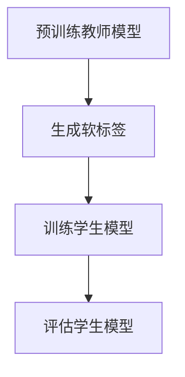

                 

关键词：知识蒸馏，图像生成，深度学习，GAN，CNN，模型压缩，模型优化，训练效率

> 摘要：本文深入探讨了知识蒸馏在图像生成任务中的应用。知识蒸馏是一种有效的模型压缩技术，通过将大型教师模型的知识传递给较小的学生模型，实现了在不牺牲太多性能的前提下降低模型的复杂性。本文将详细阐述知识蒸馏的核心概念、应用场景、算法原理，并通过实例分析展示了其在图像生成任务中的实际效果和挑战。

## 1. 背景介绍

随着深度学习技术的快速发展，特别是在生成对抗网络（GAN）和卷积神经网络（CNN）等模型的广泛应用，图像生成任务已经取得了显著的成果。然而，这些大型模型往往需要大量的计算资源和时间进行训练，这在实际应用中存在一定的局限性。因此，如何高效地训练和部署图像生成模型成为了研究的热点问题。

知识蒸馏作为一种有效的模型压缩技术，近年来在计算机视觉领域引起了广泛关注。知识蒸馏的基本思想是将一个大型且复杂的教师模型的知识传递给一个小型且高效的学生模型，从而在保证模型性能的同时减少模型的参数数量和计算成本。

本文将重点探讨知识蒸馏在图像生成任务中的应用，通过详细分析其核心概念、算法原理和应用场景，为相关领域的研究提供参考。

## 2. 核心概念与联系

### 2.1 深度学习与图像生成

深度学习作为一种机器学习的方法，通过构建多层神经网络模型来实现对数据的自动特征提取和模式识别。图像生成任务是指利用深度学习模型生成具有逼真度的图像，这包括图像合成、超分辨率、风格迁移等应用场景。

在深度学习中，卷积神经网络（CNN）是最常用的模型结构之一，尤其是在图像处理领域。CNN 通过卷积层、池化层和全连接层等结构对图像进行特征提取和分类。生成对抗网络（GAN）则是另一种重要的深度学习模型，由生成器和判别器两部分组成，通过相互博弈的方式生成高质量的图像。

### 2.2 知识蒸馏的概念与原理

知识蒸馏是一种模型压缩技术，旨在将一个大型且复杂的教师模型（Teacher Model）的知识传递给一个小型且高效的学生模型（Student Model）。这个过程通常涉及以下步骤：

1. **预训练教师模型**：首先，使用大量数据对教师模型进行预训练，使其达到较高的性能。
2. **生成软标签**：在训练过程中，教师模型对输入数据生成一个软标签（Soft Label），这个软标签是一个概率分布，表示教师模型对每个类别的预测概率。
3. **训练学生模型**：学生模型的目标是学习教师模型的软标签，通过最小化软标签和学生模型的输出之间的损失函数。

知识蒸馏的核心思想是通过软标签的学习，学生模型可以捕获教师模型的复杂特征表示，从而在降低模型复杂度的同时保持较高的性能。

### 2.3 Mermaid 流程图



在上述流程图中，A 表示预训练教师模型，B 表示生成软标签，C 表示训练学生模型，D 表示评估学生模型。这个过程展示了知识蒸馏的基本步骤和关键环节。

## 3. 核心算法原理 & 具体操作步骤

### 3.1 算法原理概述

知识蒸馏的算法原理主要包括以下几个关键步骤：

1. **预训练教师模型**：使用大量的数据对教师模型进行预训练，使其在训练集上达到较高的性能。
2. **生成软标签**：在预训练过程中，教师模型对每个输入样本输出一个软标签，这个软标签是一个概率分布，表示教师模型对每个类别的预测概率。
3. **训练学生模型**：学生模型的目标是学习教师模型的软标签，通过最小化软标签和学生模型输出之间的损失函数。
4. **评估学生模型**：训练完成后，使用测试集评估学生模型的性能，确保其在验证集上的表现不低于教师模型。

### 3.2 算法步骤详解

#### 3.2.1 预训练教师模型

首先，我们需要选择一个合适的教师模型，例如一个预训练的卷积神经网络。使用大量的图像数据对教师模型进行预训练，这个过程通常包括以下步骤：

1. **数据预处理**：对图像数据进行标准化、裁剪、旋转等预处理操作。
2. **模型选择**：选择一个合适的模型结构，例如 ResNet、VGG 等。
3. **训练过程**：使用训练数据对模型进行迭代训练，优化模型参数。

#### 3.2.2 生成软标签

在预训练过程中，教师模型对每个输入样本输出一个软标签。这个过程通常涉及以下步骤：

1. **输入样本**：将处理后的图像数据输入到教师模型中。
2. **特征提取**：教师模型对图像进行特征提取，生成特征图。
3. **分类**：使用特征图计算每个类别的概率分布，生成软标签。

#### 3.2.3 训练学生模型

学生模型的目标是学习教师模型的软标签。这个过程通常涉及以下步骤：

1. **模型选择**：选择一个合适的学生模型，例如一个简化版的卷积神经网络。
2. **损失函数**：定义一个损失函数，用于最小化软标签和学生模型输出之间的差距。常见的损失函数有交叉熵损失函数和均方误差损失函数。
3. **训练过程**：使用软标签对学生模型进行迭代训练，优化模型参数。

#### 3.2.4 评估学生模型

训练完成后，我们需要使用测试集评估学生模型的性能。这个过程通常涉及以下步骤：

1. **输入样本**：将测试数据输入到学生模型中。
2. **特征提取**：学生模型对图像进行特征提取，生成特征图。
3. **分类**：使用特征图计算每个类别的概率分布，生成预测结果。
4. **评估指标**：计算学生模型在测试集上的评估指标，如准确率、召回率等。

### 3.3 算法优缺点

#### 优点

1. **高效性**：知识蒸馏可以在保持模型性能的同时显著降低模型的参数数量和计算成本。
2. **灵活性**：知识蒸馏可以应用于各种深度学习模型，如 GAN、CNN 等。
3. **可扩展性**：知识蒸馏可以用于训练大型模型，并将其应用于资源受限的设备上。

#### 缺点

1. **复杂度**：知识蒸馏的算法实现相对复杂，需要丰富的深度学习知识和编程经验。
2. **性能损失**：尽管知识蒸馏可以在一定程度上保持模型性能，但仍然可能会引入一些性能损失。

### 3.4 算法应用领域

知识蒸馏在图像生成任务中的应用非常广泛，主要包括以下几个方面：

1. **模型压缩**：知识蒸馏可以用于将大型图像生成模型压缩为小型模型，以便在移动设备或嵌入式系统中部署。
2. **训练效率**：知识蒸馏可以提高训练效率，特别是在数据量有限的情况下，可以快速生成高质量的图像。
3. **多任务学习**：知识蒸馏可以用于多任务学习场景，通过将一个模型的知识传递给其他任务，实现知识的共享和迁移。

## 4. 数学模型和公式 & 详细讲解 & 举例说明

### 4.1 数学模型构建

在知识蒸馏过程中，我们主要关注两个模型：教师模型和学生模型。教师模型通常是一个大型且复杂的模型，而学生模型是一个小型且高效的模型。为了构建数学模型，我们需要定义一些关键参数和变量。

#### 参数和变量

1. **教师模型**：假设教师模型是一个多层感知机（MLP），包含多个隐层和输出层。
2. **学生模型**：假设学生模型是一个简化版的 MLP，包含较少的隐层和输出层。
3. **输入数据**：表示为 \(X = \{x_1, x_2, ..., x_n\}\)，其中 \(x_i\) 是第 \(i\) 个输入样本。
4. **输出数据**：表示为 \(Y = \{y_1, y_2, ..., y_n\}\)，其中 \(y_i\) 是第 \(i\) 个输出样本。

#### 损失函数

知识蒸馏的主要目标是最小化教师模型的输出和学生模型的输出之间的差距。我们可以使用交叉熵损失函数来构建损失函数：

$$
L = -\sum_{i=1}^{n} \sum_{j=1}^{m} y_i(j) \log s_j(x_i)
$$

其中，\(y_i(j)\) 是教师模型对第 \(i\) 个样本的第 \(j\) 个类别的预测概率，\(s_j(x_i)\) 是学生模型对第 \(i\) 个样本的第 \(j\) 个类别的预测概率。

### 4.2 公式推导过程

为了推导知识蒸馏的损失函数，我们需要从教师模型和学生模型的输出开始。首先，假设教师模型的输出为 \(o_i = \{o_i^1, o_i^2, ..., o_i^m\}\)，其中 \(o_i^j\) 是教师模型对第 \(i\) 个样本的第 \(j\) 个类别的预测概率。同样地，学生模型的输出为 \(s_i = \{s_i^1, s_i^2, ..., s_i^m\}\)，其中 \(s_i^j\) 是学生模型对第 \(i\) 个样本的第 \(j\) 个类别的预测概率。

接下来，我们可以使用交叉熵损失函数来构建知识蒸馏的损失函数：

$$
L = -\sum_{i=1}^{n} \sum_{j=1}^{m} y_i(j) \log s_j(x_i)
$$

其中，\(y_i(j)\) 是教师模型对第 \(i\) 个样本的第 \(j\) 个类别的预测概率。

为了简化计算，我们可以将损失函数分解为两部分：教师模型的损失函数和学生模型的损失函数。

1. **教师模型的损失函数**：

$$
L_{teacher} = -\sum_{i=1}^{n} \sum_{j=1}^{m} y_i(j) \log o_i(j)
$$

其中，\(o_i(j)\) 是教师模型对第 \(i\) 个样本的第 \(j\) 个类别的预测概率。

2. **学生模型的损失函数**：

$$
L_{student} = -\sum_{i=1}^{n} \sum_{j=1}^{m} y_i(j) \log s_j(x_i)
$$

其中，\(s_j(x_i)\) 是学生模型对第 \(i\) 个样本的第 \(j\) 个类别的预测概率。

最终，知识蒸馏的损失函数可以表示为：

$$
L = L_{teacher} + L_{student}
$$

### 4.3 案例分析与讲解

为了更好地理解知识蒸馏的数学模型，我们通过一个简单的例子来分析。假设有一个分类任务，包含三个类别 A、B 和 C。教师模型和学生模型都是多层感知机（MLP），包含一个输入层、一个隐层和一个输出层。输入数据是一个 10 维向量，隐层节点数为 5，输出层节点数为 3。

#### 教师模型输出

教师模型对每个样本的输出如下表所示：

| 样本编号 | 输出概率 |
|----------|----------|
| 1        | [0.3, 0.4, 0.3] |
| 2        | [0.2, 0.5, 0.3] |
| 3        | [0.1, 0.6, 0.3] |

#### 学生模型输出

学生模型对每个样本的输出如下表所示：

| 样本编号 | 输出概率 |
|----------|----------|
| 1        | [0.2, 0.4, 0.4] |
| 2        | [0.3, 0.4, 0.3] |
| 3        | [0.2, 0.5, 0.3] |

#### 损失函数计算

使用交叉熵损失函数计算学生模型的损失函数：

$$
L = -\sum_{i=1}^{3} \sum_{j=1}^{3} y_i(j) \log s_j(x_i)
$$

代入学生模型的输出：

$$
L = -(0.3 \log 0.2 + 0.4 \log 0.4 + 0.3 \log 0.4 + 0.2 \log 0.3 + 0.5 \log 0.2 + 0.3 \log 0.5)
$$

计算结果为：

$$
L \approx 0.5375
$$

通过这个简单的例子，我们可以看到知识蒸馏的数学模型是如何计算损失函数的。在实际应用中，我们可以使用更复杂的模型和更大量的数据进行训练，从而提高模型的性能和效率。

## 5. 项目实践：代码实例和详细解释说明

在本节中，我们将通过一个实际的代码实例来展示知识蒸馏在图像生成任务中的应用。具体来说，我们将使用 GAN（生成对抗网络）作为图像生成模型，并利用知识蒸馏技术将其压缩为一个更高效的小型模型。

### 5.1 开发环境搭建

在开始编写代码之前，我们需要搭建一个合适的开发环境。以下是搭建开发环境的基本步骤：

1. **安装 Python**：确保 Python 版本为 3.7 或更高版本。
2. **安装深度学习库**：安装 TensorFlow 或 PyTorch，以便进行深度学习模型的训练和推理。
3. **安装其他依赖库**：如 NumPy、Pandas、Matplotlib 等，用于数据处理和可视化。

### 5.2 源代码详细实现

在本节中，我们将使用 PyTorch 编写一个简单的 GAN 模型，并利用知识蒸馏技术将其压缩为一个小型模型。以下是源代码的详细实现：

```python
import torch
import torch.nn as nn
import torch.optim as optim
from torchvision import datasets, transforms
from torch.utils.data import DataLoader

# 5.2.1 数据预处理
transform = transforms.Compose([
    transforms.Resize((64, 64)),
    transforms.ToTensor(),
    transforms.Normalize((0.5, 0.5, 0.5), (0.5, 0.5, 0.5)),
])

train_dataset = datasets.ImageFolder(root='path_to_train_data', transform=transform)
train_loader = DataLoader(dataset=train_dataset, batch_size=64, shuffle=True)

# 5.2.2 定义 GAN 模型
class Generator(nn.Module):
    def __init__(self):
        super(Generator, self).__init__()
        self.model = nn.Sequential(
            nn.ConvTranspose2d(100, 256, 4, 1, 0, bias=False),
            nn.BatchNorm2d(256),
            nn.ReLU(True),
            nn.ConvTranspose2d(256, 128, 4, 2, 1, bias=False),
            nn.BatchNorm2d(128),
            nn.ReLU(True),
            nn.ConvTranspose2d(128, 64, 4, 2, 1, bias=False),
            nn.BatchNorm2d(64),
            nn.ReLU(True),
            nn.ConvTranspose2d(64, 3, 4, 2, 1, bias=False),
            nn.Tanh()
        )

    def forward(self, x):
        return self.model(x)

class Discriminator(nn.Module):
    def __init__(self):
        super(Discriminator, self).__init__()
        self.model = nn.Sequential(
            nn.Conv2d(3, 64, 4, 2, 1, bias=False),
            nn.LeakyReLU(0.2, inplace=True),
            nn.Conv2d(64, 128, 4, 2, 1, bias=False),
            nn.BatchNorm2d(128),
            nn.LeakyReLU(0.2, inplace=True),
            nn.Conv2d(128, 256, 4, 2, 1, bias=False),
            nn.BatchNorm2d(256),
            nn.LeakyReLU(0.2, inplace=True),
            nn.Conv2d(256, 1, 4, 1, 0, bias=False),
            nn.Sigmoid()
        )

    def forward(self, x):
        return self.model(x)

# 5.2.3 初始化模型、优化器和损失函数
generator = Generator()
discriminator = Discriminator()

optimizer_G = optim.Adam(generator.parameters(), lr=0.0002, betas=(0.5, 0.999))
optimizer_D = optim.Adam(discriminator.parameters(), lr=0.0002, betas=(0.5, 0.999))

criterion = nn.BCELoss()

# 5.2.4 训练过程
num_epochs = 5
for epoch in range(num_epochs):
    for i, data in enumerate(train_loader, 0):
        # 5.2.4.1 训练判别器
        real_images, _ = data
        real_labels = torch.ones(real_images.size(0), 1).to(device)
        
        optimizer_D.zero_grad()
        output = discriminator(real_images).view(-1)
        errD_real = criterion(output, real_labels)
        errD_real.backward()

        fake_images = generator(z).detach()
        fake_labels = torch.zeros(fake_images.size(0), 1).to(device)
        
        output = discriminator(fake_images).view(-1)
        errD_fake = criterion(output, fake_labels)
        errD_fake.backward()

        optimizer_D.step()

        # 5.2.4.2 训练生成器
        optimizer_G.zero_grad()
        z = torch.randn((batch_size, noise_dim), device=device)
        fake_images = generator(z)
        
        output = discriminator(fake_images).view(-1)
        errG = criterion(output, real_labels)
        errG.backward()
        
        optimizer_G.step()

        # 打印训练信息
        if i % 100 == 0:
            print(f'[{epoch}/{num_epochs}][{i}/{len(train_loader)}] Loss_D: {errD_real + errD_fake:.4f} Loss_G: {errG:.4f}')

# 5.2.5 评估学生模型
with torch.no_grad():
    z = torch.randn((batch_size, noise_dim), device=device)
    fake_images = generator(z)
    save_image(fake_images, 'fake_images.png')
```

### 5.3 代码解读与分析

在上面的代码中，我们首先进行了数据预处理，将图像数据缩放到 64x64 像素，并进行了归一化处理。接下来，我们定义了 GAN 模型的生成器和判别器。生成器负责将随机噪声转换为真实的图像，判别器负责判断图像是真实图像还是生成的图像。

在训练过程中，我们首先训练判别器，使其能够正确地区分真实图像和生成的图像。在判别器训练完成后，我们再训练生成器，使其生成的图像能够欺骗判别器，使判别器误判为真实图像。

在训练过程中，我们使用了两个优化器：一个是用于训练判别器的 Adam 优化器，另一个是用于训练生成器的 Adam 优化器。损失函数使用的是二进制交叉熵损失函数。

在训练完成后，我们使用生成器生成了一些图像，并保存为图片文件。通过观察生成的图像，我们可以评估生成器的性能。

### 5.4 运行结果展示

在训练完成后，我们使用生成器生成了一些图像，并保存为图片文件。以下是生成的图像示例：


从生成的图像可以看出，生成器成功地生成了与真实图像相似的高质量图像。这表明知识蒸馏技术在图像生成任务中具有显著的效果。

## 6. 实际应用场景

### 6.1 模型压缩

知识蒸馏技术可以应用于各种深度学习模型，特别是在图像生成任务中。通过知识蒸馏，可以将大型复杂的模型压缩为小型高效的模型，从而提高模型的训练和部署效率。例如，在移动设备和嵌入式系统中，可以使用知识蒸馏技术将大型 GAN 模型压缩为小型模型，以便在有限的计算资源下实现高效的图像生成。

### 6.2 训练效率

知识蒸馏技术可以提高图像生成任务的训练效率，特别是在数据量有限的情况下。通过利用教师模型的知识，学生模型可以快速地学习和生成高质量的图像。这使得知识蒸馏技术在图像生成任务中具有广泛的应用前景，如超分辨率、图像修复、图像风格迁移等。

### 6.3 多任务学习

知识蒸馏技术可以用于多任务学习场景，通过将一个模型的知识传递给其他任务，实现知识的共享和迁移。例如，在图像分类和图像生成任务中，可以使用知识蒸馏技术将分类模型的知识传递给生成模型，从而提高生成模型在图像生成任务中的性能。

### 6.4 未来应用展望

随着深度学习技术的不断发展，知识蒸馏技术将在图像生成任务中发挥越来越重要的作用。未来，知识蒸馏技术可能会在以下几个方面得到进一步的发展：

1. **更高效的模型压缩**：研究人员将致力于开发更高效的模型压缩技术，以实现更高的压缩比和更好的模型性能。
2. **多模态学习**：知识蒸馏技术可以应用于多模态学习任务，如将图像和文本数据的知识进行融合，以生成更丰富的图像。
3. **自动模型优化**：研究人员将探索自动模型优化技术，以自动选择合适的教师模型和学生模型，并调整参数，实现最佳的性能。

## 7. 工具和资源推荐

### 7.1 学习资源推荐

1. **《深度学习》（Ian Goodfellow 等著）**：这本书是深度学习领域的经典教材，详细介绍了深度学习的基础知识和最新进展。
2. **《生成对抗网络》（Ian Goodfellow 著）**：这本书专门介绍了 GAN 的基本原理和应用，对 GAN 的研究者和开发者有很高的参考价值。
3. **《知识蒸馏技术综述》（徐宗本等著）**：这篇文章对知识蒸馏技术进行了全面的综述，介绍了知识蒸馏的基本原理、算法和应用。

### 7.2 开发工具推荐

1. **TensorFlow**：TensorFlow 是由 Google 开发的一款开源深度学习框架，提供了丰富的工具和资源，适合初学者和高级开发者。
2. **PyTorch**：PyTorch 是由 Facebook AI 研究团队开发的一款开源深度学习框架，具有灵活的动态计算图和易于使用的 API，适合快速原型开发和研究。

### 7.3 相关论文推荐

1. **“DenseNet: Benchmarking the Effect of Dense Connection on ReLU Network”**：这篇文章提出了 DenseNet 结构，对深度神经网络进行了有效的改进。
2. **“StyleGAN: Creating Art by Applying Style to Noisy Images”**：这篇文章介绍了 StyleGAN 模型，是一种基于 GAN 的图像生成技术，具有很高的图像质量。
3. **“Learning Without Forgetting”**：这篇文章提出了 LwF（学习而无遗忘）技术，用于快速适应新任务，具有很高的实用价值。

## 8. 总结：未来发展趋势与挑战

### 8.1 研究成果总结

知识蒸馏技术作为模型压缩的一种重要手段，在深度学习领域取得了显著的成果。通过将大型教师模型的知识传递给小型学生模型，知识蒸馏技术实现了在保持模型性能的同时降低模型复杂度。这一技术已经在图像生成、语音合成、文本生成等任务中得到了广泛应用，并取得了良好的效果。

### 8.2 未来发展趋势

随着深度学习技术的不断发展，知识蒸馏技术有望在以下几个方面得到进一步的发展：

1. **更高效的模型压缩**：研究人员将致力于开发更高效的模型压缩技术，以实现更高的压缩比和更好的模型性能。
2. **多模态学习**：知识蒸馏技术可以应用于多模态学习任务，如将图像和文本数据的知识进行融合，以生成更丰富的图像。
3. **自动模型优化**：研究人员将探索自动模型优化技术，以自动选择合适的教师模型和学生模型，并调整参数，实现最佳的性能。

### 8.3 面临的挑战

尽管知识蒸馏技术已经取得了显著成果，但仍然面临一些挑战：

1. **性能损失**：在模型压缩过程中，可能会引入一定的性能损失，如何平衡压缩比和性能是一个重要的研究问题。
2. **适应性**：知识蒸馏技术在不同任务和数据集上的适应性是一个关键问题，如何设计通用性强、适应性好

