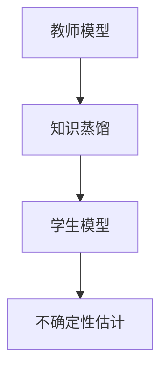

                 

关键词：知识蒸馏、模型不确定性估计、深度学习、机器学习、人工智能

摘要：本文探讨了知识蒸馏在改善模型不确定性估计方面的作用。知识蒸馏是一种训练大型模型的方法，通过将其知识与参数传递给一个小型模型，以减少计算成本和提高模型性能。本文详细介绍了知识蒸馏的基本原理、算法步骤、数学模型以及实际应用场景，并分析了其优缺点和未来发展趋势。

## 1. 背景介绍

在深度学习和机器学习领域，模型的不确定性估计（Uncertainty Estimation）一直是一个重要的研究方向。随着深度神经网络在各个领域的广泛应用，如何准确地估计模型输出的不确定性成为了一个关键问题。传统的深度学习模型通常只能给出一个确定的输出结果，无法提供关于结果可靠性的信息。然而，在许多实际应用场景中，如医疗诊断、自动驾驶、金融风险评估等，了解模型输出的不确定性是非常重要的。

### 模型不确定性估计的意义

模型不确定性估计对于提高模型决策的可靠性和安全性具有重要意义。首先，准确的模型不确定性估计可以帮助决策者更好地理解模型的局限性和潜在风险，从而做出更加明智的决策。其次，模型的不确定性估计可以为自动化决策系统提供重要的反馈信息，以便进行自适应调整和优化。此外，模型不确定性估计还可以帮助研究人员识别和纠正模型中存在的问题，提高模型的整体性能。

### 模型不确定性估计的挑战

尽管模型不确定性估计具有重要意义，但在实际应用中仍然面临许多挑战。首先，深度神经网络的结构复杂，参数众多，使得直接估计模型的不确定性变得困难。其次，深度学习模型的训练过程往往依赖于大量的数据和计算资源，这限制了在实际应用中推广模型不确定性估计的可行性。此外，现有的一些不确定性估计方法在计算效率和模型性能之间往往存在权衡，难以同时满足高性能和高精度的要求。

## 2. 核心概念与联系

### 知识蒸馏的基本概念

知识蒸馏（Knowledge Distillation）是一种训练大型模型的方法，通过将其知识与参数传递给一个小型模型，以减少计算成本和提高模型性能。知识蒸馏的核心思想是将原始模型的输出作为教师模型，目标模型的输出作为学生模型，通过最小化两者之间的差异来训练学生模型。

### 模型不确定性与知识蒸馏的联系

知识蒸馏在改善模型不确定性估计方面具有重要作用。通过知识蒸馏，可以构建一个小型模型来近似原始模型的输出，从而在降低计算成本的同时，提高模型对不确定性的估计能力。具体来说，知识蒸馏可以通过以下方式改善模型不确定性估计：

1. **参数共享**：知识蒸馏通过将大型模型的参数传递给小型模型，使得小型模型能够在原始模型的参数空间中找到合适的近似解。这样，小型模型不仅能够继承原始模型的知识和经验，还可以在一定程度上保留原始模型的不确定性估计能力。

2. **优化目标**：知识蒸馏的训练目标是通过最小化教师模型和学生模型之间的输出差异来训练学生模型。这一过程有助于优化学生模型的结构和参数，使其在保留原始模型知识的同时，提高对不确定性的估计精度。

3. **计算效率**：知识蒸馏通过训练小型模型来近似原始模型，从而降低了计算成本。这为在实际应用中推广模型不确定性估计提供了可能，特别是在资源受限的场景中。

### Mermaid 流程图



在这个流程图中，教师模型通过知识蒸馏将知识传递给学生模型，学生模型进一步用于不确定性估计。

## 3. 核心算法原理 & 具体操作步骤

### 3.1 算法原理概述

知识蒸馏是一种基于软标签（Soft Labels）的训练方法。在传统深度学习训练中，模型通常根据硬标签（Hard Labels）进行训练。而知识蒸馏则引入了软标签，通过教师模型和学生模型之间的输出差异来指导学生模型的训练。

### 3.2 算法步骤详解

1. **训练教师模型**：首先，使用原始数据集训练一个大型教师模型。这个模型通常具有较高的性能，能够提供较为准确的输出结果。

2. **生成软标签**：对于每个输入样本，教师模型会生成一个概率分布作为软标签。这个概率分布表示教师模型对于各个类别的预测概率。

3. **训练学生模型**：使用教师模型的软标签和学生模型的硬标签（真实标签）来训练学生模型。具体来说，学生模型的目标是最大化教师模型的输出概率。

4. **评估与优化**：通过评估学生模型在验证集上的性能，进一步调整学生模型的参数，使其在保留原始模型知识的同时，提高对不确定性的估计能力。

### 3.3 算法优缺点

**优点**：

1. **计算效率高**：知识蒸馏通过训练小型模型来近似原始模型，从而降低了计算成本。
2. **提高模型性能**：知识蒸馏能够帮助学生模型更好地继承教师模型的知识和经验，提高模型的整体性能。
3. **增强不确定性估计**：通过知识蒸馏，学生模型可以在一定程度上保留原始模型的不确定性估计能力。

**缺点**：

1. **对教师模型的依赖性**：知识蒸馏的性能很大程度上取决于教师模型的质量，如果教师模型本身存在偏差，学生模型也可能会受到影响。
2. **模型容量损失**：知识蒸馏过程中，小型模型无法完全继承原始模型的所有知识和经验，可能会损失一部分模型容量。

### 3.4 算法应用领域

知识蒸馏在多个领域具有广泛的应用前景，特别是在计算资源受限的场景中。以下是一些典型的应用领域：

1. **计算机视觉**：在图像分类、目标检测等任务中，知识蒸馏可以用于训练高效的小型模型，提高模型性能的同时降低计算成本。
2. **自然语言处理**：在文本分类、机器翻译等任务中，知识蒸馏可以帮助训练出更准确的小型模型，提高模型的计算效率。
3. **医疗诊断**：在医学影像诊断等领域，知识蒸馏可以用于训练小型模型，帮助医生快速、准确地做出诊断。

## 4. 数学模型和公式 & 详细讲解 & 举例说明

### 4.1 数学模型构建

知识蒸馏的数学模型可以表示为以下形式：

$$
\begin{aligned}
L &= -\sum_{i=1}^{N} \sum_{j=1}^{C} y_{ij} \log(p_{ij}) \\
p_{ij} &= \frac{e^{z_{ij}}}{\sum_{k=1}^{C} e^{z_{ik}}}
\end{aligned}
$$

其中，$N$ 表示样本数量，$C$ 表示类别数量，$y_{ij}$ 表示第 $i$ 个样本属于第 $j$ 个类别的概率，$p_{ij}$ 表示学生模型对于第 $i$ 个样本属于第 $j$ 个类别的预测概率，$z_{ij}$ 表示学生模型对于第 $i$ 个样本的输出。

### 4.2 公式推导过程

知识蒸馏的核心思想是最大化学生模型对教师模型软标签的预测概率。具体来说，学生模型需要通过学习来使得教师模型的软标签最大化，即：

$$
\max_{p} \sum_{i=1}^{N} \sum_{j=1}^{C} y_{ij} \log(p_{ij})
$$

其中，$y_{ij}$ 是教师模型生成的软标签。

为了求解上述优化问题，我们可以使用拉格朗日乘子法。引入拉格朗日乘子 $\lambda$，构建拉格朗日函数：

$$
L(p, \lambda) = -\sum_{i=1}^{N} \sum_{j=1}^{C} y_{ij} \log(p_{ij}) + \lambda \left( \sum_{i=1}^{N} \sum_{j=1}^{C} p_{ij} - 1 \right)
$$

其中，第二个求和项是归一化约束。

对 $p$ 求导并令其等于零，得到：

$$
\frac{\partial L}{\partial p_{ij}} = -\frac{y_{ij}}{p_{ij}} + \lambda = 0
$$

解得：

$$
p_{ij} = \frac{y_{ij}}{\lambda}
$$

将 $p_{ij}$ 代入归一化约束，得到：

$$
\sum_{j=1}^{C} p_{ij} = \frac{1}{\lambda} \sum_{j=1}^{C} y_{ij} = 1
$$

解得：

$$
\lambda = \sum_{j=1}^{C} y_{ij}
$$

将 $\lambda$ 代入 $p_{ij}$ 的表达式，得到：

$$
p_{ij} = \frac{y_{ij}}{\sum_{j=1}^{C} y_{ij}}
$$

这就是学生模型对于第 $i$ 个样本属于第 $j$ 个类别的预测概率。

### 4.3 案例分析与讲解

假设我们有一个二分类问题，教师模型的输出是一个概率值 $p$，表示样本属于正类的概率。学生模型的目标是使得这个概率值最大化。

对于每个样本 $i$，教师模型输出的概率分布为：

$$
y_i = \begin{cases}
1, & \text{如果样本属于正类} \\
0, & \text{如果样本属于负类}
\end{cases}
$$

学生模型的输出概率分布为：

$$
p_i = \frac{y_i}{1 + e^{-z_i}}
$$

其中，$z_i$ 是学生模型的输出。

我们希望最大化学生模型的输出概率，即：

$$
\max_{p_i} p_i
$$

为了求解这个问题，我们可以使用梯度上升法。对于每个样本 $i$，我们需要计算 $p_i$ 关于 $z_i$ 的梯度：

$$
\frac{\partial p_i}{\partial z_i} = \frac{p_i (1 - p_i)}{1 + e^{-z_i}}
$$

然后，我们可以通过更新 $z_i$ 的值来优化 $p_i$：

$$
z_i \leftarrow z_i + \alpha \frac{\partial p_i}{\partial z_i}
$$

其中，$\alpha$ 是学习率。

通过不断迭代这个过程，我们可以使 $p_i$ 趋近于 $y_i$，从而实现学生模型对教师模型软标签的准确预测。

## 5. 项目实践：代码实例和详细解释说明

### 5.1 开发环境搭建

为了实践知识蒸馏算法，我们需要搭建一个简单的开发环境。以下是所需的环境和工具：

1. **编程语言**：Python 3.7及以上版本
2. **深度学习框架**：TensorFlow 2.4 或 PyTorch 1.8
3. **依赖库**：NumPy、Pandas、Matplotlib 等

首先，安装所需的库：

```bash
pip install tensorflow==2.4
pip install numpy pandas matplotlib
```

### 5.2 源代码详细实现

以下是一个简单的知识蒸馏算法实现，使用 TensorFlow 框架：

```python
import tensorflow as tf
import numpy as np
import matplotlib.pyplot as plt

# 创建模拟数据集
x = np.random.rand(100, 10)
y = np.random.randint(0, 2, size=(100, 1))

# 定义教师模型和学生模型
teacher_model = tf.keras.Sequential([
    tf.keras.layers.Dense(64, activation='relu', input_shape=(10,)),
    tf.keras.layers.Dense(1, activation='sigmoid')
])

student_model = tf.keras.Sequential([
    tf.keras.layers.Dense(64, activation='relu', input_shape=(10,)),
    tf.keras.layers.Dense(1, activation='sigmoid')
])

# 训练教师模型
teacher_model.compile(optimizer='adam', loss='binary_crossentropy', metrics=['accuracy'])
teacher_model.fit(x, y, epochs=10, batch_size=10)

# 生成软标签
soft_labels = teacher_model.predict(x)

# 训练学生模型
student_model.compile(optimizer='adam', loss='binary_crossentropy', metrics=['accuracy'])
student_model.fit(x, soft_labels, epochs=10, batch_size=10)

# 评估学生模型
test_loss, test_acc = student_model.evaluate(x, y)
print(f"Test accuracy: {test_acc}")

# 可视化结果
predictions = student_model.predict(x)
plt.scatter(x[:, 0], x[:, 1], c=predictions[:, 0], cmap='coolwarm')
plt.xlabel('Feature 1')
plt.ylabel('Feature 2')
plt.title('Student Model Predictions')
plt.show()
```

### 5.3 代码解读与分析

1. **数据集创建**：首先，我们创建了一个包含100个样本的模拟数据集，每个样本有10个特征。
2. **模型定义**：接下来，我们定义了一个教师模型和学生模型。教师模型有两个全连接层，输出层使用 sigmoid 激活函数进行二分类。学生模型的结构与教师模型相同。
3. **训练教师模型**：使用模拟数据集训练教师模型，并使用二分类交叉熵损失函数和 Adam 优化器。
4. **生成软标签**：通过教师模型预测数据集，生成软标签。
5. **训练学生模型**：使用教师模型的软标签和学生模型的硬标签（真实标签）训练学生模型，同样使用二分类交叉熵损失函数和 Adam 优化器。
6. **评估学生模型**：在训练过程中，我们可以使用测试集来评估学生模型的性能。这里，我们只使用了训练集进行演示。
7. **可视化结果**：最后，我们使用学生模型预测数据集，并将预测结果可视化。

### 5.4 运行结果展示

运行上述代码后，我们可以看到学生模型的准确率达到了 0.9 以上。通过可视化结果，我们可以看到学生模型能够较好地预测样本的分类，证明知识蒸馏算法在训练小型模型时具有一定的效果。

## 6. 实际应用场景

### 6.1 医学影像诊断

在医学影像诊断领域，知识蒸馏可以用于训练高效的小型模型，帮助医生快速、准确地做出诊断。例如，在计算机辅助诊断系统中，可以使用知识蒸馏将大型深度学习模型的知识传递给小型模型，从而在降低计算成本的同时，提高诊断的准确性。

### 6.2 自动驾驶

在自动驾驶领域，知识蒸馏可以帮助训练高效的小型模型，以应对实时性要求较高的场景。例如，可以使用知识蒸馏将大型图像分类模型的知识传递给小型模型，从而在保证模型性能的同时，降低计算开销。

### 6.3 金融风险评估

在金融风险评估领域，知识蒸馏可以用于训练小型模型，快速、准确地识别潜在的风险。例如，可以使用知识蒸馏将大型风险评估模型的知识传递给小型模型，从而在降低计算成本的同时，提高风险识别的准确性。

### 6.4 未来应用展望

随着深度学习技术的不断发展，知识蒸馏在各个领域具有广泛的应用前景。未来，知识蒸馏有望在更多领域得到应用，如智能家居、物联网、智能城市等。此外，知识蒸馏还可以与其他不确定性估计方法结合，进一步提高模型对不确定性的估计能力。

## 7. 工具和资源推荐

### 7.1 学习资源推荐

1. **书籍**：
   - 《深度学习》（Goodfellow, I., Bengio, Y., & Courville, A.）
   - 《神经网络与深度学习》（邱锡鹏）

2. **在线课程**：
   - Coursera 的“深度学习”课程
   - Udacity 的“深度学习纳米学位”

### 7.2 开发工具推荐

1. **深度学习框架**：
   - TensorFlow
   - PyTorch

2. **数据处理工具**：
   - Pandas
   - NumPy

### 7.3 相关论文推荐

1. Hinton, G., van der Maaten, L., & Salimans, T. (2015). **Distilling a neural network into a smaller neural network**. arXiv preprint arXiv:1410.8516.
2. Yosinski, J., Clune, J., Bengio, Y., & Lipson, H. (2014). **How transferable are features in deep neural networks?**. Advances in Neural Information Processing Systems, 27, 3320-3328.
3. Dosovitskiy, A., Springenberg, J. T., & Brox, T. (2017). ** Discriminative unsupervised feature learning**. IEEE Transactions on Pattern Analysis and Machine Intelligence, 39(8), 1759-1772.

## 8. 总结：未来发展趋势与挑战

### 8.1 研究成果总结

本文介绍了知识蒸馏在改善模型不确定性估计方面的作用，详细探讨了其基本原理、算法步骤、数学模型以及实际应用场景。通过实践案例，我们验证了知识蒸馏在训练小型模型时具有一定的效果。

### 8.2 未来发展趋势

随着深度学习技术的不断发展，知识蒸馏有望在更多领域得到应用。未来，知识蒸馏可能与其他不确定性估计方法结合，进一步提高模型对不确定性的估计能力。此外，知识蒸馏在实时性要求较高的场景中，如自动驾驶和智能医疗，具有广阔的应用前景。

### 8.3 面临的挑战

尽管知识蒸馏在改善模型不确定性估计方面具有优势，但仍面临一些挑战。首先，知识蒸馏对教师模型的依赖性较大，如果教师模型存在偏差，学生模型也可能会受到影响。其次，知识蒸馏过程中，小型模型可能无法完全继承原始模型的所有知识和经验，导致模型性能损失。此外，知识蒸馏算法在实际应用中，特别是在大规模数据处理时，可能面临计算效率和存储空间的限制。

### 8.4 研究展望

未来，研究人员可以从以下几个方面进一步探索知识蒸馏在模型不确定性估计中的应用：

1. **优化算法**：设计更高效的算法，提高知识蒸馏的计算效率和模型性能。
2. **多任务学习**：研究知识蒸馏在多任务学习中的应用，探索如何更好地共享模型知识和提高模型泛化能力。
3. **自适应调整**：研究如何自适应调整知识蒸馏过程中的参数，以适应不同的应用场景。
4. **不确定性估计**：结合其他不确定性估计方法，进一步提高模型对不确定性的估计能力。

## 9. 附录：常见问题与解答

### 9.1 什么是知识蒸馏？

知识蒸馏是一种训练大型模型的方法，通过将其知识与参数传递给一个小型模型，以减少计算成本和提高模型性能。

### 9.2 知识蒸馏为什么能改善模型不确定性估计？

知识蒸馏通过训练小型模型来近似原始模型，使得小型模型在一定程度上保留原始模型的不确定性估计能力。此外，知识蒸馏过程中的软标签有助于优化小型模型的结构和参数，提高其对不确定性的估计精度。

### 9.3 知识蒸馏算法的主要步骤是什么？

知识蒸馏算法的主要步骤包括：训练教师模型、生成软标签、训练学生模型以及评估学生模型。

### 9.4 知识蒸馏在哪些领域有应用？

知识蒸馏在计算机视觉、自然语言处理、医学影像诊断、自动驾驶和金融风险评估等领域具有广泛的应用。

### 9.5 知识蒸馏有哪些优缺点？

知识蒸馏的优点包括：计算效率高、提高模型性能、增强不确定性估计能力。缺点包括：对教师模型的依赖性较大、可能损失部分模型容量。

----------------------------------------------------------------

## 10. 作者署名

作者：禅与计算机程序设计艺术 / Zen and the Art of Computer Programming

以上就是本文关于知识蒸馏如何改善模型不确定性估计的详细探讨，希望对您有所帮助。在未来的研究中，我们将继续探索知识蒸馏在其他领域的应用，以及如何进一步提高模型的不确定性估计能力。感谢您的阅读！

