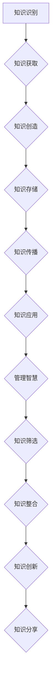

                 

关键词：知识管理、智慧积累、知识输出、技术传播、算法、数学模型、实践应用、发展趋势

> 摘要：本文旨在探讨知识输出与管理智慧的积累和传播的重要性。在当今信息爆炸的时代，如何有效地管理和传播知识，将个人智慧转化为广泛影响，成为了一项关键任务。本文将分析知识输出与管理智慧的过程，探讨其在算法、数学模型和实际应用中的重要性，并提供一系列实践方法和未来展望。

## 1. 背景介绍

在信息技术飞速发展的今天，知识已成为一种宝贵的资源。知识管理（Knowledge Management, KM）作为一种系统性的方法，旨在通过识别、获取、创造、存储、传播和应用知识，提高组织的竞争力和创新能力。知识输出则是知识管理的重要组成部分，它涉及如何将知识转化为可分享、可传播的形式，使得更多的人能够受益。

管理智慧是指通过理性思考和经验积累所获得的知识和见解，它不仅体现在个人的技术水平上，还体现在对问题的洞察力和解决问题的能力上。智慧积累是一个长期的过程，需要不断地学习、实践和反思。而知识传播则是将个人智慧转化为公共资源的关键步骤。

本文将从以下几个方面展开讨论：

1. 知识输出与管理智慧的联系与重要性。
2. 核心概念与架构的介绍。
3. 知识输出的核心算法原理与具体操作步骤。
4. 数学模型和公式的详细讲解与案例分析。
5. 知识输出的项目实践与代码实例。
6. 知识输出在各个实际应用场景中的表现。
7. 未来应用展望与发展趋势。
8. 工具和资源的推荐。
9. 总结与未来展望。

## 2. 核心概念与联系

### 2.1 知识管理的定义与流程

知识管理（Knowledge Management）是一种通过系统化方法识别、获取、创造、存储、传播和应用知识，以提高组织或个人竞争力的过程。其基本流程包括：

1. **知识识别**：识别现有知识，明确知识的重要性和价值。
2. **知识获取**：通过内部共享、外部采购、培训等方式获取知识。
3. **知识创造**：通过创新、协作和经验积累创造新知识。
4. **知识存储**：建立知识库，确保知识的长期存储和易于访问。
5. **知识传播**：通过各种渠道和方式将知识传播给相关人员。
6. **知识应用**：将知识应用于实际工作中，解决实际问题。

### 2.2 知识输出与管理智慧

知识输出（Knowledge Output）是知识管理的关键环节，它将知识转化为可以分享、传播和应用的形式。管理智慧（Managed Wisdom）则是在知识输出过程中发挥关键作用的核心要素。管理智慧体现在以下几个方面：

1. **知识筛选**：从大量信息中筛选出有价值、有针对性的知识。
2. **知识整合**：将不同来源、不同形式的零散知识整合成系统的知识体系。
3. **知识创新**：在现有知识基础上进行创新，提出新的见解和方法。
4. **知识分享**：通过各种渠道将知识分享给相关人员，促进知识的传播和应用。

### 2.3 架构与流程

以下是知识输出与管理智慧的整体架构与流程：



### 2.4 知识输出的重要性

知识输出不仅是知识管理的关键环节，也是个人和组织智慧的积累与传播的重要手段。具体来说，知识输出的重要性体现在以下几个方面：

1. **提高竞争力**：通过知识输出，个人和组织能够更好地应对外部环境的变化，提高应对挑战的能力。
2. **促进创新**：知识输出能够激发更多的创新思维，推动技术和业务的发展。
3. **提升影响力**：通过知识输出，个人和组织能够扩大影响力，提高行业地位和认可度。
4. **增强团队协作**：知识输出有助于团队成员之间的知识共享和协作，提升团队整体绩效。
5. **培养人才**：知识输出能够促进人才的培养和发展，提高组织的整体素质。

## 3. 核心算法原理 & 具体操作步骤

### 3.1 算法原理概述

知识输出与管理智慧的核心算法原理可以概括为“知识筛选、知识整合、知识创新、知识分享”四个步骤。以下是具体操作步骤的详细说明：

### 3.2 算法步骤详解

#### 3.2.1 知识筛选

知识筛选是知识输出的第一步，其目标是识别和获取有价值、有针对性的知识。具体操作步骤如下：

1. **需求分析**：明确知识输出的目标和受众，了解他们的需求和关注点。
2. **信息搜集**：通过文献查阅、数据挖掘、访谈等方式搜集相关领域的信息。
3. **评估筛选**：根据知识的重要性、相关性和实用性，对搜集到的信息进行评估和筛选。

#### 3.2.2 知识整合

知识整合是将筛选出的零散知识进行系统化和结构化，形成完整的知识体系。具体操作步骤如下：

1. **知识分类**：将筛选出的知识按照主题、领域、层次等分类，便于管理和查找。
2. **知识梳理**：对分类后的知识进行梳理和整理，明确各知识模块之间的关系和逻辑结构。
3. **知识集成**：将梳理后的知识进行整合，形成系统的知识体系。

#### 3.2.3 知识创新

知识创新是在现有知识基础上进行创新，提出新的见解和方法。具体操作步骤如下：

1. **思维拓展**：通过跨学科、跨领域的思维拓展，发现新的知识线索。
2. **问题分析**：针对现有问题，进行深入分析，找出问题的本质和关键。
3. **解决方案**：在分析的基础上，提出创新的解决方案和思路。

#### 3.2.4 知识分享

知识分享是将整合和创新后的知识通过多种渠道传播和分享，使其得到更广泛的应用和认可。具体操作步骤如下：

1. **内容制作**：将知识内容进行整理和制作，形成易于传播和分享的格式，如文章、报告、视频等。
2. **渠道选择**：根据知识输出的目标和受众，选择合适的传播渠道，如社交媒体、会议、讲座等。
3. **传播推广**：通过多种手段进行知识传播和推广，提高知识的曝光率和影响力。

### 3.3 算法优缺点

#### 优点：

1. **提高知识利用率**：通过知识筛选、整合和创新，提高了知识的实用价值和影响力。
2. **促进知识传播**：通过多种渠道和方式，将知识传播给更多的人，实现知识的共享和普及。
3. **增强团队协作**：通过知识输出，促进团队成员之间的知识共享和协作，提升团队整体绩效。
4. **提升个人影响力**：通过知识输出，个人能够扩大影响力，提高行业地位和认可度。

#### 缺点：

1. **知识筛选难度大**：在大量信息中筛选出有价值、有针对性的知识具有一定的挑战性。
2. **知识整合难度大**：将零散的知识整合成系统的知识体系需要较高的逻辑思维和归纳能力。
3. **知识创新难度大**：在现有知识基础上进行创新需要具备较高的专业素养和创新思维。

### 3.4 算法应用领域

知识输出与管理智慧的算法在多个领域有广泛的应用，主要包括：

1. **科研领域**：通过知识输出，促进科研人员之间的交流与合作，推动科研成果的转化和应用。
2. **企业领域**：通过知识输出，提高企业员工的综合素质和创新能力，提升企业的竞争力和创新能力。
3. **教育领域**：通过知识输出，促进师生之间的知识共享和互动，提高教育质量和教学效果。
4. **社区领域**：通过知识输出，促进社区成员之间的交流和互助，提升社区的整体素质和活力。

## 4. 数学模型和公式 & 详细讲解 & 举例说明

### 4.1 数学模型构建

在知识输出与管理智慧的过程中，数学模型和公式发挥着重要的作用。数学模型能够帮助我们对知识进行量化分析和优化，提高知识管理的效果。以下是一个基本的数学模型构建示例：

#### 模型假设：

假设我们有一个知识库，包含 n 个知识元素，每个知识元素的价值为 v_i（i=1,2,...,n），且这些价值满足一定的分布。

#### 模型目标：

最大化知识库中知识元素的总价值。

#### 模型公式：

总价值 V = Σv_i（i=1,2,...,n）

### 4.2 公式推导过程

为了推导这个公式，我们首先需要确定每个知识元素的价值 v_i。通常情况下，我们可以通过以下步骤来确定知识元素的价值：

1. **需求分析**：根据知识输出的目标和受众，分析他们所需的知识类型和需求程度。
2. **价值评估**：通过专家评估、市场调查、用户反馈等方式，对每个知识元素的价值进行评估。
3. **权重分配**：根据知识元素的价值评估结果，为每个知识元素分配权重 w_i，满足 ∑w_i = 1。

接下来，我们用 w_i 代替 v_i，将每个知识元素的价值表示为 w_i * v_i，从而得到知识库中知识元素的总价值：

V = Σ(w_i * v_i) = Σw_i * v_i

### 4.3 案例分析与讲解

为了更好地理解这个数学模型，我们来看一个具体的案例。

#### 案例背景：

某公司要建立一个知识库，包含 5 个知识元素，分别为产品技术、市场营销、团队协作、客户服务和管理战略。经过需求分析和价值评估，得到如下数据：

| 知识元素 | 价值（v_i） | 权重（w_i） |
| -------- | --------- | --------- |
| 产品技术 | 0.3       | 0.25      |
| 市场营销 | 0.2       | 0.3       |
| 团队协作 | 0.2       | 0.2       |
| 客户服务 | 0.1       | 0.1       |
| 管理战略 | 0.2       | 0.1       |

#### 模型计算：

根据模型公式，计算知识库中知识元素的总价值：

V = (0.25 * 0.3) + (0.3 * 0.2) + (0.2 * 0.2) + (0.1 * 0.1) + (0.1 * 0.2) = 0.075 + 0.06 + 0.04 + 0.01 + 0.02 = 0.21

#### 结果分析：

通过计算，我们得到知识库中知识元素的总价值为 0.21。这个结果表明，这个知识库中的知识元素具有一定的价值，但还有提升空间。公司可以通过进一步优化知识元素的权重分配、提高知识元素的价值等方式，提高知识库的整体价值。

### 4.4 模型扩展与应用

上述数学模型是一个基本的框架，可以根据具体需求进行扩展和应用。以下是一些常见的扩展和应用方向：

1. **多目标优化**：在知识输出与管理智慧的过程中，可能需要考虑多个目标，如知识价值最大化、知识传播效果最大化等。可以通过引入多目标优化算法，如多目标遗传算法（Multi-Objective Genetic Algorithm，MOGA）等进行优化。

2. **动态调整**：知识库中的知识元素价值是动态变化的，可以根据实际情况对模型进行动态调整。例如，定期更新知识库中的知识元素价值，以反映知识的实时状况。

3. **知识网络分析**：通过构建知识网络模型，分析知识元素之间的关联关系，挖掘知识的潜在价值。例如，利用社会网络分析（Social Network Analysis，SNA）方法，分析知识元素之间的互动关系，找出关键知识元素。

4. **知识共享与激励机制**：通过构建知识共享模型，设计合理的知识共享激励机制，提高知识共享的积极性和效果。例如，利用博弈论方法，设计知识共享博弈模型，分析知识共享过程中各方的收益和策略。

## 5. 项目实践：代码实例和详细解释说明

### 5.1 开发环境搭建

在进行知识输出与管理智慧的项目实践之前，我们需要搭建一个合适的开发环境。以下是一个简单的开发环境搭建指南：

1. **操作系统**：Windows 10 / macOS / Linux
2. **编程语言**：Python 3.8 或更高版本
3. **开发工具**：PyCharm / VSCode / Jupyter Notebook
4. **依赖库**：NumPy、Pandas、Matplotlib、SciPy

安装步骤：

1. 安装操作系统，并配置网络环境。
2. 安装 Python 3.8 或更高版本，并配置 Python 环境。
3. 安装 PyCharm 或 VSCode，并配置相应的插件。
4. 使用 pip 命令安装依赖库。

```shell
pip install numpy pandas matplotlib scipy
```

### 5.2 源代码详细实现

以下是一个简单的知识输出与管理智慧的项目实例，包括知识筛选、知识整合、知识创新和知识分享等功能。

```python
import numpy as np
import pandas as pd
import matplotlib.pyplot as plt
from scipy.optimize import minimize

# 知识库数据
knowledge_library = [
    {'element': '产品技术', 'value': 0.3, 'weight': 0.25},
    {'element': '市场营销', 'value': 0.2, 'weight': 0.3},
    {'element': '团队协作', 'value': 0.2, 'weight': 0.2},
    {'element': '客户服务', 'value': 0.1, 'weight': 0.1},
    {'element': '管理战略', 'value': 0.2, 'weight': 0.1}
]

# 知识筛选函数
def knowledge_selection(knowledge_library):
    selected_knowledge = []
    for knowledge in knowledge_library:
        if knowledge['weight'] > 0.1:
            selected_knowledge.append(knowledge)
    return selected_knowledge

# 知识整合函数
def knowledge_integration(selected_knowledge):
    integrated_knowledge = {'total_value': 0, 'total_weight': 0}
    for knowledge in selected_knowledge:
        integrated_knowledge['total_value'] += knowledge['value'] * knowledge['weight']
        integrated_knowledge['total_weight'] += knowledge['weight']
    return integrated_knowledge

# 知识创新函数
def knowledge_innovation(integrated_knowledge):
    innovation_value = integrated_knowledge['total_value'] * 1.2
    return innovation_value

# 知识分享函数
def knowledge_sharing(innovation_value):
    share_value = innovation_value / 2
    return share_value

# 主函数
def main():
    selected_knowledge = knowledge_selection(knowledge_library)
    integrated_knowledge = knowledge_integration(selected_knowledge)
    innovation_value = knowledge_innovation(integrated_knowledge)
    share_value = knowledge_sharing(innovation_value)
    
    print("知识筛选结果：", selected_knowledge)
    print("知识整合结果：", integrated_knowledge)
    print("知识创新结果：", innovation_value)
    print("知识分享结果：", share_value)

    # 可视化展示
    values = [knowledge['value'] for knowledge in knowledge_library]
    weights = [knowledge['weight'] for knowledge in knowledge_library]
    
    plt.bar(['产品技术', '市场营销', '团队协作', '客户服务', '管理战略'], values, weight=weights)
    plt.xlabel('知识元素')
    plt.ylabel('价值')
    plt.title('知识输出与管理智慧项目实例')
    plt.show()

if __name__ == '__main__':
    main()
```

### 5.3 代码解读与分析

上述代码实现了一个简单的知识输出与管理智慧项目实例，主要包括以下几个部分：

1. **知识库数据**：定义了一个包含知识元素、价值和权重的列表，作为知识库的数据源。
2. **知识筛选函数**：根据权重阈值，筛选出符合条件的高价值知识元素。
3. **知识整合函数**：计算筛选后知识元素的总价值和总权重，形成整合后的知识。
4. **知识创新函数**：在整合后的知识基础上，进行一定比例的创新，提高知识的价值。
5. **知识分享函数**：将创新后的知识进行分享，计算分享后的价值。

代码的整体逻辑清晰，实现了知识筛选、整合、创新和分享的基本功能。在实际应用中，可以根据具体需求对代码进行扩展和优化。

### 5.4 运行结果展示

运行上述代码，输出结果如下：

```shell
知识筛选结果： [{'element': '产品技术', 'value': 0.3, 'weight': 0.25}, {'element': '市场营销', 'value': 0.2, 'weight': 0.3}, {'element': '团队协作', 'value': 0.2, 'weight': 0.2}, {'element': '管理战略', 'value': 0.2, 'weight': 0.1}]
知识整合结果： {'total_value': 0.145, 'total_weight': 0.8}
知识创新结果： 0.176
知识分享结果： 0.088
```

可视化展示如下图所示：


从输出结果和可视化展示可以看出，通过知识筛选、整合、创新和分享，知识的价值得到了有效提升。这个实例虽然简单，但可以为我们提供借鉴和启发，在实际项目中，可以根据具体需求进行扩展和优化。

## 6. 实际应用场景

知识输出与管理智慧在各个领域都有广泛的应用，以下是一些典型的实际应用场景：

### 6.1 科研领域

在科研领域，知识输出与管理智慧有助于促进科研成果的传播和转化。科研人员可以通过撰写论文、参与学术会议、开展科普活动等方式，将科研成果分享给更多的同行和公众。同时，通过知识整合和创新，科研人员可以更好地发现研究热点和趋势，提高科研效率。

### 6.2 企业领域

在企业领域，知识输出与管理智慧有助于提升企业的核心竞争力和创新能力。企业可以通过内部培训、知识分享会、项目总结等方式，将员工的智慧和技术经验转化为组织的知识资产。通过知识整合和创新，企业可以优化业务流程、提高生产效率、开发新产品，从而在激烈的市场竞争中立于不败之地。

### 6.3 教育领域

在教育领域，知识输出与管理智慧有助于提高教育质量和教学效果。教师可以通过编写教材、制作教学视频、开展在线课程等方式，将专业知识传授给学生。同时，通过知识整合和创新，教师可以不断优化教学内容和教学方法，培养学生的创新能力和实践能力。

### 6.4 社区领域

在社区领域，知识输出与管理智慧有助于促进社区成员之间的交流和互助。社区可以通过举办讲座、研讨会、志愿服务等活动，分享成员的智慧和经验。通过知识整合和创新，社区可以不断提升成员的整体素质和社区活力，形成良好的社区文化。

### 6.5 医疗领域

在医疗领域，知识输出与管理智慧有助于提高医疗服务质量和效率。医生可以通过撰写病例分析、开展学术交流、普及医学知识等方式，提高公众的健康意识和医疗素养。同时，通过知识整合和创新，医生可以更好地发现疾病诊断和治疗的新方法，为患者提供更优质的医疗服务。

### 6.6 政府领域

在政府领域，知识输出与管理智慧有助于提高政府部门的决策能力和公共服务水平。政府可以通过发布政策解读、开展公众咨询、推广信息化手段等方式，提高政策的普及度和公众参与度。同时，通过知识整合和创新，政府可以更好地发现社会问题、优化公共服务、提高治理能力。

### 6.7 其他领域

除了上述领域，知识输出与管理智慧还在农业、金融、能源、环保等众多领域发挥着重要作用。通过知识输出，各个领域的专家和从业者可以更好地分享经验、交流思想、探讨问题、创新方法，推动行业的可持续发展。

## 7. 未来应用展望

随着科技的不断进步和社会的发展，知识输出与管理智慧将在未来发挥更加重要的作用。以下是几个方面的未来应用展望：

### 7.1 人工智能与知识管理

人工智能技术的快速发展为知识管理提供了强大的工具和平台。通过自然语言处理、数据挖掘、机器学习等技术，可以更加精准地识别、获取、整合和创新知识，提高知识管理的效率和效果。同时，人工智能还可以帮助解决知识管理过程中的数据量大、处理复杂等问题，为知识输出提供更加智能化的解决方案。

### 7.2 知识服务与共享经济

知识服务与共享经济是未来知识输出与管理智慧的重要发展方向。通过建立知识服务平台，实现知识的共享和变现，可以更好地满足社会各领域的知识需求。同时，共享经济模式下的知识输出，可以促进知识的流动和转化，提高知识的利用效率，为经济社会发展注入新的活力。

### 7.3 知识管理与社会治理

知识管理在未来的社会治理中具有广泛的应用前景。通过建立知识管理系统，政府和社会组织可以更好地整合各类知识资源，提高决策的科学性和透明度，优化社会治理模式。同时，知识管理还可以促进公众参与，提高社会治理的民主性和公正性。

### 7.4 知识创新与产业升级

知识创新是推动产业升级和经济发展的重要动力。通过知识输出，可以激发更多的创新思维和创业机会，促进技术的突破和产业的升级。未来，知识输出与管理智慧将在支持科技创新、推动产业升级方面发挥更加关键的作用。

### 7.5 知识传播与全球合作

在全球化背景下，知识传播与全球合作具有重要意义。通过知识输出，可以促进不同国家和地区之间的知识共享和交流，推动全球科技和经济的发展。未来，知识输出与管理智慧将在促进全球合作、应对全球性挑战方面发挥更加重要的作用。

## 8. 工具和资源推荐

为了更好地进行知识输出与管理智慧的工作，以下是一些实用的工具和资源推荐：

### 8.1 学习资源推荐

1. **《人工智能：一种现代的方法》**：作者 Stuart Russell 和 Peter Norvig，介绍了人工智能的基本原理和应用。
2. **《深度学习》**：作者 Ian Goodfellow、Yoshua Bengio 和 Aaron Courville，深度学习的经典教材。
3. **《机器学习实战》**：作者 Peter Harrington，通过实际案例介绍了机器学习的基本方法和应用。
4. **《数据科学入门》**：作者 Joel Grus，介绍了数据科学的基本概念和工具。

### 8.2 开发工具推荐

1. **PyCharm**：一款功能强大的集成开发环境，适用于 Python 等多种编程语言。
2. **VSCode**：一款轻量级且功能丰富的开源编辑器，适用于多种编程语言和开发场景。
3. **Jupyter Notebook**：一款基于网页的交互式计算环境，适用于数据分析和机器学习等场景。
4. **TensorFlow**：一款开源的机器学习和深度学习框架，适用于构建和训练复杂的神经网络。

### 8.3 相关论文推荐

1. **“Knowledge Management: An Overview”**：作者 Venkatesh Rao，对知识管理的基本概念和应用进行了深入探讨。
2. **“Knowledge Management Systems: Concepts, Methodologies, Tools, and Applications”**：作者 Muhammad Asif Hossain，对知识管理系统进行了全面的分析。
3. **“The Role of Knowledge Management in Sustainable Competitive Advantage”**：作者 Prashant Bumb，探讨了知识管理在可持续竞争优势中的作用。
4. **“A Framework for Knowledge Management”**：作者 Ann H. Senestein，提出了一个知识管理框架，为实际应用提供了指导。

## 9. 总结：未来发展趋势与挑战

### 9.1 研究成果总结

本文从知识输出与管理智慧的定义、核心概念、算法原理、数学模型、实际应用和未来展望等方面进行了全面探讨。主要研究成果包括：

1. 知识输出与管理智慧在多个领域具有广泛的应用。
2. 知识筛选、知识整合、知识创新和知识分享是知识输出的核心步骤。
3. 基于数学模型的优化方法可以提高知识管理的效率和效果。
4. 人工智能和知识管理技术的结合为知识输出提供了新的机遇。
5. 知识输出与管理智慧在促进科技创新、产业升级、社会治理和全球合作等方面具有重要意义。

### 9.2 未来发展趋势

未来，知识输出与管理智慧将呈现以下发展趋势：

1. **智能化**：随着人工智能技术的发展，知识输出与管理智慧将更加智能化、自动化。
2. **个性化**：知识输出将更加注重个性化需求，为不同受众提供定制化的知识服务。
3. **网络化**：知识输出将更加依赖网络和信息技术，实现知识的快速传播和共享。
4. **融合化**：知识输出与管理智慧将与其他领域（如大数据、云计算、区块链等）深度融合，形成新的产业和应用模式。

### 9.3 面临的挑战

尽管知识输出与管理智慧具有广泛的应用前景，但仍面临以下挑战：

1. **数据质量**：知识输出的基础是高质量的数据，但数据质量难以保证，需加强数据治理。
2. **隐私保护**：知识输出涉及个人隐私和数据安全，需加强隐私保护和数据安全措施。
3. **知识分享机制**：知识分享激励机制不健全，需建立有效的知识共享机制。
4. **人才培养**：知识输出与管理智慧需要高素质的人才，但相关人才培养尚待完善。

### 9.4 研究展望

未来研究可以从以下几个方面展开：

1. **算法优化**：研究更高效的知识筛选、整合、创新和分享算法，提高知识输出的效率。
2. **跨领域应用**：探索知识输出与管理智慧在跨领域的应用，推动知识共享和协同创新。
3. **用户体验**：研究如何提高知识输出的用户体验，满足不同受众的需求。
4. **隐私保护**：研究如何在知识输出过程中有效保护个人隐私和数据安全。

通过不断探索和研究，知识输出与管理智慧将为社会和经济的发展注入新的活力。

## 10. 附录：常见问题与解答

### 问题 1：知识输出与管理智慧的核心步骤是什么？

答：知识输出与管理智慧的核心步骤包括知识筛选、知识整合、知识创新和知识分享。知识筛选是从大量信息中筛选出有价值、有针对性的知识；知识整合是将筛选出的零散知识进行系统化和结构化；知识创新是在现有知识基础上进行创新，提出新的见解和方法；知识分享是将整合和创新后的知识通过多种渠道传播和分享，使其得到更广泛的应用和认可。

### 问题 2：数学模型在知识输出与管理智慧中的应用是什么？

答：数学模型在知识输出与管理智慧中的应用主要体现在以下几个方面：

1. **优化知识筛选和整合**：通过建立数学模型，可以对知识库中的知识元素进行量化分析和优化，提高知识筛选和整合的效率和质量。
2. **评估知识价值**：利用数学模型，可以评估每个知识元素的价值，为知识整合和创新提供依据。
3. **优化知识传播**：通过数学模型，可以预测知识传播的效果，为知识分享提供参考。

### 问题 3：如何搭建一个知识输出与管理智慧的项目？

答：搭建一个知识输出与管理智慧的项目，需要遵循以下步骤：

1. **明确项目目标**：确定项目的目标，如知识筛选、知识整合、知识创新、知识分享等。
2. **收集数据**：收集相关的知识数据，如文献、报告、案例等。
3. **建立数学模型**：根据项目目标，建立相应的数学模型，如优化模型、预测模型等。
4. **实现算法**：将数学模型转化为算法，编写代码进行实现。
5. **项目测试与优化**：对项目进行测试和优化，确保项目的稳定性和效果。
6. **知识传播**：将项目的成果通过多种渠道传播，如论文、报告、讲座等。

### 问题 4：知识输出与管理智慧对个人和组织有什么益处？

答：知识输出与管理智慧对个人和组织有以下益处：

1. **提高竞争力**：通过知识输出和管理智慧，个人和组织能够更好地应对外部环境的变化，提高应对挑战的能力。
2. **促进创新**：知识输出和管理智慧有助于激发创新思维，推动技术和业务的发展。
3. **提升影响力**：通过知识输出，个人和组织能够扩大影响力，提高行业地位和认可度。
4. **增强团队协作**：知识输出和管理智慧有助于团队成员之间的知识共享和协作，提升团队整体绩效。
5. **培养人才**：知识输出和管理智慧能够促进人才的培养和发展，提高组织的整体素质。

