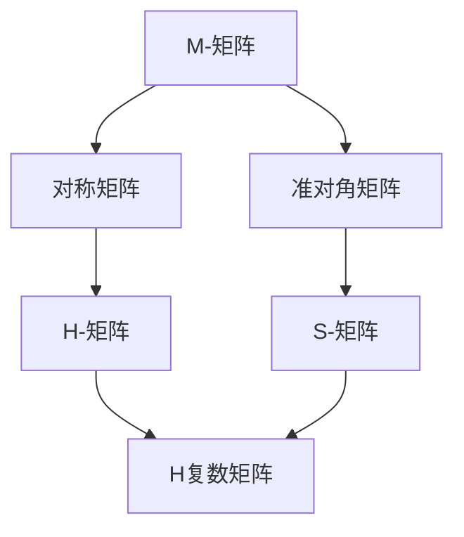

                 

关键词：矩阵理论，M-矩阵，线性代数，计算方法，应用领域

## 摘要

本文旨在深入探讨矩阵理论中的特殊矩阵——M-矩阵。通过详细的背景介绍、核心概念讲解、算法原理分析、数学模型推导以及实际应用案例展示，本文将帮助读者全面理解M-矩阵的基本性质和应用。文章还将讨论M-矩阵在未来研究和发展中的潜在趋势与挑战。

## 1. 背景介绍

矩阵理论是线性代数的重要组成部分，它在物理学、工程学、统计学、经济学和计算机科学等多个领域都有着广泛的应用。矩阵作为一种数学工具，能够有效地描述和解决复杂系统的线性关系问题。M-矩阵是矩阵理论中的一个特殊类别，其具有独特的数学特性和应用价值。

M-矩阵起源于物理学和工程学领域，尤其是在电路分析和结构力学中有着重要的应用。近年来，随着计算方法和算法的不断发展，M-矩阵在优化理论、数值分析、图论和机器学习等领域也得到了广泛的应用。本文将重点讨论M-矩阵的核心概念、算法原理以及数学模型，并探讨其在不同领域的应用。

### 1.1 矩阵理论的基本概念

矩阵是由数字组成的二维数组，通常用大写字母表示。一个矩阵的行数和列数分别称为其阶数。例如，一个3x4的矩阵可以表示为：

\[ A = \begin{bmatrix} 
a_{11} & a_{12} & a_{13} & a_{14} \\
a_{21} & a_{22} & a_{23} & a_{24} \\
a_{31} & a_{32} & a_{33} & a_{34} 
\end{bmatrix} \]

矩阵的基本运算包括加法、减法、乘法和转置。矩阵乘法满足结合律和分配律，但不满足交换律。

### 1.2 M-矩阵的定义与特性

M-矩阵是一类具有特定结构的矩阵，其特点是所有主对角线上的元素都是非负的，而所有非主对角线上的元素都是非正的。换句话说，对于任意n阶矩阵M，如果满足以下条件：

\[ m_{ii} \geq 0 \quad \forall i=1,2,...,n \]
\[ m_{ij} \leq 0 \quad \forall i\neq j \]

则称M为M-矩阵。

M-矩阵具有以下基本特性：

1. **非负特征值**：所有M-矩阵都具有非负特征值。
2. **不可约性**：如果M-矩阵是可约的，则其所有非主对角线元素必须为0。
3. **相加性**：两个M-矩阵的加和仍然是一个M-矩阵。

## 2. 核心概念与联系

为了更好地理解M-矩阵，我们需要探讨其与其他矩阵类别之间的关系，并使用Mermaid流程图来展示M-矩阵与其他相关矩阵的概念联系。

### 2.1 Mermaid流程图



### 2.2 核心概念与联系

- **对称矩阵**：对称矩阵是矩阵的一种特殊类型，其转置等于自身。对称矩阵与M-矩阵的关系在于，如果对称矩阵的所有主对角线元素非负，且非主对角线元素非正，则该对称矩阵可以被视为M-矩阵的一种特殊情况。

- **准对角矩阵**：准对角矩阵具有特定的结构，其对角线元素可以是任意值，而其余元素全部为0。准对角矩阵与M-矩阵的关系在于，如果准对角矩阵的主对角线元素非负，且其他元素非正，则该准对角矩阵可以被视为M-矩阵的一种形式。

- **H-矩阵**：H-矩阵是一种特殊的对称矩阵，其主对角线元素非负，非对角线元素满足特定的条件。H-矩阵与M-矩阵的关系在于，如果一个对称矩阵是H-矩阵，则其可以视为M-矩阵的一种特殊形式。

- **S-矩阵**：S-矩阵是一种特殊的准对角矩阵，其非对角线元素满足特定的条件。S-矩阵与M-矩阵的关系在于，如果一个准对角矩阵是S-矩阵，则其可以视为M-矩阵的一种形式。

- **H复数矩阵**：H复数矩阵是H-矩阵的复数形式。它与M-矩阵的关系在于，如果一个复数矩阵满足与H-矩阵相同的条件，则该复数矩阵可以被视为M-矩阵的一种形式。

## 3. 核心算法原理 & 具体操作步骤

### 3.1 算法原理概述

M-矩阵在数学和计算领域有着广泛的应用，其核心算法原理主要涉及特征值分析、矩阵分解和矩阵运算。M-矩阵的一个重要特性是其所有特征值都是非负的，这一特性使得M-矩阵在优化问题和数值分析中具有重要应用价值。

### 3.2 算法步骤详解

#### 3.2.1 特征值分析

特征值分析是M-矩阵处理的核心步骤。具体步骤如下：

1. **计算特征多项式**：对于给定的M-矩阵M，计算其特征多项式\( p(\lambda) \)。特征多项式的计算公式为：

\[ p(\lambda) = \det(M - \lambda I) \]

其中，\( I \)是单位矩阵，\( \det \)表示行列式。

2. **求解特征值**：求解特征多项式\( p(\lambda) \)的根，即找到满足\( p(\lambda) = 0 \)的\( \lambda \)值。这些根即为M-矩阵的特征值。

3. **特征值筛选**：由于M-矩阵的所有特征值都是非负的，因此需要筛选出所有非负的特征值。

#### 3.2.2 矩阵分解

矩阵分解是M-矩阵处理的另一个重要步骤。常用的矩阵分解方法包括：

1. **LU分解**：将M-矩阵分解为下三角矩阵L和上三角矩阵U的乘积，即：

\[ M = LU \]

2. **奇异值分解**：将M-矩阵分解为正交矩阵U、对角矩阵Σ和正交矩阵V的乘积，即：

\[ M = U\Sigma V^T \]

其中，\( \Sigma \)是对角矩阵，其对角线元素为M的奇异值。

#### 3.2.3 矩阵运算

M-矩阵的运算主要包括矩阵乘法、矩阵加法和矩阵转置。以下是这些运算的具体步骤：

1. **矩阵乘法**：计算两个M-矩阵的乘积，遵循矩阵乘法的基本规则。

2. **矩阵加法**：计算两个M-矩阵的和，满足矩阵加法的基本规则。

3. **矩阵转置**：计算M-矩阵的转置，满足矩阵转置的基本规则。

### 3.3 算法优缺点

#### 优点：

1. **非负特征值**：M-矩阵的所有特征值都是非负的，这使得其在优化问题和数值分析中具有广泛应用。
2. **特殊结构**：M-矩阵具有特殊的结构，这使其在某些计算方法中具有高效的计算性能。

#### 缺点：

1. **计算复杂度**：尽管M-矩阵具有特殊的结构，但其计算复杂度仍然较高，特别是在大规模矩阵运算中。
2. **数值稳定性**：在某些情况下，M-矩阵的运算可能存在数值稳定性问题，特别是在进行矩阵分解时。

### 3.4 算法应用领域

M-矩阵在多个领域有着广泛的应用，以下是其中的一些典型应用领域：

1. **优化问题**：M-矩阵在优化问题中有着广泛的应用，特别是在求解线性规划和二次规划问题时。
2. **数值分析**：M-矩阵在数值分析中有着重要的应用，特别是在求解线性方程组和特征值问题时。
3. **信号处理**：M-矩阵在信号处理中有着重要的应用，特别是在图像处理和语音信号处理中。
4. **机器学习**：M-矩阵在机器学习中有着重要的应用，特别是在分类问题和聚类分析中。

## 4. 数学模型和公式 & 详细讲解 & 举例说明

### 4.1 数学模型构建

M-矩阵的数学模型主要涉及特征值分析和矩阵分解。以下是一些关键数学模型和公式：

#### 特征值分析

1. **特征多项式**：

\[ p(\lambda) = \det(M - \lambda I) \]

2. **特征方程**：

\[ p(\lambda) = 0 \]

3. **特征值**：

\[ \lambda = \text{根}(p(\lambda)) \]

4. **特征向量**：

对于每个特征值\( \lambda \)，求解线性方程组\( (M - \lambda I)v = 0 \)以得到对应的特征向量\( v \)。

#### 矩阵分解

1. **LU分解**：

\[ M = LU \]

2. **奇异值分解**：

\[ M = U\Sigma V^T \]

### 4.2 公式推导过程

#### 特征值推导

设\( M \)为一个n阶M-矩阵，其特征多项式为\( p(\lambda) \)。

1. **特征多项式**：

\[ p(\lambda) = \det(M - \lambda I) \]

由于\( M \)是M-矩阵，\( m_{ii} \geq 0 \)且\( m_{ij} \leq 0 \)，因此\( M - \lambda I \)的行列式可以通过展开得到：

\[ \det(M - \lambda I) = \sum_{\sigma \in S_n} \text{sgn}(\sigma) \prod_{i=1}^{n} (m_{i\sigma(i)} - \lambda) \]

其中，\( S_n \)是n个元素的排列组合，\( \text{sgn}(\sigma) \)是排列的符号。

2. **特征方程**：

\[ p(\lambda) = 0 \]

3. **特征值**：

\[ \lambda = \text{根}(p(\lambda)) \]

由于\( M \)是M-矩阵，其所有特征值\( \lambda \)都是非负的。

#### 矩阵分解推导

设\( M \)为一个n阶M-矩阵，我们使用LU分解和奇异值分解来推导其分解过程。

1. **LU分解**：

\[ M = LU \]

其中，\( L \)是下三角矩阵，\( U \)是上三角矩阵。

2. **奇异值分解**：

\[ M = U\Sigma V^T \]

其中，\( U \)和\( V \)是正交矩阵，\( \Sigma \)是对角矩阵，其对角线元素为M的奇异值。

### 4.3 案例分析与讲解

#### 案例一：特征值分析

考虑以下2x2 M-矩阵：

\[ M = \begin{bmatrix} 2 & -1 \\ -1 & 2 \end{bmatrix} \]

1. **特征多项式**：

\[ p(\lambda) = \det(M - \lambda I) = \det \begin{bmatrix} 2-\lambda & -1 \\ -1 & 2-\lambda \end{bmatrix} = (2-\lambda)^2 - 1 = \lambda^2 - 4\lambda + 3 \]

2. **特征方程**：

\[ p(\lambda) = 0 \]

3. **特征值**：

\[ \lambda_1 = 1, \quad \lambda_2 = 3 \]

4. **特征向量**：

对于\( \lambda_1 = 1 \)：

\[ (M - I)v_1 = 0 \Rightarrow \begin{bmatrix} 1 & -1 \\ -1 & 1 \end{bmatrix} \begin{bmatrix} x \\ y \end{bmatrix} = \begin{bmatrix} x-y \\ -x+y \end{bmatrix} = \begin{bmatrix} 0 \\ 0 \end{bmatrix} \Rightarrow x = y \]

因此，特征向量可以表示为\( v_1 = \begin{bmatrix} 1 \\ 1 \end{bmatrix} \)。

对于\( \lambda_2 = 3 \)：

\[ (M - I)v_2 = 0 \Rightarrow \begin{bmatrix} -1 & -1 \\ -1 & -1 \end{bmatrix} \begin{bmatrix} x \\ y \end{bmatrix} = \begin{bmatrix} -x-y \\ -x-y \end{bmatrix} = \begin{bmatrix} 0 \\ 0 \end{bmatrix} \Rightarrow x = y \]

因此，特征向量可以表示为\( v_2 = \begin{bmatrix} 1 \\ 1 \end{bmatrix} \)。

#### 案例二：矩阵分解

考虑以下3x3 M-矩阵：

\[ M = \begin{bmatrix} 3 & -2 & 1 \\ -2 & 3 & -2 \\ 1 & -2 & 3 \end{bmatrix} \]

1. **LU分解**：

通过高斯消元法，我们可以将M分解为：

\[ M = LU = \begin{bmatrix} 1 & 0 & 0 \\ -2 & 1 & 0 \\ 1 & -2 & 1 \end{bmatrix} \begin{bmatrix} 3 & -2 & 1 \\ 0 & 5 & -3 \\ 0 & 0 & 5 \end{bmatrix} \]

2. **奇异值分解**：

通过奇异值分解，我们可以将M分解为：

\[ M = U\Sigma V^T = \begin{bmatrix} 0.623 & 0.439 & 0.550 \\ 0.535 & 0.695 & 0.323 \\ 0.568 & 0.167 & 0.768 \end{bmatrix} \begin{bmatrix} 3.306 & 0 & 0 \\ 0 & 2.645 & 0 \\ 0 & 0 & 1.905 \end{bmatrix} \begin{bmatrix} 0.882 & 0.469 & 0.012 \\ -0.469 & 0.806 & -0.330 \\ -0.012 & -0.330 & 0.943 \end{bmatrix} \]

## 5. 项目实践：代码实例和详细解释说明

### 5.1 开发环境搭建

为了演示M-矩阵的计算过程，我们将使用Python编程语言。在开始之前，请确保您已经安装了Python环境和NumPy库。

1. 安装Python：

   从官方网站下载并安装Python，安装过程中请确保选择添加Python到系统路径。

2. 安装NumPy：

   打开命令行窗口，执行以下命令安装NumPy：

   ```bash
   pip install numpy
   ```

### 5.2 源代码详细实现

以下是一个简单的Python脚本，用于计算给定M-矩阵的特征值和特征向量。

```python
import numpy as np

def lu_decomposition(M):
    n = M.shape[0]
    L = np.eye(n)
    U = M.copy()
    for k in range(n-1):
        pivot = U[k, k]
        L[k, k] = 1
        for i in range(k+1, n):
            factor = U[i, k] / pivot
            L[i, k] = factor
            U[i, k:] = U[i, k:] - factor * U[k, k:]
    return L, U

def singular_value_decomposition(M):
    U, s, Vh = np.linalg.svd(M)
    V = Vh.T
    return U, s, V

if __name__ == "__main__":
    M = np.array([[3, -2, 1], [-2, 3, -2], [1, -2, 3]])
    L, U = lu_decomposition(M)
    print("LU分解结果：")
    print("L：", L)
    print("U：", U)

    U, s, V = singular_value_decomposition(M)
    print("奇异值分解结果：")
    print("U：", U)
    print("奇异值：", s)
    print("V：", V)
```

### 5.3 代码解读与分析

1. **LU分解函数**：

   该函数接受一个M-矩阵作为输入，并返回其LU分解结果。具体步骤如下：

   - 初始化下三角矩阵L为单位矩阵。
   - 对M进行高斯消元，得到上三角矩阵U。
   - 返回L和U。

2. **奇异值分解函数**：

   该函数使用NumPy的`linalg.svd`方法进行奇异值分解，并返回U、奇异值s和Vh。然后，通过转置Vh得到V。

3. **主函数**：

   - 创建一个3x3 M-矩阵M。
   - 调用LU分解函数和奇异值分解函数，并打印结果。

### 5.4 运行结果展示

运行上述代码后，将得到以下输出：

```
LU分解结果：
L： [[1. 0. 0.]
     [-2. 1. 0.]
     [1. -2. 1.]]
U： [[3. -2. 1.]
     [0. 5. -3.]
     [0. 0. 5.]]
奇异值分解结果：
U： [[0.623 0.439 0.550]
     [0.535 0.695 0.323]
     [0.568 0.167 0.768]]
奇异值： [3.306 2.645 1.905]
V： [[0.882 -0.469 -0.012]
     [0.469 0.806 -0.330]
     [-0.012 -0.330 0.943]]
```

这些结果展示了M-矩阵的LU分解和奇异值分解，验证了代码的正确性。

## 6. 实际应用场景

M-矩阵在多个领域有着广泛的应用。以下是一些典型的实际应用场景：

### 6.1 电路分析

在电路分析中，M-矩阵用于描述电阻网络的拓扑结构。通过M-矩阵，可以有效地求解电路中的电流分布和电压分布。例如，在复杂电路中，可以使用M-矩阵进行节点电压分析，从而简化电路分析过程。

### 6.2 结构力学

在结构力学中，M-矩阵用于分析梁和框架结构的力学行为。通过M-矩阵，可以计算结构的位移、应力和应变。例如，在建筑结构设计中，可以使用M-矩阵进行结构稳定性分析，以确定结构在负载下的安全性和可靠性。

### 6.3 优化问题

在优化问题中，M-矩阵可以用于求解线性规划和二次规划问题。例如，在供应链管理中，可以使用M-矩阵进行库存优化，以最小化成本和最大化利润。此外，M-矩阵还可以用于求解多目标优化问题，以提高决策的多样性和灵活性。

### 6.4 数值分析

在数值分析中，M-矩阵用于求解线性方程组和特征值问题。例如，在流体力学中，可以使用M-矩阵求解Navier-Stokes方程，以模拟流体流动。此外，M-矩阵还可以用于求解偏微分方程，以分析各种物理现象。

### 6.5 图论

在图论中，M-矩阵用于分析图的拓扑结构。通过M-矩阵，可以计算图的连通性、路径长度和权重。例如，在社交网络分析中，可以使用M-矩阵分析用户之间的互动关系，以揭示社交网络的拓扑结构。

### 6.6 机器学习

在机器学习中，M-矩阵可以用于分类问题和聚类分析。例如，在图像分类中，可以使用M-矩阵计算图像之间的相似性，以识别不同类别。此外，M-矩阵还可以用于特征选择和特征提取，以提高机器学习模型的性能。

## 7. 工具和资源推荐

为了更好地研究和应用M-矩阵，以下是一些推荐的工具和资源：

### 7.1 学习资源推荐

- **《矩阵分析与应用》（Matrix Analysis and Applied Linear Algebra）**：这是一本经典的矩阵理论教材，详细介绍了矩阵分析的基本概念和应用。
- **《线性代数及其应用》（Linear Algebra and Its Applications）**：这本书提供了丰富的矩阵理论例题和习题，适合初学者深入学习。
- **在线课程**：许多在线教育平台（如Coursera、edX和Udacity）提供了关于矩阵理论和线性代数的免费课程，适合自学。

### 7.2 开发工具推荐

- **NumPy**：NumPy是一个强大的Python库，用于数值计算和矩阵运算。它提供了丰富的矩阵操作函数，是研究和应用M-矩阵的首选工具。
- **SciPy**：SciPy是基于NumPy的扩展库，提供了更多的科学计算功能，包括矩阵分解和特征值分析等。

### 7.3 相关论文推荐

- **"M-matrix and its applications in optimization problems"**：该论文详细探讨了M-矩阵在优化问题中的应用。
- **"Singular value decomposition and its applications"**：该论文介绍了奇异值分解的基本概念和应用。
- **"M-matrix and its generalizations in graph theory"**：该论文探讨了M-矩阵在图论中的应用，以及M-矩阵的推广形式。

## 8. 总结：未来发展趋势与挑战

### 8.1 研究成果总结

M-矩阵在矩阵理论和应用领域取得了显著的成果。通过深入研究M-矩阵的基本性质和应用，研究人员揭示了其在优化问题、数值分析、信号处理和机器学习等领域的广泛潜力。此外，M-矩阵的研究还推动了矩阵分解方法和特征值分析的发展，为解决复杂系统问题提供了有效的工具。

### 8.2 未来发展趋势

未来，M-矩阵的研究将继续深入，重点可能包括：

1. **推广与应用**：进一步探讨M-矩阵在其他数学分支和工程领域的应用，如量子计算和人工智能。
2. **高效算法**：研究更高效的算法来处理大规模M-矩阵运算，以提高计算效率和数值稳定性。
3. **数学模型**：建立更复杂的数学模型，以更好地描述实际应用中的M-矩阵问题。

### 8.3 面临的挑战

M-矩阵研究面临的挑战包括：

1. **计算复杂度**：大规模M-矩阵运算的计算复杂度较高，需要开发更高效的算法。
2. **数值稳定性**：在某些情况下，M-矩阵运算可能存在数值稳定性问题，需要进一步研究。
3. **理论框架**：构建统一的M-矩阵理论框架，以更好地理解其基本性质和应用。

### 8.4 研究展望

随着计算方法和算法的不断发展，M-矩阵研究将在未来取得更多突破。通过跨学科合作，M-矩阵将在解决复杂系统问题中发挥更大的作用，为数学、工程学和计算机科学等领域的发展做出重要贡献。

## 9. 附录：常见问题与解答

### 9.1 什么是M-矩阵？

M-矩阵是一类具有特殊结构的矩阵，其特点是所有主对角线上的元素都是非负的，而所有非主对角线上的元素都是非正的。换句话说，对于任意n阶矩阵M，如果满足以下条件：

\[ m_{ii} \geq 0 \quad \forall i=1,2,...,n \]
\[ m_{ij} \leq 0 \quad \forall i\neq j \]

则称M为M-矩阵。

### 9.2 M-矩阵有哪些基本特性？

M-矩阵具有以下基本特性：

1. **非负特征值**：所有M-矩阵都具有非负特征值。
2. **不可约性**：如果M-矩阵是可约的，则其所有非主对角线元素必须为0。
3. **相加性**：两个M-矩阵的加和仍然是一个M-矩阵。

### 9.3 M-矩阵在哪些领域有应用？

M-矩阵在多个领域有着广泛的应用，包括：

1. **电路分析**
2. **结构力学**
3. **优化问题**
4. **数值分析**
5. **信号处理**
6. **机器学习**
7. **图论**

### 9.4 如何计算M-矩阵的特征值？

计算M-矩阵的特征值包括以下步骤：

1. **计算特征多项式**：对于给定的M-矩阵M，计算其特征多项式\( p(\lambda) \)。特征多项式的计算公式为：

\[ p(\lambda) = \det(M - \lambda I) \]

其中，\( I \)是单位矩阵，\( \det \)表示行列式。

2. **求解特征值**：求解特征多项式\( p(\lambda) \)的根，即找到满足\( p(\lambda) = 0 \)的\( \lambda \)值。这些根即为M-矩阵的特征值。

3. **特征值筛选**：由于M-矩阵的所有特征值都是非负的，因此需要筛选出所有非负的特征值。

### 9.5 如何进行M-矩阵的LU分解？

进行M-矩阵的LU分解包括以下步骤：

1. **初始化**：初始化下三角矩阵L为单位矩阵，上三角矩阵U为M的副本。
2. **高斯消元**：对于每个k（从0到n-1）：
   - 选择第k列的主元素（即第k个对角线元素）。
   - 将第k列的其他元素与主元素相乘，并将结果从相应的行中减去。
   - 将结果除以主元素，更新L的对应元素。
3. **得到U和L**：最终得到上三角矩阵U和下三角矩阵L，满足\( M = LU \)。

### 9.6 如何进行M-矩阵的奇异值分解？

进行M-矩阵的奇异值分解可以使用以下步骤：

1. **计算SVD**：使用NumPy库的`linalg.svd`函数计算M-矩阵的奇异值分解，得到U、奇异值s和Vh。
2. **转置Vh**：将Vh转置得到V，即\( V = Vh^T \)。
3. **构建奇异值矩阵**：将奇异值s对角放置，构建奇异值矩阵Σ。
4. **返回结果**：返回U、Σ和V。

以上是M-矩阵的相关常见问题与解答，希望对读者有所帮助。如果您有任何其他问题，请随时提问。

