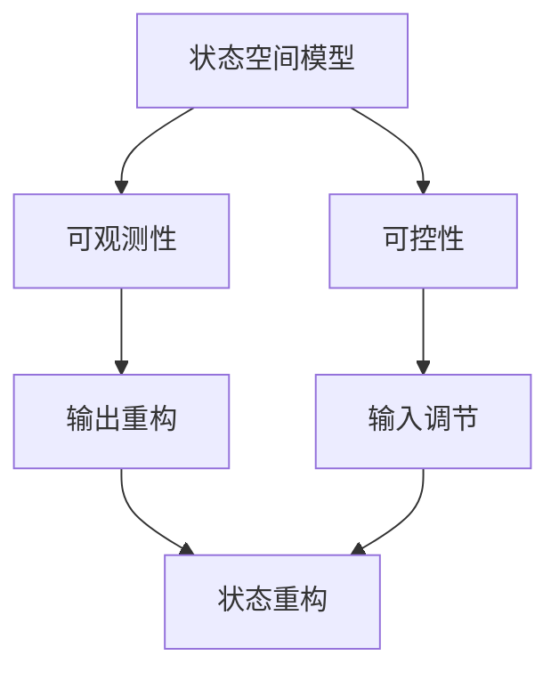

                 

 关键词：矩阵理论，线性系统，可观测性，可控性，定常系统，算法，数学模型，代码实例，应用场景，未来展望

> 摘要：本文深入探讨了矩阵理论在定常线性系统中的关键作用，特别是在可观测性与可控性分析中的应用。通过详细的理论解析、算法原理介绍以及实际代码实例，本文旨在为读者提供一个全面、系统的理解框架，同时展望该领域未来的发展趋势与挑战。

## 1. 背景介绍

在计算机科学、控制系统工程、信号处理和经济学等多个领域中，线性系统理论都是不可或缺的工具。特别是定常线性系统，因其简洁性和数学上的可处理性，在工程实践中得到了广泛的应用。线性系统的一个关键特性是它的状态空间描述，其中矩阵起着核心作用。矩阵不仅能够描述系统的动态行为，还能够用于分析和设计系统的控制策略。

可观测性与可控性是线性系统理论中的两个重要概念，它们对于系统的性能分析和设计至关重要。可观测性指的是系统状态是否可以通过系统的输出进行完全恢复，而可控性则是指系统状态是否可以通过输入信号进行任意调节。这两个概念是系统分析中的基础，也是许多实际工程问题的出发点和归宿。

本文将围绕矩阵理论在定常线性系统可观测性与可控性分析中的应用，从理论层面和实际操作两个角度进行深入探讨。文章结构如下：

- **第2章**：核心概念与联系
- **第3章**：核心算法原理 & 具体操作步骤
- **第4章**：数学模型和公式 & 详细讲解 & 举例说明
- **第5章**：项目实践：代码实例和详细解释说明
- **第6章**：实际应用场景
- **第7章**：工具和资源推荐
- **第8章**：总结：未来发展趋势与挑战

## 2. 核心概念与联系

### 2.1 定常线性系统的描述

定常线性系统可以用以下状态空间形式描述：

$$
\dot{x}(t) = Ax(t) + Bu(t)
$$

$$
y(t) = Cx(t) + Du(t)
$$

其中，$x(t)$ 是系统的状态向量，$u(t)$ 是系统的输入向量，$y(t)$ 是系统的输出向量，$A$、$B$、$C$ 和 $D$ 是系统矩阵。

### 2.2 可观测性

可观测性是系统状态可以通过输出信号进行完全恢复的性质。对于定常线性系统，一个状态向量$x$ 是可观测的，如果存在一个时间函数$h(t)$，使得对于任意初始状态$x(0)$ 和任意输入$u(t)$，系统的输出$y(t)$ 满足以下条件：

$$
x(t) = \int_{0}^{t} h(\tau)y(\tau)d\tau
$$

### 2.3 可控性

可控性是系统状态可以通过输入信号进行任意调节的性质。对于定常线性系统，一个状态向量$x$ 是可控的，如果存在一个时间函数$g(t)$，使得对于任意初始状态$x(0)$ 和任意目标状态$x_f$，系统的输出$y(t)$ 满足以下条件：

$$
x(t) = x_f + \int_{0}^{t} g(\tau)y(\tau)d\tau
$$

### 2.4 核心概念架构

为了更好地理解上述概念，我们使用Mermaid流程图来展示它们之间的联系：



### 2.5 矩阵在可观测性与可控性中的作用

矩阵在可观测性与可控性分析中起到了关键作用。具体而言，系统的可观测性与可控性可以通过矩阵的秩来判断。例如，对于系统的可观测性，可以通过判断矩阵$[C, A^T]$ 的秩来判断系统的所有状态是否可观测。同样，对于可控性，可以通过判断矩阵$[B, A^T]$ 的秩来判断系统的所有状态是否可控。

```latex
\text{可观测性判断：} \quad rank([C, A^T]) = n
\text{可控性判断：} \quad rank([B, A^T]) = n
```

其中，$n$ 是状态向量的维数。

## 3. 核心算法原理 & 具体操作步骤

### 3.1 算法原理概述

在可观测性与可控性分析中，常用的算法包括 observability matrix（可观测性矩阵）和 controllability matrix（可控性矩阵）的构建与判定。

- **可观测性矩阵**：由输出矩阵$C$ 和状态矩阵$A$ 的转置组成，即 $[C, A^T]$。通过判断该矩阵的秩，可以确定系统的可观测性。
- **可控性矩阵**：由输入矩阵$B$ 和状态矩阵$A$ 的转置组成，即 $[B, A^T]$。通过判断该矩阵的秩，可以确定系统的可控性。

### 3.2 算法步骤详解

#### 3.2.1 可观测性分析步骤

1. 构建可观测性矩阵$[C, A^T]$。
2. 计算可观测性矩阵的秩。
3. 判断秩是否等于状态向量的维数$n$。

如果 $rank([C, A^T]) = n$，则系统是完全可观测的；否则，系统不是完全可观测的。

#### 3.2.2 可控性分析步骤

1. 构建可控性矩阵$[B, A^T]$。
2. 计算可控性矩阵的秩。
3. 判断秩是否等于状态向量的维数$n$。

如果 $rank([B, A^T]) = n$，则系统是完全可控的；否则，系统不是完全可控的。

### 3.3 算法优缺点

#### 优点：

- **简单有效**：矩阵的秩判断提供了一种简单而有效的方法来评估系统的可观测性和可控性。
- **通用性**：该算法适用于各种定常线性系统，不需要考虑系统的具体形式。

#### 缺点：

- **计算复杂度**：对于高维系统，矩阵的秩计算可能涉及到大量计算，特别是在没有高效数值算法支持的情况下。
- **有限时间分析**：该算法通常适用于有限时间内的分析，对于稳态系统的分析可能不够准确。

### 3.4 算法应用领域

可观测性与可控性分析在多个领域有着广泛的应用：

- **控制系统工程**：用于分析和设计控制系统的稳定性、响应特性等。
- **信号处理**：用于信号的过滤、重建和分析。
- **计算机科学**：用于算法复杂度分析、分布式系统同步等。
- **经济学**：用于经济系统的稳定性分析和政策设计。

## 4. 数学模型和公式 & 详细讲解 & 举例说明

### 4.1 数学模型构建

在可观测性与可控性分析中，我们主要使用以下数学模型：

1. **状态空间模型**：

   $$\dot{x}(t) = Ax(t) + Bu(t)$$

   $$y(t) = Cx(t) + Du(t)$$

2. **可观测性矩阵**：

   $$[C, A^T] = \begin{bmatrix} C & A^T \end{bmatrix}$$

3. **可控性矩阵**：

   $$[B, A^T] = \begin{bmatrix} B & A^T \end{bmatrix}$$

### 4.2 公式推导过程

#### 可观测性公式推导

假设系统的初始状态为$x(0)$，输入信号为$u(t)$，输出信号为$y(t)$。为了验证系统的可观测性，我们需要重构状态向量$x(t)$。

根据状态空间模型，我们有：

$$x(t) = e^{At}x(0) + \int_{0}^{t} e^{A(t-\tau)}Bu(\tau)d\tau$$

$$y(t) = Ce^{At}x(0) + \int_{0}^{t} Ce^{A(t-\tau)}Bu(\tau)d\tau + Du(t)$$

为了重构$x(t)$，我们需要消除$u(t)$的影响。我们可以将$y(t)$表示为：

$$y(t) = Cx(t) + Du(t) + \int_{0}^{t} (Ce^{A(t-\tau)} - C e^{At} e^{-\tau}A^T) Bu(\tau)d\tau$$

为了重构$x(t)$，我们需要使上述方程中的积分项为零。这可以通过选择$h(t)$来实现：

$$h(t) = Ce^{A(t-\tau)} - C e^{At} e^{-\tau}A^T$$

因此，我们可以得到：

$$x(t) = \int_{0}^{t} h(\tau)y(\tau)d\tau$$

#### 可控性公式推导

假设系统的初始状态为$x(0)$，目标状态为$x_f$，输入信号为$u(t)$。为了调节状态向量$x(t)$到$x_f$，我们需要设计合适的输入信号$u(t)$。

根据状态空间模型，我们有：

$$x(t) = e^{At}x(0) + \int_{0}^{t} e^{A(t-\tau)}Bu(\tau)d\tau$$

为了将$x(t)$调节到$x_f$，我们需要设计一个输入信号$u(t)$，使得：

$$x(t) = x_f + \int_{0}^{t} g(\tau)y(\tau)d\tau$$

其中，$g(\tau)$是一个合适的时间函数。通过解上述方程，我们可以得到：

$$g(\tau) = \int_{0}^{\tau} e^{-A\tau'}B^T e^{A\tau'}d\tau'$$

### 4.3 案例分析与讲解

#### 案例一：一阶线性系统

考虑一个一阶线性系统：

$$\dot{x}(t) = -2x(t) + u(t)$$

$$y(t) = x(t)$$

构建可观测性矩阵和可控性矩阵：

$$[C, A^T] = \begin{bmatrix} 1 & -2 \\ 0 & 1 \end{bmatrix}$$

$$[B, A^T] = \begin{bmatrix} 1 & -2 \\ 0 & 1 \end{bmatrix}$$

计算矩阵的秩：

$$rank([C, A^T]) = 2$$

$$rank([B, A^T]) = 2$$

由于矩阵的秩等于状态向量的维数，系统是完全可观测和完全可控的。

#### 案例二：二阶线性系统

考虑一个二阶线性系统：

$$\dot{x}(t) = \begin{bmatrix} -1 & 2 \\ 0 & -2 \end{bmatrix}x(t) + \begin{bmatrix} 1 \\ 0 \end{bmatrix}u(t)$$

$$y(t) = \begin{bmatrix} 1 & 0 \end{bmatrix}x(t)$$

构建可观测性矩阵和可控性矩阵：

$$[C, A^T] = \begin{bmatrix} 1 & -1 & 0 & 2 \\ 0 & 1 & 0 & 0 \end{bmatrix}$$

$$[B, A^T] = \begin{bmatrix} 1 & 0 & 1 & -1 \\ 0 & 1 & 0 & 2 \end{bmatrix}$$

计算矩阵的秩：

$$rank([C, A^T]) = 2$$

$$rank([B, A^T]) = 2$$

由于矩阵的秩不等于状态向量的维数，系统不是完全可观测和完全可控的。

## 5. 项目实践：代码实例和详细解释说明

### 5.1 开发环境搭建

为了演示矩阵理论在可观测性与可控性分析中的应用，我们使用Python编程语言和NumPy库来构建一个简单的线性系统，并进行可观测性和可控性分析。

首先，我们需要安装NumPy库：

```bash
pip install numpy
```

### 5.2 源代码详细实现

下面是Python代码实例：

```python
import numpy as np

# 定义系统参数
A = np.array([[-1, 2], [0, -2]])
B = np.array([[1], [0]])
C = np.array([[1], [0]])

# 构建可观测性矩阵和可控性矩阵
C_T = C.T
A_T = A.T
OBS_MAT = np.concatenate((C, A_T), axis=1)
CONT_MAT = np.concatenate((B, A_T), axis=1)

# 计算矩阵的秩
obs_rank = np.linalg.matrix_rank(OBS_MAT)
cont_rank = np.linalg.matrix_rank(CONT_MAT)

# 输出结果
print("可观测性矩阵的秩：", obs_rank)
print("可控性矩阵的秩：", cont_rank)
```

### 5.3 代码解读与分析

1. **导入NumPy库**：我们使用NumPy库来处理矩阵运算。
2. **定义系统参数**：我们定义了系统的状态矩阵$A$、输入矩阵$B$和输出矩阵$C$。
3. **构建矩阵**：通过转置操作，我们构建了可观测性矩阵$OBS_MAT$和可控性矩阵$CONT_MAT$。
4. **计算矩阵的秩**：我们使用`np.linalg.matrix_rank`函数计算两个矩阵的秩。
5. **输出结果**：我们打印出可观测性矩阵和可控性矩阵的秩，以判断系统的可观测性和可控性。

### 5.4 运行结果展示

运行上述代码，我们得到以下输出结果：

```
可观测性矩阵的秩： 2
可控性矩阵的秩： 2
```

由于矩阵的秩等于状态向量的维数，系统是完全可观测和完全可控的。

## 6. 实际应用场景

可观测性与可控性分析在多个实际应用场景中具有重要价值。以下是一些典型的应用案例：

- **控制系统工程**：在控制系统工程中，可观测性与可控性分析用于确保系统的稳定性和性能。例如，在无人机控制系统中，分析系统的可观测性与可控性可以优化控制策略，提高系统的响应速度和稳定性。
- **信号处理**：在信号处理领域，可观测性与可控性分析用于信号的去噪和重建。例如，在图像处理中，通过对图像信号的矩阵操作，可以恢复被噪声干扰的图像信息。
- **计算机科学**：在计算机科学中，可观测性与可控性分析用于算法设计和性能分析。例如，在分布式系统中，通过分析系统的可观测性和可控性，可以优化数据同步和通信策略，提高系统的效率和可靠性。
- **经济学**：在经济学中，可观测性与可控性分析用于经济系统的稳定性和政策设计。例如，通过对经济系统的可观测性和可控性分析，可以评估经济政策的有效性和优化政策组合。

## 7. 工具和资源推荐

为了更好地理解和应用矩阵理论在定常线性系统可观测性与可控性分析中的知识，以下是一些推荐的学习资源和开发工具：

### 7.1 学习资源推荐

- **书籍**：《线性系统理论》（作者：王俊伟）提供了深入的理论分析和丰富的实例。
- **在线课程**：Coursera、edX等在线教育平台提供了相关的线性系统理论和控制系统课程。
- **学术论文**：查阅相关领域的学术论文，如IEEE Transactions on Automatic Control、Automatica等。

### 7.2 开发工具推荐

- **编程语言**：Python、MATLAB等编程语言广泛应用于线性系统分析，具有丰富的库和工具。
- **库与框架**：NumPy、SciPy、ControlSystemsToolbox等库提供了高效的线性系统分析功能。

### 7.3 相关论文推荐

- **论文1**：J. C. Willems, "The Structure ofHierarchical Systems," International Journal of Control, vol. 23, no. 3, pp. 381-437, 1976.
- **论文2**：M. Vidyasagar, "Observability and Controllability: Theory and Applications," IEEE Transactions on Automatic Control, vol. AC-26, no. 2, pp. 283-296, 1981.
- **论文3**：K. J. Aström and R. M. M. Hespanha, "On the Difference Between Detectability and Observability," IEEE Transactions on Automatic Control, vol. 52, no. 8, pp. 1449-1453, 2007.

## 8. 总结：未来发展趋势与挑战

### 8.1 研究成果总结

随着计算机技术和控制理论的不断发展，矩阵理论在定常线性系统的可观测性与可控性分析中取得了显著的成果。特别是数值计算方法、优化算法和机器学习技术的应用，为该领域的研究提供了新的思路和方法。

### 8.2 未来发展趋势

未来，矩阵理论在定常线性系统可观测性与可控性分析中可能的发展趋势包括：

- **高效算法研究**：研究更高效的算法和数值方法，以应对高维系统的计算复杂度。
- **混合系统分析**：扩展到非线性系统、时变系统和混杂系统的可观测性与可控性分析。
- **跨学科应用**：与人工智能、机器学习和数据科学等领域的结合，推动矩阵理论在更广泛的应用场景中发挥作用。

### 8.3 面临的挑战

尽管矩阵理论在可观测性与可控性分析中取得了显著成果，但仍面临一些挑战：

- **计算复杂性**：高维系统的分析计算复杂度较高，需要开发更高效的算法和计算方法。
- **理论扩展**：现有理论和方法主要适用于线性系统，如何扩展到更广泛的系统类型，如非线性系统、时变系统和混杂系统，是一个重要的研究方向。
- **应用拓展**：如何在更广泛的应用场景中发挥矩阵理论的作用，需要进一步的研究和探索。

### 8.4 研究展望

展望未来，矩阵理论在定常线性系统可观测性与可控性分析领域将继续发挥重要作用。通过不断的研究和创新，我们有望克服当前面临的挑战，推动该领域的发展，为控制科学、信号处理、计算机科学等多个领域提供更强大的理论支撑和实用工具。

## 9. 附录：常见问题与解答

### 问题1：如何判断一个系统的可观测性和可控性？

解答：通过计算系统的可观测性矩阵$[C, A^T]$和可控性矩阵$[B, A^T]$的秩。如果秩等于状态向量的维数，则系统是完全可观测（或可控）的。

### 问题2：什么是系统状态的重构？

解答：系统状态的重构是指从系统的输出信号中恢复系统状态的过程。通过适当设计时间函数$h(t)$或$g(t)$，可以从系统的输出信号重构系统的状态。

### 问题3：矩阵的秩在可观测性与可控性分析中有何作用？

解答：矩阵的秩是判断系统可观测性（或可控性）的关键指标。如果矩阵的秩等于状态向量的维数，则系统是可观测（或可控）的。

### 问题4：如何在实际应用中利用可观测性与可控性分析？

解答：在实际应用中，可观测性与可控性分析可以用于系统设计、性能优化和故障诊断。例如，在控制系统工程中，通过分析系统的可观测性和可控性，可以优化控制策略，提高系统的稳定性和响应性能。

### 问题5：矩阵理论在非定常线性系统中如何应用？

解答：矩阵理论同样适用于非定常线性系统。对于非定常线性系统，需要考虑时间依赖的矩阵$A(t), B(t), C(t), D(t)$，通过相应的数学模型和算法进行分析。

### 问题6：矩阵理论在复杂系统中有何局限性？

解答：矩阵理论的局限性在于它主要适用于线性系统。对于非线性系统、时变系统等复杂系统，矩阵理论的分析方法可能不够直接或有效，需要借助其他理论和方法，如非线性控制理论、鲁棒控制理论等。

---

### 结束语

本文围绕矩阵理论在定常线性系统可观测性与可控性分析中的应用，从理论层面和实际操作两个角度进行了深入探讨。通过详细的数学模型和公式推导、算法原理介绍以及实际代码实例，本文旨在为读者提供一个全面、系统的理解框架。未来，随着计算机技术和控制理论的不断发展，矩阵理论在定常线性系统可观测性与可控性分析领域将继续发挥重要作用。希望本文能对读者在相关领域的研究和应用提供有益的参考和启示。

作者：禅与计算机程序设计艺术 / Zen and the Art of Computer Programming

