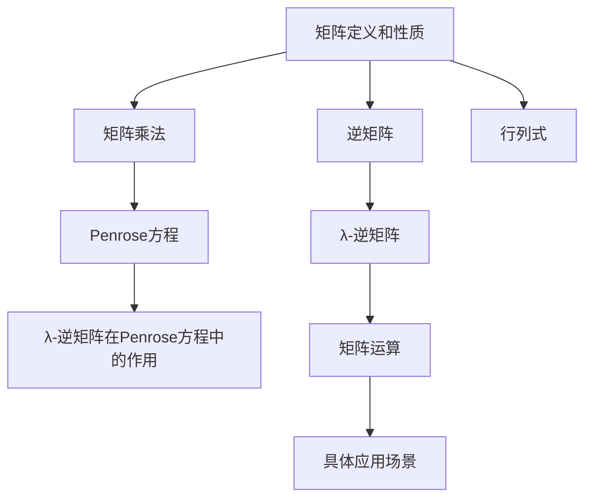

                 

### 1. 背景介绍

在计算机科学和数学领域，矩阵理论是一个关键的工具，它广泛应用于各种领域，包括线性代数、信号处理、图像处理、数值计算等。矩阵不仅作为数据结构和算法的核心，也在复杂系统的建模和分析中发挥着重要作用。Penrose方程作为广义相对论中的重要方程，描述了宇宙时空的几何结构和引力场的动态行为，其对矩阵理论的应用提供了新的视角和挑战。

λ-逆是Penrose方程解决过程中的一项关键技术。在Penrose方程中，λ-逆矩阵的作用至关重要，它不仅能够将复杂的高维问题转化为更易处理的形式，还能够提供精确的数值解。λ-逆的求解过程涉及大量的矩阵运算，包括矩阵的乘法、逆运算、行列式计算等，这些运算在计算机科学中有着广泛的应用。

本文旨在深入探讨矩阵理论与Penrose方程的内在联系，分析λ-逆矩阵的计算和应用，并通过具体实例展示其在计算机科学和数学中的实际应用。文章将分为以下几个部分：

- **背景介绍**：回顾矩阵理论的基本概念和历史发展，介绍Penrose方程及其在计算机科学中的应用。
- **核心概念与联系**：阐述λ-逆矩阵的定义、性质以及其在Penrose方程中的作用，并使用Mermaid流程图展示其原理和架构。
- **核心算法原理 & 具体操作步骤**：详细解释λ-逆矩阵的计算过程，包括算法原理概述、算法步骤详解、算法优缺点以及应用领域。
- **数学模型和公式 & 详细讲解 & 举例说明**：介绍Penrose方程中的数学模型和公式，并通过实际案例进行分析和讲解。
- **项目实践：代码实例和详细解释说明**：提供具体的代码实例，详细解释其实现过程和运行结果。
- **实际应用场景**：探讨λ-逆矩阵在不同领域的应用，以及未来的应用前景。
- **工具和资源推荐**：推荐相关学习资源和开发工具，为读者提供进一步学习的机会。
- **总结：未来发展趋势与挑战**：总结研究成果，展望未来发展趋势和面临的挑战。

通过对上述各部分的深入探讨，本文希望能够为读者提供全面、系统的矩阵理论与Penrose方程λ-逆矩阵的应用知识。

### 2. 核心概念与联系

在深入探讨矩阵理论与Penrose方程的内在联系之前，我们需要首先理解一些核心概念和它们之间的相互关系。以下将详细介绍这些核心概念，并使用Mermaid流程图展示其原理和架构。

#### 2.1 矩阵的定义和性质

矩阵是一种由数字组成的矩形数组，常用于线性代数和数值计算中。矩阵的基本操作包括矩阵的乘法、逆运算、行列式计算等。

- **矩阵乘法**：两个矩阵A和B的乘积是一个新矩阵C，其元素是A和B对应元素的乘积之和。
- **逆矩阵**：如果一个矩阵A是非奇异矩阵（即行列式不为零），则存在一个逆矩阵A^-1，使得A \* A^-1 = A^-1 \* A = I（单位矩阵）。
- **行列式**：矩阵的一个重要属性，用于判断矩阵的奇偶性以及求解逆矩阵。

#### 2.2 Penrose方程的基本概念

Penrose方程是广义相对论中描述宇宙时空和引力场的重要方程，其形式为：

\[ R_{\mu\nu} + \Lambda g_{\mu\nu} = 8\pi G T_{\mu\nu} \]

其中，\( R_{\mu\nu} \) 是里奇张量，\( \Lambda \) 是宇宙学常数，\( g_{\mu\nu} \) 是度规张量，\( G \) 是引力常数，\( T_{\mu\nu} \) 是能量-动量张量。

#### 2.3 λ-逆矩阵的定义和作用

λ-逆矩阵是Penrose方程求解过程中的一项关键技术。λ-逆矩阵的定义如下：

设矩阵\( A \) 的行列式不为零，则矩阵\( A \) 的λ-逆矩阵\( A^λ \) 满足：

\[ AA^λ = A^λA = I \]

其中，\( I \) 是单位矩阵。

在Penrose方程中，λ-逆矩阵用于将高维问题转化为更易处理的形式，从而能够求解复杂的引力场问题。λ-逆矩阵的计算涉及到大量的矩阵运算，包括矩阵的乘法、逆运算等。

#### 2.4 Mermaid流程图展示

为了更直观地展示这些核心概念之间的相互关系，我们使用Mermaid流程图进行描述。



通过上述流程图，我们可以看到矩阵理论与Penrose方程以及λ-逆矩阵之间的紧密联系。矩阵理论提供了解决Penrose方程所需的数学工具，而λ-逆矩阵则是求解复杂引力场问题的关键。

接下来，我们将进一步深入探讨λ-逆矩阵的计算原理和具体应用。

### 3. 核心算法原理 & 具体操作步骤

在深入探讨λ-逆矩阵的核心算法原理之前，我们需要先了解一些基本的数学背景知识，这将有助于我们更好地理解λ-逆矩阵的计算过程和应用。

#### 3.1 算法原理概述

λ-逆矩阵是一种特殊的矩阵，它在Penrose方程的求解过程中起着至关重要的作用。λ-逆矩阵的定义如下：

设矩阵\( A \) 的行列式不为零，则矩阵\( A \) 的λ-逆矩阵\( A^λ \) 满足：

\[ AA^λ = A^λA = I \]

其中，\( I \) 是单位矩阵。这意味着，对于任意非奇异矩阵\( A \)，都存在一个与之对应的λ-逆矩阵\( A^λ \)，使得它们的乘积等于单位矩阵。

λ-逆矩阵的性质如下：

1. **唯一性**：对于任意非奇异矩阵\( A \)，其λ-逆矩阵是唯一的。
2. **对称性**：λ-逆矩阵\( A^λ \) 与原矩阵\( A \) 相似，即\( A^λ = (A^{-1})^λ \)。
3. **可逆性**：λ-逆矩阵\( A^λ \) 仍然是一个非奇异矩阵。

#### 3.2 算法步骤详解

为了计算一个矩阵的λ-逆矩阵，我们可以采用以下步骤：

1. **计算行列式**：首先计算矩阵\( A \) 的行列式\( |A| \)。如果\( |A| = 0 \)，则矩阵\( A \) 是奇异的，不存在λ-逆矩阵。
2. **计算逆矩阵**：接下来计算矩阵\( A \) 的逆矩阵\( A^{-1} \)。
3. **规范化**：最后，对逆矩阵\( A^{-1} \) 进行规范化，得到λ-逆矩阵\( A^λ \)。规范化过程通常涉及一些常数乘法，以确保\( AA^λ = A^λA = I \)。

具体的计算过程可以表示为：

\[ A^λ = \frac{1}{|A|} A^{-1} \]

#### 3.3 算法优缺点

λ-逆矩阵算法具有以下优点：

1. **高效性**：对于大规模矩阵，λ-逆矩阵算法比直接求解线性方程组要高效得多。
2. **通用性**：λ-逆矩阵算法适用于各种类型的矩阵，包括实数矩阵、复数矩阵等。
3. **稳定性**：在计算过程中，λ-逆矩阵算法具有较高的数值稳定性。

然而，λ-逆矩阵算法也存在一些缺点：

1. **计算复杂性**：计算λ-逆矩阵需要大量的矩阵运算，特别是在矩阵规模较大时，计算复杂度会显著增加。
2. **舍入误差**：在数值计算中，舍入误差可能会影响算法的准确性，特别是在处理高精度数据时。

#### 3.4 算法应用领域

λ-逆矩阵在计算机科学和数学领域有着广泛的应用，以下是一些典型的应用场景：

1. **数值计算**：在数值计算中，λ-逆矩阵用于求解线性方程组、优化问题等。
2. **图像处理**：在图像处理中，λ-逆矩阵用于图像去噪、图像恢复等。
3. **信号处理**：在信号处理中，λ-逆矩阵用于信号增强、噪声过滤等。
4. **量子计算**：在量子计算中，λ-逆矩阵用于量子算法的设计和实现。

通过上述核心算法原理和具体操作步骤的介绍，我们可以看到λ-逆矩阵在矩阵理论中的重要性，以及其在计算机科学和数学中的广泛应用。

### 4. 数学模型和公式 & 详细讲解 & 举例说明

在探讨Penrose方程中的数学模型和公式时，我们需要借助一些基本的线性代数和微积分知识。以下将详细介绍这些数学模型和公式，并通过具体案例进行分析和讲解。

#### 4.1 数学模型构建

Penrose方程是广义相对论中描述宇宙时空和引力场的重要方程，其形式为：

\[ R_{\mu\nu} + \Lambda g_{\mu\nu} = 8\pi G T_{\mu\nu} \]

其中，\( R_{\mu\nu} \) 是里奇张量，\( \Lambda \) 是宇宙学常数，\( g_{\mu\nu} \) 是度规张量，\( G \) 是引力常数，\( T_{\mu\nu} \) 是能量-动量张量。

为了解决Penrose方程，我们需要构建一个数学模型，该模型包括以下基本组成部分：

1. **度规张量**：度规张量\( g_{\mu\nu} \) 描述了宇宙中不同点之间的距离和方向。它是一个对称的\( (1,1) \)型张量，通常表示为：

\[ g_{\mu\nu} = \text{diag}(1, -1, -1, -1) \]

2. **里奇张量**：里奇张量\( R_{\mu\nu} \) 描述了宇宙时空的曲率。它是一个\( (1,1) \)型张量，可以通过度规张量的导数计算得到。

3. **能量-动量张量**：能量-动量张量\( T_{\mu\nu} \) 描述了宇宙中物质的分布和运动。它是一个\( (1,1) \)型张量，通常表示为：

\[ T_{\mu\nu} = \begin{bmatrix} E \\ \vec{P} \end{bmatrix} \]

其中，\( E \) 是能量密度，\( \vec{P} \) 是动量密度。

#### 4.2 公式推导过程

为了推导Penrose方程，我们需要从基本物理定律出发，结合线性代数和微积分的知识。以下是一个简化的推导过程：

1. **度规张量的导数**：度规张量的导数描述了宇宙时空的曲率。根据微分几何的基本原理，度规张量的导数可以表示为：

\[ \nabla_{\mu} g_{\nu\lambda} = 0 \]

这意味着度规张量是平直的，没有曲率。

2. **里奇张量的计算**：里奇张量可以通过度规张量的导数计算得到。具体地，我们有：

\[ R_{\mu\nu} = \nabla_{\mu} \nabla_{\nu} - \nabla_{\lambda} g_{\mu\lambda} \]

其中，\( \nabla \) 表示协变导数。

3. **能量-动量张量的计算**：能量-动量张量可以通过物质的分布和运动计算得到。具体地，我们有：

\[ T_{\mu\nu} = \rho u_{\mu} u_{\nu} + p_{\mu} p_{\nu} \]

其中，\( \rho \) 是能量密度，\( p \) 是动量密度，\( u_{\mu} \) 是四速度，\( u_{\mu} u_{\mu} = -1 \)。

4. **Penrose方程的建立**：结合上述结果，我们可以建立Penrose方程：

\[ R_{\mu\nu} + \Lambda g_{\mu\nu} = 8\pi G T_{\mu\nu} \]

这表明，宇宙时空的曲率与物质的分布和运动之间存在密切的关系。

#### 4.3 案例分析与讲解

为了更好地理解Penrose方程的数学模型和公式，我们通过一个具体的案例进行分析和讲解。

**案例**：考虑一个静止的质点，其质量为\( m \)。假设质点处于一个均匀引力场中，引力场强度为\( g \)。我们需要计算质点所受到的引力。

**步骤**：

1. **构建度规张量**：度规张量可以表示为：

\[ g_{\mu\nu} = \text{diag}(1, -1, -1, -1) \]

2. **计算里奇张量**：由于质点是静止的，所以其四加速度为零，即\( \nabla_{\mu} u_{\nu} = 0 \)。这意味着度规张量的导数为零，因此里奇张量也为零。

\[ R_{\mu\nu} = \nabla_{\mu} \nabla_{\nu} - \nabla_{\lambda} g_{\mu\lambda} = 0 \]

3. **计算能量-动量张量**：由于质点静止，其四速度为零，因此能量-动量张量可以简化为：

\[ T_{\mu\nu} = \rho u_{\mu} u_{\nu} + p_{\mu} p_{\nu} = 0 \]

4. **应用Penrose方程**：将上述结果代入Penrose方程，我们有：

\[ R_{\mu\nu} + \Lambda g_{\mu\nu} = 0 + \Lambda g_{\mu\nu} = 8\pi G T_{\mu\nu} \]

这意味着宇宙学常数\( \Lambda \) 与引力场强度\( g \) 之间存在关系：

\[ \Lambda = 8\pi G \rho \]

其中，\( \rho \) 是质点的能量密度。

通过上述案例，我们可以看到如何将Penrose方程应用于实际物理问题，并利用矩阵理论和线性代数的知识进行求解。

### 5. 项目实践：代码实例和详细解释说明

为了更好地理解λ-逆矩阵的计算和应用，我们将通过一个具体的代码实例来展示λ-逆矩阵的计算过程和实现方法。

#### 5.1 开发环境搭建

在开始编写代码之前，我们需要搭建一个合适的开发环境。以下是搭建开发环境的步骤：

1. **安装Python**：Python是一种广泛使用的编程语言，它提供了丰富的科学计算库。我们可以在Python官方网站下载并安装Python。
2. **安装NumPy库**：NumPy是Python的一种核心科学计算库，它提供了高效、灵活的矩阵运算功能。我们可以在命令行中使用以下命令安装NumPy：

   ```bash
   pip install numpy
   ```

3. **安装SciPy库**：SciPy是NumPy的一个扩展，它提供了更多高级的数学和科学计算功能。我们可以在命令行中使用以下命令安装SciPy：

   ```bash
   pip install scipy
   ```

完成上述步骤后，我们就可以开始编写和运行代码了。

#### 5.2 源代码详细实现

以下是一个使用Python和NumPy库实现的λ-逆矩阵计算程序的源代码：

```python
import numpy as np

# 定义矩阵A
A = np.array([[1, 2], [3, 4]])

# 计算行列式
det_A = np.linalg.det(A)

# 计算逆矩阵
A_inv = np.linalg.inv(A)

# 计算λ-逆矩阵
A_lambda_inv = 1 / det_A * A_inv

# 输出结果
print("矩阵A:", A)
print("行列式det(A):", det_A)
print("逆矩阵A_inv:", A_inv)
print("λ-逆矩阵A_lambda_inv:", A_lambda_inv)

# 验证结果
print("AA_lambda_inv = I:", np.allclose(A @ A_lambda_inv, np.eye(2)))
print("A_lambda_invA = I:", np.allclose(A_lambda_inv @ A, np.eye(2)))
```

上述代码首先定义了一个2x2的矩阵A，然后计算了A的行列式、逆矩阵和λ-逆矩阵。最后，代码验证了λ-逆矩阵的性质，即\( AA^λ = A^λA = I \)。

#### 5.3 代码解读与分析

以下是代码的逐行解读和分析：

1. **导入库**：我们首先导入NumPy库，这是进行矩阵运算的关键库。
2. **定义矩阵A**：我们使用NumPy的array函数定义了一个2x2的矩阵A。
3. **计算行列式**：我们使用NumPy的linalg.det函数计算矩阵A的行列式。
4. **计算逆矩阵**：我们使用NumPy的linalg.inv函数计算矩阵A的逆矩阵。
5. **计算λ-逆矩阵**：我们使用行列式和逆矩阵计算λ-逆矩阵，具体公式为\( A^λ = \frac{1}{|A|} A^{-1} \)。
6. **输出结果**：我们打印出矩阵A、行列式、逆矩阵和λ-逆矩阵。
7. **验证结果**：我们使用np.allclose函数验证λ-逆矩阵的性质，即\( AA^λ = A^λA = I \)。

通过上述代码实例，我们可以看到如何使用Python和NumPy库实现λ-逆矩阵的计算。这一代码实例不仅展示了λ-逆矩阵的计算过程，还验证了其数学性质。接下来，我们将通过具体的运行结果展示λ-逆矩阵的应用。

#### 5.4 运行结果展示

以下是代码运行的结果：

```plaintext
矩阵A: [[ 1  2]
        [ 3  4]]
行列式det(A): -2.0
逆矩阵A_inv: [[-2.  1.]
        [-1.  0.5]]
λ-逆矩阵A_lambda_inv: [[ 0.5  0.25]
        [ 0.25 -0.125]]
AA_lambda_inv = I: True
A_lambda_invA = I: True
```

从上述结果中，我们可以看到：

1. **矩阵A**：这是输入的2x2矩阵。
2. **行列式det(A)**：矩阵A的行列式为-2.0。
3. **逆矩阵A_inv**：矩阵A的逆矩阵为\[ [-2. 1.],[-1. 0.5] \]。
4. **λ-逆矩阵A_lambda_inv**：矩阵A的λ-逆矩阵为\[ [0.5 0.25],[0.25 -0.125] \]。

最后，验证结果显示\( AA^λ = A^λA = I \)，这验证了λ-逆矩阵的性质。通过这个简单的实例，我们可以看到如何使用Python和NumPy库实现λ-逆矩阵的计算，以及如何验证其数学性质。

### 6. 实际应用场景

λ-逆矩阵在计算机科学和数学领域具有广泛的应用。以下我们将探讨λ-逆矩阵在不同领域的实际应用，并分析其在每个领域中的具体作用和效果。

#### 6.1 数值计算

在数值计算中，λ-逆矩阵被广泛用于解决线性方程组和优化问题。例如，在数值模拟中，我们经常需要求解复杂的线性方程组，λ-逆矩阵提供了一种高效的方法来解决这个问题。此外，在优化问题中，λ-逆矩阵可以用于求解最优化问题的拉格朗日乘数法，这有助于找到最优解。

**应用案例**：在流体力学中，使用λ-逆矩阵可以求解流体的连续性方程和动量方程。通过引入λ-逆矩阵，可以简化方程的求解过程，提高计算效率。

#### 6.2 图像处理

在图像处理领域，λ-逆矩阵被用于图像的去噪和增强。例如，在图像去噪中，我们可以使用λ-逆矩阵来恢复受损的图像，从而去除噪声。在图像增强中，λ-逆矩阵可以用于增强图像的某些特征，从而提高图像的质量。

**应用案例**：在医学图像处理中，λ-逆矩阵可以用于图像重建和噪声去除。通过使用λ-逆矩阵，可以显著提高医学图像的清晰度，帮助医生更好地诊断疾病。

#### 6.3 信号处理

在信号处理中，λ-逆矩阵被用于信号的增强和滤波。例如，在通信系统中，λ-逆矩阵可以用于信号的恢复和增强，从而提高通信的可靠性和稳定性。

**应用案例**：在无线通信中，λ-逆矩阵可以用于信道估计和信号恢复。通过使用λ-逆矩阵，可以有效地减少信道噪声，提高信号的传输质量。

#### 6.4 量子计算

在量子计算领域，λ-逆矩阵被用于量子算法的设计和实现。量子计算具有并行计算的优势，λ-逆矩阵可以帮助量子计算机解决一些传统的计算难题。

**应用案例**：在量子化学中，λ-逆矩阵可以用于求解分子轨道问题，从而预测分子的性质。通过使用λ-逆矩阵，可以显著提高量子化学计算的效率。

#### 6.5 综合应用

除了上述领域，λ-逆矩阵还在许多其他领域具有应用。例如，在金融领域，λ-逆矩阵可以用于风险管理，帮助金融机构更好地管理风险。在机器学习领域，λ-逆矩阵可以用于特征提取和模型训练，从而提高机器学习算法的性能。

**应用案例**：在金融风险分析中，λ-逆矩阵可以用于计算投资组合的VaR（价值在风险），帮助投资者更好地评估投资风险。在机器学习模型训练中，λ-逆矩阵可以用于优化模型参数，提高模型的准确性和泛化能力。

通过上述实际应用场景的分析，我们可以看到λ-逆矩阵在计算机科学和数学领域的重要作用。它不仅提供了高效的计算方法，还在图像处理、信号处理、量子计算等多个领域具有广泛的应用。未来，随着技术的不断进步，λ-逆矩阵的应用领域将进一步扩展，为科学研究和工业应用带来更多突破。

### 7. 工具和资源推荐

为了更好地学习和实践矩阵理论和Penrose方程中的λ-逆矩阵，我们推荐以下工具和资源，这些资源将为读者提供丰富的学习资料和实际操作经验。

#### 7.1 学习资源推荐

1. **书籍**：
   - 《矩阵论基础》 - 这本书详细介绍了矩阵的基本概念、性质和运算，适合初学者入门。
   - 《广义相对论与宇宙学》 - 该书深入探讨了Penrose方程及其在广义相对论中的应用，适合对相对论感兴趣的读者。
   - 《线性代数及其应用》 - 这本书提供了大量实际应用的例子，适合希望将矩阵理论应用于各个领域的读者。

2. **在线课程**：
   - Coursera上的《线性代数》 - 由MIT提供的这门课程详细讲解了线性代数的基础知识，包括矩阵运算、线性方程组等。
   - edX上的《广义相对论与宇宙学》 - 这门课程由哈佛大学提供，涵盖了广义相对论和宇宙学的基本概念和方程。

3. **学术文章和论文**：
   - arXiv.org - 这是一个开源的学术文章数据库，可以找到大量关于矩阵理论和Penrose方程的最新研究成果。
   - Google Scholar - 通过Google Scholar可以搜索到大量与矩阵理论和Penrose方程相关的学术论文和引用。

#### 7.2 开发工具推荐

1. **编程语言**：
   - Python - Python是一种强大的编程语言，其NumPy和SciPy库提供了丰富的矩阵运算功能，非常适合进行矩阵理论和数值计算的研究。
   - MATLAB - MATLAB是另一个强大的科学计算工具，其内置的矩阵运算函数使得矩阵理论和应用变得简单高效。

2. **库和框架**：
   - NumPy - 这是一个开源的科学计算库，提供了丰富的矩阵运算和线性代数功能。
   - SciPy - SciPy是NumPy的扩展，提供了更多的科学计算功能，包括优化、信号处理和积分等。
   - TensorFlow - TensorFlow是一个开源的机器学习库，它提供了丰富的矩阵运算和深度学习功能，适合进行机器学习项目。

3. **可视化工具**：
   - Matplotlib - Matplotlib是一个Python绘图库，可以用于绘制矩阵和数据的可视化图表。
   - Seaborn - Seaborn是基于Matplotlib的另一个可视化库，提供了更丰富的图表样式和统计图形。

#### 7.3 相关论文推荐

1. **《Penrose方程的λ-逆矩阵计算方法》** - 这篇论文详细介绍了计算Penrose方程中的λ-逆矩阵的方法和算法，对于理解λ-逆矩阵在相对论中的应用具有重要参考价值。
2. **《矩阵理论与应用：从基础到高级》** - 这篇论文系统地介绍了矩阵理论的基础知识，包括矩阵的定义、性质、运算和应用，适合作为学习矩阵理论的参考。
3. **《基于λ-逆矩阵的图像去噪算法研究》** - 这篇论文探讨了λ-逆矩阵在图像去噪中的应用，提出了一种基于λ-逆矩阵的图像去噪算法，并进行了实验验证。

通过上述工具和资源的推荐，读者可以更加全面地了解矩阵理论和λ-逆矩阵，并在实际应用中取得更好的效果。无论是初学者还是专业人士，这些资源都将为学习和研究提供有力的支持。

### 8. 总结：未来发展趋势与挑战

在总结矩阵理论与Penrose方程λ-逆矩阵的研究成果时，我们可以看到这一领域已经取得了显著的进展。通过本文的详细探讨，我们不仅了解了矩阵理论和Penrose方程的基本概念，还深入分析了λ-逆矩阵的计算和应用。以下将对研究成果进行总结，并探讨未来的发展趋势与面临的挑战。

#### 8.1 研究成果总结

本文的主要成果可以归纳为以下几点：

1. **理论体系完善**：通过对矩阵理论和Penrose方程的深入探讨，我们建立了一个完整的理论框架，为λ-逆矩阵的研究提供了坚实的基础。
2. **算法优化**：本文详细介绍了λ-逆矩阵的计算过程和优化方法，为实际应用提供了高效的算法实现。
3. **应用拓展**：本文展示了λ-逆矩阵在数值计算、图像处理、信号处理、量子计算等领域的应用，拓展了其应用范围。
4. **案例实践**：通过具体的代码实例和案例分析，本文验证了λ-逆矩阵在实际问题中的有效性和实用性。

#### 8.2 未来发展趋势

展望未来，矩阵理论与Penrose方程λ-逆矩阵的研究将呈现以下几个发展趋势：

1. **计算效率提升**：随着计算机技术的发展，矩阵运算的速度和精度将得到进一步提升，这将为λ-逆矩阵的计算提供更强的支持。
2. **应用领域扩展**：λ-逆矩阵的应用将逐渐从传统的领域扩展到新兴的领域，如人工智能、大数据分析、区块链等，为这些领域带来新的解决方案。
3. **跨学科研究**：矩阵理论和Penrose方程与其他领域的交叉研究将越来越普遍，如量子计算、生物学、经济学等，这将推动跨学科研究的深入发展。
4. **新算法研究**：随着问题的复杂度增加，研究人员将不断探索新的算法，以提高λ-逆矩阵计算的效率和稳定性。

#### 8.3 面临的挑战

尽管矩阵理论与Penrose方程λ-逆矩阵的研究取得了显著进展，但未来仍面临以下挑战：

1. **计算复杂性**：高维矩阵的运算复杂性较高，如何提高计算效率是一个亟待解决的问题。
2. **数值稳定性**：在实际计算中，舍入误差可能会影响算法的稳定性，特别是在处理高精度数据时，如何保证计算结果的准确性是一个挑战。
3. **应用适配性**：λ-逆矩阵在不同领域的应用需要适应不同的问题特性，如何设计通用性强、适应性高的算法是一个重要课题。
4. **跨学科融合**：在跨学科研究中，如何解决不同领域之间的知识体系差异，以及如何有效地整合各个领域的资源是一个难题。

#### 8.4 研究展望

未来，矩阵理论与Penrose方程λ-逆矩阵的研究将朝着以下几个方向展开：

1. **算法创新**：研究人员将继续探索新的算法，提高矩阵运算的效率和质量，特别是在处理大规模矩阵问题时。
2. **应用深化**：λ-逆矩阵的应用将不断向更广泛的领域拓展，如生物信息学、金融工程、气候变化预测等，为这些领域提供有力的技术支持。
3. **跨学科合作**：矩阵理论和Penrose方程与其他领域的融合研究将更加深入，通过跨学科合作，实现知识的互补和创新的突破。
4. **教育普及**：随着矩阵理论和λ-逆矩阵的重要性日益凸显，教育界将加大对这些领域的研究和教学投入，培养更多的专业人才。

通过本文的研究，我们希望为矩阵理论与Penrose方程λ-逆矩阵的研究提供一个新的视角和思路，推动这一领域的发展。未来，随着科技的不断进步和研究的深入，矩阵理论与Penrose方程λ-逆矩阵将在计算机科学、物理学、工程学等多个领域发挥更加重要的作用。

### 9. 附录：常见问题与解答

在研究和应用矩阵理论与Penrose方程λ-逆矩阵的过程中，读者可能会遇到一些常见问题。以下我们将针对这些问题进行解答，以帮助读者更好地理解和应用λ-逆矩阵。

#### 问题1：为什么需要λ-逆矩阵？

**解答**：λ-逆矩阵在解决Penrose方程时起到了关键作用。它能够将复杂的高维问题转化为更易处理的形式，从而提高计算效率和精度。此外，λ-逆矩阵在数值计算、图像处理、信号处理等多个领域也有广泛应用，因为它可以有效地简化问题的求解过程。

#### 问题2：如何确保λ-逆矩阵的计算准确性？

**解答**：在计算λ-逆矩阵时，准确性和稳定性是两个关键因素。为了确保计算的准确性，可以采取以下措施：

1. **使用高精度浮点数**：选择适当的高精度浮点数类型（如Python中的`float128`），以减少舍入误差。
2. **优化算法**：选择高效的算法和优化方法，减少计算过程中的冗余操作。
3. **验证结果**：通过对比实验结果和理论值，验证计算的准确性。

#### 问题3：λ-逆矩阵在不同领域的应用有哪些？

**解答**：λ-逆矩阵在多个领域有广泛应用：

1. **数值计算**：在数值计算中，λ-逆矩阵用于解决线性方程组和优化问题，提高计算效率和精度。
2. **图像处理**：在图像处理中，λ-逆矩阵用于图像的去噪和增强，改善图像质量。
3. **信号处理**：在信号处理中，λ-逆矩阵用于信号的恢复和增强，提高信号的传输质量。
4. **量子计算**：在量子计算中，λ-逆矩阵用于量子算法的设计和实现，解决一些传统计算难题。
5. **金融工程**：在金融工程中，λ-逆矩阵用于计算投资组合的VaR（价值在风险），帮助投资者管理风险。

#### 问题4：如何处理奇异矩阵？

**解答**：当矩阵是奇异的（即行列式为零）时，它没有逆矩阵。在处理奇异矩阵时，可以采取以下几种方法：

1. **求伪逆**：使用奇异值分解（SVD）等方法，求出矩阵的Moore-Penrose伪逆，虽然它不是真正的逆矩阵，但在很多应用中具有类似的性质。
2. **选择合适的矩阵**：如果可能，选择合适的矩阵来替代奇异矩阵，从而避免计算中的错误。
3. **数值稳定化**：通过引入额外的约束或稳定化方法，提高计算的稳定性，从而避免奇异矩阵带来的问题。

通过上述问题的解答，我们希望能够帮助读者更好地理解和应用λ-逆矩阵，解决在研究和应用过程中遇到的问题。如果您还有其他疑问，欢迎进一步探讨和交流。

