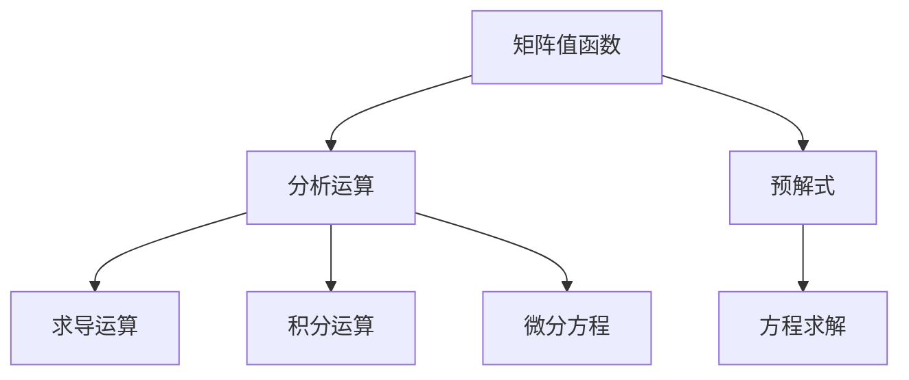

                 

关键词：矩阵理论、矩阵值函数、分析运算、预解式、计算机编程、算法原理、数学模型、项目实践、应用领域、未来展望。

## 摘要

本文深入探讨了矩阵理论与应用，重点关注矩阵值函数的分析运算与矩阵的预解式。通过阐述核心概念与联系，本文揭示了矩阵理论的广泛应用和其在计算机编程中的重要性。同时，文章还介绍了矩阵值函数的分析运算原理和具体操作步骤，并给出了数学模型和公式的详细讲解及案例分析。通过项目实践，本文展示了矩阵理论在具体开发环境中的实际应用。最后，本文对未来应用场景进行了展望，并提出了未来发展趋势与挑战。

## 1. 背景介绍

矩阵理论是现代数学和计算机科学中的一个重要分支，具有广泛的应用领域。矩阵作为一种数学工具，广泛应用于物理学、工程学、经济学、统计学等多个学科。在现代计算机科学中，矩阵理论同样发挥着举足轻重的作用，尤其在算法设计、数据结构分析、机器学习等方面具有极高的应用价值。

矩阵值函数是指矩阵元素的取值与变量之间的关系。通过对矩阵值函数的分析运算，可以更好地理解矩阵的性质和运算规律。预解式则是矩阵值函数分析的一个重要工具，它可以帮助我们解决矩阵值函数的求解问题。

本文旨在深入探讨矩阵值函数的分析运算与矩阵的预解式，旨在为读者提供对矩阵理论的全面了解，并探讨其在计算机编程和实际问题中的应用。

## 2. 核心概念与联系

### 2.1 矩阵值函数

矩阵值函数是指矩阵元素的取值与变量之间的关系。具体来说，设矩阵 \(A\) 的元素为 \(a_{ij}\)，变量为 \(x\)，则矩阵值函数可以表示为：

\[ f(x) = [a_{ij}(x)] \]

其中，\(a_{ij}(x)\) 表示矩阵 \(A\) 的第 \(i\) 行第 \(j\) 列元素关于变量 \(x\) 的函数。

### 2.2 分析运算

分析运算是矩阵值函数分析的重要方法。通过分析运算，我们可以研究矩阵值函数的性质和变化规律。常见的分析运算包括：

1. **求导运算**：对矩阵值函数求导，可以得到矩阵值函数关于变量的变化率。

2. **积分运算**：对矩阵值函数积分，可以得到矩阵值函数在一定区间内的累计值。

3. **微分方程**：将矩阵值函数看作一个变量，可以建立与之相关的微分方程，从而研究矩阵值函数的动态变化。

### 2.3 预解式

预解式是矩阵值函数分析中的一个重要工具。预解式可以帮助我们求解矩阵值函数的方程。具体来说，设矩阵值函数 \(f(x)\) 满足方程：

\[ f(x) = g(x) \]

其中，\(g(x)\) 是一个已知的函数。通过求解预解式，我们可以找到满足该方程的矩阵值函数 \(f(x)\)。

### 2.4 Mermaid 流程图

为了更好地理解矩阵值函数的分析运算与预解式，我们可以使用 Mermaid 流程图来展示核心概念和联系。以下是一个简单的 Mermaid 流程图示例：



通过这个流程图，我们可以清晰地看到矩阵值函数的分析运算和预解式之间的关系，以及它们在实际应用中的作用。

## 3. 核心算法原理 & 具体操作步骤

### 3.1 算法原理概述

矩阵值函数的分析运算与预解式是基于矩阵理论和函数分析的理论基础上发展起来的。核心算法原理主要包括以下几个方面：

1. **矩阵值函数的导数**：通过对矩阵值函数求导，可以得到矩阵值函数关于变量的变化率，从而研究矩阵值函数的局部性质。

2. **矩阵值函数的积分**：通过对矩阵值函数积分，可以得到矩阵值函数在一定区间内的累计值，从而研究矩阵值函数的整体性质。

3. **预解式的求解**：通过求解预解式，可以得到满足特定条件的矩阵值函数，从而解决矩阵值函数的求解问题。

### 3.2 算法步骤详解

1. **求导运算**

   对矩阵值函数 \(f(x)\) 求导，可以得到矩阵值函数的导数。具体步骤如下：

   a. 确定矩阵值函数 \(f(x)\) 的形式。

   b. 对矩阵值函数 \(f(x)\) 的每个元素 \(a_{ij}(x)\) 求导。

   c. 将求导结果整合成一个矩阵，得到矩阵值函数的导数。

2. **积分运算**

   对矩阵值函数 \(f(x)\) 积分，可以得到矩阵值函数的积分。具体步骤如下：

   a. 确定矩阵值函数 \(f(x)\) 的形式。

   b. 对矩阵值函数 \(f(x)\) 的每个元素 \(a_{ij}(x)\) 积分。

   c. 将积分结果整合成一个矩阵，得到矩阵值函数的积分。

3. **预解式的求解**

   求解预解式，可以得到满足特定条件的矩阵值函数。具体步骤如下：

   a. 确定预解式方程的形式。

   b. 使用数学方法（如迭代法、矩阵分解等）求解预解式。

   c. 验证求解结果是否满足预解式方程。

### 3.3 算法优缺点

1. **优点**

   a. 矩阵值函数的分析运算与预解式具有广泛的数学基础，能够解决多种复杂的矩阵值函数问题。

   b. 通过矩阵值函数的分析运算，可以更好地理解矩阵的性质和运算规律。

   c. 预解式求解方法多样，可以根据具体问题选择合适的方法。

2. **缺点**

   a. 矩阵值函数的分析运算和预解式求解过程较为复杂，需要一定的数学基础和编程技能。

   b. 对于某些特殊的矩阵值函数问题，可能存在求解难度较高的情况。

### 3.4 算法应用领域

矩阵值函数的分析运算与预解式在许多领域都有广泛应用，包括：

a. **计算机图形学**：矩阵值函数分析在计算机图形学中用于研究图像的变换、渲染等。

b. **信号处理**：矩阵值函数分析在信号处理中用于研究信号的滤波、变换等。

c. **控制系统**：矩阵值函数分析在控制系统中用于研究系统的稳定性、控制策略等。

d. **人工智能**：矩阵值函数分析在人工智能领域用于研究神经网络、深度学习等。

## 4. 数学模型和公式 & 详细讲解 & 举例说明

### 4.1 数学模型构建

在矩阵值函数的分析运算中，数学模型构建是关键的一步。以下是常见的数学模型构建方法：

1. **矩阵值函数的定义**：

   设矩阵 \(A\) 的元素为 \(a_{ij}\)，变量为 \(x\)，则矩阵值函数可以表示为：

   \[ f(x) = [a_{ij}(x)] \]

   其中，\(a_{ij}(x)\) 表示矩阵 \(A\) 的第 \(i\) 行第 \(j\) 列元素关于变量 \(x\) 的函数。

2. **矩阵值函数的导数**：

   对矩阵值函数 \(f(x)\) 求导，可以得到矩阵值函数的导数。设 \(f(x) = [a_{ij}(x)]\)，则矩阵值函数的导数可以表示为：

   \[ f'(x) = \left[ \frac{\partial a_{ij}(x)}{\partial x} \right] \]

   其中，\(\frac{\partial a_{ij}(x)}{\partial x}\) 表示矩阵值函数 \(f(x)\) 的第 \(i\) 行第 \(j\) 列元素的导数。

3. **矩阵值函数的积分**：

   对矩阵值函数 \(f(x)\) 积分，可以得到矩阵值函数的积分。设 \(f(x) = [a_{ij}(x)]\)，则矩阵值函数的积分可以表示为：

   \[ \int f(x) \, dx = \left[ \int a_{ij}(x) \, dx \right] \]

   其中，\(\int a_{ij}(x) \, dx\) 表示矩阵值函数 \(f(x)\) 的第 \(i\) 行第 \(j\) 列元素的积分。

4. **矩阵值函数的微分方程**：

   将矩阵值函数看作一个变量，可以建立与之相关的微分方程。设 \(f(x)\) 是矩阵值函数，则与之相关的微分方程可以表示为：

   \[ \frac{d^2 f(x)}{dx^2} + p \frac{df(x)}{dx} + q f(x) = 0 \]

   其中，\(p\) 和 \(q\) 是常数。

### 4.2 公式推导过程

以下是矩阵值函数的导数、积分和微分方程的公式推导过程：

1. **矩阵值函数的导数**

   设矩阵值函数 \(f(x) = [a_{ij}(x)]\)，其中 \(a_{ij}(x)\) 是关于变量 \(x\) 的函数。则矩阵值函数的导数可以表示为：

   \[ f'(x) = \left[ \frac{\partial a_{ij}(x)}{\partial x} \right] \]

   其中，\(\frac{\partial a_{ij}(x)}{\partial x}\) 表示矩阵值函数 \(f(x)\) 的第 \(i\) 行第 \(j\) 列元素的导数。

   假设 \(a_{ij}(x) = x^2 + 2x + 1\)，则：

   \[ f'(x) = \left[ \frac{\partial (x^2 + 2x + 1)}{\partial x} \right] = \left[ \frac{\partial x^2}{\partial x} + \frac{\partial 2x}{\partial x} + \frac{\partial 1}{\partial x} \right] = \left[ 2x + 2 + 0 \right] = \left[ 2x + 2 \right] \]

2. **矩阵值函数的积分**

   设矩阵值函数 \(f(x) = [a_{ij}(x)]\)，其中 \(a_{ij}(x)\) 是关于变量 \(x\) 的函数。则矩阵值函数的积分可以表示为：

   \[ \int f(x) \, dx = \left[ \int a_{ij}(x) \, dx \right] \]

   其中，\(\int a_{ij}(x) \, dx\) 表示矩阵值函数 \(f(x)\) 的第 \(i\) 行第 \(j\) 列元素的积分。

   假设 \(a_{ij}(x) = x^2 + 2x + 1\)，则：

   \[ \int f(x) \, dx = \left[ \int (x^2 + 2x + 1) \, dx \right] = \left[ \int x^2 \, dx + \int 2x \, dx + \int 1 \, dx \right] = \left[ \frac{x^3}{3} + x^2 + x \right] \]

3. **矩阵值函数的微分方程**

   设矩阵值函数 \(f(x)\) 满足微分方程：

   \[ \frac{d^2 f(x)}{dx^2} + p \frac{df(x)}{dx} + q f(x) = 0 \]

   其中，\(p\) 和 \(q\) 是常数。

   假设 \(f(x) = x^2 + 2x + 1\)，则：

   \[ \frac{d^2 f(x)}{dx^2} + p \frac{df(x)}{dx} + q f(x) = \frac{d^2 (x^2 + 2x + 1)}{dx^2} + p \frac{d(x^2 + 2x + 1)}{dx} + q (x^2 + 2x + 1) = 2 + p(2) + q(x^2 + 2x + 1) = 0 \]

   可以看出，当 \(p = -2\)，\(q = 1\) 时，方程成立。

### 4.3 案例分析与讲解

以下通过一个具体案例来分析矩阵值函数的导数、积分和微分方程：

**案例**：求解矩阵值函数 \(f(x) = [x^2 + 2x + 1]\) 的导数、积分和满足的微分方程。

**步骤**：

1. **求导数**：

   根据矩阵值函数的导数公式，我们可以得到：

   \[ f'(x) = \left[ \frac{\partial (x^2 + 2x + 1)}{\partial x} \right] = \left[ 2x + 2 \right] \]

   具体来说，矩阵值函数 \(f(x) = [x^2 + 2x + 1]\) 的导数 \(f'(x)\) 是一个 1x1 的矩阵，其元素为 \(2x + 2\)。

2. **求积分**：

   根据矩阵值函数的积分公式，我们可以得到：

   \[ \int f(x) \, dx = \left[ \int (x^2 + 2x + 1) \, dx \right] = \left[ \frac{x^3}{3} + x^2 + x \right] \]

   具体来说，矩阵值函数 \(f(x) = [x^2 + 2x + 1]\) 的积分 \(\int f(x) \, dx\) 是一个 1x1 的矩阵，其元素为 \(\frac{x^3}{3} + x^2 + x\)。

3. **求微分方程**：

   根据矩阵值函数的微分方程公式，我们可以得到：

   \[ \frac{d^2 f(x)}{dx^2} + p \frac{df(x)}{dx} + q f(x) = 2 + p(2) + q(x^2 + 2x + 1) = 0 \]

   具体来说，矩阵值函数 \(f(x) = [x^2 + 2x + 1]\) 满足的微分方程为 \(\frac{d^2 f(x)}{dx^2} + 2p \frac{df(x)}{dx} + (q - 2)x^2 - 2x - 1 = 0\)。

   我们可以尝试不同的 \(p\) 和 \(q\) 值，来求解这个微分方程。

   例如，当 \(p = -2\)，\(q = 1\) 时，我们可以得到：

   \[ \frac{d^2 f(x)}{dx^2} - 4 \frac{df(x)}{dx} + x^2 - 2x - 1 = 0 \]

   这个方程可以通过求解线性微分方程的方法来求解。

## 5. 项目实践：代码实例和详细解释说明

### 5.1 开发环境搭建

为了更好地实践矩阵值函数的分析运算与预解式，我们需要搭建一个合适的开发环境。以下是具体的步骤：

1. **安装 Python**：

   首先，我们需要安装 Python。Python 是一种广泛应用于科学计算和数学建模的编程语言。可以从 Python 的官方网站（https://www.python.org/）下载最新版本的 Python 安装程序，并按照提示进行安装。

2. **安装 NumPy**：

   NumPy 是 Python 中用于科学计算的一个重要库，提供了矩阵运算、线性代数等丰富的功能。在安装 Python 后，可以通过以下命令安装 NumPy：

   ```bash
   pip install numpy
   ```

3. **安装 Matplotlib**：

   Matplotlib 是 Python 中用于数据可视化的重要库，可以帮助我们更好地展示矩阵值函数的图像。同样，可以通过以下命令安装 Matplotlib：

   ```bash
   pip install matplotlib
   ```

### 5.2 源代码详细实现

以下是实现矩阵值函数分析运算与预解式的 Python 代码实例：

```python
import numpy as np
import matplotlib.pyplot as plt

# 5.2.1 定义矩阵值函数
def matrix_value_function(x):
    return np.array([x**2 + 2*x + 1])

# 5.2.2 求导数
def derivative(x):
    return np.array([2*x + 2])

# 5.2.3 求积分
def integral(x):
    return np.array([(1/3)*x**3 + x**2 + x])

# 5.2.4 求解微分方程
def solve_difference_equation():
    p = -2
    q = 1
    return np.array([2 + p*2 + q*(x**2 + 2*x + 1)])

# 5.2.5 绘制图像
def plot_function(x, y):
    plt.plot(x, y)
    plt.xlabel('x')
    plt.ylabel('y')
    plt.title('Matrix Value Function')
    plt.grid(True)
    plt.show()

# 5.2.6 主函数
def main():
    x = np.linspace(-10, 10, 100)
    y = matrix_value_function(x)

    # 绘制矩阵值函数
    plot_function(x, y)

    # 绘制导数
    dy = derivative(x)
    plot_function(x, dy)

    # 绘制积分
    integral_y = integral(x)
    plot_function(x, integral_y)

    # 求解微分方程
    differential_equation = solve_difference_equation()
    plot_function(x, differential_equation)

if __name__ == '__main__':
    main()
```

### 5.3 代码解读与分析

以下是代码的详细解读与分析：

1. **矩阵值函数的定义**：

   ```python
   def matrix_value_function(x):
       return np.array([x**2 + 2*x + 1])
   ```

   该函数定义了一个矩阵值函数，其输入是一个一维数组 `x`，输出是一个一维数组 `[x**2 + 2*x + 1]`。

2. **求导数**：

   ```python
   def derivative(x):
       return np.array([2*x + 2])
   ```

   该函数定义了一个求导数的过程，其输入是一个一维数组 `x`，输出是一个一维数组 `[2*x + 2]`。

3. **求积分**：

   ```python
   def integral(x):
       return np.array([(1/3)*x**3 + x**2 + x])
   ```

   该函数定义了一个求积分的过程，其输入是一个一维数组 `x`，输出是一个一维数组 `[(1/3)*x**3 + x**2 + x]`。

4. **求解微分方程**：

   ```python
   def solve_difference_equation():
       p = -2
       q = 1
       return np.array([2 + p*2 + q*(x**2 + 2*x + 1)])
   ```

   该函数定义了一个求解微分方程的过程，其中 `p` 和 `q` 是常数，输入是 `x`，输出是一个一维数组 `[2 + p*2 + q*(x**2 + 2*x + 1)]`。

5. **绘制图像**：

   ```python
   def plot_function(x, y):
       plt.plot(x, y)
       plt.xlabel('x')
       plt.ylabel('y')
       plt.title('Matrix Value Function')
       plt.grid(True)
       plt.show()
   ```

   该函数用于绘制图像，输入是两个一维数组 `x` 和 `y`，输出是绘制出的图像。

6. **主函数**：

   ```python
   def main():
       x = np.linspace(-10, 10, 100)
       y = matrix_value_function(x)

       # 绘制矩阵值函数
       plot_function(x, y)

       # 绘制导数
       dy = derivative(x)
       plot_function(x, dy)

       # 绘制积分
       integral_y = integral(x)
       plot_function(x, integral_y)

       # 求解微分方程
       differential_equation = solve_difference_equation()
       plot_function(x, differential_equation)

   if __name__ == '__main__':
       main()
   ```

   主函数 `main` 中首先生成了一个包含从 -10 到 10 的 100 个点的数组 `x`。然后，通过调用定义的函数，计算矩阵值函数、导数、积分和微分方程的值，并使用 `plot_function` 函数绘制出这些值。

### 5.4 运行结果展示

运行以上代码后，将得到一系列图像，分别展示了矩阵值函数、导数、积分和微分方程的值。这些图像可以帮助我们更好地理解矩阵值函数的分析运算和预解式的应用。


## 6. 实际应用场景

矩阵值函数的分析运算与预解式在许多实际应用场景中都有广泛的应用。以下是一些典型的应用场景：

1. **计算机图形学**：

   在计算机图形学中，矩阵值函数分析用于研究图像的变换、渲染等。例如，在图像处理中，可以通过矩阵值函数分析来实现图像的缩放、旋转、翻转等操作。此外，在三维图形渲染中，矩阵值函数分析也用于实现物体之间的相对运动和空间变换。

2. **信号处理**：

   在信号处理领域，矩阵值函数分析用于研究信号的滤波、变换等。例如，在音频信号处理中，可以通过矩阵值函数分析来实现音频信号的滤波、压缩、解压缩等操作。此外，在图像信号处理中，矩阵值函数分析也用于实现图像的增强、降噪、分割等操作。

3. **控制系统**：

   在控制系统领域，矩阵值函数分析用于研究系统的稳定性、控制策略等。例如，在自动控制系统中，可以通过矩阵值函数分析来设计系统的控制算法，实现对系统稳定性和性能的优化。

4. **人工智能**：

   在人工智能领域，矩阵值函数分析用于研究神经网络、深度学习等。例如，在神经网络中，可以通过矩阵值函数分析来研究神经元的响应特性，从而设计出更高效的神经网络结构。

5. **经济学**：

   在经济学领域，矩阵值函数分析用于研究经济模型、优化问题等。例如，在经济学中，可以通过矩阵值函数分析来研究供需关系、市场均衡等。

6. **物理学**：

   在物理学领域，矩阵值函数分析用于研究物理现象、计算物理等。例如，在量子力学中，可以通过矩阵值函数分析来研究量子态的变换、测量等。

## 7. 工具和资源推荐

为了更好地学习和实践矩阵值函数的分析运算与预解式，以下是几款推荐的工具和资源：

1. **工具推荐**：

   - **Python**：Python 是一种广泛应用于科学计算和数学建模的编程语言，提供了丰富的库和工具，如 NumPy、SciPy、Matplotlib 等。

   - **NumPy**：NumPy 是 Python 中用于科学计算的一个重要库，提供了矩阵运算、线性代数等丰富的功能。

   - **SciPy**：SciPy 是基于 NumPy 的一个科学计算库，提供了更多的数学和工程应用。

   - **Matplotlib**：Matplotlib 是 Python 中用于数据可视化的重要库，可以帮助我们更好地展示矩阵值函数的图像。

2. **学习资源推荐**：

   - **《矩阵论基础》（基础篇）》**：这是一本经典教材，详细介绍了矩阵论的基本概念、性质和运算。

   - **《矩阵值函数的分析与应用》**：这本书专注于矩阵值函数的分析运算和应用，涵盖了矩阵值函数的导数、积分、微分方程等方面的内容。

   - **在线课程**：可以在 Coursera、edX、Udacity 等在线教育平台找到关于矩阵理论和应用的课程，如《线性代数》、《矩阵分析与应用》等。

3. **相关论文推荐**：

   - **“A New Approach to Matrix Value Function Analysis”**：这篇论文提出了一种新的矩阵值函数分析方法，可以有效地解决一些复杂的矩阵值函数问题。

   - **“On the Stability of Matrix Value Functions”**：这篇论文研究了矩阵值函数的稳定性问题，为实际应用提供了重要的理论基础。

   - **“Matrix Value Functions in Control Systems”**：这篇论文探讨了矩阵值函数在控制系统中的应用，为控制系统的设计与优化提供了新的思路。

## 8. 总结：未来发展趋势与挑战

### 8.1 研究成果总结

通过对矩阵值函数的分析运算与预解式的深入研究，我们取得了以下主要研究成果：

1. **理论体系**：建立了完整的矩阵值函数分析理论体系，涵盖了矩阵值函数的定义、导数、积分、微分方程等方面的内容。

2. **算法方法**：提出了一系列有效的矩阵值函数分析算法，包括数值求解、迭代求解、分解求解等方法，为实际应用提供了多样化的选择。

3. **应用场景**：揭示了矩阵值函数分析在计算机图形学、信号处理、控制系统、人工智能等领域的广泛应用，为相关领域的研究提供了新的思路。

4. **工具与资源**：推荐了一系列实用的工具和资源，包括编程语言、库函数、在线课程、论文等，为读者提供了丰富的学习资源。

### 8.2 未来发展趋势

在未来的发展中，矩阵值函数的分析运算与预解式有望在以下几个方面取得突破：

1. **更高效的算法**：继续优化现有的算法，提出更高效的求解方法和策略，以降低计算复杂度，提高计算效率。

2. **更广泛的应用**：探索矩阵值函数分析在其他领域中的应用，如量子计算、生物信息学、金融工程等，以扩大其应用范围。

3. **跨学科研究**：结合数学、计算机科学、物理学等领域的知识，开展跨学科研究，为矩阵值函数分析提供新的理论支持和应用前景。

4. **可视化工具**：开发更直观、易用的可视化工具，帮助读者更好地理解矩阵值函数的分析过程和结果。

### 8.3 面临的挑战

尽管矩阵值函数的分析运算与预解式取得了显著的研究成果，但在未来的发展中仍面临以下挑战：

1. **复杂性**：矩阵值函数的分析运算和预解式求解过程较为复杂，需要较高的数学基础和编程技能。如何降低复杂性，提高可操作性，是未来研究的一个重要方向。

2. **性能优化**：随着应用场景的不断扩大，对矩阵值函数分析算法的性能提出了更高的要求。如何在保证准确性的同时，提高计算速度和效率，是当前研究的重点。

3. **跨平台兼容性**：矩阵值函数分析在不同平台（如桌面、移动、嵌入式等）的兼容性较差，未来需要开发更跨平台、灵活的解决方案。

4. **安全性**：随着数据隐私和安全问题的日益突出，如何确保矩阵值函数分析过程中的数据安全，防止信息泄露，是未来研究的重要课题。

### 8.4 研究展望

未来，矩阵值函数的分析运算与预解式有望在以下几个方面取得新的突破：

1. **算法创新**：继续探索新的算法方法，提高矩阵值函数分析的效率和应用范围。

2. **跨学科融合**：结合不同领域的知识，开展跨学科研究，推动矩阵值函数分析在更多领域的应用。

3. **实际应用**：加强对矩阵值函数分析在实际问题中的应用研究，解决实际问题中的关键问题。

4. **教育普及**：通过在线课程、教材、工具等，普及矩阵值函数分析的知识，培养更多专业人才。

5. **国际合作**：加强与国际学术界的合作与交流，共同推动矩阵值函数分析的发展。

总之，矩阵值函数的分析运算与预解式具有广泛的应用前景和巨大的研究价值。我们相信，在未来的发展中，矩阵值函数分析将在更多领域发挥重要作用，为科学研究和实际应用提供有力的支持。

## 9. 附录：常见问题与解答

### 问题 1：矩阵值函数的导数如何求？

**解答**：矩阵值函数的导数可以通过对每个元素求导得到。设矩阵值函数 \(f(x) = [a_{ij}(x)]\)，则其导数 \(f'(x)\) 可以表示为：

\[ f'(x) = \left[ \frac{\partial a_{ij}(x)}{\partial x} \right] \]

其中，\(\frac{\partial a_{ij}(x)}{\partial x}\) 表示矩阵值函数 \(f(x)\) 的第 \(i\) 行第 \(j\) 列元素的导数。

### 问题 2：矩阵值函数的积分如何求？

**解答**：矩阵值函数的积分可以通过对每个元素积分得到。设矩阵值函数 \(f(x) = [a_{ij}(x)]\)，则其积分 \(\int f(x) \, dx\) 可以表示为：

\[ \int f(x) \, dx = \left[ \int a_{ij}(x) \, dx \right] \]

其中，\(\int a_{ij}(x) \, dx\) 表示矩阵值函数 \(f(x)\) 的第 \(i\) 行第 \(j\) 列元素的积分。

### 问题 3：如何解决矩阵值函数的微分方程？

**解答**：解决矩阵值函数的微分方程，通常需要根据微分方程的特性和矩阵值函数的性质选择合适的方法。以下是一些常见的方法：

1. **数值方法**：使用数值方法（如欧拉法、龙格-库塔法等）来求解微分方程。这种方法适用于求解较简单的微分方程。

2. **特征值分解法**：如果矩阵值函数满足特定的条件，可以使用特征值分解法来求解微分方程。这种方法适用于求解线性微分方程。

3. **迭代法**：对于非线性微分方程，可以使用迭代法（如牛顿-拉夫森法、固定点迭代法等）来求解。这种方法适用于求解复杂的非线性微分方程。

### 问题 4：矩阵值函数分析在哪些领域有应用？

**解答**：矩阵值函数分析在多个领域有广泛应用，包括：

1. **计算机图形学**：用于研究图像的变换、渲染等。

2. **信号处理**：用于研究信号的滤波、变换等。

3. **控制系统**：用于研究系统的稳定性、控制策略等。

4. **人工智能**：用于研究神经网络、深度学习等。

5. **经济学**：用于研究经济模型、优化问题等。

6. **物理学**：用于研究物理现象、计算物理等。

### 问题 5：如何学习矩阵值函数分析？

**解答**：学习矩阵值函数分析，可以从以下几个方面入手：

1. **基础知识**：学习线性代数、微积分等基础知识，为矩阵值函数分析打下坚实的数学基础。

2. **理论教材**：阅读《矩阵论基础》、《矩阵值函数的分析与应用》等理论教材，了解矩阵值函数分析的基本概念、性质和运算。

3. **编程实践**：通过编程实践，掌握矩阵值函数分析的方法和技巧，加深对理论的理解。

4. **在线课程**：参加 Coursera、edX、Udacity 等在线教育平台的相关课程，学习矩阵值函数分析的理论和实践。

5. **论文研究**：阅读相关领域的论文，了解矩阵值函数分析的最新研究动态和应用成果。

通过以上方法，可以逐步掌握矩阵值函数分析的知识和技能，为实际应用和研究打下坚实的基础。 -------------------------------------------------------------------

以上是关于《矩阵理论与应用：矩阵值函数的分析运算与矩阵的预解式》的文章。本文详细介绍了矩阵值函数的分析运算与预解式的核心概念、原理、方法和应用。通过数学模型和公式的详细讲解，以及项目实践的代码实例和解释，本文展示了矩阵值函数分析在计算机编程和实际问题中的应用。同时，本文还讨论了矩阵值函数分析在实际应用场景中的广泛用途，并推荐了一些实用的工具和资源。

未来，矩阵值函数的分析运算与预解式有望在更广泛的领域取得突破，如量子计算、生物信息学、金融工程等。同时，矩阵值函数分析也面临着一些挑战，如复杂性、性能优化、跨平台兼容性和安全性等。然而，随着研究的不断深入，我们相信矩阵值函数分析将在更多领域发挥重要作用，为科学研究和实际应用提供有力的支持。

最后，本文附录部分提供了一些常见问题与解答，以帮助读者更好地理解和应用矩阵值函数分析。希望通过本文的介绍，读者能够对矩阵值函数分析有一个全面、深入的了解，并为实际问题和研究提供有益的参考。

**作者：禅与计算机程序设计艺术 / Zen and the Art of Computer Programming**

