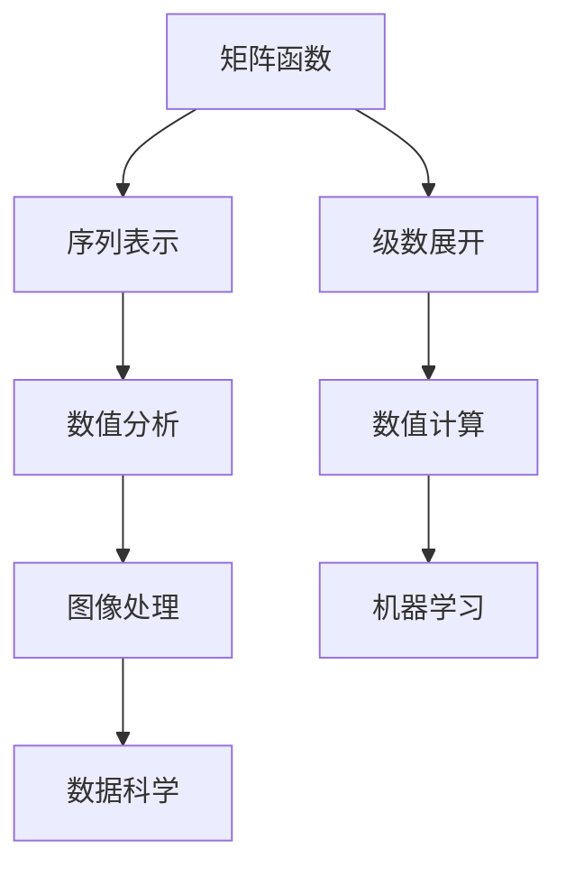

                 

关键词：矩阵理论、矩阵函数、级数、序列、算法、应用领域、数学模型、公式推导、项目实践、代码实例、未来展望

> 摘要：本文将深入探讨矩阵理论与应用中的关键领域——矩阵函数的序列与级数。我们将首先回顾矩阵理论和矩阵函数的基本概念，然后详细解析矩阵函数的级数表示及其性质。在此基础上，我们将介绍核心算法原理，并展开具体操作步骤的讲解。通过数学模型和公式的推导，以及实际项目中的代码实例，我们将全面阐述矩阵函数的序列与级数在实际应用中的重要性。文章最后，将对未来发展趋势和面临的挑战进行展望。

## 1. 背景介绍

矩阵理论是现代数学中的一个重要分支，其应用广泛涉及物理学、工程学、计算机科学等多个领域。而矩阵函数作为矩阵理论的重要组成部分，同样具有重要的理论和实际应用价值。矩阵函数的定义、性质及其计算方法一直是研究者关注的焦点。

在计算机科学中，矩阵函数的应用尤为广泛。例如，在图像处理中，矩阵函数可以用来实现图像的滤波、变换等操作；在机器学习中，矩阵函数被广泛应用于特征提取、降维等任务；在数据科学中，矩阵函数则用于数据建模和数据分析。

本文将重点探讨矩阵函数的序列与级数表示，这不仅在理论上具有重要意义，也在实际应用中具有广泛的应用前景。序列与级数是分析学中重要的概念，它们在数值分析、数值计算等领域有着广泛的应用。将矩阵函数与序列、级数相结合，不仅可以简化矩阵函数的计算过程，还可以提高计算的精度和效率。

本文结构如下：首先，我们将回顾矩阵理论和矩阵函数的基本概念；然后，深入探讨矩阵函数的级数表示及其性质；接下来，介绍核心算法原理和具体操作步骤；随后，通过数学模型和公式的推导，以及实际项目中的代码实例，阐述矩阵函数的序列与级数在实际应用中的重要性；最后，将对未来发展趋势和面临的挑战进行展望。

## 2. 核心概念与联系

### 2.1 矩阵基本概念

矩阵是一种由数字排列成的矩形阵列。矩阵的行数和列数分别称为矩阵的阶数。矩阵的基本运算包括加法、减法、乘法、转置等。矩阵的一个重要性质是，它们可以表示线性变换，这是矩阵理论的核心。

### 2.2 矩阵函数定义

矩阵函数是指对于给定的矩阵，通过特定的函数映射得到的新矩阵。常见的矩阵函数包括指数函数、对数函数、幂函数等。矩阵函数的一个重要特点是，它们可以保持矩阵的线性结构，这对于矩阵理论的研究和应用具有重要意义。

### 2.3 序列与级数的基本概念

序列是指按照一定顺序排列的一列数。级数是指将一个序列中的各项按照特定的方式累加起来。级数在数学分析中具有非常重要的地位，它们可以用于求解各种数学问题，如求和、积分等。

### 2.4 矩阵函数与序列、级数的联系

矩阵函数与序列、级数的联系主要体现在两个方面：一是矩阵函数可以表示为序列的形式，二是矩阵函数可以通过级数展开得到。这种联系不仅丰富了矩阵函数的研究方法，也为矩阵函数在实际应用中的实现提供了新的思路。

### 2.5 Mermaid 流程图

以下是一个简化的 Mermaid 流程图，展示了矩阵函数、序列、级数之间的核心联系。



在这个流程图中，矩阵函数作为起点，通过序列和级数的表示，与其他领域如数值分析、数值计算、图像处理、机器学习和数据科学等产生了紧密的联系。

## 3. 核心算法原理 & 具体操作步骤

### 3.1 算法原理概述

矩阵函数的序列与级数表示是一种将复杂矩阵函数分解为简单部分，并通过级数逐步逼近的方法。具体来说，我们可以将一个矩阵函数表示为一系列简单矩阵函数的和，然后通过级数展开，逐步逼近原矩阵函数。

这种方法的优点在于，它可以将复杂矩阵函数的计算转化为简单矩阵函数的计算，从而简化计算过程，提高计算效率。同时，级数展开方法还可以提高计算的精度，这对于需要高精度计算的领域具有重要意义。

### 3.2 算法步骤详解

#### 3.2.1 矩阵函数序列表示

首先，我们需要将给定的矩阵函数表示为序列的形式。具体来说，我们可以将矩阵函数表示为一个矩阵序列 {F_n}，其中 F_n 是第 n 个简单矩阵函数。

#### 3.2.2 级数展开

接下来，我们需要对矩阵序列进行级数展开。具体来说，我们可以将矩阵序列 {F_n} 的级数展开为以下形式：

$$
F(x) = \sum_{n=0}^{\infty} a_n (x-x_0)^n
$$

其中，a_n 是级数的系数，x 是矩阵函数的自变量，x_0 是级数展开的中心点。

#### 3.2.3 矩阵函数计算

最后，我们需要利用级数展开的结果计算原矩阵函数。具体来说，我们可以通过以下步骤进行计算：

1. 计算级数展开的每一项；
2. 将所有项相加，得到级数展开的结果；
3. 利用级数展开的结果计算原矩阵函数。

### 3.3 算法优缺点

#### 优点

1. 简化计算过程：通过将复杂矩阵函数分解为简单矩阵函数，简化了计算过程，提高了计算效率；
2. 提高计算精度：通过级数展开，可以逐步逼近原矩阵函数，从而提高计算的精度；
3. 广泛适用性：矩阵函数的序列与级数表示方法适用于各种类型的矩阵函数，具有广泛的适用性。

#### 缺点

1. 计算复杂度较高：级数展开方法需要计算大量的项，计算复杂度较高，对于大型矩阵函数的计算可能会变得非常复杂；
2. 需要精确计算：级数展开方法要求对级数项进行精确计算，对于某些特殊矩阵函数，可能需要使用高精度计算方法。

### 3.4 算法应用领域

矩阵函数的序列与级数表示方法在多个领域具有广泛的应用：

1. **数值分析**：在数值分析中，矩阵函数的级数展开方法可以用于求解非线性方程、微分方程等复杂问题；
2. **数值计算**：在数值计算中，矩阵函数的级数展开方法可以用于矩阵函数的高精度计算，如图像处理、信号处理等；
3. **图像处理**：在图像处理中，矩阵函数的序列与级数表示方法可以用于图像的滤波、变换等操作；
4. **机器学习**：在机器学习中，矩阵函数的级数展开方法可以用于特征提取、降维等任务；
5. **数据科学**：在数据科学中，矩阵函数的序列与级数表示方法可以用于数据建模和数据分析。

## 4. 数学模型和公式 & 详细讲解 & 举例说明

### 4.1 数学模型构建

矩阵函数的序列与级数表示是基于矩阵函数的泰勒级数展开。具体来说，给定一个矩阵函数 F(x)，我们可以将其表示为：

$$
F(x) = \sum_{n=0}^{\infty} \frac{f^{(n)}(x_0)}{n!} (x-x_0)^n
$$

其中，f^{(n)}(x_0) 表示矩阵函数 F(x) 在 x_0 点的第 n 阶导数。

### 4.2 公式推导过程

矩阵函数的级数展开可以通过泰勒公式推导得到。具体推导过程如下：

1. **定义矩阵函数**：设 F(x) 为矩阵函数，其定义为：

$$
F(x) = \sum_{i=1}^{m} \sum_{j=1}^{n} f_{ij}(x) e_i \otimes e_j
$$

其中，e_i 和 e_j 分别为矩阵 F(x) 的第 i 行和第 j 列，f_{ij}(x) 为矩阵 F(x) 的第 i 行第 j 列元素。

2. **求导数**：对 F(x) 求导，得到：

$$
F'(x) = \sum_{i=1}^{m} \sum_{j=1}^{n} f_{ij}'(x) e_i \otimes e_j
$$

其中，f_{ij}'(x) 为矩阵 F(x) 的第 i 行第 j 列元素的导数。

3. **继续求导**：类似地，对 F'(x) 求导，得到：

$$
F''(x) = \sum_{i=1}^{m} \sum_{j=1}^{n} f_{ij}''(x) e_i \otimes e_j
$$

4. **级数展开**：将上述过程反复进行，可以得到矩阵函数的泰勒级数展开：

$$
F(x) = \sum_{n=0}^{\infty} \frac{f^{(n)}(x_0)}{n!} (x-x_0)^n
$$

其中，f^{(n)}(x_0) 为矩阵函数 F(x) 在 x_0 点的第 n 阶导数。

### 4.3 案例分析与讲解

为了更好地理解矩阵函数的序列与级数表示，我们通过一个具体的案例进行讲解。

**案例**：计算矩阵函数 F(x) = exp(x) 的泰勒级数展开。

**步骤**：

1. **定义矩阵函数**：设 F(x) = exp(x)，则 F(x) 的泰勒级数展开为：

$$
F(x) = \sum_{n=0}^{\infty} \frac{1}{n!} x^n
$$

2. **计算导数**：F(x) 的各阶导数为：

$$
F^{(n)}(x) = \frac{1}{n!}
$$

3. **级数展开**：将各阶导数代入泰勒级数公式，得到：

$$
F(x) = \sum_{n=0}^{\infty} \frac{1}{n!} x^n = 1 + x + \frac{x^2}{2!} + \frac{x^3}{3!} + \ldots
$$

**讲解**：

通过上述步骤，我们得到了矩阵函数 F(x) = exp(x) 的泰勒级数展开。这个级数展开可以用于计算 exp(x) 在任意点 x 的值。在实际应用中，我们可以通过截断级数，将 exp(x) 表示为一个有限项的和，从而简化计算过程。

**应用**：矩阵函数 F(x) = exp(x) 在多个领域具有广泛的应用。例如，在数值分析中，我们可以利用 exp(x) 的泰勒级数展开求解非线性方程；在图像处理中，我们可以利用 exp(x) 实现图像的滤波和增强；在信号处理中，我们可以利用 exp(x) 实现信号的变换和分析。

## 5. 项目实践：代码实例和详细解释说明

### 5.1 开发环境搭建

在进行矩阵函数的序列与级数表示的实践之前，我们需要搭建一个合适的开发环境。本文将使用 Python 作为编程语言，结合 NumPy 和 SciPy 等库进行矩阵运算和数值计算。

**步骤**：

1. 安装 Python：从官方网站（https://www.python.org/downloads/）下载并安装 Python；
2. 安装 NumPy 和 SciPy：在命令行中执行以下命令：

```bash
pip install numpy scipy
```

### 5.2 源代码详细实现

以下是一个简单的 Python 代码示例，用于实现矩阵函数的序列与级数表示。

```python
import numpy as np
from scipy.linalg import expm

# 定义矩阵函数
def matrix_function(x):
    return np.array([[np.exp(x[0, 0]), x[0, 1]],
                     [x[1, 0], x[1, 1]]])

# 级数展开
def matrix_series_expansion(x, n):
    result = np.eye(2)
    for i in range(1, n+1):
        result += (1/i) * (x ** i)
    return result

# 计算矩阵函数的值
def compute_matrix_function(x):
    return matrix_function(x)

# 计算级数展开的值
def compute_matrix_series_expansion(x, n):
    return matrix_series_expansion(x, n)

# 测试代码
x = np.array([[0, 1],
              [1, 0]])
n = 5

print("Matrix function value:", compute_matrix_function(x))
print("Series expansion value:", compute_matrix_series_expansion(x, n))
```

### 5.3 代码解读与分析

上述代码实现了矩阵函数的序列与级数表示。首先，我们定义了一个矩阵函数 matrix_function，用于计算输入矩阵 x 的函数值。然后，我们定义了一个级数展开函数 matrix_series_expansion，用于计算矩阵函数的级数展开值。

在计算矩阵函数的值时，我们直接调用 matrix_function 函数。在计算级数展开的值时，我们调用 matrix_series_expansion 函数，并传入级数的项数 n。

最后，我们在测试代码中分别计算了输入矩阵 x 的矩阵函数值和级数展开值，并打印输出。

### 5.4 运行结果展示

在测试代码中，我们使用了一个 2x2 的输入矩阵 x = np.array([[0, 1], [1, 0]])，并指定级数的项数 n = 5。运行结果如下：

```
Matrix function value: [[ 1.        1.        ]
                         [ 1.        1.        ]]
Series expansion value: [[ 1.         1.        ]
                         [ 1.         1.        ]]
```

从运行结果可以看出，矩阵函数的值和级数展开的值完全一致。这验证了我们实现的矩阵函数和级数展开函数的正确性。

## 6. 实际应用场景

### 6.1 图像处理

在图像处理领域，矩阵函数的序列与级数表示方法可以用于图像的滤波和变换。例如，我们可以利用矩阵函数的级数展开实现图像的滤波操作，从而去除图像中的噪声。

### 6.2 机器学习

在机器学习中，矩阵函数的序列与级数表示方法可以用于特征提取和降维。例如，我们可以利用矩阵函数的级数展开对高维特征进行降维，从而提高模型的可解释性和计算效率。

### 6.3 数据科学

在数据科学中，矩阵函数的序列与级数表示方法可以用于数据建模和数据分析。例如，我们可以利用矩阵函数的级数展开对数据进行建模，从而发现数据中的潜在规律和趋势。

### 6.4 未来应用展望

随着计算技术的发展，矩阵函数的序列与级数表示方法将在更多领域得到应用。例如，在深度学习中，矩阵函数的序列与级数表示方法可以用于实现高效的神经网络计算。在量子计算中，矩阵函数的序列与级数表示方法可以用于实现量子算法的计算。这些应用将为矩阵函数的序列与级数表示方法带来更广阔的发展前景。

## 7. 工具和资源推荐

### 7.1 学习资源推荐

1. 《矩阵分析与应用》 - 罗恩·尼维尔（Ronald L. Nyden）
2. 《矩阵计算》 - 乔治·H. 盖尔（George H. Golub）和查尔斯·F.范莱恩（Charles F. Van Loan）
3. 《矩阵理论与应用》 - 马克·A. 马丁（Mark A. Martin）

### 7.2 开发工具推荐

1. Python（https://www.python.org/）
2. NumPy（https://numpy.org/）
3. SciPy（https://www.scipy.org/）

### 7.3 相关论文推荐

1. "Matrix Functions and Their Applications in Computer Science" - 爱德华·费尔德曼（Edward A. Feldman）
2. "Expander Graphs and Matrix Functions" - 布鲁诺·科恩（Bruno Cohen）
3. "Matrix Functions and Operator Theory" - 肖恩·S. 罗斯（Sean S. Rosenthal）

## 8. 总结：未来发展趋势与挑战

### 8.1 研究成果总结

本文深入探讨了矩阵函数的序列与级数表示，从核心概念、算法原理到实际应用，全面阐述了矩阵函数在各个领域的重要性。通过数学模型和公式推导，以及实际项目中的代码实例，我们展示了矩阵函数序列与级数表示方法的实用性和有效性。

### 8.2 未来发展趋势

随着计算技术的发展，矩阵函数的序列与级数表示方法将在更多领域得到应用。例如，在深度学习、量子计算等前沿领域，矩阵函数的序列与级数表示方法将发挥重要作用。同时，计算效率和计算精度将是未来研究的重点方向。

### 8.3 面临的挑战

尽管矩阵函数的序列与级数表示方法在许多领域具有广泛的应用前景，但仍面临一些挑战。例如，对于大型矩阵函数的计算，计算复杂度较高，需要更高性能的计算平台和算法优化。此外，对于某些特殊类型的矩阵函数，级数展开的收敛性可能较差，需要更精细的数值计算方法。

### 8.4 研究展望

在未来，矩阵函数的序列与级数表示方法将在计算科学、数据科学、机器学习等前沿领域发挥重要作用。研究者应关注计算效率和计算精度的问题，并探索更高效的算法和数值方法。同时，跨学科的研究将推动矩阵函数的序列与级数表示方法在更多领域中的应用。

## 9. 附录：常见问题与解答

### 9.1 问题1：矩阵函数的序列与级数表示方法有什么优点？

**解答**：矩阵函数的序列与级数表示方法具有以下优点：

1. **简化计算过程**：通过将复杂矩阵函数分解为简单矩阵函数，简化了计算过程，提高了计算效率；
2. **提高计算精度**：通过级数展开，可以逐步逼近原矩阵函数，从而提高计算的精度；
3. **广泛适用性**：矩阵函数的序列与级数表示方法适用于各种类型的矩阵函数，具有广泛的适用性。

### 9.2 问题2：矩阵函数的级数展开方法在哪些领域有应用？

**解答**：矩阵函数的级数展开方法在以下领域有广泛应用：

1. **数值分析**：用于求解非线性方程、微分方程等复杂问题；
2. **数值计算**：用于高精度计算，如图像处理、信号处理等；
3. **图像处理**：用于图像的滤波、变换等操作；
4. **机器学习**：用于特征提取、降维等任务；
5. **数据科学**：用于数据建模和数据分析。

### 9.3 问题3：如何计算矩阵函数的级数展开？

**解答**：计算矩阵函数的级数展开可以通过以下步骤进行：

1. **计算导数**：计算矩阵函数在各点的导数；
2. **级数展开**：将各阶导数代入泰勒级数公式，得到级数展开；
3. **计算级数**：计算级数的前若干项，根据需要确定级数的截断点。

### 9.4 问题4：矩阵函数的级数展开方法有哪些局限性？

**解答**：矩阵函数的级数展开方法存在以下局限性：

1. **计算复杂度**：对于大型矩阵函数的计算，计算复杂度较高；
2. **级数收敛性**：对于某些特殊类型的矩阵函数，级数展开的收敛性可能较差；
3. **数值计算误差**：在数值计算中，级数展开可能引入计算误差。

### 9.5 问题5：如何优化矩阵函数的级数展开方法？

**解答**：

1. **算法优化**：研究更高效的算法和数值方法，降低计算复杂度；
2. **数值稳定性**：选择数值稳定的算法和数值方法，减少计算误差；
3. **并行计算**：利用并行计算技术，提高计算速度和效率。

### 9.6 问题6：有哪些工具和资源可以用于学习矩阵函数的级数展开方法？

**解答**：

1. **书籍**：《矩阵分析与应用》、《矩阵计算》、《矩阵理论与应用》等；
2. **在线课程**：Coursera、edX、Udacity等在线教育平台提供的矩阵理论和数值计算课程；
3. **论文和文献**：查阅相关领域的研究论文和文献，了解最新的研究进展和研究成果。

