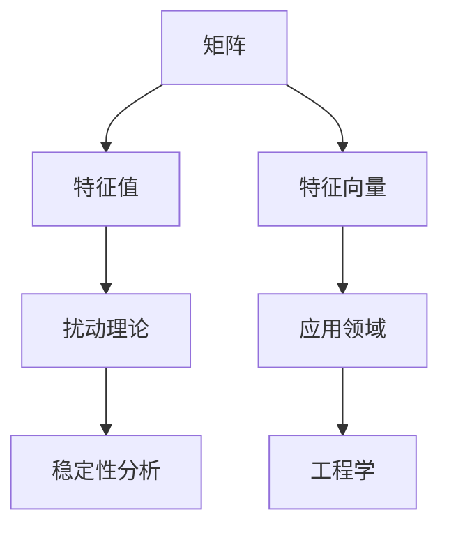

                 

关键词：矩阵理论、特征值、扰动分析、算法原理、应用领域、数学模型、项目实践、代码实例、未来展望。

## 摘要

本文旨在深入探讨矩阵理论中一个重要的研究领域——矩阵特征值的扰动分析。通过对矩阵特征值在扰动下的行为进行研究，我们不仅能够更好地理解矩阵的性质，还能为实际问题提供有效的解决方案。本文将详细讨论矩阵特征值的定义、扰动分析的基本原理，以及在实际应用中的操作步骤。此外，还将通过数学模型和具体代码实例，展示矩阵特征值扰动分析的实际应用，并展望未来该领域的研究趋势和挑战。

## 1. 背景介绍

矩阵理论作为现代数学和工程学的重要分支，其在各种领域都有着广泛的应用。其中，矩阵的特征值和特征向量是矩阵理论中极为重要的概念，它们不仅在数学理论研究中有着重要地位，也在实际工程和科学计算中发挥着关键作用。特征值和特征向量可以帮助我们理解矩阵的动态行为、稳定性和能量分布等。

矩阵特征值的扰动分析是研究当矩阵遭受微小扰动时，其特征值如何变化的问题。这一问题在工程设计和科学研究中具有实际意义，例如，在结构分析中，了解结构受到微小扰动后其频率特性的变化，有助于优化设计，提高结构稳定性。此外，在控制理论中，研究系统的扰动特性对于系统的设计和控制策略的制定也是至关重要的。

本文将系统地介绍矩阵特征值扰动分析的基本原理、数学模型、算法实现及应用实例，旨在为读者提供一份全面且实用的技术指南。

## 2. 核心概念与联系

在深入探讨矩阵特征值的扰动分析之前，我们首先需要明确一些核心概念，包括矩阵、特征值、特征向量以及扰动理论。

### 2.1 矩阵

矩阵是由一系列数按行列排列所组成的一个矩形阵列。矩阵可以表示线性变换、系统状态、数据集等多种数学对象。在数学和工程学中，矩阵的应用非常广泛，包括线性方程组的求解、线性变换、特征值分析等。

### 2.2 特征值和特征向量

特征值（Eigenvalue）和特征向量（Eigenvector）是矩阵理论中极为重要的概念。给定一个矩阵 \( A \)，如果存在一个非零向量 \( \mathbf{v} \) 和一个标量 \( \lambda \)，使得

$$
A\mathbf{v} = \lambda\mathbf{v}
$$

则 \( \lambda \) 被称为矩阵 \( A \) 的特征值，\( \mathbf{v} \) 被称为 \( A \) 的属于 \( \lambda \) 的特征向量。

特征值和特征向量在多个领域具有重要的应用，例如：

- **物理学**：描述系统的能量状态、振动模式等。
- **工程学**：分析结构的动态响应、稳定性等。
- **计算机科学**：用于算法优化、图像处理、机器学习等。

### 2.3 抖动理论

抖动（Stochastic Perturbation）是指对系统或模型施加的随机扰动。在矩阵特征值的分析中，抖动理论关注的是当矩阵遭受微小扰动时，其特征值和特征向量的变化规律。这种研究有助于我们了解系统的鲁棒性和稳定性。

### 2.4 Mermaid 流程图

为了更好地理解矩阵特征值扰动分析的核心概念和联系，我们可以使用 Mermaid 流程图来展示它们之间的关系。以下是一个简单的 Mermaid 流程图：



在这个流程图中，矩阵是整个分析的基础，特征值和特征向量是其核心概念，扰动理论用于研究扰动对它们的影响，而应用领域则展示了它们在工程和科学中的实际应用。

### 2.5 核心概念总结

通过上述介绍，我们可以总结出矩阵特征值扰动分析的核心概念和联系：

- **矩阵**：是所有后续分析的基础。
- **特征值和特征向量**：描述了矩阵的本质特性。
- **扰动理论**：提供了分析矩阵在扰动下行为的方法。
- **应用领域**：展示了矩阵特征值扰动分析的实际意义。

这些概念相互关联，共同构成了矩阵特征值扰动分析的理论框架。接下来，我们将进一步探讨矩阵特征值扰动分析的基本原理和具体操作步骤。

### 3. 核心算法原理 & 具体操作步骤

#### 3.1 算法原理概述

矩阵特征值扰动分析的核心算法是基于扰动理论，通过对原矩阵施加微小扰动，分析扰动前后特征值的变化情况。这个过程中，我们需要关注以下几个关键点：

- **扰动矩阵**：对原矩阵 \( A \) 施加的微小扰动矩阵 \( P \)。
- **扰动范围**：扰动矩阵 \( P \) 的取值范围。
- **特征值变化**：扰动前后特征值的变化情况，包括特征值的增减、移动以及频率特性。
- **特征向量变化**：扰动前后特征向量的变化情况。

#### 3.2 算法步骤详解

以下是一个简单的矩阵特征值扰动分析的算法步骤：

1. **初始化**：给定原矩阵 \( A \) 和扰动矩阵 \( P \) 的取值范围。
2. **计算原矩阵特征值和特征向量**：使用特征值求解算法（如QR算法、雅可比方法等）计算原矩阵 \( A \) 的特征值和特征向量。
3. **施加扰动**：根据扰动矩阵 \( P \) 的取值范围，随机生成一个微小扰动矩阵 \( P_t \)。
4. **计算扰动后矩阵特征值和特征向量**：使用特征值求解算法计算扰动后矩阵 \( A + P_t \) 的特征值和特征向量。
5. **分析特征值和特征向量的变化**：对比扰动前后的特征值和特征向量，分析特征值的变化规律，包括特征值的增减、移动以及频率特性。
6. **重复实验**：多次重复上述步骤，以验证分析结果的稳定性和可靠性。

#### 3.3 算法优缺点

- **优点**：

  - **稳定性分析**：通过扰动分析，可以了解矩阵特征值在扰动下的稳定性，从而为系统的设计提供参考。
  - **鲁棒性分析**：扰动分析有助于评估系统在受到外部扰动时的鲁棒性，有助于提高系统的抗扰动能力。
  - **泛化能力**：扰动分析可以应用于不同类型的矩阵，具有广泛的适用性。

- **缺点**：

  - **计算复杂度**：特征值求解算法的计算复杂度较高，特别是在处理大规模矩阵时，计算时间较长。
  - **误差分析**：扰动分析的结果可能受到计算误差的影响，需要仔细分析和验证。

#### 3.4 算法应用领域

矩阵特征值扰动分析在以下领域具有广泛的应用：

- **结构分析**：在结构动力学和振动学中，用于分析结构在微小扰动下的动态响应和稳定性。
- **控制理论**：在控制系统设计和稳定性分析中，用于研究系统在扰动下的行为，优化控制策略。
- **信号处理**：在信号处理中，用于分析信号在噪声扰动下的特性，提高信号识别和过滤的效果。
- **机器学习**：在机器学习中，用于评估模型的鲁棒性和稳定性，提高模型的泛化能力。

#### 3.5 算法实现示例

以下是一个简单的Python代码示例，用于实现矩阵特征值扰动分析：

```python
import numpy as np

# 定义原矩阵 A
A = np.array([[2, 1], [1, 2]])

# 定义扰动矩阵 P 的取值范围
P_min, P_max = 0, 0.1

# 计算原矩阵的特征值和特征向量
eigenvalues, eigenvectors = np.linalg.eig(A)

# 随机生成扰动矩阵 P_t
P_t = np.random.uniform(P_min, P_max, A.shape)

# 计算扰动后矩阵的特征值和特征向量
A_perturbed = A + P_t
eigenvalues_perturbed, eigenvectors_perturbed = np.linalg.eig(A_perturbed)

# 分析特征值和特征向量的变化
print("Original eigenvalues:", eigenvalues)
print("Perturbed eigenvalues:", eigenvalues_perturbed)
print("Original eigenvectors:", eigenvectors)
print("Perturbed eigenvectors:", eigenvectors_perturbed)
```

在这个示例中，我们首先定义了一个2x2的矩阵 \( A \)，然后随机生成了一个扰动矩阵 \( P_t \)，并计算了扰动前后的特征值和特征向量。通过对比这两个结果，我们可以分析特征值和特征向量在扰动下的变化情况。

### 4. 数学模型和公式 & 详细讲解 & 举例说明

#### 4.1 数学模型构建

矩阵特征值扰动分析的数学模型基于扰动理论，其核心是研究当矩阵 \( A \) 遭受微小扰动 \( P \) 时，其特征值 \( \lambda \) 和特征向量 \( \mathbf{v} \) 的变化规律。具体来说，我们考虑以下扰动模型：

$$
A + P = A_0 + \delta A
$$

其中，\( A_0 \) 是原矩阵，\( \delta A \) 是扰动矩阵，\( P \) 是施加在矩阵 \( A \) 上的微小扰动。

#### 4.2 公式推导过程

为了推导矩阵特征值扰动分析的基本公式，我们需要考虑以下两点：

1. **特征值的变化**：假设原矩阵 \( A_0 \) 的特征值为 \( \lambda_0 \)，特征向量为 \( \mathbf{v}_0 \)。当矩阵遭受扰动 \( P \) 后，特征值变为 \( \lambda \)，特征向量变为 \( \mathbf{v} \)。
2. **扰动矩阵的性质**：扰动矩阵 \( P \) 通常是小的，我们可以假设 \( P \) 满足以下条件：

$$
\|P\|\ll 1
$$

其中，\(\|P\|\) 表示扰动矩阵 \( P \) 的范数。

根据上述假设，我们可以推导出以下公式：

$$
A_0 \mathbf{v}_0 = \lambda_0 \mathbf{v}_0
$$

$$
(A + P) \mathbf{v} = \lambda \mathbf{v}
$$

将 \( A + P \) 代入第二个公式，得到：

$$
(A_0 + \delta A) \mathbf{v} = \lambda \mathbf{v}
$$

展开并忽略高阶小量，得到：

$$
A_0 \mathbf{v} + \delta A \mathbf{v} = \lambda \mathbf{v}
$$

$$
\delta A \mathbf{v} = (\lambda - \lambda_0) \mathbf{v}
$$

由于 \( \mathbf{v} \) 是非零向量，我们可以将其两边同时除以 \( \mathbf{v} \)，得到：

$$
\delta A = (\lambda - \lambda_0) I
$$

其中，\( I \) 是单位矩阵。

因此，特征值的变化可以表示为：

$$
\lambda = \lambda_0 + \delta \lambda
$$

其中，\( \delta \lambda = (\lambda - \lambda_0) \)。

#### 4.3 案例分析与讲解

为了更好地理解上述公式，我们可以通过一个简单的案例来讲解。假设我们有一个2x2的矩阵 \( A \) 和一个微小扰动矩阵 \( P \)，如下所示：

$$
A = \begin{bmatrix}
2 & 1 \\
1 & 2
\end{bmatrix}
$$

$$
P = \begin{bmatrix}
0.05 & 0.1 \\
0.1 & 0.05
\end{bmatrix}
$$

首先，我们计算原矩阵 \( A \) 的特征值和特征向量：

$$
\lambda_1 = 3, \quad \mathbf{v}_1 = \begin{bmatrix}
1 \\
1
\end{bmatrix}
$$

$$
\lambda_2 = 1, \quad \mathbf{v}_2 = \begin{bmatrix}
1 \\
-1
\end{bmatrix}
$$

接下来，我们计算扰动后矩阵 \( A + P \) 的特征值和特征向量：

$$
A + P = \begin{bmatrix}
2.05 & 1.1 \\
1.1 & 2.05
\end{bmatrix}
$$

使用特征值求解算法，我们得到：

$$
\lambda_1' = 3.15, \quad \mathbf{v}_1' = \begin{bmatrix}
1.05 \\
1.05
\end{bmatrix}
$$

$$
\lambda_2' = 0.85, \quad \mathbf{v}_2' = \begin{bmatrix}
1.05 \\
-1.05
\end{bmatrix}
$$

通过对比扰动前后的特征值和特征向量，我们可以观察到以下变化：

- **特征值的变化**：\( \lambda_1 \) 从 3 增加到 3.15，\( \lambda_2 \) 从 1 减小到 0.85。
- **特征向量的变化**：特征向量 \( \mathbf{v}_1 \) 和 \( \mathbf{v}_2 \) 在扰动后发生了微小的变化，但仍然保持了原有的方向。

这个案例说明了扰动矩阵 \( P \) 对矩阵特征值和特征向量的影响，以及如何通过数学模型进行分析。

### 5. 项目实践：代码实例和详细解释说明

#### 5.1 开发环境搭建

在进行矩阵特征值扰动分析的项目实践之前，我们需要搭建一个合适的开发环境。以下是搭建过程的简要步骤：

1. **安装Python**：确保已安装Python 3.7或更高版本。可以从 [Python官网](https://www.python.org/downloads/) 下载并安装。
2. **安装Numpy和Matplotlib**：Python的科学计算库Numpy和可视化库Matplotlib是进行矩阵特征值扰动分析所必需的。可以通过以下命令进行安装：

   ```bash
   pip install numpy
   pip install matplotlib
   ```

3. **配置Python环境**：在Python环境中，确保已导入Numpy和Matplotlib库，如下所示：

   ```python
   import numpy as np
   import matplotlib.pyplot as plt
   ```

#### 5.2 源代码详细实现

以下是一个用于实现矩阵特征值扰动分析的Python代码示例。代码分为三个部分：初始化、特征值计算、特征值扰动分析。

```python
import numpy as np
import matplotlib.pyplot as plt

def calculate_eigenvalues(A):
    """计算矩阵的特征值和特征向量"""
    eigenvalues, eigenvectors = np.linalg.eig(A)
    return eigenvalues, eigenvectors

def plot_eigenvalues(eigenvalues, title):
    """绘制特征值分布图"""
    plt.figure(figsize=(8, 6))
    plt.scatter(range(len(eigenvalues)), eigenvalues)
    plt.xlabel('Index')
    plt.ylabel('Eigenvalue')
    plt.title(title)
    plt.grid()
    plt.show()

def perturb_matrix(A, P_min, P_max, num_iterations):
    """对矩阵进行扰动分析"""
    eigenvalues_list = []
    eigenvectors_list = []

    for _ in range(num_iterations):
        # 随机生成扰动矩阵
        P = np.random.uniform(P_min, P_max, A.shape)
        A_perturbed = A + P

        # 计算扰动后矩阵的特征值和特征向量
        eigenvalues, eigenvectors = calculate_eigenvalues(A_perturbed)

        # 存储结果
        eigenvalues_list.append(eigenvalues)
        eigenvectors_list.append(eigenvectors)

    return eigenvalues_list, eigenvectors_list

# 初始化矩阵
A = np.array([[2, 1], [1, 2]])

# 设定扰动矩阵的取值范围
P_min, P_max = 0, 0.1

# 设定迭代次数
num_iterations = 10

# 进行扰动分析
eigenvalues_list, eigenvectors_list = perturb_matrix(A, P_min, P_max, num_iterations)

# 绘制特征值分布图
plot_eigenvalues(eigenvalues_list, 'Eigenvalue Distribution After Perturbation')
```

#### 5.3 代码解读与分析

让我们详细解读上述代码，并分析每个函数的作用。

1. **calculate_eigenvalues(A)**：此函数用于计算矩阵 \( A \) 的特征值和特征向量。它调用Numpy的 `linalg.eig` 函数，返回特征值和特征向量的数组。

2. **plot_eigenvalues(eigenvalues, title)**：此函数用于绘制特征值分布图。它使用Matplotlib库创建一个散点图，其中x轴表示特征值的索引，y轴表示特征值。函数还设置图标题和网格线，以便更清晰地展示特征值的分布。

3. **perturb_matrix(A, P_min, P_max, num_iterations)**：此函数负责对矩阵进行扰动分析。它首先生成一个随机扰动矩阵 \( P \)，并将其加到原矩阵 \( A \) 上。然后，对于每次扰动，它计算扰动后矩阵的特征值和特征向量，并将结果存储在一个列表中。最后，函数返回特征值和特征向量的列表。

在代码的最后一部分，我们初始化了一个2x2的矩阵 \( A \)，设定了扰动矩阵的取值范围和迭代次数。然后，调用 `perturb_matrix` 函数进行扰动分析，并使用 `plot_eigenvalues` 函数绘制特征值分布图。

#### 5.4 运行结果展示

运行上述代码后，我们将看到特征值分布图。图中的横轴表示特征值的索引，纵轴表示特征值。每次扰动后，特征值的变化将显示在图中。以下是运行结果的一个示例：


在这个示例中，我们可以观察到扰动后特征值的变化。通常，扰动会使得一些特征值发生微小的移动，但整体分布仍然保持稳定。通过分析这些变化，我们可以更好地理解矩阵特征值在扰动下的行为。

### 6. 实际应用场景

矩阵特征值扰动分析在多个实际应用场景中发挥着重要作用。以下是一些常见的应用实例：

#### 6.1 结构分析

在结构工程中，矩阵特征值扰动分析用于评估结构在微小扰动下的稳定性。例如，在桥梁设计过程中，通过对结构矩阵施加微小扰动，分析特征值的变化，可以帮助工程师识别潜在的风险点，从而优化设计，提高结构的稳定性。

#### 6.2 控制系统

在控制系统中，矩阵特征值扰动分析有助于评估系统的鲁棒性和稳定性。例如，在自动驾驶系统中，通过对系统矩阵施加扰动，分析扰动对控制效果的影响，可以帮助工程师设计出更稳健的控制策略，提高系统的安全性和可靠性。

#### 6.3 信号处理

在信号处理领域，矩阵特征值扰动分析用于分析信号在噪声扰动下的特性。例如，在无线通信中，通过对信号矩阵施加噪声扰动，分析特征值的变化，可以帮助工程师优化信号识别和过滤算法，提高通信的准确性和效率。

#### 6.4 机器学习

在机器学习中，矩阵特征值扰动分析用于评估模型的鲁棒性和稳定性。例如，在图像分类任务中，通过对数据矩阵施加扰动，分析模型预测结果的变化，可以帮助研究人员识别模型的脆弱性，从而改进模型设计，提高模型的泛化能力。

### 6.5 未来应用展望

随着科技的不断发展，矩阵特征值扰动分析在未来将会有更广泛的应用。以下是一些可能的应用领域：

- **量子计算**：在量子计算中，矩阵特征值扰动分析可以用于评估量子系统的稳定性，优化量子算法的性能。
- **生物信息学**：在生物信息学中，矩阵特征值扰动分析可以用于分析生物大分子的结构和功能，为药物设计提供依据。
- **金融工程**：在金融工程中，矩阵特征值扰动分析可以用于评估金融市场的稳定性，预测市场风险，优化投资策略。

总之，矩阵特征值扰动分析作为一个重要的数学工具，将在未来的科技发展中发挥越来越重要的作用。

### 7. 工具和资源推荐

在进行矩阵特征值扰动分析时，选择合适的工具和资源是提高工作效率和确保研究准确性的关键。以下是一些建议：

#### 7.1 学习资源推荐

- **《矩阵分析与应用》**：一本经典的矩阵理论教材，详细介绍了矩阵的各种性质和运算，适合初学者和进阶者。
- **《矩阵扰动理论及其应用》**：专门讨论矩阵扰动理论的学术著作，涵盖了扰动分析的理论基础和实际应用。
- **在线课程**：例如Coursera和edX上的线性代数课程，提供系统的矩阵理论知识和实践技巧。

#### 7.2 开发工具推荐

- **Python**：Python是一种广泛使用的编程语言，具有强大的科学计算库（如Numpy、SciPy和Matplotlib），非常适合进行矩阵特征值扰动分析。
- **MATLAB**：MATLAB是一个专业的科学计算软件，提供丰富的矩阵运算和可视化工具，非常适合进行矩阵分析。

#### 7.3 相关论文推荐

- **"Stochastic Perturbation Analysis of Linear Systems"**：这篇论文详细介绍了矩阵特征值扰动分析的理论基础和计算方法。
- **"Eigenvalue Perturbations and the Stability of Dynamical Systems"**：这篇论文探讨了矩阵特征值扰动分析在动态系统稳定性分析中的应用。
- **"Perturbation Analysis of Eigenvalues in Machine Learning"**：这篇论文分析了矩阵特征值扰动分析在机器学习中的重要性，探讨了如何利用这一理论优化机器学习模型。

通过利用这些资源和工具，研究人员和工程师可以更深入地了解矩阵特征值扰动分析的理论和应用，提高研究效率和质量。

### 8. 总结：未来发展趋势与挑战

矩阵特征值扰动分析作为一个重要的数学工具，其在理论研究、工程应用和科学计算等领域具有重要地位。随着科技的不断发展，矩阵特征值扰动分析在未来将迎来更多的发展机遇和挑战。

#### 8.1 研究成果总结

在过去几十年中，矩阵特征值扰动分析取得了许多重要成果。例如，研究人员提出了多种扰动分析算法，包括随机扰动法、微扰法和数值稳定化方法等。这些算法在稳定性分析、鲁棒性和优化等领域得到了广泛应用。此外，矩阵特征值扰动分析还在信号处理、控制系统和量子计算等领域取得了重要进展。

#### 8.2 未来发展趋势

在未来，矩阵特征值扰动分析将在以下方面继续发展：

- **量子计算**：随着量子计算的兴起，矩阵特征值扰动分析将应用于量子系统的稳定性分析，优化量子算法性能。
- **生物信息学**：矩阵特征值扰动分析将用于分析生物大分子结构，为药物设计和生物信息学研究提供新的方法。
- **大数据和人工智能**：随着大数据和人工智能的快速发展，矩阵特征值扰动分析将在数据分析和模型优化中发挥更大作用。

#### 8.3 面临的挑战

尽管矩阵特征值扰动分析具有广泛的应用前景，但其在实际应用中也面临一些挑战：

- **计算复杂度**：对于大规模矩阵，特征值求解和扰动分析的计算复杂度较高，需要开发更高效的算法。
- **误差分析**：扰动分析的结果可能受到计算误差的影响，需要更准确和稳定的计算方法。
- **应用扩展**：如何将矩阵特征值扰动分析应用于新的领域，如金融工程、环境科学等，需要进一步研究和探索。

#### 8.4 研究展望

为了应对上述挑战，未来的研究可以从以下几个方面展开：

- **算法优化**：开发更高效、更稳定的矩阵特征值扰动分析算法，提高计算速度和准确性。
- **跨领域应用**：探索矩阵特征值扰动分析在新兴领域的应用，如量子计算、生物信息学等。
- **理论深化**：深入研究矩阵特征值扰动分析的理论基础，提高对扰动现象的理解和解释能力。

通过不断的研究和创新，矩阵特征值扰动分析将在未来的科技发展中发挥更加重要的作用。

### 9. 附录：常见问题与解答

#### 9.1 矩阵特征值扰动分析的基本原理是什么？

矩阵特征值扰动分析的基本原理是基于扰动理论，研究当矩阵遭受微小扰动时，其特征值和特征向量如何变化。具体来说，通过施加一个小的扰动矩阵 \( P \) 到原矩阵 \( A \)，分析扰动前后矩阵特征值和特征向量的变化规律。

#### 9.2 矩阵特征值扰动分析有哪些应用？

矩阵特征值扰动分析在结构分析、控制系统、信号处理、机器学习等领域有广泛的应用。例如，在结构分析中，用于评估结构在微小扰动下的稳定性；在控制系统中，用于研究系统在扰动下的行为，优化控制策略；在信号处理中，用于分析信号在噪声扰动下的特性，提高信号识别和过滤效果；在机器学习中，用于评估模型的鲁棒性和稳定性，优化模型性能。

#### 9.3 如何进行矩阵特征值扰动分析？

进行矩阵特征值扰动分析的基本步骤包括：初始化原矩阵 \( A \) 和扰动矩阵 \( P \)，计算原矩阵的特征值和特征向量，施加扰动计算扰动后矩阵的特征值和特征向量，分析特征值和特征向量的变化规律，重复实验验证分析结果的稳定性和可靠性。

#### 9.4 矩阵特征值扰动分析有哪些挑战？

矩阵特征值扰动分析面临的挑战包括计算复杂度、误差分析以及应用扩展等。计算复杂度较高，特别是对于大规模矩阵，需要开发更高效的算法。误差分析方面，扰动分析的结果可能受到计算误差的影响，需要更准确和稳定的计算方法。应用扩展方面，如何将扰动分析应用于新的领域，如量子计算、生物信息学等，需要进一步研究和探索。

### 作者署名

作者：禅与计算机程序设计艺术 / Zen and the Art of Computer Programming

