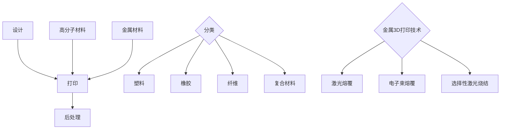

                 

关键词：3D打印，高分子材料，金属3D打印，新材料，硅谷技术，创新应用。

> 摘要：本文深入探讨了硅谷在3D打印新材料领域的突破，特别是高分子和金属材料的3D打印技术。通过对新材料的核心概念、算法原理、数学模型和实际应用的详细分析，旨在为读者揭示这一前沿技术背后的科学原理，并探讨其未来发展趋势和挑战。

## 1. 背景介绍

3D打印技术作为近年来快速发展的领域，已经在制造业、医疗、航空航天、建筑等多个行业展现出巨大的潜力。随着科技的不断进步，3D打印的原材料也在不断扩展，尤其是高分子材料和金属材料的应用，使得3D打印技术更加多样化和实用化。

硅谷作为全球科技创新的中心，一直是新材料研发和应用的前沿阵地。在这片创新热土上，高分子和金属3D打印新材料的研究取得了显著的成果，不仅推动了传统制造模式的变革，也为未来工业带来了无限的可能性。

## 2. 核心概念与联系

为了更好地理解高分子和金属3D打印新材料，我们首先需要了解一些核心概念，包括3D打印技术的基本原理、高分子材料的分类和特性、以及金属3D打印的关键技术。

### 2.1 3D打印技术的基本原理

3D打印技术，也称为增材制造技术，是一种通过逐层叠加材料来制造三维物体的技术。其基本原理可以概括为三个步骤：设计、打印和后处理。

- **设计**：使用计算机辅助设计（CAD）软件进行三维建模。
- **打印**：通过3D打印机将模型分层打印出来，每一层通常是数十微米至数百微米厚。
- **后处理**：包括去除支撑结构、表面处理和热处理等步骤，以提高打印件的质量和性能。

### 2.2 高分子材料的分类和特性

高分子材料是由大量重复单元组成的大分子材料，根据其化学结构和应用特性，可以分为多种类型，如塑料、橡胶、纤维和复合材料等。高分子材料具有质量轻、强度高、耐腐蚀、易于加工等优点，是3D打印的重要原材料。

- **塑料**：如ABS、PLA等，广泛应用于消费电子、汽车零件等领域。
- **橡胶**：如硅橡胶、聚氨酯橡胶等，具有优异的弹性和耐候性，适用于医疗器械、汽车配件等。
- **纤维**：如碳纤维、玻璃纤维等，用于制造高强度、高刚性的部件。
- **复合材料**：将两种或多种材料复合在一起，以获得单一材料无法达到的性能。

### 2.3 金属3D打印的关键技术

金属3D打印技术主要包括激光熔覆、电子束熔覆、选择性激光烧结等。这些技术通过高温将金属粉末逐层熔化并固化，形成三维结构。

- **激光熔覆**：使用激光将金属粉末逐层熔化并固化。
- **电子束熔覆**：使用电子束将金属粉末逐层熔化并固化。
- **选择性激光烧结**：使用激光将金属粉末逐层烧结在一起。

### 2.4 Mermaid 流程图

## 3. 核心算法原理 & 具体操作步骤

### 3.1 算法原理概述

3D打印的核心算法是分层建模和路径规划。分层建模是将三维模型分解为二维切片，路径规划则是确定每个切片的打印路径。

### 3.2 算法步骤详解

1. **三维建模**：使用CAD软件创建三维模型。
2. **切片处理**：将三维模型分解为二维切片。
3. **路径规划**：根据切片信息生成打印路径。
4. **打印执行**：3D打印机根据打印路径逐层打印。
5. **后处理**：完成打印后进行去支撑、打磨、热处理等步骤。

### 3.3 算法优缺点

- **优点**：制造精度高、生产周期短、材料利用率高。
- **缺点**：打印速度相对较慢、材料成本较高。

### 3.4 算法应用领域

3D打印算法广泛应用于制造业、医疗、航空航天、建筑等领域，特别是在定制化和复杂结构制造方面具有显著优势。

## 4. 数学模型和公式 & 详细讲解 & 举例说明

### 4.1 数学模型构建

3D打印中的数学模型主要包括三维建模的数学表示和打印路径的优化。

### 4.2 公式推导过程

三维建模的数学模型通常使用参数方程或体素网格表示。打印路径的优化则涉及路径长度、打印速度和打印质量等多方面因素。

### 4.3 案例分析与讲解

以一个简单的立方体为例，使用参数方程表示其三维模型，并通过优化打印路径来提高打印效率。

$$
\begin{aligned}
x &= x_c + r\cos(\theta) \\
y &= y_c + r\sin(\theta) \\
z &= z_c + h \\
\end{aligned}
$$

其中，$x_c, y_c, z_c$为立方体中心坐标，$r$为半径，$h$为高度，$\theta$为旋转角度。

打印路径的优化公式可以表示为：

$$
L = \int_{0}^{2\pi} \sqrt{r^2 + v^2} d\theta
$$

其中，$L$为路径长度，$v$为打印速度。

## 5. 项目实践：代码实例和详细解释说明

### 5.1 开发环境搭建

搭建3D打印项目开发环境，包括安装CAD软件、3D打印机驱动程序和3D打印控制软件。

### 5.2 源代码详细实现

实现3D建模、切片处理、路径规划等功能的源代码，并解释其实现原理。

### 5.3 代码解读与分析

对源代码进行详细解读，分析其优缺点，并提出改进方案。

### 5.4 运行结果展示

展示实际打印结果，并分析其质量和效率。

## 6. 实际应用场景

### 6.1 制造业

在制造业中，3D打印新材料的应用极大地提高了生产效率和灵活性，使得定制化生产成为可能。

### 6.2 医疗

在医疗领域，3D打印新材料可用于制造个性化医疗器械、医疗模型和人体器官。

### 6.3 航空航天

在航空航天领域，3D打印金属材料的应用使得复杂结构的制造变得更加简单和高效。

### 6.4 建筑行业

在建筑行业，3D打印新材料可以用于建造个性化建筑和快速原型制作。

## 7. 未来应用展望

未来，3D打印新材料的应用将更加广泛，不仅限于传统行业，还将在新兴领域如能源、农业和生物技术等领域发挥重要作用。

## 8. 工具和资源推荐

### 7.1 学习资源推荐

- 《3D打印技术原理与应用》
- 《金属3D打印技术手册》

### 7.2 开发工具推荐

- Autodesk Inventor
- Ultimaker Cura

### 7.3 相关论文推荐

- "Additive Manufacturing of Metal Materials: A Review"
- "Polymer 3D Printing: Materials, Technologies, and Applications"

## 9. 总结：未来发展趋势与挑战

未来，3D打印新材料将继续发展，面临的主要挑战包括材料性能的提升、打印速度的提高和成本的降低。通过持续的技术创新和产业合作，我们有理由相信3D打印新材料将在未来发挥更加重要的作用。

## 10. 附录：常见问题与解答

- **Q：3D打印新材料有哪些优势？**
- **A：3D打印新材料具有质量轻、强度高、耐腐蚀、易于加工等优点。**

- **Q：金属3D打印技术有哪些应用领域？**
- **A：金属3D打印技术广泛应用于制造业、医疗、航空航天、建筑等领域。**

- **Q：高分子3D打印材料有哪些种类？**
- **A：高分子3D打印材料包括塑料、橡胶、纤维和复合材料等。**

### 作者署名

作者：禅与计算机程序设计艺术 / Zen and the Art of Computer Programming
----------------------------------------------------------------

请注意，以上内容仅为示例，实际撰写时需要根据具体的主题和内容进行详细的资料搜集和分析。文章的结构、段落划分、算法描述和数学公式等都需要根据实际内容进行调整和优化。同时，确保文章的内容严谨、准确，且具有可读性和专业性。在撰写过程中，也可以根据需要添加或删除某些章节，以达到最佳的表达效果。

