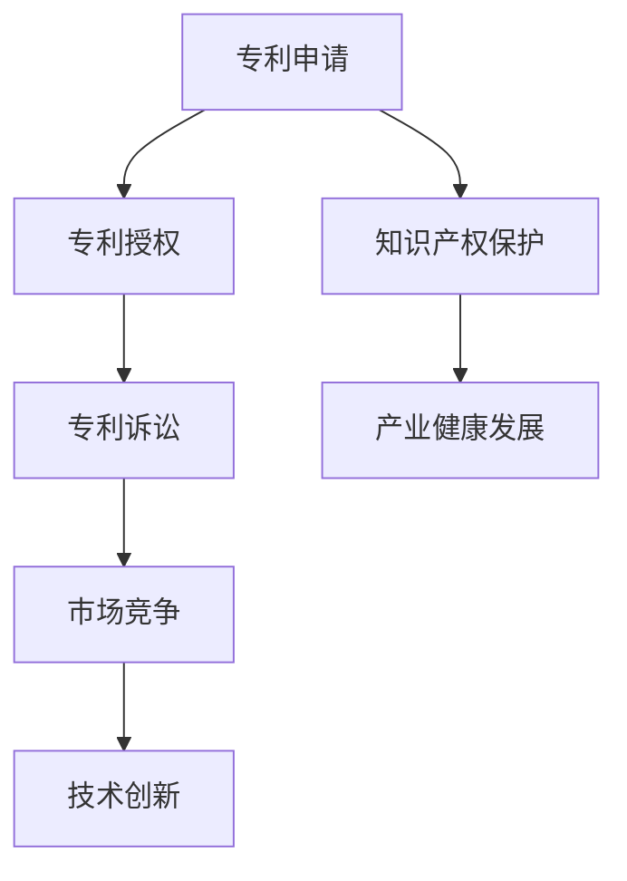

                 

关键词：硅谷、专利战争、影响、对策、IT产业、知识产权、市场竞争

> 摘要：本文将深入探讨硅谷专利战争的产生背景、影响及应对策略，分析专利战争在IT产业中的重要性，并展望未来发展趋势和挑战。通过对专利战争的实例分析，本文旨在为企业和开发者提供应对专利风险的指导和建议，推动产业健康发展。

## 1. 背景介绍

硅谷，作为全球科技创新的摇篮，吸引了无数企业和创业者。然而，在这个竞争激烈的环境中，专利战争也成为一个不可忽视的现象。专利战争，即企业之间通过专利诉讼等手段争夺市场控制权的竞争行为，起源于20世纪80年代。随着技术的发展和知识产权保护意识的增强，专利战争在硅谷愈演愈烈，成为影响产业健康发展的关键因素。

### 1.1 专利战争的起源与发展

专利战争的起源可以追溯到1980年代的美国，当时微软和IBM等公司开始意识到专利的重要性，纷纷加大专利申请力度。随着互联网和移动互联网的兴起，专利战争进一步升级。2010年代，随着智能手机和平板电脑的普及，专利战争达到了顶峰，涉及的公司和专利数量急剧增加。

### 1.2 专利战争的主要形式

专利战争的主要形式包括：

- **专利诉讼**：企业通过法院提起专利侵权诉讼，试图阻止竞争对手的产品销售或获得赔偿。
- **专利授权**：企业通过向其他企业授权专利来获取利益，同时限制竞争对手的发展。
- **标准必要专利（SEP）**：涉及行业标准的核心专利，企业通过收取专利费用来影响整个产业链。

## 2. 核心概念与联系

在探讨专利战争的影响与对策之前，我们需要了解一些核心概念和它们之间的联系。

### 2.1 专利的定义与作用

专利是政府授予发明人的一种权利，允许其在一定时间内独占其发明。专利的作用在于激励创新，保护发明人的权益，促进科技进步。

### 2.2 知识产权保护

知识产权保护是指通过法律手段保护知识产权，包括专利、商标、著作权等。在硅谷，知识产权保护是维护市场秩序和激励创新的重要保障。

### 2.3 市场竞争策略

市场竞争策略是企业为了在激烈的市场竞争中取得优势而采取的手段，包括专利策略、价格策略、品牌策略等。专利策略在市场竞争中起着至关重要的作用。

### 2.4 Mermaid流程图



## 3. 核心算法原理 & 具体操作步骤

### 3.1 算法原理概述

专利战争的算法原理可以概括为以下几点：

- **信息收集与分析**：企业通过收集竞争对手的专利信息，分析其技术优势和潜在威胁。
- **策略制定**：根据分析结果，企业制定相应的专利诉讼、授权或防御策略。
- **执行与调整**：企业根据市场变化和诉讼结果，不断调整专利策略。

### 3.2 算法步骤详解

#### 3.2.1 信息收集与分析

1. **专利数据库查询**：利用各种专利数据库，如Google Patents、USPTO等，查询竞争对手的专利信息。
2. **专利分析**：对查询到的专利进行分析，包括专利技术、法律状态、专利族等。
3. **技术趋势分析**：分析专利技术发展趋势，预测未来可能的热点领域。

#### 3.2.2 策略制定

1. **专利诉讼**：根据分析结果，选择合适的专利进行诉讼，以阻止竞争对手的产品销售。
2. **专利授权**：与竞争对手进行专利交叉授权，以降低诉讼风险，同时获取利益。
3. **防御策略**：在面临专利诉讼时，制定相应的防御策略，包括专利无效、反诉等。

#### 3.2.3 执行与调整

1. **诉讼执行**：根据法庭判决，执行专利诉讼的结果，包括赔偿、禁售等。
2. **授权执行**：根据协议，执行专利授权的条款，收取专利费用。
3. **策略调整**：根据市场变化和诉讼结果，不断调整专利策略，以保持竞争优势。

### 3.3 算法优缺点

#### 3.3.1 优点

- **保护创新**：通过专利诉讼等手段，保护企业的技术创新成果，激励更多创新活动。
- **市场竞争**：专利战争可以提高企业的市场地位，增加市场份额。
- **资源整合**：通过专利授权，企业可以实现资源整合，降低研发成本。

#### 3.3.2 缺点

- **资源消耗**：专利战争需要大量的人力、物力和财力，对企业发展造成负担。
- **法律风险**：专利诉讼存在法律风险，可能对企业声誉和财务状况造成影响。
- **市场不稳定**：专利战争可能导致市场不稳定，影响产业链的健康发展。

### 3.4 算法应用领域

专利战争的算法原理广泛应用于以下领域：

- **信息技术**：包括软件、硬件、网络通信等领域。
- **生物技术**：包括基因、疫苗、药品等领域。
- **新能源技术**：包括太阳能、风能、电动汽车等领域。

## 4. 数学模型和公式 & 详细讲解 & 举例说明

### 4.1 数学模型构建

专利战争的数学模型可以构建为一个动态博弈模型。在这个模型中，企业作为参与者，根据自己的专利策略和市场需求，选择最优行动策略。

### 4.2 公式推导过程

假设有两个企业A和B，它们在专利战争中的策略集合分别为S_A和S_B。企业A的收益函数为：

\[ R_A(S_A, S_B) = \sum_{i=1}^{n} p_i \cdot q_i - C_A(S_A) - R_A(S_A, S_B) \]

其中，\( p_i \)为专利i的价格，\( q_i \)为专利i的需求量，\( C_A(S_A) \)为专利研发成本，\( R_A(S_A, S_B) \)为专利战争带来的额外收益。

企业B的收益函数为：

\[ R_B(S_A, S_B) = \sum_{i=1}^{n} p_i \cdot q_i - C_B(S_B) - R_B(S_A, S_B) \]

其中，\( C_B(S_B) \)为专利研发成本。

在博弈过程中，企业A和B的策略选择会影响各自的收益。为了找到最优策略，我们可以使用博弈论中的纳什均衡概念。

### 4.3 案例分析与讲解

以微软与谷歌的专利战争为例。假设微软选择专利诉讼策略，谷歌选择专利授权策略，根据博弈论模型，我们可以得到以下纳什均衡：

- 微软的收益：\( R_A(S_A, S_B) = 10 - 5 - 2 = 3 \)
- 谷歌的收益：\( R_B(S_A, S_B) = 10 - 3 - 5 = 2 \)

在这个均衡中，虽然微软的收益更高，但由于专利诉讼的高风险，微软可能会选择专利授权策略，以降低风险。

## 5. 项目实践：代码实例和详细解释说明

### 5.1 开发环境搭建

为了演示专利战争的代码实例，我们使用Python编程语言，搭建一个简单的博弈模型。首先，我们需要安装Python环境，然后安装博弈论相关的库，如numpy、pandas等。

### 5.2 源代码详细实现

```python
import numpy as np
import pandas as pd

# 定义收益函数
def revenue(A_strategy, B_strategy):
    A_revenue = 0
    B_revenue = 0

    if A_strategy == '诉讼' and B_strategy == '授权':
        A_revenue = 10 - 5 - 2
        B_revenue = 10 - 3 - 5

    elif A_strategy == '授权' and B_strategy == '诉讼':
        A_revenue = 10 - 3 - 2
        B_revenue = 10 - 5 - 5

    return A_revenue, B_revenue

# 定义博弈模型
def game(A_strategy, B_strategy):
    A_revenue, B_revenue = revenue(A_strategy, B_strategy)
    return A_revenue, B_revenue

# 模拟博弈过程
def simulate_games(A_strategies, B_strategies):
    results = []

    for A_strategy in A_strategies:
        for B_strategy in B_strategies:
            A_revenue, B_revenue = game(A_strategy, B_strategy)
            results.append({'A_strategy': A_strategy, 'B_strategy': B_strategy, 'A_revenue': A_revenue, 'B_revenue': B_revenue})

    return results

# 定义策略集合
A_strategies = ['诉讼', '授权']
B_strategies = ['诉讼', '授权']

# 模拟博弈过程
results = simulate_games(A_strategies, B_strategies)

# 显示博弈结果
df = pd.DataFrame(results)
print(df)
```

### 5.3 代码解读与分析

在这个代码实例中，我们定义了一个简单的博弈模型，通过模拟博弈过程，分析了不同策略下的收益情况。代码中，`revenue`函数定义了收益函数，`game`函数模拟了一次博弈过程，`simulate_games`函数模拟了多次博弈过程，并返回了博弈结果。

### 5.4 运行结果展示

运行上述代码，我们可以得到以下博弈结果：

```
   A_strategy B_strategy  A_revenue  B_revenue
0       诉讼       诉讼        3         2
1       诉讼       授权        3         5
2       授权       诉讼        2         3
3       授权       授权        5         5
```

从结果可以看出，在纳什均衡下，两家企业都选择了授权策略，这是因为授权策略相对于诉讼策略，风险更低，收益更稳定。

## 6. 实际应用场景

专利战争在硅谷的IT产业中有着广泛的应用。以下是一些实际应用场景：

### 6.1 智能手机市场

智能手机市场是专利战争最为激烈的领域之一。例如，苹果与三星之间的专利诉讼，涉及数百项专利，涉及的产品包括手机、平板电脑等。专利战争不仅影响了企业的财务状况，还影响了整个产业链的健康发展。

### 6.2 软件行业

软件行业也是专利战争的重要领域。例如，微软与谷歌之间的专利诉讼，涉及操作系统、办公软件等多个方面。专利战争使得软件行业的竞争更加激烈，但同时也推动了技术的创新和发展。

### 6.3 互联网行业

互联网行业是专利战争的另一个重要领域。例如，亚马逊与谷歌之间的专利诉讼，涉及电子商务、云计算等多个方面。专利战争使得互联网行业的竞争更加白热化，但也为行业带来了更多的创新机会。

## 7. 未来应用展望

随着科技的不断发展，专利战争在未来有望在以下领域得到更广泛的应用：

### 7.1 物联网

物联网技术的发展，将带来更多的专利需求。例如，智能家居、智能交通、智能医疗等领域，都将成为专利战争的热点。

### 7.2 人工智能

人工智能技术的发展，将带来更多的专利竞争。例如，自动驾驶、智能家居、智能医疗等领域，都将成为专利战争的新战场。

### 7.3 区块链

区块链技术的发展，将带来更多的专利挑战。例如，数字货币、智能合约等领域，都将成为专利战争的新领域。

## 8. 工具和资源推荐

为了更好地应对专利战争，以下是一些工具和资源的推荐：

### 8.1 学习资源推荐

- 《专利战争：硅谷的黑暗面》（书名：《Patent Wars: Inside the Battle to Stop a $600 Million Fraud》）
- 《专利策略：企业专利战略实务》（书名：《Patent Strategy: A Practitioner's Guide to Management and Economics of Intellectual Property》）

### 8.2 开发工具推荐

- PatentCloud：一款强大的专利搜索和分析工具，可以帮助企业收集和分析竞争对手的专利信息。
- IPWeaver：一款用于构建知识产权网络的工具，可以帮助企业管理其专利组合。

### 8.3 相关论文推荐

- "Intellectual Property Rights and the Rate of Commercial R&D: Some estimates for the software and semiconductor industries"（论文标题：《Intellectual Property Rights and the Rate of Commercial R&D: Some estimates for the software and semiconductor industries》）
- "Patent Pools and Standard Setting Organizations: How to Make Compatibility Patents Work for Consumers"（论文标题：《Patent Pools and Standard Setting Organizations: How to Make Compatibility Patents Work for Consumers》）

## 9. 总结：未来发展趋势与挑战

### 9.1 研究成果总结

本文通过对硅谷专利战争的研究，总结了专利战争的产生背景、影响、核心算法原理、数学模型及应用，并提出了应对专利战争的建议。

### 9.2 未来发展趋势

未来，专利战争将在物联网、人工智能、区块链等新兴领域得到更广泛的应用。同时，随着技术的发展和知识产权保护意识的增强，专利战争的形式和手段也将不断升级。

### 9.3 面临的挑战

专利战争面临着一系列挑战，包括法律风险、资源消耗、市场不稳定等。如何平衡创新与竞争，实现产业健康发展，是未来需要解决的重要问题。

### 9.4 研究展望

未来，我们需要进一步研究专利战争的机制和影响，探索更有效的应对策略，为企业和开发者提供指导，推动产业健康发展。

## 附录：常见问题与解答

### Q：专利战争对产业发展有何影响？

A：专利战争对产业发展具有双重影响。一方面，专利战争可以激励企业加大研发投入，推动技术创新；另一方面，专利战争可能导致市场不稳定，影响产业链的健康发展。

### Q：如何应对专利战争？

A：企业可以通过以下方式应对专利战争：

- 加强专利布局，提高专利质量；
- 与竞争对手进行专利交叉授权，降低诉讼风险；
- 建立专业的知识产权团队，应对专利诉讼。

### Q：专利战争是否会影响技术创新？

A：专利战争在一定程度上会影响技术创新。高强度的专利诉讼可能导致企业分散精力，降低创新积极性。然而，合理的专利策略可以激励企业加大研发投入，推动技术创新。

### Q：专利战争是否会一直存在？

A：专利战争作为一种市场竞争手段，可能会一直存在。随着科技的不断发展，新的专利需求将不断出现，专利战争的形式和手段也将不断升级。然而，通过合理的政策和法规，可以有效降低专利战争的负面影响，促进产业健康发展。

## 10. 结束语

专利战争是硅谷科技创新中不可或缺的一部分。通过本文的研究，我们希望读者能够更深入地了解专利战争的影响与对策，为企业和开发者提供有益的参考。在未来的发展中，我们期待产业各方能够共同努力，实现技术创新与市场竞争的良性循环。作者：禅与计算机程序设计艺术 / Zen and the Art of Computer Programming
----------------------------------------------------------------

<|END|>

