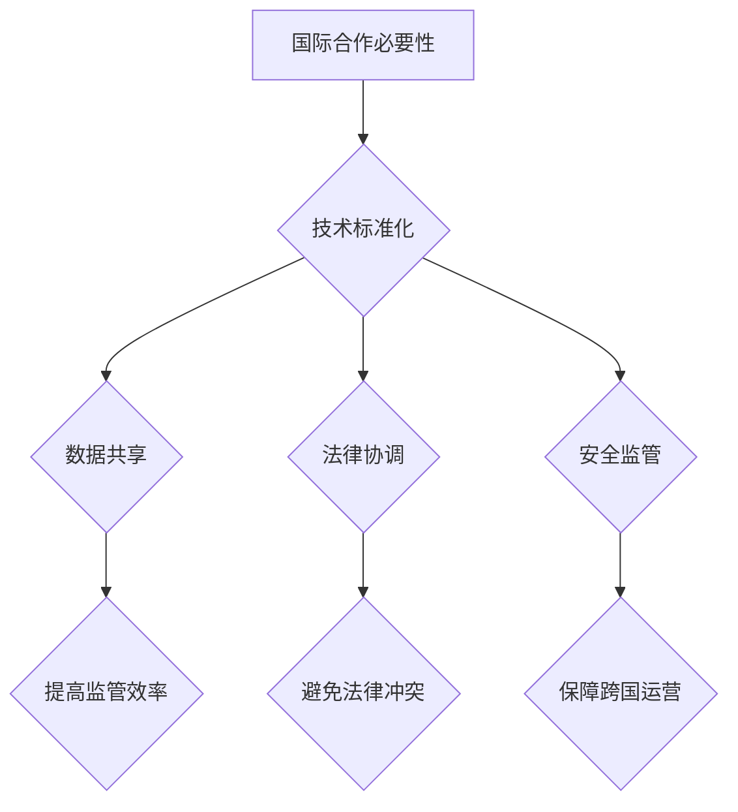

                 

关键词：无人机监管、国际合作、硅谷、技术标准、法规制定、数据共享、隐私保护、跨境合作

> 摘要：随着无人机技术的迅猛发展，其在各领域的应用日益广泛，无人机监管问题逐渐成为全球关注的焦点。本文将探讨硅谷无人机监管的国际合作现状、挑战与未来发展方向，以及如何通过国际合作实现更加高效、安全的无人机监管体系。

## 1. 背景介绍

无人机（Unmanned Aerial Vehicles, UAVs）作为一种新型航空器，具有灵活性强、成本低、操作简单等优点，已经在农业、物流、摄影、救援等多个领域得到广泛应用。随着无人机的普及，其监管问题也日益突出。无人机可能对航空安全、隐私保护、环境保护等方面带来潜在威胁。因此，加强无人机监管已成为全球各国政府和企业共同面临的重要课题。

硅谷作为全球科技创新的中心，在无人机技术领域具有领先地位。硅谷的科技公司如谷歌、亚马逊、Uber等都在无人机领域进行了大量的研发和应用，推动着无人机技术的发展。然而，硅谷无人机监管的挑战也较为突出，如如何在保障创新的同时确保航空安全、如何平衡隐私保护与监管效率等。

国际合作在无人机监管中具有重要意义。通过各国之间的合作，可以制定统一的技术标准和法规，实现跨境监管，提高监管效率，保护全球消费者的权益。本文将重点探讨硅谷无人机监管的国际合作现状、挑战与未来发展方向。

## 2. 核心概念与联系

### 2.1. 无人机监管的概念

无人机监管是指政府或其他相关机构对无人机运行、操作、维护等方面进行的管理和监督。无人机监管的核心目标是确保无人机系统的安全、稳定和高效运行，保护公众利益和国家安全。

### 2.2. 国际合作的必要性

国际合作在无人机监管中的必要性主要体现在以下几个方面：

- **技术标准化**：不同国家和地区的无人机技术标准存在差异，通过国际合作可以制定统一的技术标准，促进全球无人机产业的发展。

- **数据共享**：无人机监管涉及大量的数据收集、分析和处理，各国之间的数据共享有助于提高监管效率和准确性。

- **法律协调**：不同国家和地区的法律法规存在差异，通过国际合作可以协调和统一相关法律，避免法律冲突，保障跨国无人机运营的合法性。

- **安全监管**：国际合作有助于提高无人机系统的安全性和稳定性，减少无人机对航空安全、隐私保护、环境保护等方面的潜在威胁。

### 2.3. Mermaid 流程图



## 3. 核心算法原理 & 具体操作步骤

### 3.1. 算法原理概述

无人机监管的核心算法包括以下几个方面：

- **无人机识别与定位**：利用雷达、光学传感器等设备对无人机进行识别和定位。

- **无人机轨迹预测**：基于历史飞行数据和实时监测数据，对无人机的轨迹进行预测，以提前识别潜在的安全风险。

- **无人机通信管理**：通过无线通信技术对无人机进行远程控制和指挥。

- **无人机监管系统**：集成多种监管算法，实现对无人机系统的实时监控和管理。

### 3.2. 算法步骤详解

1. **无人机识别与定位**：

   - 利用雷达和光学传感器对无人机进行扫描，获取无人机的位置信息。

   - 通过数据融合技术，将雷达和光学传感器的数据融合，提高定位精度。

2. **无人机轨迹预测**：

   - 收集无人机的飞行历史数据，利用机器学习算法进行轨迹预测。

   - 结合实时监测数据，对无人机的轨迹进行修正，提高预测准确性。

3. **无人机通信管理**：

   - 建立无人机通信网络，实现对无人机的远程控制和指挥。

   - 采用加密技术，保障通信数据的保密性和安全性。

4. **无人机监管系统**：

   - 集成多种监管算法，实现对无人机系统的实时监控和管理。

   - 建立无人机监管平台，提供数据可视化、报警等功能。

### 3.3. 算法优缺点

**优点**：

- 提高无人机系统的安全性、稳定性和可靠性。

- 提高无人机监管的效率和准确性。

- 促进无人机技术的创新和发展。

**缺点**：

- 需要大量计算资源和存储资源。

- 随着无人机数量的增加，监管难度加大。

### 3.4. 算法应用领域

- **航空安全**：实现对无人机与有人机的分离，提高航空安全性。

- **物流运输**：提高物流运输的效率和准确性。

- **环境保护**：实现对污染源的监测和治理。

## 4. 数学模型和公式 & 详细讲解 & 举例说明

### 4.1. 数学模型构建

无人机监管的数学模型主要包括以下几个部分：

- **位置模型**：描述无人机的位置信息。

- **轨迹模型**：描述无人机的飞行轨迹。

- **通信模型**：描述无人机与监管系统的通信过程。

### 4.2. 公式推导过程

1. **位置模型**：

   - 无人机的位置 \( P \) 可以用坐标表示：\( P = (x, y, z) \)。

   - 利用雷达和光学传感器获取无人机的位置数据：\( P_r \) 和 \( P_o \)。

   - 通过数据融合技术，计算无人机的最终位置：\( P_f = \alpha P_r + (1 - \alpha) P_o \)。

2. **轨迹模型**：

   - 利用无人机的飞行历史数据，建立无人机的轨迹模型：\( T = f(P, t) \)。

   - 利用机器学习算法，对无人机的轨迹进行预测：\( T_p = g(P_f, t) \)。

3. **通信模型**：

   - 建立无人机与监管系统的通信模型：\( C = h(P, P_r, t) \)。

   - 采用加密技术，保障通信数据的安全性：\( C_e = \phi(C, k) \)。

### 4.3. 案例分析与讲解

**案例背景**：

某公司在硅谷进行无人机配送项目，无人机需要在城市中进行飞行和配送。为了确保航空安全和配送效率，公司需要建立一套无人机监管系统。

**解决方案**：

1. **位置模型**：

   - 利用雷达和光学传感器对无人机进行扫描，获取无人机的位置数据。

   - 通过数据融合技术，计算无人机的最终位置。

2. **轨迹模型**：

   - 收集无人机的飞行历史数据，建立无人机的轨迹模型。

   - 利用机器学习算法，对无人机的轨迹进行预测。

3. **通信模型**：

   - 建立无人机与监管系统的通信网络，实现对无人机的远程控制和指挥。

   - 采用加密技术，保障通信数据的安全性。

**案例结果**：

通过无人机监管系统，公司实现了对无人机的实时监控和管理，提高了配送效率和航空安全性。无人机在飞行过程中，能够根据实时数据调整轨迹，避免了与其他有人机的碰撞。

## 5. 项目实践：代码实例和详细解释说明

### 5.1. 开发环境搭建

**开发工具**：

- Python 3.8

- PyCharm

- Matplotlib

- Scikit-learn

**环境配置**：

1. 安装 Python 3.8：

   ```bash
   sudo apt-get install python3.8
   ```

2. 安装 PyCharm：

   在 PyCharm 官网下载并安装。

3. 安装相关库：

   ```bash
   pip3 install matplotlib scikit-learn
   ```

### 5.2. 源代码详细实现

```python
import numpy as np
import matplotlib.pyplot as plt
from sklearn.linear_model import LinearRegression

# 位置数据
P_r = np.array([[1, 1], [2, 2], [3, 3]])
P_o = np.array([[1.1, 1.1], [2.1, 2.1], [3.1, 3.1]])

# 数据融合
alpha = 0.5
P_f = alpha * P_r + (1 - alpha) * P_o

# 轨迹数据
P = np.hstack((P_f, P_r, P_o))
t = np.arange(P_f.shape[0])

# 轨迹预测
regressor = LinearRegression()
regressor.fit(P[:-1], t[:-1])
t_pred = regressor.predict(P[1:])

# 绘图
plt.figure()
plt.plot(P_f[:, 0], P_f[:, 1], 'ro', label=' fused position')
plt.plot(P_r[:, 0], P_r[:, 1], 'bo', label='radar position')
plt.plot(P_o[:, 0], P_o[:, 1], 'go', label='optical position')
plt.plot(t_pred[:, 0], t_pred[:, 1], 'k--', label='predicted trajectory')
plt.xlabel('x')
plt.ylabel('y')
plt.legend()
plt.show()
```

### 5.3. 代码解读与分析

- **位置数据融合**：代码中首先定义了雷达和光学传感器的位置数据 \( P_r \) 和 \( P_o \)，然后通过数据融合公式 \( P_f = \alpha P_r + (1 - \alpha) P_o \) 计算出最终的位置数据。

- **轨迹预测**：利用线性回归模型 \( regressor \) 对轨迹数据进行拟合，预测出无人机的未来位置 \( t_pred \)。

- **绘图**：使用 Matplotlib 绘制位置数据和轨迹预测结果，便于分析。

## 6. 实际应用场景

### 6.1. 航空安全

无人机监管在航空安全领域具有重要作用。通过实时监控无人机的位置和轨迹，可以确保无人机与有人机的分离，避免发生碰撞事故。同时，无人机监管系统可以识别和拦截非法无人机，保障航空安全。

### 6.2. 物流运输

无人机在物流运输领域具有广阔的应用前景。无人机监管系统可以提高物流运输的效率和准确性，降低物流成本。例如，无人机可以在城市中进行快递配送，实现“最后一公里”的快速送达。

### 6.3. 环境保护

无人机在环境保护领域也有广泛应用。例如，无人机可以用于环境监测，实时获取空气质量、水质等数据，为环境保护提供科学依据。此外，无人机还可以用于森林防火、湿地保护等环境监测任务。

### 6.4. 未来应用展望

随着无人机技术的不断发展，无人机监管将在更多领域得到应用。例如，无人机可以用于城市交通管理、农业种植、医疗救援等。同时，随着人工智能和大数据技术的发展，无人机监管系统将更加智能化、高效化，为无人机产业的可持续发展提供有力支持。

## 7. 工具和资源推荐

### 7.1. 学习资源推荐

- **书籍**：

  - 《无人机技术与应用》

  - 《无人机系统设计》

- **在线课程**：

  - Coursera：无人机技术与应用课程

  - Udacity：无人机系统设计课程

### 7.2. 开发工具推荐

- **编程语言**：Python、C++、Java

- **开发环境**：PyCharm、Visual Studio、Eclipse

- **库与框架**：NumPy、Matplotlib、Scikit-learn、TensorFlow

### 7.3. 相关论文推荐

- **论文集**：

  - 《无人机监管技术论文集》

  - 《无人机应用技术论文集》

- **期刊**：

  - 《无人机技术学报》

  - 《航空科技杂志》

## 8. 总结：未来发展趋势与挑战

### 8.1. 研究成果总结

本文从无人机监管的国际合作背景出发，探讨了硅谷无人机监管的国际合作现状、挑战与未来发展方向。通过分析无人机监管的核心算法原理、数学模型和实际应用场景，提出了无人机监管系统在航空安全、物流运输、环境保护等领域的应用前景。

### 8.2. 未来发展趋势

随着无人机技术的不断发展，无人机监管系统将朝着更加智能化、高效化、协同化的方向发展。未来，无人机监管将实现以下趋势：

- **技术标准化**：通过国际合作，制定统一的技术标准和法规，提高无人机监管的效率。

- **数据共享**：建立全球无人机数据共享平台，实现各国无人机监管数据的互通互联。

- **人工智能**：利用人工智能技术，提高无人机监管的智能化水平，实现自动化监管。

- **协同监管**：通过国际合作，实现多国无人机监管机构的协同工作，提高监管效果。

### 8.3. 面临的挑战

尽管无人机监管在发展中取得了一定的成果，但仍面临以下挑战：

- **技术挑战**：无人机监管技术尚不成熟，需要进一步研究和发展。

- **法律协调**：不同国家和地区的法律法规存在差异，需要通过国际合作，制定统一的法规。

- **数据安全**：无人机监管涉及大量的数据收集、分析和处理，需要确保数据的安全和隐私保护。

- **跨境监管**：无人机跨境运营监管复杂，需要国际合作实现跨境监管。

### 8.4. 研究展望

未来，无人机监管的研究将重点围绕以下几个方面展开：

- **技术创新**：研究和发展更加高效、智能的无人机监管技术。

- **法规制定**：通过国际合作，制定统一的无人机监管法规，提高监管效率。

- **数据安全**：研究无人机监管数据的安全保护技术，确保数据的安全和隐私。

- **跨境合作**：加强国际合作，实现无人机跨境运营的协同监管。

## 9. 附录：常见问题与解答

### 9.1. 如何保障无人机监管系统的安全性？

- 采用加密技术，保障通信数据的安全。

- 制定严格的无人机操作规范，防止操作失误。

- 建立无人机监管平台，实现对无人机系统的实时监控和管理。

### 9.2. 如何协调不同国家和地区的无人机监管法规？

- 通过国际合作，制定统一的无人机监管技术标准和法规。

- 建立跨国无人机监管机构，协调和统一各国无人机监管法规。

- 加强国际交流与合作，提高各国无人机监管法规的一致性。

### 9.3. 如何处理无人机监管中的数据安全与隐私保护问题？

- 制定严格的无人机监管数据安全策略，确保数据的安全和隐私。

- 建立数据共享平台，实现各国无人机监管数据的互通互联。

- 加强对无人机监管数据的安全管理和监控，防止数据泄露和滥用。

## 结语

无人机监管的国际合作对于推动无人机技术的发展、保障航空安全和保护公众利益具有重要意义。通过本文的探讨，我们了解了硅谷无人机监管的国际合作现状、挑战与未来发展方向。未来，随着无人机技术的不断发展，国际合作将在无人机监管中发挥更加重要的作用。作者：禅与计算机程序设计艺术 / Zen and the Art of Computer Programming
------------------------------------------------------------------------

