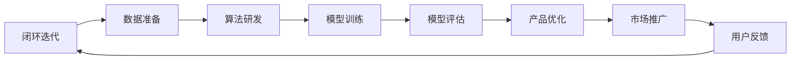

                 

关键词：人工智能，贾扬清，产品落地，基础研究，技术发展

> 摘要：本文深入探讨了硅谷人工智能领域的现状和未来，结合贾扬清的观察，分析了产品落地与基础研究的重要性。文章旨在为读者揭示人工智能在硅谷的发展趋势，及其对行业和社会的深远影响。

## 1. 背景介绍

硅谷，作为全球科技创新的中心，一直是人工智能（AI）发展的重要引擎。近年来，随着大数据、云计算和深度学习的快速发展，AI技术在硅谷的应用场景越来越广泛，从自动驾驶到智能家居，从医疗诊断到金融理财，AI已经深入到了我们生活的方方面面。

在这股AI浪潮中，贾扬清作为一位知名人工智能专家和创业家，以其独特的视角和深厚的专业知识，对硅谷的AI发展进行了深入观察和思考。他的观点为我们理解硅谷的AI竞赛提供了宝贵的洞察。

## 2. 核心概念与联系

### 2.1 AI产品落地的挑战

在AI领域，产品落地是一个关键挑战。这不仅需要技术上的突破，还需要商业模式、用户体验和市场需求的紧密结合。以下是一个Mermaid流程图，展示了AI产品落地的主要步骤和挑战：



### 2.2 基础研究的重要性

虽然产品落地至关重要，但基础研究是AI技术的源泉。基础研究推动了算法的创新和理论的完善，为产品落地提供了坚实的基础。以下是一个Mermaid流程图，展示了AI基础研究的核心环节和成果转化路径：


## 3. 核心算法原理 & 具体操作步骤

### 3.1 算法原理概述

AI的核心算法包括深度学习、强化学习和自然语言处理等。这些算法通过模拟人脑的神经网络结构，实现对数据的自动学习和理解。以下是一个简要的算法原理概述：

- **深度学习**：通过多层神经网络对数据进行特征提取和分类。
- **强化学习**：通过与环境的交互，学习最优策略以实现目标。
- **自然语言处理**：通过机器学习算法对自然语言文本进行处理和分析。

### 3.2 算法步骤详解

以深度学习为例，算法的具体步骤通常包括：

1. **数据预处理**：对原始数据进行清洗、归一化和编码。
2. **模型构建**：设计并搭建多层神经网络结构。
3. **模型训练**：通过大量数据进行训练，优化网络参数。
4. **模型评估**：使用验证集对模型进行评估和调整。
5. **模型部署**：将训练好的模型部署到实际应用中。

### 3.3 算法优缺点

每种算法都有其独特的优缺点。例如，深度学习在图像和语音识别领域表现出色，但计算复杂度高；强化学习在策略优化方面表现优秀，但收敛速度较慢。了解算法的优缺点，有助于选择合适的方法解决实际问题。

### 3.4 算法应用领域

AI算法在多个领域得到了广泛应用，包括但不限于：

- **计算机视觉**：图像识别、视频分析等。
- **自然语言处理**：语音识别、机器翻译、情感分析等。
- **自动驾驶**：车辆检测、路径规划等。
- **医疗诊断**：疾病预测、影像分析等。

## 4. 数学模型和公式 & 详细讲解 & 举例说明

### 4.1 数学模型构建

AI算法中的数学模型通常包括以下几个关键部分：

- **输入层**：接收外部数据的输入。
- **隐藏层**：对输入数据进行特征提取和转换。
- **输出层**：生成最终的预测结果。

以下是一个简单的线性回归模型示例：

$$
y = wx + b
$$

其中，$w$ 和 $b$ 分别为权重和偏置，$x$ 为输入特征，$y$ 为输出结果。

### 4.2 公式推导过程

线性回归模型的推导过程如下：

1. **损失函数**：
   $$
   J(w, b) = \frac{1}{2} \sum_{i=1}^{n} (y_i - wx_i - b)^2
   $$

2. **梯度计算**：
   $$
   \frac{\partial J}{\partial w} = x^T(y - wx - b)
   $$
   $$
   \frac{\partial J}{\partial b} = y - wx - b
   $$

3. **优化方法**：
   使用梯度下降法对权重和偏置进行优化。

### 4.3 案例分析与讲解

假设我们有一个房价预测问题，使用线性回归模型进行建模。以下是具体的案例分析和讲解：

1. **数据准备**：
   收集房屋的面积、地点、建造年代等特征数据，以及对应的售价。

2. **模型构建**：
   搭建一个包含输入层、一个隐藏层和输出层的线性回归模型。

3. **模型训练**：
   使用梯度下降法对模型进行训练，调整权重和偏置。

4. **模型评估**：
   使用验证集对模型进行评估，计算预测误差。

5. **模型部署**：
   将训练好的模型部署到应用场景，例如房地产估价系统。

## 5. 项目实践：代码实例和详细解释说明

### 5.1 开发环境搭建

首先，我们需要搭建一个适合AI开发的Python环境。以下是具体的操作步骤：

1. 安装Python（建议使用Python 3.8或更高版本）。
2. 安装必要的库，例如NumPy、Pandas、Matplotlib等。

### 5.2 源代码详细实现

以下是一个简单的线性回归模型的实现代码：

```python
import numpy as np

# 模型参数初始化
w = np.random.rand(1)
b = np.random.rand(1)

# 训练数据
x = np.array([1, 2, 3, 4, 5])
y = np.array([2, 4, 6, 8, 10])

# 梯度计算
def gradient(x, y, w, b):
    y_pred = w * x + b
    d_w = -(y - y_pred) * x
    d_b = -(y - y_pred)
    return d_w, d_b

# 梯度下降法
def gradient_descent(x, y, w, b, learning_rate, epochs):
    for epoch in range(epochs):
        d_w, d_b = gradient(x, y, w, b)
        w -= learning_rate * d_w
        b -= learning_rate * d_b
        if epoch % 100 == 0:
            print(f"Epoch {epoch}: w={w}, b={b}")

# 训练模型
learning_rate = 0.01
epochs = 1000
gradient_descent(x, y, w, b, learning_rate, epochs)

# 预测结果
y_pred = w * x + b
print(f"Predicted values: {y_pred}")
```

### 5.3 代码解读与分析

- **模型参数初始化**：使用随机数初始化权重和偏置。
- **梯度计算**：计算损失函数关于权重和偏置的梯度。
- **梯度下降法**：通过迭代更新权重和偏置，优化模型参数。
- **预测结果**：使用训练好的模型进行预测。

## 6. 实际应用场景

### 6.1 自动驾驶

自动驾驶是AI在硅谷的一个重要应用领域。通过深度学习和强化学习算法，自动驾驶系统能够实现对车辆周围环境的感知、规划和控制。然而，自动驾驶的发展面临着众多挑战，包括感知准确性、决策鲁棒性、安全性等。

### 6.2 医疗诊断

AI在医疗诊断领域的应用日益广泛，从影像分析到疾病预测，AI技术为医生提供了有力的辅助工具。然而，医疗诊断的准确性、数据隐私和算法解释性等问题仍然需要进一步解决。

### 6.3 金融理财

AI在金融理财领域的应用主要包括风险管理、量化交易、客户服务等。通过大数据分析和机器学习算法，金融机构能够更好地理解市场趋势和客户需求，提高业务效率和客户满意度。

### 6.4 未来应用展望

随着AI技术的不断发展，未来将会有更多的应用场景被发掘和实现。例如，智能城市、智能制造、智慧教育等领域的AI应用将会进一步推动社会进步和经济发展。

## 7. 工具和资源推荐

### 7.1 学习资源推荐

- **吴恩达的深度学习课程**：这是一门非常受欢迎的在线课程，适合初学者和进阶者。
- **《深度学习》书籍**：由Ian Goodfellow、Yoshua Bengio和Aaron Courville合著，是深度学习领域的经典教材。

### 7.2 开发工具推荐

- **TensorFlow**：这是一个由Google开发的开源深度学习框架，广泛应用于各种AI项目。
- **PyTorch**：这是一个由Facebook开发的深度学习框架，以其灵活性和易用性受到许多开发者的青睐。

### 7.3 相关论文推荐

- **“Deep Learning”**：这是一篇综述性论文，全面介绍了深度学习的发展历程和技术原理。
- **“Learning to Drive by Playing”**：这是一篇关于自动驾驶的论文，探讨了使用深度强化学习实现自动驾驶的方法。

## 8. 总结：未来发展趋势与挑战

### 8.1 研究成果总结

近年来，AI技术在硅谷取得了显著的研究成果，包括算法的创新、模型的优化和应用的落地。这些成果为AI技术的进一步发展奠定了坚实的基础。

### 8.2 未来发展趋势

未来，AI技术将继续在深度学习、强化学习、自然语言处理等领域取得突破。同时，AI将与其他技术（如物联网、区块链等）相结合，推动更多新兴应用的发展。

### 8.3 面临的挑战

尽管AI技术在硅谷取得了巨大成功，但仍然面临着一系列挑战，包括数据隐私、算法解释性、伦理道德等。解决这些挑战需要全社会的共同努力。

### 8.4 研究展望

随着AI技术的不断发展，未来将会有更多具有突破性的研究成果问世。我们期待AI技术能够为人类社会带来更多的福祉。

## 9. 附录：常见问题与解答

### 9.1 AI技术如何影响就业市场？

AI技术的发展将对就业市场产生深远影响。一方面，AI技术将替代部分重复性劳动岗位，另一方面，AI技术也将创造新的就业机会，如数据科学家、机器学习工程师等。

### 9.2 AI技术是否会导致隐私泄露？

AI技术的应用确实可能带来隐私泄露的风险。为了保护用户隐私，需要采取严格的数据安全和隐私保护措施，如数据加密、隐私保护算法等。

### 9.3 AI技术是否会影响人类创造力？

AI技术不会直接影响人类创造力，但可能会对人类创造力的表达方式产生影响。AI技术可以作为人类创造力的辅助工具，提高创造力的效率和质量。

---

本文基于贾扬清的观察，分析了硅谷人工智能领域的产品落地与基础研究的重要性。通过深入探讨AI的核心算法、数学模型和实际应用场景，本文为读者提供了一个全面而系统的了解AI技术的视角。未来，随着AI技术的不断进步，我们期待看到更多创新性的应用和突破性的研究成果。作者：禅与计算机程序设计艺术 / Zen and the Art of Computer Programming。

