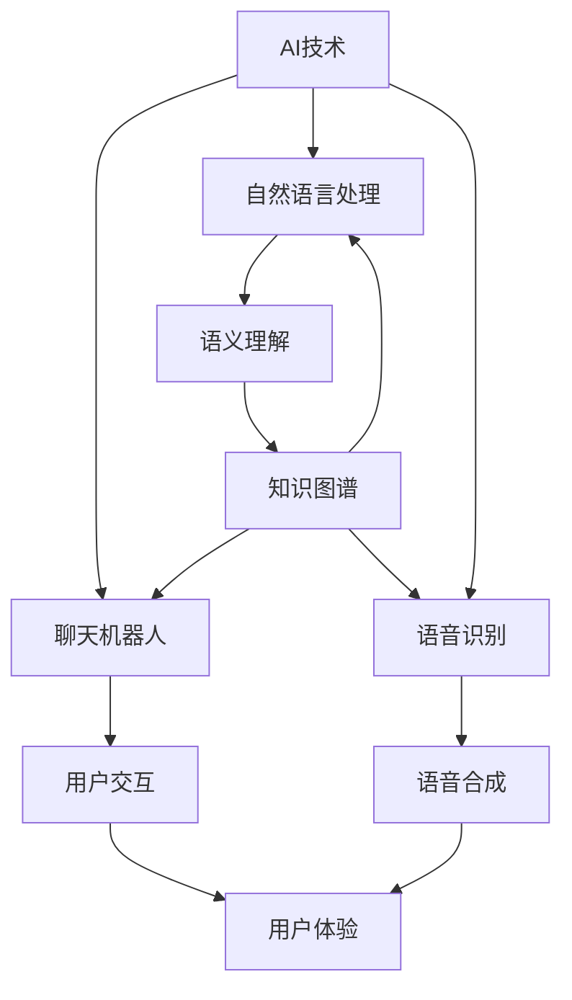

                 

关键词：硅谷、AI企业、聊天机器人、AI搜索、技术创新、多元化发展

> 摘要：本文深入探讨了硅谷在人工智能（AI）领域的多元化发展。通过分析硅谷的AI企业，从聊天机器人到AI搜索的创新发展，揭示了硅谷在AI领域取得成功的关键因素，并展望了未来AI技术的应用前景。

## 1. 背景介绍

硅谷，作为全球科技创新的代名词，一直以来都是科技创新和创业的热土。自20世纪中叶以来，硅谷涌现出了无数成功的科技企业和创新项目，推动了全球科技的发展。随着人工智能（AI）技术的迅速发展，硅谷的AI企业开始探索从聊天机器人到AI搜索的多元化应用，为人们的生活和工作带来了巨大的变革。

本文将通过对硅谷AI企业的分析，探讨其在聊天机器人到AI搜索领域的创新发展，以及这些创新如何影响和改变我们的生活方式和工作方式。

## 2. 核心概念与联系

在深入探讨硅谷AI企业的创新发展之前，我们需要了解一些核心概念和它们之间的联系。以下是一个使用Mermaid绘制的流程图，展示了这些核心概念及其之间的关联。



### 2.1 AI技术

AI技术是硅谷AI企业发展的基石。它包括机器学习、深度学习、自然语言处理、计算机视觉等多个子领域。通过这些技术，AI系统能够从数据中学习、推理和决策。

### 2.2 聊天机器人

聊天机器人是AI技术在用户交互领域的应用。它们能够通过文本或语音与用户进行交流，提供信息、解答问题、执行任务等。聊天机器人的出现极大地改善了用户体验，使得信息获取和服务变得更加便捷。

### 2.3 自然语言处理

自然语言处理（NLP）是AI技术的重要分支，它使计算机能够理解、处理和生成人类语言。NLP技术在聊天机器人中扮演着关键角色，包括文本分类、情感分析、实体识别等。

### 2.4 语音识别和语音合成

语音识别和语音合成是AI技术的另一个重要领域。语音识别技术能够将人类的语音转化为文本，而语音合成技术则能够将文本转化为自然流畅的语音。这些技术在聊天机器人中用于处理语音交互。

### 2.5 用户体验和语义理解

用户体验和语义理解是影响AI系统效果的关键因素。用户体验涉及用户界面设计、交互流程等，而语义理解则涉及对用户意图的理解和响应。知识图谱在语义理解中发挥着重要作用，它能够将大量的语义信息组织起来，为AI系统提供丰富的知识基础。

## 3. 核心算法原理 & 具体操作步骤

### 3.1 算法原理概述

硅谷的AI企业在聊天机器人和AI搜索领域采用了多种核心算法。以下是对这些算法的原理概述：

- **深度学习**：深度学习是一种基于多层神经网络的机器学习方法，它能够自动从大量数据中学习特征和模式。在聊天机器人中，深度学习用于构建对话模型，使其能够生成自然的回复。

- **自然语言处理**：自然语言处理（NLP）算法包括词向量表示、文本分类、情感分析、实体识别等。这些算法使聊天机器人能够理解用户的语言，并生成相应的回复。

- **知识图谱**：知识图谱是一种语义网络，它将大量的知识信息以图形的形式组织起来。在AI搜索中，知识图谱用于解析查询意图，并提供相关的搜索结果。

### 3.2 算法步骤详解

#### 聊天机器人算法步骤

1. **用户输入**：用户通过文本或语音与聊天机器人进行交互。

2. **语音识别**：如果用户使用语音输入，聊天机器人将语音转化为文本。

3. **文本预处理**：对输入文本进行分词、去除停用词、词性标注等预处理。

4. **语义理解**：使用NLP算法对预处理后的文本进行分析，提取关键词、情感和意图。

5. **生成回复**：基于语义理解和对话上下文，聊天机器人生成合适的回复。

6. **语音合成**：如果需要，将回复文本转化为自然流畅的语音。

7. **反馈**：将回复呈现给用户，并记录用户反馈，用于模型优化。

#### AI搜索算法步骤

1. **查询输入**：用户输入搜索查询。

2. **查询解析**：使用知识图谱和NLP算法解析查询意图，提取关键词和语义。

3. **索引检索**：在索引数据库中检索与查询意图相关的数据。

4. **结果排序**：根据查询意图和相关性对搜索结果进行排序。

5. **结果呈现**：将排序后的搜索结果呈现给用户。

### 3.3 算法优缺点

- **深度学习**：优点是能够自动从大量数据中学习特征，缺点是需要大量数据和计算资源。

- **自然语言处理**：优点是能够理解用户的语言，缺点是处理复杂语言表达时效果有限。

- **知识图谱**：优点是能够提供丰富的知识基础，缺点是需要大量人力和时间进行知识构建。

### 3.4 算法应用领域

- **聊天机器人**：广泛应用于客服、教育、医疗、金融等领域。

- **AI搜索**：广泛应用于电子商务、新闻资讯、企业内部搜索等领域。

## 4. 数学模型和公式 & 详细讲解 & 举例说明

### 4.1 数学模型构建

在聊天机器人和AI搜索领域，常用的数学模型包括神经网络、决策树、支持向量机等。以下是一个简单的神经网络模型示例。

```latex
\begin{equation}
\begin{split}
y &= \sigma(W_1 \cdot x + b_1) \\
y &= \sigma(W_2 \cdot y + b_2) \\
y &= \sigma(W_3 \cdot y + b_3) \\
\end{split}
\end{equation}
```

其中，\(y\) 是输出，\(\sigma\) 是激活函数，\(W\) 是权重矩阵，\(b\) 是偏置项。

### 4.2 公式推导过程

以一个简单的神经网络模型为例，我们进行公式推导。

1. **输入层到隐藏层**

\[y_1 = \sigma(W_1 \cdot x + b_1)\]

2. **隐藏层到隐藏层**

\[y_2 = \sigma(W_2 \cdot y_1 + b_2)\]

3. **隐藏层到输出层**

\[y_3 = \sigma(W_3 \cdot y_2 + b_3)\]

### 4.3 案例分析与讲解

以一个聊天机器人为例，我们分析其使用神经网络模型的训练过程。

1. **初始化权重和偏置**

初始化权重和偏置为随机值。

2. **前向传播**

将用户输入文本通过神经网络模型进行前向传播，得到输出 \(y_3\)。

3. **计算损失**

使用交叉熵损失函数计算输出 \(y_3\) 与实际标签之间的损失。

\[L = -\sum_{i=1}^{n} y_i \cdot \log(y_i^+)\]

4. **反向传播**

使用梯度下降法进行反向传播，更新权重和偏置。

\[W_{\text{new}} = W_{\text{old}} - \alpha \cdot \frac{\partial L}{\partial W}\]

5. **迭代优化**

重复进行前向传播和反向传播，直到达到预定的训练误差或迭代次数。

## 5. 项目实践：代码实例和详细解释说明

### 5.1 开发环境搭建

在本项目中，我们使用Python作为主要编程语言，TensorFlow作为深度学习框架。以下是开发环境的搭建步骤：

1. 安装Python 3.x版本。
2. 安装TensorFlow：`pip install tensorflow`。
3. 安装其他依赖库：`pip install numpy pandas scikit-learn`。

### 5.2 源代码详细实现

以下是一个简单的聊天机器人源代码实现。

```python
import tensorflow as tf
from tensorflow.keras.layers import Embedding, LSTM, Dense
from tensorflow.keras.models import Sequential

# 加载数据
text = "your text data"
labels = "your label data"

# 预处理数据
# ...

# 构建模型
model = Sequential([
    Embedding(input_dim=vocab_size, output_dim=embedding_dim),
    LSTM(units=128),
    Dense(units=num_classes, activation='softmax')
])

# 编译模型
model.compile(optimizer='adam', loss='categorical_crossentropy', metrics=['accuracy'])

# 训练模型
model.fit(x_train, y_train, epochs=10, batch_size=32)

# 评估模型
# ...
```

### 5.3 代码解读与分析

1. **数据加载**：从数据集中加载数据。
2. **数据预处理**：对数据进行分词、去停用词等处理。
3. **构建模型**：使用Sequential模型构建神经网络。
4. **编译模型**：设置优化器和损失函数。
5. **训练模型**：使用fit方法进行模型训练。
6. **评估模型**：使用测试集评估模型性能。

### 5.4 运行结果展示

训练完成后，我们可以使用以下代码进行预测：

```python
# 加载测试数据
test_text = "your test text"

# 预处理测试数据
# ...

# 进行预测
predictions = model.predict(test_text)

# 输出预测结果
print(predictions)
```

## 6. 实际应用场景

### 6.1 客服领域

聊天机器人广泛应用于客服领域，能够自动回答常见问题，提高客服效率，减少人力成本。例如，亚马逊的虚拟客服“Alexa”能够回答用户关于产品信息、订单状态等方面的问题。

### 6.2 教育领域

聊天机器人可以在教育领域提供个性化学习建议，帮助学生解答问题。例如，Duolingo的聊天机器人能够根据用户的学习进度和问题，提供针对性的练习和解答。

### 6.3 医疗领域

聊天机器人可以帮助医生进行诊断，提供治疗方案建议。例如，IBM的Watson for Oncology能够根据患者的病历和症状，提供个性化的治疗方案。

### 6.4 商业智能

AI搜索技术在商业智能领域具有广泛的应用。企业可以使用AI搜索技术进行市场分析、客户分析等，从而做出更明智的商业决策。

## 7. 工具和资源推荐

### 7.1 学习资源推荐

- 《深度学习》（Goodfellow, Bengio, Courville著）
- 《Python机器学习》（Sebastian Raschka著）
- 《自然语言处理与深度学习》（张帅著）

### 7.2 开发工具推荐

- TensorFlow：用于构建和训练神经网络模型。
- Keras：简化TensorFlow的使用，提高开发效率。
- NLTK：用于自然语言处理任务的Python库。

### 7.3 相关论文推荐

- “Deep Learning for Chatbots” (Dhuli Miller等，2017)
- “A Theoretical Analysis of the CTC Loss for Sequence Modeling” (Alex Graves，2012)
- “Attention Is All You Need” (Vaswani et al.，2017)

## 8. 总结：未来发展趋势与挑战

### 8.1 研究成果总结

硅谷的AI企业在聊天机器人到AI搜索领域取得了显著成果。通过深度学习和自然语言处理技术，聊天机器人能够提供更智能的交互体验，AI搜索技术则能够提供更精准的搜索结果。

### 8.2 未来发展趋势

未来，AI技术将在更多领域得到应用，例如智能医疗、智能家居、智能交通等。同时，随着硬件性能的提升和大数据的普及，AI技术将变得更加高效和实用。

### 8.3 面临的挑战

尽管AI技术取得了显著进展，但仍然面临一些挑战，如数据隐私、算法公平性、技术瓶颈等。此外，AI技术的普及也需要更多的人才和资源投入。

### 8.4 研究展望

未来，硅谷的AI企业将继续在技术创新方面发挥引领作用。通过不断探索和应用新技术，AI技术将更好地服务于人类社会，推动科技与生活的深度融合。

## 9. 附录：常见问题与解答

### 9.1 聊天机器人的主要挑战是什么？

聊天机器人的主要挑战包括语言理解的不准确、处理复杂对话的能力有限以及应对突发情况的能力不足。

### 9.2 AI搜索与传统的搜索引擎有何区别？

AI搜索能够理解用户的查询意图，并提供更精准、个性化的搜索结果。而传统的搜索引擎主要依赖于关键词匹配，搜索结果可能不够精确。

### 9.3 硅谷的AI企业如何保持竞争优势？

硅谷的AI企业通过持续的技术创新、强大的研发能力和优秀的人才队伍，保持竞争优势。此外，他们还积极拓展业务领域，寻找新的增长点。

### 9.4 如何成为一名AI领域的专家？

要成为一名AI领域的专家，需要掌握编程、数学和机器学习等相关知识。此外，还需要不断关注新技术和发展趋势，参与实践项目，积累经验。

---

以上是本文的完整内容。希望这篇文章能够帮助读者了解硅谷AI企业在聊天机器人到AI搜索领域的创新发展，并激发对AI技术的兴趣和思考。作者：禅与计算机程序设计艺术 / Zen and the Art of Computer Programming。

