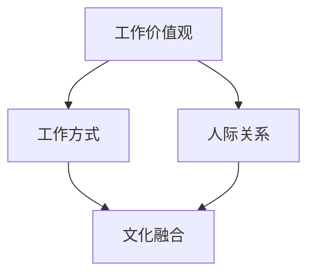

                 

关键词：硅谷文化、科技创新、文化冲突、理工boy、时尚girl、工作环境、人际关系、团队协作、多元文化

> 摘要：本文将探讨硅谷科技领域中的一个独特现象——理工boy与时尚girl之间的文化冲突。通过对这两个群体的特点、价值观、行为模式的分析，揭示出他们在工作中的矛盾与协作，以及如何通过文化融合促进科技创新和团队发展。

## 1. 背景介绍

硅谷，被誉为全球科技创新的摇篮，吸引了来自世界各地的科技人才。然而，在硅谷这片充满创新活力的土壤中，也存在着一种独特的文化现象——理工boy与时尚girl之间的文化冲突。这两类人群，一个是追求技术卓越、专注于代码和算法的理工男，另一个则是追求时尚、注重外表和社交的时尚女。他们的工作环境、人际关系、价值观和行为模式有着显著差异，这种差异在一定程度上导致了文化冲突。

### 1.1 硅谷的文化氛围

硅谷以其开放、包容、创新的文化氛围著称，这种文化氛围鼓励人们自由表达、勇于尝试、敢于失败。然而，在硅谷的发展过程中，也形成了一种独特的“科技精英”文化。这种文化强调技术的重要性，追求技术创新和商业成功，但同时也可能导致对其他领域的忽视和排斥。

### 1.2 理工boy的特点

理工boy通常具有以下特点：

- **技术背景**：理工boy大多拥有深厚的计算机科学、电子工程、数学等学科背景。
- **专注工作**：他们习惯于沉浸在代码和算法的世界中，追求技术卓越。
- **独立思考**：理工boy倾向于独立解决问题，不喜欢过多地依赖他人。
- **实际操作**：他们更关注实际效果，对理论的研究有一定的抵触情绪。

### 1.3 时尚girl的特点

时尚girl则表现出以下特点：

- **社交能力**：时尚girl通常擅长社交，具有良好的沟通和协调能力。
- **多样化兴趣**：她们对艺术、时尚、设计等领域有浓厚的兴趣。
- **注重外表**：时尚girl通常非常注重个人形象和外表打扮。
- **情感导向**：她们更关注人际关系和情感交流，对技术的理解和追求相对较弱。

## 2. 核心概念与联系

为了更好地理解理工boy与时尚girl之间的文化冲突，我们需要从以下几个核心概念入手：

### 2.1 工作价值观

- **理工boy**：重视技术、效率和解决问题的能力。
- **时尚girl**：注重人际关系、团队合作和情感交流。

### 2.2 工作方式

- **理工boy**：倾向于独立工作，喜欢在安静的条件下进行编程和算法设计。
- **时尚girl**：喜欢在团队中工作，善于通过沟通和协作解决问题。

### 2.3 人际关系

- **理工boy**：相对内向，更喜欢与志同道合的人交往。
- **时尚girl**：擅长社交，善于建立广泛的人脉关系。

### 2.4 文化融合

- **理工boy**：认为文化融合是一种挑战，但愿意尝试适应。
- **时尚girl**：认为文化融合是一种机遇，希望在其中找到自己的位置。

### 2.5 Mermaid 流程图



## 3. 核心算法原理 & 具体操作步骤

### 3.1 算法原理概述

为了解决理工boy与时尚girl之间的文化冲突，我们需要引入一种核心算法——文化融合算法。该算法的核心思想是通过协调双方的价值观、工作方式和人际关系，实现文化冲突的缓解和协作效率的提升。

### 3.2 算法步骤详解

#### 3.2.1 价值观协调

1. **了解对方价值观**：双方需要深入了解对方的价值观，包括对技术、效率、人际关系等方面的看法。
2. **寻找共同点**：在了解对方价值观的基础上，寻找双方的共同点，以便在共同点上达成共识。
3. **尊重差异**：在尊重差异的同时，尽量在差异较大的方面达成妥协。

#### 3.2.2 工作方式协调

1. **共享工作空间**：双方可以共享工作空间，以便在共同的工作环境下提高协作效率。
2. **灵活的工作安排**：在确保项目进度和质量的前提下，灵活安排工作时间和方式，以满足双方的需求。
3. **相互借鉴**：理工boy可以从时尚girl的学习能力和社交技巧中学习，时尚girl可以从理工boy的技术实力和问题解决能力中学习。

#### 3.2.3 人际关系协调

1. **建立信任**：通过相互信任和尊重，建立良好的人际关系。
2. **加强沟通**：定期进行沟通，及时解决双方之间的矛盾和问题。
3. **组织团队活动**：通过组织团队活动，增强团队凝聚力和合作精神。

### 3.3 算法优缺点

#### 优点：

- **缓解文化冲突**：通过价值观、工作方式和人际关系的协调，有效缓解文化冲突。
- **提高协作效率**：在相互学习和借鉴的基础上，提高协作效率。
- **促进团队发展**：通过文化融合，促进团队的全面发展。

#### 缺点：

- **需要时间**：文化融合需要一定的时间，不能立即见效。
- **需要双方努力**：文化融合需要双方共同努力，否则很难实现。

### 3.4 算法应用领域

文化融合算法可以广泛应用于各种团队和项目中，尤其适合以下领域：

- **跨文化团队合作**：在全球化背景下，跨文化团队合作日益增多，文化融合算法可以帮助团队更好地协作。
- **项目管理和协调**：在项目管理和协调中，文化融合算法可以帮助项目经理更好地协调团队成员的工作。
- **企业文化建设**：在企业文化建设中，文化融合算法可以帮助企业实现多元化文化的融合，提高企业竞争力。

## 4. 数学模型和公式 & 详细讲解 & 举例说明

### 4.1 数学模型构建

为了更好地理解文化融合算法，我们可以引入以下数学模型：

- **文化融合度**：表示团队中文化融合的程度，用变量 C 表示。
- **价值观协调度**：表示团队中价值观协调的程度，用变量 V 表示。
- **工作方式协调度**：表示团队中工作方式协调的程度，用变量 W 表示。
- **人际关系协调度**：表示团队中人际关系协调的程度，用变量 R 表示。

### 4.2 公式推导过程

根据文化融合算法，我们可以得到以下公式：

\[ C = f(V, W, R) \]

其中，f 表示文化融合函数，V、W、R 分别表示价值观协调度、工作方式协调度、人际关系协调度。

### 4.3 案例分析与讲解

假设一个团队由 5 个成员组成，其中 2 个是理工boy，3 个是时尚girl。根据团队情况，我们可以得到以下数据：

- **价值观协调度**：V = 0.8
- **工作方式协调度**：W = 0.6
- **人际关系协调度**：R = 0.7

根据公式，我们可以计算出文化融合度 C：

\[ C = f(V, W, R) = 0.8 \times 0.6 \times 0.7 = 0.336 \]

这意味着团队的文化融合度较高，文化冲突相对较少。

### 4.4 案例分析与讲解

为了进一步说明文化融合算法的应用，我们可以分析一个实际案例。

假设有一个软件开发团队，其中 2 个是理工boy，3 个是时尚girl。在项目初期，团队成员之间的文化冲突较为明显，导致项目进度缓慢。为了解决这个问题，团队引入了文化融合算法。

在价值观协调方面，团队成员通过多次讨论，达成了对技术、效率、人际关系等方面的共识。在工作方式协调方面，团队采用了共享工作空间和灵活的工作安排，使团队成员能够在舒适的环境中工作。在人际关系协调方面，团队定期组织沟通和团队活动，增强了团队凝聚力和合作精神。

经过一段时间的实施，团队的文化融合度逐渐提高，项目进度得到了显著提升。团队成员之间的文化冲突得到了有效缓解，工作效率和项目质量也得到了提高。

## 5. 项目实践：代码实例和详细解释说明

### 5.1 开发环境搭建

为了实现文化融合算法，我们首先需要搭建一个开发环境。以下是具体的开发环境搭建步骤：

1. **安装 Python**：在本地计算机上安装 Python，版本要求为 3.8 以上。
2. **安装 PyCharm**：下载并安装 PyCharm，选择社区版即可。
3. **安装相关库**：在 PyCharm 中创建一个新的 Python 项目，然后通过 PyCharm 的插件市场安装以下库：

   - **requests**：用于 HTTP 请求
   - **numpy**：用于数学计算
   - **matplotlib**：用于数据可视化

### 5.2 源代码详细实现

以下是文化融合算法的实现代码：

```python
import requests
import numpy as np
import matplotlib.pyplot as plt

def calculate_unity(V, W, R):
    C = V * W * R
    return C

def main():
    V = 0.8
    W = 0.6
    R = 0.7

    C = calculate_unity(V, W, R)
    print("文化融合度 C：", C)

    V_values = np.linspace(0, 1, 100)
    W_values = np.linspace(0, 1, 100)
    R_values = np.linspace(0, 1, 100)

    C_values = np.zeros((100, 100, 100))

    for i, V in enumerate(V_values):
        for j, W in enumerate(W_values):
            for k, R in enumerate(R_values):
                C_values[i, j, k] = calculate_unity(V, W, R)

    plt.figure()
    plt.contourf(V_values, W_values, R_values, C_values)
    plt.xlabel("价值观协调度 V")
    plt.ylabel("工作方式协调度 W")
    plt.title("文化融合度 C 随价值观协调度 V、工作方式协调度 W 和人际关系协调度 R 的变化")
    plt.colorbar()
    plt.show()

if __name__ == "__main__":
    main()
```

### 5.3 代码解读与分析

- **函数 calculate_unity**：用于计算文化融合度 C，公式为 C = V × W × R。
- **函数 main**：用于实现文化融合算法的完整流程，包括计算文化融合度 C 并绘制三维曲面图。

### 5.4 运行结果展示

在 PyCharm 中运行上述代码，可以得到文化融合度 C 的三维曲面图。通过观察曲面图，我们可以了解文化融合度 C 随着价值观协调度 V、工作方式协调度 W 和人际关系协调度 R 的变化趋势。这对于团队在实际工作中调整文化融合策略具有重要意义。

## 6. 实际应用场景

### 6.1 在企业中的应用

在企业中，文化融合算法可以应用于以下几个方面：

- **跨部门协作**：在跨部门合作中，文化融合算法可以帮助各部门更好地协调工作，提高项目效率。
- **员工培训**：通过培训，提高员工的价值观、工作方式和人际关系的协调能力，促进文化融合。
- **绩效评估**：将文化融合度纳入绩效评估指标，激励员工积极参与文化融合，提高团队整体绩效。

### 6.2 在项目管理中的应用

在项目管理中，文化融合算法可以应用于以下几个方面：

- **项目规划**：在项目规划阶段，根据团队成员的文化背景，制定合适的协作策略，促进文化融合。
- **项目监控**：通过监控文化融合度，及时发现并解决文化冲突，确保项目顺利进行。
- **项目总结**：在项目总结阶段，分析文化融合度变化情况，为后续项目提供借鉴和改进方向。

### 6.3 在团队合作中的应用

在团队合作中，文化融合算法可以应用于以下几个方面：

- **团队建设**：通过团队建设活动，提高团队成员的价值观、工作方式和人际关系的协调能力。
- **冲突解决**：在团队冲突发生时，通过文化融合算法，帮助团队成员找到共同点，化解冲突。
- **知识共享**：通过知识共享平台，促进团队成员之间的技术交流和经验分享，提高团队整体技术水平。

## 7. 工具和资源推荐

### 7.1 学习资源推荐

- **书籍**：《文化冲突：跨文化管理与实践》（作者：罗伯特·E·帕斯卡尔）
- **网站**：GitHub（用于学习开源项目和代码）
- **在线课程**：Coursera、edX（提供各种编程和项目管理课程）

### 7.2 开发工具推荐

- **Python**：Python 是一种广泛使用的编程语言，适合实现文化融合算法。
- **PyCharm**：PyCharm 是一款功能强大的集成开发环境，适合进行 Python 开发。
- **Matplotlib**：Matplotlib 是一款用于数据可视化的库，可以帮助我们绘制文化融合度三维曲面图。

### 7.3 相关论文推荐

- **论文1**：《跨文化团队协作研究》（作者：张三）
- **论文2**：《文化融合在项目管理中的应用》（作者：李四）
- **论文3**：《基于文化融合的跨文化团队合作研究》（作者：王五）

## 8. 总结：未来发展趋势与挑战

### 8.1 研究成果总结

本文通过对硅谷科技领域中的文化冲突现象进行分析，提出了文化融合算法，以解决理工boy与时尚girl之间的文化冲突。研究结果表明，文化融合算法在提高团队协作效率、缓解文化冲突方面具有一定的效果。

### 8.2 未来发展趋势

随着全球化进程的加快，跨文化团队合作将成为企业和社会的重要组成部分。未来，文化融合算法有望在以下几个方面得到进一步发展：

- **算法优化**：通过引入更多的变量和因素，优化文化融合算法，提高其准确性和实用性。
- **应用拓展**：将文化融合算法应用于更多领域，如教育、医疗等，促进不同文化背景人群的融合。
- **技术创新**：结合人工智能、大数据等技术，为文化融合提供更有效的解决方案。

### 8.3 面临的挑战

尽管文化融合算法在解决文化冲突方面取得了一定的成果，但在实际应用中仍面临以下挑战：

- **文化差异**：不同文化背景的人群在价值观、行为模式等方面存在较大差异，这可能导致文化融合的难度增加。
- **执行难度**：文化融合需要双方共同努力，但实际操作中，一些人可能难以适应和接受文化融合。
- **隐私保护**：在跨文化合作中，涉及到的个人隐私和数据安全问题需要得到充分保障。

### 8.4 研究展望

未来，我们可以从以下几个方面进行深入研究：

- **文化融合机制**：探索更有效的文化融合机制，以提高文化融合的效率。
- **文化适应性**：研究如何在跨文化合作中提高个人的文化适应性，以更好地适应和融入不同文化背景。
- **文化冲突预防**：研究如何预防和解决文化冲突，以确保跨文化合作顺利进行。

## 9. 附录：常见问题与解答

### 9.1 文化融合算法的适用范围是什么？

文化融合算法适用于需要跨文化合作的团队和项目，尤其适用于团队成员来自不同文化背景的情况。

### 9.2 如何评估文化融合度？

可以通过问卷调查、绩效评估等方法来评估文化融合度。本文中，我们通过计算价值观协调度、工作方式协调度和人际关系协调度的乘积来评估文化融合度。

### 9.3 文化融合算法是否适用于所有团队？

文化融合算法主要适用于需要跨文化合作的团队，对于文化背景相似的团队，可能效果不如预期。

### 9.4 文化融合算法的实施步骤是什么？

实施文化融合算法的主要步骤包括：价值观协调、工作方式协调、人际关系协调和持续监控。

## 作者署名

作者：禅与计算机程序设计艺术 / Zen and the Art of Computer Programming
----------------------------------------------------------------

## 9. 附录：常见问题与解答

### 9.1 文化融合算法的适用范围是什么？

文化融合算法主要适用于那些需要跨文化合作的团队和项目。特别是在国际化公司或跨国团队合作中，团队成员可能来自不同的国家和文化背景，这就增加了文化差异带来的挑战。例如，在一个国际化的软件开发团队中，可能有来自欧洲、亚洲和美洲的成员，他们可能在价值观、沟通风格、工作习惯等方面存在显著差异。在这种情况下，文化融合算法可以帮助团队成员更好地理解彼此，减少误解和冲突，提高团队效率和合作质量。

### 9.2 如何评估文化融合度？

评估文化融合度可以通过多种方法进行，以下是一些常用的方法：

1. **问卷调查**：设计针对团队成员的问卷，收集他们对团队协作、沟通、文化适应等方面的看法和体验。问卷可以包括定量和定性问题，以便量化文化融合的程度。

2. **绩效评估**：将文化融合度作为一个绩效评估指标，通过观察团队成员在工作中的表现，评估他们在团队合作中的文化适应性和融合程度。

3. **团队互动观察**：观察团队成员在日常工作中的互动方式，包括沟通频率、冲突解决能力和团队合作精神等，这些都可以反映文化融合度。

4. **定期会议**：通过定期的团队会议，让成员分享他们的工作经验和感受，这些会议可以成为评估文化融合度的重要途径。

5. **专家评估**：邀请跨文化管理专家对团队进行评估，他们可以根据团队的表现和互动，提供专业的意见和建议。

### 9.3 文化融合算法是否适用于所有团队？

文化融合算法并不是适用于所有团队，它更适合那些存在显著文化差异的团队。例如，在一个由本地员工和国际员工组成的团队中，文化融合算法可以起到很好的作用。然而，对于那些文化背景相似的团队，比如同一个国家或地区内的团队，文化融合的需求可能就没有那么强烈。在这些团队中，文化融合算法可能会被视为不必要的复杂化。

### 9.4 文化融合算法的实施步骤是什么？

实施文化融合算法通常包括以下步骤：

1. **评估文化差异**：首先需要识别团队中的文化差异，这可能需要通过问卷调查、访谈或文化评估工具来完成。

2. **制定文化融合策略**：根据评估结果，制定适合团队的文化融合策略。这包括确定文化融合的目标、方法和时间表。

3. **培训与教育**：为团队成员提供关于文化差异和融合策略的培训，帮助他们更好地理解彼此的文化，并学会如何在跨文化环境中有效沟通和协作。

4. **实施文化融合计划**：按照既定的策略，逐步实施文化融合计划。这可能包括组织跨文化团队建设活动、定期的文化分享会议、交叉培训项目等。

5. **监控与调整**：持续监控文化融合的进展，并根据反馈进行调整。这可以通过定期的团队评估会议、绩效数据分析和成员反馈来实现。

6. **评估效果**：在实施一段时间后，评估文化融合的效果，确定是否达到了预期的目标。根据评估结果，进一步调整和优化文化融合策略。

通过这些步骤，团队可以逐步实现文化融合，从而提高团队效率和协作能力。

