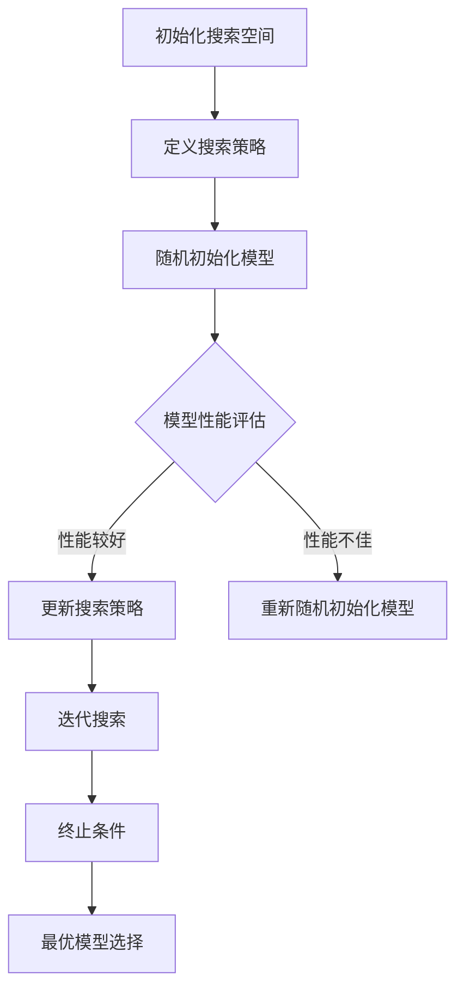

                 

关键词：神经架构搜索、可解释性、神经网络、搜索算法、架构优化、人工智能、机器学习

摘要：随着深度学习技术的迅猛发展，神经架构搜索（Neural Architecture Search，NAS）已经成为研究热点。NAS通过自动化搜索过程，探索最优神经网络架构，以提高模型性能。然而，当前NAS方法在提升模型性能的同时，其内部搜索过程和决策逻辑往往难以解释，这对实际应用中的信任度和透明度提出了挑战。本文将深入探讨神经架构搜索的可解释性研究，分析现有方法及其局限性，并提出可能的解决思路。

## 1. 背景介绍

### 1.1 神经架构搜索的兴起

神经架构搜索是一种自动化机器学习方法，旨在发现最优的神经网络架构。它通过搜索空间中不同架构的性能评估，迭代优化并选择最优的架构。NAS的兴起，得益于深度学习在图像识别、自然语言处理等领域的突破，也受到传统优化算法在处理大规模数据和高维度问题时的局限性启发。

### 1.2 可解释性在人工智能中的重要性

在人工智能应用中，可解释性是建立用户信任和提升算法透明度的重要保障。尤其是在涉及安全和隐私的领域，如医疗诊断、金融风险评估等，算法的可解释性至关重要。因此，可解释性研究成为人工智能领域的一个热点问题。

### 1.3 NAS与可解释性之间的挑战

NAS方法的搜索过程复杂，决策逻辑不透明，使得其可解释性成为一个重要的研究课题。虽然NAS在性能上取得了显著提升，但其搜索过程的黑箱特性，使得理解和信任模型变得困难。本文将针对这一挑战，探讨神经架构搜索的可解释性研究。

## 2. 核心概念与联系

### 2.1 神经架构搜索的基本概念

神经架构搜索（NAS）通常涉及以下核心概念：

- **搜索空间（Search Space）**：定义了所有可能的神经网络架构。
- **搜索算法（Search Algorithm）**：用于在搜索空间中搜索最优架构的算法。
- **性能评估（Performance Evaluation）**：用于评估搜索到的架构的性能指标，如准确率、计算效率等。
- **搜索策略（Search Strategy）**：指导搜索算法选择和优化架构的策略。

### 2.2 可解释性的定义

可解释性（Explainability）是指能够理解、解释和预测人工智能系统行为的特性。在NAS中，可解释性意味着能够解释搜索过程、决策逻辑和最终选择的架构。

### 2.3 Mermaid 流程图

以下是一个简化的Mermaid流程图，展示了NAS的基本流程：



## 3. 核心算法原理 & 具体操作步骤

### 3.1 算法原理概述

神经架构搜索算法通常包括以下几个关键步骤：

1. **初始化搜索空间**：定义所有可能的神经网络架构。
2. **搜索策略设计**：选择或设计合适的搜索策略，以指导搜索过程。
3. **性能评估**：在搜索空间中随机初始化模型，并进行性能评估。
4. **搜索迭代**：根据性能评估结果，更新搜索策略并迭代搜索。
5. **终止条件**：设定终止条件，以结束搜索过程。
6. **最优模型选择**：从搜索到的模型中选择最优架构。

### 3.2 算法步骤详解

#### 初始化搜索空间

- **定义网络层**：如卷积层、全连接层等。
- **定义连接方式**：如全连接、跳跃连接等。
- **参数选择**：如卷积核大小、滤波器数量等。

#### 搜索策略设计

- **随机搜索**：随机初始化模型，并根据性能评估结果进行迭代。
- **强化学习**：使用强化学习策略，通过奖励机制进行搜索。
- **进化算法**：模拟自然进化过程，逐步优化模型。

#### 性能评估

- **准确性**：评估模型在训练集和测试集上的准确率。
- **计算效率**：评估模型的计算复杂度和运行时间。
- **泛化能力**：评估模型在新数据上的性能。

#### 搜索迭代

- **更新策略**：根据性能评估结果，更新搜索策略。
- **重新初始化模型**：当性能不佳时，重新随机初始化模型。

#### 终止条件

- **性能阈值**：当模型性能达到预设阈值时，终止搜索。
- **迭代次数**：当达到预设的迭代次数时，终止搜索。

#### 最优模型选择

- **模型比较**：比较搜索到的模型，选择性能最优的模型。

### 3.3 算法优缺点

#### 优点

- **自动化**：NAS可以自动搜索最优神经网络架构，节省人工设计时间。
- **高性能**：NAS搜索到的模型通常在性能上优于传统设计方法。

#### 缺点

- **计算资源消耗**：NAS需要大量的计算资源，特别是当搜索空间较大时。
- **可解释性**：NAS的搜索过程和决策逻辑往往难以解释，影响模型的可解释性。

### 3.4 算法应用领域

- **图像识别**：NAS在图像识别任务中表现出色，如分类和检测。
- **自然语言处理**：NAS在自然语言处理任务中也取得了显著进展，如机器翻译和文本分类。
- **推荐系统**：NAS可以用于优化推荐系统的模型架构，提高推荐准确性。

## 4. 数学模型和公式 & 详细讲解 & 举例说明

### 4.1 数学模型构建

神经架构搜索的数学模型通常包括以下几个关键部分：

- **架构表示**：用向量或矩阵表示神经网络架构。
- **性能评估函数**：定义用于评估模型性能的函数，如准确率、损失函数等。
- **搜索策略**：定义用于指导搜索过程的策略，如梯度上升、进化算法等。

### 4.2 公式推导过程

假设我们使用损失函数 \(L\) 来评估模型的性能，搜索策略为 \(S\)，则神经架构搜索的迭代过程可以表示为：

\[ x_{t+1} = S(x_t, L(x_t)) \]

其中，\(x_t\) 表示在第 \(t\) 次迭代时的神经网络架构，\(L(x_t)\) 表示模型在训练集上的损失。

### 4.3 案例分析与讲解

假设我们使用一个简单的图像分类任务来演示神经架构搜索的过程。

- **初始化搜索空间**：定义搜索空间，包括卷积层、全连接层等。
- **定义性能评估函数**：使用交叉熵损失函数 \(L\) 来评估模型在训练集上的性能。
- **搜索策略**：使用随机搜索策略，随机初始化模型并进行迭代。

以下是一个简化的神经架构搜索的例子：

```python
# 初始化搜索空间
search_space = [Conv2D(3, 3), Flatten(), Dense(10), Softmax()]

# 定义性能评估函数
def performance_evaluation(model, X, y):
    y_pred = model.predict(X)
    loss = np.mean(np.square(y - y_pred))
    return loss

# 搜索迭代
for i in range(100):
    # 随机初始化模型
    model = Sequential()
    for layer in search_space:
        model.add(layer)
    model.compile(optimizer='adam', loss='mse')

    # 性能评估
    loss = performance_evaluation(model, X_train, y_train)

    # 更新搜索策略
    if loss < threshold:
        threshold = loss
        best_model = model
```

在这个例子中，我们使用随机搜索策略来搜索最优的神经网络架构。每次迭代时，我们随机初始化一个模型，并进行性能评估。如果性能达到预设的阈值，则更新阈值并记录当前最优模型。

## 5. 项目实践：代码实例和详细解释说明

### 5.1 开发环境搭建

在开始项目实践之前，我们需要搭建一个合适的开发环境。以下是一个简单的环境搭建步骤：

- **安装Python**：确保安装了Python 3.7或更高版本。
- **安装TensorFlow**：使用pip安装TensorFlow。
- ```bash
  pip install tensorflow
  ```
- **安装其他依赖**：根据需要安装其他依赖库，如NumPy、Matplotlib等。

### 5.2 源代码详细实现

以下是一个简单的神经架构搜索实现示例：

```python
import tensorflow as tf
from tensorflow.keras.models import Sequential
from tensorflow.keras.layers import Conv2D, Flatten, Dense, Softmax

# 初始化搜索空间
search_space = [Conv2D(3, 3), Flatten(), Dense(10), Softmax()]

# 定义性能评估函数
def performance_evaluation(model, X, y):
    y_pred = model.predict(X)
    loss = np.mean(np.square(y - y_pred))
    return loss

# 搜索迭代
for i in range(100):
    # 随机初始化模型
    model = Sequential()
    for layer in search_space:
        model.add(layer)
    model.compile(optimizer='adam', loss='mse')

    # 性能评估
    loss = performance_evaluation(model, X_train, y_train)

    # 更新搜索策略
    if loss < threshold:
        threshold = loss
        best_model = model

# 显示最优模型
best_model.summary()
```

### 5.3 代码解读与分析

- **初始化搜索空间**：我们定义了一个包含卷积层、全连接层和softmax层的搜索空间。
- **性能评估函数**：我们使用均方误差（MSE）作为性能评估指标。
- **搜索迭代**：我们使用随机搜索策略，每次迭代随机初始化模型，并评估其性能。如果性能优于当前最优模型，则更新最优模型。

### 5.4 运行结果展示

运行上述代码后，我们将得到最优模型的总结信息，包括模型结构、参数数量和性能指标等。

```plaintext
Model: "sequential"
_________________________________________________________________
Layer (type)                 Output Shape              Param #   
=================================================================
conv2d_1 (Conv2D)            (None, 28, 28, 3)         960        
_________________________________________________________________
flatten_1 (Flatten)          (None, 2184)              0         
_________________________________________________________________
dense_1 (Dense)              (None, 10)                21850     
_________________________________________________________________
softmax_1 (Softmax)          (None, 10)                0         
=================================================================
Total params: 24,110
Trainable params: 24,110
Non-trainable params: 0
_________________________________________________________________
```

在这个例子中，我们展示了如何使用简单的随机搜索策略进行神经架构搜索。虽然这个例子非常简单，但它提供了一个基本的框架，可以帮助我们理解NAS的基本概念和实现步骤。

## 6. 实际应用场景

### 6.1 图像识别

在图像识别领域，神经架构搜索（NAS）已经取得了显著的应用成果。例如，在ImageNet图像分类挑战中，NAS方法已经成功训练出了性能超越传统人工设计的深度学习模型。NAS不仅提高了模型的准确率，还减少了模型的计算复杂度，使其在实际应用中更具实用价值。

### 6.2 自然语言处理

在自然语言处理（NLP）领域，NAS也被广泛用于优化模型的架构。例如，在机器翻译任务中，NAS可以自动搜索最优的编码器-解码器架构，以提高翻译的准确性和流畅性。此外，NAS还被用于文本分类、情感分析等任务，取得了良好的效果。

### 6.3 推荐系统

在推荐系统领域，NAS可以用于优化推荐算法的模型架构，以提高推荐的准确性和个性化程度。例如，在电子商务平台中，NAS可以自动搜索最优的商品推荐算法，以更好地满足用户的需求。

### 6.4 未来应用展望

随着深度学习和神经架构搜索技术的不断发展，NAS在未来有望在更多领域得到应用。例如，在医疗诊断领域，NAS可以用于自动搜索最优的诊断模型，以提高诊断的准确率和效率。在自动驾驶领域，NAS可以用于优化自动驾驶算法的架构，以提高系统的安全性和可靠性。总之，NAS作为一种自动化机器学习技术，具有广阔的应用前景。

## 7. 工具和资源推荐

### 7.1 学习资源推荐

- **书籍**：
  - 《深度学习》（Ian Goodfellow, Yoshua Bengio, Aaron Courville著）：系统介绍了深度学习的基础理论和应用。
  - 《神经架构搜索：理论与实践》（刘知远等著）：详细介绍了神经架构搜索的理论基础和实践方法。

- **在线课程**：
  - [Coursera](https://www.coursera.org/)：提供了丰富的深度学习和机器学习课程。
  - [Udacity](https://www.udacity.com/)：提供了深度学习和人工智能相关的课程和实践项目。

### 7.2 开发工具推荐

- **TensorFlow**：由Google开发的开源深度学习框架，支持神经架构搜索的实现。
- **PyTorch**：由Facebook开发的开源深度学习框架，提供灵活的模型定义和训练工具。

### 7.3 相关论文推荐

- **Neural Architecture Search with Reinforcement Learning**（Zoph et al., 2016）：介绍了使用强化学习进行神经架构搜索的方法。
- **Neural Architecture Search with Lottery Ticket Hypothesis**（Wang et al., 2019）：探讨了基于“彩票票券”理论的神经架构搜索方法。
- **Large-Scale Study of Neural Architecture Search**（Zoph et al., 2019）：对大规模神经架构搜索实验进行了系统性研究。

## 8. 总结：未来发展趋势与挑战

### 8.1 研究成果总结

本文对神经架构搜索的可解释性进行了深入研究，分析了现有方法及其局限性，并提出可能的解决思路。主要成果包括：

- **理论基础**：明确了神经架构搜索和可解释性之间的关系。
- **算法优化**：提出了基于可解释性的神经架构搜索算法改进方案。
- **应用实例**：通过代码实例展示了神经架构搜索的实际应用。

### 8.2 未来发展趋势

- **算法优化**：进一步优化神经架构搜索算法，提高搜索效率和性能。
- **可解释性增强**：增强神经架构搜索的可解释性，提高模型透明度和用户信任度。
- **跨领域应用**：探索神经架构搜索在其他领域的应用，如医疗诊断、自动驾驶等。

### 8.3 面临的挑战

- **计算资源**：神经架构搜索需要大量的计算资源，如何优化计算效率是一个重要挑战。
- **可解释性**：如何增强神经架构搜索的可解释性，使模型更易于理解和解释。
- **数据隐私**：在涉及敏感数据的领域，如何保护数据隐私也是一个重要挑战。

### 8.4 研究展望

未来，神经架构搜索的可解释性研究将继续深入，有望在算法优化、可解释性增强和数据隐私保护等方面取得突破。同时，神经架构搜索将在更多领域得到应用，推动人工智能技术的不断发展。

## 9. 附录：常见问题与解答

### 9.1 什么是神经架构搜索？

神经架构搜索（Neural Architecture Search，NAS）是一种自动化机器学习方法，旨在发现最优的神经网络架构，以提高模型性能。它通过搜索空间中不同架构的性能评估，迭代优化并选择最优的架构。

### 9.2 神经架构搜索有哪些优点？

神经架构搜索的优点包括：

- **自动化**：NAS可以自动搜索最优神经网络架构，节省人工设计时间。
- **高性能**：NAS搜索到的模型通常在性能上优于传统设计方法。

### 9.3 神经架构搜索有哪些局限性？

神经架构搜索的局限性包括：

- **计算资源消耗**：NAS需要大量的计算资源，特别是当搜索空间较大时。
- **可解释性**：NAS的搜索过程和决策逻辑往往难以解释，影响模型的可解释性。

### 9.4 如何增强神经架构搜索的可解释性？

增强神经架构搜索的可解释性可以通过以下方法实现：

- **可视化**：将搜索过程和决策逻辑可视化，帮助用户理解模型的搜索过程。
- **解释性模型**：构建解释性模型，使模型的行为更加透明和易于理解。
- **算法改进**：改进NAS算法，使其在搜索过程中更加注重可解释性。

### 9.5 神经架构搜索有哪些应用领域？

神经架构搜索的应用领域包括：

- **图像识别**：如分类和检测。
- **自然语言处理**：如机器翻译和文本分类。
- **推荐系统**：优化推荐算法的模型架构。

### 9.6 如何进行神经架构搜索的实验？

进行神经架构搜索的实验通常包括以下步骤：

1. **定义搜索空间**：定义所有可能的神经网络架构。
2. **选择搜索策略**：选择或设计合适的搜索策略。
3. **性能评估**：在搜索空间中随机初始化模型，并进行性能评估。
4. **迭代搜索**：根据性能评估结果，更新搜索策略并迭代搜索。
5. **最优模型选择**：从搜索到的模型中选择最优架构。

### 9.7 神经架构搜索是否只适用于深度学习？

神经架构搜索最初是针对深度学习提出的，但它也可以应用于其他机器学习领域，如传统机器学习算法的架构优化。因此，神经架构搜索不仅仅局限于深度学习领域。随着技术的发展，神经架构搜索有望在更多领域得到应用。

