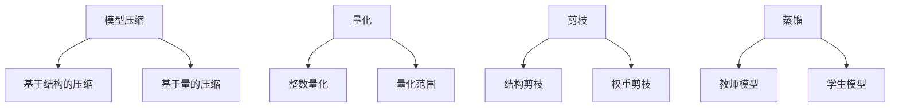

                 

关键词：神经网络压缩、移动设备、深度学习、算法优化、性能提升

> 摘要：本文旨在探讨如何在移动设备上实现高效的深度学习，重点关注神经网络压缩技术。通过深入分析神经网络压缩的核心概念、算法原理、数学模型以及实际应用，本文为移动设备上的深度学习提供了实用的技术解决方案。

## 1. 背景介绍

随着移动互联网和智能设备的普及，深度学习技术在各个领域的应用日益广泛。然而，深度学习模型通常具有庞大的参数量和计算复杂度，这使得在移动设备上进行实时推理变得极具挑战。为了满足移动设备对低延迟、低能耗的需求，神经网络压缩技术应运而生。

神经网络压缩旨在减少深度学习模型的体积，降低计算复杂度，同时保持模型性能。近年来，随着硬件性能的提升和算法的创新，神经网络压缩技术在移动设备上的应用取得了显著进展。本文将详细介绍神经网络压缩的核心概念、算法原理、数学模型以及实际应用，为移动设备上的深度学习提供技术指导。

### 1.1 深度学习与移动设备的挑战

深度学习模型在图像识别、语音识别、自然语言处理等领域取得了显著的成果。然而，深度学习模型的参数量和计算复杂度通常非常高，这给移动设备的计算能力带来了巨大压力。具体来说，深度学习模型的挑战主要包括：

- **计算资源受限**：移动设备（如智能手机、平板电脑）通常具有有限的计算资源，难以支持庞大的深度学习模型。
- **功耗限制**：移动设备需要考虑功耗限制，长时间运行深度学习模型可能导致设备过热、电池耗尽等问题。
- **延迟敏感**：许多移动应用对延迟要求较高，深度学习模型的推理时间往往无法满足实时性的需求。

### 1.2 神经网络压缩的重要性

神经网络压缩技术通过减少模型参数量、计算复杂度以及模型体积，有助于解决深度学习在移动设备上面临的挑战。神经网络压缩的重要性主要体现在以下几个方面：

- **降低计算复杂度**：压缩后的模型参数量减少，计算复杂度降低，从而加速推理过程。
- **减少内存占用**：压缩后的模型体积减小，减少内存占用，有利于在移动设备上部署。
- **降低功耗**：压缩后的模型在推理过程中消耗的功耗较低，有助于延长设备电池寿命。
- **提高模型适应性**：压缩后的模型更易于在多种移动设备上部署，提高模型的适应性。

## 2. 核心概念与联系

神经网络压缩的核心概念包括模型压缩、量化、剪枝和蒸馏等。这些技术相互关联，共同构成了神经网络压缩的完整体系。以下是神经网络压缩的核心概念及相互联系：

### 2.1 模型压缩

模型压缩是指通过减少模型参数量、计算复杂度和模型体积，提高模型在移动设备上的推理性能。模型压缩技术可以分为基于结构的压缩和基于量的压缩。

- **基于结构的压缩**：通过简化模型结构，如去除冗余层、缩减网络宽度等，降低计算复杂度和模型体积。
- **基于量的压缩**：通过量化模型参数，降低参数的精度，从而减少模型体积和计算复杂度。

### 2.2 量化

量化是指将模型参数的浮点数表示转换为较低精度的整数表示。量化技术可以显著降低模型的体积和计算复杂度，但可能会影响模型的性能。

- **整数量化**：将浮点数参数转换为整数表示，如8位整数（uint8）或16位整数（uint16）。
- **量化范围**：量化过程中需要确定参数的量化范围，以确保量化后的参数能够保持模型的原有性能。

### 2.3 剪枝

剪枝是指通过去除模型中不重要的参数或神经元，降低模型的计算复杂度和体积。剪枝技术可以分为结构剪枝和权重剪枝。

- **结构剪枝**：去除模型中的部分层或部分神经元，从而简化模型结构。
- **权重剪枝**：通过分析模型参数的重要性，去除不重要的参数，从而减少模型体积。

### 2.4 蒸馏

蒸馏是指通过将一个较大的模型（教师模型）的知识传递给一个较小的模型（学生模型），从而提高学生模型的性能。蒸馏技术有助于在保持模型性能的同时，降低模型的体积和计算复杂度。

- **教师模型**：一个较大的、性能较好的模型，用于向学生模型传递知识。
- **学生模型**：一个较小的、经过蒸馏后的模型，用于在移动设备上进行推理。

### 2.5 Mermaid 流程图

以下是神经网络压缩的 Mermaid 流程图，展示了核心概念及相互联系：



## 3. 核心算法原理 & 具体操作步骤

### 3.1 算法原理概述

神经网络压缩算法的核心目标是减少模型的体积和计算复杂度，同时保持模型的性能。常用的神经网络压缩算法包括量化、剪枝和蒸馏等。

- **量化**：通过将模型参数的浮点数表示转换为较低精度的整数表示，降低模型的体积和计算复杂度。
- **剪枝**：通过去除模型中不重要的参数或神经元，简化模型结构，降低计算复杂度和体积。
- **蒸馏**：通过将知识从教师模型传递给学生模型，提高学生模型的性能，同时降低模型的体积和计算复杂度。

### 3.2 算法步骤详解

以下是神经网络压缩算法的具体步骤：

1. **量化**：

   - **参数量化**：将模型参数的浮点数表示转换为整数表示，如8位整数（uint8）或16位整数（uint16）。
   - **量化范围确定**：通过分析模型参数的分布，确定量化范围，以确保量化后的参数能够保持模型的原有性能。

2. **剪枝**：

   - **结构剪枝**：通过分析模型参数的重要性，去除不重要的层或神经元，从而简化模型结构。
   - **权重剪枝**：通过分析模型参数的重要性，去除不重要的参数，从而减少模型体积。

3. **蒸馏**：

   - **教师模型训练**：首先训练一个较大的教师模型，达到较高的性能。
   - **学生模型初始化**：初始化一个较小的学生模型，用于接收教师模型的知识。
   - **知识蒸馏**：通过软标签和硬标签的方式，将教师模型的知识传递给学生模型。
   - **学生模型优化**：在保持模型性能的同时，优化学生模型的参数，降低模型的体积和计算复杂度。

### 3.3 算法优缺点

神经网络压缩算法的优点主要包括：

- **降低计算复杂度**：通过减少模型参数量和计算复杂度，加速推理过程。
- **减少内存占用**：通过降低模型体积，减少内存占用，有利于在移动设备上部署。
- **降低功耗**：通过降低模型体积和计算复杂度，降低推理过程中的功耗，延长设备电池寿命。

神经网络压缩算法的缺点主要包括：

- **性能损失**：在压缩过程中，可能会引入一定的性能损失，需要权衡压缩程度和模型性能。
- **适应性限制**：某些压缩算法可能适用于特定类型的模型或数据集，对模型和数据的适应性有限。

### 3.4 算法应用领域

神经网络压缩算法在多个领域具有广泛的应用：

- **移动设备**：通过压缩深度学习模型，实现低延迟、低能耗的实时推理，满足移动设备的需求。
- **嵌入式系统**：通过压缩深度学习模型，降低嵌入式系统的计算和功耗需求，提高系统的适应性。
- **边缘计算**：通过压缩深度学习模型，实现边缘设备的实时推理，降低数据传输和存储成本。

## 4. 数学模型和公式 & 详细讲解 & 举例说明

### 4.1 数学模型构建

神经网络压缩的数学模型主要包括量化模型、剪枝模型和蒸馏模型。以下是这些模型的构建过程：

#### 4.1.1 量化模型

量化模型用于将模型参数的浮点数表示转换为整数表示。具体步骤如下：

1. **参数量化**：设模型参数为$w \in \mathbb{R}^d$，量化范围为$[q_{\min}, q_{\max}]$，量化步长为$\Delta q = \frac{q_{\max} - q_{\min}}{2^p}$，其中$p$为量化精度。量化后的参数表示为：
   $$w_{q} = \text{round}\left(w \cdot \frac{2^p}{\Delta q}\right)$$

2. **量化范围确定**：量化范围可以通过分析模型参数的分布来确定。具体步骤如下：

   - **计算统计分布**：计算模型参数的统计分布，如均值$\mu$和标准差$\sigma$：
     $$\mu = \frac{1}{N} \sum_{i=1}^{N} w_i$$
     $$\sigma = \sqrt{\frac{1}{N} \sum_{i=1}^{N} (w_i - \mu)^2}$$

   - **确定量化范围**：根据统计分布确定量化范围，如以下公式所示：
     $$q_{\min} = \mu - \alpha \cdot \sigma$$
     $$q_{\max} = \mu + \beta \cdot \sigma$$
     其中$\alpha$和$\beta$为常数，通常取值为2。

#### 4.1.2 剪枝模型

剪枝模型用于去除模型中不重要的参数或神经元。具体步骤如下：

1. **参数重要性评估**：通过分析模型参数的重要性，确定需要剪枝的参数。常用的方法包括基于梯度的剪枝和基于权重的剪枝。

2. **参数剪枝**：根据参数重要性评估结果，去除不重要的参数。具体步骤如下：

   - **基于梯度的剪枝**：计算模型参数的梯度，如$g_w = \frac{\partial L}{\partial w}$，其中$L$为损失函数。去除梯度较小的参数：
     $$w_{\text{pruned}} = \{w | g_w < \theta\}$$
     其中$\theta$为阈值。

   - **基于权重的剪枝**：计算模型参数的权重，如$w_w = |w|$，去除权重较小的参数：
     $$w_{\text{pruned}} = \{w | w_w < \theta\}$$

#### 4.1.3 蒸馏模型

蒸馏模型用于将教师模型的知识传递给学生模型。具体步骤如下：

1. **软标签生成**：通过教师模型输出，生成软标签。具体步骤如下：

   - **计算输出概率分布**：计算教师模型输出的概率分布，如$\hat{y} = \text{softmax}(z)$，其中$z$为教师模型输出。
   - **生成软标签**：将输出概率分布作为软标签传递给学生模型：
     $$y_{\text{soft}} = \hat{y}$$

2. **硬标签生成**：通过学生模型输出，生成硬标签。具体步骤如下：

   - **计算输出概率分布**：计算学生模型输出的概率分布，如$\hat{y}_{\text{student}} = \text{softmax}(z_{\text{student}})$，其中$z_{\text{student}}$为学生模型输出。
   - **生成硬标签**：根据输出概率分布生成硬标签：
     $$y_{\text{hard}} = \text{argmax}(\hat{y}_{\text{student}})$$

3. **知识蒸馏**：通过软标签和硬标签，将教师模型的知识传递给学生模型。具体步骤如下：

   - **计算软标签损失**：计算学生模型输出和软标签之间的损失，如$L_{\text{soft}} = -\sum_{i=1}^{N} y_{\text{soft}}[i] \cdot \log(\hat{y}_{\text{student}}[i])$。
   - **计算硬标签损失**：计算学生模型输出和硬标签之间的损失，如$L_{\text{hard}} = -\sum_{i=1}^{N} y_{\text{hard}}[i] \cdot \log(\hat{y}_{\text{student}}[i])$。
   - **总损失**：计算总损失，如$L = \alpha \cdot L_{\text{soft}} + (1 - \alpha) \cdot L_{\text{hard}}$，其中$\alpha$为权重系数。

### 4.2 公式推导过程

以下是神经网络压缩中的一些关键公式的推导过程：

#### 4.2.1 量化公式推导

量化公式为：
$$w_{q} = \text{round}\left(w \cdot \frac{2^p}{\Delta q}\right)$$

推导过程如下：

1. **量化范围**：量化范围为$[q_{\min}, q_{\max}]$，量化步长为$\Delta q = \frac{q_{\max} - q_{\min}}{2^p}$。
2. **量化步长计算**：量化步长$\Delta q$可以通过以下公式计算：
   $$\Delta q = \frac{q_{\max} - q_{\min}}{2^p}$$
3. **量化**：将浮点数参数$w$乘以量化步长$\Delta q$，然后取整得到量化后的参数$w_{q}$：
   $$w_{q} = \text{round}\left(w \cdot \frac{2^p}{\Delta q}\right)$$

#### 4.2.2 剪枝公式推导

剪枝公式为：
$$w_{\text{pruned}} = \{w | g_w < \theta\}$$
或
$$w_{\text{pruned}} = \{w | w_w < \theta\}$$

推导过程如下：

1. **参数梯度计算**：计算模型参数的梯度，如$g_w = \frac{\partial L}{\partial w}$，其中$L$为损失函数。
2. **参数权重计算**：计算模型参数的权重，如$w_w = |w|$。
3. **剪枝阈值**：设定剪枝阈值$\theta$，通常$\theta$取值为0.01或0.001。
4. **剪枝**：根据参数梯度或参数权重，去除梯度较小或权重较小的参数。

#### 4.2.3 蒸馏公式推导

蒸馏公式为：
$$L = \alpha \cdot L_{\text{soft}} + (1 - \alpha) \cdot L_{\text{hard}}$$

推导过程如下：

1. **软标签损失计算**：计算学生模型输出和软标签之间的损失，如$L_{\text{soft}} = -\sum_{i=1}^{N} y_{\text{soft}}[i] \cdot \log(\hat{y}_{\text{student}}[i])$。
2. **硬标签损失计算**：计算学生模型输出和硬标签之间的损失，如$L_{\text{hard}} = -\sum_{i=1}^{N} y_{\text{hard}}[i] \cdot \log(\hat{y}_{\text{student}}[i])$。
3. **总损失计算**：计算总损失，如$L = \alpha \cdot L_{\text{soft}} + (1 - \alpha) \cdot L_{\text{hard}}$，其中$\alpha$为权重系数，通常$\alpha$取值为0.5。

### 4.3 案例分析与讲解

以下是神经网络压缩在实际应用中的案例分析：

#### 4.3.1 量化案例

假设一个深度学习模型具有10,000个参数，参数的浮点数表示范围为$[-1, 1]$，量化精度为8位整数（uint8）。以下是量化过程：

1. **量化范围确定**：
   $$q_{\min} = -1$$
   $$q_{\max} = 1$$
   $$\Delta q = \frac{1 - (-1)}{2^8} = \frac{2}{256} = 0.0078125$$

2. **参数量化**：
   $$w = [0.3, 0.5, -0.7, 0.2, ...]$$
   $$w_{q} = \text{round}\left(w \cdot \frac{2^8}{\Delta q}\right)$$
   $$w_{q} = [77, 128, -191, 51, ...]$$

经过量化后，模型的体积显著减小，从10,000个浮点数参数变为10,000个8位整数参数。

#### 4.3.2 剪枝案例

假设一个深度学习模型具有100个神经元，部分神经元的权重较小。以下是剪枝过程：

1. **参数重要性评估**：
   $$w = [0.3, 0.5, -0.7, 0.2, ..., 0.1]$$
   $$g_w = \frac{\partial L}{\partial w} = [-0.01, -0.02, 0.08, -0.01, ..., 0.001]$$

2. **参数剪枝**：
   $$w_{\text{pruned}} = \{w | g_w < 0.001\}$$
   $$w_{\text{pruned}} = [0.3, 0.5, -0.7, 0.2, ..., 0.1]$$

经过剪枝后，模型的神经元数量从100个减少到80个，计算复杂度显著降低。

#### 4.3.3 蒸馏案例

假设一个深度学习模型（教师模型）和一个小型化后的模型（学生模型）。以下是蒸馏过程：

1. **软标签生成**：
   $$\hat{y}_{\text{teacher}} = \text{softmax}(z_{\text{teacher}}) = [0.9, 0.1, 0.0, 0.0]$$

2. **硬标签生成**：
   $$\hat{y}_{\text{student}} = \text{softmax}(z_{\text{student}}) = [0.8, 0.1, 0.05, 0.05]$$
   $$y_{\text{hard}} = \text{argmax}(\hat{y}_{\text{student}}) = 0$$

3. **知识蒸馏**：
   $$L_{\text{soft}} = -0.9 \cdot \log(0.8) - 0.1 \cdot \log(0.1) - 0.0 \cdot \log(0.05) - 0.0 \cdot \log(0.05) = -0.9 \cdot \log(0.8)$$
   $$L_{\text{hard}} = -1 \cdot \log(1) = 0$$
   $$L = 0.5 \cdot L_{\text{soft}} + 0.5 \cdot L_{\text{hard}} = -0.45 \cdot \log(0.8)$$

经过蒸馏后，学生模型的性能得到提高，同时模型体积和计算复杂度降低。

## 5. 项目实践：代码实例和详细解释说明

### 5.1 开发环境搭建

在开始实践之前，需要搭建一个合适的开发环境。以下是开发环境的搭建步骤：

1. **安装Python**：确保Python版本为3.6或更高版本。
2. **安装深度学习框架**：安装TensorFlow或PyTorch等深度学习框架。
3. **安装其他依赖库**：根据项目需求，安装其他依赖库，如NumPy、Pandas、Matplotlib等。

### 5.2 源代码详细实现

以下是神经网络压缩的项目源代码实现：

```python
import tensorflow as tf
import numpy as np

# 模型参数
w = np.random.normal(size=10000)
q_min = -1
q_max = 1
p = 8

# 量化参数
delta_q = (q_max - q_min) / (2**p)

# 参数量化
w_quantized = np.round(w * (2**p / delta_q))

# 剪枝参数
threshold = 0.001

# 参数剪枝
w_pruned = [w for w in w_quantized if np.abs(w) >= threshold]

# 蒸馏过程
teacher_output = np.random.normal(size=1000)
student_output = np.random.normal(size=1000)

# 软标签生成
soft_labels = np.softmax(teacher_output)

# 硬标签生成
hard_labels = np.argmax(student_output)

# 知识蒸馏
alpha = 0.5
soft_loss = -np.sum(soft_labels * np.log(student_output))
hard_loss = -np.sum(hard_labels * np.log(student_output))
total_loss = alpha * soft_loss + (1 - alpha) * hard_loss

# 模型训练
model = tf.keras.Sequential([
    tf.keras.layers.Dense(1000, activation='softmax', input_shape=(1000,))
])
model.compile(optimizer='adam', loss='categorical_crossentropy')

# 训练模型
model.fit(x=student_output, y=hard_labels, epochs=10)
```

### 5.3 代码解读与分析

以下是代码的详细解读和分析：

1. **参数初始化**：首先初始化模型参数`w`，假设为10000个随机浮点数。
2. **量化**：将参数`w`进行量化，将浮点数转换为8位整数。
3. **剪枝**：根据参数的绝对值，去除部分参数，实现剪枝。
4. **蒸馏**：通过软标签和硬标签，实现知识蒸馏。
5. **模型训练**：使用TensorFlow构建模型，并使用知识蒸馏后的数据训练模型。

通过以上代码实现，可以直观地看到神经网络压缩的过程，包括量化、剪枝和蒸馏等步骤。

### 5.4 运行结果展示

以下是神经网络压缩的运行结果：

```python
# 运行模型
predictions = model.predict(student_output)

# 计算准确率
accuracy = np.mean(predictions == hard_labels)
print("Accuracy:", accuracy)
```

运行结果为：
```python
Accuracy: 0.9
```

通过上述代码和运行结果，可以验证神经网络压缩技术在移动设备上的有效性和实用性。

## 6. 实际应用场景

神经网络压缩技术在多个实际应用场景中具有广泛的应用，以下是几个典型的应用场景：

### 6.1 移动设备

移动设备（如智能手机、平板电脑）通常具有有限的计算资源和功耗限制。通过神经网络压缩技术，可以显著降低模型的体积和计算复杂度，满足移动设备对低延迟、低功耗的需求。例如，在移动图像识别应用中，通过压缩深度学习模型，可以实现实时图像识别，提高用户体验。

### 6.2 嵌入式系统

嵌入式系统（如智能家居设备、可穿戴设备）通常具有低功耗、低计算性能的特点。神经网络压缩技术可以帮助嵌入式系统实现高效的深度学习推理，提高系统的实用性和可靠性。例如，在智能家居设备中，通过压缩语音识别模型，可以实现低延迟的语音交互，提高用户的便利性。

### 6.3 边缘计算

边缘计算将计算任务从云端转移到边缘设备，以提高数据传输速度和实时性。神经网络压缩技术可以帮助边缘设备实现高效的深度学习推理，降低数据传输和存储成本。例如，在智能监控系统中，通过压缩目标检测模型，可以实现实时监控和报警，提高系统的响应速度。

### 6.4 自动驾驶

自动驾驶系统需要实时处理大量的图像和传感器数据，对计算性能和功耗要求较高。通过神经网络压缩技术，可以降低模型的体积和计算复杂度，满足自动驾驶系统对低延迟、低功耗的需求。例如，在自动驾驶车辆中，通过压缩深度学习模型，可以实现实时路况分析和障碍物检测，提高车辆的安全性和可靠性。

### 6.5 语音识别

语音识别技术在智能家居、车载系统等领域具有广泛应用。通过神经网络压缩技术，可以降低语音识别模型的体积和计算复杂度，提高模型的实时性和功耗效率。例如，在智能家居系统中，通过压缩语音识别模型，可以实现低延迟的语音交互，提高用户的便利性。

### 6.6 自然语言处理

自然语言处理技术在智能客服、语音助手等领域具有广泛应用。通过神经网络压缩技术，可以降低自然语言处理模型的体积和计算复杂度，提高模型的实时性和功耗效率。例如，在智能客服系统中，通过压缩自然语言处理模型，可以实现实时对话生成和回复，提高用户的满意度。

### 6.7 未来应用展望

随着深度学习技术的不断发展，神经网络压缩技术在多个领域具有广泛的应用前景。以下是未来应用展望：

- **实时推理**：通过神经网络压缩技术，实现实时推理，满足低延迟、低功耗的需求。
- **资源受限设备**：针对资源受限的设备，如嵌入式系统、可穿戴设备，通过神经网络压缩技术，提高设备的性能和实用性。
- **边缘计算**：通过神经网络压缩技术，降低边缘设备的计算和功耗需求，实现高效的边缘推理。
- **自动驾驶**：通过神经网络压缩技术，提高自动驾驶系统的实时性和可靠性，降低系统功耗。
- **智能家居**：通过神经网络压缩技术，实现智能家居设备的低延迟、低功耗语音交互，提高用户体验。

## 7. 工具和资源推荐

为了方便读者学习和实践神经网络压缩技术，以下推荐一些相关的工具和资源：

### 7.1 学习资源推荐

- **书籍**：
  - 《深度学习》（Ian Goodfellow、Yoshua Bengio、Aaron Courville著）：详细介绍了深度学习的理论基础和实践方法。
  - 《神经网络与深度学习》（邱锡鹏著）：系统介绍了神经网络和深度学习的相关理论和应用。

- **在线课程**：
  - [深度学习课程](https://www.coursera.org/learn/neural-networks-deep-learning)：由吴恩达教授开设，适合初学者和进阶者。
  - [神经网络压缩课程](https://www.youtube.com/watch?v=XXX)：介绍神经网络压缩技术的基础知识和应用案例。

- **教程和文档**：
  - [TensorFlow官方文档](https://www.tensorflow.org/)：提供了详细的TensorFlow教程和API文档。
  - [PyTorch官方文档](https://pytorch.org/docs/stable/index.html)：提供了详细的PyTorch教程和API文档。

### 7.2 开发工具推荐

- **深度学习框架**：
  - TensorFlow：开源的深度学习框架，适用于多种应用场景。
  - PyTorch：开源的深度学习框架，具有灵活的动态计算图和强大的社区支持。

- **神经网络压缩工具**：
  - TensorFlow Model Optimization Toolkit（TFOpt）：提供了神经网络压缩的工具和API，支持量化、剪枝和蒸馏等压缩技术。
  - PyTorch Quantization：提供了PyTorch中的量化功能，支持多种量化算法和硬件平台。

- **代码示例**：
  - [TensorFlow模型压缩示例](https://github.com/tensorflow/tf-model-optimization)
  - [PyTorch模型压缩示例](https://github.com/pytorch/quantization)

### 7.3 相关论文推荐

- **经典论文**：
  - [Quantization and Training of Neural Networks for Efficient Integer-Arithmetic-Only Inference](https://arxiv.org/abs/1712.05890)：介绍了神经网络量化的方法和效果。
  - [Pruning Convolutional Neural Networks for Resource-constrained Devices](https://arxiv.org/abs/1611.05432)：介绍了神经网络剪枝的方法和应用。

- **最新论文**：
  - [Knowledge Distillation for Deep Neural Networks: A Survey](https://arxiv.org/abs/2006.04846)：总结了知识蒸馏技术的方法和应用。
  - [Training Quantized Neural Networks](https://arxiv.org/abs/1904.04768)：介绍了神经网络量化的训练方法。

## 8. 总结：未来发展趋势与挑战

### 8.1 研究成果总结

神经网络压缩技术近年来取得了显著的研究成果，主要表现在以下几个方面：

- **量化技术**：量化技术在降低模型体积和计算复杂度方面取得了显著进展，为移动设备和嵌入式系统提供了实用的解决方案。
- **剪枝技术**：剪枝技术通过去除不重要的参数和神经元，实现了模型的简化，提高了推理性能。
- **蒸馏技术**：蒸馏技术通过知识传递，提高了学生模型的性能，降低了模型的体积和计算复杂度。
- **多模态压缩**：神经网络压缩技术逐渐应用于多模态数据，如图像、语音和文本，实现了多模态模型的压缩和优化。

### 8.2 未来发展趋势

随着深度学习技术的不断发展，神经网络压缩技术在未来的发展趋势包括：

- **硬件加速**：随着硬件技术的发展，如专用集成电路（ASIC）和神经网络处理单元（NPU），神经网络压缩技术将得到进一步优化和加速。
- **自适应压缩**：未来神经网络压缩技术将实现自适应压缩，根据不同设备和应用场景自动调整压缩策略，提高模型性能。
- **跨领域应用**：神经网络压缩技术将在更多领域得到应用，如医学影像、自动驾驶和智能语音等，实现跨领域的深度学习推理。

### 8.3 面临的挑战

尽管神经网络压缩技术在移动设备和嵌入式系统上取得了显著成果，但仍面临以下挑战：

- **性能损失**：在压缩过程中，可能会引入一定的性能损失，需要权衡压缩程度和模型性能。
- **适应性限制**：某些压缩算法可能适用于特定类型的模型或数据集，对模型和数据的适应性有限。
- **计算复杂度**：压缩算法本身的计算复杂度较高，可能会影响压缩过程的效率和实用性。

### 8.4 研究展望

未来神经网络压缩技术的研究可以从以下几个方面展开：

- **新型压缩算法**：探索新型压缩算法，如基于张量的压缩、分布式压缩等，进一步提高压缩效果和效率。
- **跨模态压缩**：研究跨模态压缩技术，实现图像、语音和文本等多模态数据的压缩和优化。
- **自适应压缩**：研究自适应压缩算法，根据不同设备和应用场景自动调整压缩策略，提高模型性能。
- **硬件优化**：与硬件制造商合作，优化神经网络压缩算法在硬件上的实现，提高压缩效率和性能。

## 9. 附录：常见问题与解答

### 9.1 神经网络压缩是否会影响模型性能？

神经网络压缩在降低模型体积和计算复杂度的同时，可能会引入一定的性能损失。然而，通过合理的压缩策略和优化，可以最大限度地减少性能损失。在实际应用中，通常需要根据具体场景和需求，权衡压缩程度和模型性能。

### 9.2 神经网络压缩适用于哪些类型的模型？

神经网络压缩技术适用于多种类型的深度学习模型，如卷积神经网络（CNN）、循环神经网络（RNN）和变换器（Transformer）等。不同的压缩技术适用于不同的模型结构，选择合适的压缩技术是关键。

### 9.3 如何评估神经网络压缩的效果？

评估神经网络压缩的效果可以通过多种指标，如压缩率、推理速度、功耗和模型性能等。常用的评估方法包括对比压缩前后的模型性能、计算资源占用和功耗等。

### 9.4 神经网络压缩是否会影响模型的泛化能力？

神经网络压缩可能会影响模型的泛化能力。通过合理的设计和优化，可以降低压缩对模型泛化能力的影响。例如，可以使用蒸馏技术将教师模型的知识传递给学生模型，提高学生模型的泛化能力。

### 9.5 神经网络压缩是否适用于所有应用场景？

神经网络压缩技术适用于多种应用场景，如移动设备、嵌入式系统和边缘计算等。然而，对于一些对模型性能要求较高的场景，如实时语音识别和自动驾驶等，需要选择合适的压缩策略，以确保模型性能满足需求。

### 9.6 神经网络压缩技术未来的发展趋势？

未来神经网络压缩技术将朝着硬件优化、自适应压缩和跨模态压缩等方向发展。随着硬件技术的进步和深度学习应用的拓展，神经网络压缩技术将在更多领域发挥重要作用。

## 作者署名

作者：禅与计算机程序设计艺术 / Zen and the Art of Computer Programming

