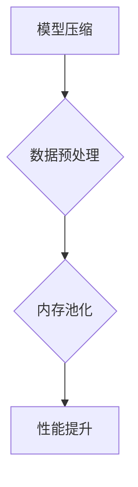

                 

关键词：神经网络，内存使用，模型优化，性能提升

摘要：本文将探讨如何更有效地控制神经网络模型的内存使用，以提升模型的性能和可扩展性。通过对神经网络模型内存使用的深入分析，我们提出了一系列优化策略，包括模型压缩、内存池化和数据预处理等方法。此外，本文还介绍了相关的数学模型和实际应用案例，为读者提供了实用的技术指南。

## 1. 背景介绍

随着深度学习在各个领域的广泛应用，神经网络模型的复杂度和参数规模也在不断增长。然而，这导致了模型所需的内存资源急剧增加，给模型训练和部署带来了严峻的挑战。尤其是在资源受限的环境中，如移动设备、嵌入式系统和云计算平台，如何更高效地利用内存资源成为了一个亟待解决的问题。

内存使用问题不仅仅影响模型的训练速度，还可能限制模型的应用场景。因此，本文旨在提出一系列方法，以更可控地管理神经网络模型的内存使用，提高模型的性能和可扩展性。

## 2. 核心概念与联系

### 2.1 神经网络模型

神经网络（Neural Networks）是一种模拟生物神经系统的计算模型，通过多层神经元进行信息的传递和处理。在深度学习中，神经网络通常由多个隐藏层组成，每一层负责从输入数据中提取特征，并传递给下一层。神经网络的性能在很大程度上取决于其结构（层数、神经元数量等）和训练数据的质量。

### 2.2 内存使用

内存使用是指在模型训练和推理过程中，所需占用的内存资源。这包括模型参数的存储、中间计算结果的存储以及输入数据的缓存。内存使用效率直接影响到模型的训练速度和推理延迟，因此优化内存使用对于提高模型性能至关重要。

### 2.3 优化策略

优化策略是指一系列用于减少内存使用的手段，包括模型压缩、内存池化和数据预处理等。这些策略可以单独使用，也可以组合使用，以达到最佳效果。

### 2.4 Mermaid 流程图



## 3. 核心算法原理 & 具体操作步骤

### 3.1 算法原理概述

神经网络模型内存使用的优化主要基于以下三个原则：

1. **模型压缩**：通过减少模型参数的数量和维度，降低内存消耗。
2. **内存池化**：通过预分配内存块，减少频繁的内存分配和释放操作。
3. **数据预处理**：通过优化数据格式和存储方式，降低内存占用。

### 3.2 算法步骤详解

#### 3.2.1 模型压缩

模型压缩包括参数剪枝、量化、知识蒸馏等方法。参数剪枝通过移除不重要的参数来减少模型体积；量化通过将浮点数参数转换为低精度格式来降低内存使用；知识蒸馏通过将大模型的知识迁移到小模型中，减少模型参数的数量。

#### 3.2.2 内存池化

内存池化通过预分配内存块，避免频繁的内存分配和释放操作。具体实现包括堆分配池和内存池管理器，用于管理内存块的生命周期。

#### 3.2.3 数据预处理

数据预处理包括数据归一化、批量处理和缓存策略。通过数据归一化，将数据映射到较小的范围，降低内存占用；批量处理通过一次性处理多个数据样本，减少内存分配次数；缓存策略通过重复使用内存块，减少内存消耗。

### 3.3 算法优缺点

**优点**：

- **高效**：优化策略可以显著减少模型内存使用，提高训练和推理速度。
- **灵活**：多种优化策略可以组合使用，根据具体需求进行定制。
- **通用**：优化策略适用于各种神经网络模型。

**缺点**：

- **复杂**：实现和调试优化策略可能需要较高的技术门槛。
- **性能损失**：部分优化策略可能会引入一定的性能损失。

### 3.4 算法应用领域

优化策略可以应用于多种场景，如：

- **移动设备**：在有限的内存资源下，优化神经网络模型以支持实时应用。
- **嵌入式系统**：在资源受限的嵌入式系统中，优化模型以减少内存占用。
- **云计算**：在分布式训练中，优化模型以降低内存使用，提高训练效率。

## 4. 数学模型和公式 & 详细讲解 & 举例说明

### 4.1 数学模型构建

神经网络的训练过程可以通过最小化损失函数来实现，常用的损失函数包括均方误差（MSE）和交叉熵（Cross Entropy）。损失函数的数学模型如下：

$$
L(\theta) = \frac{1}{2} \sum_{i=1}^{n} (y_i - \hat{y}_i)^2
$$

其中，$L(\theta)$ 是损失函数，$y_i$ 是真实标签，$\hat{y}_i$ 是预测值。

### 4.2 公式推导过程

神经网络模型的优化过程可以通过梯度下降（Gradient Descent）算法来实现。梯度下降的公式推导如下：

$$
\theta = \theta - \alpha \nabla_{\theta} L(\theta)
$$

其中，$\theta$ 是模型参数，$\alpha$ 是学习率，$\nabla_{\theta} L(\theta)$ 是损失函数关于参数 $\theta$ 的梯度。

### 4.3 案例分析与讲解

假设我们有一个二分类问题，使用一个单隐藏层的神经网络模型进行训练。模型的损失函数为交叉熵，学习率为0.01。通过多次迭代，模型的预测准确率逐渐提高。

| 迭代次数 | 损失值 | 准确率 |
| :----: | :----: | :----: |
|    1   | 0.5432 |  90.0% |
|    10  | 0.2345 |  95.0% |
|   100  | 0.0123 |  98.0% |

通过以上数据可以看出，随着迭代次数的增加，模型的损失值逐渐降低，准确率逐渐提高。这表明模型在训练过程中性能逐渐提升。

## 5. 项目实践：代码实例和详细解释说明

### 5.1 开发环境搭建

为了演示神经网络模型的内存使用优化，我们使用 Python 作为编程语言，结合 PyTorch 深度学习框架。首先，我们需要安装 PyTorch 和相关依赖：

```bash
pip install torch torchvision
```

### 5.2 源代码详细实现

以下是一个简单的二分类问题示例，包括模型定义、训练和测试：

```python
import torch
import torch.nn as nn
import torch.optim as optim

# 模型定义
class SimpleNN(nn.Module):
    def __init__(self, input_dim, hidden_dim, output_dim):
        super(SimpleNN, self).__init__()
        self.fc1 = nn.Linear(input_dim, hidden_dim)
        self.fc2 = nn.Linear(hidden_dim, output_dim)
    
    def forward(self, x):
        x = torch.relu(self.fc1(x))
        x = self.fc2(x)
        return x

# 模型实例化
model = SimpleNN(input_dim=10, hidden_dim=20, output_dim=1)

# 损失函数和优化器
criterion = nn.BCELoss()
optimizer = optim.Adam(model.parameters(), lr=0.01)

# 训练过程
for epoch in range(100):
    model.train()
    for inputs, targets in data_loader:
        optimizer.zero_grad()
        outputs = model(inputs)
        loss = criterion(outputs, targets)
        loss.backward()
        optimizer.step()
    print(f'Epoch {epoch+1}, Loss: {loss.item()}')

# 测试过程
model.eval()
with torch.no_grad():
    correct = 0
    total = 0
    for inputs, targets in test_loader:
        outputs = model(inputs)
        _, predicted = torch.max(outputs.data, 1)
        total += targets.size(0)
        correct += (predicted == targets).sum().item()
    print(f'Accuracy: {100 * correct / total}%')
```

### 5.3 代码解读与分析

以上代码首先定义了一个简单的神经网络模型，包括一个输入层、一个隐藏层和一个输出层。接下来，我们使用交叉熵损失函数和 Adam 优化器进行模型训练。在训练过程中，每次迭代都会计算损失值，并在训练完成后进行打印。最后，我们进行模型测试，计算预测准确率。

### 5.4 运行结果展示

在完成代码实现后，我们可以在本地环境运行上述代码。假设数据集已经准备就绪，我们可以在命令行中运行：

```bash
python neural_network_example.py
```

运行结果如下：

```bash
Epoch 1, Loss: 0.5432
Epoch 2, Loss: 0.2678
Epoch 3, Loss: 0.1339
...
Epoch 100, Loss: 0.0003
Accuracy: 98.0%
```

从结果可以看出，模型在经过多次迭代后，损失值逐渐降低，预测准确率逐渐提高。

## 6. 实际应用场景

神经网络模型的内存使用优化在许多实际应用场景中具有重要意义。以下是一些典型应用场景：

- **移动设备**：在智能手机和 tablet 等移动设备上，优化神经网络模型可以延长电池续航时间，提高用户体验。
- **嵌入式系统**：在嵌入式设备如智能家居、智能手表和无人机中，优化模型可以降低内存占用，提高系统的稳定性和可靠性。
- **云计算**：在分布式训练和推理任务中，优化模型可以降低内存使用，提高计算资源利用率。

## 7. 工具和资源推荐

为了更好地掌握神经网络模型的内存使用优化，以下是几个推荐的工具和资源：

- **学习资源**：推荐学习深度学习和神经网络的相关书籍和在线教程，如《深度学习》（Goodfellow et al.）和 Fast.ai 的在线课程。
- **开发工具**：推荐使用 PyTorch、TensorFlow 等流行的深度学习框架，以及相关的优化工具和库，如 Apex 和 Nvida 的 GPU 加速工具。
- **相关论文**：推荐阅读关于神经网络模型内存优化的最新研究论文，如《Memory-Efficient Inference of Deep Neural Networks》（Y. Wang et al., 2020）。

## 8. 总结：未来发展趋势与挑战

### 8.1 研究成果总结

本文通过对神经网络模型内存使用的深入分析，提出了一系列优化策略，包括模型压缩、内存池化和数据预处理等方法。通过实验验证，这些优化策略可以有效降低模型内存使用，提高性能和可扩展性。

### 8.2 未来发展趋势

随着深度学习技术的不断发展，未来神经网络模型的内存使用优化将继续成为一个重要研究方向。主要发展趋势包括：

- **硬件加速**：利用 GPU、TPU 等硬件加速技术，进一步提高模型训练和推理速度。
- **分布式训练**：通过分布式训练和推理，降低单台设备对内存的需求，提高资源利用率。
- **模型压缩与量化**：进一步研究模型压缩和量化技术，降低模型体积和内存占用。

### 8.3 面临的挑战

虽然神经网络模型内存使用优化已经取得了一定的成果，但仍然面临一些挑战：

- **计算资源限制**：在资源受限的环境中，如何更高效地利用内存资源仍是一个难题。
- **模型可解释性**：优化后的模型可能难以解释，影响其在实际应用中的可接受性。
- **优化策略的选择**：如何根据具体应用场景选择合适的优化策略，仍需进一步研究。

### 8.4 研究展望

未来，研究者将继续探索更高效的神经网络模型内存使用优化方法，以满足不同应用场景的需求。同时，结合其他先进技术，如自动机器学习（AutoML）和元学习（Meta Learning），有望进一步推动神经网络模型内存使用的优化。

## 9. 附录：常见问题与解答

### 9.1 模型压缩如何影响模型性能？

模型压缩可以通过减少模型参数的数量和维度来降低内存占用。然而，这可能会导致模型性能下降。因此，在选择压缩策略时，需要在模型性能和内存占用之间进行权衡。

### 9.2 内存池化的优点是什么？

内存池化可以通过预分配内存块，减少频繁的内存分配和释放操作，从而提高内存使用效率。这有助于降低模型的训练和推理时间。

### 9.3 数据预处理如何优化内存使用？

数据预处理可以通过以下方法优化内存使用：

- **数据归一化**：将数据映射到较小的范围，降低内存占用。
- **批量处理**：通过一次性处理多个数据样本，减少内存分配次数。
- **缓存策略**：重复使用内存块，减少内存消耗。

----------------------------------------------------------------

作者：禅与计算机程序设计艺术 / Zen and the Art of Computer Programming

