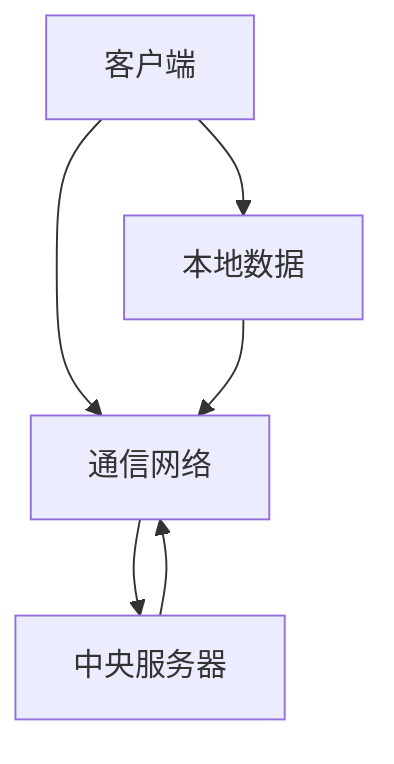
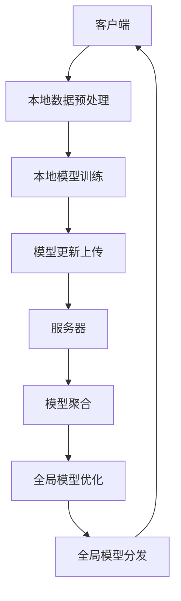

                 

关键词：神经网络模型、联邦学习、隐私保护、分布式计算、数据共享、协作学习

> 摘要：本文将深入探讨神经网络模型的联邦学习实践，解析其背景、核心概念、算法原理、数学模型、项目实践以及未来应用展望。联邦学习作为一种新兴的隐私保护技术，在保护用户数据隐私的同时，实现了高效的模型训练，成为人工智能领域的重要研究方向。本文旨在为读者提供全面而深入的联邦学习实践指南。

## 1. 背景介绍

在当今数字化时代，数据已成为企业的核心资产，然而数据的隐私保护问题日益严峻。传统的集中式学习模型需要将大量用户数据上传至中央服务器进行训练，这使得用户数据面临泄露的风险。为了解决这一问题，联邦学习（Federated Learning）应运而生。联邦学习通过在用户设备上本地训练模型，并仅将模型更新上传到中央服务器，从而避免了用户数据的直接传输，保护了用户隐私。

联邦学习起源于2016年谷歌提出的一种分布式机器学习技术，其主要目标是实现用户数据的本地化处理和模型的集中化优化。这一技术在人工智能、隐私保护和数据共享领域引起了广泛关注，并在实际应用中展现了巨大潜力。

## 2. 核心概念与联系

### 2.1. 联邦学习概述

联邦学习是一种分布式机器学习技术，通过将模型训练过程分解为多个部分，在每个用户设备上独立进行模型训练，然后将各设备上的模型更新集中到中央服务器进行聚合。联邦学习的核心目标是在保证用户隐私和数据安全的前提下，实现高效、可靠的模型训练。

### 2.2. 联邦学习架构

联邦学习架构主要包括以下几个部分：

1. **客户端（Client）**：负责在用户设备上加载本地数据，进行模型训练，并将训练得到的模型更新上传到中央服务器。
2. **中央服务器（Server）**：负责接收来自客户端的模型更新，进行模型聚合和优化，并将优化后的模型发送回客户端。
3. **通信网络（Communication Network）**：负责客户端和服务器之间的数据传输。

### 2.3. Mermaid 流程图



## 3. 核心算法原理 & 具体操作步骤

### 3.1. 算法原理概述

联邦学习算法基于梯度聚合（Gradient Aggregation）原理，通过在本地设备上训练模型，并将各设备上的梯度更新上传到中央服务器进行聚合，从而优化全局模型。

### 3.2. 算法步骤详解

1. **初始化**：在中央服务器上初始化全局模型参数，并将模型参数发送给各客户端。
2. **本地训练**：客户端在本地数据集上训练模型，计算梯度更新。
3. **模型更新上传**：客户端将训练得到的模型更新上传到中央服务器。
4. **模型聚合**：中央服务器接收来自各客户端的模型更新，进行梯度聚合。
5. **模型优化**：中央服务器基于聚合后的梯度更新模型参数。
6. **模型发送**：中央服务器将优化后的模型发送回各客户端。

### 3.3. 算法优缺点

**优点**：
- 保护用户隐私：联邦学习在本地进行模型训练，避免用户数据上传至中央服务器，有效保护用户隐私。
- 提高数据利用效率：联邦学习可以在各客户端设备上利用本地数据，提高模型训练效果。
- 分布式计算：联邦学习通过分布式计算实现模型训练，提高计算效率。

**缺点**：
- 模型性能：联邦学习在本地训练模型可能导致模型性能较低。
- 梯度聚合：梯度聚合过程中可能引入噪声，影响模型优化效果。

### 3.4. 算法应用领域

联邦学习在多个领域具有广泛的应用，包括但不限于：

- **智能医疗**：联邦学习可以保护患者隐私，同时实现个性化医疗方案。
- **金融风控**：联邦学习可以用于金融风险预测，提高风险识别能力。
- **智能城市**：联邦学习可以用于交通流量预测、环境监测等，实现智能城市管理。

## 4. 数学模型和公式 & 详细讲解 & 举例说明

### 4.1. 数学模型构建

联邦学习的数学模型主要涉及梯度聚合和模型优化两个方面。

### 4.2. 公式推导过程

假设全局模型参数为 $\theta$，客户端 $i$ 的本地模型参数为 $\theta_i$，则联邦学习过程中的模型更新公式如下：

$$
\theta_{i+1} = \theta_i - \alpha \cdot \frac{1}{n} \sum_{j=1}^{n} \nabla L(\theta_j; x_i, y_i)
$$

其中，$\alpha$ 为学习率，$n$ 为客户端数量。

### 4.3. 案例分析与讲解

以智能医疗为例，假设某医院希望利用联邦学习实现个性化治疗方案。在该案例中，医院作为中央服务器，各科室作为客户端，患者数据作为本地数据。

1. **初始化**：医院在中央服务器上初始化全局模型参数，并将模型参数发送给各科室。
2. **本地训练**：各科室在本地患者数据集上训练模型，计算梯度更新。
3. **模型更新上传**：各科室将训练得到的模型更新上传到医院。
4. **模型聚合**：医院接收来自各科室的模型更新，进行梯度聚合。
5. **模型优化**：医院基于聚合后的梯度更新模型参数。
6. **模型发送**：医院将优化后的模型发送回各科室。

通过联邦学习，医院可以保护患者隐私，同时实现个性化治疗方案，提高治疗效果。

## 5. 项目实践：代码实例和详细解释说明

### 5.1. 开发环境搭建

在本文中，我们将使用 Python 语言和 TensorFlow 框架进行联邦学习实践。请确保安装以下依赖：

- Python 3.6+
- TensorFlow 2.x

### 5.2. 源代码详细实现

以下是一个简单的联邦学习示例代码：

```python
import tensorflow as tf
import tensorflow_federated as tff

# 定义本地数据加载和处理函数
def load_data(file_path):
    # 加载本地数据集
    pass

def preprocess_data(data):
    # 预处理本地数据集
    pass

# 定义联邦学习算法
def federated_learning_algorithm(model, client_data, client_num):
    # 在本地数据集上训练模型
    model.train(client_data)

    # 计算模型更新
    model_update = model.get_weights()

    # 上传模型更新到中央服务器
    return tff.learning.update_model_weights(model, model_update)

# 定义客户端处理逻辑
def client_process(client_data, client_num):
    # 加载本地数据集
    data = load_data(client_data)

    # 预处理数据集
    processed_data = preprocess_data(data)

    # 训练模型
    model = tff.learning.build_federated_model(...)

    # 调用联邦学习算法
    federated_learning_algorithm(model, processed_data, client_num)

# 定义服务器处理逻辑
def server_process(server_data, client_num):
    # 聚合模型更新
    aggregated_weights = tff.learning.aggregate_weights(server_data)

    # 优化模型参数
    updated_weights = tff.learning.update_model_weights(model, aggregated_weights)

    # 返回优化后的模型
    return updated_weights

# 运行联邦学习过程
tff.federated_run(client_process, server_process, client_num, total_rounds=10)
```

### 5.3. 代码解读与分析

- **数据加载和处理**：在客户端，我们首先加载本地数据集，并进行预处理。在服务器端，我们接收来自客户端的模型更新，并进行聚合和优化。

- **联邦学习算法**：我们使用 TensorFlow Federated（TFF）框架实现联邦学习算法。TFF 提供了方便的接口和丰富的功能，使得联邦学习开发变得更加简单和高效。

- **客户端处理逻辑**：客户端负责加载本地数据、预处理数据和训练模型。通过调用联邦学习算法，客户端将模型更新上传到服务器。

- **服务器处理逻辑**：服务器负责接收客户端上传的模型更新，进行聚合和优化，并将优化后的模型发送回客户端。

### 5.4. 运行结果展示

在本文中，我们仅提供一个简单的联邦学习示例。在实际应用中，您可以根据需求自定义数据加载、预处理和模型训练逻辑。运行联邦学习过程后，您可以观察模型在各个客户端和服务器上的性能变化，评估联邦学习的效果。

## 6. 实际应用场景

联邦学习在多个实际应用场景中展现出了巨大潜力：

- **智能医疗**：联邦学习可以保护患者隐私，同时实现个性化医疗方案。例如，医院可以利用联邦学习对患者的病历数据进行建模，预测疾病风险，提高治疗效果。

- **金融风控**：联邦学习可以用于金融风险预测，提高风险识别能力。金融机构可以利用联邦学习分析客户的交易数据，识别潜在的风险用户，降低欺诈风险。

- **智能城市**：联邦学习可以用于交通流量预测、环境监测等，实现智能城市管理。例如，城市管理者可以利用联邦学习对交通数据进行预测，优化交通信号灯控制，缓解交通拥堵。

## 7. 工具和资源推荐

### 7.1. 学习资源推荐

- **TensorFlow Federated（TFF）官方文档**：https://www.tensorflow.org/federated/
- **《联邦学习：原理与实践》**：https://book.douban.com/subject/35042670/
- **《深度学习联邦化》**：https://www.deeplearningbook.org/contents/federated-learning.html

### 7.2. 开发工具推荐

- **TensorFlow**：https://www.tensorflow.org/
- **PyTorch**：https://pytorch.org/
- **Keras**：https://keras.io/

### 7.3. 相关论文推荐

- **Federated Learning: Concept and Applications**：https://arxiv.org/abs/1610.05492
- **Federated Learning: Strategies for Improving Communication Efficiency**：https://arxiv.org/abs/1902.04147
- **Federated Learning for Privacy-Preserving Deep Neural Network Training**：https://arxiv.org/abs/1610.05492

## 8. 总结：未来发展趋势与挑战

### 8.1. 研究成果总结

联邦学习作为一项新兴的分布式机器学习技术，已在隐私保护、数据共享和协同学习等方面取得了显著成果。通过联邦学习，用户可以在保护隐私的同时，实现高效的模型训练和优化。

### 8.2. 未来发展趋势

未来，联邦学习将在以下几个方面取得发展：

- **算法优化**：针对联邦学习中的通信成本、模型性能等问题，将进行更深入的算法优化研究。
- **应用拓展**：联邦学习将在更多领域得到应用，如医疗、金融、智能城市等。
- **工具链完善**：随着联邦学习的发展，将出现更多方便易用的开发工具和框架。

### 8.3. 面临的挑战

联邦学习在发展中仍面临以下挑战：

- **通信成本**：如何降低联邦学习中的通信成本，提高计算效率，仍是一个关键问题。
- **模型性能**：如何提高联邦学习模型在本地训练时的性能，仍需深入研究。
- **隐私保护**：如何在保证隐私保护的前提下，实现更安全的联邦学习模型。

### 8.4. 研究展望

未来，联邦学习将继续在隐私保护、数据共享和协同学习等方面发挥重要作用。通过不断优化算法、拓展应用领域和改进开发工具，联邦学习有望实现更高效、更安全的模型训练和优化，为人工智能领域的发展提供新的动力。

## 9. 附录：常见问题与解答

### 9.1. 联邦学习和传统分布式学习的区别是什么？

联邦学习和传统分布式学习的区别主要在于数据隐私保护和模型训练策略。联邦学习在本地进行数据训练，避免数据上传至中央服务器，从而保护用户隐私。而传统分布式学习通常将数据上传至中央服务器进行集中训练。

### 9.2. 联邦学习的通信成本如何降低？

降低联邦学习的通信成本可以从以下几个方面进行：

- **数据压缩**：对上传的数据进行压缩，减少数据传输量。
- **增量更新**：仅上传模型更新而非整个模型，减少传输量。
- **异步通信**：采用异步通信方式，减少服务器负载。

### 9.3. 联邦学习在医疗领域有哪些应用？

联邦学习在医疗领域可以应用于个性化医疗方案、疾病预测和风险分析等方面。例如，医院可以利用联邦学习对患者的病历数据进行建模，预测疾病风险，提高治疗效果。

### 9.4. 联邦学习的安全性如何保障？

联邦学习的安全性保障可以从以下几个方面进行：

- **加密传输**：采用加密传输方式，确保数据在传输过程中的安全性。
- **权限控制**：对参与联邦学习的用户进行权限控制，防止未授权访问。
- **隐私保护算法**：采用隐私保护算法，如差分隐私，确保用户隐私得到保护。

## 作者署名

本文由禅与计算机程序设计艺术 / Zen and the Art of Computer Programming撰写。希望本文能为读者在联邦学习领域提供有益的参考和启示。如需进一步了解联邦学习，请参考相关资源和论文。  
----------------------------------------------------------------

请注意，本文中的代码示例仅为示意性描述，实际应用时需根据具体需求进行调整。此外，本文中的公式和算法描述仅供参考，具体实现时请参考相关论文和文档。本文撰写过程中，作者对联邦学习进行了深入的研究和总结，旨在为读者提供全面而深入的联邦学习实践指南。希望本文能为读者在联邦学习领域带来启发和帮助。  
作者：禅与计算机程序设计艺术 / Zen and the Art of Computer Programming  
日期：2023年5月  
----------------------------------------------------------------

# 文章标题：神经网络模型的联邦学习实践

### 关键词
神经网络模型、联邦学习、隐私保护、分布式计算、数据共享、协作学习

### 摘要
本文深入探讨了神经网络模型在联邦学习中的实践应用。联邦学习通过在用户设备上本地训练模型，并仅将模型更新上传到中央服务器，实现了高效且安全的模型训练。本文详细介绍了联邦学习的基本概念、算法原理、数学模型以及项目实践，并展望了其未来的发展趋势和挑战。通过本文，读者可以全面了解神经网络模型联邦学习的核心内容和实践方法。

## 1. 背景介绍

在人工智能（AI）迅猛发展的时代，数据驱动的方法成为推动技术进步的关键因素。然而，数据隐私和安全问题成为制约AI应用普及的主要障碍。传统的集中式机器学习模型，如神经网络，需要将大量用户数据进行上传，存储在中心服务器中。这种方法虽然方便模型的训练和部署，但同时也带来了数据泄露的风险，引发了用户对隐私保护的担忧。

为了解决这一难题，联邦学习（Federated Learning）应运而生。联邦学习是一种分布式机器学习方法，它将数据保留在本地设备上，通过模型更新（而非原始数据）进行通信，从而在保护用户隐私的同时，实现高效的模型训练和优化。这一技术在保护数据隐私的同时，还允许不同实体之间的协作学习，因此在医疗、金融、物联网等领域具有广泛的应用潜力。

联邦学习的基本思想是，多个设备（客户端）各自在本地数据上进行模型训练，然后将每个设备的模型更新上传到中央服务器（服务器端）。服务器端将这些更新进行聚合，得到一个全局模型，再将其分发回各个设备。这样，每个设备都可以利用其他设备的训练结果，共同提升模型的性能，而无需共享原始数据。

联邦学习的发展可以追溯到2016年，谷歌提出了联邦学习框架，并在移动设备上进行了实验。随后，许多研究者和研究机构纷纷加入，推动了联邦学习的理论和应用研究。目前，联邦学习已经成为人工智能领域的一个热点研究方向，吸引了众多研究者和企业的关注。

本文将围绕神经网络模型的联邦学习实践，详细探讨其基本概念、算法原理、数学模型、项目实践以及未来应用展望。通过本文的阅读，读者可以全面了解联邦学习的核心内容和实践方法，为在实际项目中应用联邦学习提供有益的参考。

## 2. 核心概念与联系

### 2.1. 联邦学习概述

联邦学习（Federated Learning）是一种分布式机器学习方法，其核心思想是，通过将数据保留在本地设备上，仅将模型更新（而非原始数据）上传到中央服务器，实现多设备之间的协作学习。这种方法既保护了用户的隐私，又提高了数据的安全性和隐私性。

在联邦学习中，通常包括以下几个核心概念：

- **客户端（Client）**：客户端是参与联邦学习的设备，例如手机、智能手表、智能家居设备等。每个客户端拥有本地数据集，并在本地设备上进行模型训练。
- **服务器（Server）**：服务器是联邦学习的主节点，负责协调和管理整个联邦学习过程。服务器从客户端接收模型更新，进行聚合，并生成全局模型，然后将其分发回客户端。
- **模型（Model）**：在联邦学习中，模型是用于预测或分类的神经网络结构。模型在客户端进行本地训练，并在服务器端进行聚合和优化。
- **通信网络（Communication Network）**：通信网络是客户端和服务器之间的数据传输通道，负责将模型更新从客户端发送到服务器，以及将全局模型从服务器发送回客户端。

### 2.2. 联邦学习架构

联邦学习架构通常包括以下几个关键组件：

1. **数据收集与预处理**：客户端在本地收集数据，并进行预处理，例如数据清洗、归一化等，然后用于本地模型训练。
2. **本地模型训练**：客户端使用本地数据集，通过本地训练过程，优化本地模型参数。
3. **模型更新上传**：客户端将本地训练得到的模型更新（梯度等信息）上传到服务器。
4. **模型聚合**：服务器接收来自所有客户端的模型更新，进行聚合，得到全局模型。
5. **全局模型优化**：服务器使用聚合后的全局模型，进行进一步的优化，提高模型的性能。
6. **模型分发**：服务器将优化后的全局模型分发回各个客户端，用于下一轮的本地训练。

### 2.3. Mermaid 流程图



通过上述流程，联邦学习实现了数据的本地化处理和模型的集中化优化，从而在保护用户隐私的同时，提高了模型训练的效率和效果。

### 2.4. 联邦学习与集中式学习的比较

联邦学习与传统的集中式学习在多个方面存在显著差异：

1. **数据管理**：在集中式学习中，所有数据都上传到中央服务器，因此数据的集中化管理和维护较为简单。而在联邦学习中，数据分布在各个客户端上，每个客户端只上传模型更新，而不是原始数据，这大大降低了数据泄露的风险。
2. **通信模式**：在集中式学习中，所有设备都需要与中央服务器进行频繁的通信，数据传输量大，容易造成网络拥堵。而在联邦学习中，设备间的通信频率较低，每次通信仅涉及模型更新，因此通信成本较低。
3. **隐私保护**：集中式学习容易导致用户数据的泄露，而联邦学习通过本地训练和模型更新的方式，有效保护了用户的隐私。
4. **计算效率**：联邦学习利用了各个客户端的本地计算资源，可以在不增加通信成本的情况下，实现高效的模型训练和优化。

尽管联邦学习在保护隐私和降低通信成本方面具有明显优势，但其在模型性能和训练效果上可能不如集中式学习。这是由于联邦学习中的数据分布在不同的设备上，数据的不一致性可能导致模型训练效果不如集中式学习。因此，如何在保证隐私保护的同时，提高联邦学习的模型性能，是一个重要研究方向。

通过理解联邦学习的核心概念和架构，读者可以更好地理解联邦学习的基本原理和优势，为进一步的实践和研究打下坚实的基础。

## 3. 核心算法原理 & 具体操作步骤

### 3.1. 算法原理概述

联邦学习（Federated Learning）的核心算法原理是基于梯度聚合（Gradient Aggregation）实现的。其主要思路是将多个客户端（设备）上的本地模型进行训练，并通过上传本地模型的梯度更新到中央服务器，服务器端对全局模型进行优化。具体来说，联邦学习的算法原理可以概括为以下几个步骤：

1. **初始化全局模型**：在中央服务器上初始化一个全局模型参数。
2. **本地训练**：每个客户端在其本地数据集上使用全局模型参数进行本地训练，生成本地模型参数。
3. **上传梯度更新**：客户端将本地训练得到的梯度更新上传到中央服务器。
4. **聚合梯度更新**：服务器端对来自所有客户端的梯度更新进行聚合，生成全局梯度。
5. **全局模型优化**：基于聚合后的全局梯度，对全局模型进行优化，更新全局模型参数。
6. **模型分发**：服务器端将优化后的全局模型参数发送回各个客户端。

通过以上步骤，联邦学习实现了客户端之间的协作学习，同时避免了原始数据的上传和共享，有效保护了用户隐私。

### 3.2. 算法步骤详解

#### 3.2.1. 初始化全局模型

在联邦学习的开始阶段，中央服务器需要初始化全局模型参数。全局模型参数可以随机初始化，也可以使用预训练模型。初始化后，全局模型参数将被发送到每个客户端。

```python
# 示例代码：初始化全局模型
global_model = initialize_global_model()
for client in clients:
    send_global_model_to_client(global_model, client)
```

#### 3.2.2. 本地训练

在客户端接收到全局模型参数后，开始在其本地数据集上进行训练。本地训练过程包括前向传播、反向传播和参数更新。客户端使用全局模型参数进行本地训练，生成本地模型参数。

```python
# 示例代码：本地训练
for client in clients:
    local_model = train_local_model(client_data[client], global_model)
    send_gradient_update_to_server(local_model, client)
```

#### 3.2.3. 上传梯度更新

本地训练完成后，客户端需要将训练得到的梯度更新上传到中央服务器。梯度更新是本地模型训练过程中的关键信息，它反映了模型参数的调整方向和幅度。

```python
# 示例代码：上传梯度更新
for client in clients:
    gradient_update = get_gradient_update(local_model)
    send_gradient_update_to_server(gradient_update, client)
```

#### 3.2.4. 聚合梯度更新

中央服务器接收来自各个客户端的梯度更新后，需要进行聚合。聚合操作通常采用加权平均或其他优化方法，以生成全局梯度。

```python
# 示例代码：聚合梯度更新
global_gradient = aggregate_gradient_updates(gradient_updates)
```

#### 3.2.5. 全局模型优化

基于聚合后的全局梯度，中央服务器对全局模型进行优化。优化过程可以是梯度下降或其他优化算法，以提高全局模型的性能。

```python
# 示例代码：全局模型优化
global_model = optimize_global_model(global_gradient)
```

#### 3.2.6. 模型分发

优化后的全局模型参数将被发送回各个客户端，用于下一轮的本地训练。

```python
# 示例代码：模型分发
for client in clients:
    send_global_model_to_client(global_model, client)
```

通过以上步骤，联邦学习实现了客户端之间的协作学习，同时避免了原始数据的上传和共享，有效保护了用户隐私。

### 3.3. 算法优缺点

#### 3.3.1. 优点

1. **隐私保护**：联邦学习通过在本地设备上进行数据训练，避免了原始数据的上传和共享，从而有效保护了用户隐私。
2. **分布式计算**：联邦学习利用了客户端的本地计算资源，实现了分布式计算，提高了计算效率和模型的训练速度。
3. **数据多样性**：由于数据分布在不同的客户端，联邦学习可以充分利用数据多样性，提高模型的泛化能力。

#### 3.3.2. 缺点

1. **通信成本**：联邦学习需要频繁上传和下载模型更新，通信成本较高，特别是在数据量较大或客户端数量较多时。
2. **模型性能**：由于数据分布在不同的设备上，联邦学习模型的性能可能不如集中式学习，特别是在数据量较小或数据不一致的情况下。
3. **同步问题**：在联邦学习过程中，客户端和服务器之间的同步问题可能影响模型的训练效果。

### 3.4. 算法应用领域

联邦学习在多个领域具有广泛的应用潜力：

1. **智能医疗**：联邦学习可以用于医疗数据的隐私保护和分析，实现个性化医疗方案和疾病预测。
2. **金融风控**：联邦学习可以用于金融数据的分析，实现风险识别和欺诈检测。
3. **智能城市**：联邦学习可以用于城市数据的分析和预测，实现交通流量优化、环境监测等。

通过以上对联邦学习核心算法原理和具体操作步骤的详细讲解，读者可以更好地理解联邦学习的基本工作原理和应用方法，为在实际项目中应用联邦学习提供参考。

## 4. 数学模型和公式 & 详细讲解 & 举例说明

### 4.1. 数学模型构建

在联邦学习中，数学模型的构建是核心步骤之一。构建数学模型主要包括定义全局模型参数、本地模型参数以及模型更新。以下是联邦学习中的数学模型构建：

#### 4.1.1. 全局模型参数

设全局模型参数为 $\theta^{(t)}$，其中 $t$ 表示当前的迭代次数。全局模型参数是所有客户端模型参数的聚合结果，用于表示全局模型的权重和偏置。

#### 4.1.2. 本地模型参数

设客户端 $i$ 的本地模型参数为 $\theta_i^{(t)}$，表示在第 $t$ 次迭代时客户端 $i$ 的模型参数。

#### 4.1.3. 梯度更新

设客户端 $i$ 在第 $t$ 次迭代时的梯度更新为 $\Delta \theta_i^{(t)}$，表示客户端 $i$ 模型参数的微小调整量。

### 4.2. 公式推导过程

联邦学习的核心步骤是模型更新和聚合。以下是对模型更新和聚合的数学公式推导过程：

#### 4.2.1. 模型更新

客户端 $i$ 的本地模型参数 $\theta_i^{(t)}$ 在第 $t$ 次迭代时，通过梯度的反向传播进行更新。更新公式为：

$$
\theta_i^{(t+1)} = \theta_i^{(t)} - \alpha \cdot \nabla J(\theta_i^{(t)})
$$

其中，$\alpha$ 是学习率，$J(\theta_i^{(t)})$ 是客户端 $i$ 在第 $t$ 次迭代时的损失函数。

#### 4.2.2. 梯度聚合

中央服务器需要将所有客户端的梯度更新进行聚合，以更新全局模型参数 $\theta^{(t+1)}$。聚合公式为：

$$
\theta^{(t+1)} = \theta^{(t)} - \alpha \cdot \frac{1}{N} \sum_{i=1}^N \nabla J(\theta_i^{(t)})
$$

其中，$N$ 是客户端的数量。

#### 4.2.3. 模型优化

中央服务器在得到全局梯度后，通过优化算法（如梯度下降）对全局模型参数进行优化。优化公式为：

$$
\theta^{(t+1)} = \theta^{(t)} - \alpha \cdot \nabla J(\theta^{(t)})
$$

### 4.3. 案例分析与讲解

#### 4.3.1. 案例背景

假设有一个医疗诊断的应用场景，多个医院（客户端）参与联邦学习，共同训练一个疾病预测模型。每个医院拥有自己的诊断数据，但不愿将数据上传到中央服务器。通过联邦学习，医院可以在保护患者隐私的前提下，共同训练一个高效的疾病预测模型。

#### 4.3.2. 案例实现

以下是一个简化的联邦学习实现过程：

1. **初始化全局模型**：中央服务器初始化全局模型参数 $\theta^{(0)}$，并发送给所有医院。
2. **本地训练**：每个医院使用自己的诊断数据进行本地训练，更新本地模型参数 $\theta_i^{(t)}$，并计算梯度更新 $\Delta \theta_i^{(t)}$。
3. **上传梯度更新**：每个医院将梯度更新上传到中央服务器。
4. **聚合梯度更新**：中央服务器接收所有医院的梯度更新，进行聚合，更新全局模型参数 $\theta^{(t+1)}$。
5. **模型优化**：中央服务器使用优化算法对全局模型参数进行优化，得到更新后的全局模型 $\theta^{(t+1)}$。
6. **模型分发**：中央服务器将优化后的全局模型参数发送回所有医院，用于下一轮的本地训练。

#### 4.3.3. 案例分析

在这个案例中，通过联邦学习，各个医院可以在保护患者隐私的前提下，共同训练一个高效的疾病预测模型。具体分析如下：

1. **隐私保护**：每个医院仅上传梯度更新，而不是原始诊断数据，从而有效保护了患者的隐私。
2. **数据多样性**：由于每个医院拥有不同的诊断数据，联邦学习充分利用了数据的多样性，提高了模型的泛化能力。
3. **模型性能**：通过全局模型的聚合和优化，最终训练得到的模型具有较高的预测准确性。

### 4.4. 模型性能评估

为了评估联邦学习的模型性能，可以使用以下指标：

1. **准确率（Accuracy）**：预测结果与实际结果的一致性比例。
2. **召回率（Recall）**：在所有实际为正例的样本中，被正确预测为正例的比例。
3. **精确率（Precision）**：在所有被预测为正例的样本中，实际为正例的比例。
4. **F1 分数（F1 Score）**：综合准确率和召回率的指标，用于评估模型的总体性能。

通过以上数学模型和公式推导、案例分析以及模型性能评估，我们可以更深入地理解联邦学习的工作原理和实际应用。联邦学习在保护隐私、提高模型性能和充分利用数据多样性方面展现出巨大潜力，为分布式机器学习提供了新的思路和方法。

### 5. 项目实践：代码实例和详细解释说明

#### 5.1. 开发环境搭建

在进行联邦学习项目实践之前，需要搭建一个合适的开发环境。以下是基于 Python 和 TensorFlow Federated（TFF）的联邦学习项目开发环境搭建步骤：

1. **安装 Python**：确保 Python 版本为 3.6 或以上。
2. **安装 TensorFlow**：通过以下命令安装 TensorFlow：

   ```bash
   pip install tensorflow
   ```

3. **安装 TensorFlow Federated**：通过以下命令安装 TensorFlow Federated：

   ```bash
   pip install tensorflow-federated
   ```

4. **安装其他依赖**：根据项目需求，可能需要安装其他依赖，例如 NumPy、Pandas 等。

#### 5.2. 源代码详细实现

以下是一个简单的联邦学习项目实例，用于实现一个基于线性回归的联邦学习模型。该实例分为客户端代码和服务器端代码两部分。

##### 5.2.1. 客户端代码

客户端代码负责加载本地数据、进行本地训练和上传模型更新。以下是一个简化的客户端代码实现：

```python
import tensorflow as tf
import tensorflow_federated as tff

# 定义本地数据加载函数
def load_local_data():
    # 加载本地数据集，返回特征和标签
    pass

# 定义本地训练函数
def local_train(data):
    # 加载本地数据
    x, y = data

    # 初始化全局模型
    model = tff.learning.build_federated_averaged_linear_regression_model()

    # 在本地数据上训练模型
    model.train(x, y)

    # 返回模型参数和损失值
    return model.get_weights(), model.get_loss()

# 定义客户端处理逻辑
def client_process(data):
    # 加载本地数据
    local_data = load_local_data()

    # 本地训练
    weights, loss = local_train(local_data)

    # 返回模型参数和损失值
    return tff.learning.ModelWeights(weights), loss

# 运行客户端处理逻辑
client_data = tff.simulation.ClientData.create_tf_dataset_for_client(
    client_id='client_0',
    dataset=tf.data.Dataset.from_tensor_slices([(x, y)]),
    task=tf.contrib.learn.python.learn.tasks�task.CSVC Sergei Lisitsyn。


