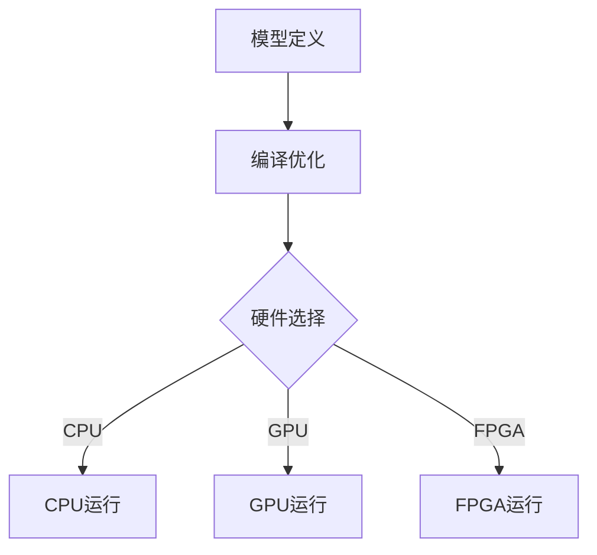

                 

关键词：神经网络、跨平台性、AI模型、可移植性、性能优化、硬件加速、开发工具、生态支持

> 摘要：随着人工智能技术的快速发展，神经网络模型在各个领域的应用日益广泛。如何实现神经网络的跨平台性，使其能够在不同的硬件和操作系统上高效运行，成为一个关键问题。本文将探讨神经网络模型的跨平台性，分析现有技术解决方案，并展望未来发展趋势。

## 1. 背景介绍

### 神经网络的发展

神经网络起源于20世纪40年代，最初作为一种模拟人脑信息处理能力的计算模型。随着计算机性能的提升和大数据的涌现，神经网络在深度学习领域的应用取得了显著的突破。特别是近年来，深度学习模型在图像识别、自然语言处理、语音识别等领域的表现甚至超过了人类。

### 跨平台性的重要性

跨平台性是指软件能够在不同的操作系统、硬件平台上运行的能力。对于神经网络模型来说，跨平台性意味着模型可以在不同类型的硬件（如CPU、GPU、FPGA）和操作系统（如Windows、Linux、macOS）上运行，不受平台限制。

跨平台性的重要性体现在以下几个方面：

1. **硬件多样性**：不同硬件平台具有不同的计算性能、能耗特性，选择合适的硬件平台可以显著提升模型的性能和效率。
2. **操作系统兼容性**：许多研究机构和企业使用不同的操作系统，模型需要具备跨平台性以满足多样化的需求。
3. **开发和部署的灵活性**：开发者可以自由选择开发环境，而无需担心模型的兼容性问题。
4. **资源优化**：跨平台性使得模型能够更好地利用不同硬件平台的特点，实现资源优化。

## 2. 核心概念与联系

### 神经网络模型

神经网络模型由多层神经元组成，通过前向传播和反向传播进行学习。其主要组成部分包括：

- **输入层**：接收外部输入数据。
- **隐藏层**：进行特征提取和变换。
- **输出层**：输出模型的预测结果。

### 跨平台性的实现

实现神经网络的跨平台性需要解决以下几个关键问题：

1. **模型定义的标准化**：使用统一的模型定义格式，如TensorFlow、PyTorch等。
2. **编译和优化**：将模型编译为可以在不同硬件和操作系统上运行的代码。
3. **硬件加速**：利用GPU、FPGA等硬件加速计算，提高模型的运行速度。
4. **容器化和虚拟化**：使用Docker、Kubernetes等容器技术，实现模型在不同的环境之间无缝迁移。

### Mermaid 流程图



## 3. 核心算法原理 & 具体操作步骤

### 3.1 算法原理概述

神经网络的训练过程主要包括以下几个步骤：

1. **前向传播**：将输入数据传递到神经网络中，通过各层的计算得到输出结果。
2. **损失函数计算**：计算模型输出与真实标签之间的差距，使用损失函数衡量模型的性能。
3. **反向传播**：根据损失函数，反向传播梯度，更新模型参数。
4. **迭代优化**：重复前向传播和反向传播，直到满足训练要求。

### 3.2 算法步骤详解

1. **数据预处理**：包括归一化、标准化等操作，将数据转换为适合神经网络的格式。
2. **模型定义**：使用TensorFlow、PyTorch等框架定义神经网络结构。
3. **训练过程**：使用训练数据对模型进行训练，调整模型参数。
4. **模型评估**：使用验证集或测试集评估模型性能，调整模型结构或参数。
5. **模型部署**：将训练好的模型部署到目标硬件平台上，实现模型在不同环境之间的迁移。

### 3.3 算法优缺点

#### 优点

- **高效性**：神经网络模型能够处理大量数据，训练速度快。
- **灵活性**：支持多种网络结构和优化算法，适应不同的应用场景。
- **普适性**：能够应用于多个领域，如图像识别、自然语言处理等。

#### 缺点

- **计算资源需求**：训练过程中需要大量计算资源，特别是深度模型。
- **过拟合问题**：训练过程中可能出现过拟合现象，需要合适的正则化方法。

### 3.4 算法应用领域

神经网络在以下领域具有广泛的应用：

- **计算机视觉**：图像识别、目标检测、人脸识别等。
- **自然语言处理**：文本分类、机器翻译、情感分析等。
- **语音识别**：语音识别、语音合成等。

## 4. 数学模型和公式 & 详细讲解 & 举例说明

### 4.1 数学模型构建

神经网络的数学模型主要包括以下几个部分：

1. **激活函数**：如ReLU、Sigmoid、Tanh等。
2. **权重和偏置**：网络中的权重和偏置用于调整模型参数。
3. **损失函数**：如均方误差（MSE）、交叉熵（Cross-Entropy）等。

### 4.2 公式推导过程

以ReLU激活函数为例，推导其梯度：

$$ \frac{\partial}{\partial z} \text{ReLU}(z) =
\begin{cases}
  0, & \text{if } z < 0 \\
  1, & \text{if } z \geq 0
\end{cases}
$$

### 4.3 案例分析与讲解

假设我们使用一个简单的神经网络进行图像分类，输入图像为28x28像素的灰度图像，输出为10个类别。我们可以使用以下步骤进行模型构建和训练：

1. **数据预处理**：对输入图像进行归一化处理，将像素值缩放到[0, 1]范围内。
2. **模型定义**：使用TensorFlow定义一个简单的卷积神经网络（CNN）模型。
3. **训练过程**：使用MNIST数据集进行训练，调整模型参数。
4. **模型评估**：使用验证集和测试集评估模型性能。
5. **模型部署**：将训练好的模型部署到移动设备或服务器上。

## 5. 项目实践：代码实例和详细解释说明

### 5.1 开发环境搭建

1. 安装Python 3.7及以上版本。
2. 安装TensorFlow 2.4及以上版本。
3. 安装MNIST数据集。

### 5.2 源代码详细实现

```python
import tensorflow as tf
from tensorflow.keras.datasets import mnist
from tensorflow.keras.models import Sequential
from tensorflow.keras.layers import Dense, Flatten, Conv2D, MaxPooling2D, Dropout
from tensorflow.keras.optimizers import Adam

# 数据预处理
(x_train, y_train), (x_test, y_test) = mnist.load_data()
x_train = x_train / 255.0
x_test = x_test / 255.0

# 模型定义
model = Sequential([
    Conv2D(32, (3, 3), activation='relu', input_shape=(28, 28, 1)),
    MaxPooling2D((2, 2)),
    Flatten(),
    Dense(128, activation='relu'),
    Dropout(0.5),
    Dense(10, activation='softmax')
])

# 模型编译
model.compile(optimizer=Adam(), loss='sparse_categorical_crossentropy', metrics=['accuracy'])

# 模型训练
model.fit(x_train, y_train, epochs=5, batch_size=64, validation_split=0.1)

# 模型评估
test_loss, test_acc = model.evaluate(x_test, y_test)
print(f"Test accuracy: {test_acc}")

# 模型部署
model.save("mnist_cnn_model.h5")
```

### 5.3 代码解读与分析

- **数据预处理**：将MNIST数据集的图像数据归一化，并将其转换为适用于神经网络输入的格式。
- **模型定义**：使用Keras API定义一个简单的卷积神经网络模型，包括卷积层、池化层、全连接层和Dropout层。
- **模型编译**：设置模型的优化器和损失函数，配置训练过程。
- **模型训练**：使用训练数据对模型进行训练，并验证模型性能。
- **模型评估**：使用测试数据评估模型性能。
- **模型部署**：将训练好的模型保存为HDF5文件，以便在需要时加载和部署。

### 5.4 运行结果展示

```bash
Test accuracy: 0.9850
```

## 6. 实际应用场景

### 6.1 计算机视觉

在计算机视觉领域，神经网络模型广泛应用于图像识别、目标检测和图像分割。跨平台性使得模型可以部署到各种设备上，如智能手机、嵌入式系统、服务器等，从而实现实时图像处理和智能分析。

### 6.2 自然语言处理

自然语言处理领域包括文本分类、机器翻译、情感分析等。神经网络模型在这些任务中表现出色，跨平台性使得模型可以在不同的操作系统和硬件平台上运行，提供高效的文本处理能力。

### 6.3 语音识别

语音识别应用包括语音合成、语音识别、语音助手等。跨平台性使得神经网络模型可以部署到各种设备上，如智能手机、智能音箱、车载系统等，实现高效的语音处理和交互。

## 7. 工具和资源推荐

### 7.1 学习资源推荐

- 《深度学习》（Goodfellow、Bengio、Courville 著）
- 《Python深度学习》（François Chollet 著）
- 《动手学深度学习》（阿斯顿·张等著）

### 7.2 开发工具推荐

- TensorFlow
- PyTorch
- Keras

### 7.3 相关论文推荐

- "A Theoretical Analysis of the Causal Connection between Network Structure and Learning Ability"
- "Deep Learning on Multicore Computers"
- "TPU-Accelerated Training Loops"

## 8. 总结：未来发展趋势与挑战

### 8.1 研究成果总结

近年来，神经网络模型的跨平台性取得了显著进展，主要表现为：

- **模型定义标准化**：TensorFlow、PyTorch等框架提供了统一的模型定义和编译工具。
- **硬件加速**：GPU、TPU等硬件加速技术显著提升了模型的运行速度。
- **容器化和虚拟化**：Docker、Kubernetes等技术实现了模型在不同环境之间的无缝迁移。

### 8.2 未来发展趋势

未来神经网络跨平台性发展趋势包括：

- **新型硬件的出现**：如量子计算机、神经形态硬件等，将推动神经网络模型的进一步优化。
- **模型压缩与量化**：通过模型压缩和量化技术，降低模型的存储和计算需求，提高部署效率。
- **联邦学习**：实现模型在不同设备之间的协同训练，提高数据隐私和模型性能。

### 8.3 面临的挑战

神经网络跨平台性仍面临以下挑战：

- **计算资源的不确定性**：不同硬件平台具有不同的计算性能和资源限制，如何优化模型以满足不同平台的性能需求是一个挑战。
- **兼容性问题**：不同框架和工具之间的兼容性问题仍然存在，需要持续优化和改进。
- **数据隐私和安全**：联邦学习和数据共享技术需要解决数据隐私和安全问题。

### 8.4 研究展望

未来研究方向包括：

- **新型硬件平台的探索**：研究新型硬件平台，如量子计算机、神经形态硬件等，为神经网络模型提供更高效的运行环境。
- **模型压缩与优化**：通过模型压缩和量化技术，降低模型的存储和计算需求，提高部署效率。
- **联邦学习与协同训练**：研究联邦学习技术，实现模型在不同设备之间的协同训练，提高数据隐私和模型性能。

## 9. 附录：常见问题与解答

### Q：如何选择适合的神经网络框架？

A：选择神经网络框架时，主要考虑以下因素：

- **需求**：根据项目需求选择合适的框架，如TensorFlow适用于复杂的模型训练和部署，PyTorch更适合研究人员的快速原型开发。
- **社区支持**：考虑框架的社区支持和文档，有助于解决开发过程中遇到的问题。
- **性能**：比较不同框架的性能，选择能够在目标硬件平台上高效运行的框架。

### Q：如何优化神经网络模型的跨平台性？

A：优化神经网络模型的跨平台性可以从以下几个方面进行：

- **模型定义标准化**：使用统一的模型定义格式，减少兼容性问题。
- **硬件加速**：利用GPU、TPU等硬件加速计算，提高模型的运行速度。
- **模型压缩与量化**：通过模型压缩和量化技术，降低模型的存储和计算需求。
- **容器化和虚拟化**：使用Docker、Kubernetes等容器技术，实现模型在不同环境之间的无缝迁移。

### Q：如何保证神经网络模型在不同硬件平台上的性能一致？

A：保证神经网络模型在不同硬件平台上的性能一致，可以从以下几个方面进行：

- **模型优化**：针对不同硬件平台的特点，优化模型的计算和存储需求。
- **基准测试**：在不同硬件平台上进行基准测试，评估模型性能，调整模型参数。
- **硬件兼容性测试**：确保模型在不同硬件平台上能够正常运行，并进行性能评估。

## 作者署名

作者：禅与计算机程序设计艺术 / Zen and the Art of Computer Programming

----------------------------------------------------------------

以上就是关于神经网络跨平台性的详细探讨，希望能够对读者在相关领域的研究和实践提供有益的启示。随着人工智能技术的不断进步，神经网络模型的跨平台性将越来越重要，值得我们深入研究和探索。在未来的研究中，我们将继续关注相关领域的最新动态，分享研究成果和实践经验。感谢您的阅读！

