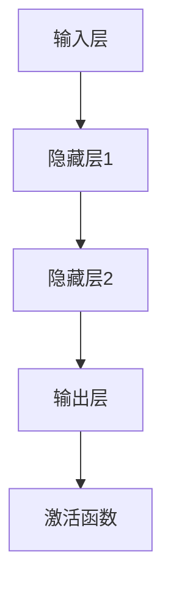

                 

关键词：神经网络、深度学习、机器学习、人工智能、智能算法

> 摘要：本文将深入探讨神经网络的核心概念、算法原理、数学模型以及实际应用场景，旨在为读者全面揭示神经网络在人工智能领域的重要地位及其未来的发展趋势。

## 1. 背景介绍

### 1.1 神经网络的起源

神经网络（Neural Networks）起源于20世纪40年代，由心理学家和数学家共同提出。他们受到生物神经系统的启发，尝试构建一种能够模拟人类大脑功能的计算模型。神经网络最初的设计初衷是模仿人脑的神经网络结构，通过大量神经元之间的连接进行信息处理。

### 1.2 人工智能的兴起

随着计算机技术的发展，人工智能（Artificial Intelligence, AI）逐渐成为一个独立的研究领域。20世纪50年代，人工智能领域开始兴起，神经网络作为一种重要的算法模型，受到广泛关注。随着计算能力的提升和数据量的增加，神经网络的应用领域也逐渐扩大。

### 1.3 神经网络的发展历程

从最初的感知机（Perceptron）到多层感知机（Multilayer Perceptron, MLP），再到深度神经网络（Deep Neural Networks, DNN），神经网络经历了多个阶段的发展。深度学习（Deep Learning）的兴起，标志着神经网络在人工智能领域的重大突破。

## 2. 核心概念与联系

### 2.1 神经元

神经元是神经网络的基本单元，类似于生物神经系统的神经元。神经元通过输入层、隐藏层和输出层进行信息传递和处理。

### 2.2 连接权重

神经元之间的连接具有权重，这些权重决定了信息传递的强度。通过学习算法，神经网络的权重会不断调整，以实现更准确的预测和分类。

### 2.3 激活函数

激活函数用于确定神经元是否被激活。常见的激活函数包括Sigmoid函数、ReLU函数和Tanh函数。

### 2.4 学习算法

学习算法是神经网络的核心，用于调整神经元之间的连接权重。常用的学习算法包括梯度下降法、随机梯度下降法、批量梯度下降法等。

### 2.5 Mermaid 流程图



## 3. 核心算法原理 & 具体操作步骤

### 3.1 算法原理概述

神经网络通过多层神经元之间的连接进行信息传递和处理。输入层接收外部信息，隐藏层对信息进行加工，输出层产生预测或分类结果。学习算法通过不断调整连接权重，使神经网络能够更好地拟合训练数据。

### 3.2 算法步骤详解

1. 初始化权重和偏置
2. 前向传播：计算输入层到输出层的激活值
3. 计算损失函数：评估预测结果与实际结果之间的差距
4. 反向传播：根据损失函数计算梯度，更新连接权重
5. 重复步骤2-4，直到达到预设的迭代次数或收敛条件

### 3.3 算法优缺点

**优点：**
- 强大的非线性建模能力
- 能够处理大规模数据和复杂任务
- 自动学习特征，减少人工干预

**缺点：**
- 计算资源消耗大，训练时间长
- 对数据质量和预处理要求高
- 难以解释和理解

### 3.4 算法应用领域

神经网络在图像识别、语音识别、自然语言处理、推荐系统、自动驾驶等领域具有广泛的应用。

## 4. 数学模型和公式 & 详细讲解 & 举例说明

### 4.1 数学模型构建

神经网络可以表示为一个函数 \( f \)：

\[ f(x) = \sigma(\boldsymbol{W}^T \cdot \boldsymbol{a}^{[l-1]} + \boldsymbol{b}^{[l]}) \]

其中，\( \sigma \) 是激活函数，\( \boldsymbol{W} \) 是权重矩阵，\( \boldsymbol{a}^{[l-1]} \) 是前一层激活值，\( \boldsymbol{b} \) 是偏置向量。

### 4.2 公式推导过程

假设有一个二分类问题，输出层只有一个神经元。激活函数使用Sigmoid函数：

\[ \sigma(z) = \frac{1}{1 + e^{-z}} \]

损失函数使用交叉熵损失函数：

\[ J(\theta) = -\frac{1}{m} \sum_{i=1}^{m} [y^{(i)} \log(a^{[2](i)}) + (1 - y^{(i)}) \log(1 - a^{[2](i)})] \]

其中，\( m \) 是样本数量，\( y^{(i)} \) 是真实标签，\( a^{[2](i)} \) 是输出层的激活值。

### 4.3 案例分析与讲解

假设有一个简单的神经网络，输入层有2个神经元，隐藏层有3个神经元，输出层有1个神经元。激活函数使用ReLU函数。训练数据包含100个样本，每个样本有2个特征。

1. 初始化权重和偏置
2. 前向传播：
   - 输入层到隐藏层的激活值：\( a^{[1](i)} = \max(0, z^{[1](i)}) \)
   - 隐藏层到输出层的激活值：\( a^{[2](i)} = \max(0, z^{[2](i)}) \)
3. 计算损失函数：
   - \( J(\theta) = -\frac{1}{100} \sum_{i=1}^{100} [y^{(i)} \log(a^{[2](i)}) + (1 - y^{(i)}) \log(1 - a^{[2](i)})] \)
4. 反向传播：
   - 计算输出层梯度：
     \[ \frac{\partial J}{\partial \boldsymbol{W}^{[2]}} = \frac{1}{100} \sum_{i=1}^{100} a^{[1](i)}(1 - a^{[1](i)}) \cdot (a^{[2](i)} - y^{(i)}) \]
     \[ \frac{\partial J}{\partial \boldsymbol{b}^{[2]}} = \frac{1}{100} \sum_{i=1}^{100} (a^{[2](i)} - y^{(i)}) \]
   - 计算隐藏层梯度：
     \[ \frac{\partial J}{\partial \boldsymbol{W}^{[1]}} = \frac{1}{100} \sum_{i=1}^{100} z^{[1](i)}(1 - z^{[1](i)}) \cdot (\frac{\partial J}{\partial \boldsymbol{W}^{[2]}} \cdot \boldsymbol{a}^{[2](i)}) \]
     \[ \frac{\partial J}{\partial \boldsymbol{b}^{[1]}} = \frac{1}{100} \sum_{i=1}^{100} z^{[1](i)}(1 - z^{[1](i)}) \cdot \frac{\partial J}{\partial \boldsymbol{b}^{[2]}} \]

5. 更新权重和偏置：
   - \( \boldsymbol{W}^{[2]} = \boldsymbol{W}^{[2]} - \alpha \cdot \frac{1}{100} \sum_{i=1}^{100} a^{[1](i)}(1 - a^{[1](i)}) \cdot (a^{[2](i)} - y^{(i)}) \)
   - \( \boldsymbol{b}^{[2]} = \boldsymbol{b}^{[2]} - \alpha \cdot \frac{1}{100} \sum_{i=1}^{100} (a^{[2](i)} - y^{(i)}) \)
   - \( \boldsymbol{W}^{[1]} = \boldsymbol{W}^{[1]} - \alpha \cdot \frac{1}{100} \sum_{i=1}^{100} z^{[1](i)}(1 - z^{[1](i)}) \cdot (\frac{\partial J}{\partial \boldsymbol{W}^{[2]}} \cdot \boldsymbol{a}^{[2](i)}) \)
   - \( \boldsymbol{b}^{[1]} = \boldsymbol{b}^{[1]} - \alpha \cdot \frac{1}{100} \sum_{i=1}^{100} z^{[1](i)}(1 - z^{[1](i)}) \cdot \frac{\partial J}{\partial \boldsymbol{b}^{[2]}} \)

## 5. 项目实践：代码实例和详细解释说明

### 5.1 开发环境搭建

在本例中，我们使用Python语言和TensorFlow库搭建神经网络。请确保已经安装了Python和TensorFlow。

### 5.2 源代码详细实现

```python
import tensorflow as tf

# 初始化权重和偏置
W1 = tf.random.normal([2, 3])
b1 = tf.random.normal([3])
W2 = tf.random.normal([3, 1])
b2 = tf.random.normal([1])

# 定义激活函数
sigmoid = lambda x: 1 / (1 + tf.exp(-x))

# 定义神经网络模型
def neural_network(x):
    a1 = sigmoid(tf.matmul(x, W1) + b1)
    a2 = sigmoid(tf.matmul(a1, W2) + b2)
    return a2

# 训练数据
x_train = tf.random.normal([100, 2])
y_train = tf.random.normal([100, 1])

# 训练过程
for i in range(1000):
    with tf.GradientTape() as tape:
        a2 = neural_network(x_train)
        loss = tf.reduce_mean(tf.nn.sigmoid_cross_entropy_with_logits(labels=y_train, logits=a2))
    grads = tape.gradient(loss, [W1, b1, W2, b2])
    W1.assign_sub(0.01 * grads[0])
    b1.assign_sub(0.01 * grads[1])
    W2.assign_sub(0.01 * grads[2])
    b2.assign_sub(0.01 * grads[3])

# 运行结果展示
a2 = neural_network(x_train)
print(a2)
```

### 5.3 代码解读与分析

1. 导入所需的库和模块
2. 初始化权重和偏置
3. 定义激活函数
4. 定义神经网络模型
5. 准备训练数据
6. 定义训练过程，包括前向传播、损失函数计算和反向传播
7. 运行结果展示

## 6. 实际应用场景

### 6.1 图像识别

神经网络在图像识别领域取得了巨大的成功。通过训练大量的图像数据，神经网络可以学会识别各种物体和场景。例如，人脸识别、物体分类、图像分割等。

### 6.2 语音识别

神经网络在语音识别领域也有着广泛的应用。通过训练语音数据和文本数据，神经网络可以学会将语音信号转换为文本。这一技术在智能语音助手、实时字幕等领域有着重要的应用价值。

### 6.3 自然语言处理

神经网络在自然语言处理（Natural Language Processing, NLP）领域也有着重要的应用。通过训练大量的文本数据，神经网络可以学会语言模型、词向量表示、情感分析等任务。

### 6.4 自动驾驶

神经网络在自动驾驶领域也有着广泛的应用。通过训练大量的道路数据和驾驶数据，神经网络可以学会识别交通标志、行人检测、车道线检测等任务，从而实现自动驾驶。

## 7. 工具和资源推荐

### 7.1 学习资源推荐

- 《深度学习》（Deep Learning） by Ian Goodfellow、Yoshua Bengio 和 Aaron Courville
- 《神经网络与深度学习》（Neural Networks and Deep Learning） by邱锡鹏

### 7.2 开发工具推荐

- TensorFlow
- PyTorch
- Keras

### 7.3 相关论文推荐

- “A Learning Algorithm for Continually Running Fully Recurrent Neural Networks” by John Hopfield
- “Learning representations by maximizing mutual information across views” by Yarin Gal and Zohar Kohon

## 8. 总结：未来发展趋势与挑战

### 8.1 研究成果总结

神经网络在人工智能领域取得了显著的成果，广泛应用于图像识别、语音识别、自然语言处理、自动驾驶等领域。随着计算能力的提升和算法的优化，神经网络的性能和效率不断提升。

### 8.2 未来发展趋势

1. 深度神经网络的优化和改进
2. 神经网络与其他算法的融合
3. 神经网络的解释性和可解释性
4. 神经网络在边缘计算和移动设备中的应用

### 8.3 面临的挑战

1. 计算资源消耗
2. 数据质量和预处理
3. 神经网络的可解释性
4. 神经网络的过拟合和泛化能力

### 8.4 研究展望

随着人工智能技术的不断发展，神经网络将在更多领域发挥重要作用。未来，神经网络的研究将聚焦于性能优化、可解释性、应用拓展等方面，为人工智能的发展做出更大贡献。

## 9. 附录：常见问题与解答

### 9.1 什么是神经网络？

神经网络是一种通过模拟人脑神经网络结构进行信息处理和学习的计算模型。

### 9.2 神经网络是如何学习的？

神经网络通过学习输入和输出之间的映射关系，不断调整神经元之间的连接权重，从而实现预测和分类。

### 9.3 神经网络有哪些优缺点？

神经网络具有强大的非线性建模能力、自动学习特征等优点，但计算资源消耗大、对数据质量要求高、难以解释和理解等缺点。

### 9.4 神经网络在哪些领域有应用？

神经网络在图像识别、语音识别、自然语言处理、自动驾驶等领域有广泛应用。

### 9.5 如何优化神经网络性能？

可以通过调整学习算法、优化网络结构、增加训练数据等方式来优化神经网络性能。

### 9.6 神经网络是否能够取代人类智能？

目前来看，神经网络虽然在特定领域取得了显著成果，但仍然无法完全取代人类智能。人类智能具有创造力、情感、道德判断等多方面优势。

---

作者：禅与计算机程序设计艺术 / Zen and the Art of Computer Programming

