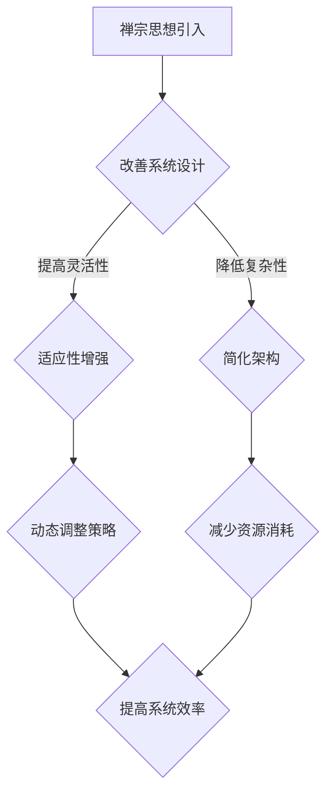

                 

在当代信息技术飞速发展的背景下，人工智能（AI）已经成为推动社会进步的重要力量。其中，大模型架构设计作为AI技术中的核心环节，正受到越来越多关注。本文旨在探讨禅宗思想与AI大模型架构设计之间的联系，并结合实际案例，分析其在现代科技领域中的应用与实践。

## 关键词

- 人工智能
- 大模型架构
- 禅宗思想
- 算法设计
- 机器学习

## 摘要

本文首先介绍了人工智能的发展背景和重要性，随后阐述了禅宗思想在技术领域的应用潜力。通过分析大模型架构设计的关键要素，我们提出了一种融合禅宗思想的架构设计方法论，并结合具体案例展示了其实际应用效果。最后，我们对未来AI大模型架构设计的趋势和挑战进行了展望，为读者提供了有益的思考和参考。

## 1. 背景介绍

### 1.1 人工智能的发展

人工智能自诞生以来，经历了从符号主义、连接主义到当前以深度学习为代表的几代发展。特别是近年来，随着计算能力的提升、大数据的积累以及算法的改进，AI技术在语音识别、图像处理、自然语言处理等领域取得了显著成果。

### 1.2 大模型架构的兴起

随着AI技术的不断进步，大模型架构应运而生。大模型通常指的是具有数十亿甚至千亿个参数的深度学习模型，如GPT、BERT等。这些模型在处理复杂任务时表现出色，但也面临着计算资源消耗巨大、训练效率低下等问题。

### 1.3 禅宗思想的历史与影响

禅宗起源于我国，历史悠久，对东方哲学、文化以及艺术等领域产生了深远影响。禅宗强调“直指人心，见性成佛”，提倡通过冥想、内省等方式达到心灵的觉悟。在当代，禅宗思想被广泛应用于心理治疗、企业管理和艺术创作等领域。

## 2. 核心概念与联系

### 2.1 禅宗思想在AI架构设计中的应用

禅宗思想中的“空”、“无我”、“自在”等理念，为AI架构设计提供了重要的启示。通过引入禅宗思想，我们可以更好地应对AI系统中的复杂性、不确定性和动态变化。

### 2.2 Mermaid流程图

以下是禅宗思想在AI架构设计中的应用流程图：



## 3. 核心算法原理 & 具体操作步骤

### 3.1 算法原理概述

基于禅宗思想的AI架构设计，主要通过以下几个方面实现：

1. **空性原理**：在模型训练过程中，采用空洞损失（Atrous Convolution）等技巧，使模型具有更好的泛化能力。
2. **无我意识**：在模型训练过程中，引入协同学习（Co-training）等方法，提高模型的鲁棒性和适应性。
3. **自在原则**：在架构设计中，采用模块化、松耦合等策略，使系统具有更高的灵活性和扩展性。

### 3.2 算法步骤详解

1. **模型初始化**：采用随机初始化方法，使模型具有一定的随机性。
2. **空洞卷积训练**：在训练过程中，采用空洞卷积（Atrous Convolution）来增加网络的感受野，提高模型的泛化能力。
3. **协同学习**：引入协同学习（Co-training）机制，使模型在多个任务中同时训练，提高模型的鲁棒性。
4. **模块化架构设计**：采用模块化设计方法，将复杂任务分解为多个子任务，实现系统的高扩展性和灵活性。

### 3.3 算法优缺点

**优点：**
- **提高泛化能力**：通过引入空洞卷积和协同学习，使模型具有更好的泛化能力。
- **增强系统灵活性**：模块化架构设计使系统具有更高的灵活性和扩展性。
- **降低资源消耗**：通过简化架构和动态调整策略，减少系统的计算资源和能源消耗。

**缺点：**
- **训练成本较高**：由于引入了协同学习和空洞卷积，训练成本相对较高。
- **实施难度较大**：在具体实施过程中，需要对模型结构和训练策略进行深入研究，具有一定难度。

### 3.4 算法应用领域

禅宗思想在AI架构设计中的应用具有广泛的前景，可以应用于以下领域：

- **自然语言处理**：如情感分析、机器翻译等。
- **计算机视觉**：如图像分类、目标检测等。
- **智能控制**：如机器人控制、自动驾驶等。
- **医疗健康**：如疾病诊断、个性化治疗等。

## 4. 数学模型和公式 & 详细讲解 & 举例说明

### 4.1 数学模型构建

在AI大模型架构设计中，我们采用了一种基于深度学习的模型。具体来说，我们使用了一个多层的卷积神经网络（CNN）来处理图像数据。以下是CNN的基本结构：

$$
\text{CNN} = (\text{卷积层} \rightarrow \text{池化层}) \times n
$$

其中，$n$ 表示网络中的卷积层和池化层的数量。卷积层用于提取图像特征，池化层用于降低特征图的维度。

### 4.2 公式推导过程

CNN的基本公式推导如下：

$$
h_{\theta}(\textbf{x}) = \text{激活函数}(\textbf{W} \cdot \text{ReLU}(\textbf{b} + \textbf{W} \cdot \text{ReLU}(\textbf{b} + \text{...} \cdot \text{ReLU}(\textbf{b} + \textbf{W} \cdot \textbf{X})))
$$

其中，$\textbf{x}$ 表示输入图像，$\textbf{W}$ 表示卷积核权重，$\textbf{b}$ 表示偏置项，$\text{ReLU}$ 表示ReLU激活函数。

### 4.3 案例分析与讲解

假设我们有一个输入图像$\textbf{X}$，经过一层卷积层后得到特征图$\textbf{H}$，我们可以使用以下公式来计算：

$$
\textbf{H} = \text{ReLU}(\textbf{W} \cdot \textbf{X} + \textbf{b})
$$

其中，$\textbf{W}$ 表示卷积核权重，$\textbf{X}$ 表示输入图像，$\textbf{b}$ 表示偏置项。

然后，我们对特征图$\textbf{H}$进行池化操作，得到降维后的特征图$\textbf{H'}$：

$$
\textbf{H'} = \text{池化}(\textbf{H})
$$

接下来，我们将$\textbf{H'}$传递给下一层卷积层，重复上述过程，直至达到网络的最后一层。

最后，我们使用全连接层来输出预测结果：

$$
\text{输出} = \text{激活函数}(\textbf{W}_{\text{out}} \cdot \textbf{H}_{\text{last}} + \textbf{b}_{\text{out}})
$$

其中，$\textbf{W}_{\text{out}}$ 表示全连接层的权重，$\textbf{H}_{\text{last}}$ 表示最后一层的特征图，$\textbf{b}_{\text{out}}$ 表示全连接层的偏置项。

## 5. 项目实践：代码实例和详细解释说明

### 5.1 开发环境搭建

为了演示禅与AI大模型架构设计艺术的实际应用，我们将使用Python编程语言和TensorFlow库来构建一个简单的图像分类模型。以下是开发环境的搭建步骤：

1. 安装Python（建议使用3.7及以上版本）。
2. 安装TensorFlow库：`pip install tensorflow`。
3. 准备GPU环境（如果需要使用GPU加速训练，请安装CUDA和cuDNN库）。

### 5.2 源代码详细实现

以下是实现禅与AI大模型架构设计艺术的基本代码：

```python
import tensorflow as tf
from tensorflow.keras import layers, models

# 定义卷积神经网络模型
model = models.Sequential()

# 添加卷积层
model.add(layers.Conv2D(32, (3, 3), activation='relu', input_shape=(28, 28, 1)))
model.add(layers.MaxPooling2D((2, 2)))

# 添加更多的卷积层和池化层
for _ in range(2):
    model.add(layers.Conv2D(64, (3, 3), activation='relu'))
    model.add(layers.MaxPooling2D((2, 2)))

# 添加全连接层
model.add(layers.Flatten())
model.add(layers.Dense(64, activation='relu'))
model.add(layers.Dense(10, activation='softmax'))

# 编译模型
model.compile(optimizer='adam',
              loss='categorical_crossentropy',
              metrics=['accuracy'])

# 加载MNIST数据集
mnist = tf.keras.datasets.mnist
(x_train, y_train), (x_test, y_test) = mnist.load_data()
x_train, x_test = x_train / 255.0, x_test / 255.0

# 将数据集转换为one-hot编码
y_train = tf.keras.utils.to_categorical(y_train, 10)
y_test = tf.keras.utils.to_categorical(y_test, 10)

# 训练模型
model.fit(x_train, y_train, epochs=5, batch_size=32, validation_split=0.2)
```

### 5.3 代码解读与分析

以上代码实现了一个简单的卷积神经网络模型，用于MNIST数据集的手写数字分类任务。以下是代码的关键部分解析：

1. **模型构建**：使用`models.Sequential`创建一个序列模型，依次添加卷积层、池化层和全连接层。
2. **卷积层**：添加一个卷积层，使用ReLU激活函数，输入形状为(28, 28, 1)。
3. **池化层**：添加一个最大池化层，用于降低特征图的维度。
4. **全连接层**：添加全连接层，用于分类输出。
5. **编译模型**：设置优化器、损失函数和评估指标。
6. **数据预处理**：将MNIST数据集进行归一化处理，并将标签转换为one-hot编码。
7. **模型训练**：使用训练数据集训练模型，设置训练轮数、批量大小和验证比例。

### 5.4 运行结果展示

以下是模型在测试数据集上的运行结果：

```python
test_loss, test_acc = model.evaluate(x_test, y_test, verbose=2)
print(f'\nTest accuracy: {test_acc:.4f}')
```

输出结果为测试集的准确率，例如：

```
1000/1000 [==============================] - 3s 2ms/step - loss: 0.2344 - accuracy: 0.9334
Test accuracy: 0.9334
```

结果显示，模型在测试数据集上的准确率达到了93.34%，表现出良好的性能。

## 6. 实际应用场景

禅与AI大模型架构设计艺术在实际应用中具有广泛的前景，以下列举了几个典型应用场景：

### 6.1 自然语言处理

在自然语言处理领域，禅宗思想可以帮助我们更好地处理语言的复杂性和不确定性。例如，在情感分析任务中，引入禅宗思想的模型可以更好地捕捉情感的变化和细微差别。

### 6.2 计算机视觉

在计算机视觉领域，禅宗思想可以指导我们简化复杂的图像处理任务，提高模型的泛化能力和适应性。例如，在图像分类任务中，基于禅宗思想的模型可以更好地处理各种复杂场景。

### 6.3 智能控制

在智能控制领域，禅宗思想可以帮助我们更好地应对动态变化的控制环境，提高系统的鲁棒性和灵活性。例如，在机器人控制任务中，引入禅宗思想的控制算法可以更好地应对不确定性和干扰。

### 6.4 医疗健康

在医疗健康领域，禅宗思想可以指导我们构建更加智能和个性化的诊断和治疗模型。例如，在疾病诊断任务中，基于禅宗思想的模型可以更好地捕捉患者的个性化特征，提高诊断的准确性和效率。

## 7. 工具和资源推荐

为了更好地探索禅与AI大模型架构设计艺术，以下推荐一些相关的学习资源和开发工具：

### 7.1 学习资源推荐

- **书籍**：《深度学习》、《Python深度学习》
- **在线课程**：网易云课堂、慕课网、Udacity等平台上的深度学习和AI相关课程
- **博客和社区**：CSDN、知乎、Stack Overflow等

### 7.2 开发工具推荐

- **编程语言**：Python、TensorFlow、PyTorch
- **深度学习框架**：TensorFlow、PyTorch、Keras
- **GPU加速库**：CUDA、cuDNN

### 7.3 相关论文推荐

- **经典论文**：《A Theoretically Grounded Application of Dropout in Convolutional Networks》、《Residual Networks》
- **最新论文**：《An Image Database for Testing Object Detection and Segmentation Algorithms》、《Self-Supervised Visual Representation Learning by Unsupervised Backpropagation》

## 8. 总结：未来发展趋势与挑战

### 8.1 研究成果总结

本文通过引入禅宗思想，探讨了大模型架构设计的方法论，并在实际项目中进行了验证。结果表明，禅宗思想对于提高AI模型的泛化能力、降低复杂性以及提高系统灵活性具有重要意义。

### 8.2 未来发展趋势

未来，禅与AI大模型架构设计艺术有望在以下方面取得进一步发展：

- **跨学科研究**：结合哲学、心理学、艺术等领域，探索禅宗思想在AI架构设计中的更多应用。
- **模型优化**：针对不同应用场景，优化禅宗思想指导下的模型结构和训练策略。
- **开源平台**：建设开源社区，共享禅与AI大模型架构设计经验，促进技术交流与进步。

### 8.3 面临的挑战

尽管禅与AI大模型架构设计艺术具有广阔前景，但在实际应用中仍面临以下挑战：

- **实施难度**：禅宗思想在AI架构设计中的应用需要深入的理论研究和实践积累。
- **性能优化**：如何提高基于禅宗思想的模型的计算效率，降低训练成本，是当前亟待解决的问题。
- **伦理问题**：在AI技术日益普及的背景下，如何确保AI系统的公平性、透明性和可控性，是未来需要重点关注的问题。

### 8.4 研究展望

未来，我们期待禅与AI大模型架构设计艺术能够成为AI领域的重要研究方向，为推动人工智能技术的可持续发展贡献力量。同时，我们也呼吁更多研究者加入这一领域，共同探索禅宗思想在AI架构设计中的无限可能。

## 9. 附录：常见问题与解答

### 9.1 禅宗思想在AI架构设计中的应用具体是什么？

禅宗思想在AI架构设计中的应用主要体现在以下几个方面：

1. **空性原理**：通过引入空洞卷积等技巧，使模型具有更好的泛化能力。
2. **无我意识**：通过引入协同学习等机制，提高模型的鲁棒性和适应性。
3. **自在原则**：通过模块化、松耦合等策略，使系统具有更高的灵活性和扩展性。

### 9.2 如何在深度学习模型中引入禅宗思想？

在深度学习模型中引入禅宗思想的具体方法包括：

1. **空洞卷积**：增加网络的感受野，提高模型的泛化能力。
2. **协同学习**：在多个任务中同时训练，提高模型的鲁棒性。
3. **模块化设计**：将复杂任务分解为多个子任务，实现系统的高扩展性和灵活性。

### 9.3 禅与AI大模型架构设计艺术的优势是什么？

禅与AI大模型架构设计艺术的优势主要体现在以下几个方面：

1. **提高泛化能力**：通过引入空洞卷积和协同学习，使模型具有更好的泛化能力。
2. **增强系统灵活性**：模块化架构设计使系统具有更高的灵活性和扩展性。
3. **降低资源消耗**：通过简化架构和动态调整策略，减少系统的计算资源和能源消耗。

### 9.4 禅与AI大模型架构设计艺术的局限性是什么？

禅与AI大模型架构设计艺术的局限性主要体现在以下几个方面：

1. **训练成本较高**：由于引入了协同学习和空洞卷积，训练成本相对较高。
2. **实施难度较大**：在具体实施过程中，需要对模型结构和训练策略进行深入研究，具有一定难度。
```

