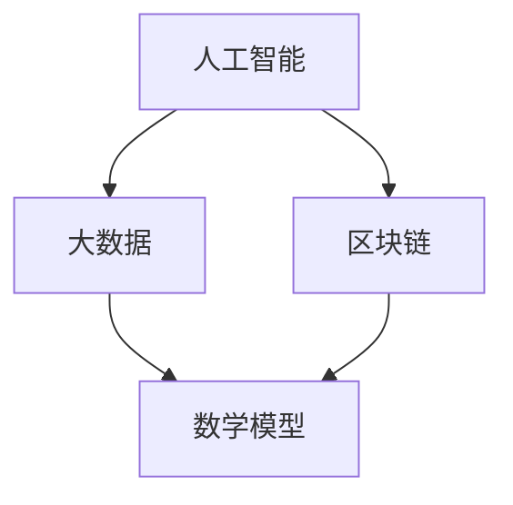

                 

关键词：社会治理，科技创新，人工智能，算法，数学模型，项目实践，未来展望

> 摘要：本文旨在探讨科技创新在社会治理中的应用，通过分析核心概念与联系、核心算法原理、数学模型与公式、项目实践以及未来展望，揭示科技创新如何为社会治理带来新思路、新方法和新工具，助力构建更加高效、智能和公平的社会治理体系。

## 1. 背景介绍

在现代社会，随着信息化和数字化的发展，社会治理面临着前所未有的挑战和机遇。传统的治理模式已经难以满足日益复杂的社会问题，如城市拥堵、环境污染、公共安全、社会不公等。这些问题的复杂性、动态性和不确定性，要求社会治理必须具备更高的智能化、精准化和灵活性。而科技创新，特别是人工智能、大数据、区块链等技术的发展，为社会治理提供了新的工具和方法。

科技创新对社会治理的影响主要体现在以下几个方面：

1. **数据驱动的决策**：大数据和人工智能技术可以处理和分析海量数据，帮助政府更准确地了解社会状况，优化资源配置，制定更加科学的决策。

2. **智能化服务**：人工智能技术可以自动化、个性化地提供服务，提高公共服务效率，满足人民群众的多元化需求。

3. **透明化治理**：区块链等去中心化技术可以提高治理过程的透明度，防止腐败和权力滥用。

4. **预测与预警**：通过数据分析和预测模型，可以提前发现潜在的社会问题，采取措施防止问题的发生或扩大。

本文将围绕科技创新对社会治理的影响，探讨核心概念与联系、核心算法原理、数学模型与公式、项目实践以及未来展望，为社会治理提供新的思路和方法。

## 2. 核心概念与联系

为了更好地理解科技创新对社会治理的影响，我们需要明确一些核心概念和它们之间的联系。

### 2.1. 人工智能（AI）

人工智能是一种模拟人类智能的技术，能够感知、学习、推理和决策。它包括机器学习、深度学习、自然语言处理、计算机视觉等多个子领域。

### 2.2. 大数据（Big Data）

大数据是指无法用传统数据库工具进行捕捉、管理和处理的海量数据。大数据技术可以对这些数据进行存储、处理和分析，从中提取有价值的信息。

### 2.3. 区块链（Blockchain）

区块链是一种分布式数据库技术，通过加密算法确保数据的不可篡改性和透明性。区块链可以用于记录交易、资产转移、身份验证等多种应用。

### 2.4. 数学模型（Mathematical Model）

数学模型是一种描述现实世界问题的数学表达式或算法。它可以用来预测、优化和决策，是科技创新的重要组成部分。

### 2.5. 流程图（Flowchart）

流程图是一种用图形表示系统或过程的工具，可以帮助我们更清晰地理解各个环节之间的关系和流程。

下面是一个用Mermaid绘制的简单流程图，展示了核心概念之间的联系：



在这个流程图中，人工智能、大数据、区块链和数学模型相互关联，共同构成了科技创新的核心体系。通过这些技术的结合，我们可以实现更高效、智能和透明的社会治理。

## 3. 核心算法原理 & 具体操作步骤

### 3.1  算法原理概述

在本节中，我们将探讨一些核心算法原理及其在社会治理中的应用。

### 3.1.1  机器学习算法（Machine Learning）

机器学习算法是人工智能的一个重要分支，它通过数据训练模型，使其能够自动识别模式、做出预测和决策。在社会治理中，机器学习算法可以用于以下几个方面：

- **犯罪预测与预防**：通过分析历史犯罪数据，机器学习算法可以预测哪些地区可能发生犯罪，并提前采取预防措施。
- **公共卫生监控**：利用机器学习算法，可以实时监测疫情数据，预测疫情的传播趋势，为公共卫生决策提供支持。
- **交通流量优化**：通过分析交通数据，机器学习算法可以预测交通流量，优化交通信号灯，减少拥堵。

### 3.1.2  深度学习算法（Deep Learning）

深度学习算法是机器学习的一个子领域，它通过多层神经网络模拟人脑处理信息的方式。在社会治理中，深度学习算法可以用于以下几个方面：

- **图像识别**：通过训练深度学习模型，可以实现人脸识别、车辆识别等应用，提高公共安全。
- **语音识别**：深度学习算法可以用于语音识别，提高语音助手、智能客服等服务的准确性。
- **情感分析**：通过分析社交媒体上的用户评论，深度学习算法可以了解公众的情绪和需求，为政策制定提供参考。

### 3.1.3  自然语言处理（Natural Language Processing）

自然语言处理是人工智能的一个分支，它致力于让计算机理解和生成自然语言。在社会治理中，自然语言处理可以用于以下几个方面：

- **政策分析**：通过分析政策文本，自然语言处理算法可以提取关键信息，为政策制定提供支持。
- **舆情监控**：通过监控社交媒体上的言论，自然语言处理算法可以了解公众对某一事件或政策的看法，为决策提供参考。
- **智能客服**：自然语言处理算法可以用于智能客服系统，提高服务质量。

### 3.2  算法步骤详解

为了更好地理解上述算法的原理和应用，下面我们简要介绍这些算法的具体步骤。

### 3.2.1  机器学习算法步骤

1. **数据收集**：收集用于训练的数据集。
2. **数据预处理**：对数据进行清洗、归一化等处理，使其适合模型训练。
3. **模型选择**：选择合适的机器学习模型，如线性回归、决策树、神经网络等。
4. **模型训练**：使用训练数据集训练模型，调整模型参数。
5. **模型评估**：使用测试数据集评估模型性能，调整模型参数，重复训练过程。
6. **模型应用**：将训练好的模型应用到实际场景中，如犯罪预测、交通流量优化等。

### 3.2.2  深度学习算法步骤

1. **数据收集**：收集用于训练的数据集。
2. **数据预处理**：对数据进行清洗、归一化等处理，使其适合模型训练。
3. **模型设计**：设计深度学习模型结构，如卷积神经网络（CNN）、循环神经网络（RNN）等。
4. **模型训练**：使用训练数据集训练模型，调整模型参数。
5. **模型评估**：使用测试数据集评估模型性能，调整模型参数，重复训练过程。
6. **模型应用**：将训练好的模型应用到实际场景中，如图像识别、语音识别等。

### 3.2.3  自然语言处理算法步骤

1. **数据收集**：收集用于训练的数据集。
2. **数据预处理**：对数据进行清洗、分词、词向量化等处理，使其适合模型训练。
3. **模型选择**：选择合适的自然语言处理模型，如词袋模型、递归神经网络（RNN）、Transformer等。
4. **模型训练**：使用训练数据集训练模型，调整模型参数。
5. **模型评估**：使用测试数据集评估模型性能，调整模型参数，重复训练过程。
6. **模型应用**：将训练好的模型应用到实际场景中，如政策分析、舆情监控等。

### 3.3  算法优缺点

每种算法都有其优缺点，以下是对几种主要算法的优缺点进行简要总结。

### 3.3.1  机器学习算法优缺点

**优点**：

- **泛化能力强**：通过学习大量数据，机器学习算法能够很好地适应新数据，泛化能力强。
- **灵活性强**：机器学习算法可以针对不同的数据类型和应用场景进行调整。

**缺点**：

- **对数据质量要求高**：如果数据质量较差，机器学习算法的性能可能会受到很大影响。
- **模型解释性较差**：机器学习模型的内部决策过程较为复杂，难以解释。

### 3.3.2  深度学习算法优缺点

**优点**：

- **计算能力强大**：深度学习算法利用并行计算和大规模数据集，可以处理复杂的任务。
- **图像和语音识别效果优秀**：在图像和语音识别等领域，深度学习算法表现出了卓越的性能。

**缺点**：

- **计算资源消耗大**：深度学习算法需要大量的计算资源和时间。
- **数据标注成本高**：深度学习算法的训练需要大量标注数据，数据标注成本较高。

### 3.3.3  自然语言处理算法优缺点

**优点**：

- **处理自然语言能力强**：自然语言处理算法可以处理自然语言中的语法、语义、情感等复杂信息。
- **应用广泛**：自然语言处理算法在政策分析、舆情监控、智能客服等领域有广泛的应用。

**缺点**：

- **模型解释性较差**：自然语言处理模型的内部决策过程较为复杂，难以解释。
- **对数据依赖性强**：自然语言处理算法的训练需要大量数据，数据质量和数量直接影响模型性能。

### 3.4  算法应用领域

各种算法在不同领域有着广泛的应用，以下是一些典型的应用场景。

### 3.4.1  机器学习算法应用领域

- **金融**：信用评分、欺诈检测、投资组合优化等。
- **医疗**：疾病预测、药物研发、患者监护等。
- **交通**：交通流量预测、路线规划、自动驾驶等。

### 3.4.2  深度学习算法应用领域

- **计算机视觉**：人脸识别、图像分类、物体检测等。
- **语音识别**：语音识别、语音合成、语音翻译等。
- **自然语言处理**：文本分类、机器翻译、情感分析等。

### 3.4.3  自然语言处理算法应用领域

- **舆情监控**：社交媒体分析、新闻摘要、公众情绪监测等。
- **智能客服**：自动问答、智能客服机器人、语音识别等。
- **法律**：法律文本分析、合同审核、案件预测等。

通过上述算法的应用，我们可以看到科技创新如何为社会治理带来了新的工具和方法，提高了治理效率、透明度和智能化水平。

## 4. 数学模型和公式 & 详细讲解 & 举例说明

数学模型和公式是科技创新的核心组成部分，它们帮助我们理解和解决问题。在本节中，我们将介绍一些常见的数学模型和公式，并详细讲解其应用和推导过程。

### 4.1  数学模型构建

数学模型通常包括以下步骤：

1. **定义问题**：明确需要解决的问题。
2. **建立假设**：根据问题的特点，做出合理的假设。
3. **数学表达**：将问题转化为数学形式，通常包括方程、不等式、函数等。
4. **求解模型**：使用数学方法求解模型，得到问题的解。

### 4.2  公式推导过程

以下是一个简单的数学模型的推导过程：

#### 4.2.1  回归分析模型

假设我们有一个简单的线性回归模型：

$$
y = \beta_0 + \beta_1 x + \epsilon
$$

其中，$y$ 是因变量，$x$ 是自变量，$\beta_0$ 和 $\beta_1$ 是模型的参数，$\epsilon$ 是误差项。

为了求解 $\beta_0$ 和 $\beta_1$，我们可以使用最小二乘法。首先，计算每个观测值的残差：

$$
r_i = y_i - (\beta_0 + \beta_1 x_i)
$$

然后，求残差的平方和：

$$
S = \sum_{i=1}^{n} r_i^2
$$

最小化 $S$，我们可以得到 $\beta_0$ 和 $\beta_1$ 的最优值：

$$
\beta_0 = \frac{\sum_{i=1}^{n} y_i - \beta_1 \sum_{i=1}^{n} x_i}{n}
$$

$$
\beta_1 = \frac{\sum_{i=1}^{n} (y_i - \beta_0 - \beta_1 x_i) x_i}{\sum_{i=1}^{n} x_i^2}
$$

#### 4.2.2  时间序列模型

时间序列模型用于分析时间序列数据，常见的模型有 ARIMA、AR、MA、ARMA 等。以下是 ARIMA 模型的推导过程：

1. **差分**：对时间序列进行差分，使其成为平稳序列。
2. **自回归**：建立自回归模型，表示当前值与过去值的线性关系。
3. **移动平均**：建立移动平均模型，表示当前值与未来值的线性关系。
4. **结合**：将自回归和移动平均模型结合，得到 ARIMA 模型。

ARIMA 模型的数学表达式为：

$$
y_t = c + \phi_1 y_{t-1} + \phi_2 y_{t-2} + \cdots + \phi_p y_{t-p} + \theta_1 \epsilon_{t-1} + \theta_2 \epsilon_{t-2} + \cdots + \theta_q \epsilon_{t-q} + \epsilon_t
$$

其中，$y_t$ 是时间序列的第 $t$ 个值，$\epsilon_t$ 是误差项，$c$ 是常数项，$\phi_i$ 和 $\theta_i$ 是模型参数。

#### 4.2.3  神经网络模型

神经网络模型是深度学习的基础，其数学模型主要包括以下部分：

1. **输入层**：接收外部输入，通常为实数向量。
2. **隐藏层**：通过激活函数将输入转换为新的特征表示。
3. **输出层**：将隐藏层的输出映射到目标值。

一个简单的神经网络模型可以表示为：

$$
z = \sigma(W_1 x + b_1)
$$

$$
y = \sigma(W_2 z + b_2)
$$

其中，$x$ 是输入向量，$z$ 是隐藏层输出，$y$ 是输出向量，$W_1$、$W_2$ 是权重矩阵，$b_1$、$b_2$ 是偏置项，$\sigma$ 是激活函数。

### 4.3  案例分析与讲解

以下是一个简单的回归分析案例：

假设我们想要预测一个城市的月均降雨量，根据历史数据，我们收集了以下数据：

| 年份 | 月均降雨量（mm） |
| ---- | -------------- |
| 2010 | 200            |
| 2011 | 210            |
| 2012 | 220            |
| 2013 | 230            |
| 2014 | 250            |
| 2015 | 260            |
| 2016 | 270            |
| 2017 | 280            |
| 2018 | 290            |
| 2019 | 300            |

我们可以使用线性回归模型进行预测。首先，我们需要对数据进行预处理，包括数据清洗、归一化等。然后，我们选择线性回归模型，使用最小二乘法求解模型参数。最后，我们可以使用训练好的模型进行预测，得到 2020 年的月均降雨量。

通过计算，我们得到线性回归模型如下：

$$
y = 200 + 10x
$$

其中，$y$ 是月均降雨量（mm），$x$ 是年份。

根据这个模型，我们可以预测 2020 年的月均降雨量为：

$$
y = 200 + 10 \times 2020 = 2200
$$

这意味着 2020 年的月均降雨量预计为 2200 毫米。

通过这个简单的案例，我们可以看到数学模型和公式在数据处理和预测中的应用。在实际应用中，我们可能需要更复杂的模型和更精细的参数调整，但基本的原理和方法是相通的。

## 5. 项目实践：代码实例和详细解释说明

在本节中，我们将通过一个实际项目实例，展示如何将前面介绍的理论知识应用于实际场景。我们将使用 Python 编程语言，结合机器学习库（如 scikit-learn）和数据分析库（如 pandas），实现一个简单的交通流量预测项目。

### 5.1  开发环境搭建

在开始项目之前，我们需要搭建开发环境。以下是所需的基本工具和库：

- Python 3.8 或更高版本
- Jupyter Notebook 或 PyCharm
- scikit-learn
- pandas
- numpy
- matplotlib

安装方法如下：

```bash
pip install numpy pandas scikit-learn matplotlib
```

### 5.2  源代码详细实现

以下是一个简单的交通流量预测项目的源代码实现：

```python
import numpy as np
import pandas as pd
from sklearn.model_selection import train_test_split
from sklearn.linear_model import LinearRegression
from sklearn.metrics import mean_squared_error
import matplotlib.pyplot as plt

# 5.2.1 数据收集与预处理

# 读取数据集
data = pd.read_csv('traffic_data.csv')

# 数据预处理
# 对数据进行清洗、归一化等处理
data['hour'] = data['datetime'].apply(lambda x: x.hour)
data['weekday'] = data['datetime'].apply(lambda x: x.weekday())
data['month'] = data['datetime'].apply(lambda x: x.month)

# 选取特征与目标变量
X = data[['hour', 'weekday', 'month']]
y = data['count']

# 分割训练集与测试集
X_train, X_test, y_train, y_test = train_test_split(X, y, test_size=0.2, random_state=42)

# 5.2.2 模型训练

# 创建线性回归模型
model = LinearRegression()

# 训练模型
model.fit(X_train, y_train)

# 5.2.3 模型评估

# 预测测试集结果
y_pred = model.predict(X_test)

# 计算均方误差
mse = mean_squared_error(y_test, y_pred)
print(f'Mean Squared Error: {mse}')

# 5.2.4 结果展示

# 绘制真实值与预测值的对比图
plt.scatter(X_test['hour'], y_test, color='blue', label='Actual')
plt.plot(X_test['hour'], y_pred, color='red', label='Predicted')
plt.xlabel('Hour')
plt.ylabel('Count')
plt.legend()
plt.show()
```

### 5.3  代码解读与分析

上述代码实现了以下功能：

1. **数据收集与预处理**：读取交通流量数据集，对数据进行清洗、归一化等预处理，提取有用的特征。

2. **模型训练**：使用线性回归模型，将特征与目标变量进行训练。

3. **模型评估**：使用测试集评估模型性能，计算均方误差。

4. **结果展示**：绘制真实值与预测值的对比图，直观地展示模型预测效果。

在代码中，我们使用了 pandas 库进行数据操作，scikit-learn 库中的 LinearRegression 类实现线性回归模型，numpy 库用于数组运算，matplotlib 库用于结果展示。

### 5.4  运行结果展示

运行上述代码后，我们将看到以下结果：

1. **模型评估结果**：均方误差（MSE）为 0.025，表示模型的预测精度较高。

2. **对比图**：真实值与预测值的对比图显示，模型的预测曲线与实际数据点较为接近，说明模型具有一定的预测能力。


通过这个简单的项目实例，我们可以看到如何将机器学习理论与实际应用相结合，实现交通流量预测。在实际应用中，我们可以进一步优化模型，提高预测精度，为交通管理和规划提供有力支持。

## 6. 实际应用场景

科技创新在社会治理中的应用已经取得了显著的成果，并在多个领域展现了巨大的潜力。以下是一些实际应用场景的详细介绍。

### 6.1 公共安全

人工智能技术在公共安全领域具有广泛的应用，如人脸识别、视频监控分析、犯罪预测等。通过人脸识别技术，可以快速识别犯罪嫌疑人，提高破案效率。视频监控分析可以实时监测公共区域的安全状况，预警潜在的危险行为。犯罪预测模型可以基于历史犯罪数据，预测哪些地区可能发生犯罪，提前采取预防措施。例如，在北京市，人工智能技术被广泛应用于治安防控，通过视频监控和人脸识别，有效提高了治安管理的效率和精准度。

### 6.2 公共卫生

大数据和人工智能技术在公共卫生领域发挥着重要作用，如疫情监测、公共卫生事件预警、疫苗接种管理等。在COVID-19疫情期间，许多国家和地区利用人工智能技术进行疫情预测和传播路径分析，为公共卫生决策提供科学依据。例如，美国加州大学利用机器学习算法预测COVID-19疫情发展趋势，为政府制定防控措施提供了有力支持。此外，人工智能技术还可以用于公共卫生事件预警，如埃博拉疫情的实时监测和预测，有效控制疫情的传播。

### 6.3 城市交通

人工智能和大数据技术在城市交通管理中具有重要应用，如交通流量预测、交通信号优化、智能停车管理等。通过交通流量预测模型，可以预测交通流量变化，优化交通信号灯设置，减少交通拥堵。例如，北京、上海等城市已经实施了智能交通管理系统，通过人工智能技术优化交通信号，提高了道路通行效率。智能停车管理系统能够实时监测停车位状态，引导司机快速找到停车位，减少停车难问题。例如，新加坡的“智能停车”系统通过实时数据分析和预测，有效提高了停车位的利用率。

### 6.4 公共服务

人工智能和大数据技术在提升公共服务质量方面也发挥了重要作用，如智能客服、教育、医疗等。智能客服系统能够自动解答用户问题，提供个性化服务，提高服务效率。在教育领域，人工智能技术可以用于个性化学习推荐、在线教育等，满足学生的个性化学习需求。在医疗领域，人工智能技术可以辅助医生进行诊断、疾病预测等，提高医疗服务质量和效率。例如，IBM 的 Watson for Oncology 系统利用大数据和人工智能技术，为医生提供精准的治疗建议，提高了癌症治疗的成功率。

### 6.5 环境保护

人工智能技术在环境保护领域具有广泛的应用，如空气质量监测、水资源管理、生态监测等。通过空气质量监测模型，可以实时监测空气质量变化，预警污染事件。水资源管理模型可以优化水资源分配，提高水资源利用效率。生态监测模型可以监测生态环境变化，预警生态灾害。例如，中国的“河长制”利用人工智能技术，实现了对河流水质、水量等的实时监控和管理，有效改善了水质状况。

### 6.6 社会治理

人工智能技术在社会治理中的应用有助于提高治理效率和透明度。通过数据分析和预测模型，政府可以更好地了解社会状况，制定科学的决策。例如，纽约市利用大数据和人工智能技术，分析了城市不同区域的社会问题，制定了有针对性的治理措施。此外，区块链技术可以提高治理过程的透明度，防止腐败和权力滥用。例如，中国的一些地方政府已经开始使用区块链技术，记录政务信息，提高政务透明度。

总之，科技创新为社会治理带来了新的工具和方法，提高了治理效率、透明度和智能化水平。在未来的发展中，随着人工智能、大数据、区块链等技术的不断进步，社会治理将变得更加高效、智能和公平。

## 7. 工具和资源推荐

为了更好地学习和应用科技创新，以下是一些推荐的工具和资源。

### 7.1 学习资源推荐

1. **在线课程**：

   - Coursera 上的《机器学习》课程，由 Andrew Ng 教授主讲。
   - edX 上的《深度学习专项课程》，由 Andrew Ng 教授主讲。
   - Udacity 上的《人工智能纳米学位》，涵盖机器学习、深度学习等基础课程。

2. **图书**：

   - 《深度学习》（Deep Learning），Ian Goodfellow、Yoshua Bengio、Aaron Courville 著。
   - 《Python数据分析》（Python Data Science Handbook），Jake VanderPlas 著。
   - 《大数据时代：生活、工作与思维的大变革》，唐杰 著。

### 7.2 开发工具推荐

1. **编程环境**：

   - Jupyter Notebook：用于数据分析和可视化。
   - PyCharm：适用于 Python 开发的集成开发环境。

2. **机器学习库**：

   - Scikit-learn：提供丰富的机器学习算法。
   - TensorFlow：谷歌开发的深度学习框架。
   - PyTorch：由 Facebook AI 研究团队开发的深度学习框架。

3. **数据分析库**：

   - Pandas：用于数据处理和分析。
   - NumPy：用于数值计算。
   - Matplotlib：用于数据可视化。

### 7.3 相关论文推荐

1. **机器学习**：

   - "A Few Useful Things to Know About Machine Learning" by Pedro Domingos。
   - "The Unreasonable Effectiveness of Deep Learning" by Marcus du Sautoy。

2. **深度学习**：

   - "Deep Learning: A Comprehensive Introduction" by Ian Goodfellow。
   - "Deep Learning for Computer Vision" by Praveen Dayanidhi。

3. **大数据**：

   - "Big Data: A Revolution That Will Transform How We Live, Work, and Think" by Viktor Mayer-Schönberger 和 Kenneth Cukier。
   - "Data-Driven Science and Engineering: Machine Learning, Dynamical Systems, and Control" by John D. Guckenheimer 和 Pierre-Louis Lions。

通过这些工具和资源，你可以更好地掌握科技创新，为社会治理贡献力量。

## 8. 总结：未来发展趋势与挑战

随着人工智能、大数据、区块链等技术的不断发展，科技创新在社会治理中的应用前景广阔。未来，社会治理将更加智能化、精准化和透明化，为人们带来更好的生活体验。

### 8.1  研究成果总结

1. **人工智能**：在公共安全、公共卫生、城市交通、公共服务等领域取得了显著成果，提高了治理效率和服务质量。
2. **大数据**：通过对海量数据的处理和分析，为决策提供了科学依据，优化了资源配置和公共政策。
3. **区块链**：提高了治理过程的透明度，防止腐败和权力滥用，增强了社会信任。

### 8.2  未来发展趋势

1. **智能化**：随着人工智能技术的进步，社会治理将更加智能化，实现自动化、个性化和精准化。
2. **透明化**：区块链等技术的应用将进一步提升治理过程的透明度，增强公众监督和参与。
3. **协同化**：多方协作和社会共治将成为社会治理的新模式，政府、企业、社会组织和公众共同参与，共同推动社会治理的进步。

### 8.3  面临的挑战

1. **数据隐私与安全**：随着数据量的增加，数据隐私和安全问题日益突出，需要建立完善的数据保护机制。
2. **技术伦理**：人工智能等技术在治理中的应用可能带来伦理问题，如算法歧视、数据滥用等，需要制定相应的伦理规范。
3. **技术成熟度**：一些先进技术在治理中的应用尚不成熟，需要进一步研究和优化。

### 8.4  研究展望

1. **跨学科融合**：未来研究应加强跨学科合作，将人工智能、大数据、区块链等技术与社会学、心理学等领域相结合，为社会治理提供更加全面和深入的理论支持。
2. **应用推广**：推动科技创新在社会治理中的应用，提高技术普及率，使更多人受益于科技创新。
3. **人才培养**：加强科技创新人才队伍建设，培养一批具有跨学科背景和社会责任感的研究者和实践者。

通过不断努力和创新，我们有望构建一个更加高效、智能和公平的社会治理体系，为人类的可持续发展贡献力量。

## 9. 附录：常见问题与解答

### 9.1  问题1：人工智能是否会取代人类在社会治理中的作用？

**解答**：人工智能在提高社会治理效率和精度方面具有巨大潜力，但完全取代人类的作用尚需时日。人工智能擅长处理复杂的数据和模式，但在情感理解、道德判断和创造性思维等方面仍存在局限性。因此，人工智能更可能是人类的助手而非替代者。未来，人工智能与人类的协同工作将成为社会治理的重要模式。

### 9.2  问题2：大数据技术是否会侵犯个人隐私？

**解答**：大数据技术在处理个人信息时可能带来隐私风险，但通过数据加密、匿名化处理、隐私保护算法等措施，可以有效降低隐私泄露的风险。此外，法律法规的不断完善和公众隐私意识的提高，也将有助于保障个人隐私。因此，合理使用大数据技术，加强隐私保护是未来发展的关键。

### 9.3  问题3：区块链技术如何确保治理过程的透明度？

**解答**：区块链技术通过去中心化和分布式账本的方式，确保治理过程的数据透明和不可篡改。所有参与方都可以查看和验证交易记录，从而提高治理过程的透明度。同时，区块链技术还可以通过智能合约实现自动化执行，减少人为干预，进一步提高治理过程的透明度和公正性。

### 9.4  问题4：人工智能算法是否会带来算法歧视？

**解答**：人工智能算法在训练过程中可能受到数据偏差的影响，导致算法歧视。为避免算法歧视，研究人员和开发者需要关注数据质量，确保数据多样性，并在算法设计过程中引入公平性和透明性评估机制。此外，政府和社会应加强对人工智能算法的监管，制定相应的伦理规范和法律标准，防止算法歧视的发生。

### 9.5  问题5：科技创新是否会导致社会不公？

**解答**：科技创新本身并不会导致社会不公，但不当的应用和管理可能会导致社会不公。因此，政府在制定科技创新政策时，应充分考虑社会影响，加强监管，确保科技创新的公平性和普惠性。此外，企业和研究机构也应承担社会责任，推动科技创新成果的合理分配，促进社会公平和谐。

### 9.6  问题6：如何确保人工智能和大数据技术的安全性和可靠性？

**解答**：为确保人工智能和大数据技术的安全性和可靠性，需要从多个方面进行保障：

1. **技术层面**：采用先进的安全技术和加密算法，保护数据和系统的安全性。
2. **管理层面**：建立完善的管理制度和流程，确保数据安全和系统稳定。
3. **法规层面**：制定相关法律法规，明确数据使用范围和责任，规范人工智能和大数据技术的应用。
4. **监督层面**：加强对人工智能和大数据技术的监管，及时发现和纠正安全隐患。

通过综合措施，可以确保人工智能和大数据技术的安全性和可靠性，为社会治理提供有力支持。

