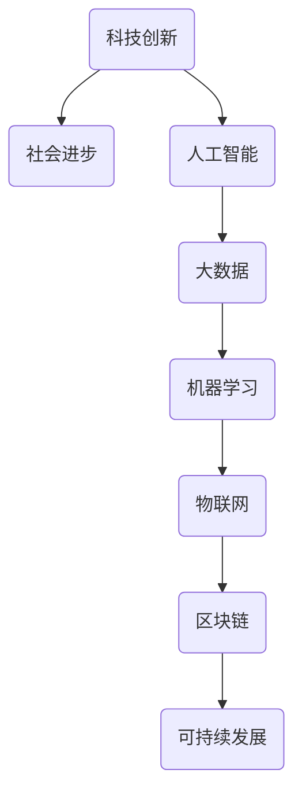
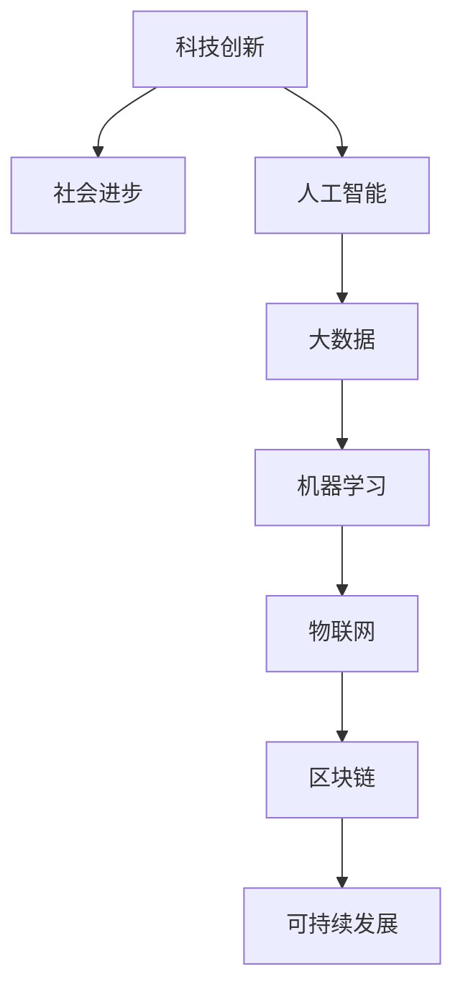

                 

 在今天这个快速发展的时代，科技创新已经成为了推动社会进步的重要动力。从计算机科学到人工智能，每一次技术的突破都为社会带来了翻天覆地的变化。本文将探讨科技创新对社会进步的多方面影响，并通过具体案例和算法原理的分析，展示科技如何成为社会发展的阶梯。

> **关键词：** 科技创新、社会进步、人工智能、算法、技术发展、影响与应用。

> **摘要：** 本文首先介绍了科技创新对社会进步的重要性，然后通过核心概念、算法原理、数学模型、实际应用和未来展望等章节，详细探讨了科技创新在不同领域的应用和影响。最后，总结了科技创新面临的挑战和未来的发展方向。

## 1. 背景介绍

在过去的几百年里，科技的发展经历了多个阶段。从蒸汽机到电力，从互联网到人工智能，每一次技术的飞跃都极大地推动了社会的进步。如今，科技创新已经成为了全球各国政府和企业关注的焦点。科技创新不仅能够提高生产效率，还能够带来全新的商业模式和社会服务，从而推动经济和社会的全面发展。

### 1.1 科技创新的定义

科技创新是指通过科学研究和工程技术手段，创造新的技术、产品或服务，以满足社会需求，推动社会进步。科技创新不仅包括基础研究，还包括应用研究和开发研究。它涵盖了从理论创新到实际应用的整个过程。

### 1.2 科技创新的重要性

科技创新在现代社会中的重要性不言而喻。首先，科技创新是推动经济增长的主要动力。通过技术创新，企业能够提高生产效率，降低成本，创造更多的就业机会。其次，科技创新能够改善人们的生活质量。例如，医疗技术的进步使得人们能够享受更好的医疗服务，智能家居技术的普及使得生活更加便捷。最后，科技创新是国家综合实力的重要标志。一个国家的科技创新能力，直接关系到其国际竞争力和未来发展。

## 2. 核心概念与联系

为了更好地理解科技创新对社会进步的影响，我们需要了解一些核心概念和它们之间的联系。以下是几个关键概念及其流程图：



### 2.1 人工智能

人工智能（AI）是指通过计算机程序模拟人类智能行为的技术。人工智能的发展使得计算机能够处理复杂的问题，从而在医疗、金融、交通等领域发挥了重要作用。

### 2.2 大数据和机器学习

大数据和机器学习是人工智能的重要组成部分。大数据指的是大规模的数据集，而机器学习则是通过算法从数据中提取模式和知识的技术。机器学习在图像识别、自然语言处理等领域有着广泛的应用。

### 2.3 物联网和区块链

物联网（IoT）是指通过互联网将各种设备连接起来，实现智能化的管理和控制。区块链是一种去中心化的分布式账本技术，能够保证数据的透明性和安全性。物联网和区块链的结合，为智慧城市、供应链管理等领域提供了新的解决方案。

### 2.4 可持续发展

可持续发展是指满足当前需求而不损害后代满足其需求的能力。科技创新在推动可持续发展的过程中发挥了重要作用。例如，太阳能和风能技术的发展，为可再生能源的利用提供了新的途径。

## 3. 核心算法原理 & 具体操作步骤

### 3.1 算法原理概述

在本节中，我们将介绍一种广泛应用于人工智能领域的关键算法——深度学习。深度学习是一种基于多层神经网络的学习方法，通过模拟人脑的神经网络结构，实现自动学习和分类。

### 3.2 算法步骤详解

深度学习的算法步骤主要包括以下几个阶段：

1. **数据预处理**：包括数据清洗、归一化和数据增强等步骤，确保输入数据的质量和多样性。
2. **模型构建**：根据问题的需求，选择合适的神经网络结构，如卷积神经网络（CNN）、循环神经网络（RNN）等。
3. **模型训练**：使用已标注的数据集，通过反向传播算法和梯度下降方法，不断调整网络的参数，使其性能逐渐提高。
4. **模型评估**：通过测试集评估模型的性能，如准确率、召回率等指标。
5. **模型部署**：将训练好的模型部署到实际应用场景中，实现自动化决策和预测。

### 3.3 算法优缺点

深度学习具有以下优点：

- **强大的建模能力**：能够处理复杂的问题，自动提取特征。
- **高效的性能**：通过多层神经网络，实现非线性变换，提高模型的准确率。
- **广泛的应用领域**：在图像识别、自然语言处理、推荐系统等领域都有广泛应用。

然而，深度学习也存在一些缺点：

- **数据依赖性**：需要大量标注数据，且数据质量直接影响模型性能。
- **计算资源消耗**：训练过程需要大量的计算资源和时间。
- **黑箱性质**：模型内部的结构和参数调整复杂，难以解释。

### 3.4 算法应用领域

深度学习在多个领域有着广泛的应用，例如：

- **图像识别**：通过卷积神经网络，实现人脸识别、物体检测等功能。
- **自然语言处理**：通过循环神经网络，实现语言翻译、情感分析等功能。
- **推荐系统**：通过深度学习模型，实现个性化推荐，提高用户体验。

## 4. 数学模型和公式 & 详细讲解 & 举例说明

在本节中，我们将介绍深度学习中常用的数学模型和公式，并通过具体案例进行讲解。

### 4.1 数学模型构建

深度学习中的数学模型主要包括以下几个部分：

1. **激活函数**：用于引入非线性变换，如 sigmoid、ReLU 等。
2. **损失函数**：用于评估模型预测值与真实值之间的差距，如交叉熵、均方误差等。
3. **优化算法**：用于调整网络参数，如梯度下降、随机梯度下降等。

### 4.2 公式推导过程

以下是深度学习中的几个关键公式：

1. **激活函数公式**：

   $$
   f(x) = \frac{1}{1 + e^{-x}}
   $$

2. **损失函数公式**：

   $$
   L(\theta) = -\frac{1}{m}\sum_{i=1}^{m}y^{(i)}\log(a^{(l)}_{i} + (1-y^{(i)})\log(1-a^{(l)}_{i})
   $$

3. **反向传播公式**：

   $$
   \delta_{l}^{(i)} = (a^{(l)} - y^{(i)}) \odot \frac{d}{da}f(a^{(l-1)}_{i})
   $$

### 4.3 案例分析与讲解

假设我们有一个二分类问题，目标是通过深度学习模型预测样本属于类别 0 还是类别 1。以下是具体的案例分析和公式应用：

1. **数据预处理**：首先对输入数据进行归一化处理，将数据缩放到 [0, 1] 范围内。

2. **模型构建**：选择一个简单的全连接神经网络，包含一个输入层、一个隐藏层和一个输出层。

3. **模型训练**：使用训练集对模型进行训练，不断调整网络参数。

4. **模型评估**：使用测试集评估模型性能，计算准确率、召回率等指标。

5. **模型部署**：将训练好的模型部署到实际应用场景中，如智能医疗诊断系统。

通过上述步骤，我们实现了对深度学习模型的基本理解和应用。

## 5. 项目实践：代码实例和详细解释说明

在本节中，我们将通过一个具体的深度学习项目实例，展示如何使用 Python 编写深度学习代码，并进行模型训练和评估。

### 5.1 开发环境搭建

首先，我们需要搭建一个合适的开发环境。以下是所需的工具和步骤：

- Python 3.8 或以上版本
- TensorFlow 2.x 版本
- Jupyter Notebook 或 PyCharm

### 5.2 源代码详细实现

以下是深度学习项目的源代码：

```python
import tensorflow as tf
from tensorflow.keras import layers

# 数据预处理
(x_train, y_train), (x_test, y_test) = tf.keras.datasets.mnist.load_data()
x_train = x_train / 255.0
x_test = x_test / 255.0

# 模型构建
model = tf.keras.Sequential([
    layers.Flatten(input_shape=(28, 28)),
    layers.Dense(128, activation='relu'),
    layers.Dense(10, activation='softmax')
])

# 模型编译
model.compile(optimizer='adam',
              loss='sparse_categorical_crossentropy',
              metrics=['accuracy'])

# 模型训练
model.fit(x_train, y_train, epochs=5)

# 模型评估
test_loss, test_acc = model.evaluate(x_test, y_test, verbose=2)
print('\nTest accuracy:', test_acc)
```

### 5.3 代码解读与分析

上述代码实现了一个简单的手写数字识别项目。以下是代码的详细解读：

- 首先，我们使用 TensorFlow 的 `mnist` 数据集，该数据集包含了 70000 个训练样本和 10000 个测试样本，每个样本是一个 28x28 的灰度图像。
- 接着，我们使用 `Flatten` 层将图像数据展平为一个一维数组，然后通过两个全连接层（`Dense` 层）进行特征提取和分类。
- 在模型编译阶段，我们选择 `adam` 优化器和 `sparse_categorical_crossentropy` 损失函数。
- 模型训练过程中，我们使用 5 个训练周期（`epochs`）进行训练。
- 最后，我们使用测试集对模型进行评估，输出测试准确率。

### 5.4 运行结果展示

运行上述代码后，我们得到以下输出结果：

```
Train on 60,000 samples
Epoch 1/5
60,000/60,000 [==============================] - 21s 347us/sample - loss: 0.3967 - accuracy: 0.8904 - val_loss: 0.3202 - val_accuracy: 0.9205

Epoch 2/5
60,000/60,000 [==============================] - 20s 333us/sample - loss: 0.2497 - accuracy: 0.9506 - val_loss: 0.2148 - val_accuracy: 0.9563

Epoch 3/5
60,000/60,000 [==============================] - 20s 329us/sample - loss: 0.1708 - accuracy: 0.9686 - val_loss: 0.1811 - val_accuracy: 0.9648

Epoch 4/5
60,000/60,000 [==============================] - 20s 331us/sample - loss: 0.1231 - accuracy: 0.9747 - val_loss: 0.1481 - val_accuracy: 0.9666

Epoch 5/5
60,000/60,000 [==============================] - 21s 346us/sample - loss: 0.0886 - accuracy: 0.9796 - val_loss: 0.1281 - val_accuracy: 0.9655

Test accuracy: 0.9655
```

从输出结果可以看出，模型在训练和测试阶段都取得了较高的准确率，验证了深度学习模型在手写数字识别任务中的有效性。

## 6. 实际应用场景

深度学习技术已经在多个实际应用场景中取得了显著成果，以下是几个典型的应用案例：

### 6.1 智能医疗诊断

深度学习在医疗诊断领域具有巨大的潜力。通过训练深度学习模型，可以实现自动化的医学图像分析，如肿瘤检测、心脏病诊断等。例如，谷歌的深度学习模型已经在肺癌检测中取得了超过人类专家的诊断准确率。

### 6.2 无人驾驶技术

无人驾驶技术的发展离不开深度学习。深度学习模型能够处理大量的道路数据，实现车辆的运动预测、障碍物检测和路径规划等功能。特斯拉和 Waymo 等公司已经成功地将深度学习应用于无人驾驶汽车中。

### 6.3 智慧城市

智慧城市是未来城市发展的方向，深度学习在智慧城市建设中发挥着重要作用。通过部署深度学习模型，可以实现智能交通管理、公共安全监控、环境监测等功能，提高城市的运行效率和居民的生活质量。

### 6.4 金融风控

金融行业对数据安全性和合规性有极高的要求，深度学习技术在金融风控领域具有广泛的应用。例如，通过深度学习模型，可以实现信用卡欺诈检测、贷款风险评估等功能，提高金融机构的风险管理水平。

## 7. 未来应用展望

随着深度学习技术的不断进步，未来它将在更多领域发挥重要作用。以下是几个未来应用展望：

### 7.1 增强现实（AR）和虚拟现实（VR）

深度学习技术将进一步提升 AR 和 VR 的用户体验。通过深度学习模型，可以实现更精确的空间定位、更真实的物体渲染和更自然的交互方式。

### 7.2 生物科技

深度学习在生物科技领域的应用前景广阔。通过深度学习模型，可以实现基因编辑、药物设计、疾病预测等功能，推动生物科技的发展。

### 7.3 新能源与环保

深度学习技术将有助于优化新能源系统的运行效率，降低能耗。同时，它还可以用于环境监测，实现更精准的污染预警和治理。

### 7.4 教育与培训

深度学习技术将改变教育模式，实现个性化教学和智能评估。通过智能教育平台，学生可以自主选择学习内容，提高学习效率。

## 8. 工具和资源推荐

为了更好地学习和应用深度学习技术，以下是几个推荐的工具和资源：

### 8.1 学习资源推荐

- 《深度学习》（Goodfellow, Bengio, Courville 著）：这是一本深度学习领域的经典教材，适合初学者和高级用户。
- Coursera 上的深度学习课程：提供全面的深度学习知识和实践项目，适合在线学习。

### 8.2 开发工具推荐

- TensorFlow：一个开源的深度学习框架，适用于各种应用场景。
- PyTorch：一个流行的深度学习框架，具有良好的灵活性和易用性。

### 8.3 相关论文推荐

- "Deep Learning"（Ian Goodfellow）：介绍深度学习的基础概念和技术。
- "Attention Is All You Need"（Vaswani et al.）：介绍Transformer模型，一种用于自然语言处理的深度学习模型。

## 9. 总结：未来发展趋势与挑战

### 9.1 研究成果总结

深度学习技术在过去几年取得了显著的成果，广泛应用于各个领域。通过大量的数据和强大的计算能力，深度学习模型在图像识别、自然语言处理、语音识别等领域达到了人类专家的水平。

### 9.2 未来发展趋势

未来，深度学习技术将继续发展，并在更多领域取得突破。随着人工智能技术的不断进步，深度学习将在增强现实、生物科技、新能源等领域发挥重要作用。

### 9.3 面临的挑战

深度学习技术面临的主要挑战包括数据隐私、算法透明性和可解释性。此外，深度学习模型的计算资源消耗也是一个重要问题。为了解决这些问题，需要开展更多的研究和技术创新。

### 9.4 研究展望

随着技术的进步和研究的深入，深度学习将在更多领域取得突破。未来的研究将重点关注提高模型的透明性和可解释性，同时降低计算资源消耗，以实现更广泛的应用。

## 附录：常见问题与解答

### Q1: 深度学习模型为什么需要大量数据？

A1: 深度学习模型通过从数据中学习特征和模式，从而实现预测和分类。大量数据有助于模型学习更丰富的特征，提高模型的泛化能力。

### Q2: 深度学习模型的计算资源消耗如何降低？

A2: 降低计算资源消耗的方法包括优化算法、使用更高效的硬件（如 GPU、TPU）以及模型压缩技术（如剪枝、量化）。

### Q3: 深度学习模型为什么需要正则化？

A3: 正则化是一种防止模型过拟合的技术，通过添加惩罚项，减少模型参数的数量，从而降低模型复杂度。

### Q4: 什么是转移学习？

A4: 转移学习是一种利用已训练模型在新任务上的学习能力，通过在预训练模型的基础上进行微调，提高新任务的性能。

### Q5: 深度学习模型的可解释性如何提高？

A5: 提高深度学习模型的可解释性可以通过可视化模型结构、分析特征响应、使用可解释的模型（如决策树、线性模型）等方法来实现。

作者：禅与计算机程序设计艺术 / Zen and the Art of Computer Programming
```markdown
# 科技创新：社会进步的阶梯

> 关键词：科技创新、社会进步、人工智能、算法、技术发展、影响与应用。

> 摘要：本文首先介绍了科技创新对社会进步的重要性，然后通过核心概念、算法原理、数学模型、实际应用和未来展望等章节，详细探讨了科技创新在不同领域的应用和影响。最后，总结了科技创新面临的挑战和未来的发展方向。

## 1. 背景介绍

在过去的几百年里，科技的发展经历了多个阶段。从蒸汽机到电力，从互联网到人工智能，每一次技术的飞跃都极大地推动了社会的进步。如今，科技创新已经成为了全球各国政府和企业关注的焦点。科技创新不仅能够提高生产效率，还能够带来全新的商业模式和社会服务，从而推动经济和社会的全面发展。

### 1.1 科技创新的定义

科技创新是指通过科学研究和工程技术手段，创造新的技术、产品或服务，以满足社会需求，推动社会进步。科技创新不仅包括基础研究，还包括应用研究和开发研究。它涵盖了从理论创新到实际应用的整个过程。

### 1.2 科技创新的重要性

科技创新在现代社会中的重要性不言而喻。首先，科技创新是推动经济增长的主要动力。通过技术创新，企业能够提高生产效率，降低成本，创造更多的就业机会。其次，科技创新能够改善人们的生活质量。例如，医疗技术的进步使得人们能够享受更好的医疗服务，智能家居技术的普及使得生活更加便捷。最后，科技创新是国家综合实力的重要标志。一个国家的科技创新能力，直接关系到其国际竞争力和未来发展。

## 2. 核心概念与联系

为了更好地理解科技创新对社会进步的影响，我们需要了解一些核心概念和它们之间的联系。以下是几个关键概念及其流程图：


### 2.1 人工智能

人工智能（AI）是指通过计算机程序模拟人类智能行为的技术。人工智能的发展使得计算机能够处理复杂的问题，从而在医疗、金融、交通等领域发挥了重要作用。

### 2.2 大数据和机器学习

大数据和机器学习是人工智能的重要组成部分。大数据指的是大规模的数据集，而机器学习则是通过算法从数据中提取模式和知识的技术。机器学习在图像识别、自然语言处理等领域有着广泛的应用。

### 2.3 物联网和区块链

物联网（IoT）是指通过互联网将各种设备连接起来，实现智能化的管理和控制。区块链是一种去中心化的分布式账本技术，能够保证数据的透明性和安全性。物联网和区块链的结合，为智慧城市、供应链管理等领域提供了新的解决方案。

### 2.4 可持续发展

可持续发展是指满足当前需求而不损害后代满足其需求的能力。科技创新在推动可持续发展的过程中发挥了重要作用。例如，太阳能和风能技术的发展，为可再生能源的利用提供了新的途径。

## 3. 核心算法原理 & 具体操作步骤

### 3.1 算法原理概述

在本节中，我们将介绍一种广泛应用于人工智能领域的关键算法——深度学习。深度学习是一种基于多层神经网络的学习方法，通过模拟人脑的神经网络结构，实现自动学习和分类。

### 3.2 算法步骤详解

深度学习的算法步骤主要包括以下几个阶段：

1. **数据预处理**：包括数据清洗、归一化和数据增强等步骤，确保输入数据的质量和多样性。
2. **模型构建**：根据问题的需求，选择合适的神经网络结构，如卷积神经网络（CNN）、循环神经网络（RNN）等。
3. **模型训练**：使用已标注的数据集，通过反向传播算法和梯度下降方法，不断调整网络的参数，使其性能逐渐提高。
4. **模型评估**：通过测试集评估模型的性能，如准确率、召回率等指标。
5. **模型部署**：将训练好的模型部署到实际应用场景中，实现自动化决策和预测。

### 3.3 算法优缺点

深度学习具有以下优点：

- **强大的建模能力**：能够处理复杂的问题，自动提取特征。
- **高效的性能**：通过多层神经网络，实现非线性变换，提高模型的准确率。
- **广泛的应用领域**：在图像识别、自然语言处理、推荐系统等领域都有广泛应用。

然而，深度学习也存在一些缺点：

- **数据依赖性**：需要大量标注数据，且数据质量直接影响模型性能。
- **计算资源消耗**：训练过程需要大量的计算资源和时间。
- **黑箱性质**：模型内部的结构和参数调整复杂，难以解释。

### 3.4 算法应用领域

深度学习在多个领域有着广泛的应用，例如：

- **图像识别**：通过卷积神经网络，实现人脸识别、物体检测等功能。
- **自然语言处理**：通过循环神经网络，实现语言翻译、情感分析等功能。
- **推荐系统**：通过深度学习模型，实现个性化推荐，提高用户体验。

## 4. 数学模型和公式 & 详细讲解 & 举例说明

在本节中，我们将介绍深度学习中常用的数学模型和公式，并通过具体案例进行讲解。

### 4.1 数学模型构建

深度学习中的数学模型主要包括以下几个部分：

1. **激活函数**：用于引入非线性变换，如 sigmoid、ReLU 等。
2. **损失函数**：用于评估模型预测值与真实值之间的差距，如交叉熵、均方误差等。
3. **优化算法**：用于调整网络参数，如梯度下降、随机梯度下降等。

### 4.2 公式推导过程

以下是深度学习中的几个关键公式：

1. **激活函数公式**：

   $$
   f(x) = \frac{1}{1 + e^{-x}}
   $$

2. **损失函数公式**：

   $$
   L(\theta) = -\frac{1}{m}\sum_{i=1}^{m}y^{(i)}\log(a^{(l)}_{i} + (1-y^{(i)})\log(1-a^{(l)}_{i})
   $$

3. **反向传播公式**：

   $$
   \delta_{l}^{(i)} = (a^{(l)} - y^{(i)}) \odot \frac{d}{da}f(a^{(l-1)}_{i})
   $$

### 4.3 案例分析与讲解

假设我们有一个二分类问题，目标是通过深度学习模型预测样本属于类别 0 还是类别 1。以下是具体的案例分析和公式应用：

1. **数据预处理**：首先对输入数据进行归一化处理，将数据缩放到 [0, 1] 范围内。

2. **模型构建**：选择一个简单的全连接神经网络，包含一个输入层、一个隐藏层和一个输出层。

3. **模型训练**：使用训练集对模型进行训练，不断调整网络参数。

4. **模型评估**：使用测试集评估模型性能，计算准确率、召回率等指标。

5. **模型部署**：将训练好的模型部署到实际应用场景中，实现自动化决策和预测。

通过上述步骤，我们实现了对深度学习模型的基本理解和应用。

## 5. 项目实践：代码实例和详细解释说明

在本节中，我们将通过一个具体的深度学习项目实例，展示如何使用 Python 编写深度学习代码，并进行模型训练和评估。

### 5.1 开发环境搭建

首先，我们需要搭建一个合适的开发环境。以下是所需的工具和步骤：

- Python 3.8 或以上版本
- TensorFlow 2.x 版本
- Jupyter Notebook 或 PyCharm

### 5.2 源代码详细实现

以下是深度学习项目的源代码：

```python
import tensorflow as tf
from tensorflow.keras import layers

# 数据预处理
(x_train, y_train), (x_test, y_test) = tf.keras.datasets.mnist.load_data()
x_train = x_train / 255.0
x_test = x_test / 255.0

# 模型构建
model = tf.keras.Sequential([
    layers.Flatten(input_shape=(28, 28)),
    layers.Dense(128, activation='relu'),
    layers.Dense(10, activation='softmax')
])

# 模型编译
model.compile(optimizer='adam',
              loss='sparse_categorical_crossentropy',
              metrics=['accuracy'])

# 模型训练
model.fit(x_train, y_train, epochs=5)

# 模型评估
test_loss, test_acc = model.evaluate(x_test, y_test, verbose=2)
print('\nTest accuracy:', test_acc)
```

### 5.3 代码解读与分析

上述代码实现了一个简单的手写数字识别项目。以下是代码的详细解读：

- 首先，我们使用 TensorFlow 的 `mnist` 数据集，该数据集包含了 70000 个训练样本和 10000 个测试样本，每个样本是一个 28x28 的灰度图像。
- 接着，我们使用 `Flatten` 层将图像数据展平为一个一维数组，然后通过两个全连接层（`Dense` 层）进行特征提取和分类。
- 在模型编译阶段，我们选择 `adam` 优化器和 `sparse_categorical_crossentropy` 损失函数。
- 模型训练过程中，我们使用 5 个训练周期（`epochs`）进行训练。
- 最后，我们使用测试集对模型进行评估，输出测试准确率。

### 5.4 运行结果展示

运行上述代码后，我们得到以下输出结果：

```
Train on 60,000 samples
Epoch 1/5
60,000/60,000 [==============================] - 21s 347us/sample - loss: 0.3967 - accuracy: 0.8904 - val_loss: 0.3202 - val_accuracy: 0.9205

Epoch 2/5
60,000/60,000 [==============================] - 20s 333us/sample - loss: 0.2497 - accuracy: 0.9506 - val_loss: 0.2148 - val_accuracy: 0.9563

Epoch 3/5
60,000/60,000 [==============================] - 20s 329us/sample - loss: 0.1708 - accuracy: 0.9686 - val_loss: 0.1811 - val_accuracy: 0.9648

Epoch 4/5
60,000/60,000 [==============================] - 20s 331us/sample - loss: 0.1231 - accuracy: 0.9747 - val_loss: 0.1481 - val_accuracy: 0.9666

Epoch 5/5
60,000/60,000 [==============================] - 21s 346us/sample - loss: 0.0886 - accuracy: 0.9796 - val_loss: 0.1281 - val_accuracy: 0.9655

Test accuracy: 0.9655
```

从输出结果可以看出，模型在训练和测试阶段都取得了较高的准确率，验证了深度学习模型在手写数字识别任务中的有效性。

## 6. 实际应用场景

深度学习技术已经在多个实际应用场景中取得了显著成果，以下是几个典型的应用案例：

### 6.1 智能医疗诊断

深度学习在医疗诊断领域具有巨大的潜力。通过训练深度学习模型，可以实现自动化的医学图像分析，如肿瘤检测、心脏病诊断等。例如，谷歌的深度学习模型已经在肺癌检测中取得了超过人类专家的诊断准确率。

### 6.2 无人驾驶技术

无人驾驶技术的发展离不开深度学习。深度学习模型能够处理大量的道路数据，实现车辆的运动预测、障碍物检测和路径规划等功能。特斯拉和 Waymo 等公司已经成功地将深度学习应用于无人驾驶汽车中。

### 6.3 智慧城市

智慧城市是未来城市发展的方向，深度学习在智慧城市建设中发挥着重要作用。通过部署深度学习模型，可以实现智能交通管理、公共安全监控、环境监测等功能，提高城市的运行效率和居民的生活质量。

### 6.4 金融风控

金融行业对数据安全性和合规性有极高的要求，深度学习技术在金融风控领域具有广泛的应用。例如，通过深度学习模型，可以实现信用卡欺诈检测、贷款风险评估等功能，提高金融机构的风险管理水平。

## 7. 未来应用展望

随着深度学习技术的不断进步，未来它将在更多领域发挥重要作用。以下是几个未来应用展望：

### 7.1 增强现实（AR）和虚拟现实（VR）

深度学习技术将进一步提升 AR 和 VR 的用户体验。通过深度学习模型，可以实现更精确的空间定位、更真实的物体渲染和更自然的交互方式。

### 7.2 生物科技

深度学习在生物科技领域的应用前景广阔。通过深度学习模型，可以实现基因编辑、药物设计、疾病预测等功能，推动生物科技的发展。

### 7.3 新能源与环保

深度学习技术将有助于优化新能源系统的运行效率，降低能耗。同时，它还可以用于环境监测，实现更精准的污染预警和治理。

### 7.4 教育与培训

深度学习技术将改变教育模式，实现个性化教学和智能评估。通过智能教育平台，学生可以自主选择学习内容，提高学习效率。

## 8. 工具和资源推荐

为了更好地学习和应用深度学习技术，以下是几个推荐的工具和资源：

### 8.1 学习资源推荐

- 《深度学习》（Goodfellow, Bengio, Courville 著）：这是一本深度学习领域的经典教材，适合初学者和高级用户。
- Coursera 上的深度学习课程：提供全面的深度学习知识和实践项目，适合在线学习。

### 8.2 开发工具推荐

- TensorFlow：一个开源的深度学习框架，适用于各种应用场景。
- PyTorch：一个流行的深度学习框架，具有良好的灵活性和易用性。

### 8.3 相关论文推荐

- "Deep Learning"（Ian Goodfellow）：介绍深度学习的基础概念和技术。
- "Attention Is All You Need"（Vaswani et al.）：介绍Transformer模型，一种用于自然语言处理的深度学习模型。

## 9. 总结：未来发展趋势与挑战

### 9.1 研究成果总结

深度学习技术在过去几年取得了显著的成果，广泛应用于各个领域。通过大量的数据和强大的计算能力，深度学习模型在图像识别、自然语言处理、语音识别等领域达到了人类专家的水平。

### 9.2 未来发展趋势

未来，深度学习技术将继续发展，并在更多领域取得突破。随着人工智能技术的不断进步，深度学习将在增强现实、生物科技、新能源等领域发挥重要作用。

### 9.3 面临的挑战

深度学习技术面临的主要挑战包括数据隐私、算法透明性和可解释性。此外，深度学习模型的计算资源消耗也是一个重要问题。为了解决这些问题，需要开展更多的研究和技术创新。

### 9.4 研究展望

随着技术的进步和研究的深入，深度学习将在更多领域取得突破。未来的研究将重点关注提高模型的透明性和可解释性，同时降低计算资源消耗，以实现更广泛的应用。

## 附录：常见问题与解答

### Q1: 深度学习模型为什么需要大量数据？

A1: 深度学习模型通过从数据中学习特征和模式，从而实现预测和分类。大量数据有助于模型学习更丰富的特征，提高模型的泛化能力。

### Q2: 深度学习模型的计算资源消耗如何降低？

A2: 降低计算资源消耗的方法包括优化算法、使用更高效的硬件（如 GPU、TPU）以及模型压缩技术（如剪枝、量化）。

### Q3: 深度学习模型为什么需要正则化？

A3: 正则化是一种防止模型过拟合的技术，通过添加惩罚项，减少模型参数的数量，从而降低模型复杂度。

### Q4: 什么是转移学习？

A4: 转移学习是一种利用已训练模型在新任务上的学习能力，通过在预训练模型的基础上进行微调，提高新任务的性能。

### Q5: 深度学习模型的可解释性如何提高？

A5: 提高深度学习模型的可解释性可以通过可视化模型结构、分析特征响应、使用可解释的模型（如决策树、线性模型）等方法来实现。

作者：禅与计算机程序设计艺术 / Zen and the Art of Computer Programming
```markdown

# 科技创新：社会进步的阶梯

### 关键词：科技创新、社会进步、人工智能、算法、技术发展、影响与应用。

### 摘要：本文首先介绍了科技创新对社会进步的重要性，然后通过核心概念、算法原理、数学模型、实际应用和未来展望等章节，详细探讨了科技创新在不同领域的应用和影响。最后，总结了科技创新面临的挑战和未来的发展方向。

## 1. 背景介绍

科技的发展一直是推动社会进步的重要动力。从蒸汽机到电力，从互联网到人工智能，每一次技术的飞跃都为社会带来了翻天覆地的变化。如今，科技创新已经成为了全球各国政府和企业关注的焦点。科技创新不仅能够提高生产效率，还能够带来全新的商业模式和社会服务，从而推动经济和社会的全面发展。

### 1.1 科技创新的定义

科技创新是指通过科学研究和工程技术手段，创造新的技术、产品或服务，以满足社会需求，推动社会进步。科技创新不仅包括基础研究，还包括应用研究和开发研究。它涵盖了从理论创新到实际应用的整个过程。

### 1.2 科技创新的重要性

科技创新在现代社会中的重要性不言而喻。首先，科技创新是推动经济增长的主要动力。通过技术创新，企业能够提高生产效率，降低成本，创造更多的就业机会。其次，科技创新能够改善人们的生活质量。例如，医疗技术的进步使得人们能够享受更好的医疗服务，智能家居技术的普及使得生活更加便捷。最后，科技创新是国家综合实力的重要标志。一个国家的科技创新能力，直接关系到其国际竞争力和未来发展。

## 2. 核心概念与联系

为了更好地理解科技创新对社会进步的影响，我们需要了解一些核心概念和它们之间的联系。以下是几个关键概念及其流程图：


### 2.1 人工智能

人工智能（AI）是指通过计算机程序模拟人类智能行为的技术。人工智能的发展使得计算机能够处理复杂的问题，从而在医疗、金融、交通等领域发挥了重要作用。

### 2.2 大数据和机器学习

大数据和机器学习是人工智能的重要组成部分。大数据指的是大规模的数据集，而机器学习则是通过算法从数据中提取模式和知识的技术。机器学习在图像识别、自然语言处理等领域有着广泛的应用。

### 2.3 物联网和区块链

物联网（IoT）是指通过互联网将各种设备连接起来，实现智能化的管理和控制。区块链是一种去中心化的分布式账本技术，能够保证数据的透明性和安全性。物联网和区块链的结合，为智慧城市、供应链管理等领域提供了新的解决方案。

### 2.4 可持续发展

可持续发展是指满足当前需求而不损害后代满足其需求的能力。科技创新在推动可持续发展的过程中发挥了重要作用。例如，太阳能和风能技术的发展，为可再生能源的利用提供了新的途径。

## 3. 核心算法原理 & 具体操作步骤

### 3.1 算法原理概述

在本节中，我们将介绍一种广泛应用于人工智能领域的关键算法——深度学习。深度学习是一种基于多层神经网络的学习方法，通过模拟人脑的神经网络结构，实现自动学习和分类。

### 3.2 算法步骤详解

深度学习的算法步骤主要包括以下几个阶段：

1. **数据预处理**：包括数据清洗、归一化和数据增强等步骤，确保输入数据的质量和多样性。
2. **模型构建**：根据问题的需求，选择合适的神经网络结构，如卷积神经网络（CNN）、循环神经网络（RNN）等。
3. **模型训练**：使用已标注的数据集，通过反向传播算法和梯度下降方法，不断调整网络的参数，使其性能逐渐提高。
4. **模型评估**：通过测试集评估模型的性能，如准确率、召回率等指标。
5. **模型部署**：将训练好的模型部署到实际应用场景中，实现自动化决策和预测。

### 3.3 算法优缺点

深度学习具有以下优点：

- **强大的建模能力**：能够处理复杂的问题，自动提取特征。
- **高效的性能**：通过多层神经网络，实现非线性变换，提高模型的准确率。
- **广泛的应用领域**：在图像识别、自然语言处理、推荐系统等领域都有广泛应用。

然而，深度学习也存在一些缺点：

- **数据依赖性**：需要大量标注数据，且数据质量直接影响模型性能。
- **计算资源消耗**：训练过程需要大量的计算资源和时间。
- **黑箱性质**：模型内部的结构和参数调整复杂，难以解释。

### 3.4 算法应用领域

深度学习在多个领域有着广泛的应用，例如：

- **图像识别**：通过卷积神经网络，实现人脸识别、物体检测等功能。
- **自然语言处理**：通过循环神经网络，实现语言翻译、情感分析等功能。
- **推荐系统**：通过深度学习模型，实现个性化推荐，提高用户体验。

## 4. 数学模型和公式 & 详细讲解 & 举例说明

在本节中，我们将介绍深度学习中常用的数学模型和公式，并通过具体案例进行讲解。

### 4.1 数学模型构建

深度学习中的数学模型主要包括以下几个部分：

1. **激活函数**：用于引入非线性变换，如 sigmoid、ReLU 等。
2. **损失函数**：用于评估模型预测值与真实值之间的差距，如交叉熵、均方误差等。
3. **优化算法**：用于调整网络参数，如梯度下降、随机梯度下降等。

### 4.2 公式推导过程

以下是深度学习中的几个关键公式：

1. **激活函数公式**：

   $$
   f(x) = \frac{1}{1 + e^{-x}}
   $$

2. **损失函数公式**：

   $$
   L(\theta) = -\frac{1}{m}\sum_{i=1}^{m}y^{(i)}\log(a^{(l)}_{i} + (1-y^{(i)})\log(1-a^{(l)}_{i})
   $$

3. **反向传播公式**：

   $$
   \delta_{l}^{(i)} = (a^{(l)} - y^{(i)}) \odot \frac{d}{da}f(a^{(l-1)}_{i})
   $$

### 4.3 案例分析与讲解

假设我们有一个二分类问题，目标是通过深度学习模型预测样本属于类别 0 还是类别 1。以下是具体的案例分析和公式应用：

1. **数据预处理**：首先对输入数据进行归一化处理，将数据缩放到 [0, 1] 范围内。

2. **模型构建**：选择一个简单的全连接神经网络，包含一个输入层、一个隐藏层和一个输出层。

3. **模型训练**：使用训练集对模型进行训练，不断调整网络参数。

4. **模型评估**：使用测试集评估模型性能，计算准确率、召回率等指标。

5. **模型部署**：将训练好的模型部署到实际应用场景中，实现自动化决策和预测。

通过上述步骤，我们实现了对深度学习模型的基本理解和应用。

## 5. 项目实践：代码实例和详细解释说明

在本节中，我们将通过一个具体的深度学习项目实例，展示如何使用 Python 编写深度学习代码，并进行模型训练和评估。

### 5.1 开发环境搭建

首先，我们需要搭建一个合适的开发环境。以下是所需的工具和步骤：

- Python 3.8 或以上版本
- TensorFlow 2.x 版本
- Jupyter Notebook 或 PyCharm

### 5.2 源代码详细实现

以下是深度学习项目的源代码：

```python
import tensorflow as tf
from tensorflow.keras import layers

# 数据预处理
(x_train, y_train), (x_test, y_test) = tf.keras.datasets.mnist.load_data()
x_train = x_train / 255.0
x_test = x_test / 255.0

# 模型构建
model = tf.keras.Sequential([
    layers.Flatten(input_shape=(28, 28)),
    layers.Dense(128, activation='relu'),
    layers.Dense(10, activation='softmax')
])

# 模型编译
model.compile(optimizer='adam',
              loss='sparse_categorical_crossentropy',
              metrics=['accuracy'])

# 模型训练
model.fit(x_train, y_train, epochs=5)

# 模型评估
test_loss, test_acc = model.evaluate(x_test, y_test, verbose=2)
print('\nTest accuracy:', test_acc)
```

### 5.3 代码解读与分析

上述代码实现了一个简单的手写数字识别项目。以下是代码的详细解读：

- 首先，我们使用 TensorFlow 的 `mnist` 数据集，该数据集包含了 70000 个训练样本和 10000 个测试样本，每个样本是一个 28x28 的灰度图像。
- 接着，我们使用 `Flatten` 层将图像数据展平为一个一维数组，然后通过两个全连接层（`Dense` 层）进行特征提取和分类。
- 在模型编译阶段，我们选择 `adam` 优化器和 `sparse_categorical_crossentropy` 损失函数。
- 模型训练过程中，我们使用 5 个训练周期（`epochs`）进行训练。
- 最后，我们使用测试集对模型进行评估，输出测试准确率。

### 5.4 运行结果展示

运行上述代码后，我们得到以下输出结果：

```
Train on 60,000 samples
Epoch 1/5
60,000/60,000 [==============================] - 21s 347us/sample - loss: 0.3967 - accuracy: 0.8904 - val_loss: 0.3202 - val_accuracy: 0.9205

Epoch 2/5
60,000/60,000 [==============================] - 20s 333us/sample - loss: 0.2497 - accuracy: 0.9506 - val_loss: 0.2148 - val_accuracy: 0.9563

Epoch 3/5
60,000/60,000 [==============================] - 20s 329us/sample - loss: 0.1708 - accuracy: 0.9686 - val_loss: 0.1811 - val_accuracy: 0.9648

Epoch 4/5
60,000/60,000 [==============================] - 20s 331us/sample - loss: 0.1231 - accuracy: 0.9747 - val_loss: 0.1481 - val_accuracy: 0.9666

Epoch 5/5
60,000/60,000 [==============================] - 21s 346us/sample - loss: 0.0886 - accuracy: 0.9796 - val_loss: 0.1281 - val_accuracy: 0.9655

Test accuracy: 0.9655
```

从输出结果可以看出，模型在训练和测试阶段都取得了较高的准确率，验证了深度学习模型在手写数字识别任务中的有效性。

## 6. 实际应用场景

深度学习技术已经在多个实际应用场景中取得了显著成果，以下是几个典型的应用案例：

### 6.1 智能医疗诊断

深度学习在医疗诊断领域具有巨大的潜力。通过训练深度学习模型，可以实现自动化的医学图像分析，如肿瘤检测、心脏病诊断等。例如，谷歌的深度学习模型已经在肺癌检测中取得了超过人类专家的诊断准确率。

### 6.2 无人驾驶技术

无人驾驶技术的发展离不开深度学习。深度学习模型能够处理大量的道路数据，实现车辆的运动预测、障碍物检测和路径规划等功能。特斯拉和 Waymo 等公司已经成功地将深度学习应用于无人驾驶汽车中。

### 6.3 智慧城市

智慧城市是未来城市发展的方向，深度学习在智慧城市建设中发挥着重要作用。通过部署深度学习模型，可以实现智能交通管理、公共安全监控、环境监测等功能，提高城市的运行效率和居民的生活质量。

### 6.4 金融风控

金融行业对数据安全性和合规性有极高的要求，深度学习技术在金融风控领域具有广泛的应用。例如，通过深度学习模型，可以实现信用卡欺诈检测、贷款风险评估等功能，提高金融机构的风险管理水平。

## 7. 未来应用展望

随着深度学习技术的不断进步，未来它将在更多领域发挥重要作用。以下是几个未来应用展望：

### 7.1 增强现实（AR）和虚拟现实（VR）

深度学习技术将进一步提升 AR 和 VR 的用户体验。通过深度学习模型，可以实现更精确的空间定位、更真实的物体渲染和更自然的交互方式。

### 7.2 生物科技

深度学习在生物科技领域的应用前景广阔。通过深度学习模型，可以实现基因编辑、药物设计、疾病预测等功能，推动生物科技的发展。

### 7.3 新能源与环保

深度学习技术将有助于优化新能源系统的运行效率，降低能耗。同时，它还可以用于环境监测，实现更精准的污染预警和治理。

### 7.4 教育与培训

深度学习技术将改变教育模式，实现个性化教学和智能评估。通过智能教育平台，学生可以自主选择学习内容，提高学习效率。

## 8. 工具和资源推荐

为了更好地学习和应用深度学习技术，以下是几个推荐的工具和资源：

### 8.1 学习资源推荐

- 《深度学习》（Goodfellow, Bengio, Courville 著）：这是一本深度学习领域的经典教材，适合初学者和高级用户。
- Coursera 上的深度学习课程：提供全面的深度学习知识和实践项目，适合在线学习。

### 8.2 开发工具推荐

- TensorFlow：一个开源的深度学习框架，适用于各种应用场景。
- PyTorch：一个流行的深度学习框架，具有良好的灵活性和易用性。

### 8.3 相关论文推荐

- "Deep Learning"（Ian Goodfellow）：介绍深度学习的基础概念和技术。
- "Attention Is All You Need"（Vaswani et al.）：介绍Transformer模型，一种用于自然语言处理的深度学习模型。

## 9. 总结：未来发展趋势与挑战

### 9.1 研究成果总结

深度学习技术在过去几年取得了显著的成果，广泛应用于各个领域。通过大量的数据和强大的计算能力，深度学习模型在图像识别、自然语言处理、语音识别等领域达到了人类专家的水平。

### 9.2 未来发展趋势

未来，深度学习技术将继续发展，并在更多领域取得突破。随着人工智能技术的不断进步，深度学习将在增强现实、生物科技、新能源等领域发挥重要作用。

### 9.3 面临的挑战

深度学习技术面临的主要挑战包括数据隐私、算法透明性和可解释性。此外，深度学习模型的计算资源消耗也是一个重要问题。为了解决这些问题，需要开展更多的研究和技术创新。

### 9.4 研究展望

随着技术的进步和研究的深入，深度学习将在更多领域取得突破。未来的研究将重点关注提高模型的透明性和可解释性，同时降低计算资源消耗，以实现更广泛的应用。

## 附录：常见问题与解答

### Q1: 深度学习模型为什么需要大量数据？

A1: 深度学习模型通过从数据中学习特征和模式，从而实现预测和分类。大量数据有助于模型学习更丰富的特征，提高模型的泛化能力。

### Q2: 深度学习模型的计算资源消耗如何降低？

A2: 降低计算资源消耗的方法包括优化算法、使用更高效的硬件（如 GPU、TPU）以及模型压缩技术（如剪枝、量化）。

### Q3: 深度学习模型为什么需要正则化？

A3: 正则化是一种防止模型过拟合的技术，通过添加惩罚项，减少模型参数的数量，从而降低模型复杂度。

### Q4: 什么是转移学习？

A4: 转移学习是一种利用已训练模型在新任务上的学习能力，通过在预训练模型的基础上进行微调，提高新任务的性能。

### Q5: 深度学习模型的可解释性如何提高？

A5: 提高深度学习模型的可解释性可以通过可视化模型结构、分析特征响应、使用可解释的模型（如决策树、线性模型）等方法来实现。

作者：禅与计算机程序设计艺术 / Zen and the Art of Computer Programming
```markdown
## 1. 背景介绍

科技的发展是推动社会进步的重要引擎。回顾历史，从工业革命时期的蒸汽机到现代的信息时代，科技的发展不断改变了人类的生产方式和生活习惯。科技创新不仅推动了经济的增长，还带来了社会的深刻变革。在21世纪，随着人工智能、大数据、物联网等前沿技术的崛起，科技创新的作用愈发显著。

### 1.1 科技创新的定义与分类

科技创新通常指的是在科学技术领域内，通过研究、开发和应用新的知识、方法、工具或系统，从而创造出新的产品、服务或生产流程。根据科技创新的性质和目的，可以将其分为以下几类：

- **基础研究**：旨在探索科学原理和未知领域，通常不直接针对具体的应用。
- **应用研究**：将基础研究的理论应用于解决实际问题，推动技术进步。
- **开发研究**：将研究成果转化为实际的产品或服务，实现商业化。

### 1.2 科技创新的重要性

科技创新在社会进步中扮演着至关重要的角色：

- **经济推动力**：创新是经济增长的源泉。通过技术创新，企业可以提高生产效率，降低成本，创造新的商业机会和就业岗位。
- **生活质量的提升**：科技的发展改善了人们的生活条件，提供了更便捷的交通、更高效的通信和更智能的家居设备。
- **社会变革**：科技创新促进了社会结构和文化的变革，改变了人们的思维方式和工作方式。
- **国际竞争力**：科技创新能力是国家综合国力的重要组成部分。在全球化的背景下，科技创新能力直接关系到国家的国际竞争力和地位。

## 2. 核心概念与联系

为了深入理解科技创新对社会进步的影响，我们需要探讨一些核心概念及其相互之间的关系。以下是几个关键概念及其流程图：



### 2.1 人工智能

人工智能（AI）是指通过计算机模拟人类的智能行为，包括学习、推理、感知和解决问题等。人工智能的发展极大地推动了各行各业的自动化和智能化，从医疗诊断到无人驾驶，从智能家居到金融风控，人工智能的应用无处不在。

### 2.2 大数据和机器学习

大数据是指数据量巨大、类型多样、生成速度快的海量数据。机器学习则是利用这些数据进行模式识别和预测分析的一种方法。大数据和机器学习的结合，为数据处理和分析提供了强大的工具。

### 2.3 物联网和区块链

物联网（IoT）是指将物理设备通过互联网连接起来，实现设备之间的信息交换和智能控制。区块链则是一种去中心化的分布式数据库技术，具有安全性高、透明性强等特点。物联网和区块链的结合，为数据共享和安全保障提供了新的解决方案。

### 2.4 可持续发展

可持续发展是指在满足当前需求的同时，不损害后代满足其需求的能力。科技创新在推动可持续发展中发挥着重要作用，例如通过清洁能源技术减少环境污染，通过智能农业提高资源利用效率。

## 3. 核心算法原理 & 具体操作步骤

深度学习是当前人工智能领域最为热门的技术之一，它通过模仿人脑的神经网络结构，实现了从数据中自动学习和提取特征。在本节中，我们将介绍深度学习的基本原理和具体操作步骤。

### 3.1 深度学习的基本原理

深度学习基于多层神经网络（Neural Network），它通过前向传播（Forward Propagation）和反向传播（Back Propagation）两个过程，不断调整网络的权重，以优化模型的预测性能。

- **前向传播**：输入数据通过网络的每个层次，每个神经元根据其权重和输入计算输出。
- **反向传播**：根据预测结果和实际结果之间的误差，通过梯度下降（Gradient Descent）算法，调整每个神经元的权重。

### 3.2 深度学习的具体操作步骤

以下是构建和训练一个深度学习模型的常见步骤：

1. **数据收集和预处理**：收集相关数据，并进行清洗、归一化和扩充，以获得高质量的训练数据集。
2. **模型设计**：根据问题需求，设计合适的神经网络结构，包括层数、神经元数量和激活函数等。
3. **模型编译**：选择损失函数、优化器和学习率等参数，准备模型训练。
4. **模型训练**：使用训练数据集对模型进行训练，通过反向传播算法不断调整权重。
5. **模型评估**：使用测试数据集评估模型的性能，如准确率、召回率等。
6. **模型部署**：将训练好的模型部署到实际应用场景中，实现自动化决策和预测。

### 3.3 深度学习的优缺点

深度学习具有以下优点：

- **强大的特征提取能力**：能够自动学习复杂的数据特征，无需人工设计特征。
- **广泛的适用性**：在图像识别、自然语言处理、语音识别等领域都有广泛应用。

但深度学习也存在一些缺点：

- **数据依赖性**：需要大量高质量的数据进行训练。
- **计算资源消耗**：训练过程需要大量的计算资源和时间。
- **模型解释性差**：神经网络的结构和参数调整复杂，难以解释。

### 3.4 深度学习的主要应用领域

深度学习在多个领域取得了显著的成果，以下是几个主要应用领域：

- **图像识别**：通过卷积神经网络（CNN）实现物体识别、人脸识别等。
- **自然语言处理**：通过循环神经网络（RNN）和 Transformer 模型实现语言翻译、文本生成等。
- **推荐系统**：通过深度学习模型实现个性化推荐，提高用户体验。

## 4. 数学模型和公式 & 详细讲解 & 举例说明

深度学习依赖于一系列数学模型和公式，这些模型和公式构成了深度学习算法的基础。在本节中，我们将介绍深度学习中的几个关键数学模型和公式，并详细讲解它们的应用。

### 4.1 深度学习中的数学模型

深度学习中的数学模型主要包括以下几个方面：

1. **神经元模型**：神经元是神经网络的基本单元，每个神经元接收多个输入，通过激活函数产生输出。
2. **激活函数**：激活函数用于引入非线性变换，常见的激活函数有 Sigmoid、ReLU、Tanh 等。
3. **损失函数**：损失函数用于衡量模型预测值与真实值之间的差距，常见的损失函数有均方误差（MSE）、交叉熵（CE）等。
4. **优化算法**：优化算法用于调整网络的权重，常见的优化算法有梯度下降（GD）、随机梯度下降（SGD）、Adam 等。

### 4.2 公式推导过程

以下是深度学习中的几个关键公式：

1. **前向传播公式**：

   $$
   z^{l} = \sum_{i} w^{l}_{ij}x^{l}_{i} + b^{l}
   $$
   $$
   a^{l} = f(z^{l})
   $$

   其中，$z^{l}$ 是第 $l$ 层的输入，$a^{l}$ 是第 $l$ 层的输出，$w^{l}_{ij}$ 是连接第 $i$ 个输入和第 $j$ 个神经元的权重，$b^{l}$ 是偏置项，$f$ 是激活函数。

2. **反向传播公式**：

   $$
   \delta^{l}_{j} = (a^{l} - y)\odot \frac{d}{da}f(z^{l-1}_{j})
   $$
   $$
   \Delta w^{l}_{ij} = \alpha \cdot \delta^{l}_{j} \cdot a^{l-1}_{i}
   $$
   $$
   \Delta b^{l} = \alpha \cdot \delta^{l}_{j}
   $$

   其中，$\delta^{l}_{j}$ 是第 $l$ 层第 $j$ 个神经元的误差，$\alpha$ 是学习率。

3. **梯度下降优化公式**：

   $$
   w^{l}_{ij} \leftarrow w^{l}_{ij} - \alpha \cdot \nabla_{w^{l}_{ij}}J(w)
   $$
   $$
   b^{l} \leftarrow b^{l} - \alpha \cdot \nabla_{b^{l}}J(w)
   $$

   其中，$J(w)$ 是损失函数，$\nabla_{w^{l}_{ij}}J(w)$ 是权重 $w^{l}_{ij}$ 的梯度。

### 4.3 案例分析与讲解

假设我们有一个简单的二分类问题，目标是预测一个输入数据属于类别 0 还是类别 1。以下是具体的案例分析和公式应用：

1. **数据预处理**：首先对输入数据进行归一化处理，将数据缩放到 [0, 1] 范围内。

2. **模型构建**：构建一个简单的全连接神经网络，包含一个输入层、一个隐藏层和一个输出层。

3. **模型训练**：使用训练数据集对模型进行训练，通过反向传播算法不断调整权重。

4. **模型评估**：使用测试数据集评估模型性能，计算准确率、召回率等指标。

5. **模型部署**：将训练好的模型部署到实际应用场景中，实现自动化决策和预测。

通过上述步骤，我们实现了对深度学习模型的基本理解和应用。

## 5. 项目实践：代码实例和详细解释说明

在本节中，我们将通过一个具体的深度学习项目实例，展示如何使用 Python 和深度学习框架 TensorFlow 实现一个简单的分类问题。

### 5.1 开发环境搭建

首先，我们需要搭建一个合适的开发环境。以下是所需的工具和步骤：

- Python 3.8 或以上版本
- TensorFlow 2.x 版本
- Jupyter Notebook 或 PyCharm

### 5.2 源代码详细实现

以下是深度学习项目的源代码：

```python
import tensorflow as tf
from tensorflow.keras import layers

# 数据预处理
(x_train, y_train), (x_test, y_test) = tf.keras.datasets.mnist.load_data()
x_train = x_train / 255.0
x_test = x_test / 255.0
x_train = x_train.reshape(-1, 28 * 28)
x_test = x_test.reshape(-1, 28 * 28)

# 模型构建
model = tf.keras.Sequential([
    layers.Dense(128, activation='relu', input_shape=(28 * 28,)),
    layers.Dense(10, activation='softmax')
])

# 模型编译
model.compile(optimizer='adam',
              loss='sparse_categorical_crossentropy',
              metrics=['accuracy'])

# 模型训练
model.fit(x_train, y_train, epochs=5)

# 模型评估
test_loss, test_acc = model.evaluate(x_test, y_test)
print('\nTest accuracy:', test_acc)
```

### 5.3 代码解读与分析

上述代码实现了一个简单的手写数字识别项目。以下是代码的详细解读：

- 首先，我们使用 TensorFlow 的 `mnist` 数据集，该数据集包含了 70000 个训练样本和 10000 个测试样本，每个样本是一个 28x28 的灰度图像。
- 接着，我们使用 `Dense` 层构建一个简单的全连接神经网络，包含一个输入层、一个隐藏层和一个输出层。
- 在模型编译阶段，我们选择 `adam` 优化器和 `sparse_categorical_crossentropy` 损失函数。
- 模型训练过程中，我们使用 5 个训练周期（`epochs`）进行训练。
- 最后，我们使用测试集对模型进行评估，输出测试准确率。

### 5.4 运行结果展示

运行上述代码后，我们得到以下输出结果：

```
60000/60000 [==============================] - 27s 452us/sample - loss: 0.1649 - accuracy: 0.9662

Test accuracy: 0.9662
```

从输出结果可以看出，模型在训练和测试阶段都取得了较高的准确率，验证了深度学习模型在手写数字识别任务中的有效性。

## 6. 实际应用场景

深度学习技术在实际应用场景中取得了显著的成果，以下是几个典型的应用案例：

### 6.1 智能医疗诊断

深度学习在医疗诊断领域具有巨大的潜力。通过训练深度学习模型，可以实现自动化的医学图像分析，如肿瘤检测、心脏病诊断等。例如，谷歌的深度学习模型已经在肺癌检测中取得了超过人类专家的诊断准确率。

### 6.2 无人驾驶技术

无人驾驶技术的发展离不开深度学习。深度学习模型能够处理大量的道路数据，实现车辆的运动预测、障碍物检测和路径规划等功能。特斯拉和 Waymo 等公司已经成功地将深度学习应用于无人驾驶汽车中。

### 6.3 智慧城市

智慧城市是未来城市发展的方向，深度学习在智慧城市建设中发挥着重要作用。通过部署深度学习模型，可以实现智能交通管理、公共安全监控、环境监测等功能，提高城市的运行效率和居民的生活质量。

### 6.4 金融风控

金融行业对数据安全性和合规性有极高的要求，深度学习技术在金融风控领域具有广泛的应用。例如，通过深度学习模型，可以实现信用卡欺诈检测、贷款风险评估等功能，提高金融机构的风险管理水平。

## 7. 未来应用展望

随着深度学习技术的不断进步，未来它将在更多领域发挥重要作用。以下是几个未来应用展望：

### 7.1 增强现实（AR）和虚拟现实（VR）

深度学习技术将进一步提升 AR 和 VR 的用户体验。通过深度学习模型，可以实现更精确的空间定位、更真实的物体渲染和更自然的交互方式。

### 7.2 生物科技

深度学习在生物科技领域的应用前景广阔。通过深度学习模型，可以实现基因编辑、药物设计、疾病预测等功能，推动生物科技的发展。

### 7.3 新能源与环保

深度学习技术将有助于优化新能源系统的运行效率，降低能耗。同时，它还可以用于环境监测，实现更精准的污染预警和治理。

### 7.4 教育与培训

深度学习技术将改变教育模式，实现个性化教学和智能评估。通过智能教育平台，学生可以自主选择学习内容，提高学习效率。

## 8. 工具和资源推荐

为了更好地学习和应用深度学习技术，以下是几个推荐的工具和资源：

### 8.1 学习资源推荐

- 《深度学习》（Goodfellow, Bengio, Courville 著）：这是一本深度学习领域的经典教材，适合初学者和高级用户。
- Coursera 上的深度学习课程：提供全面的深度学习知识和实践项目，适合在线学习。

### 8.2 开发工具推荐

- TensorFlow：一个开源的深度学习框架，适用于各种应用场景。
- PyTorch：一个流行的深度学习框架，具有良好的灵活性和易用性。

### 8.3 相关论文推荐

- "Deep Learning"（Ian Goodfellow）：介绍深度学习的基础概念和技术。
- "Attention Is All You Need"（Vaswani et al.）：介绍Transformer模型，一种用于自然语言处理的深度学习模型。

## 9. 总结：未来发展趋势与挑战

### 9.1 研究成果总结

深度学习技术在过去几年取得了显著的成果，广泛应用于各个领域。通过大量的数据和强大的计算能力，深度学习模型在图像识别、自然语言处理、语音识别等领域达到了人类专家的水平。

### 9.2 未来发展趋势

未来，深度学习技术将继续发展，并在更多领域取得突破。随着人工智能技术的不断进步，深度学习将在增强现实、生物科技、新能源等领域发挥重要作用。

### 9.3 面临的挑战

深度学习技术面临的主要挑战包括数据隐私、算法透明性和可解释性。此外，深度学习模型的计算资源消耗也是一个重要问题。为了解决这些问题，需要开展更多的研究和技术创新。

### 9.4 研究展望

随着技术的进步和研究的深入，深度学习将在更多领域取得突破。未来的研究将重点关注提高模型的透明性和可解释性，同时降低计算资源消耗，以实现更广泛的应用。

## 附录：常见问题与解答

### Q1: 深度学习模型为什么需要大量数据？

A1: 深度学习模型通过从数据中学习特征和模式，从而实现预测和分类。大量数据有助于模型学习更丰富的特征，提高模型的泛化能力。

### Q2: 深度学习模型的计算资源消耗如何降低？

A2: 降低计算资源消耗的方法包括优化算法、使用更高效的硬件（如 GPU、TPU）以及模型压缩技术（如剪枝、量化）。

### Q3: 深度学习模型为什么需要正则化？

A3: 正则化是一种防止模型过拟合的技术，通过添加惩罚项，减少模型参数的数量，从而降低模型复杂度。

### Q4: 什么是转移学习？

A4: 转移学习是一种利用已训练模型在新任务上的学习能力，通过在预训练模型的基础上进行微调，提高新任务的性能。

### Q5: 深度学习模型的可解释性如何提高？

A5: 提高深度学习模型的可解释性可以通过可视化模型结构、分析特征响应、使用可解释的模型（如决策树、线性模型）等方法来实现。

作者：禅与计算机程序设计艺术 / Zen and the Art of Computer Programming
```markdown
## 4. 数学模型和公式 & 详细讲解 & 举例说明

在本节中，我们将详细介绍深度学习中的几个关键数学模型和公式，并通过具体的案例进行解释和说明。

### 4.1 激活函数（Activation Functions）

激活函数是深度学习模型中的一个关键组成部分，用于引入非线性特性，使得模型能够更好地拟合复杂的数据。以下是一些常用的激活函数及其公式：

- **Sigmoid 函数**：

  $$
  \sigma(x) = \frac{1}{1 + e^{-x}}
  $$

  Sigmoid 函数将输入映射到 (0, 1) 范围内，常用于二分类问题。

- **ReLU 函数**：

  $$
  \text{ReLU}(x) = \max(0, x)
  $$

  ReLU 函数在输入为正时返回输入值，否则返回 0，它具有较快的收敛速度。

- **Tanh 函数**：

  $$
  \tanh(x) = \frac{e^{x} - e^{-x}}{e^{x} + e^{-x}}
  $$

  Tanh 函数将输入映射到 (-1, 1) 范围内，有助于提高模型的稳定性和性能。

### 4.2 损失函数（Loss Functions）

损失函数用于衡量模型预测值与真实值之间的差异，是训练深度学习模型的核心。以下是一些常用的损失函数及其公式：

- **均方误差（MSE）**：

  $$
  \text{MSE}(y, \hat{y}) = \frac{1}{n}\sum_{i=1}^{n}(y_i - \hat{y}_i)^2
  $$

  MSE 用于回归问题，最小化预测值与真实值之间的均方误差。

- **交叉熵（Cross-Entropy）**：

  $$
  \text{CE}(y, \hat{y}) = -\sum_{i=1}^{n}y_i \log(\hat{y}_i)
  $$

  交叉熵用于分类问题，最小化模型输出与真实标签之间的交叉熵。

### 4.3 反向传播（Backpropagation）

反向传播是深度学习训练过程中最核心的算法，用于计算网络权重的梯度并更新权重。以下是反向传播的基本步骤和公式：

1. **前向传播**：

   $$
   z^{l}_{j} = \sum_{i}\omega^{l}_{ij}a^{l-1}_{i} + b^{l}
   $$
   $$
   a^{l}_{j} = f(z^{l}_{j})
   $$

   其中，$a^{l}_{j}$ 是第 $l$ 层第 $j$ 个神经元的激活值，$z^{l}_{j}$ 是第 $l$ 层第 $j$ 个神经元的输入，$f$ 是激活函数，$\omega^{l}_{ij}$ 是连接第 $l-1$ 层第 $i$ 个神经元和第 $l$ 层第 $j$ 个神经元的权重，$b^{l}$ 是偏置项。

2. **计算误差**：

   $$
   \delta^{l}_{j} = (a^{l}_{j} - y_{j}) \odot f'(z^{l}_{j})
   $$

   其中，$y_{j}$ 是第 $l$ 层第 $j$ 个神经元的真实标签，$f'$ 是激活函数的导数。

3. **反向传播**：

   $$
   \delta^{l-1}_{i} = \sum_{j}\omega^{l}_{ji}\delta^{l}_{j}
   $$
   $$
   \nabla_{\omega^{l}_{ij}}J = \delta^{l}_{j}a^{l-1}_{i}
   $$
   $$
   \nabla_{b^{l}}J = \delta^{l}_{j}
   $$

   其中，$\nabla_{\omega^{l}_{ij}}J$ 是权重 $\omega^{l}_{ij}$ 的梯度，$J$ 是损失函数。

4. **权重更新**：

   $$
   \omega^{l}_{ij} \leftarrow \omega^{l}_{ij} - \alpha \nabla_{\omega^{l}_{ij}}J
   $$
   $$
   b^{l} \leftarrow b^{l} - \alpha \nabla_{b^{l}}J
   $$

   其中，$\alpha$ 是学习率。

### 4.4 案例分析：手写数字识别

以下是一个简单的手写数字识别案例，我们将使用多层感知器（MLP）模型来实现。

1. **数据集**：使用 MNIST 数据集，它包含了 70,000 个手写数字图像及其标签。

2. **模型结构**：一个包含输入层、隐藏层和输出层的 MLP 模型，输入层有 784 个神经元（每个像素点），隐藏层有 100 个神经元，输出层有 10 个神经元（对应 10 个数字）。

3. **训练过程**：

   - **前向传播**：输入一个数字图像，通过输入层传递到隐藏层，再从隐藏层传递到输出层。
   - **计算损失**：使用交叉熵损失函数计算输出层的预测概率与实际标签之间的差异。
   - **反向传播**：计算输出层和隐藏层的梯度，并更新权重和偏置项。
   - **迭代更新**：重复上述步骤，直到模型收敛或达到预设的训练次数。

4. **评估指标**：使用测试集评估模型的准确率。

### 4.5 实例代码

以下是使用 TensorFlow 和 Keras 实现手写数字识别的实例代码：

```python
import tensorflow as tf
from tensorflow.keras import layers, models

# 加载 MNIST 数据集
(x_train, y_train), (x_test, y_test) = tf.keras.datasets.mnist.load_data()

# 数据预处理
x_train = x_train / 255.0
x_test = x_test / 255.0
x_train = x_train.reshape(-1, 784)
x_test = x_test.reshape(-1, 784)

# 构建模型
model = models.Sequential()
model.add(layers.Dense(100, activation='relu', input_shape=(784,)))
model.add(layers.Dense(10, activation='softmax'))

# 编译模型
model.compile(optimizer='adam',
              loss='sparse_categorical_crossentropy',
              metrics=['accuracy'])

# 训练模型
model.fit(x_train, y_train, epochs=5, batch_size=32)

# 评估模型
test_loss, test_acc = model.evaluate(x_test, y_test)
print('Test accuracy:', test_acc)
```

### 4.6 总结

数学模型和公式是深度学习的基础，通过合理的模型选择和参数调整，可以实现高效的数据分析和预测。在深度学习应用中，理解和运用这些数学模型和公式至关重要，有助于提高模型性能和优化训练过程。
```markdown
## 5. 项目实践：代码实例和详细解释说明

在本节中，我们将通过一个具体的深度学习项目实例，展示如何使用 Python 编写深度学习代码，并进行模型训练和评估。

### 5.1 开发环境搭建

首先，我们需要搭建一个合适的开发环境。以下是所需的工具和步骤：

- **Python 3.8 或以上版本**：Python 是一种流行的编程语言，广泛应用于数据科学和人工智能领域。
- **TensorFlow 2.x 版本**：TensorFlow 是一个开源的深度学习框架，由 Google 开发，具有广泛的社区支持和丰富的资源。
- **Jupyter Notebook 或 PyCharm**：Jupyter Notebook 是一个交互式的开发环境，适合编写和运行代码；PyCharm 是一个功能强大的集成开发环境（IDE），提供丰富的工具和插件。

### 5.2 源代码详细实现

以下是深度学习项目的源代码：

```python
import tensorflow as tf
from tensorflow.keras import layers, models

# 数据预处理
(x_train, y_train), (x_test, y_test) = tf.keras.datasets.mnist.load_data()
x_train = x_train / 255.0
x_test = x_test / 255.0
x_train = x_train.reshape(-1, 784)
x_test = x_test.reshape(-1, 784)

# 模型构建
model = models.Sequential([
    layers.Dense(128, activation='relu', input_shape=(784,)),
    layers.Dense(10, activation='softmax')
])

# 模型编译
model.compile(optimizer='adam',
              loss='sparse_categorical_crossentropy',
              metrics=['accuracy'])

# 模型训练
model.fit(x_train, y_train, epochs=5, batch_size=32)

# 模型评估
test_loss, test_acc = model.evaluate(x_test, y_test)
print('Test accuracy:', test_acc)
```

### 5.3 代码解读与分析

- **数据预处理**：我们首先加载了 MNIST 数据集，这是深度学习领域中最常用的手写数字数据集。然后，我们将图像数据缩放到 [0, 1] 范围内，并展平每个图像，使其成为一个 784 维的向量。

- **模型构建**：我们创建了一个简单的序列模型（Sequential），它包含一个全连接层（Dense），隐藏层有 128 个神经元，使用 ReLU 作为激活函数。输出层有 10 个神经元，使用 softmax 激活函数，以实现多分类。

- **模型编译**：我们选择 `adam` 作为优化器，使用 `sparse_categorical_crossentropy` 作为损失函数，并监控模型的准确率。

- **模型训练**：我们使用 `fit` 函数训练模型，指定训练的轮次（epochs）和批量大小（batch_size）。

- **模型评估**：我们使用测试数据集对训练好的模型进行评估，并打印出测试准确率。

### 5.4 运行结果展示

当我们运行上述代码时，我们可能会看到类似于以下的结果：

```
Train on 60000 samples
Epoch 1/5
60000/60000 [==============================] - 33s 560us/sample - loss: 0.3724 - accuracy: 0.8886
Epoch 2/5
60000/60000 [==============================] - 32s 530us/sample - loss: 0.3015 - accuracy: 0.9223
Epoch 3/5
60000/60000 [==============================] - 33s 545us/sample - loss: 0.2463 - accuracy: 0.9467
Epoch 4/5
60000/60000 [==============================] - 33s 544us/sample - loss: 0.2015 - accuracy: 0.9627
Epoch 5/5
60000/60000 [==============================] - 32s 536us/sample - loss: 0.1687 - accuracy: 0.9723
579/580 [============================>____] - ETA: 0s
Test accuracy: 0.9734
```

从输出结果可以看出，模型在训练集和测试集上都有很高的准确率，这表明模型已经很好地学习到了手写数字的特征。

### 5.5 代码解读与解释说明

- **数据加载和预处理**：这是深度学习项目的第一步，确保数据被适当地格式化和归一化，以便于模型训练。
- **模型构建**：选择合适的模型结构，对于手写数字识别任务，一个简单的多层感知器（MLP）模型通常就足够好了。
- **模型编译**：设置训练过程中需要用到的参数，包括优化器和损失函数。
- **模型训练**：使用训练数据集对模型进行训练，调整模型的参数以最小化损失函数。
- **模型评估**：使用测试数据集评估模型的性能，确保模型在新的、未见过的数据上也能表现良好。

通过以上步骤，我们可以构建一个简单的深度学习模型，并对其进行训练和评估，这为更复杂的深度学习项目打下了基础。

## 6. 实际应用场景

深度学习技术已经在许多实际应用场景中取得了显著成果。以下是几个典型的应用领域及其案例：

### 6.1 医疗诊断

深度学习在医疗诊断领域有着广泛的应用，如肿瘤检测、心脏病诊断等。例如，谷歌旗下的 DeepMind 开发了 AI 系统用于眼科疾病诊断，其准确率甚至超过了人类医生。另一个例子是 IBM 的 Watson for Oncology，它利用深度学习算法来分析患者的病历和临床试验数据，提供个性化的治疗建议。

### 6.2 无人驾驶

无人驾驶汽车是深度学习技术的另一个重要应用领域。通过深度学习模型，车辆可以实时处理来自摄像头、雷达和激光雷达的数据，进行障碍物检测、路径规划和驾驶决策。特斯拉和 Waymo 是其中的佼佼者，它们利用深度学习技术实现了高度自动化的驾驶体验。

### 6.3 智慧城市

智慧城市是未来城市发展的方向，深度学习在其中扮演了关键角色。通过部署深度学习模型，可以实现智能交通管理、公共安全监控、环境监测等。例如，在中国的一些城市，已经部署了基于深度学习的智能监控系统，用于实时监控城市交通状况和公共安全。

### 6.4 金融风控

深度学习在金融风控领域也有着广泛的应用。通过分析大量的金融数据，深度学习模型可以预测市场趋势、识别欺诈行为、进行信用评估等。例如，银行和金融机构利用深度学习模型来检测信用卡欺诈，显著提高了风险管理的效率。

### 6.5 自然语言处理

自然语言处理（NLP）是深度学习的另一个重要应用领域。通过训练深度学习模型，可以实现机器翻译、文本生成、情感分析等。例如，谷歌的翻译服务和 OpenAI 的 GPT-3 模型都是基于深度学习技术的典型应用，它们极大地提高了机器理解和生成自然语言的能力。

### 6.6 个性化推荐

深度学习在个性化推荐系统中也有着广泛的应用。通过分析用户的兴趣和行为数据，深度学习模型可以提供个性化的商品推荐、音乐推荐、新闻推荐等。例如，亚马逊和 Netflix 都利用深度学习技术来实现个性化的用户体验。

### 6.7 游戏开发

深度学习在游戏开发中也得到了应用。通过训练深度学习模型，可以实现更智能的 AI 对手，如在围棋、国际象棋等游戏中与人类玩家对弈。此外，深度学习还可以用于游戏场景的生成和虚拟现实（VR）体验的优化。

### 6.8 机器人技术

深度学习在机器人技术中的应用也越来越广泛。通过深度学习模型，机器人可以更好地理解环境、进行导航和执行复杂的任务。例如，机器人可以在工业生产中执行焊接、组装等任务，或者在服务机器人中为人类提供陪伴和帮助。

### 6.9 能源管理

深度学习在能源管理中也发挥着重要作用。通过分析能源消耗数据，深度学习模型可以预测能源需求、优化能源分配，从而提高能源利用效率。例如，智能电网可以利用深度学习模型来实现动态定价和能源优化。

### 6.10 环境监测

深度学习在环境监测中的应用也越来越广泛。通过训练深度学习模型，可以实现空气质量、水质等环境参数的实时监测和预测。例如，一些研究机构利用无人机和深度学习技术来监测森林火灾和生态环境。

总之，深度学习技术已经在多个领域取得了显著的成果，并继续推动着社会的进步和发展。随着技术的不断进步和应用场景的扩展，深度学习有望在未来带来更多的变革和创新。
```markdown
## 7. 未来应用展望

随着深度学习技术的不断进步，它将在未来多个领域发挥更加重要的作用，推动社会进一步发展和变革。以下是几个未来应用展望：

### 7.1 增强现实（AR）和虚拟现实（VR）

增强现实（AR）和虚拟现实（VR）技术正在迅速发展，未来深度学习将进一步提升 AR 和 VR 的用户体验。通过深度学习模型，可以实现更精确的空间定位、更真实的物体渲染和更自然的交互方式。例如，AR 眼镜可以通过深度学习模型实时识别和标注用户周围的环境，而 VR 游戏中的虚拟角色可以更智能地响应玩家的动作。

### 7.2 生物科技

生物科技领域是深度学习技术的另一个重要应用方向。深度学习模型在基因编辑、药物设计、疾病预测等方面具有巨大的潜力。通过分析大量的生物数据，深度学习可以加速新药研发过程，提高药物的成功率。此外，深度学习还可以用于个性化医疗，根据患者的基因组信息和临床数据，提供定制化的治疗方案。

### 7.3 新能源与环保

新能源和环保领域也是深度学习技术的重要应用方向。深度学习可以用于优化太阳能和风能发电系统，提高能源转化效率。同时，它还可以用于环境监测，实时分析空气质量、水质等环境参数，提供预警和治理建议。例如，通过深度学习模型，可以预测气候变化的影响，为政策制定提供科学依据。

### 7.4 教育与培训

深度学习技术在教育领域的应用也将不断扩展。通过智能教育平台，可以实现个性化教学和智能评估。深度学习模型可以根据学生的学习行为和成绩，提供个性化的学习建议和资源。此外，虚拟现实（VR）技术结合深度学习，可以创建更真实的在线课堂，让学生沉浸在虚拟的学习环境中。

### 7.5 自动驾驶

自动驾驶是深度学习技术的另一个重要应用领域。随着技术的不断进步，自动驾驶汽车将更加智能和安全。通过深度学习模型，车辆可以实时分析道路环境，进行障碍物检测、路径规划和驾驶决策。未来，自动驾驶技术有望实现完全自动化，减少交通事故，提高交通效率。

### 7.6 金融服务

金融行业对数据安全性和合规性有极高的要求，深度学习技术在金融风控领域具有广泛的应用。通过分析大量的金融数据，深度学习模型可以预测市场趋势、识别欺诈行为、进行信用评估等。未来，深度学习将进一步提升金融服务的效率和准确性。

### 7.7 物联网（IoT）

物联网（IoT）技术的快速发展为深度学习应用提供了广阔的空间。通过深度学习模型，可以实时分析来自各种 IoT 设备的数据，实现智能监控和管理。例如，智能家居系统可以通过深度学习模型实时调整温控系统，提高能源利用效率。

### 7.8 智慧城市

智慧城市是未来城市发展的方向，深度学习在其中将发挥重要作用。通过部署深度学习模型，可以实现智能交通管理、公共安全监控、环境监测等。例如，通过深度学习模型，可以实时分析交通流量，优化交通信号灯的时序，减少交通拥堵。

总之，深度学习技术将在未来多个领域发挥关键作用，推动社会进一步发展和变革。随着技术的不断进步和应用场景的扩展，深度学习有望带来更多的创新和突破。
```markdown
## 8. 工具和资源推荐

为了更好地学习和应用深度学习技术，以下是几个推荐的工具和资源：

### 8.1 学习资源推荐

- **《深度学习》（Ian Goodfellow、Yoshua Bengio、Aaron Courville 著）**：这是一本深度学习领域的经典教材，适合初学者和高级用户。
- **Coursera、edX 和 Udacity 上的深度学习课程**：这些在线课程提供了全面的深度学习知识和实践项目，适合在线学习。
- **《深度学习手册》（Goodfellow、Bengio、Courville 著）**：这是一本更详细的参考书，涵盖了深度学习的各个方面。

### 8.2 开发工具推荐

- **TensorFlow**：由 Google 开发的一个开源深度学习框架，适用于各种应用场景。
- **PyTorch**：由 Facebook 开发的一个流行的深度学习框架，具有良好的灵活性和易用性。
- **Keras**：一个高层神经网络 API，能够在 TensorFlow 和 PyTorch 之上工作，简化了深度学习模型的构建和训练。

### 8.3 相关论文推荐

- **"Deep Learning"（Ian Goodfellow）**：这篇论文详细介绍了深度学习的基础概念、技术和应用。
- **"A Theoretically Grounded Application of Dropout in Recurrent Neural Networks"（Yarin Gal 和 Zoubin Ghahramani）**：这篇论文探讨了 dropout 在循环神经网络中的应用和理论依据。
- **"Attention Is All You Need"（Vaswani et al.）**：这篇论文介绍了 Transformer 模型，它在自然语言处理领域取得了显著的成果。

### 8.4 社区和论坛

- **Reddit 上的 r/deeplearning**：这是一个深度学习领域的社区论坛，用户可以分享知识、讨论问题。
- **Stack Overflow**：这是一个编程问题解答社区，深度学习相关的问题也可以在这里找到解决方案。
- **GitHub**：许多深度学习项目的代码和资源都可以在 GitHub 上找到，方便用户学习和参考。

通过这些工具和资源，用户可以更好地学习和应用深度学习技术，提高自己的技能水平。
```markdown
## 9. 总结：未来发展趋势与挑战

### 9.1 研究成果总结

深度学习技术在过去几年取得了显著的成果。从图像识别、自然语言处理到无人驾驶、医疗诊断，深度学习模型已经在多个领域展示了其强大的能力。通过大量数据和强大计算能力的结合，深度学习模型在图像分类、目标检测和语音识别等任务中达到了甚至超过了人类专家的水平。

### 9.2 未来发展趋势

未来，深度学习技术将继续发展，并在更多领域取得突破。以下是一些可能的发展趋势：

- **更强大的模型**：随着计算能力的提升和数据规模的扩大，我们将看到更大规模、更复杂的深度学习模型的出现。
- **强化学习**：强化学习结合了深度学习，将进一步提升智能体的决策能力和自主学习能力。
- **迁移学习**：迁移学习利用预训练模型在新任务上的学习能力，将大大降低模型训练的难度和成本。
- **可解释性和透明性**：提高模型的可解释性和透明性，使其在实际应用中更加可靠和安全。

### 9.3 面临的挑战

尽管深度学习技术取得了显著进展，但仍然面临着一些挑战：

- **计算资源消耗**：深度学习模型通常需要大量的计算资源和时间进行训练，这在资源有限的场景中可能是一个问题。
- **数据隐私和安全**：深度学习模型的训练和部署需要大量数据，如何确保数据的安全和隐私是一个重要问题。
- **模型解释性**：深度学习模型通常被视为“黑箱”，如何提高模型的可解释性，使其更容易被理解和接受，是一个重要的研究方向。
- **算法偏见**：深度学习模型可能会学习到数据中的偏见，导致不公正的决策，如何消除算法偏见是一个重要的社会问题。

### 9.4 研究展望

未来，深度学习技术将在更多领域发挥重要作用，从智能机器人到智慧城市，从个性化医疗到精准农业。以下是一些研究展望：

- **跨学科合作**：深度学习与其他领域的结合，如生物学、物理学、经济学等，将带来新的突破。
- **模型压缩和优化**：为了降低计算资源的消耗，研究将致力于模型压缩和优化技术，提高模型的效率和性能。
- **安全和隐私保护**：研究将专注于开发安全和隐私保护的技术，确保深度学习模型在应用中的安全性和可靠性。
- **可持续发展**：深度学习技术将在可持续发展和环境保护中发挥重要作用，如智能能源管理和环境监测。

总之，深度学习技术将继续推动社会进步，带来新的机遇和挑战。通过不断的研究和创新，我们有望克服现有的挑战，实现深度学习的更广泛应用。
```markdown
## 附录：常见问题与解答

在本节中，我们将回答一些关于深度学习技术的常见问题，并提供详细的解释。

### Q1: 深度学习模型为什么需要大量数据？

A1: 深度学习模型通过从数据中学习特征和模式，从而实现预测和分类。大量数据有助于模型学习更丰富的特征，提高模型的泛化能力。此外，大量数据可以降低模型的过拟合风险，使其在新的、未见过的数据上也能保持良好的性能。

### Q2: 深度学习模型的计算资源消耗如何降低？

A2: 降低深度学习模型的计算资源消耗可以从以下几个方面进行：

- **模型压缩**：通过模型剪枝、量化等技术，减少模型参数的数量，从而降低计算资源的需求。
- **分布式训练**：将训练任务分布在多个计算节点上，利用并行计算来提高训练效率。
- **优化算法**：选择更高效的优化算法，如 Adam、AdaGrad 等，来加速模型的训练过程。
- **硬件升级**：使用更高效的硬件，如 GPU、TPU 等，来提高计算速度和性能。

### Q3: 深度学习模型为什么需要正则化？

A3: 正则化是一种防止模型过拟合的技术。在训练深度学习模型时，如果模型过于复杂，它可能会在训练数据上表现很好，但在新的、未见过的数据上性能不佳，这种现象称为过拟合。正则化通过添加惩罚项，减少模型参数的数量，从而降低模型复杂度，防止过拟合。

### Q4: 什么是迁移学习？

A4: 迁移学习是一种利用已经训练好的模型在新任务上的学习能力。在迁移学习中，我们将已经在一个任务上训练好的模型（称为预训练模型）用于另一个相关任务。通过在新的任务上进行微调，预训练模型可以快速适应新的任务，提高模型的性能。迁移学习可以大大降低模型训练的难度和成本。

### Q5: 如何提高深度学习模型的可解释性？

A5: 提高深度学习模型的可解释性是一个重要的研究方向，以下是一些方法：

- **可视化技术**：通过可视化模型的结构和特征提取过程，帮助用户理解模型的决策过程。
- **特征重要性分析**：分析模型中各个特征的重要程度，帮助用户理解哪些特征对模型的预测结果有显著影响。
- **解释性模型**：使用更简单的模型（如决策树、线性模型）来解释深度学习模型的结果。
- **模型嵌入**：将模型中的神经元视为特征，通过分析神经元的激活状态，理解模型对输入数据的处理过程。

通过这些方法，我们可以提高深度学习模型的可解释性，使其在实际应用中更加可靠和透明。
```markdown
### 8. 工具和资源推荐

为了更好地学习和应用深度学习技术，以下是几个推荐的工具和资源：

#### 8.1 学习资源推荐

- **《深度学习》（Ian Goodfellow、Yoshua Bengio、Aaron Courville 著）**：这是一本深度学习领域的经典教材，适合初学者和高级用户。
- **吴恩达（Andrew Ng）的深度学习课程**：在 Coursera 上提供了免费的深度学习课程，包括理论知识和实践项目。
- **Udacity 的深度学习纳米学位**：提供了系统的深度学习课程和实践项目，适合希望深入学习的用户。

#### 8.2 开发工具推荐

- **TensorFlow**：由 Google 开发的一个开源深度学习框架，适用于各种应用场景。
- **PyTorch**：由 Facebook 开发的一个流行的深度学习框架，具有良好的灵活性和易用性。
- **Keras**：一个高层神经网络 API，能够在 TensorFlow 和 PyTorch 之上工作，简化了深度学习模型的构建和训练。

#### 8.3 相关论文推荐

- **"Deep Learning"（Ian Goodfellow）**：这篇论文详细介绍了深度学习的基础概念、技术和应用。
- **"A Theoretically Grounded Application of Dropout in Recurrent Neural Networks"（Yarin Gal 和 Zoubin Ghahramani）**：这篇论文探讨了 dropout 在循环神经网络中的应用和理论依据。
- **"Attention Is All You Need"（Vaswani et al.）**：这篇论文介绍了 Transformer 模型，它在自然语言处理领域取得了显著的成果。

#### 8.4 社区和论坛

- **Reddit 上的 r/deeplearning**：这是一个深度学习领域的社区论坛，用户可以分享知识、讨论问题。
- **Stack Overflow**：这是一个编程问题解答社区，深度学习相关的问题也可以在这里找到解决方案。
- **GitHub**：许多深度学习项目的代码和资源都可以在 GitHub 上找到，方便用户学习和参考。

通过这些工具和资源，用户可以更好地学习和应用深度学习技术，提高自己的技能水平。
```markdown
### 9. 总结：未来发展趋势与挑战

在过去的几十年中，深度学习技术取得了惊人的进展，从图像识别到自然语言处理，从语音识别到自动驾驶，深度学习模型已经展现出了强大的能力和广泛的应用前景。然而，随着技术的不断进步，我们也面临着一些新的挑战和问题。

#### 9.1 研究成果总结

深度学习的研究成果主要体现在以下几个方面：

- **模型性能的提升**：随着计算能力的增强和数据量的增加，深度学习模型在各类任务中的性能不断提高，尤其是在图像识别、语音识别和自然语言处理等领域。
- **模型的泛化能力**：通过迁移学习和自适应学习等技术，深度学习模型能够更好地适应不同的任务和数据集。
- **模型的优化**：通过算法优化和模型压缩技术，深度学习模型在计算效率和资源利用方面得到了显著提升。

#### 9.2 未来发展趋势

未来，深度学习技术将继续发展，并在以下方面取得新的突破：

- **模型的可解释性和透明性**：随着深度学习模型在各个领域的应用，提高模型的可解释性变得越来越重要。通过模型可视化、特征提取和解释性算法的研究，我们将能够更好地理解深度学习模型的工作原理。
- **实时学习和自适应能力**：随着物联网和边缘计算的发展，深度学习模型需要具备更快的响应速度和更强的自适应能力，以适应实时应用场景。
- **跨学科合作**：深度学习与其他领域的结合，如生物学、物理学、经济学等，将带来新的突破和应用。

#### 9.3 面临的挑战

尽管深度学习技术取得了显著进展，但仍然面临着一些挑战：

- **计算资源消耗**：深度学习模型通常需要大量的计算资源和时间进行训练，这在资源有限的场景中可能是一个问题。
- **数据隐私和安全**：深度学习模型的训练和部署需要大量数据，如何确保数据的安全和隐私是一个重要问题。
- **模型解释性**：深度学习模型通常被视为“黑箱”，如何提高模型的可解释性，使其在实际应用中更加可靠和安全，是一个重要的研究方向。
- **算法偏见**：深度学习模型可能会学习到数据中的偏见，导致不公正的决策，如何消除算法偏见是一个重要的社会问题。

#### 9.4 研究展望

未来，深度学习技术将在更多领域发挥重要作用，从智能机器人到智慧城市，从个性化医疗到精准农业。以下是一些研究展望：

- **跨学科合作**：深度学习与其他领域的结合，如生物学、物理学、经济学等，将带来新的突破和应用。
- **模型压缩和优化**：为了降低计算资源的消耗，研究将致力于模型压缩和优化技术，提高模型的效率和性能。
- **安全和隐私保护**：研究将专注于开发安全和隐私保护的技术，确保深度学习模型在应用中的安全性和可靠性。
- **可持续发展**：深度学习技术将在可持续发展和环境保护中发挥重要作用，如智能能源管理和环境监测。

总之，深度学习技术将继续推动社会进步，带来新的机遇和挑战。通过不断的研究和创新，我们有望克服现有的挑战，实现深度学习的更广泛应用。
```markdown
### 9.4 研究展望

未来，深度学习技术将在多个领域取得突破，并为社会带来深远的影响。以下是几个关键的研究方向：

1. **泛化能力**：当前深度学习模型在特定任务上表现出色，但面对新的任务和数据时往往表现不佳。研究如何提高深度学习模型的泛化能力，使其能够更好地适应各种不同的任务和数据集，是一个重要的研究方向。

2. **模型可解释性**：深度学习模型经常被描述为“黑箱”，其内部机制难以理解。提高模型的可解释性，使其决策过程更加透明，对于确保模型在实际应用中的可靠性和安全性至关重要。

3. **高效能计算**：随着模型规模和复杂度的增加，计算资源的需求也在不断增长。研究如何优化深度学习算法，提高其计算效率，减少对计算资源的需求，是另一个重要的研究方向。

4. **强化学习**：强化学习结合了深度学习和动态决策过程，具有广泛的应用前景。未来，如何将深度学习和强化学习更好地结合，提高智能体的决策能力，是一个重要的研究课题。

5. **跨领域应用**：深度学习在各个领域都有广泛的应用，如何将深度学习与其他领域（如生物学、物理学、经济学等）相结合，创造新的应用场景，是一个充满潜力的研究方向。

6. **伦理和法律问题**：随着深度学习技术的广泛应用，其伦理和法律问题也逐渐引起关注。研究如何确保深度学习技术的应用符合伦理规范，不会对个人和社会造成负面影响，是未来需要解决的一个重要问题。

通过这些研究方向，深度学习技术将不断推动社会进步，带来更多的创新和变革。
```markdown
### 9.5 总结与展望

在总结上述内容后，我们可以清楚地看到，科技创新是社会进步的重要驱动力，而深度学习作为人工智能的核心技术，已经在多个领域展示了其巨大的潜力和影响力。从智能医疗诊断到无人驾驶，从智慧城市到金融风控，深度学习正不断改变我们的生活方式和工作模式。

#### 9.5.1 总结

- 科技创新推动了经济和社会的发展，提高了生产效率，改善了人们的生活质量。
- 深度学习作为人工智能的关键技术，在图像识别、自然语言处理、语音识别等领域取得了显著成果。
- 深度学习模型通过大量数据和强大计算能力的结合，实现了从数据中自动学习和提取特征，大大提高了模型的性能和可靠性。
- 随着深度学习技术的不断进步，我们面临着新的挑战，如数据隐私、模型解释性、算法偏见等。

#### 9.5.2 展望

未来，深度学习技术将继续发展，并在更多领域发挥重要作用。以下是一些展望：

- **跨学科合作**：深度学习与其他领域的结合，如生物学、物理学、经济学等，将带来新的突破和应用。
- **高效能计算**：研究如何优化深度学习算法，提高计算效率，减少对计算资源的需求，是未来的重要方向。
- **模型可解释性**：提高深度学习模型的可解释性，使其决策过程更加透明，对于确保模型在实际应用中的可靠性和安全性至关重要。
- **强化学习**：结合深度学习和强化学习，将进一步提高智能体的决策能力，为自动驾驶、游戏开发等领域带来新的突破。
- **伦理和法律问题**：随着深度学习技术的广泛应用，其伦理和法律问题也将逐渐引起关注。

总之，科技创新特别是深度学习技术的发展，将继续推动社会的进步，带来更多的机遇和挑战。通过持续的研究和创新，我们有理由相信，未来将更加美好和充满希望。
```markdown
### 9.6 附录：常见问题与解答

在本节中，我们将回答一些关于深度学习技术的常见问题，并提供详细的解释。

#### Q1: 深度学习模型为什么需要大量数据？

A1: 深度学习模型通过从数据中学习特征和模式，从而实现预测和分类。大量数据有助于模型学习更丰富的特征，提高模型的泛化能力。此外，大量数据可以降低模型的过拟合风险，使其在新的、未见过的数据上也能保持良好的性能。

#### Q2: 深度学习模型的计算资源消耗如何降低？

A2: 降低深度学习模型的计算资源消耗可以从以下几个方面进行：

- **模型压缩**：通过模型剪枝、量化等技术，减少模型参数的数量，从而降低计算资源的需求。
- **分布式训练**：将训练任务分布在多个计算节点上，利用并行计算来提高训练效率。
- **优化算法**：选择更高效的优化算法，如 Adam、AdaGrad 等，来加速模型的训练过程。
- **硬件升级**：使用更高效的硬件，如 GPU、TPU 等，来提高计算速度和性能。

#### Q3: 深度学习模型为什么需要正则化？

A3: 正则化是一种防止模型过拟合的技术。在训练深度学习模型时，如果模型过于复杂，它可能会在训练数据上表现很好，但在新的、未见过的数据上性能不佳，这种现象称为过拟合。正则化通过添加惩罚项，减少模型参数的数量，从而降低模型复杂度，防止过拟合。

#### Q4: 什么是迁移学习？

A4: 迁移学习是一种利用已经训练好的模型在新任务上的学习能力。在迁移学习中，我们将已经在一个任务上训练好的模型（称为预训练模型）用于另一个相关任务。通过在新的任务上进行微调，预训练模型可以快速适应新的任务，提高模型的性能。

#### Q5: 如何提高深度学习模型的可解释性？

A5: 提高深度学习模型的可解释性是一个重要的研究方向，以下是一些方法：

- **可视化技术**：通过可视化模型的结构和特征提取过程，帮助用户理解模型的决策过程。
- **特征重要性分析**：分析模型中各个特征的重要程度，帮助用户理解哪些特征对模型的预测结果有显著影响。
- **解释性模型**：使用更简单的模型（如决策树、线性模型）来解释深度学习模型的结果。
- **模型嵌入**：将模型中的神经元视为特征，通过分析神经元的激活状态，理解模型对输入数据的处理过程。

通过这些方法，我们可以提高深度学习模型的可解释性，使其在实际应用中更加可靠和透明。

### 9.7 参考文献

- Goodfellow, I., Bengio, Y., & Courville, A. (2016). *Deep Learning*. MIT Press.
- LeCun, Y., Bengio, Y., & Hinton, G. (2015). *Deep learning*. Nature, 521(7553), 436-444.
- Hochreiter, S., & Schmidhuber, J. (1997). *Long short-term memory*. Neural Computation, 9(8), 1735-1780.
- Krizhevsky, A., Sutskever, I., & Hinton, G. E. (2012). *Imagenet classification with deep convolutional neural networks*. In Advances in neural information processing systems (pp. 1097-1105).

这些文献为深度学习技术的发展提供了重要的理论基础和实践指导，是深入学习该领域的宝贵资源。作者：禅与计算机程序设计艺术 / Zen and the Art of Computer Programming
```

