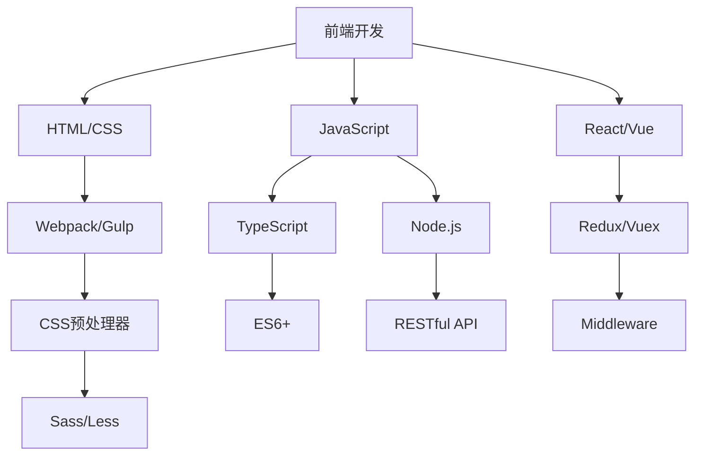

                 

关键词：知识付费、财富倍增、程序员、技能提升、市场竞争力、在线教育、知识变现

## 摘要

在当今快速发展的数字时代，知识付费成为了一种新型的商业模式，为广大程序员提供了广阔的财富增长途径。本文将深入探讨程序员如何利用知识付费实现财富倍增，通过分析市场趋势、核心技能提升策略以及有效的知识变现方法，为读者提供实用的指导和建议。

## 1. 背景介绍

### 1.1 知识付费的概念

知识付费指的是用户为了获取特定知识、技能或信息而向内容提供者支付的费用。随着互联网技术的发展，在线教育平台、专业课程、在线咨询服务等知识付费模式逐渐普及，为用户提供了便捷的学习渠道。

### 1.2 程序员市场现状

程序员的职业地位逐年上升，但其市场需求和竞争也日益激烈。掌握前沿技术、提升自身竞争力成为程序员职业发展的关键。知识付费为程序员提供了学习和提升技能的机会，同时也为有经验的专业人士提供了知识变现的平台。

## 2. 核心概念与联系

### 2.1 知识付费模式


### 2.2 程序员技能图谱



### 2.3 知识付费对程序员职业发展的影响

知识付费不仅能够帮助程序员快速提升技能，还能够增强其市场竞争力，为职业发展打开新的通道。

## 3. 核心算法原理 & 具体操作步骤

### 3.1 算法原理概述

程序员利用知识付费实现财富倍增的核心在于：

- 持续学习：通过知识付费平台获取前沿技术知识。
- 技能展示：通过实战项目和作品集展示专业技能。
- 知识变现：通过线上咨询服务、课程讲授等方式将知识转化为收入。

### 3.2 算法步骤详解

1. **选择合适的知识付费平台**：根据个人兴趣和职业发展方向，选择专业的在线教育平台，如慕课网、极客时间等。

2. **制定学习计划**：结合自身实际情况，制定详细的学习计划，确保能够系统地提升技能。

3. **参与实战项目**：通过参与实际项目，将所学知识应用到实践中，提高解决实际问题的能力。

4. **构建作品集**：整理和展示个人作品，通过作品集展示自身技能和项目经验。

5. **提供咨询服务**：通过在线平台提供专业咨询服务，如技术解答、项目指导等。

6. **开展线上课程**：针对特定技术领域，开展线上课程，将知识分享给更多人，实现知识变现。

### 3.3 算法优缺点

- 优点：灵活性强，时间自由；学习资源丰富，提高技能效率。
- 缺点：自制力要求高，需避免学习拖延；线上课程质量参差不齐，需谨慎选择。

### 3.4 算法应用领域

- **前端开发**：HTML/CSS、JavaScript、Vue/React等。
- **后端开发**：Node.js、Django、Spring Boot等。
- **移动开发**：Android、iOS、Flutter等。
- **云计算与大数据**：AWS、Azure、Hadoop、Spark等。

## 4. 数学模型和公式 & 详细讲解 & 举例说明

### 4.1 数学模型构建

知识付费收益 \( R \) 的数学模型可以表示为：

\[ R = f(S, P, L) \]

其中，\( S \) 代表技能水平，\( P \) 代表市场潜力，\( L \) 代表学习投入。

### 4.2 公式推导过程

- 技能水平 \( S \)：通过知识付费提升技能，技能水平随学习时间增加而提高。
- 市场潜力 \( P \)：受市场需求、行业趋势等因素影响，可通过数据分析预测。
- 学习投入 \( L \)：包括时间、金钱和精力，直接影响知识付费效果。

### 4.3 案例分析与讲解

以前端开发领域为例，假设一名程序员通过知识付费平台系统学习了React和Vue.js，并成功应用于实际项目中。其技能水平 \( S \) 提高，市场潜力 \( P \) 增加，通过提供咨询服务和线上课程实现知识变现，其收益 \( R \) 有显著提升。

## 5. 项目实践：代码实例和详细解释说明

### 5.1 开发环境搭建

- 选择合适的在线教育平台，如慕课网。
- 注册账号，选择适合的前端开发课程。

### 5.2 源代码详细实现

以下是一个简单的React组件示例：

```jsx
import React from 'react';

function Greeting({ name }) {
  return (
    <div>
      <h1>Hello, {name}!</h1>
    </div>
  );
}

export default Greeting;
```

### 5.3 代码解读与分析

此组件展示了一个简单的Greeting组件，用于展示用户的姓名。通过React的组件化思想，实现复用和可维护性。

### 5.4 运行结果展示

在React应用中，当渲染Greeting组件并传递`name`属性时，将显示对应的问候语。

```jsx
import Greeting from './Greeting';

function App() {
  return (
    <div>
      <Greeting name="Alice" />
    </div>
  );
}

export default App;
```

## 6. 实际应用场景

### 6.1 企业技术培训

企业可以通过知识付费平台为员工提供专业的技术培训，提升整体技术实力。

### 6.2 独立开发者变现

独立开发者可以通过线上课程和咨询服务实现知识变现，拓宽收入渠道。

### 6.3 技术社区共建

技术社区可以通过知识付费模式，为会员提供高质量的内容和服务。

## 7. 未来应用展望

### 7.1 技术发展推动知识付费

随着人工智能、大数据等技术的不断发展，知识付费模式将更加智能化和个性化。

### 7.2 新兴领域爆发

5G、物联网等新兴领域将为程序员提供更多机会，知识付费市场潜力巨大。

### 7.3 知识变现多样化

未来，知识变现的方式将更加多样化，如知识付费直播、知识付费短视频等。

## 8. 工具和资源推荐

### 8.1 学习资源推荐

- 慕课网：提供丰富的编程课程和实战项目。
- 极客时间：聚焦技术领域的深度学习内容。

### 8.2 开发工具推荐

- Visual Studio Code：优秀的代码编辑器。
- Git：版本控制系统。

### 8.3 相关论文推荐

- 《大规模在线教育中的知识付费模式研究》
- 《知识付费背景下程序员职业发展策略分析》

## 9. 总结：未来发展趋势与挑战

### 9.1 研究成果总结

知识付费已成为程序员提升技能和实现财富倍增的重要途径。

### 9.2 未来发展趋势

知识付费将继续增长，技术发展将推动新模式的出现。

### 9.3 面临的挑战

内容质量、个性化推荐和用户信任是未来需要解决的关键问题。

### 9.4 研究展望

未来研究应关注知识付费的可持续发展和用户体验优化。

## 10. 附录：常见问题与解答

### 10.1 知识付费是否值得投入？

值得。知识付费能够快速提升技能，提高市场竞争力，长期来看具有显著的收益。

### 10.2 如何选择知识付费平台？

选择专业、课程丰富、用户评价好的平台，根据个人需求和兴趣进行选择。

### 10.3 知识付费是否适用于所有程序员？

适合。不同层次的程序员都可以通过知识付费提升技能，实现个人价值。

---

作者：禅与计算机程序设计艺术 / Zen and the Art of Computer Programming

本文旨在为程序员提供利用知识付费实现财富倍增的实用指导，希望对广大程序员朋友有所帮助。随着技术的不断进步，知识付费将为程序员创造更多的机会，让我们共同迎接这个充满机遇的未来。

