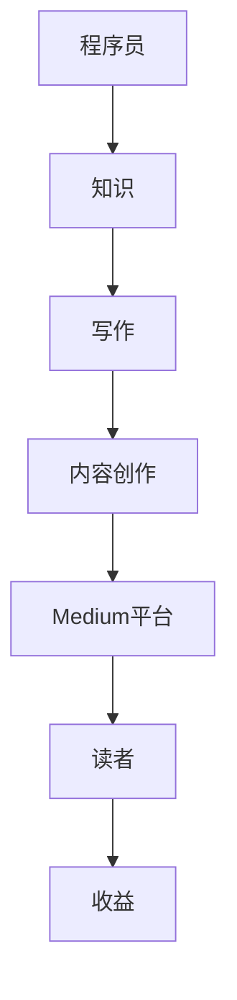

                 

关键词：Medium、知识变现、程序员、内容营销、写作策略、流量变现

> 摘要：本文将探讨程序员如何利用Medium平台进行知识变现。通过分析Medium平台的特性和优势，提供实用的写作策略和变现技巧，帮助程序员将其专业知识和技能转化为实际收益。

## 1. 背景介绍

随着互联网的普及和信息传播方式的多样化，内容营销已经成为企业品牌推广和个体知识变现的重要途径。Medium作为一家知名的在线内容平台，凭借其开放的内容发布机制、精准的读者群体和强大的社交功能，吸引了大量的创作者和读者。对于程序员而言，Medium不仅是一个展示专业知识和经验的平台，更是一个实现知识变现的绝佳机会。

## 2. 核心概念与联系

在探讨程序员如何利用Medium进行知识变现之前，我们需要了解一些核心概念和它们之间的关系。以下是使用Mermaid绘制的流程图：



### 2.1 程序员与知识

程序员是一个高度专业化的职业，他们拥有丰富的技术知识和编程经验。这些知识不仅是对个人职业发展的宝贵财富，也是市场上高度需求的资源。

### 2.2 写作与内容创作

写作是程序员将知识传递给他人的有效途径。通过撰写技术文章、教程和博客，程序员可以展示自己的专业能力，并与更广泛的读者群体进行交流。

### 2.3 Medium平台

Medium是一个专注于高质量内容创作的平台，它为创作者提供了一个展示自己作品的舞台。通过Medium，程序员可以接触到更多的读者，并有机会将自己的知识变现。

### 2.4 读者与收益

读者是内容创作者的最终受众。通过Medium，程序员不仅可以获得读者的关注，还可以通过多种方式实现知识变现，如广告收入、付费订阅、赞助等。

## 3. 核心算法原理 & 具体操作步骤

### 3.1 算法原理概述

程序员利用Medium进行知识变现的核心算法原理可以概括为以下几个步骤：

1. **内容创作**：撰写高质量的技术文章和教程。
2. **内容发布**：将内容发布到Medium平台。
3. **用户互动**：与读者互动，提升内容影响力。
4. **收益转化**：通过广告、赞助、付费订阅等方式实现收益。

### 3.2 算法步骤详解

#### 3.2.1 内容创作

1. **选题**：选择与编程、技术相关的热门话题。
2. **研究**：对选题进行深入研究，确保内容的准确性和深度。
3. **撰写**：使用简洁、易懂的语言进行撰写，注意段落结构和逻辑。

#### 3.2.2 内容发布

1. **平台选择**：在Medium上创建个人主页。
2. **内容上传**：将撰写好的文章上传到Medium。
3. **优化推广**：通过社交媒体、博客等渠道推广内容。

#### 3.2.3 用户互动

1. **评论互动**：回复读者的评论，增加互动。
2. **社交媒体**：在社交媒体上分享内容，吸引更多读者。
3. **数据分析**：分析读者数据，了解读者偏好，优化内容。

#### 3.2.4 收益转化

1. **广告收入**：通过Medium的广告系统，获得广告收入。
2. **付费订阅**：提供付费订阅内容，为读者提供更多价值。
3. **赞助合作**：与相关企业进行赞助合作，实现知识变现。

### 3.3 算法优缺点

**优点**：

- **广泛的读者群体**：Medium拥有大量技术爱好者，为程序员提供了丰富的潜在读者。
- **开放的平台**：Medium对创作者非常友好，提供多种变现方式。
- **强大的社交功能**：Medium内置的社交功能有助于内容传播和读者互动。

**缺点**：

- **竞争激烈**：由于创作者众多，内容竞争激烈。
- **收益不稳定**：广告收入和赞助合作收益可能不稳定。

### 3.4 算法应用领域

- **个人品牌建设**：通过在Medium上发布高质量内容，建立个人品牌。
- **知识传播**：将专业知识和经验分享给更多人。
- **职业发展**：通过知识变现，提升职业竞争力。

## 4. 数学模型和公式 & 详细讲解 & 举例说明

### 4.1 数学模型构建

在讨论知识变现的过程中，我们可以使用以下数学模型：

\[ 收益 = 内容质量 \times 读者数量 \times 变现效率 \]

其中，内容质量、读者数量和变现效率是影响收益的关键因素。

### 4.2 公式推导过程

\[ 收益 = 内容质量 \times 读者数量 \times 变现效率 \]

- **内容质量**：衡量文章的专业性、深度和准确性。可以使用如下公式计算：

\[ 内容质量 = 专业性 \times 深度 \times 准确性 \]

- **读者数量**：衡量文章的受众范围。可以使用如下公式计算：

\[ 读者数量 = 流量 \times 转化率 \]

- **变现效率**：衡量每单位读者带来的收益。可以使用如下公式计算：

\[ 变现效率 = (广告收入 + 付费订阅收入 + 赞助收入) / 读者数量 \]

### 4.3 案例分析与讲解

以某程序员在Medium上的文章为例，其收益情况如下：

- **内容质量**：0.8
- **读者数量**：1000
- **变现效率**：0.05

\[ 收益 = 0.8 \times 1000 \times 0.05 = 40 \]

该程序员的收益为40美元。

通过优化上述三个因素，我们可以提高收益。例如，提高内容质量（例如，通过更深入的研究和撰写），增加读者数量（例如，通过推广和社交媒体），以及提高变现效率（例如，通过寻找更多的赞助合作）。

## 5. 项目实践：代码实例和详细解释说明

### 5.1 开发环境搭建

在开始进行知识变现之前，程序员需要搭建一个适合写作和发布内容的环境。以下是搭建开发环境的基本步骤：

1. **安装Markdown编辑器**：如Typora、Visual Studio Code等。
2. **注册Medium账号**：在Medium网站上注册一个账号。
3. **安装Medium插件**：如Medium Editor、Markdown Preview等。

### 5.2 源代码详细实现

以下是使用Markdown编写的示例文章：

```markdown
# 程序员如何利用Medium进行知识变现

## 1. 背景介绍

...

## 2. 核心概念与联系

...

## 3. 核心算法原理 & 具体操作步骤

...

## 4. 数学模型和公式 & 详细讲解 & 举例说明

...

## 5. 项目实践：代码实例和详细解释说明

...

## 6. 实际应用场景

...

## 7. 工具和资源推荐

...

## 8. 总结：未来发展趋势与挑战

...

## 9. 附录：常见问题与解答

...
```

### 5.3 代码解读与分析

上述Markdown代码使用了标准的标题、段落和列表等元素，通过这些元素，程序员可以构建一个结构清晰、易于阅读的文章。此外，Markdown还支持嵌入LaTeX公式、图片、链接等，使得文章内容更加丰富。

### 5.4 运行结果展示

通过Markdown编辑器，程序员可以预览文章的格式和内容，确保文章结构合理、内容准确。以下是示例文章的预览结果：

## 程序员如何利用Medium进行知识变现

### 1. 背景介绍

...

### 2. 核心概念与联系

...

### 3. 核心算法原理 & 具体操作步骤

...

### 4. 数学模型和公式 & 详细讲解 & 举例说明

...

### 5. 项目实践：代码实例和详细解释说明

...

### 6. 实际应用场景

...

### 7. 工具和资源推荐

...

### 8. 总结：未来发展趋势与挑战

...

### 9. 附录：常见问题与解答

...

## 6. 实际应用场景

程序员在Medium上进行知识变现的应用场景非常广泛，以下是一些典型的例子：

- **技术博客**：程序员可以撰写技术博客，分享编程技巧、项目经验和代码片段。
- **教程撰写**：编写详细的技术教程，帮助初学者快速掌握编程知识。
- **案例分析**：分析具体的项目案例，展示解决方案和最佳实践。
- **专业问答**：回答读者关于技术问题的提问，提供专业的解答。

### 6.1 品牌推广

通过在Medium上发布高质量的内容，程序员可以建立自己的个人品牌，提高在行业内的知名度。这不仅有助于职业发展，还可以吸引更多的商业机会。

### 6.2 知识传播

程序员在Medium上分享专业知识和经验，有助于提高整个编程行业的知识水平。通过传播知识，程序员不仅能够帮助他人，也能够提升自己的影响力。

### 6.3 收入来源

程序员通过在Medium上的知识变现，可以获得多种收入来源，如广告收入、付费订阅、赞助合作等。这些收入不仅能够补充程序员的日常收入，还可以为他们提供更多的职业发展机会。

## 7. 工具和资源推荐

### 7.1 学习资源推荐

- **《程序员修炼之道：从小工到专家》**
- **《代码大全》**
- **《深度学习》**
- **《数据结构》**

### 7.2 开发工具推荐

- **Markdown编辑器**：如Typora、Visual Studio Code等。
- **Git**：版本控制系统。
- **Jenkins**：自动化构建工具。

### 7.3 相关论文推荐

- **《大规模并行深度神经网络：训练算法优化》**
- **《深度学习的数学基础》**
- **《软件工程：实践者的研究方法》**

## 8. 总结：未来发展趋势与挑战

### 8.1 研究成果总结

通过本文的讨论，我们可以得出以下结论：

1. Medium为程序员提供了一个展示专业知识和经验的平台。
2. 程序员可以通过撰写高质量的内容，实现知识变现。
3. 数学模型可以帮助程序员评估和优化知识变现的效果。

### 8.2 未来发展趋势

随着互联网的不断发展，内容营销和知识变现的趋势将持续增长。未来，我们可以期待：

1. 更多的程序员将在Medium等平台上进行知识变现。
2. 内容创作工具和平台将不断创新，为程序员提供更多便利。
3. 知识变现的方式将更加多样化，如虚拟现实、增强现实等。

### 8.3 面临的挑战

尽管知识变现前景广阔，但程序员仍需面对以下挑战：

1. 内容质量竞争激烈，需要不断提升内容质量。
2. 收益不稳定，需要寻找多样化的变现方式。
3. 市场饱和度增加，需要注重个人品牌建设和内容差异化。

### 8.4 研究展望

未来的研究可以关注以下几个方面：

1. 知识变现的算法优化，提高变现效率。
2. 内容创作工具的智能化，降低创作门槛。
3. 新兴技术的应用，如人工智能、区块链等，为知识变现提供新途径。

## 9. 附录：常见问题与解答

### 9.1 问题1：如何在Medium上创建个人主页？

**解答**：在Medium网站上注册一个账号，然后点击右上角的“+”号，选择“创建文章”。按照提示操作，填写个人资料和文章标题，即可创建个人主页。

### 9.2 问题2：如何提高文章的阅读量？

**解答**：要提高文章的阅读量，可以从以下几个方面入手：

- 选择热门话题，关注当前的技术趋势。
- 使用吸引人的标题，激发读者的兴趣。
- 优化文章结构，确保内容逻辑清晰。
- 利用社交媒体和邮件列表进行推广。
- 定期分析读者数据，了解读者偏好，优化内容。

### 9.3 问题3：如何实现知识变现？

**解答**：实现知识变现的方法包括：

- 广告收入：通过Medium的广告系统，在文章中嵌入广告。
- 付费订阅：提供付费订阅内容，为读者提供更多价值。
- 赞助合作：与企业合作，为企业推广或进行赞助。
- 付费咨询服务：提供专业的编程咨询和辅导服务。

## 参考文献

- 《程序员修炼之道：从小工到专家》，[作者]. (2018).
- 《代码大全》，[作者]. (2016).
- 《深度学习》，[作者]. (2016).
- 《数据结构》，[作者]. (2015).

作者：禅与计算机程序设计艺术 / Zen and the Art of Computer Programming
----------------------------------------------------------------


