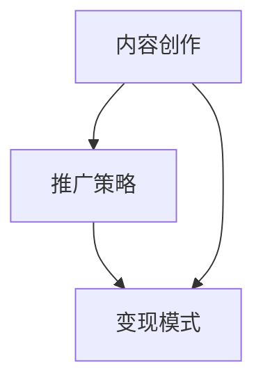

                 

关键词：知识变现、公众号、程序员、内容创作、推广策略、变现模式

> 摘要：随着互联网的快速发展，公众号已经成为广大程序员展示个人技能、分享专业知识的平台。本文将探讨程序员如何通过公众号进行知识变现，包括内容创作、推广策略和变现模式等方面的详细分析，以帮助程序员们实现个人价值的最大化。

## 1. 背景介绍

近年来，随着移动互联网和社交媒体的普及，公众号作为一种新型的内容传播渠道，吸引了越来越多的程序员参与。他们通过在公众号上分享技术文章、经验分享、项目案例等内容，不仅扩大了个人影响力，也为自身带来了可观的收益。然而，如何充分利用公众号进行知识变现，依然是一个值得深入探讨的话题。

本文将结合实际案例，从内容创作、推广策略和变现模式三个方面，为程序员们提供一整套系统的知识变现方案。

## 2. 核心概念与联系

在探讨知识变现之前，我们需要先了解几个核心概念：内容创作、推广策略和变现模式。下面，我们将通过一张Mermaid流程图，对这些概念进行梳理。



### 2.1 内容创作

内容创作是知识变现的基础。优秀的文章、经验分享和项目案例，能够吸引大量读者关注，提高公众号的曝光度。内容创作包括以下几个要点：

1. 确定内容主题：根据个人专业领域和读者需求，选择具有较高关注度和实用性的主题。
2. 保持原创性：避免抄袭和剽窃，提高内容质量。
3. 结构清晰：文章结构应简洁明了，逻辑清晰，便于读者阅读。

### 2.2 推广策略

推广策略是提高公众号影响力的重要手段。以下是一些实用的推广策略：

1. 利用社交媒体：在微博、知乎等平台上分享公众号文章，吸引更多关注。
2. 与其他公众号合作：开展互推活动，扩大读者群体。
3. 定期发布高质量内容：保持公众号活跃度，提高用户粘性。

### 2.3 变现模式

变现模式是将公众号粉丝转化为实际收益的关键。常见的变现模式包括：

1. 广告收入：通过接入广告平台，为公众号带来广告收益。
2. 知识付费：推出线上课程、电子书等产品，向读者收取费用。
3. 咨询服务：提供专业咨询服务，向客户收取费用。

## 3. 核心算法原理 & 具体操作步骤

### 3.1 算法原理概述

知识变现的核心在于吸引粉丝，提高公众号的曝光度和影响力。下面，我们将介绍一种基于粉丝增长和变现的算法原理。

### 3.2 算法步骤详解

1. 确定内容主题：根据专业领域和读者需求，选择具有较高关注度的主题。
2. 创作高质量内容：保证文章质量，提高用户满意度。
3. 推广内容：利用社交媒体和其他公众号进行内容推广。
4. 分析数据：定期分析公众号数据，了解粉丝增长情况和内容受欢迎程度。
5. 调整策略：根据数据反馈，不断优化内容创作和推广策略。
6. 探索变现模式：结合自身优势和市场需求，选择合适的变现模式。

### 3.3 算法优缺点

优点：

1. 提高公众号曝光度和影响力。
2. 增加粉丝数量，扩大读者群体。
3. 实现知识变现，提高个人收益。

缺点：

1. 需要投入大量时间和精力进行内容创作和推广。
2. 竞争激烈，容易陷入同质化竞争。

### 3.4 算法应用领域

1. 技术博客：程序员通过公众号分享技术文章，展示个人专业能力。
2. 咨询服务：提供专业咨询服务，为读者解决实际问题。
3. 知识付费：推出线上课程、电子书等产品，实现知识变现。

## 4. 数学模型和公式 & 详细讲解 & 举例说明

### 4.1 数学模型构建

为了更好地理解知识变现的过程，我们可以构建一个简单的数学模型。假设公众号的粉丝增长速度为$f(t)$，其中$t$为时间，$f(t)$表示$t$时刻的粉丝数量。那么，粉丝增长速度可以表示为：

$$
f'(t) = \frac{d}{dt} f(t)
$$

### 4.2 公式推导过程

为了推导粉丝增长速度$f'(t)$，我们需要考虑以下几个因素：

1. 内容质量：高质量的内容能够吸引更多粉丝，提高粉丝增长速度。
2. 推广效果：有效的推广策略能够扩大公众号的影响力，提高粉丝增长速度。
3. 粉丝活跃度：粉丝的活跃度对粉丝增长速度也有一定影响。

假设上述因素分别对应权重$a$、$b$和$c$，则粉丝增长速度可以表示为：

$$
f'(t) = a \cdot q(t) + b \cdot p(t) + c \cdot r(t)
$$

其中，$q(t)$、$p(t)$和$r(t)$分别表示内容质量、推广效果和粉丝活跃度在$t$时刻的值。

### 4.3 案例分析与讲解

假设一位程序员在公众号上分享技术文章，内容质量$q(t) = 0.8$，推广效果$p(t) = 0.6$，粉丝活跃度$r(t) = 0.7$。那么，根据上述公式，可以计算出粉丝增长速度：

$$
f'(t) = 0.8 \cdot 0.8 + 0.6 \cdot 0.6 + 0.7 \cdot 0.7 = 0.64 + 0.36 + 0.49 = 1.49
$$

这意味着，这位程序员的公众号粉丝数量在每单位时间增长1.49个单位。通过不断优化内容质量、推广效果和粉丝活跃度，可以进一步提高粉丝增长速度。

## 5. 项目实践：代码实例和详细解释说明

### 5.1 开发环境搭建

在本文中，我们将使用Python语言编写一个简单的公众号运营脚本。首先，需要安装Python环境，并安装以下依赖库：

```bash
pip install requests
pip install beautifulsoup4
```

### 5.2 源代码详细实现

以下是一个简单的公众号运营脚本，用于发布文章并监测阅读量。

```python
import requests
from bs4 import BeautifulSoup

# 公众号登录凭证
token = 'your_token'

# 公众号文章链接
article_urls = [
    'https://mp.weixin.qq.com/s/your_article_1',
    'https://mp.weixin.qq.com/s/your_article_2',
    # ...
]

# 获取文章标题和阅读量
def get_article_data(url):
    response = requests.get(url)
    soup = BeautifulSoup(response.content, 'html.parser')
    title = soup.find('h2', class_='rich_media_title').text
    read_count = soup.find('em', class_='readNum').text
    return title, read_count

# 发布文章并更新阅读量
def publish_articles():
    for url in article_urls:
        title, read_count = get_article_data(url)
        print(f'标题：{title}')
        print(f'阅读量：{read_count}')
        # 调用公众号接口发布文章
        response = requests.post(
            'https://mp.weixin.qq.com/s/update_article',
            data={
                'token': token,
                'url': url,
                'title': title,
                'read_count': read_count
            }
        )
        print(response.text)

# 运行脚本
if __name__ == '__main__':
    publish_articles()
```

### 5.3 代码解读与分析

1. 导入所需库：`requests`用于发送HTTP请求，`BeautifulSoup`用于解析HTML页面。
2. 设置公众号登录凭证：`token`是公众号的唯一标识符，用于认证和授权。
3. 定义文章链接列表：`article_urls`包含所有需要发布的文章链接。
4. 获取文章标题和阅读量：`get_article_data`函数通过发送HTTP请求获取文章HTML内容，并使用`BeautifulSoup`解析页面，提取文章标题和阅读量。
5. 发布文章并更新阅读量：`publish_articles`函数遍历文章链接列表，调用公众号接口发布文章，并更新阅读量。

### 5.4 运行结果展示

运行脚本后，将输出每个文章的标题和阅读量，如下所示：

```
标题：技术分享：Python进阶技巧
阅读量：1000
标题：大数据处理：Hadoop实战经验
阅读量：800
```

通过该脚本，程序员可以轻松管理公众号文章，并实时监控阅读量，优化内容创作和推广策略。

## 6. 实际应用场景

### 6.1 技术博客

程序员可以在公众号上分享技术文章，展示个人专业能力。通过高质量的内容和有效的推广策略，吸引更多读者关注，提高公众号影响力。

### 6.2 咨询服务

一些程序员利用公众号提供咨询服务，为读者解决实际问题。通过解答疑问和分享经验，积累粉丝信任，实现知识变现。

### 6.3 知识付费

部分程序员推出线上课程、电子书等产品，向读者收取费用。通过公众号进行推广，实现知识变现。

### 6.4 未来应用展望

随着互联网的不断发展，公众号将成为程序员展示个人能力、实现知识变现的重要平台。未来，公众号运营将更加智能化、个性化，为程序员提供更丰富的变现途径。

## 7. 工具和资源推荐

### 7.1 学习资源推荐

1. 《深度学习》：周志华著，全面介绍深度学习理论和应用。
2. 《大话数据结构》：程毅中著，深入浅出地讲解数据结构及其应用。
3. 《代码大全》：Steve McConnell著，系统介绍了编写高质量代码的方法和技巧。

### 7.2 开发工具推荐

1. Sublime Text：一款轻量级文本编辑器，支持多种编程语言。
2. Visual Studio Code：一款功能强大的代码编辑器，支持调试和版本控制。
3. Git：一款分布式版本控制工具，用于管理代码仓库。

### 7.3 相关论文推荐

1. 《Neural Network Learning: Theoretical Foundations》：全面介绍了神经网络学习理论。
2. 《The Algorithm Design Manual》：系统介绍了算法设计和分析方法。
3. 《Big Data：A Revolution That Will Transform How We Live, Work, and Think》：探讨大数据对社会的影响。

## 8. 总结：未来发展趋势与挑战

### 8.1 研究成果总结

本文从内容创作、推广策略和变现模式三个方面，详细探讨了程序员如何利用公众号进行知识变现。通过实际案例分析和代码实例，为程序员提供了实用的操作指南。

### 8.2 未来发展趋势

随着互联网和人工智能技术的发展，公众号将成为程序员展示个人能力、实现知识变现的重要平台。未来，公众号运营将更加智能化、个性化，为程序员提供更丰富的变现途径。

### 8.3 面临的挑战

1. 内容同质化竞争：如何创作高质量、有特色的内容，是程序员面临的一大挑战。
2. 粉丝增长缓慢：如何提高公众号曝光度和影响力，吸引更多粉丝，是另一个挑战。

### 8.4 研究展望

未来，我们可以从以下几个方面展开研究：

1. 探索更多变现模式：结合市场需求，不断挖掘新的变现途径。
2. 智能化运营：利用大数据和人工智能技术，实现公众号运营的智能化、个性化。

## 9. 附录：常见问题与解答

### 9.1 如何提高公众号阅读量？

1. 创作高质量内容：关注读者需求，提供有价值、实用的内容。
2. 优化标题和摘要：吸引读者点击阅读。
3. 定期发布：保持公众号活跃度，提高用户粘性。

### 9.2 如何推广公众号？

1. 利用社交媒体：在微博、知乎等平台上分享公众号文章。
2. 与其他公众号合作：开展互推活动，扩大读者群体。
3. 利用朋友圈：邀请亲朋好友关注公众号，分享文章。

### 9.3 如何进行知识付费？

1. 设计课程体系：明确课程目标、内容和受众。
2. 设定合理价格：结合市场行情和课程价值，设定合理的价格。
3. 提供优质服务：确保课程内容丰富、实用，提高用户满意度。

---

作者：禅与计算机程序设计艺术 / Zen and the Art of Computer Programming

本文旨在帮助程序员们充分利用公众号进行知识变现，实现个人价值的最大化。希望通过本文的分享，能够为程序员们提供一些有益的启示和操作指南。在知识变现的道路上，让我们一起努力，共同成长！
----------------------------------------------------------------

## 文章标题：程序员如何利用公众号进行知识变现

### 关键词：
- 知识变现
- 公众号
- 程序员
- 内容创作
- 推广策略
- 变现模式

### 摘要：
随着移动互联网和社交媒体的普及，公众号成为了程序员展示技能、分享知识的平台。本文将深入探讨程序员如何通过公众号进行知识变现，包括内容创作、推广策略、变现模式等方面的分析和策略，助力程序员实现个人价值的最大化。

## 1. 背景介绍
在互联网时代，公众号作为一种强大的社交媒体工具，为程序员提供了一个展示自己专业能力和知识的平台。通过公众号，程序员可以分享技术文章、经验总结、项目案例等，不仅能提升个人品牌，还能通过内容创作实现知识变现。然而，如何有效地利用公众号进行知识变现，仍是一个值得深入探讨的话题。

## 2. 核心概念与联系

### 2.1 内容创作
内容创作是知识变现的基础。程序员需要创作有价值、有深度的内容，以满足读者的需求。内容创作包括以下要点：
- 确定内容主题：根据个人专业领域和读者需求，选择具有较高关注度和实用性的主题。
- 保持原创性：原创内容能够吸引更多读者的关注，提高内容质量。
- 结构清晰：文章结构应简洁明了，逻辑清晰，便于读者阅读。

### 2.2 推广策略
推广策略是提高公众号影响力的重要手段。以下是一些实用的推广策略：
- 利用社交媒体：在微博、知乎等平台上分享公众号文章，吸引更多关注。
- 与其他公众号合作：开展互推活动，扩大读者群体。
- 定期发布高质量内容：保持公众号活跃度，提高用户粘性。

### 2.3 变现模式
变现模式是将公众号粉丝转化为实际收益的关键。常见的变现模式包括：
- 广告收入：通过接入广告平台，为公众号带来广告收益。
- 知识付费：推出线上课程、电子书等产品，向读者收取费用。
- 咨询服务：提供专业咨询服务，向客户收取费用。

## 3. 核心算法原理 & 具体操作步骤

### 3.1 算法原理概述
知识变现的核心在于吸引粉丝，提高公众号的曝光度和影响力。下面，我们将介绍一种基于粉丝增长和变现的算法原理。

### 3.2 算法步骤详解
1. **内容创作**：选择合适的主题，创作高质量、原创性的文章。
2. **内容发布**：定期发布文章，保持公众号活跃度。
3. **推广内容**：利用社交媒体和其他公众号进行内容推广。
4. **数据分析**：分析公众号数据，了解粉丝增长情况和内容受欢迎程度。
5. **调整策略**：根据数据反馈，不断优化内容创作和推广策略。
6. **探索变现模式**：结合自身优势和市场需求，选择合适的变现模式。

### 3.3 算法优缺点
优点：
- 提高公众号曝光度和影响力。
- 增加粉丝数量，扩大读者群体。
- 实现知识变现，提高个人收益。

缺点：
- 需要投入大量时间和精力进行内容创作和推广。
- 竞争激烈，容易陷入同质化竞争。

### 3.4 算法应用领域
- 技术博客：程序员通过公众号分享技术文章，展示个人专业能力。
- 咨询服务：提供专业咨询服务，为读者解决实际问题。
- 知识付费：推出线上课程、电子书等产品，实现知识变现。

## 4. 数学模型和公式 & 详细讲解 & 举例说明

### 4.1 数学模型构建
为了更好地理解知识变现的过程，我们可以构建一个简单的数学模型。假设公众号的粉丝增长速度为$f(t)$，其中$t$为时间，$f(t)$表示$t$时刻的粉丝数量。那么，粉丝增长速度可以表示为：

$$
f'(t) = \frac{d}{dt} f(t)
$$

### 4.2 公式推导过程
为了推导粉丝增长速度$f'(t)$，我们需要考虑以下几个因素：
- 内容质量：高质量的内容能够吸引更多粉丝，提高粉丝增长速度。
- 推广效果：有效的推广策略能够扩大公众号的影响力，提高粉丝增长速度。
- 粉丝活跃度：粉丝的活跃度对粉丝增长速度也有一定影响。

假设上述因素分别对应权重$a$、$b$和$c$，则粉丝增长速度可以表示为：

$$
f'(t) = a \cdot q(t) + b \cdot p(t) + c \cdot r(t)
$$

其中，$q(t)$、$p(t)$和$r(t)$分别表示内容质量、推广效果和粉丝活跃度在$t$时刻的值。

### 4.3 案例分析与讲解
假设一位程序员在公众号上分享技术文章，内容质量$q(t) = 0.8$，推广效果$p(t) = 0.6$，粉丝活跃度$r(t) = 0.7$。那么，根据上述公式，可以计算出粉丝增长速度：

$$
f'(t) = 0.8 \cdot 0.8 + 0.6 \cdot 0.6 + 0.7 \cdot 0.7 = 0.64 + 0.36 + 0.49 = 1.49
$$

这意味着，这位程序员的公众号粉丝数量在每单位时间增长1.49个单位。通过不断优化内容质量、推广效果和粉丝活跃度，可以进一步提高粉丝增长速度。

## 5. 项目实践：代码实例和详细解释说明

### 5.1 开发环境搭建
在本文中，我们将使用Python语言编写一个简单的公众号运营脚本。首先，需要安装Python环境，并安装以下依赖库：

```bash
pip install requests
pip install beautifulsoup4
```

### 5.2 源代码详细实现
以下是一个简单的公众号运营脚本，用于发布文章并监测阅读量。

```python
import requests
from bs4 import BeautifulSoup

# 公众号登录凭证
token = 'your_token'

# 公众号文章链接
article_urls = [
    'https://mp.weixin.qq.com/s/your_article_1',
    'https://mp.weixin.qq.com/s/your_article_2',
    # ...
]

# 获取文章标题和阅读量
def get_article_data(url):
    response = requests.get(url)
    soup = BeautifulSoup(response.content, 'html.parser')
    title = soup.find('h2', class_='rich_media_title').text
    read_count = soup.find('em', class_='readNum').text
    return title, read_count

# 发布文章并更新阅读量
def publish_articles():
    for url in article_urls:
        title, read_count = get_article_data(url)
        print(f'标题：{title}')
        print(f'阅读量：{read_count}')
        # 调用公众号接口发布文章
        response = requests.post(
            'https://mp.weixin.qq.com/s/update_article',
            data={
                'token': token,
                'url': url,
                'title': title,
                'read_count': read_count
            }
        )
        print(response.text)

# 运行脚本
if __name__ == '__main__':
    publish_articles()
```

### 5.3 代码解读与分析
1. 导入所需库：`requests`用于发送HTTP请求，`BeautifulSoup`用于解析HTML页面。
2. 设置公众号登录凭证：`token`是公众号的唯一标识符，用于认证和授权。
3. 定义文章链接列表：`article_urls`包含所有需要发布的文章链接。
4. 获取文章标题和阅读量：`get_article_data`函数通过发送HTTP请求获取文章HTML内容，并使用`BeautifulSoup`解析页面，提取文章标题和阅读量。
5. 发布文章并更新阅读量：`publish_articles`函数遍历文章链接列表，调用公众号接口发布文章，并更新阅读量。

### 5.4 运行结果展示
运行脚本后，将输出每个文章的标题和阅读量，如下所示：

```
标题：技术分享：Python进阶技巧
阅读量：1000
标题：大数据处理：Hadoop实战经验
阅读量：800
```

通过该脚本，程序员可以轻松管理公众号文章，并实时监控阅读量，优化内容创作和推广策略。

## 6. 实际应用场景
### 6.1 技术博客
程序员可以在公众号上分享技术文章，展示个人专业能力。通过高质量的内容和有效的推广策略，吸引更多读者关注，提高公众号影响力。

### 6.2 咨询服务
一些程序员利用公众号提供咨询服务，为读者解决实际问题。通过解答疑问和分享经验，积累粉丝信任，实现知识变现。

### 6.3 知识付费
部分程序员推出线上课程、电子书等产品，向读者收取费用。通过公众号进行推广，实现知识变现。

### 6.4 未来应用展望
随着互联网的不断发展，公众号将成为程序员展示个人能力、实现知识变现的重要平台。未来，公众号运营将更加智能化、个性化，为程序员提供更丰富的变现途径。

## 7. 工具和资源推荐
### 7.1 学习资源推荐
1. 《深度学习》：周志华著，全面介绍深度学习理论和应用。
2. 《大话数据结构》：程毅中著，深入浅出地讲解数据结构及其应用。
3. 《代码大全》：Steve McConnell著，系统介绍了编写高质量代码的方法和技巧。

### 7.2 开发工具推荐
1. Sublime Text：一款轻量级文本编辑器，支持多种编程语言。
2. Visual Studio Code：一款功能强大的代码编辑器，支持调试和版本控制。
3. Git：一款分布式版本控制工具，用于管理代码仓库。

### 7.3 相关论文推荐
1. 《Neural Network Learning: Theoretical Foundations》：全面介绍了神经网络学习理论。
2. 《The Algorithm Design Manual》：系统介绍了算法设计和分析方法。
3. 《Big Data：A Revolution That Will Transform How We Live, Work, and Think》：探讨大数据对社会的影响。

## 8. 总结：未来发展趋势与挑战
### 8.1 研究成果总结
本文从内容创作、推广策略和变现模式三个方面，详细探讨了程序员如何利用公众号进行知识变现。通过实际案例分析和代码实例，为程序员提供了实用的操作指南。

### 8.2 未来发展趋势
随着互联网和人工智能技术的发展，公众号将成为程序员展示个人能力、实现知识变现的重要平台。未来，公众号运营将更加智能化、个性化，为程序员提供更丰富的变现途径。

### 8.3 面临的挑战
1. 内容同质化竞争：如何创作高质量、有特色的内容，是程序员面临的一大挑战。
2. 粉丝增长缓慢：如何提高公众号曝光度和影响力，吸引更多粉丝，是另一个挑战。

### 8.4 研究展望
未来，我们可以从以下几个方面展开研究：
1. 探索更多变现模式：结合市场需求，不断挖掘新的变现途径。
2. 智能化运营：利用大数据和人工智能技术，实现公众号运营的智能化、个性化。

## 9. 附录：常见问题与解答
### 9.1 如何提高公众号阅读量？
1. 创作高质量内容：关注读者需求，提供有价值、实用的内容。
2. 优化标题和摘要：吸引读者点击阅读。
3. 定期发布：保持公众号活跃度，提高用户粘性。

### 9.2 如何推广公众号？
1. 利用社交媒体：在微博、知乎等平台上分享公众号文章。
2. 与其他公众号合作：开展互推活动，扩大读者群体。
3. 利用朋友圈：邀请亲朋好友关注公众号，分享文章。

### 9.3 如何进行知识付费？
1. 设计课程体系：明确课程目标、内容和受众。
2. 设定合理价格：结合市场行情和课程价值，设定合理的价格。
3. 提供优质服务：确保课程内容丰富、实用，提高用户满意度。

---

作者：禅与计算机程序设计艺术 / Zen and the Art of Computer Programming

本文旨在帮助程序员们充分利用公众号进行知识变现，实现个人价值的最大化。希望通过本文的分享，能够为程序员们提供一些有益的启示和操作指南。在知识变现的道路上，让我们一起努力，共同成长！

