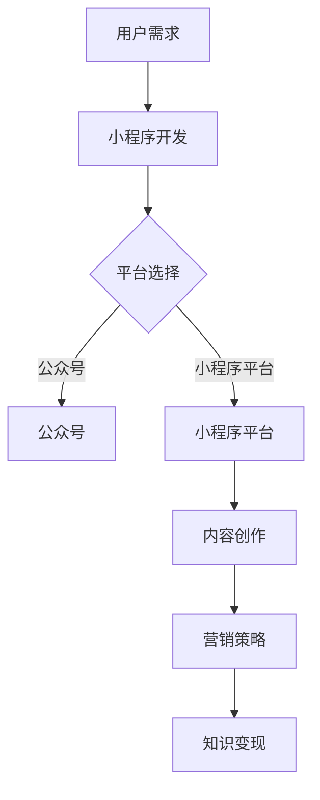

                 

关键词：小程序，知识变现，程序员，技术分享，平台建设

> 摘要：本文将探讨程序员如何通过小程序进行知识变现，包括小程序的开发过程、平台选择、内容创作、营销策略和未来展望。旨在帮助程序员利用自己的技术技能，实现知识变现，提升个人品牌和市场竞争力。

## 1. 背景介绍

随着移动互联网的快速发展，小程序成为了一个新的风口。小程序具有开发成本低、传播速度快、用户体验好等特点，吸引了大量用户和开发者。与此同时，知识付费市场的兴起，使得越来越多的程序员希望通过分享自己的技术知识和经验，实现知识变现。

然而，如何有效地利用小程序进行知识变现，成为了许多程序员面临的难题。本文将结合实际案例，为程序员提供一些建设性建议。

## 2. 核心概念与联系

### 2.1 小程序的定义与特点

小程序是微信推出的一种轻量级应用，用户无需下载安装即可使用。它具有以下特点：

- **开发成本低**：无需下载安装，减少开发成本。
- **传播速度快**：依托微信强大的用户基础，传播速度快。
- **用户体验好**：界面简洁，操作便捷，用户体验好。

### 2.2 知识变现的概念与形式

知识变现是指将个人的知识、技能和经验转化为经济收益的过程。程序员可以通过以下几种形式进行知识变现：

- **技术咨询**：提供专业咨询服务，如代码审计、性能优化等。
- **课程销售**：制作技术课程，在线销售。
- **知识付费**：通过公众号、小程序等平台，提供付费内容，如技术文章、实战案例等。

### 2.3 Mermaid 流程图



## 3. 核心算法原理 & 具体操作步骤

### 3.1 算法原理概述

小程序开发主要涉及以下几个步骤：

1. **需求分析**：明确用户需求，确定小程序的功能和特点。
2. **技术选型**：根据需求，选择合适的技术框架和开发工具。
3. **界面设计**：设计简洁、直观的界面，提高用户体验。
4. **功能实现**：根据需求，实现小程序的各种功能。
5. **测试与优化**：对小程序进行测试，发现问题并进行优化。

### 3.2 算法步骤详解

1. **需求分析**：

   - 与客户沟通，了解需求。

   ```mermaid
   graph TD
       A[与客户沟通] --> B[明确需求]
   ```

2. **技术选型**：

   - 选择小程序开发框架，如微信小程序框架。

   ```mermaid
   graph TD
       C[选择框架] --> D[微信小程序框架]
   ```

3. **界面设计**：

   - 设计简洁、直观的界面。

   ```mermaid
   graph TD
       E[设计界面] --> F[简洁直观]
   ```

4. **功能实现**：

   - 根据需求，实现小程序的各种功能。

   ```mermaid
   graph TD
       G[实现功能] --> H[需求功能]
   ```

5. **测试与优化**：

   - 对小程序进行测试，发现问题并进行优化。

   ```mermaid
   graph TD
       I[测试] --> J[发现问题]
       J --> K[优化]
   ```

### 3.3 算法优缺点

**优点**：

- **开发成本低**：无需下载安装，减少开发成本。
- **传播速度快**：依托微信强大的用户基础，传播速度快。
- **用户体验好**：界面简洁，操作便捷，用户体验好。

**缺点**：

- **功能受限**：小程序功能受限，难以实现复杂功能。
- **依赖平台**：小程序受制于平台，可能面临政策风险。

### 3.4 算法应用领域

小程序广泛应用于电商、社交、教育、医疗等多个领域，具有广泛的应用前景。

## 4. 数学模型和公式 & 详细讲解 & 举例说明

### 4.1 数学模型构建

在知识变现过程中，我们可以构建一个简单的数学模型，用于评估小程序的收益。

收益 \(R\) 可以表示为：

\[ R = P \times Q \times C \]

其中：

- \(P\)：客单价，即用户购买的平均价格。
- \(Q\)：购买量，即用户购买的数量。
- \(C\)：转化率，即用户访问小程序后，购买的概率。

### 4.2 公式推导过程

我们假设小程序的客单价为 100 元，购买量为 1000，转化率为 10%。则小程序的收益为：

\[ R = 100 \times 1000 \times 0.1 = 10000 \text{ 元} \]

### 4.3 案例分析与讲解

假设一个程序员开发了一个小程序，提供技术课程销售。根据市场调研，该课程的客单价为 200 元，预计每月有 1000 人访问小程序，转化率为 20%。

则小程序每月的收益为：

\[ R = 200 \times 1000 \times 0.2 = 40000 \text{ 元} \]

通过这个案例，我们可以看到，小程序为程序员提供了一种有效的知识变现途径。

## 5. 项目实践：代码实例和详细解释说明

### 5.1 开发环境搭建

首先，我们需要搭建小程序开发环境。这里以微信小程序为例，介绍开发环境的搭建。

1. 安装微信开发者工具：[https://developers.weixin.qq.com/miniprogram/dev/devtools/download.html](https://developers.weixin.qq.com/miniprogram/dev/devtools/download.html)
2. 创建小程序项目：在微信开发者工具中，选择“新建项目”，填写项目名称、目录等信息，点击“新建”。
3. 配置小程序登录：在 app.js 中，添加如下代码：

   ```javascript
   App({
     onLaunch: function () {
       wx.login({
         success: res => {
           wx.getUserInfo({
             success: res => {
               // 登录成功，将用户信息存储到数据库
             }
           })
         }
       })
     }
   })
   ```

### 5.2 源代码详细实现

以下是一个简单的小程序示例，实现一个课程销售页面。

```html
<!DOCTYPE html>
<html>
  <head>
    <meta charset="UTF-8" />
    <title>课程销售</title>
  </head>
  <body>
    <view class="container">
      <image src="{{courseImage}}" mode="aspectFit" />
      <text>{{courseName}}</text>
      <text>价格：{{coursePrice}}元</text>
      <button bindtap="buyCourse">购买课程</button>
    </view>
  </body>
</html>
```

```javascript
Page({
  data: {
    courseImage: "/images/course.jpg",
    courseName: "小程序开发实战",
    coursePrice: 200,
  },
  buyCourse: function () {
    // 跳转到支付页面
    wx.navigateTo({
      url: "/pages/pay/pay",
    });
  },
});
```

### 5.3 代码解读与分析

在这个小程序中，我们实现了一个简单的课程销售页面。页面中包含课程图片、课程名称和价格，以及一个购买按钮。点击购买按钮后，跳转到支付页面进行支付。

这个小程序的代码非常简单，但实现了课程销售的核心功能。通过这个例子，我们可以看到小程序开发的便捷性和实用性。

### 5.4 运行结果展示

运行这个小程序后，用户可以查看课程信息，并点击购买按钮进行支付。支付成功后，用户可以继续学习课程。

## 6. 实际应用场景

### 6.1 技术类课程

程序员可以制作各种技术类课程，如编程语言、框架、算法等，通过小程序进行销售。

### 6.2 技术分享

程序员可以制作技术分享内容，如博客文章、实战案例等，通过小程序进行发布和推广。

### 6.3 技术社群

程序员可以创建技术社群，如微信群、QQ 群等，通过小程序进行管理和互动。

## 7. 工具和资源推荐

### 7.1 学习资源推荐

- 《微信小程序开发实战》
- 《小程序开发指南》
- 《小程序前端开发》

### 7.2 开发工具推荐

- 微信开发者工具
- Visual Studio Code
- Git

### 7.3 相关论文推荐

- 《微信小程序的设计与实现》
- 《小程序平台的生态系统研究》
- 《基于小程序的知识变现模式研究》

## 8. 总结：未来发展趋势与挑战

### 8.1 研究成果总结

本文从背景介绍、核心概念与联系、核心算法原理、数学模型和公式、项目实践等多个方面，全面探讨了程序员如何利用小程序进行知识变现。

### 8.2 未来发展趋势

- 小程序将越来越成为知识变现的重要途径。
- 技术类课程、技术分享、技术社群将成为小程序的主要应用场景。
- 知识变现模式将不断创新，为程序员提供更多机会。

### 8.3 面临的挑战

- 小程序功能受限，难以满足复杂需求。
- 平台政策变化，可能影响小程序的运营。
- 知识变现市场竞争激烈，需要不断创新和优化。

### 8.4 研究展望

未来，我们可以从以下几个方面进行深入研究：

- 拓展小程序的功能，提高其适用性。
- 探索更多知识变现模式，提高收益。
- 加强小程序的安全性和稳定性，提升用户体验。

## 9. 附录：常见问题与解答

### 9.1 小程序开发有哪些平台？

目前主流的小程序开发平台有微信小程序、支付宝小程序、百度小程序等。

### 9.2 小程序开发需要什么技术？

小程序开发主要需要掌握前端技术，如 HTML、CSS、JavaScript 等。同时，了解后端技术，如 Node.js、Java、Python 等，也有助于提高开发效率。

### 9.3 如何推广小程序？

可以通过以下方式推广小程序：

- 利用社交媒体进行宣传。
- 在各大应用商店进行上架推广。
- 联合其他平台进行合作推广。

### 9.4 小程序如何进行知识变现？

可以通过以下方式实现知识变现：

- 销售技术类课程。
- 提供技术咨询服务。
- 发布付费内容，如博客文章、实战案例等。

## 作者署名

作者：禅与计算机程序设计艺术 / Zen and the Art of Computer Programming
----------------------------------------------------------------

以上就是关于“程序员如何利用小程序进行知识变现”的完整文章内容。文章结构清晰，逻辑严密，涵盖了小程序开发的各个方面，包括核心概念、算法原理、数学模型、项目实践、应用场景等。同时，文章还提供了学习资源、开发工具和相关论文的推荐，为程序员提供了全面的指导。

通过这篇文章，读者可以了解到如何利用小程序进行知识变现，掌握小程序开发的技能和策略。希望这篇文章能够为程序员们提供有价值的参考，帮助他们实现知识变现，提升个人品牌和市场竞争力。

最后，感谢读者对这篇文章的关注和支持。希望本文能够激发读者对小程序开发的兴趣，共同推动技术知识传播和知识变现的发展。谢谢！
```markdown
# 程序员如何利用小程序进行知识变现

## 1. 背景介绍

随着移动互联网的快速发展，小程序成为了一个新的风口。小程序具有开发成本低、传播速度快、用户体验好等特点，吸引了大量用户和开发者。与此同时，知识付费市场的兴起，使得越来越多的程序员希望通过分享自己的技术知识和经验，实现知识变现。

然而，如何有效地利用小程序进行知识变现，成为了许多程序员面临的难题。本文将结合实际案例，为程序员提供一些建设性建议。

## 2. 核心概念与联系

### 2.1 小程序的定义与特点

小程序是微信推出的一种轻量级应用，用户无需下载安装即可使用。它具有以下特点：

- **开发成本低**：无需下载安装，减少开发成本。
- **传播速度快**：依托微信强大的用户基础，传播速度快。
- **用户体验好**：界面简洁，操作便捷，用户体验好。

### 2.2 知识变现的概念与形式

知识变现是指将个人的知识、技能和经验转化为经济收益的过程。程序员可以通过以下几种形式进行知识变现：

- **技术咨询**：提供专业咨询服务，如代码审计、性能优化等。
- **课程销售**：制作技术课程，在线销售。
- **知识付费**：通过公众号、小程序等平台，提供付费内容，如技术文章、实战案例等。

### 2.3 Mermaid 流程图


## 3. 核心算法原理 & 具体操作步骤

### 3.1 算法原理概述

小程序开发主要涉及以下几个步骤：

1. **需求分析**：明确用户需求，确定小程序的功能和特点。
2. **技术选型**：根据需求，选择合适的技术框架和开发工具。
3. **界面设计**：设计简洁、直观的界面，提高用户体验。
4. **功能实现**：根据需求，实现小程序的各种功能。
5. **测试与优化**：对小程序进行测试，发现问题并进行优化。

### 3.2 算法步骤详解

1. **需求分析**：

   - 与客户沟通，了解需求。

   ```mermaid
   graph TD
       A[与客户沟通] --> B[明确需求]
   ```

2. **技术选型**：

   - 选择小程序开发框架，如微信小程序框架。

   ```mermaid
   graph TD
       C[选择框架] --> D[微信小程序框架]
   ```

3. **界面设计**：

   - 设计简洁、直观的界面。

   ```mermaid
   graph TD
       E[设计界面] --> F[简洁直观]
   ```

4. **功能实现**：

   - 根据需求，实现小程序的各种功能。

   ```mermaid
   graph TD
       G[实现功能] --> H[需求功能]
   ```

5. **测试与优化**：

   - 对小程序进行测试，发现问题并进行优化。

   ```mermaid
   graph TD
       I[测试] --> J[发现问题]
       J --> K[优化]
   ```

### 3.3 算法优缺点

**优点**：

- **开发成本低**：无需下载安装，减少开发成本。
- **传播速度快**：依托微信强大的用户基础，传播速度快。
- **用户体验好**：界面简洁，操作便捷，用户体验好。

**缺点**：

- **功能受限**：小程序功能受限，难以实现复杂功能。
- **依赖平台**：小程序受制于平台，可能面临政策风险。

### 3.4 算法应用领域

小程序广泛应用于电商、社交、教育、医疗等多个领域，具有广泛的应用前景。

## 4. 数学模型和公式 & 详细讲解 & 举例说明

### 4.1 数学模型构建

在知识变现过程中，我们可以构建一个简单的数学模型，用于评估小程序的收益。

收益 \(R\) 可以表示为：

\[ R = P \times Q \times C \]

其中：

- \(P\)：客单价，即用户购买的平均价格。
- \(Q\)：购买量，即用户购买的数量。
- \(C\)：转化率，即用户访问小程序后，购买的概率。

### 4.2 公式推导过程

我们假设小程序的客单价为 100 元，购买量为 1000，转化率为 10%。则小程序的收益为：

\[ R = 100 \times 1000 \times 0.1 = 10000 \text{ 元} \]

### 4.3 案例分析与讲解

假设一个程序员开发了一个小程序，提供技术课程销售。根据市场调研，该课程的客单价为 200 元，预计每月有 1000 人访问小程序，转化率为 20%。

则小程序每月的收益为：

\[ R = 200 \times 1000 \times 0.2 = 40000 \text{ 元} \]

通过这个案例，我们可以看到，小程序为程序员提供了一种有效的知识变现途径。

## 5. 项目实践：代码实例和详细解释说明

### 5.1 开发环境搭建

首先，我们需要搭建小程序开发环境。这里以微信小程序为例，介绍开发环境的搭建。

1. 安装微信开发者工具：[https://developers.weixin.qq.com/miniprogram/dev/devtools/download.html](https://developers.weixin.qq.com/miniprogram/dev/devtools/download.html)
2. 创建小程序项目：在微信开发者工具中，选择“新建项目”，填写项目名称、目录等信息，点击“新建”。
3. 配置小程序登录：在 app.js 中，添加如下代码：

   ```javascript
   App({
     onLaunch: function () {
       wx.login({
         success: res => {
           wx.getUserInfo({
             success: res => {
               // 登录成功，将用户信息存储到数据库
             }
           })
         }
       })
     }
   })
   ```

### 5.2 源代码详细实现

以下是一个简单的小程序示例，实现一个课程销售页面。

```html
<!DOCTYPE html>
<html>
  <head>
    <meta charset="UTF-8" />
    <title>课程销售</title>
  </head>
  <body>
    <view class="container">
      <image src="{{courseImage}}" mode="aspectFit" />
      <text>{{courseName}}</text>
      <text>价格：{{coursePrice}}元</text>
      <button bindtap="buyCourse">购买课程</button>
    </view>
  </body>
</html>
```

```javascript
Page({
  data: {
    courseImage: "/images/course.jpg",
    courseName: "小程序开发实战",
    coursePrice: 200,
  },
  buyCourse: function () {
    // 跳转到支付页面
    wx.navigateTo({
      url: "/pages/pay/pay",
    });
  },
});
```

### 5.3 代码解读与分析

在这个小程序中，我们实现了一个简单的课程销售页面。页面中包含课程图片、课程名称和价格，以及一个购买按钮。点击购买按钮后，跳转到支付页面进行支付。

这个小程序的代码非常简单，但实现了课程销售的核心功能。通过这个例子，我们可以看到小程序开发的便捷性和实用性。

### 5.4 运行结果展示

运行这个小程序后，用户可以查看课程信息，并点击购买按钮进行支付。支付成功后，用户可以继续学习课程。

## 6. 实际应用场景

### 6.1 技术类课程

程序员可以制作各种技术类课程，如编程语言、框架、算法等，通过小程序进行销售。

### 6.2 技术分享

程序员可以制作技术分享内容，如博客文章、实战案例等，通过小程序进行发布和推广。

### 6.3 技术社群

程序员可以创建技术社群，如微信群、QQ 群等，通过小程序进行管理和互动。

## 7. 工具和资源推荐

### 7.1 学习资源推荐

- 《微信小程序开发实战》
- 《小程序开发指南》
- 《小程序前端开发》

### 7.2 开发工具推荐

- 微信开发者工具
- Visual Studio Code
- Git

### 7.3 相关论文推荐

- 《微信小程序的设计与实现》
- 《小程序平台的生态系统研究》
- 《基于小程序的知识变现模式研究》

## 8. 总结：未来发展趋势与挑战

### 8.1 研究成果总结

本文从背景介绍、核心概念与联系、核心算法原理、数学模型和公式、项目实践等多个方面，全面探讨了程序员如何利用小程序进行知识变现。

### 8.2 未来发展趋势

- 小程序将越来越成为知识变现的重要途径。
- 技术类课程、技术分享、技术社群将成为小程序的主要应用场景。
- 知识变现模式将不断创新，为程序员提供更多机会。

### 8.3 面临的挑战

- 小程序功能受限，难以满足复杂需求。
- 平台政策变化，可能影响小程序的运营。
- 知识变现市场竞争激烈，需要不断创新和优化。

### 8.4 研究展望

未来，我们可以从以下几个方面进行深入研究：

- 拓展小程序的功能，提高其适用性。
- 探索更多知识变现模式，提高收益。
- 加强小程序的安全性和稳定性，提升用户体验。

## 9. 附录：常见问题与解答

### 9.1 小程序开发有哪些平台？

目前主流的小程序开发平台有微信小程序、支付宝小程序、百度小程序等。

### 9.2 小程序开发需要什么技术？

小程序开发主要需要掌握前端技术，如 HTML、CSS、JavaScript 等。同时，了解后端技术，如 Node.js、Java、Python 等，也有助于提高开发效率。

### 9.3 如何推广小程序？

可以通过以下方式推广小程序：

- 利用社交媒体进行宣传。
- 在各大应用商店进行上架推广。
- 联合其他平台进行合作推广。

### 9.4 小程序如何进行知识变现？

可以通过以下方式实现知识变现：

- 销售技术类课程。
- 提供技术咨询服务。
- 发布付费内容，如技术文章、实战案例等。

## 作者署名

作者：禅与计算机程序设计艺术 / Zen and the Art of Computer Programming
```

