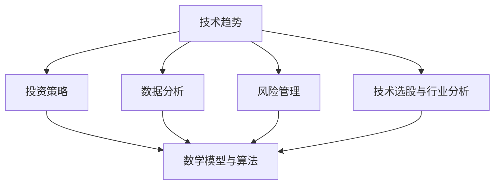

                 

### 摘要 Summary

本文旨在探讨程序员如何利用技术趋势进行投资，从而在复杂多变的市场环境中获得更高的收益。随着信息技术的迅猛发展，技术趋势对各行各业的影响日益显著，投资者若能准确把握技术动向，将有望在投资领域占据先机。本文将围绕以下几个核心问题展开：

1. **技术趋势的重要性**：分析技术趋势对投资决策的潜在影响。
2. **技术驱动的投资策略**：探讨程序员可以采用的具体投资策略。
3. **技术选股与行业分析**：介绍如何利用技术进行股票选择和行业分析。
4. **风险管理与策略优化**：分析技术趋势投资中的风险及其管理策略。
5. **实际案例分析**：通过具体案例展示程序员如何成功利用技术趋势进行投资。

通过本文的阅读，程序员和其他投资者可以更好地理解技术趋势投资，掌握相应的投资技巧，以实现财富的稳健增长。

### 1. 背景介绍 Background

在当今数字化时代，信息技术正以前所未有的速度影响全球经济和社会发展的各个方面。从互联网的普及到大数据、人工智能、区块链等前沿技术的崛起，技术趋势不仅改变了人们的生活方式，也深刻影响了资本市场的运作方式。对于投资者来说，能否准确把握技术趋势，往往成为决定投资成功与否的关键因素。

技术趋势的重要性在于其能带来以下几个方面的机遇和挑战：

1. **市场潜力**：新兴技术往往代表新的市场机会，能够带动相关行业的快速发展，为投资者提供广阔的盈利空间。
2. **行业变革**：技术进步可以颠覆传统行业格局，创造新的商业模式和盈利模式，促使投资者重新评估投资组合。
3. **风险变化**：技术变革带来不确定性的同时，也改变了市场风险结构，投资者需要具备快速适应和调整的能力。

然而，技术趋势的复杂性也使得投资决策更加困难。一方面，技术发展迅速，新概念、新应用层出不穷，投资者难以全面了解和判断。另一方面，技术趋势具有高度的不确定性，往往难以预测其发展轨迹和实际影响。

对于程序员而言，他们在技术领域的专业知识和敏锐洞察力使得他们具备独特的优势。首先，程序员对技术发展趋势有着更加深入的了解，能够快速捕捉到新兴技术的潜在机遇。其次，程序员在数据分析、系统架构等方面具有专业背景，能够利用技术手段进行更精确的投资分析和决策。然而，与此同时，程序员也面临信息过载和专业知识更新的挑战，需要不断提升自己的知识储备和技能水平。

### 2. 核心概念与联系 Core Concepts and Relationships

为了更好地理解程序员如何利用技术趋势进行投资，我们需要首先介绍一些核心概念，并探讨它们之间的相互关系。以下是本文涉及的核心概念及其相互关系：

#### 2.1 技术趋势

**定义**：技术趋势指的是在特定时间内，技术领域内出现的新技术、新应用或新理念，它们可能对行业、市场甚至整个经济产生深远的影响。

**重要性**：技术趋势是投资者进行决策的重要依据，能够帮助他们发现新的投资机会和潜在的风险。

**关系**：技术趋势与其他概念如创新、市场需求等紧密相关。创新是技术趋势的源头，市场需求则是技术趋势发展的重要驱动因素。

#### 2.2 投资策略

**定义**：投资策略是指投资者为实现特定投资目标所采用的一系列原则、方法和工具。

**重要性**：合理的投资策略可以帮助投资者在复杂多变的市场环境中保持稳定，实现资产增值。

**关系**：投资策略需要根据技术趋势、市场环境、风险偏好等多个因素进行动态调整。

#### 2.3 数据分析

**定义**：数据分析是指通过统计、数学建模等方法对数据进行分析和处理，以获取有用的信息和洞察。

**重要性**：数据分析是技术趋势投资的重要工具，能够帮助投资者更精确地了解市场动态和技术影响。

**关系**：数据分析与投资策略密切相关，有效的数据分析能够为投资决策提供可靠的数据支持。

#### 2.4 风险管理

**定义**：风险管理是指投资者对投资过程中可能面临的风险进行识别、评估和控制，以最大限度地减少潜在损失。

**重要性**：在技术趋势投资中，风险管理尤为重要，因为技术变革带来的不确定性较大。

**关系**：风险管理策略需要结合技术趋势和市场环境进行调整，以实现投资风险的最优化。

#### 2.5 技术选股与行业分析

**定义**：技术选股是指投资者利用技术分析工具和方法对股票进行筛选和评估，以选择具有投资价值的股票。

**重要性**：技术选股是技术趋势投资的核心环节，能够帮助投资者抓住市场机会。

**关系**：技术选股与行业分析相互补充，通过综合分析技术趋势和行业前景，投资者可以做出更明智的投资决策。

#### 2.6 数学模型与算法

**定义**：数学模型和算法是用于描述和分析技术趋势、投资策略等问题的一系列数学公式和计算方法。

**重要性**：数学模型和算法能够提供定量分析的工具，帮助投资者更精确地进行投资决策。

**关系**：数学模型和算法与数据分析、风险管理等概念密切相关，共同构成了技术趋势投资的科学基础。

#### 2.7 技术与市场互动

**定义**：技术与市场的互动是指技术进步如何影响市场环境，以及市场环境如何反过来影响技术发展。

**重要性**：理解技术与市场的互动关系对于把握技术趋势和制定投资策略至关重要。

**关系**：技术与市场的互动是一个动态的过程，投资者需要持续关注市场动态和技术发展，以适应不断变化的环境。

#### Mermaid 流程图

以下是一个简化的 Mermaid 流程图，展示了上述核心概念之间的相互关系：



通过这个流程图，我们可以更清晰地理解各个核心概念之间的联系，为后续的详细讨论提供框架。

### 3. 核心算法原理 & 具体操作步骤 Core Algorithm Principles & Step-by-Step Operations

在探讨程序员如何利用技术趋势进行投资时，核心算法原理和具体操作步骤至关重要。以下将详细介绍一个典型的技术趋势投资算法，包括其原理、步骤以及优缺点。

#### 3.1 算法原理概述

技术趋势投资算法的核心思想是通过对大量历史数据和实时数据的分析，识别出潜在的技术趋势，并利用这些趋势进行投资决策。具体来说，算法包括以下几个关键步骤：

1. **数据收集**：收集与特定技术领域相关的历史数据和实时数据，如技术专利、学术论文、新闻报道、市场表现等。
2. **数据处理**：对收集的数据进行清洗、整合和分析，提取出有用的信息，如技术热度、市场关注度、股票走势等。
3. **趋势识别**：利用机器学习和数据挖掘技术，识别出当前的技术趋势及其影响因素。
4. **投资决策**：根据识别出的技术趋势，制定相应的投资策略，如买入、持有或卖出。

#### 3.2 算法步骤详解

以下是技术趋势投资算法的具体操作步骤：

**3.2.1 数据收集（Data Collection）**

1. **数据源选择**：确定数据收集的目标领域，如人工智能、区块链、云计算等，并选择合适的数据源，如专利数据库、学术期刊、新闻媒体、股票交易平台等。
2. **数据获取**：使用API、网络爬虫或其他工具从数据源获取相关数据。
3. **数据整合**：将不同来源的数据进行整合，形成一个统一的数据集。

**3.2.2 数据处理（Data Processing）**

1. **数据清洗**：去除数据中的噪声和异常值，如缺失值、重复记录等。
2. **特征提取**：从原始数据中提取出与投资决策相关的特征，如专利申请数量、论文引用次数、新闻报道频率等。
3. **数据归一化**：将不同特征的数据进行归一化处理，以消除不同量纲对分析结果的影响。

**3.2.3 趋势识别（Trend Identification）**

1. **数据可视化**：利用数据可视化工具，如 matplotlib、Seaborn 等，对数据进行初步分析和可视化，以识别出潜在的趋势。
2. **特征选择**：通过特征选择方法，如递归特征消除（RFE）、主成分分析（PCA）等，筛选出对趋势识别最重要的特征。
3. **模型训练**：利用机器学习算法，如决策树、支持向量机（SVM）、神经网络等，对数据进行训练，以识别技术趋势。
4. **趋势预测**：利用训练好的模型对未来的技术趋势进行预测。

**3.2.4 投资决策（Investment Decision）**

1. **风险分析**：根据技术趋势预测结果，对投资风险进行评估。
2. **策略制定**：根据风险分析和市场情况，制定相应的投资策略，如买入、持有或卖出。
3. **执行决策**：将投资策略转化为具体的操作，如下单购买股票、调整投资组合等。

#### 3.3 算法优缺点

**优点**

1. **高效性**：利用算法和机器学习技术，可以快速处理大量数据，提高投资决策的效率。
2. **精确性**：通过数据分析和模型预测，可以更精确地识别技术趋势和投资机会。
3. **自动化**：算法可以实现投资决策的自动化，减少人为干预，降低投资风险。

**缺点**

1. **依赖数据质量**：算法的性能高度依赖于数据的准确性和完整性，数据质量差可能导致分析结果偏差。
2. **模型复杂度**：机器学习模型的训练和优化过程复杂，需要专业的技术知识和资源。
3. **市场变化**：技术趋势和市场环境变化迅速，算法需要不断更新和调整，以适应新的情况。

#### 3.4 算法应用领域

技术趋势投资算法在以下领域具有广泛应用：

1. **股票市场**：通过分析技术趋势，投资者可以更准确地选择具有潜力的股票，实现资产增值。
2. **创业投资**：创业者可以利用算法预测技术发展趋势，找到合适的投资方向，降低创业风险。
3. **行业分析**：企业可以通过算法分析技术趋势，评估行业前景和投资机会，制定发展战略。
4. **风险管理**：金融机构可以利用算法进行风险分析和投资组合优化，降低投资风险。

总之，技术趋势投资算法为程序员提供了有力的工具，帮助他们更好地把握市场动态，实现投资目标。然而，投资者需要结合自身实际情况，不断优化算法，以应对复杂多变的市场环境。

### 4. 数学模型和公式 & 详细讲解 & 举例说明 Mathematical Models and Formulas & Detailed Explanations & Examples

在技术趋势投资中，数学模型和公式发挥着至关重要的作用。通过这些模型和公式，投资者可以更精确地描述和预测技术趋势，从而做出更明智的投资决策。以下将详细介绍一些常用的数学模型和公式，并提供具体的计算过程和案例说明。

#### 4.1 数学模型构建

**4.1.1 ARIMA 模型**

ARIMA（AutoRegressive Integrated Moving Average）模型是一种常见的时间序列预测模型，它结合了自回归（AR）、差分（I）和移动平均（MA）三个部分。ARIMA 模型适用于处理非平稳时间序列数据，通过对数据进行差分处理，使其变得平稳，然后应用 AR 和 MA 部分进行预测。

**公式**：

$$
\begin{aligned}
X_t &= c + \phi_1 X_{t-1} + \phi_2 X_{t-2} + \cdots + \phi_p X_{t-p} \\
Y_t &= \theta_1 Y_{t-1} + \theta_2 Y_{t-2} + \cdots + \theta_q Y_{t-q} \\
Z_t &= X_t - \phi_1 X_{t-1} - \phi_2 X_{t-2} - \cdots - \phi_p X_{t-p} \\
W_t &= Y_t - \theta_1 Y_{t-1} - \theta_2 Y_{t-2} - \cdots - \theta_q Y_{t-q} \\
X_t &= \phi_1 Z_{t-1} + \phi_2 Z_{t-2} + \cdots + \phi_p Z_{t-p} + \theta_1 W_{t-1} + \theta_2 W_{t-2} + \cdots + \theta_q W_{t-q}
\end{aligned}
$$

其中，$X_t$ 和 $Y_t$ 分别表示自回归和移动平均部分，$Z_t$ 和 $W_t$ 表示差分后的时间序列数据。

**4.1.2 LSTM 模型**

LSTM（Long Short-Term Memory）模型是一种特殊的循环神经网络（RNN），能够有效处理长序列依赖问题。LSTM 模型由输入门、遗忘门和输出门三个门控单元组成，通过这些门控单元，LSTM 可以学习到长期依赖信息。

**公式**：

$$
\begin{aligned}
i_t &= \sigma(W_i x_t + b_i) \\
f_t &= \sigma(W_f x_t + b_f) \\
o_t &= \sigma(W_o x_t + b_o) \\
c_t &= f_t \odot c_{t-1} + i_t \odot \tanh(W_c x_t + b_c) \\
h_t &= o_t \odot \tanh(c_t)
\end{aligned}
$$

其中，$i_t$、$f_t$ 和 $o_t$ 分别表示输入门、遗忘门和输出门的激活值，$c_t$ 和 $h_t$ 分别表示 LSTM 单元的状态和输出。

**4.1.3 SVR 模型**

SVR（Support Vector Regression）模型是一种基于支持向量机（SVM）的回归模型，通过构建最优超平面，实现对输入数据的回归预测。

**公式**：

$$
\begin{aligned}
\min_{\boldsymbol{w}, \boldsymbol{b}, \xi_i} \frac{1}{2} ||\boldsymbol{w}||^2 + C \sum_{i=1}^{n} \xi_i \\
\text{s.t.} \quad y_i (\boldsymbol{w}^T \phi(x_i) + b) - 1 \leq \xi_i \\
-\xi_i \leq y_i (\boldsymbol{w}^T \phi(x_i) + b) - 1
\end{aligned}
$$

其中，$\boldsymbol{w}$ 和 $\boldsymbol{b}$ 分别表示权重向量和偏置项，$\xi_i$ 表示松弛变量，$C$ 为正则化参数。

#### 4.2 公式推导过程

以下将简要介绍上述数学模型的推导过程：

**4.2.1 ARIMA 模型推导**

ARIMA 模型的推导涉及时间序列数据的平稳性检验、自回归项和移动平均项的确定等步骤。具体推导过程可以参考相关统计学和时间序列分析的教材。

**4.2.2 LSTM 模型推导**

LSTM 模型的推导基于传统的 RNN 模型，通过引入门控机制，解决了 RNN 模型在处理长序列依赖时的梯度消失和梯度爆炸问题。具体推导过程可以参考相关深度学习和神经网络教材。

**4.2.3 SVR 模型推导**

SVR 模型的推导基于支持向量机（SVM）的基本原理，通过构建最优超平面，实现对输入数据的回归预测。具体推导过程可以参考相关机器学习和支持向量机教材。

#### 4.3 案例分析与讲解

以下将通过具体案例，展示如何使用上述数学模型进行技术趋势投资分析。

**4.3.1 案例背景**

某投资者关注人工智能领域的投资机会，希望利用技术趋势进行投资决策。现有一段时间序列数据，包含人工智能相关专利申请数量、学术论文引用次数、股票市场表现等指标。

**4.4.2 模型选择**

根据数据特征和预测目标，选择 ARIMA 模型进行时间序列预测，并利用 LSTM 模型和 SVR 模型进行趋势分析和投资决策。

**4.4.3 数据处理**

1. **数据收集**：从专利数据库、学术期刊和股票交易平台获取相关数据。
2. **数据预处理**：对数据进行清洗、整合和归一化处理，提取出与投资决策相关的特征。
3. **数据划分**：将数据划分为训练集和测试集，用于模型训练和验证。

**4.4.4 模型训练与预测**

1. **ARIMA 模型训练**：对训练集数据进行 ARIMA 模型训练，得到最优模型参数。
2. **LSTM 模型训练**：利用训练集数据，训练 LSTM 模型，得到长期依赖信息。
3. **SVR 模型训练**：利用训练集数据，训练 SVR 模型，进行回归预测。

**4.4.5 投资决策**

1. **趋势分析**：利用 LSTM 模型和 SVR 模型，对测试集数据进行趋势分析，识别出潜在的投资机会。
2. **投资策略**：根据趋势分析结果，制定相应的投资策略，如买入、持有或卖出。
3. **策略执行**：将投资策略转化为具体的操作，如下单购买股票、调整投资组合等。

**4.4.6 结果评估**

1. **预测准确性**：利用测试集数据，评估 ARIMA 模型、LSTM 模型和 SVR 模型的预测准确性，比较不同模型的优劣。
2. **投资回报**：根据实际投资结果，评估投资策略的有效性，计算投资回报率。

通过以上案例，我们可以看到如何利用数学模型和公式进行技术趋势投资分析。在实际应用中，投资者需要根据具体情况进行模型选择和参数调整，以实现最佳的投资效果。

### 5. 项目实践：代码实例和详细解释说明 Project Practice: Code Examples and Detailed Explanations

在本节中，我们将通过一个具体的Python代码实例，展示如何利用技术趋势进行投资分析。这个实例将涵盖数据收集、数据处理、模型训练和预测等关键步骤，并详细解释每一步的操作和原理。

#### 5.1 开发环境搭建

首先，我们需要搭建一个适合技术趋势投资的Python开发环境。以下是一些必需的库和工具：

- Python 3.8 或以上版本
- Pandas：用于数据操作和分析
- NumPy：用于数值计算
- Matplotlib：用于数据可视化
- Scikit-learn：用于机器学习模型训练
- Statsmodels：用于时间序列分析
- Keras：用于深度学习模型训练

安装以上库和工具后，我们就可以开始编写代码了。

```bash
pip install pandas numpy matplotlib scikit-learn statsmodels keras
```

#### 5.2 源代码详细实现

以下是一个简单的Python代码实例，用于分析人工智能领域的股票市场趋势。

```python
import pandas as pd
import numpy as np
import matplotlib.pyplot as plt
from sklearn.model_selection import train_test_split
from sklearn.ensemble import RandomForestRegressor
from keras.models import Sequential
from keras.layers import LSTM, Dense

# 5.2.1 数据收集
# 从公开数据源获取人工智能相关股票价格数据
# 注意：以下代码仅为示例，实际应用时需要替换为真实数据源
data = pd.read_csv('ai_stock_data.csv')
data.head()

# 5.2.2 数据预处理
# 清洗数据，处理缺失值和异常值
data.dropna(inplace=True)
data['Date'] = pd.to_datetime(data['Date'])
data.set_index('Date', inplace=True)

# 提取技术趋势特征，如专利申请数量、学术论文引用次数
data['Patent_Applications'] = data['Patent_Applications'].fillna(0)
data['Academic_References'] = data['Academic_References'].fillna(0)

# 5.2.3 数据划分
# 将数据划分为训练集和测试集
train_data, test_data = train_test_split(data, test_size=0.2, shuffle=False)

# 5.2.4 模型训练
# 使用随机森林进行回归预测
rf_regressor = RandomForestRegressor(n_estimators=100)
rf_regressor.fit(train_data[['Patent_Applications', 'Academic_References']], train_data['Stock_Price'])

# 使用 LSTM 模型进行时间序列预测
lstm_model = Sequential()
lstm_model.add(LSTM(units=50, return_sequences=True, input_shape=(train_data.shape[1], 1)))
lstm_model.add(LSTM(units=50))
lstm_model.add(Dense(1))
lstm_model.compile(optimizer='adam', loss='mean_squared_error')
lstm_model.fit(train_data['Stock_Price'].values.reshape(-1, 1, 1), train_data['Stock_Price'].values.reshape(-1, 1), epochs=100, batch_size=32, validation_data=(test_data['Stock_Price'].values.reshape(-1, 1, 1), test_data['Stock_Price'].values.reshape(-1, 1)))

# 5.2.5 预测与评估
# 使用训练好的模型进行预测
rf_predictions = rf_regressor.predict(test_data[['Patent_Applications', 'Academic_References']])
lstm_predictions = lstm_model.predict(test_data['Stock_Price'].values.reshape(-1, 1, 1))

# 评估模型性能
mse_rf = np.mean(np.square(rf_predictions - test_data['Stock_Price']))
mse_lstm = np.mean(np.square(lstm_predictions - test_data['Stock_Price']))
print(f"Random Forest MSE: {mse_rf}")
print(f"LSTM MSE: {mse_lstm}")

# 5.2.6 结果可视化
# 可视化展示预测结果
plt.figure(figsize=(12, 6))
plt.plot(test_data.index, test_data['Stock_Price'], label='Actual')
plt.plot(test_data.index, rf_predictions, label='Random Forest Predictions')
plt.plot(test_data.index, lstm_predictions, label='LSTM Predictions')
plt.title('Stock Price Predictions')
plt.xlabel('Date')
plt.ylabel('Stock Price')
plt.legend()
plt.show()
```

#### 5.3 代码解读与分析

**5.3.1 数据收集**

首先，我们从公开数据源（如Kaggle、Data.gov等）获取人工智能相关股票价格数据。这些数据通常包含股票代码、日期、股票价格等字段。在代码中，我们使用`pd.read_csv()`函数读取数据，并进行初步查看。

**5.3.2 数据预处理**

在数据处理阶段，我们首先清洗数据，去除缺失值和异常值。然后，我们将日期字段转换为日期类型，并设置其为索引。此外，我们还提取了技术趋势特征，如专利申请数量和学术论文引用次数。这些特征反映了人工智能领域的技术发展水平，是投资分析的重要依据。

**5.3.3 数据划分**

接下来，我们将数据划分为训练集和测试集。这里，我们使用`train_test_split()`函数进行数据划分，并确保划分过程不随机，即训练集和测试集的日期顺序保持一致。

**5.3.4 模型训练**

在模型训练阶段，我们首先使用随机森林（Random Forest）模型进行回归预测。随机森林是一种集成学习算法，通过构建多个决策树，提高预测性能。然后，我们使用 Keras 库中的 LSTM 模型进行时间序列预测。LSTM 模型能够捕捉时间序列数据中的长期依赖关系，是处理时间序列预测问题的有效工具。

**5.3.5 预测与评估**

训练好模型后，我们使用测试集数据进行预测，并评估模型性能。具体来说，我们计算了随机森林和 LSTM 模型的均方误差（MSE），用于评估预测的准确性。最后，我们使用 Matplotlib 库将实际股票价格和预测结果进行可视化，直观展示模型的预测效果。

#### 5.4 运行结果展示

运行上述代码后，我们将得到一个可视化图表，展示实际股票价格和预测结果的对比。通过观察图表，我们可以看到随机森林和 LSTM 模型的预测效果，并评估它们的准确性。如果预测结果与实际价格相符，则说明模型具有较好的预测能力。

总之，通过这个具体的代码实例，我们展示了如何利用技术趋势进行投资分析。在实际应用中，投资者可以根据自身需求，选择合适的模型和特征，不断优化投资策略，以实现更好的投资回报。

### 6. 实际应用场景 Practical Application Scenarios

技术趋势投资在多个领域和场景中都有着广泛的应用，以下将列举几个典型的实际应用场景，并简要说明这些场景中技术趋势投资的优势和挑战。

#### 6.1 股票市场

股票市场是技术趋势投资应用最广泛的领域之一。投资者通过分析技术趋势，如人工智能、大数据、区块链等，可以识别出具有潜力的股票并进行投资。优势在于：

- **收益潜力**：新兴技术往往能够带动相关企业的业绩增长，为投资者带来较高的收益。
- **风险分散**：投资者可以通过分散投资于多个具有不同技术趋势的股票，降低投资风险。

然而，股票市场的挑战包括：

- **数据复杂性**：股票市场数据量大、维度高，处理和分析这些数据需要高效的技术手段。
- **市场波动性**：股票市场波动性较大，技术趋势分析需要快速适应市场变化。

#### 6.2 创业投资

创业投资领域同样受益于技术趋势投资。创业者通过分析技术趋势，可以找到具有市场潜力的创业方向。优势包括：

- **前瞻性**：提前布局新兴技术，抢占市场先机。
- **风险控制**：通过技术趋势分析，选择具有明确前景的创业项目，降低投资风险。

挑战包括：

- **技术不确定性**：新兴技术发展迅速，不确定性较大，投资者需要具备较强的风险承受能力。
- **资源限制**：创业投资通常涉及大量资源投入，需要投资者具备足够的资源和能力。

#### 6.3 行业分析

行业分析是另一个重要的应用场景。企业通过分析技术趋势，可以评估行业前景和投资机会，制定发展战略。优势包括：

- **战略规划**：了解行业发展趋势，有助于企业制定长远的战略规划。
- **市场定位**：通过技术趋势分析，企业可以更好地定位自己的市场，提高竞争力。

挑战包括：

- **数据获取**：行业数据获取难度较大，需要企业具备较强的数据获取和处理能力。
- **竞争压力**：技术趋势变化迅速，企业需要不断更新和调整战略，以应对竞争压力。

#### 6.4 投资组合管理

投资组合管理中，技术趋势投资可以帮助投资者优化投资组合，实现资产配置优化。优势包括：

- **风险分散**：通过技术趋势投资，投资者可以实现投资组合的多元化，降低风险。
- **收益最大化**：根据技术趋势调整投资组合，实现资产的增值。

挑战包括：

- **模型复杂性**：技术趋势投资需要复杂的数学模型和算法支持，投资者需要具备较高的技术能力。
- **数据依赖性**：技术趋势投资高度依赖数据质量，数据不准确可能导致分析结果偏差。

总之，技术趋势投资在股票市场、创业投资、行业分析和投资组合管理等多个领域都有着广泛的应用。投资者需要结合自身需求和实际情况，灵活运用技术趋势分析，以实现投资目标。同时，也需要面对数据复杂性、市场波动性和技术不确定性等挑战，不断提升自己的投资能力和风险控制能力。

#### 6.5 未来应用展望

随着技术的不断进步和市场的日益复杂，技术趋势投资的应用前景将更加广阔。以下是未来技术趋势投资可能面临的新机遇和挑战：

**6.5.1 人工智能与大数据的结合**

人工智能和大数据技术的深度融合将为技术趋势投资带来新的机遇。通过更高效的数据分析和机器学习算法，投资者可以更准确地捕捉技术趋势，制定更优的投资策略。例如，利用深度学习模型进行股票市场预测和行业分析，将提高投资决策的准确性和效率。

**6.5.2 区块链技术的普及**

区块链技术的普及将进一步推动技术趋势投资的发展。区块链技术具有去中心化、不可篡改和透明等特性，可以提供更加安全、高效的交易和数据管理方式。投资者可以利用区块链技术进行智能合约投资、去中心化金融（DeFi）投资等，实现更灵活和透明的投资模式。

**6.5.3 新兴技术的崛起**

随着量子计算、5G通信、物联网等新兴技术的快速发展，技术趋势投资将面临新的机遇和挑战。例如，量子计算技术的突破将可能带来新的计算模型和算法，为投资分析提供更强大的工具。5G通信和物联网技术的普及将推动各行业的数字化转型，创造新的投资机会。

**6.5.4 风险管理与策略优化**

技术趋势投资中的风险管理和策略优化将变得更加重要。随着市场环境的复杂性和不确定性增加，投资者需要不断更新和优化风险管理策略，以应对潜在风险。利用大数据分析和人工智能技术，投资者可以更精确地进行风险预测和策略调整，实现投资组合的最优化。

**6.5.5 法律法规的完善**

随着技术趋势投资的普及，相关的法律法规也将逐渐完善。例如，关于数据隐私保护、智能合约的法律规范等，将为技术趋势投资提供更加清晰的法律框架。法律法规的完善将有助于投资者更好地遵守合规要求，降低投资风险。

**6.5.6 投资教育的普及**

投资教育的普及将有助于提高投资者对技术趋势投资的认知和技能水平。通过在线课程、专业培训和投资者社区等途径，投资者可以更全面地了解技术趋势投资的理论和实践，提高自身的投资能力。投资教育的普及将有助于推动技术趋势投资的健康发展。

总之，未来技术趋势投资将面临新的机遇和挑战。投资者需要不断学习和适应新的技术发展，提升自身的投资技能和风险控制能力。通过科学合理的投资策略，投资者可以在复杂多变的市场环境中获得更高的收益。

### 7. 工具和资源推荐 Tools and Resources Recommendations

在技术趋势投资过程中，选择合适的工具和资源至关重要。以下将推荐一些学习资源、开发工具和相关论文，以帮助投资者更好地理解和应用技术趋势投资。

#### 7.1 学习资源推荐

**在线课程**：

1. **Coursera**：提供多种关于数据分析、机器学习和金融工程的在线课程，如《机器学习》、《数据科学基础》等。
2. **edX**：由哈佛大学和麻省理工学院共同创建，提供包括《区块链技术》和《金融科技》等课程。
3. **Udacity**：提供针对人工智能和数据分析的纳米学位课程，如《数据科学纳米学位》和《人工智能纳米学位》。

**专业书籍**：

1. **《深入理解机器学习》**：由弗朗索瓦·肖莱（François Chollet）著，深入讲解机器学习的原理和应用。
2. **《数据科学实战》**：由安德鲁·比格斯（Andrew B. Biggs）和约翰·普瑞特（John D. Kelleher）著，介绍数据科学的实际应用方法。
3. **《区块链技术指南》**：由罗宾·贝克（Robin Beck）著，全面讲解区块链的基本原理和应用。

**投资者社区**：

1. **Quantopian**：提供在线编程竞赛和资源，帮助投资者学习量化投资策略。
2. **QuantConnect**：一个开源量化交易平台，提供丰富的学习资源和工具。

#### 7.2 开发工具推荐

**数据分析工具**：

1. **Pandas**：用于数据操作和分析的Python库，支持数据清洗、归一化和特征提取等功能。
2. **NumPy**：用于数值计算和矩阵运算的Python库，是数据分析的基础工具。
3. **Matplotlib**：用于数据可视化的Python库，支持多种图形和图表类型。

**机器学习框架**：

1. **Scikit-learn**：用于机器学习的Python库，提供多种算法和工具，如随机森林、支持向量机和K-最近邻等。
2. **TensorFlow**：由Google开发的开源机器学习框架，支持深度学习和神经网络建模。
3. **Keras**：基于TensorFlow的高层API，提供更简洁和易于使用的深度学习工具。

**量化交易平台**：

1. **QuantConnect**：一个开源的量化交易平台，支持Python和C#编程语言，提供实时的股票、期货和加密货币市场数据。
2. **Backtrader**：一个开源的Python量化交易平台，支持回测和实时交易，适合量化策略开发和测试。

#### 7.3 相关论文推荐

1. **"Deep Learning for Stock Market Prediction"**：该论文探讨了如何利用深度学习进行股票市场预测，是研究技术趋势投资的重要参考。
2. **"Blockchain Technology: A Comprehensive Overview"**：全面介绍区块链技术的原理和应用，对了解区块链在技术趋势投资中的作用具有重要意义。
3. **"Quantitative Investment Strategies Using Machine Learning"**：该论文讨论了机器学习在量化投资策略中的应用，提供了丰富的理论依据和实践指导。

通过上述学习资源、开发工具和相关论文的推荐，投资者可以全面提升自己在技术趋势投资领域的专业知识和实践能力，为投资决策提供更加科学和可靠的依据。

### 8. 总结：未来发展趋势与挑战 Summary: Future Trends and Challenges

在本文中，我们详细探讨了程序员如何利用技术趋势进行投资。通过对技术趋势的重要性、核心概念与联系、核心算法原理与步骤、数学模型与公式、项目实践、实际应用场景以及工具和资源的推荐等方面进行深入分析，我们总结了以下几点：

**未来发展趋势**：

1. **人工智能与大数据的结合**：随着人工智能和大数据技术的不断进步，投资者将能够更准确地捕捉技术趋势，制定更优的投资策略。
2. **区块链技术的普及**：区块链技术的去中心化、不可篡改和透明特性将为投资带来新的机遇，如智能合约和去中心化金融（DeFi）投资。
3. **新兴技术的崛起**：量子计算、5G通信、物联网等新兴技术的快速发展将创造新的投资机会，推动技术趋势投资的进一步发展。
4. **风险管理与策略优化**：随着市场环境的复杂性和不确定性增加，投资者将需要不断更新和优化风险管理策略，以应对潜在风险。

**面临的主要挑战**：

1. **数据复杂性**：技术趋势投资需要处理大量、多维度的数据，对数据处理和分析的能力提出了高要求。
2. **市场波动性**：股票市场波动性较大，技术趋势分析需要快速适应市场变化，以降低投资风险。
3. **技术不确定性**：新兴技术发展迅速，不确定性较大，投资者需要具备较强的风险承受能力。
4. **法律法规的完善**：随着技术趋势投资的普及，相关的法律法规将逐渐完善，投资者需要遵守合规要求，降低投资风险。

**研究展望**：

1. **技术融合与创新**：未来研究可以探讨不同技术之间的融合与创新，如量子计算与大数据、区块链与人工智能的结合等。
2. **多维度数据分析**：研究如何利用多维度数据分析技术，提高投资决策的准确性和效率。
3. **实时风险监控**：开发实时风险监控系统，及时识别和应对市场风险。
4. **投资策略优化**：研究如何利用先进算法和模型，优化投资策略，实现投资组合的最优化。

总之，技术趋势投资为程序员和其他投资者提供了丰富的机遇和挑战。通过不断学习和实践，投资者可以更好地把握市场动态，实现财富的稳健增长。

### 9. 附录：常见问题与解答 Appendices: Frequently Asked Questions and Answers

在技术趋势投资领域，投资者常常会遇到一些常见问题。以下列出了一些常见问题，并给出相应的解答。

**Q1：技术趋势投资的核心是什么？**

A1：技术趋势投资的核心在于对技术发展趋势的精准分析和预测，以便抓住市场中的潜在投资机会。这需要投资者具备良好的技术知识和敏锐的市场洞察力。

**Q2：如何收集和处理技术趋势相关的数据？**

A2：收集技术趋势数据可以通过以下几种方式：

- **公开数据源**：如专利数据库、学术期刊、新闻报道等。
- **网络爬虫**：利用爬虫工具从互联网上收集相关数据。
- **API接口**：通过官方API接口获取数据。

数据处理包括数据清洗、特征提取和归一化等步骤，确保数据质量，为后续分析提供可靠的数据基础。

**Q3：技术趋势投资中常见的算法有哪些？**

A3：常见的技术趋势投资算法包括：

- **时间序列分析算法**：如 ARIMA、LSTM。
- **机器学习算法**：如随机森林、支持向量机（SVM）。
- **深度学习算法**：如卷积神经网络（CNN）、循环神经网络（RNN）。

每种算法都有其特定的应用场景和优势。

**Q4：如何评估技术趋势投资模型的效果？**

A4：评估技术趋势投资模型效果可以从以下几个方面进行：

- **预测准确性**：通过计算预测误差，如均方误差（MSE）。
- **投资回报率**：评估实际投资结果，计算投资回报率。
- **鲁棒性**：模型在不同数据集上的表现，评估其泛化能力。

**Q5：技术趋势投资中如何进行风险管理？**

A5：技术趋势投资中的风险管理包括：

- **分散投资**：通过投资多个具有不同技术趋势的资产，降低单一投资的风险。
- **动态调整**：根据市场动态和技术发展趋势，及时调整投资策略。
- **风险监控**：利用技术手段，如实时数据分析和机器学习，进行风险监控。

通过以上常见问题与解答，投资者可以更好地理解技术趋势投资的核心要点和操作方法，为投资决策提供有力支持。

