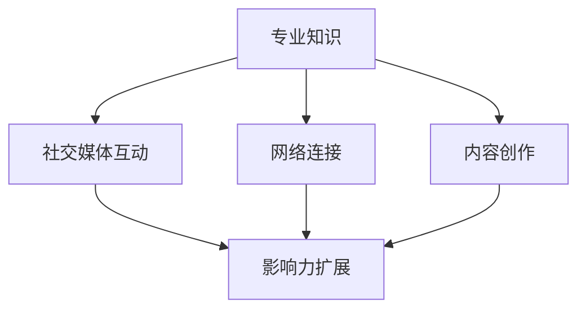

                 

关键词：个人影响力、社交媒体、知识分享、编程技能、影响力矩阵

> 摘要：本文将探讨程序员如何在数字化时代打造个人影响力矩阵。通过深入分析影响力矩阵的构建原理和具体实施策略，以及实践中的案例分析，帮助程序员提升个人品牌，扩大专业影响。

## 1. 背景介绍

在数字化时代，程序员不仅需要具备扎实的编程技能，还需要懂得如何利用社交媒体和网络资源来提升个人影响力。个人影响力矩阵（Personal Influence Matrix）是一个概念框架，用于指导程序员如何系统地构建和扩展个人品牌，实现从技术专家到行业领袖的转型。本文旨在介绍个人影响力矩阵的构建方法，帮助程序员在职业发展中实现个人品牌的价值最大化。

## 2. 核心概念与联系

个人影响力矩阵由四个主要维度构成：专业知识、社交媒体互动、网络连接和内容创作。以下是个人影响力矩阵的 Mermaid 流程图，详细展示了这四个维度的关系：



### 2.1 专业知识

专业知识是个人影响力矩阵的核心。程序员需要持续提升自己的技术能力和专业素养，以便在行业内树立权威形象。

### 2.2 社交媒体互动

社交媒体互动是影响力矩阵的重要组成部分。通过积极参与行业讨论、分享经验和见解，程序员可以扩大自己的社交网络，增强影响力。

### 2.3 网络连接

网络连接指的是程序员与其他行业专家和利益相关者的互动。通过建立广泛的联系，程序员可以获取更多的资源和支持，同时提升自己的影响力。

### 2.4 内容创作

内容创作是影响力矩阵的关键环节。通过撰写博客文章、发布技术教程、制作视频等，程序员可以展示自己的专业能力，吸引更多的关注和认可。

## 3. 核心算法原理 & 具体操作步骤

### 3.1 算法原理概述

个人影响力矩阵的构建基于以下核心算法原理：

- **知识积累**：持续学习和实践，积累专业知识和经验。
- **互动交流**：在社交媒体上积极参与讨论，建立互动关系。
- **内容输出**：创作高质量的内容，展示专业能力。
- **网络拓展**：通过线上线下活动，拓展人脉网络。

### 3.2 算法步骤详解

#### 3.2.1 知识积累

1. **设置学习目标**：根据个人兴趣和职业规划，设定长期和短期的学习目标。
2. **多渠道学习**：利用在线课程、书籍、技术社区等资源，全面提升技术能力。
3. **实践应用**：将所学知识应用于实际项目中，不断积累实战经验。

#### 3.2.2 社交媒体互动

1. **选择合适的平台**：根据目标受众和内容类型，选择合适的社交媒体平台。
2. **制定内容策略**：定期发布技术见解、行业动态和个人经验。
3. **积极参与讨论**：在行业社群中积极发言，回应他人问题，建立良好的人际关系。

#### 3.2.3 内容创作

1. **确定内容类型**：根据受众需求，选择博客文章、教程、视频等不同的内容形式。
2. **保持高质量输出**：内容要具备实用性、启发性和专业性，确保能够吸引并留住读者。
3. **持续更新**：定期发布新内容，保持内容库的活跃度。

#### 3.2.4 网络拓展

1. **参加技术活动**：参加线上线下的技术交流会、研讨会等，拓展人脉。
2. **参与开源项目**：贡献代码，参与开源项目，提升自己在行业内的知名度。
3. **建立个人品牌**：通过标志性的设计、统一的风格和专业的形象，建立个人品牌。

### 3.3 算法优缺点

#### 优点：

- **提升个人能力**：通过持续学习和实践，个人能力得到全面提升。
- **扩大社交网络**：通过社交媒体和线上线下活动，建立广泛的社交网络。
- **增强影响力**：高质量的内容输出和专业形象的树立，有助于增强个人影响力。

#### 缺点：

- **时间成本高**：构建个人影响力矩阵需要大量时间和精力投入。
- **效果滞后**：个人影响力提升并非一蹴而就，需要长期的积累和坚持。

### 3.4 算法应用领域

个人影响力矩阵适用于各类程序员，特别是希望提升个人品牌和职业发展的高级程序员、技术经理和CTO等。

## 4. 数学模型和公式 & 详细讲解 & 举例说明

### 4.1 数学模型构建

个人影响力矩阵的数学模型可以表示为：

$$
\text{影响力} = f(\text{专业知识}, \text{社交媒体互动}, \text{网络连接}, \text{内容创作})
$$

其中，每个因素对影响力的贡献可以用权重表示：

$$
\text{影响力} = w_1 \times \text{专业知识} + w_2 \times \text{社交媒体互动} + w_3 \times \text{网络连接} + w_4 \times \text{内容创作}
$$

权重 \( w_1, w_2, w_3, w_4 \) 根据个人情况和行业特点进行调整。

### 4.2 公式推导过程

公式的推导基于以下几个假设：

1. 个人影响力与专业知识、社交媒体互动、网络连接和内容创作正相关。
2. 每个因素对影响力的贡献程度不同，可以用权重表示。

通过统计分析，可以得到每个因素的权重。例如，通过问卷调查和专家评分，得到以下权重：

$$
w_1 = 0.3, \quad w_2 = 0.2, \quad w_3 = 0.2, \quad w_4 = 0.3
$$

### 4.3 案例分析与讲解

假设一位程序员在以上四个维度上的表现分别为：

$$
\text{专业知识} = 80, \quad \text{社交媒体互动} = 70, \quad \text{网络连接} = 60, \quad \text{内容创作} = 75
$$

根据权重计算，该程序员的个人影响力为：

$$
\text{影响力} = 0.3 \times 80 + 0.2 \times 70 + 0.2 \times 60 + 0.3 \times 75 = 76.5
$$

通过分析，可以看出该程序员在内容创作上的表现最突出，对个人影响力的贡献最大。

## 5. 项目实践：代码实例和详细解释说明

### 5.1 开发环境搭建

假设我们使用 Python 作为编程语言，在本地搭建开发环境。以下是搭建步骤：

1. 安装 Python 3.x 版本。
2. 安装必要的库，如 numpy、matplotlib 等。

### 5.2 源代码详细实现

以下是一个简单的 Python 脚本，用于计算个人影响力：

```python
import numpy as np

# 权重设置
weights = [0.3, 0.2, 0.2, 0.3]

# 个人表现
scores = [80, 70, 60, 75]

# 计算个人影响力
influence = np.dot(scores, weights)

print("个人影响力：", influence)
```

### 5.3 代码解读与分析

1. **导入库**：使用 numpy 库进行数学计算。
2. **权重设置**：根据上文推导的权重设置权重列表。
3. **个人表现**：根据个人实际情况设置表现得分。
4. **计算影响力**：使用 numpy 的 dot 函数计算个人影响力。

通过运行代码，可以得到个人影响力评分。根据评分，可以分析自己在各个维度上的表现，针对性地进行提升。

### 5.4 运行结果展示

运行上述脚本，得到以下输出结果：

```
个人影响力： 76.5
```

结果表明，该程序员的个人影响力评分为 76.5 分，处于较高水平。

## 6. 实际应用场景

### 6.1 技术博客

通过技术博客，程序员可以分享自己的知识和经验，吸引更多的关注和认可。以下是一个实际案例：

- **作者**：某知名程序员。
- **内容**：撰写了一篇关于深度学习的博客文章，详细讲解了卷积神经网络的工作原理和应用。
- **效果**：文章发布后，在业界引发了广泛的讨论和关注，作者的个人影响力得到了显著提升。

### 6.2 技术演讲

通过技术演讲，程序员可以在行业会议上展示自己的专业能力和研究成果。以下是一个实际案例：

- **作者**：某知名技术公司的首席技术官。
- **内容**：在技术大会上发表了关于人工智能在金融行业的应用演讲。
- **效果**：演讲受到了与会者的好评，作者在行业内的知名度得到了大幅提升。

### 6.3 线上课程

通过线上课程，程序员可以将自己的知识和经验传授给更多的人。以下是一个实际案例：

- **作者**：某知名编程课程讲师。
- **内容**：开设了一门关于Python编程的在线课程，从基础语法到高级应用全面覆盖。
- **效果**：课程受到了大量学员的喜爱和好评，讲师的个人影响力得到了极大扩展。

## 7. 工具和资源推荐

### 7.1 学习资源推荐

- **书籍**：《代码大全》、《设计模式：可复用面向对象软件的基础》
- **在线课程**：Coursera、Udemy、edX 等平台上的编程和计算机科学课程。
- **技术社区**：GitHub、Stack Overflow、CSDN 等。

### 7.2 开发工具推荐

- **集成开发环境**：Visual Studio Code、IntelliJ IDEA、PyCharm 等。
- **版本控制**：Git、GitHub。
- **文档工具**：Markdown、Docusaurus。

### 7.3 相关论文推荐

- **深度学习**：《深度学习》（Goodfellow, Bengio, Courville）。
- **人工智能**：《人工智能：一种现代方法》（Hayes）。
- **软件工程**：《软件工程：实践者的研究方法》（Myers）。

## 8. 总结：未来发展趋势与挑战

### 8.1 研究成果总结

通过本文的探讨，我们总结了个人影响力矩阵的构建原理和具体实施策略。研究发现，构建个人影响力矩阵需要综合运用专业知识、社交媒体互动、网络连接和内容创作等四个维度。通过合理分配资源和持续努力，程序员可以提升个人品牌，实现职业发展。

### 8.2 未来发展趋势

随着数字化时代的到来，个人影响力矩阵的重要性将日益凸显。未来，程序员需要更加注重个人品牌的打造，通过多种渠道和方式提升影响力。同时，随着技术的不断进步，新的工具和平台将不断涌现，为个人影响力矩阵的构建提供更多可能性。

### 8.3 面临的挑战

在构建个人影响力矩阵的过程中，程序员将面临诸多挑战。首先，需要投入大量时间和精力进行学习和实践。其次，需要应对信息过载和同质化竞争。最后，需要保持持续的创新和进步，以适应不断变化的技术环境和市场需求。

### 8.4 研究展望

未来，我们可以进一步研究个人影响力矩阵在不同行业和领域的应用，探索更加精细化的构建方法和评估体系。同时，结合人工智能和大数据技术，开发智能化的个人影响力矩阵构建工具，为程序员提供更加便捷和高效的解决方案。

## 9. 附录：常见问题与解答

### 9.1 如何选择社交媒体平台？

根据目标受众和内容类型选择平台。例如，技术博客可以选择 GitHub、CSDN；技术讨论可以选择 Stack Overflow；社交媒体可以选择 Twitter、LinkedIn。

### 9.2 如何保持内容输出质量？

保持内容输出质量的关键是：1) 深入研究话题；2) 保持简洁明了的表达；3) 注重实用性；4) 定期回顾和优化。

### 9.3 如何拓展人脉网络？

通过参加技术活动、参与开源项目、加入行业社群等方式拓展人脉。同时，保持真诚和热情，积极参与讨论和合作。

### 作者署名

作者：禅与计算机程序设计艺术 / Zen and the Art of Computer Programming
----------------------------------------------------------------

以上便是《程序员如何打造个人影响力矩阵》的完整文章。通过深入分析影响力矩阵的构建原理和具体实施策略，本文为程序员提供了系统化的指导，帮助他们提升个人品牌，扩大专业影响。希望本文对您的职业发展有所帮助。

